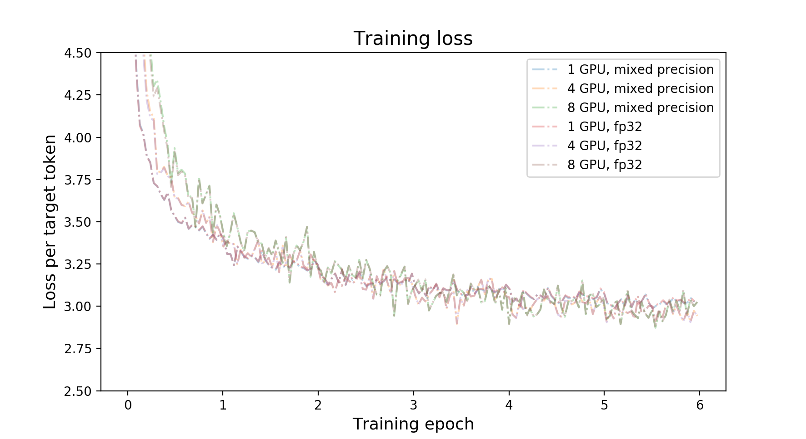
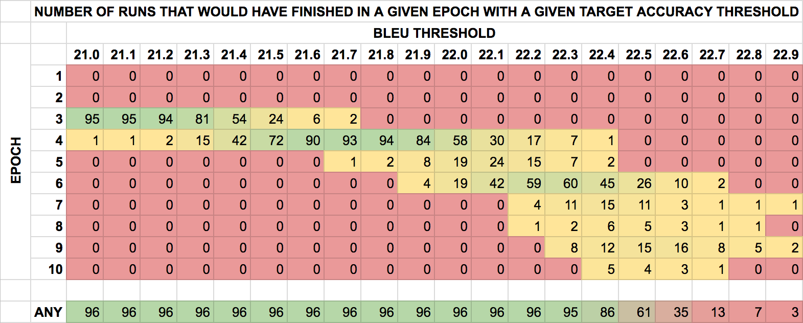

# GNMT v2

## The model
The GNMT v2 model is similar to the one discussed in the [Google's Neural Machine
Translation System: Bridging the Gap between Human and Machine
Translation](https://arxiv.org/abs/1609.08144) paper.

The most important difference between the two models is in the attention
mechanism. In our model, the output from the first LSTM layer of the decoder
goes into the attention module, then the re-weighted context is concatenated
with inputs to all subsequent LSTM layers in the decoder at the current
timestep.

The same attention mechanism is also implemented in the default
GNMT-like models from
[TensorFlow Neural Machine Translation Tutorial](https://github.com/tensorflow/nmt)
and
[NVIDIA OpenSeq2Seq Toolkit](https://github.com/NVIDIA/OpenSeq2Seq).

## Default configuration of the GNMT v2 model

* general:
  * encoder and decoder are using shared embeddings
  * data-parallel multi-gpu training
  * dynamic loss scaling with backoff for Tensor Cores (mixed precision) training
  * trained with label smoothing loss (smoothing factor 0.1)
* encoder:
  * 4-layer LSTM, hidden size 1024, first layer is bidirectional, the rest are
    unidirectional
  * with residual connections starting from 3rd layer
  * uses standard pytorch nn.LSTM layer
  * dropout is applied on input to all LSTM layers, probability of dropout is
    set to 0.2
  * hidden state of LSTM layers is initialized with zeros
  * weights and bias of LSTM layers is initialized with uniform(-0.1, 0.1)
    distribution
* decoder:
  * 4-layer unidirectional LSTM with hidden size 1024 and fully-connected
    classifier
  * with residual connections starting from 3rd layer
  * uses standard pytorch nn.LSTM layer
  * dropout is applied on input to all LSTM layers, probability of dropout is
    set to 0.2
  * hidden state of LSTM layers is initialized with zeros
  * weights and bias of LSTM layers is initialized with uniform(-0.1, 0.1)
    distribution
  * weights and bias of fully-connected classifier is initialized with
    uniform(-0.1, 0.1) distribution
* attention:
  * normalized Bahdanau attention
  * output from first LSTM layer of decoder goes into attention,
  then re-weighted context is concatenated with the input to all subsequent
  LSTM layers of the decoder at the current timestep
  * linear transform of keys and queries is initialized with uniform(-0.1, 0.1),
  normalization scalar is initialized with 1.0 / sqrt(1024),
    normalization bias is initialized with zero
* inference:
  * beam search with default beam size of 5
  * with coverage penalty and length normalization, coverage penalty factor is
    set to 0.1, length normalization factor is set to 0.6 and length
    normalization constant is set to 5.0
  * detokenized BLEU computed by [SacreBLEU](https://github.com/awslabs/sockeye/tree/master/contrib/sacrebleu)
  * [motivation](https://github.com/awslabs/sockeye/tree/master/contrib/sacrebleu#motivation) for choosing SacreBLEU

When comparing the BLEU score there are various tokenization approaches and BLEU
calculation methodologies, ensure to align similar metrics.

Code from this repository can be used to train a larger, 8-layer GNMT v2 model.
Our experiments show that a 4-layer model is significantly faster to train and
yields comparable accuracy on the public
[WMT16 English-German](http://www.statmt.org/wmt16/translation-task.html)
dataset. The number of LSTM layers is controlled by the `num_layers` parameter
in the `train.py` training script.

# Setup
## Requirements
* [PyTorch 19.01-py3 NGC container](https://ngc.nvidia.com/registry/nvidia-pytorch)
* [SacreBLEU 1.2.10](https://pypi.org/project/sacrebleu/1.2.10/)

This repository contains `Dockerfile` which extends the PyTorch NGC container
and encapsulates all dependencies.

For more information about how to get started with NGC containers, see the
following sections from the NVIDIA GPU Cloud Documentation and the Deep Learning
DGX Documentation:
[Getting Started Using NVIDIA GPU Cloud](https://docs.nvidia.com/ngc/ngc-getting-started-guide/index.html),
[Accessing And Pulling From The NGC container registry](https://docs.nvidia.com/deeplearning/dgx/user-guide/index.html#accessing_registry)
and
[Running PyTorch](https://docs.nvidia.com/deeplearning/dgx/pytorch-release-notes/running.html#running).

## Training using mixed precision with Tensor Cores
Before you can train using mixed precision with Tensor Cores, ensure that you
have a
[NVIDIA Volta](https://www.nvidia.com/en-us/data-center/volta-gpu-architecture/)
based GPU. Other platforms might likely work but aren't officially supported.
For information about how to train using mixed precision, see the
[Mixed Precision Training paper](https://arxiv.org/abs/1710.03740)
and
[Training With Mixed Precision documentation](https://docs.nvidia.com/deeplearning/sdk/mixed-precision-training/index.html).

Another option for adding mixed-precision support is available from NVIDIA’s
[APEX](https://github.com/NVIDIA/apex), A PyTorch Extension, that contains
utility libraries, such as AMP, which require minimal network code changes to
leverage Tensor Core performance.

# Quick start guide
Perform the following steps to run the training using the default parameters of
the GNMT v2 model on the *WMT16 English-German* dataset.
### 1. Build and launch the GNMT Docker container
```
bash scripts/docker/build.sh
bash scripts/docker/interactive.sh
```

### 2. Download the training dataset
Download and preprocess the WMT16 English-German dataset. Data will be
downloaded to the `data` directory (on the host). The `data` directory is
mounted to the `/workspace/gnmt/data` location in the Docker container.
```
bash scripts/wmt16_en_de.sh
```

### 3. Run training
By default, the training script will use all available GPUs. The training script
saves only one checkpoint with the lowest value of the loss function on the
validation dataset. All results and logs are saved to the `results` directory
(on the host) or to the `/workspace/gnmt/results` directory (in the container).
By default, the `train.py` script will launch mixed precision training
with Tensor Cores. You can change this behaviour by setting the `--math fp32`
flag for the `train.py` training script.

Launching training on 1, 4 or 8 GPUs:

```
python3 -m launch train.py --seed 2 --train-global-batch-size 1024
```

Launching training on 16 GPUs:

```
python3 -m launch train.py --seed 2 --train-global-batch-size 2048
```

By default the training script will launch training with batch size 128 per GPU.
If specified `--train-global-batch-size` is larger than 128 times the number of
GPUs available for the training then the training script will accumulate
gradients over consecutive iterations and then perform the weight update.
For example 1 GPU training with `--train-global-batch-size 1024` will accumulate
gradients over 8 iterations before doing the weight update with accumulated
gradients.

The training script automatically runs the validation and testing after each
training epoch. The results from the validation and testing are printed to
the standard output (stdout) and saved to log files.

The summary after each training epoch is printed in the following format:
```
Summary: Epoch: 3	Training Loss: 3.1735	Validation Loss: 3.0511	Test BLEU: 21.89
Performance: Epoch: 3  Training: 300155 Tok/s  Validation: 156066 Tok/s
```
The training loss is averaged over an entire training epoch, the validation loss
is averaged over the validation dataset and the BLEU score is computed by
the SacreBLEU package on the test dataset.
Performance is reported in total tokens per second. The result is averaged over
an entire training epoch and summed over all GPUs participating in the training.

# Details
## Getting the data
The GNMT v2 model was trained on the
[WMT16 English-German](http://www.statmt.org/wmt16/translation-task.html) dataset.
Concatenation of the *newstest2015* and *newstest2016* test sets are used as a
validation dataset and the *newstest2014* is used as a testing dataset.

This repository contains the `scripts/wmt16_en_de.sh` download script which will
automatically download and preprocess the training, validation and test
datasets. By default, data will be downloaded to the `data` directory.

Our download script is very similar to the `wmt16_en_de.sh` script from the
[tensorflow/nmt](https://github.com/tensorflow/nmt/blob/master/nmt/scripts/wmt16_en_de.sh)
repository. Our download script contains an extra preprocessing step, which
discards all pairs of sentences which can't be decoded by *latin-1* encoder.
The `scripts/wmt16_en_de.sh` script uses the
[subword-nmt](https://github.com/rsennrich/subword-nmt)
package to segment text into subword units (BPE). By default, the script builds
the shared vocabulary of 32,000 tokens.

In order to test with other datasets, scripts need to be customized accordingly.

## Running training
The default training configuration can be launched by running the
`train.py` training script.
By default, the training script saves only one checkpoint with the lowest value
of the loss function on the validation dataset, an evaluation is performed after
each training epoch. Results are stored in the `results/gnmt_wmt16` directory.

The training script launches data-parallel training with batch size 128 per GPU
on all available GPUs. We have tested reliance on up to 16 GPUs on a single
node.
After each training epoch, the script runs an evaluation
on the validation dataset and outputs a BLEU score on the test dataset
(*newstest2014*). BLEU is computed by the
[SacreBLEU](https://github.com/awslabs/sockeye/tree/master/contrib/sacrebleu)
package. Logs from the training and evaluation are saved to the `results`
directory.

Even though the training script uses all available GPUs, you can change this
behavior by setting the `CUDA_VISIBLE_DEVICES` variable in your environment or
by setting the `NV_GPU` variable at the Docker container launch
([see section "GPU isolation"](https://github.com/NVIDIA/nvidia-docker/wiki/nvidia-docker#gpu-isolation)).

By default, the `train.py` script will launch mixed precision training
with Tensor Cores. You can change this behaviour by setting the `--math fp32`
flag for the `train.py` script.

To view all available options for training, run `python3 train.py --help`.

## Running inference
Inference can be run by launching the `translate.py` inference script, although,
it requires a pre-trained model checkpoint and tokenized input.

The inference script, `translate.py`, supports batched inference. By default, it
launches beam search with beam size of 5, coverage penalty term and length
normalization term. Greedy decoding can be enabled by setting the beam size to 1.

To view all available options for inference, run `python3 translate.py --help`.

## Training Accuracy Results
Results were obtained by running the `train.py` script with the default
batch size = 128 per GPU in the pytorch-19.01-py3 Docker container.

### NVIDIA DGX-1 (8x Tesla V100 16G)
Command used to launch the training:

```
python3 -m launch train.py --seed 2 --train-global-batch-size 1024
```

| **number of GPUs** | **batch size/GPU** | **mixed precision BLEU** | **fp32 BLEU** | **mixed precision training time** | **fp32 training time** |
| --- | --- | ----- | ----- | ------------- | ------------- |
|  1  | 128 | 24.59 | 24.71 | 264.4 minutes | 824.4 minutes |
|  4  | 128 | 24.30 | 24.45 | 89.5 minutes  | 230.8 minutes |
|  8  | 128 | 24.45 | 24.48 | 46.2 minutes  | 116.6 minutes |

### NVIDIA DGX-2 (16x Tesla V100 32G)
Commands used to launch the training:

```
for 1,4,8 GPUs:
python3 -m launch train.py --seed 2 --train-global-batch-size 1024
for 16 GPUs:
python3 -m launch train.py --seed 2 --train-global-batch-size 2048
```

| **number of GPUs** | **batch size/GPU** | **mixed precision BLEU** | **fp32 BLEU** | **mixed precision training time** | **fp32 training time** |
| --- | --- | ----- | ----- | ------------- | ------------- |
| 1   | 128 | 24.59 | 24.71 | 265.0 minutes | 825.1 minutes |
| 4   | 128 | 24.69 | 24.33 | 87.4 minutes  | 216.3 minutes |
| 8   | 128 | 24.50 | 24.47 | 49.6 minutes  | 113.5 minutes |
| 16  | 128 | 24.22 | 24.16 | 26.3 minutes  | 58.6 minutes  |



### Training Stability Test
The GNMT v2 model was trained for 6 epochs, starting from 50 different initial
random seeds. After each training epoch the model was evaluated on the test
dataset and the BLEU score was recorded. The training was performed in the
pytorch-19.01-py3 Docker container on NVIDIA DGX-1 with 8 Tesla V100 16G GPUs.
The following table summarizes results of the stability test.



#### BLEU scores after each training epoch for different initial random seeds
| **epoch** | **average** | **stdev** | **minimum** | **maximum** | **median** |
| --- | ------ | ----- | ------ | ------ | ------ |
|  1  | 19.954 | 0.326 | 18.710 | 20.490 | 20.020 |
|  2  | 21.734 | 0.222 | 21.220 | 22.120 | 21.765 |
|  3  | 22.502 | 0.223 | 21.960 | 22.970 | 22.485 |
|  4  | 23.004 | 0.221 | 22.350 | 23.430 | 23.020 |
|  5  | 24.201 | 0.146 | 23.900 | 24.480 | 24.215 |
|  6  | 24.423 | 0.159 | 24.070 | 24.820 | 24.395 |


## Training Performance Results
All results were obtained by running the `train.py` training script in the
pytorch-19.01-py3 Docker container. Performance numbers (in tokens per second)
were averaged over an entire training epoch.

### NVIDIA DGX-1 (8x Tesla V100 16G)

| **number of GPUs** | **batch size/GPU** | **mixed precision tokens/s** | **fp32 tokens/s** | **mixed precision speedup** | **mixed precision multi-gpu strong scaling** | **fp32 multi-gpu strong scaling** |
| --- | --- | ------ | ------ | ----- | ----- | ----- |
|  1  | 128 | 66050  | 21346  | 3.094 | 1.000  | 1.000|
|  4  | 128 | 196174 | 76083  | 2.578 | 2.970  | 3.564|
|  8  | 128 | 387282 | 153697 | 2.520 | 5.863  | 7.200|


### NVIDIA DGX-2 (16x Tesla V100 32G)

| **number of GPUs** | **batch size/GPU** | **mixed precision tokens/s** | **fp32 tokens/s** | **mixed precision speedup** | **mixed precision multi-gpu strong scaling** | **fp32 multi-gpu strong scaling** |
| --- | --- | ------ | ------- | ----- | ------ | ------ |
|  1  | 128 | 65830  | 22695  | 2.901 | 1.000   | 1.000  |
|  4  | 128 | 200886 | 81224  | 2.473 | 3.052   | 3.579  |
|  8  | 128 | 362612 | 156536 | 2.316 | 5.508   | 6.897  |
| 16  | 128 | 738521 | 314831 | 2.346 | 11.219  | 13.872 |

## Inference Performance Results
All results were obtained by running the `translate.py` script in the
pytorch-19.01-py3 Docker container on NVIDIA DGX-1. Inference benchmark was run
on a single Tesla V100 16G GPU. The benchmark requires a checkpoint from a fully
trained model.

Command to launch the inference benchmark:
```
python3 translate.py --input data/wmt16_de_en/newstest2014.tok.bpe.32000.en \
  --reference data/wmt16_de_en/newstest2014.de --output /tmp/output \
  --model results/gnmt/model_best.pth --batch-size 32 128 512 \
  --beam-size 1 2 5 10 --math fp16 fp32
```

| **batch size** | **beam size** | **mixed precision BLEU** | **fp32 BLEU** | **mixed precision tokens/s** | **fp32 tokens/s** |
| ---- | ----- | ------- | ------- | ---------|-------- |
|  32  |   1   |  23.18  |  23.18  |  23571   |  19462  |
|  32  |   2   |  24.09  |  24.12  |  15303   |  12345  |
|  32  |   5   |  24.63  |  24.62  |  13644   |  7725   |
|  32  |   10  |  24.50  |  24.48  |  11049   |  5359   |
|  128 |   1   |  23.17  |  23.18  |  73429   |  42272  |
|  128 |   2   |  24.07  |  24.12  |  43373   |  23131  |
|  128 |   5   |  24.69  |  24.63  |  29646   |  12525  |
|  128 |   10  |  24.45  |  24.48  |  19100   |  6886   |
|  512 |   1   |  23.17  |  23.18  |  135333  |  48962  |
|  512 |   2   |  24.08  |  24.12  |  74367   |  27308  |
|  512 |   5   |  24.60  |  24.63  |  39217   |  12674  |
|  512 |   10  |  24.54  |  24.48  |  21433   |  6640   |


# Changelog
1. Aug 7, 2018
  * Initial release
2. Dec 4, 2018
  * Added exponential warm-up and step learning rate decay
  * Multi-GPU (distributed) inference and validation
  * Default container updated to PyTorch 18.11-py3
  * General performance improvements
3. Feb 14, 2019
  * Different batching algorithm (bucketing with 5 equal-width buckets)
  * Additional dropouts before first LSTM layer in encoder and in decoder
  * Weight initialization changed to uniform (-0.1, 0.1)
  * Switched order of dropout and concatenation with attention in decoder
  * Default container updated to PyTorch 19.01-py3

# Known issues
None
