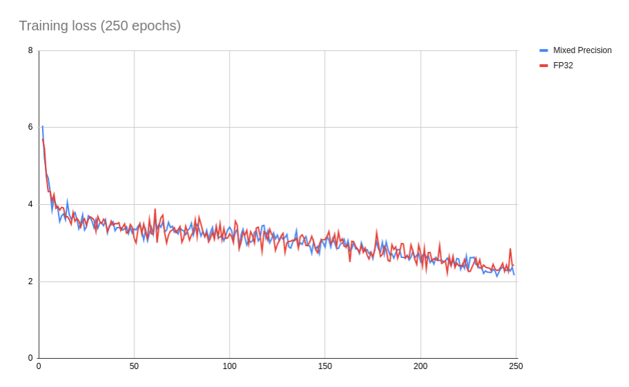

# ResNet-50 v1.5 for TensorFlow

This repository provides a script and recipe to train the ResNet-50 v1.5 model to achieve state-of-the-art accuracy, and is tested and maintained by NVIDIA.

## Table Of Contents
* [Model overview](#model-overview)
    * [Default configuration](#default-configuration)
        * [Optimizer](#optimizer)
        * [Data augmentation](#data-augmentation)
    * [Feature support matrix](#feature-support-matrix)
        * [Features](#features)
    * [Mixed precision training](#mixed-precision-training)
        * [Enabling mixed precision](#enabling-mixed-precision)
        * [Enabling TF32](#enabling-tf32)
* [Setup](#setup)
    * [Requirements](#requirements)
* [Quick Start Guide](#quick-start-guide)
* [Advanced](#advanced)
    * [Scripts and sample code](#scripts-and-sample-code)
    * [Parameters](#parameters)
        * [The `main.py` script](#the-mainpy-script)
    * [Quantization Aware training](#quantization-aware-training)
    * [Inference process](#inference-process)
* [Performance](#performance)
    * [Benchmarking](#benchmarking)
        * [Training performance benchmark](#training-performance-benchmark)
        * [Inference performance benchmark](#inference-performance-benchmark)
    * [Results](#results)
        * [Training accuracy results](#training-accuracy-results)
            * [Training accuracy: NVIDIA DGX A100 (8x A100 40GB)](#training-accuracy-nvidia-dgx-a100-8x-a100-40gb)
            * [Training accuracy: NVIDIA DGX-1 (8x V100 16G)](#training-accuracy-nvidia-dgx-1-8x-v100-16g)
        * [Training performance results](#training-performance-results)
            * [Training performance: NVIDIA DGX A100 (8x A100 40GB)](#training-performance-nvidia-dgx-a100-8x-a100-40gb) 
            * [Training performance: NVIDIA DGX-1 (8x V100 16G)](#training-performance-nvidia-dgx-1-8x-v100-16g)
            * [Training performance: NVIDIA DGX-2 (16x V100 32G)](#training-performance-nvidia-dgx-2-16x-v100-32g)
        * [Training time for 90 Epochs](#training-time-for-90-epochs)
            * [Training time: NVIDIA DGX A100 (8x A100 40G)](#training-time-nvidia-dgx-a100-8x-a100-40gb)
            * [Training time: NVIDIA DGX-1 (8x V100 16G)](#training-time-nvidia-dgx-1-8x-v100-16g)
            * [Training time: NVIDIA DGX-2 (16x V100 32G)](#training-time-nvidia-dgx-2-16x-v100-32g)
        * [Inference performance results](#inference-performance-results)
            * [Inference performance: NVIDIA DGX A100 (1x A100 40GB)](#inference-performance-nvidia-dgx-a100-1x-a100-40gb)
            * [Inference performance: NVIDIA DGX-1 (1x V100 16G)](#inference-performance-nvidia-dgx-1-1x-v100-16g)
            * [Inference performance: NVIDIA DGX-2 (1x V100 32G)](#inference-performance-nvidia-dgx-2-1x-v100-32g)
            * [Inference performance: NVIDIA T4 (1x T4 16G)](#inference-performance-nvidia-t4-1x-t4-16g)
* [Release notes](#release-notes)
    * [Changelog](#changelog)
    * [Known issues](#known-issues)

## Model overview
The ResNet50 v1.5 model is a modified version of the [original ResNet50 v1 model](https://arxiv.org/abs/1512.03385).

The difference between v1 and v1.5 is in the bottleneck blocks which requires
downsampling, for example, v1 has stride = 2 in the first 1x1 convolution, whereas v1.5 has stride = 2 in the 3x3 convolution.

This difference makes ResNet50 v1.5 slightly more accurate (~0.5% top1) than v1,
but comes with a small performance drawback (~5% imgs/sec).

The following performance optimizations were implemented in this model:
* JIT graph compilation with [XLA](https://www.tensorflow.org/xla)
* Multi-GPU training with [Horovod](https://github.com/horovod/horovod)
* Automated mixed precision [AMP](https://docs.nvidia.com/deeplearning/performance/mixed-precision-training/index.html)

This model is trained with mixed precision using Tensor Cores on Volta, Turing, and the NVIDIA Ampere GPU architectures. Therefore, researchers can get results 3x faster than training without Tensor Cores, while experiencing the benefits of mixed precision training. This model is tested against each NGC monthly container release to ensure consistent accuracy and performance over time.

### Default configuration

The following sections highlight the default configuration for the ResNet50 model.

#### Optimizer

This model uses the SGD optimizer with the following hyperparameters:

* Momentum (0.875).
* Learning rate (LR) = 0.256 for 256 batch size, for other batch sizes we linearly scale the learning
  rate. 
* Learning rate schedule - we use cosine LR schedule.
* For bigger batch sizes (512 and up) we use linear warmup of the learning rate.
during the first 5 epochs according to [Training ImageNet in 1 hour](https://arxiv.org/abs/1706.02677).
* Weight decay: 3.0517578125e-05 (1/32768).
* We do not apply Weight decay on batch norm trainable parameters (gamma/bias).
* Label Smoothing: 0.1.
* We train for:
    * 90 Epochs -> 90 epochs is a standard for ResNet family networks.
    * 250 Epochs -> best possible accuracy. 
* For 250 epoch training we also use [MixUp regularization](https://arxiv.org/pdf/1710.09412.pdf).

#### Data Augmentation

This model uses the following data augmentation:

* For training:
  * Normalization.
  * Random resized crop to 224x224.
    * Scale from 8% to 100%.
    * Aspect ratio from 3/4 to 4/3.
  * Random horizontal flip.
* For inference:
  * Normalization.
  * Scale to 256x256.
  * Center crop to 224x224.

### Feature support matrix

The following features are supported by this model.

| Feature               | ResNet-50 v1.5 Tensorflow             |
|-----------------------|--------------------------
|Multi-GPU training with [Horovod](https://github.com/horovod/horovod)  |  Yes |
|[NVIDIA DALI](https://docs.nvidia.com/deeplearning/dali/release-notes/index.html)                |  Yes |
|Automatic mixed precision (AMP) | Yes |


#### Features

Multi-GPU training with Horovod - Our model uses Horovod to implement efficient multi-GPU training with NCCL.
For details, refer to the example sources in this repository or the [TensorFlow tutorial](https://github.com/horovod/horovod/#usage).

NVIDIA DALI - DALI is a library accelerating data preparation pipeline. To accelerate your input pipeline, you only need to define your data loader
with the DALI library. For details, refer to the example sources in this repository or the [DALI documentation](https://docs.nvidia.com/deeplearning/dali/index.html).

Automatic mixed precision (AMP) - Computation graph can be modified by TensorFlow on runtime to support mixed precision training. 
Detailed explanation of mixed precision can be found in the next section.

### Mixed precision training
Mixed precision is the combined use of different numerical precisions in a computational method. [Mixed precision](https://arxiv.org/abs/1710.03740) training offers significant computational speedup by performing operations in half-precision format while storing minimal information in single-precision to retain as much information as possible in critical parts of the network. Since the introduction of [Tensor Cores](https://developer.nvidia.com/tensor-cores) in Volta, and following with both the Turing and Ampere architectures, significant training speedups are experienced by switching to mixed precision -- up to 3x overall speedup on the most arithmetically intense model architectures. Using [mixed precision training](https://docs.nvidia.com/deeplearning/performance/mixed-precision-training/index.html) previously required two steps:

1.  Porting the model to use the FP16 data type where appropriate.    
2.  Adding loss scaling to preserve small gradient values.

This can now be achieved using Automatic Mixed Precision (AMP) for TensorFlow to enable the full [mixed precision methodology](https://docs.nvidia.com/deeplearning/sdk/mixed-precision-training/index.html#tensorflow) in your existing TensorFlow model code.  AMP enables mixed precision training on Volta and Turing GPUs automatically. The TensorFlow framework code makes all necessary model changes internally.

In TF-AMP, the computational graph is optimized to use as few casts as necessary and maximize the use of FP16, and the loss scaling is automatically applied inside of supported optimizers. AMP can be configured to work with the existing tf.contrib loss scaling manager by disabling the AMP scaling with a single environment variable to perform only the automatic mixed-precision optimization. It accomplishes this by automatically rewriting all computation graphs with the necessary operations to enable mixed precision training and automatic loss scaling.

For information about:
-   How to train using mixed precision, see the [Mixed Precision Training](https://arxiv.org/abs/1710.03740) paper and [Training With Mixed Precision](https://docs.nvidia.com/deeplearning/performance/mixed-precision-training/index.html) documentation.
-   Techniques used for mixed precision training, see the [Mixed-Precision Training of Deep Neural Networks](https://devblogs.nvidia.com/mixed-precision-training-deep-neural-networks/) blog.
-   How to access and enable AMP for TensorFlow, see [Using TF-AMP](https://docs.nvidia.com/deeplearning/dgx/tensorflow-user-guide/index.html#tfamp) from the TensorFlow User Guide.

 
#### Enabling mixed precision

Mixed precision is enabled in TensorFlow by using the Automatic Mixed Precision (TF-AMP) extension which casts variables to half-precision upon retrieval, while storing variables in single-precision format. Furthermore, to preserve small gradient magnitudes in backpropagation, a [loss scaling](https://docs.nvidia.com/deeplearning/sdk/mixed-precision-training/index.html#lossscaling) step must be included when applying gradients. In TensorFlow, loss scaling can be applied statically by using simple multiplication of loss by a constant value or automatically, by TF-AMP. Automatic mixed precision makes all the adjustments internally in TensorFlow, providing two benefits over manual operations. First, programmers need not modify network model code, reducing development and maintenance effort. Second, using AMP maintains forward and backward compatibility with all the APIs for defining and running TensorFlow models.

To enable mixed precision, you can simply add the values to the environmental variables inside your training script:
- Enable TF-AMP graph rewrite:
  ```
  os.environ["TF_ENABLE_AUTO_MIXED_PRECISION_GRAPH_REWRITE"] = "1"
  ```
  
- Enable Automated Mixed Precision:
  ```
  os.environ['TF_ENABLE_AUTO_MIXED_PRECISION'] = '1'

  ```

#### Enabling TF32

TensorFloat-32 (TF32) is the new math mode in [NVIDIA A100](https://www.nvidia.com/en-us/data-center/a100/) GPUs for handling the matrix math also called tensor operations. TF32 running on Tensor Cores in A100 GPUs can provide up to 10x speedups compared to single-precision floating-point math (FP32) on Volta GPUs. 

TF32 Tensor Cores can speed up networks using FP32, typically with no loss of accuracy. It is more robust than FP16 for models which require high dynamic range for weights or activations.

For more information, refer to the [TensorFloat-32 in the A100 GPU Accelerates AI Training, HPC up to 20x](https://blogs.nvidia.com/blog/2020/05/14/tensorfloat-32-precision-format/) blog post.

TF32 is supported in the NVIDIA Ampere GPU architecture and is enabled by default.


## Setup

The following section lists the requirements that you need to meet in order to use the ResNet50 v1.5 model.

### Requirements
This repository contains Dockerfile which extends the TensorFlow NGC container and encapsulates all dependencies.  Aside from these dependencies, ensure you have the following software:

- [NVIDIA Docker](https://github.com/NVIDIA/nvidia-docker)
- [TensorFlow 20.06-tf1-py3 NGC container](https://ngc.nvidia.com/catalog/containers/nvidia:tensorflow)
- GPU-based architecture:
  - [NVIDIA Volta](https://www.nvidia.com/en-us/data-center/volta-gpu-architecture/)
  - [NVIDIA Turing](https://www.nvidia.com/en-us/geforce/turing/)
  - [NVIDIA Ampere architecture](https://www.nvidia.com/en-us/data-center/nvidia-ampere-gpu-architecture/)


For more information about how to get started with NGC containers, see the
following sections from the NVIDIA GPU Cloud Documentation and the Deep Learning Documentation:
* [Getting Started Using NVIDIA GPU Cloud](https://docs.nvidia.com/ngc/ngc-getting-started-guide/index.html),
* [Accessing And Pulling From The NGC container registry](https://docs.nvidia.com/deeplearning/frameworks/user-guide/index.html#accessing_registry),
* [Running TensorFlow](https://docs.nvidia.com/deeplearning/frameworks/tensorflow-release-notes/running.html#running).

For those unable to use the [TensorFlow NGC container](https://ngc.nvidia.com/catalog/containers/nvidia:tensorflow) to set up the required environment or create your own container, see the versioned [NVIDIA Container Support Matrix](https://docs.nvidia.com/deeplearning/frameworks/support-matrix/index.html).

## Quick Start Guide
To train your model using mixed precision or TF32 with Tensor Cores or FP32, perform the following steps using the default parameters of the ResNet-50 v1.5 model on the [ImageNet](http://www.image-net.org/) dataset. For the specifics concerning training and inference, see the [Advanced](#advanced) section.


1. Clone the repository.
```
git clone https://github.com/NVIDIA/DeepLearningExamples
cd DeepLearningExamples/TensorFlow/Classification/RN50v1.5
```

2. Download and preprocess the dataset.
The ResNet50 v1.5 script operates on ImageNet 1k, a widely popular image classification dataset from the ILSVRC challenge.

To download and preprocess the dataset, use the [Generate ImageNet for TensorFlow](https://github.com/tensorflow/models/blob/master/research/inception/inception/data/download_and_preprocess_imagenet.sh) script. The dataset will be downloaded to a directory specified as the first parameter of the script.

3. Build the ResNet-50 v1.5 TensorFlow NGC container.
```bash
docker build . -t nvidia_rn50
```

4. Start an interactive session in the NGC container to run training/inference.
After you build the container image, you can start an interactive CLI session with
```bash
nvidia-docker run --rm -it -v <path to imagenet>:/data/tfrecords --ipc=host nvidia_rn50
```

5. (Optional) Create index files to use DALI.
To allow proper sharding in a multi-GPU environment, DALI has to create index files for the dataset. To create index files, run inside the container:
```bash
bash ./utils/dali_index.sh /data/tfrecords <index file store location>
```
Index files can be created once and then reused. It is highly recommended to save them into a persistent location.

6. Start training.
To run training for a standard configuration (as described in [Default
configuration](#default-configuration), DGX1V, DGX2V, single GPU, FP16, FP32, 50, 90, and 250 epochs), run
one of the scripts int the `resnet50v1.5/training` directory. Ensure ImageNet is mounted in the
`/data/tfrecords` directory.

For example, to train on DGX-1 for 90 epochs using AMP, run: 

`bash ./resnet50v1.5/training/DGX1_RN50_AMP_90E.sh /path/to/result /data`

Additionally, features like DALI data preprocessing or TensorFlow XLA can be enabled with
following arguments when running those scripts:

`bash ./resnet50v1.5/training/DGX1_RN50_AMP_90E.sh /path/to/result /data --use_xla --use_dali`

7. Start validation/evaluation.
To evaluate the validation dataset located in `/data/tfrecords`, run `main.py` with
`--mode=evaluate`. For example:

`python main.py --mode=evaluate --data_dir=/data/tfrecords --batch_size <batch size> --model_dir
<model location> --results_dir <output location> [--use_xla] [--use_tf_amp]`

The optional `--use_xla` and `--use_tf_amp` flags control XLA and AMP during evaluation. 

## Advanced

The following sections provide greater details of the dataset, running training and inference, and the training results.

### Scripts and sample code

In the root directory, the most important files are:
 - `main.py`:               the script that controls the logic of training and validation of the ResNet-like models
 - `Dockerfile`:            Instructions for Docker to build a container with the basic set of dependencies to run ResNet like models for image classification
 - `requirements.txt`:      a set of extra Python requirements for running ResNet-like models

The `model/` directory contains the following modules used to define ResNet family models:
 - `resnet.py`: the definition of ResNet, ResNext, and SE-ResNext model
 - `blocks/conv2d_block.py`: the definition of 2D convolution block
 - `blocks/resnet_bottleneck_block.py`: the definition of ResNet-like bottleneck block
 - `layers/*.py`: definitions of specific layers used in the ResNet-like model
 
The `utils/` directory contains the following utility modules:
 - `cmdline_helper.py`: helper module for command line processing
 - `data_utils.py`: module defining input data pipelines
 - `dali_utils.py`: helper module for DALI 
 - `hvd_utils.py`: helper module for Horovod
 - `image_processing.py`: image processing and data augmentation functions
 - `learning_rate.py`: definition of used learning rate schedule
 - `optimizers.py`: definition of used custom optimizers
 - `hooks/*.py`: definitions of specific hooks allowing logging of training and inference process
 
The `runtime/` directory contains the following module that define the mechanics of the training process:
 - `runner.py`: module encapsulating the training, inference and evaluation  


### Parameters

#### The `main.py` script
The script for training and evaluating the ResNet-50 v1.5 model has a variety of parameters that control these processes.

```
usage: main.py [-h]
               [--arch {resnet50,resnext101-32x4d,se-resnext101-32x4d}]
               [--mode {train,train_and_evaluate,evaluate,predict,training_benchmark,inference_benchmark}]
               [--data_dir DATA_DIR] [--data_idx_dir DATA_IDX_DIR]
               [--export_dir EXPORT_DIR] [--to_predict TO_PREDICT]
               [--batch_size BATCH_SIZE] [--num_iter NUM_ITER]
               [--iter_unit {epoch,batch}] [--warmup_steps WARMUP_STEPS]
               [--model_dir MODEL_DIR] [--results_dir RESULTS_DIR]
               [--log_filename LOG_FILENAME] [--display_every DISPLAY_EVERY]
               [--lr_init LR_INIT] [--lr_warmup_epochs LR_WARMUP_EPOCHS]
               [--weight_decay WEIGHT_DECAY] [--weight_init {fan_in,fan_out}]
               [--momentum MOMENTUM] [--loss_scale LOSS_SCALE]
               [--label_smoothing LABEL_SMOOTHING] [--mixup MIXUP]
               [--use_static_loss_scaling | --nouse_static_loss_scaling]
               [--use_xla | --nouse_xla] [--use_dali | --nouse_dali]
               [--use_tf_amp | --nouse_tf_amp]
               [--use_cosine_lr | --nouse_cosine_lr] [--seed SEED]
               [--gpu_memory_fraction GPU_MEMORY_FRACTION] [--gpu_id GPU_ID]

JoC-RN50v1.5-TF

optional arguments:
  -h, --help            Show this help message and exit
  --arch {resnet50,resnext101-32x4d,se-resnext101-32x4d}
                        Architecture of model to run (default is resnet50)
  --mode {train,train_and_evaluate,evaluate,predict,training_benchmark,inference_benchmark}
                        The execution mode of the script.
  --data_dir DATA_DIR   Path to dataset in TFRecord format. Files should be
                        named 'train-*' and 'validation-*'.
  --data_idx_dir DATA_IDX_DIR
                        Path to index files for DALI. Files should be named
                        'train-*' and 'validation-*'.
  --export_dir EXPORT_DIR
                        Directory in which to write exported SavedModel.
  --to_predict TO_PREDICT
                        Path to file or directory of files to run prediction
                        on.
  --batch_size BATCH_SIZE
                        Size of each minibatch per GPU.
  --num_iter NUM_ITER   Number of iterations to run.
  --iter_unit {epoch,batch}
                        Unit of iterations.
  --warmup_steps WARMUP_STEPS
                        Number of steps considered as warmup and not taken
                        into account for performance measurements.
  --model_dir MODEL_DIR
                        Directory in which to write the model. If undefined,
                        results directory will be used.
  --results_dir RESULTS_DIR
                        Directory in which to write training logs, summaries
                        and checkpoints.
  --log_filename LOG_FILENAME
                        Name of the JSON file to which write the training log
  --display_every DISPLAY_EVERY
                        How often (in batches) to print out running
                        information.
  --lr_init LR_INIT     Initial value for the learning rate.
  --lr_warmup_epochs LR_WARMUP_EPOCHS
                        Number of warmup epochs for the learning rate schedule.
  --weight_decay WEIGHT_DECAY
                        Weight Decay scale factor.
  --weight_init {fan_in,fan_out}
                        Model weight initialization method.
  --momentum MOMENTUM   SGD momentum value for the momentum optimizer.
  --loss_scale LOSS_SCALE
                        Loss scale for FP16 training and fast math FP32.
  --label_smoothing LABEL_SMOOTHING
                        The value of label smoothing.
  --mixup MIXUP         The alpha parameter for mixup (if 0 then mixup is not
                        applied).
  --use_static_loss_scaling
                        Use static loss scaling in FP16 or FP32 AMP.
  --nouse_static_loss_scaling
  --use_xla             Enable XLA (Accelerated Linear Algebra) computation
                        for improved performance.
  --nouse_xla
  --use_dali            Enable DALI data input.
  --nouse_dali
  --use_tf_amp          Enable AMP to speedup FP32
                        computation using Tensor Cores.
  --nouse_tf_amp
  --use_cosine_lr       Use cosine learning rate schedule.
  --nouse_cosine_lr
  --seed SEED           Random seed.
  --gpu_memory_fraction GPU_MEMORY_FRACTION
                        Limit memory fraction used by the training script for DALI
  --gpu_id GPU_ID       Specify the ID of the target GPU on a multi-device platform.
                        Effective only for single-GPU mode.
  --quantize            Used to add quantization nodes in the graph (Default: Asymmetric quantization)
  --symmetric           If --quantize mode is used, this option enables symmetric quantization
  --use_qdq             Use quantize_and_dequantize (QDQ) op instead of FakeQuantWithMinMaxVars op for quantization. QDQ does only scaling.
  --finetune_checkpoint Path to pre-trained checkpoint which can be used for fine-tuning
  --quant_delay         Number of steps to be run before quantization starts to happen
```

### Quantization Aware Training
Quantization Aware training (QAT) simulates quantization during training by quantizing weights and activation layers. This will help reduce the loss in accuracy when we convert the network
trained in FP32 to INT8 for faster inference. QAT introduces additional nodes in the graph which will be used to learn the dynamic ranges of weights and activation layers. Tensorflow provides
a <a href="https://www.tensorflow.org/versions/r1.14/api_docs/python/tf/contrib/quantize">quantization tool</a> which automatically adds these nodes in-place. Typical workflow
for training QAT networks is to train a model until convergence and then finetune with the quantization layers. It is recommended that QAT is performed on a single GPU.

* For 1 GPU
    * Command: `sh resnet50v1.5/training/GPU1_RN50_QAT.sh <path to pre-trained ckpt dir> <path to dataset directory> <result_directory>`
        
It is recommended to finetune a model with quantization nodes rather than train a QAT model from scratch. The latter can also be performed by setting `quant_delay` parameter.
`quant_delay` is the number of steps after which quantization nodes are added for QAT. If we are fine-tuning, `quant_delay` is set to 0. 
        
For QAT network, we use <a href="https://www.tensorflow.org/versions/r1.15/api_docs/python/tf/quantization/quantize_and_dequantize">tf.quantization.quantize_and_dequantize operation</a>.
These operations are automatically added at weights and activation layers in the RN50 by using `tf.contrib.quantize.experimental_create_training_graph` utility. Support for using `tf.quantization.quantize_and_dequantize` 
operations for `tf.contrib.quantize.experimental_create_training_graph` has been added in <a href="https://ngc.nvidia.com/catalog/containers/nvidia:tensorflow">TensorFlow 20.01-py3 NGC container</a> and later versions, which is required for this task.

#### Post process checkpoint
  `postprocess_ckpt.py` is a utility to convert the final classification FC layer into a 1x1 convolution layer using the same weights. This is required to ensure TensorRT can parse QAT models successfully.
  This script should be used after performing QAT to reshape the FC layer weights in the final checkpoint.
  Arguments:
     * `--input` : Path to the trained checkpoint of RN50.
     * `--output` : Name of the new checkpoint file which has the FC layer weights reshaped into 1x1 conv layer weights.
     * `--dense_layer` : Name of the FC layer

### Exporting Frozen graphs
To export frozen graphs (which can be used for inference with <a href="https://developer.nvidia.com/tensorrt">TensorRT</a>), use:

`python export_frozen_graph.py --checkpoint <path_to_checkpoint> --quantize --use_final_conv --use_qdq --symmetric --input_format NCHW --compute_format NCHW --output_file=<output_file_name>`

Arguments:

* `--checkpoint` : Optional argument to export the model with checkpoint weights.
* `--quantize` : Optional flag to export quantized graphs.
* `--use_qdq` : Use quantize_and_dequantize (QDQ) op instead of FakeQuantWithMinMaxVars op for quantization. QDQ does only scaling. 
* `--input_format` : Data format of input tensor (Default: NCHW). Use NCHW format to optimize the graph with TensorRT.
* `--compute_format` : Data format of the operations in the network (Default: NCHW). Use NCHW format to optimize the graph with TensorRT.

### Inference process
To run inference on a single example with a checkpoint and a model script, use: 

`python main.py --mode predict --model_dir <path to model> --to_predict <path to image> --results_dir <path to results>`

The optional `--use_xla` and `--use_tf_amp` flags control XLA and AMP during inference.

## Performance

### Benchmarking

The following section shows how to run benchmarks measuring the model performance in training and inference modes.

#### Training performance benchmark

To benchmark the training performance on a specific batch size, run:

* For 1 GPU
    * FP32 / TF32

        `python ./main.py --mode=training_benchmark --warmup_steps 200 --batch_size <batch size> --data_dir=<path to imagenet> --results_dir=<path to results directory>`
        
    * AMP

        `python ./main.py --mode=training_benchmark  --use_tf_amp --warmup_steps 200 --batch_size <batch size> --data_dir=<path to imagenet> --results_dir=<path to results directory>`
        
* For multiple GPUs
    * FP32 / TF32

        `mpiexec --allow-run-as-root --bind-to socket -np <num_gpus> python ./main.py --mode=training_benchmark --batch_size <batch size> --data_dir=<path to imagenet> --results_dir=<path to results directory>`
        
    * AMP
    
        `mpiexec --allow-run-as-root --bind-to socket -np <num_gpus> python ./main.py --mode=training_benchmark --use_tf_amp --batch_size <batch size> --data_dir=<path to imagenet> --results_dir=<path to results directory>`
        
        
Each of these scripts runs 200 warm-up iterations and measures the first epoch.

To control warmup and benchmark length, use the `--warmup_steps`, `--num_iter` and `--iter_unit` flags. Features like XLA or DALI can be controlled
with `--use_xla` and `--use_dali` flags.
Suggested batch sizes for training are 256 for mixed precision training and 128 for single precision training per single V100 16 GB.


#### Inference performance benchmark

To benchmark the inference performance on a specific batch size, run:

* FP32 / TF32

`python ./main.py --mode=inference_benchmark --warmup_steps 20 --num_iter 100 --iter_unit batch --batch_size <batch size> --data_dir=<path to imagenet> --results_dir=<path to results directory>`

* AMP

`python ./main.py --mode=inference_benchmark --use_tf_amp --warmup_steps 20 --num_iter 100 --iter_unit batch --batch_size <batch size> --data_dir=<path to imagenet> --results_dir=<path to results directory>`

By default, each of these scripts runs 20 warm-up iterations and measures the next 80 iterations.
To control warm-up and benchmark length, use the `--warmup_steps`, `--num_iter` and `--iter_unit` flags.

The benchmark can be automated with the `inference_benchmark.sh` script provided in `resnet50v1.5`, by simply running:
`bash ./resnet50v1.5/inference_benchmark.sh <data dir> <data idx dir>`

The `<data dir>` parameter refers to the input data directory (by default `/data/tfrecords` inside the container). 
By default, the benchmark tests the following configurations: **FP32**, **AMP**, **AMP + XLA** with different batch sizes.
When the optional directory with the DALI index files `<data idx dir>` is specified, the benchmark executes an additional **DALI + AMP + XLA** configuration.

### Results

The following sections provide details on how we achieved our performance and accuracy in training and inference. 

#### Training accuracy results

##### Training accuracy: NVIDIA DGX A100 (8x A100 40GB)

Our results were obtained by running the `/resnet50v1.5/training/DGXA100_RN50_{PRECISION}_90E.sh` 
training script in the [TensorFlow 20.06-tf1-py3 NGC container](https://ngc.nvidia.com/catalog/containers/nvidia:tensorflow) 
NGC container on NVIDIA DGX A100 (8x A100 40GB) GPUs.

| Epochs | Batch Size / GPU | Accuracy - TF32 (top1) | Accuracy - mixed precision (top1) | 
|--------|------------------|-----------------|----------------------------|
| 90     | 256              | 77.01           | 76.93                      |

##### Training accuracy: NVIDIA DGX-1 (8x V100 16G)
Our results were obtained by running the `/resnet50v1.5/training/DGX1_RN50_{PRECISION}_{EPOCHS}E.sh` 
training script in the [TensorFlow 20.06-tf1-py3 NGC container](https://ngc.nvidia.com/catalog/containers/nvidia:tensorflow) 
NGC container on NVIDIA DGX-1 with (8x V100 16G) GPUs.

| Epochs | Batch Size / GPU | Accuracy - FP32 | Accuracy - mixed precision | 
|--------|------------------|-----------------|----------------------------|
| 90   | 128 (FP32) / 256 (AMP) | 77.01             | 76.99   |
| 250  | 128 (FP32) / 256 (AMP) | 78.34             | 78.35   |

**Example training loss plot**



#### Training performance results

##### Training performance: NVIDIA DGX A100 (8x A100 40GB)
Our results were obtained by running the `resnet50v1.5/training/training_perf.sh` benchmark script in the 
[TensorFlow 20.06-tf1-py3 NGC container](https://ngc.nvidia.com/catalog/containers/nvidia:tensorflow)  NGC container 
on NVIDIA DGX A100 (8x A100 40GB) GPUs. Performance numbers (in images per second) were averaged over an entire training epoch.


| GPUs | Batch Size / GPU | Throughput - TF32 + XLA | Throughput - mixed precision + XLA | Throughput speedup (TF32 - mixed precision) | Weak scaling - TF32 + XLA | Weak scaling - mixed precision + XLA |
|----|---------------|---------------|------------------------|-----------------|-----------|-------------------|
| 1  | 256 | 808 img/s  | 1770 img/s    | 2.20x           | 1.00x     | 1.00x             |
| 8  | 256 | 6300 img/s | 16400 img/s   | 2.60x           | 7.79x     | 9.26x             |

##### Training performance: NVIDIA DGX-1 (8x V100 16G)
Our results were obtained by running the `resnet50v1.5/training/training_perf.sh` benchmark script in the 
[TensorFlow 20.06-tf1-py3 NGC container](https://ngc.nvidia.com/catalog/containers/nvidia:tensorflow)  NGC container 
on NVIDIA DGX-1 with (8x V100 16G) GPUs. Performance numbers (in images per second) were averaged over an entire training epoch.


| GPUs | Batch Size / GPU | Throughput - FP32 + XLA | Throughput - mixed precision + XLA | Throughput speedup (FP32 - mixed precision) | Weak scaling - FP32 + XLA | Weak scaling - mixed precision + XLA |
|----|---------------|---------------|------------------------|-----------------|-----------|-------------------|
| 1  | 128 (FP32) / 256 (AMP) | 412 img/s  | 1270 img/s | 3.08x           | 1.00x     | 1.00x             |
| 8  | 128 (FP32) / 256 (AMP) | 3170 img/s | 9510 img/s | 3.00x           | 7.69x     | 7.48x             |

##### Training performance: NVIDIA DGX-2 (16x V100 32G)
Our results were obtained by running the `resnet50v1.5/training/training_perf.sh` benchmark script in the 
[TensorFlow 20.06-tf1-py3 NGC container](https://ngc.nvidia.com/catalog/containers/nvidia:tensorflow)  NGC container 
on NVIDIA DGX-2 with (16x V100 32G) GPUs. Performance numbers (in images per second) were averaged over an entire training epoch.

| GPUs | Batch Size / GPU | Throughput - FP32 + XLA | Throughput - mixed precision + XLA | Throughput speedup (FP32 - mixed precision) | Weak scaling - FP32 + XLA | Weak scaling - mixed precision + XLA |
|----|---------------|---------------|-------------------------|-------|--------|--------|
| 1  | 128 (FP32) / 256 (AMP) | 432 img/s  | 1300 img/s  | 3.01x | 1.00x  | 1.00x  |
| 16 | 128 (FP32) / 256 (AMP) | 6500 img/s | 17250 img/s | 2.65x | 15.05x | 13.27x |

#### Training Time for 90 Epochs

##### Training time: NVIDIA DGX A100 (8x A100 40GB)

Our results were estimated based on the [training performance results](#training-performance-nvidia-dgx-a100-8x-a100-40g) 
on NVIDIA DGX A100 with (8x A100 40G) GPUs.

| GPUs | Time to train - mixed precision + XLA | Time to train - TF32 + XLA |
|---|--------|---------|
| 1 | ~18h   | ~40h   |
| 8 | ~2h    | ~5h   | 


##### Training time: NVIDIA DGX A100 (8x A100 40GB)

Our results were estimated based on the [training performance results](#training-performance-nvidia-dgx-a100-8x-a100-40g) 
on NVIDIA DGX A100 with (8x A100 40G) GPUs.

| GPUs | Time to train - mixed precision + XLA | Time to train - mixed precision | Time to train - TF32 + XLA | Time to train - TF32 |
|---|--------|---------|---------|-------|
| 1 | ~18h   | ~19.5h | ~40h   | ~47h   |
| 8 | ~2h    | ~2.5h  | ~5h    | ~6h    | 


##### Training time: NVIDIA DGX-1 (8x V100 16G)

Our results were estimated based on the [training performance results](#training-performance-nvidia-dgx-1-8x-v100-16g) 
on NVIDIA DGX-1 with (8x V100 16G) GPUs.

| GPUs | Time to train - mixed precision + XLA | Time to train - FP32 + XLA |
|---|--------|---------|
| 1 | ~25h   |  ~77h   |
| 8 | ~3.5h  |  ~10h | 

##### Training time: NVIDIA DGX-2 (16x V100 32G)

Our results were estimated based on the [training performance results](#training-performance-nvidia-dgx-2-16x-v100-32g) 
on NVIDIA DGX-2 with (16x V100 32G) GPUs.

| GPUs | Time to train - mixed precision + XLA | Time to train - FP32 + XLA |
|----|-------|--------|
| 1  | ~25h  | ~74h  |
| 16 | ~2h   | ~5h   | 

#### Inference performance results

##### Inference performance: NVIDIA DGX A100 (1x A100 40GB)

Our results were obtained by running the `inference_benchmark.sh` inferencing benchmarking script
in the [TensorFlow 20.06-tf1-py3 NGC container](https://ngc.nvidia.com/catalog/containers/nvidia:tensorflow) NGC container 
on NVIDIA DGX A100 with (1x A100 40G) GPU.

**TF32 Inference Latency**

|**Batch Size**|**Avg throughput**|**Avg latency**|**90% Latency**|**95% Latency**|**99% Latency**|
|--------------|------------------|---------------|---------------|---------------|---------------|
| 1 | 191.23 img/s | 5.26 ms | 5.29 ms | 5.31 ms | 5.42 ms |
| 2 | 376.83 img/s | 5.34 ms | 5.36 ms | 5.39 ms | 5.56 ms |
| 4 | 601.12 img/s | 6.65 ms | 6.80 ms | 6.93 ms | 7.05 ms |
| 8 | 963.86 img/s | 8.31 ms | 8.63 ms | 8.80 ms | 9.17 ms |
| 16 | 1361.58 img/s | 11.82 ms | 12.04 ms | 12.15 ms | 12.44 ms |
| 32 | 1602.09 img/s | 19.99 ms | 20.48 ms | 20.74 ms | 21.36 ms |
| 64 | 1793.81 img/s | 35.82 ms | 37.22 ms | 37.43 ms | 37.84 ms |
| 128 | 1876.22 img/s | 68.23 ms | 69.60 ms | 70.08 ms | 70.70 ms |
| 256 | 1911.96 img/s | 133.90 ms | 135.16 ms | 135.59 ms | 136.49 ms |

**TF32 Inference Latency + XLA**

|**Batch Size**|**Avg throughput**|**Avg latency**|**90% Latency**|**95% Latency**|**99% Latency**|
|--------------|------------------|---------------|---------------|---------------|---------------|
| 1 | 158.67 img/s | 6.34 ms | 6.39 ms | 6.46 ms | 7.16 ms |
| 2 | 321.83 img/s | 6.24 ms | 6.29 ms | 6.34 ms | 6.39 ms |
| 4 | 574.28 img/s | 7.01 ms | 7.03 ms | 7.06 ms | 7.14 ms |
| 8 | 1021.20 img/s | 7.84 ms | 8.00 ms | 8.08 ms | 8.28 ms |
| 16 | 1515.79 img/s | 10.56 ms | 10.88 ms | 10.98 ms | 11.22 ms |
| 32 | 1945.44 img/s | 16.46 ms | 16.78 ms | 16.96 ms | 17.49 ms |
| 64 | 2313.13 img/s | 27.81 ms | 28.68 ms | 29.10 ms | 30.33 ms |
| 128 | 2449.88 img/s | 52.27 ms | 54.00 ms | 54.43 ms | 56.85 ms |
| 256 | 2548.87 img/s | 100.45 ms | 102.34 ms | 103.04 ms | 104.81 ms |


**Mixed Precision Inference Latency**

|**Batch Size**|**Avg throughput**|**Avg latency**|**90% Latency**|**95% Latency**|**99% Latency**|
|--------------|------------------|---------------|---------------|---------------|---------------|
| 1 | 223.35 img/s | 4.51 ms | 4.50 ms | 4.52 ms | 4.76 ms |
| 2 | 435.51 img/s | 4.63 ms | 4.62 ms | 4.64 ms | 4.76 ms |
| 4 | 882.00 img/s | 4.63 ms | 4.60 ms | 4.71 ms | 5.36 ms |
| 8 | 1503.24 img/s | 5.40 ms | 5.50 ms | 5.59 ms | 5.78 ms |
| 16 | 1903.58 img/s | 8.47 ms | 8.67 ms | 8.77 ms | 9.14 ms |
| 32 | 1974.01 img/s | 16.23 ms | 16.65 ms | 16.96 ms | 17.98 ms |
| 64 | 3570.46 img/s | 18.14 ms | 18.26 ms | 18.43 ms | 19.35 ms |
| 128 | 3474.94 img/s | 37.86 ms | 44.09 ms | 55.30 ms | 66.90 ms |
| 256 | 3229.32 img/s | 81.02 ms | 96.21 ms | 105.67 ms | 126.31 ms |


**Mixed Precision Inference Latency + XLA**

|**Batch Size**|**Avg throughput**|**Avg latency**|**90% Latency**|**95% Latency**|**99% Latency**|
|--------------|------------------|---------------|---------------|---------------|---------------|
| 1 | 174.68 img/s | 5.76 ms | 5.81 ms | 5.95 ms | 6.13 ms |
| 2 | 323.90 img/s | 6.21 ms | 6.26 ms | 6.31 ms | 6.64 ms |
| 4 | 639.75 img/s | 6.25 ms | 6.45 ms | 6.55 ms | 6.79 ms |
| 8 | 1215.50 img/s | 6.59 ms | 6.94 ms | 7.03 ms | 7.25 ms |
| 16 | 2219.96 img/s | 7.29 ms | 7.45 ms | 7.57 ms | 8.09 ms |
| 32 | 2363.70 img/s | 13.70 ms | 13.91 ms | 14.08 ms | 14.64 ms |
| 64 | 3940.95 img/s | 18.76 ms | 26.58 ms | 35.41 ms | 59.06 ms |
| 128 | 3274.01 img/s | 41.70 ms | 52.19 ms | 61.14 ms | 78.68 ms |
| 256 | 3676.14 img/s | 71.67 ms | 82.36 ms | 88.53 ms | 108.18 ms |

##### Inference performance: NVIDIA DGX-1 (1x V100 16G)

Our results were obtained by running the `inference_benchmark.sh` inferencing benchmarking script
in the [TensorFlow 20.06-tf1-py3 NGC container](https://ngc.nvidia.com/catalog/containers/nvidia:tensorflow) NGC container 
on NVIDIA DGX-1 with (1x V100 16G) GPU.

**FP32 Inference Latency**

|**Batch Size**|**Avg throughput**|**Avg latency**|**90% Latency**|**95% Latency**|**99% Latency**|
|--------------|------------------|---------------|---------------|---------------|---------------|
|1	|173.35 img/s	|5.79 ms	|5.90 ms	|5.95 ms	|6.04 ms  |
|2	|303.65 img/s	|6.61 ms	|6.80 ms	|6.87 ms	|7.01 ms  |
|4	|562.35 img/s	|7.12 ms	|7.32 ms	|7.42 ms	|7.69 ms  |
|8	|783.24 img/s	|10.22 ms	|10.37 ms	|10.44 ms	|10.60 ms |
|16	|1003.10 img/s	|15.99 ms	|16.07 ms	|16.12 ms	|16.29 ms |
|32	|1140.12 img/s	|28.19 ms	|28.27 ms	|28.38 ms	|28.54 ms |
|64	|1252.06 img/s	|51.12 ms	|51.82 ms	|52.75 ms	|53.45 ms |
|128	|1324.91 img/s	|96.61 ms	|97.02 ms	|97.25 ms	|99.08 ms |
|256	|1348.52 img/s	|189.85 ms	|191.16 ms	|191.77 ms	|192.47 ms|

**Mixed Precision Inference Latency**

|**Batch Size**|**Avg throughput**|**Avg latency**|**90% Latency**|**95% Latency**|**99% Latency**|
|--------------|------------------|---------------|---------------|---------------|---------------|
|1	|237.35 img/s	|4.25 ms	|4.39 ms	|4.54 ms	|5.30 ms  |
|2	|464.94 img/s	|4.32 ms	|4.63 ms	|4.83 ms	|5.52 ms  |
|4	|942.44 img/s	|4.26 ms	|4.55 ms	|4.74 ms	|5.45 ms  |
|8	|1454.93 img/s	|5.57 ms	|5.73 ms	|5.91 ms	|6.51 ms  |
|16	|2003.75 img/s	|8.13 ms	|8.19 ms	|8.29 ms	|8.50 ms  |
|32	|2356.17 img/s	|13.69 ms	|13.82 ms	|13.92 ms	|14.26 ms |
|64	|2706.11 img/s	|23.86 ms	|23.82 ms	|23.89 ms	|24.10 ms |
|128	|2770.61 img/s	|47.04 ms	|49.36 ms	|62.43 ms	|90.05 ms |
|256	|2742.14 img/s	|94.67 ms	|108.02 ms	|119.34 ms	|145.55 ms|

**Mixed Precision Inference Latency + XLA**

|**Batch Size**|**Avg throughput**|**Avg latency**|**90% Latency**|**95% Latency**|**99% Latency**|
|--------------|------------------|---------------|---------------|---------------|---------------|
|1	|162.95 img/s	|6.16 ms	|6.28 ms	|6.34 ms	|6.50 ms  |
|2	|335.63 img/s	|5.96 ms	|6.10 ms	|6.14 ms	|6.25 ms  |
|4	|637.72 img/s	|6.30 ms	|6.53 ms	|7.17 ms	|8.10 ms  |
|8	|1153.92 img/s	|7.03 ms	|7.97 ms	|8.22 ms	|9.00 ms  |
|16	|1906.52 img/s	|8.64 ms	|9.51 ms	|9.88 ms	|10.47 ms |
|32	|2492.78 img/s	|12.84 ms	|13.06 ms	|13.13 ms	|13.24 ms |
|64	|2910.05 img/s	|22.66 ms	|21.82 ms	|24.71 ms	|48.61 ms |
|128	|2964.31 img/s	|45.25 ms	|59.30 ms	|71.42 ms	|98.72 ms |
|256	|2898.12 img/s	|90.53 ms	|106.12 ms	|118.12 ms	|150.78 ms|

##### Inference performance: NVIDIA DGX-2 (1x V100 32G)

Our results were obtained by running the `inference_benchmark.sh` inferencing benchmarking script
in the [TensorFlow 20.06-tf1-py3 NGC container](https://ngc.nvidia.com/catalog/containers/nvidia:tensorflow) NGC container 
on NVIDIA DGX-2 with (1x V100 32G) GPU.

**FP32 Inference Latency**

|**Batch Size**|**Avg throughput**|**Avg latency**|**90% Latency**|**95% Latency**|**99% Latency**|
|--------------|------------------|---------------|---------------|---------------|---------------|
|1	|187.41 img/s	|5.374 ms	|5.61 ms	|5.70 ms	|6.33 ms |
|2	|339.52 img/s	|5.901 ms	|6.16 ms	|6.29 ms	|6.53 ms |
|4	|577.50 img/s	|6.940 ms	|7.07 ms	|7.24 ms	|7.99 ms |
|8	|821.15 img/s	|9.751 ms	|9.99 ms	|10.15 ms	|10.80 ms|
|16	|1055.64 img/s	|15.209 ms	|15.26 ms	|15.30 ms	|16.14 ms|
|32	|1195.74 img/s	|26.772 ms	|26.93 ms	|26.98 ms	|27.80 ms|
|64	|1313.83 img/s	|48.796 ms	|48.99 ms	|49.72 ms	|51.83 ms|
|128	|1372.58 img/s	|93.262 ms	|93.90 ms	|94.97 ms	|96.57 ms|
|256	|1414.99 img/s	|180.923 ms	|181.65 ms	|181.92 ms	|183.37 ms|

**Mixed Precision Inference Latency**

|**Batch Size**|**Avg throughput**|**Avg latency**|**90% Latency**|**95% Latency**|**99% Latency**|
|--------------|------------------|---------------|---------------|---------------|---------------|
|1	|289.89 img/s	|3.50 ms	|3.81 ms	|3.90 ms	|4.19 ms |
|2	|606.27 img/s	|3.38 ms	|3.56 ms	|3.76 ms	|4.25 ms |
|4	|982.92 img/s	|4.09 ms	|4.42 ms	|4.53 ms	|4.81 ms |
|8	|1553.34 img/s	|5.22 ms	|5.31 ms	|5.50 ms	|6.74 ms |
|16	|2091.27 img/s	|7.82 ms	|7.77 ms	|7.82 ms	|8.77 ms |
|32	|2457.61 img/s	|13.14 ms	|13.15 ms	|13.21 ms	|13.37 ms|
|64	|2746.11 img/s	|23.31 ms	|23.50 ms	|23.56 ms	|24.31 ms|
|128	|2937.20 img/s	|43.58 ms	|43.76 ms	|43.82 ms	|44.37 ms|
|256	|3009.83 img/s	|85.06 ms	|86.23 ms	|87.37 ms	|88.67 ms|

**Mixed Precision Inference Latency + XLA**

|**Batch Size**|**Avg throughput**|**Avg latency**|**90% Latency**|**95% Latency**|**99% Latency**|
|--------------|------------------|---------------|---------------|---------------|---------------|
|1	|240.66 img/s	|4.22 ms	|4.59 ms	|4.69 ms	|4.84 ms |
|2	|428.60 img/s	|4.70 ms	|5.11 ms	|5.44 ms	|6.01 ms |
|4	|945.38 img/s	|4.26 ms	|4.35 ms	|4.42 ms	|4.74 ms |
|8	|1518.66 img/s	|5.33 ms	|5.50 ms	|5.63 ms	|5.88 ms |
|16	|2091.66 img/s	|7.83 ms	|7.74 ms	|7.79 ms	|8.88 ms |
|32	|2604.17 img/s	|12.40 ms	|12.45 ms	|12.51 ms	|12.61 ms|
|64	|3101.15 img/s	|20.64 ms	|20.93 ms	|21.00 ms	|21.17 ms|
|128	|3408.72 img/s	|37.55 ms	|37.93 ms	|38.05 ms	|38.53 ms|
|256	|3633.85 img/s	|70.85 ms	|70.93 ms	|71.12 ms	|71.45 ms|

##### Inference performance: NVIDIA T4 (1x T4 16G)

Our results were obtained by running the `inference_benchmark.sh` inferencing benchmarking script
in the [TensorFlow 20.06-tf1-py3 NGC container](https://ngc.nvidia.com/catalog/containers/nvidia:tensorflow) NGC container 
on NVIDIA T4 with (1x T4 16G) GPU.

**FP32 Inference Latency**

|**Batch Size**|**Avg throughput**|**Avg latency**|**90% Latency**|**95% Latency**|**99% Latency**|
|--------------|------------------|---------------|---------------|---------------|---------------|
|1	|136.44 img/s	|7.34 ms	|7.43 ms	|7.47 ms	|7.54 ms    |
|2	|215.38 img/s	|9.29 ms	|9.42 ms	|9.46 ms	|9.59 ms    |
|4	|289.29 img/s	|13.83 ms	|14.08 ms	|14.16 ms	|14.40 ms   |
|8	|341.77 img/s	|23.41 ms	|23.79 ms	|23.86 ms	|24.11 ms   |
|16	|394.36 img/s	|40.58 ms	|40.87 ms	|40.98 ms	|41.41 ms   |
|32	|414.66 img/s	|77.18 ms	|78.05 ms	|78.29 ms	|78.67 ms   |
|64	|424.42 img/s	|150.82 ms	|152.99 ms	|153.44 ms	|154.34 ms  |
|128	|429.83 img/s	|297.82 ms	|301.09 ms	|301.60 ms	|302.51 ms  |
|256	|425.72 img/s	|601.37 ms	|605.74 ms	|606.47 ms	|608.74 ms  |


**Mixed Precision Inference Latency**

|**Batch Size**|**Avg throughput**|**Avg latency**|**90% Latency**|**95% Latency**|**99% Latency**|
|--------------|------------------|---------------|---------------|---------------|---------------|
|1	|211.04 img/s	|4.77 ms	|5.05 ms	|5.08 ms	|5.15 ms    |
|2	|381.23 img/s	|5.27 ms	|5.40 ms	|5.45 ms	|5.52 ms    |
|4	|593.13 img/s	|6.75 ms	|6.89 ms	|6.956 ms	|7.02 ms   |
|8	|791.12 img/s	|10.16 ms	|10.35 ms	|10.43 ms	|10.68 ms   |
|16	|914.26 img/s	|17.55 ms	|17.80 ms	|17,89 ms	|18.19 ms   |
|32	|972.36 img/s	|32.92 ms	|33.33 ms	|33.46 ms	|33.61 ms   |
|64	|991.39 img/s	|64.56 ms	|65.62 ms	|65.92 ms	|66.35 ms  |
|128	|995.81 img/s	|128.55 ms	|130.03 ms	|130.37 ms	|131.08 ms  |
|256	|993.39 img/s	|257.71 ms	|259.26 ms	|259.62 ms	|260.36 ms  |

**Mixed Precision Inference Latency + XLA**

|**Batch Size**|**Avg throughput**|**Avg latency**|**90% Latency**|**95% Latency**|**99% Latency**|
|--------------|------------------|---------------|---------------|---------------|---------------|
|1      |167.01 img/s	|6.01 ms	|6.12 ms	|6.14 ms	|6.18 ms  |
|2	|333.67 img/s	|6.03 ms	|6.11 ms	|6.15 ms	|6.23 ms  |
|4	|605.94 img/s	|6.63 ms	|6.79 ms	|6.86 ms	|7.02 ms  |
|8	|802.13 img/s	|9.98 ms	|10.14 ms	|10.22 ms	|10.36 ms |
|16	|986.85 img/s	|16.27 ms	|16.36 ms	|16.42 ms	|16.52 ms |
|32	|1090.38 img/s	|29.35 ms	|29.68 ms	|29.79 ms	|30.07 ms |
|64	|1131.56 img/s	|56.63 ms	|57.22 ms	|57.41 ms	|57.76 ms |
|128	|1167.62 img/s	|109.77 ms	|111.06 ms	|111.27 ms	|111.85 ms|
|256	|1193.74 img/s	|214.46 ms	|216.28 ms	|216.86 ms	|217.80 ms|

## Release notes

### Changelog
1. March, 2019
  * Initial release
2. May, 2019
  * Added DALI support
  * Added scripts for DGX-2
  * Added benchmark results for DGX-2 and XLA-enabled DGX-1 and DGX-2.
3. July, 2019
  * Added Cosine learning rate schedule
3. August, 2019
  * Added mixup regularization
  * Added T4 benchmarks
  * Improved inference capabilities
  * Added SavedModel export 
4. January, 2020
  * Removed manual checks for dataset paths to facilitate cloud storage solutions
  * Move to a new logging solution
  * Bump base docker image version
5. March, 2020
  * Code cleanup and refactor
  * Improved training process
6. June, 2020
  * Added benchmark results for DGX-A100
  * Updated benchmark results for DGX-1, DGX-2 and T4
  * Updated base docker image version

### Known issues
Performance without XLA enabled is low. We recommend using XLA.
