# Deploying the ResNet-50 v1.5 model on Triton Inference Server

This folder contains instructions for deployment to run inference
on Triton Inference Server as well as a detailed performance analysis.
The purpose of this document is to help you with achieving
the best inference performance.

## Table of contents

  - [Solution overview](#solution-overview)
    - [Introduction](#introduction)
    - [Deployment process](#deployment-process)
  - [Setup](#setup)
  - [Quick Start Guide](#quick-start-guide)
  - [Advanced](#advanced)
    - [Prepare configuration](#prepare-configuration)
    - [Latency explanation](#latency-explanation)
  - [Performance](#performance)
    - [Offline scenario](#offline-scenario)
      - [Offline: NVIDIA A40, TF-TRT with FP16](#offline-nvidia-a40-tf-trt-with-fp16)
      - [Offline: NVIDIA DGX A100 (1x A100 80GB), TF-TRT with FP16](#offline-nvidia-dgx-a100-1x-a100-80gb-tf-trt-with-fp16)
      - [Offline: NVIDIA DGX-1 (1x V100 32GB), TF-TRT with FP16](#offline-nvidia-dgx-1-1x-v100-32gb-tf-trt-with-fp16)
      - [Offline: NVIDIA T4, TF-TRT with FP16](#offline-nvidia-t4-tf-trt-with-fp16)
    - [Online scenario](#online-scenario)
      - [Online: NVIDIA A40, TF-TRT with FP16](#online-nvidia-a40-tf-trt-with-fp16)
      - [Online: NVIDIA DGX A100 (1x A100 80GB), TF-TRT with FP16](#online-nvidia-dgx-a100-1x-a100-80gb-tf-trt-with-fp16)
      - [Online: NVIDIA DGX-1 (1x V100 32GB), TF-TRT with FP16](#online-nvidia-dgx-1-1x-v100-32gb-tf-trt-with-fp16)
      - [Online: NVIDIA T4, TF-TRT with FP16](#online-nvidia-t4-tf-trt-with-fp16)
  - [Release Notes](#release-notes)
      - [Changelog](#changelog)
      - [Known issues](#known-issues)


## Solution overview


### Introduction
The [NVIDIA Triton Inference Server](https://github.com/NVIDIA/triton-inference-server)
provides a datacenter and cloud inferencing solution optimized for NVIDIA GPUs.
The server provides an inference service via an HTTP or gRPC endpoint,
allowing remote clients to request inferencing for any number of GPU
or CPU models being managed by the server.

This README provides step-by-step deployment instructions for models generated
during training (as described in the [model README](../README.md)).
Additionally, this README provides the corresponding deployment scripts that
ensure optimal GPU utilization during inferencing on Triton Inference Server.

### Deployment process
The deployment process consists of two steps:

1. Conversion. The purpose of conversion is to find the best performing model
   format supported by Triton Inference Server.
   Triton Inference Server uses a number of runtime backends such as
   [TensorRT](https://developer.nvidia.com/tensorrt),
   [TensorFlow](https://github.com/triton-inference-server/tensorflow_backend) and
   [ONNX Runtime](https://github.com/triton-inference-server/onnxruntime_backend)
   to support various model types. Refer to
   [Triton documentation](https://github.com/triton-inference-server/backend#where-can-i-find-all-the-backends-that-are-available-for-triton)
   for a list of available backends.
2. Configuration. Model configuration on Triton Inference Server, which generates
   necessary [configuration files](https://github.com/triton-inference-server/server/blob/master/docs/model_configuration.md).

To run benchmarks measuring the model performance in inference,
perform the following steps:

1. Start the Triton Inference Server.

   The Triton Inference Server container is started
   in one (possibly remote) container and ports for gRPC or REST API are exposed.

2. Run accuracy tests.

   Produce results which are tested against given accuracy thresholds.
   Refer to step 8 in the [Quick Start Guide](#quick-start-guide).

3. Run performance tests.

   Produce latency and throughput results for offline (static batching)
   and online (dynamic batching) scenarios.
   Refer to step 11 in the [Quick Start Guide](#quick-start-guide).


## Setup


Ensure you have the following components:
* [NVIDIA Docker](https://github.com/NVIDIA/nvidia-docker)
* [TensorFlow1 NGC container 20.12](https://ngc.nvidia.com/catalog/containers/nvidia:tensorflow)
* [Triton Inference Server NGC container 20.12](https://ngc.nvidia.com/catalog/containers/nvidia:tritonserver)
* [NVIDIA CUDA repository](https://docs.nvidia.com/cuda/archive/11.1.1/index.html)
* [NVIDIA Ampere](https://www.nvidia.com/en-us/data-center/nvidia-ampere-gpu-architecture/), [Volta](https://www.nvidia.com/en-us/data-center/volta-gpu-architecture/) or [Turing](https://www.nvidia.com/en-us/geforce/turing/) based GPU


## Quick Start Guide
Running the following scripts will build and launch the container with all
required dependencies for native TensorFlow as well as Triton Inference Server.
This is necessary for running inference and can also be used for data download,
processing, and training of the model. 
 
1. Clone the repository.
   IMPORTANT: This step is executed on the host computer.
 
   ```
    git clone https://github.com/NVIDIA/DeepLearningExamples.git
    cd DeepLearningExamples/TensorFlow/Classification/ConvNets
   ```
2. Setup the environment in host PC and start Triton Inference Server.
 
   ```
    source triton/scripts/setup_environment.sh
    bash triton/scripts/docker/triton_inference_server.sh 
   ```

3. Build and run a container that extends the NGC TensorFlow container with
   the Triton Inference Server client libraries and dependencies.
 
   ```
    bash triton/scripts/docker/build.sh
    bash triton/scripts/docker/interactive.sh
   ```


4. Prepare the deployment configuration and create folders in Docker.
 
   IMPORTANT: These and the following commands must be executed in the TensorFlow NGC container.
 
 
   ```
    source triton/scripts/setup_environment.sh
   ```

5. Download and pre-process the dataset.
 
 
   ```
    bash triton/scripts/download_data.sh
    bash triton/scripts/process_dataset.sh
   ```
 
6. Setup the parameters for deployment.
 
   ```
    source triton/scripts/setup_parameters.sh
   ```
 
7. Convert the model from training to inference format (e.g. TensorRT).
 
   ```
    python3 triton/convert_model.py \
        --input-path triton/rn50_model.py \
        --input-type tf-estimator \
        --output-path ${SHARED_DIR}/model \
        --output-type ${FORMAT} \
        --onnx-opset 12 \
        --onnx-optimized 1 \
        --max-batch-size ${MAX_BATCH_SIZE} \
        --max-workspace-size 4294967296 \
        --ignore-unknown-parameters \
        \
        --model-dir ${CHECKPOINT_DIR} \
        --precision ${PRECISION} \
        --dataloader triton/dataloader.py \
        --data-dir ${DATASETS_DIR}/imagenet
   ```
 
8. Run the model accuracy tests in framework.

   ```
    python3 triton/run_inference_on_fw.py \
        --input-path ${SHARED_DIR}/model \
        --input-type ${FORMAT} \
        --dataloader triton/dataloader.py \
        --data-dir ${DATASETS_DIR}/imagenet \
        --images-num 256 \
        --batch-size ${MAX_BATCH_SIZE} \
        --output-dir ${SHARED_DIR}/correctness_dump \
        --dump-labels

    python3 triton/calculate_metrics.py \
        --dump-dir ${SHARED_DIR}/correctness_dump \
        --metrics triton/metrics.py \
        --csv ${SHARED_DIR}/correctness_metrics.csv

    cat ${SHARED_DIR}/correctness_metrics.csv

   ```
 
9. Configure the model on Triton Inference Server.
 
   Generate the configuration from your model repository.
   ```
   model-navigator triton-config-model \
            --model-repository ${MODEL_REPOSITORY_PATH} \
            --model-name ${MODEL_NAME} \
            --model-version 1 \
            --model-path ${SHARED_DIR}/model \
            --model-format ${FORMAT} \
            --load-model \
            --load-model-timeout-s 100 \
            --verbose \
            \
            --batching dynamic \
            --max-queue-delay-us ${TRITON_MAX_QUEUE_DELAY} \
            --preferred-batch-sizes ${TRITON_PREFERRED_BATCH_SIZES} \
            --backend-accelerator ${BACKEND_ACCELERATOR} \
            --tensorrt-precision ${PRECISION} \
            --max-batch-size ${MAX_BATCH_SIZE} \
            --engine-count-per-device ${DEVICE_KIND}=${NUMBER_OF_MODEL_INSTANCES}
   ``` 
    
10. Run the Triton Inference Server accuracy tests.
 
   ```
    python3 triton/run_inference_on_triton.py \
        --server-url localhost:8001 \
        --model-name ${MODEL_NAME} \
        --model-version 1 \
        --dataloader triton/dataloader.py \
        --data-dir ${DATASETS_DIR}/imagenet \
        --batch-size ${MAX_BATCH_SIZE} \
        --output-dir ${SHARED_DIR}/accuracy_dump \
        --dump-labels

    python3 triton/calculate_metrics.py \
        --dump-dir ${SHARED_DIR}/accuracy_dump \
        --metrics triton/metrics.py \
        --csv ${SHARED_DIR}/accuracy_metrics.csv

    cat ${SHARED_DIR}/accuracy_metrics.csv
   ```
 
 
11. Run the Triton Inference Server performance online tests.
 
   We want to maximize throughput within latency budget constraints.
   Dynamic batching is a feature of Triton Inference Server that allows
   inference requests to be combined by the server, so that a batch is
   created dynamically, resulting in a reduced average latency.
   You can set the Dynamic Batcher parameter `max_queue_delay_microseconds` to
   indicate the maximum amount of time you are willing to wait and
   `preferred_batch_size` to indicate your maximum server batch size
   in the Triton Inference Server model configuration. The measurements
   presented below set the maximum latency to zero to achieve the best latency
   possible with good performance.
 
 
   ```
    python triton/run_offline_performance_test_on_triton.py \
        --server-url ${TRITON_SERVER_URL} \
        --model-name ${MODEL_NAME} \
        --input-data random \
        --batch-sizes ${BATCH_SIZE} \
        --triton-instances ${TRITON_INSTANCES} \
        --result-path ${SHARED_DIR}/triton_performance_offline.csv
   ```


12. Run the Triton Inference Server performance offline tests.
 
   We want to maximize throughput. It assumes you have your data available
   for inference or that your data saturate to maximum batch size quickly.
   Triton Inference Server supports offline scenarios with static batching.
   Static batching allows inference requests to be served
   as they are received. The largest improvements to throughput come
   from increasing the batch size due to efficiency gains in the GPU with larger
   batches.
 
   ```
    python triton/run_online_performance_test_on_triton.py \
        --server-url ${TRITON_SERVER_URL} \
        --model-name ${MODEL_NAME} \
        --input-data random \
        --batch-sizes ${BATCH_SIZE} \
        --triton-instances ${TRITON_INSTANCES} \
        --number-of-model-instances ${NUMBER_OF_MODEL_INSTANCES} \
        --result-path ${SHARED_DIR}/triton_performance_online.csv
 
   ```


## Advanced


### Prepare configuration
You can use the environment variables to set the parameters of your inference
configuration.

Triton deployment scripts support several inference runtimes listed in the table below:
|  Inference runtime | Mnemonic used in scripts |
|--------------------|--------------------------|
| [TensorFlow SavedModel](https://www.tensorflow.org/guide/saved_model) | `tf-savedmodel`  |
| [TensorFlow TensorRT](https://docs.nvidia.com/deeplearning/frameworks/tf-trt-user-guide/index.html) | `tf-trt` |
| [ONNX](https://onnx.ai) | `onnx` |
| [NVIDIA TensorRT](https://developer.nvidia.com/tensorrt) | `trt` |

The name of the inference runtime should be put into the `FORMAT` variable.


Example values of some key variables in one configuration:
```
PRECISION="fp16"
FORMAT="tf-trt"
BATCH_SIZE="1, 2, 4, 8, 16, 32, 64, 128"
BACKEND_ACCELERATOR="none"
MAX_BATCH_SIZE="128"
NUMBER_OF_MODEL_INSTANCES="2"
TRITON_MAX_QUEUE_DELAY="1"
TRITON_PREFERRED_BATCH_SIZES="64 128"
DEVICE_KIND="gpu"
```


### Latency explanation
A typical Triton Inference Server pipeline can be broken down into the following steps:

1. The client serializes the inference request into a message and sends it to
the server (Client Send).
2. The message travels over the network from the client to the server (Network).
3. The message arrives at the server and is deserialized (Server Receive).
4. The request is placed on the queue (Server Queue).
5. The request is removed from the queue and computed (Server Compute).
6. The completed request is serialized in a message and sent back to
the client (Server Send).
7. The completed message then travels over the network from the server
to the client (Network).
8. The completed message is deserialized by the client and processed as
a completed inference request (Client Receive).

Generally, for local clients, steps 1-4 and 6-8 will only occupy
a small fraction of time, compared to steps 5. As backend deep learning
systems like Jasper are rarely exposed directly to end users, but instead
only interfacing with local front-end servers, for the sake of Jasper,
we can consider that all clients are local.


## Performance

The performance measurements in this document were conducted at the time of publication and may not reflect the performance achieved from NVIDIA’s latest software release. For the most up-to-date performance measurements, go to [NVIDIA Data Center Deep Learning Product Performance](https://developer.nvidia.com/deep-learning-performance-training-inference).


### Offline scenario
This table lists the common variable parameters for all performance measurements:
| Parameter Name               | Parameter Value   |
|:-----------------------------|:------------------|
| Max Batch Size               | 128             |
| Number of model instances    | 2               |
| Triton Max Queue Delay       | 1               |
| Triton Preferred Batch Sizes | 64 128            |


#### Offline: NVIDIA A40, TF-TRT with FP16

Our results were obtained using the following configuration:
 * **GPU:** NVIDIA A40
 * **Backend:** TensorFlow
 * **Model binding:** TF-TRT
 * **Precision:** FP16
 * **Model format:** TensorFlow SavedModel

|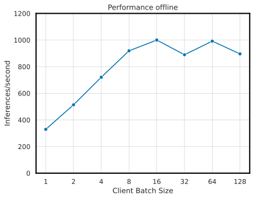||
|-----|-----|

<details>

<summary>
Full tabular data
</summary>

| Precision   | Backend Accelerator   |   Client Batch Size |   Inferences/second |   P90 Latency |   P95 Latency |   P99 Latency |   Avg Latency |
|:------------|:---------------------|--------------------:|--------------------:|--------------:|--------------:|--------------:|--------------:|
| FP16        | TensorRT             |                   1 |               329.5 |         3.23  |         3.43  |         3.973 |         3.031 |
| FP16        | TensorRT             |                   2 |               513.8 |         4.292 |         4.412 |         4.625 |         3.888 |
| FP16        | TensorRT             |                   4 |               720.8 |         6.122 |         6.264 |         6.5   |         5.543 |
| FP16        | TensorRT             |                   8 |               919.2 |         9.145 |         9.664 |        10.3   |         8.701 |
| FP16        | TensorRT             |                  16 |              1000   |        17.522 |        17.979 |        19.098 |        16.01  |
| FP16        | TensorRT             |                  32 |               889.6 |        37.49  |        38.481 |        40.316 |        35.946 |
| FP16        | TensorRT             |                  64 |               992   |        66.837 |        67.923 |        70.324 |        64.645 |
| FP16        | TensorRT             |                 128 |               896   |       148.461 |       149.854 |       150.05  |       143.684 |

</details>


#### Offline: NVIDIA DGX A100 (1x A100 80GB), TF-TRT with FP16

Our results were obtained using the following configuration:
 * **GPU:** NVIDIA DGX A100 (1x A100 80GB)
 * **Backend:** TensorFlow
 * **Model binding:** TF-TRT
 * **Precision:** FP16
 * **Model format:** TensorFlow SavedModel

|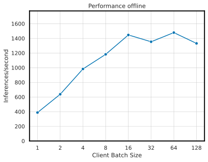|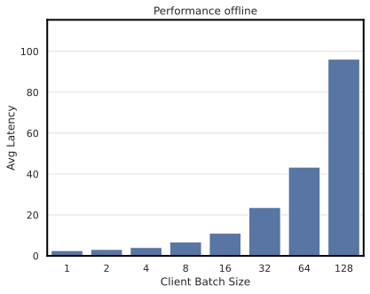|
|-----|-----|

<details>

<summary>
Full tabular data
</summary>

| Precision   | Backend Accelerator   |   Client Batch Size |   Inferences/second |   P90 Latency |   P95 Latency |   P99 Latency |   Avg Latency |
|:------------|:---------------------|--------------------:|--------------------:|--------------:|--------------:|--------------:|--------------:|
| FP16        | TensorRT             |                   1 |               387.9 |         2.626 |         2.784 |         2.875 |         2.574 |
| FP16        | TensorRT             |                   2 |               637.2 |         3.454 |         3.506 |         3.547 |         3.135 |
| FP16        | TensorRT             |                   4 |               982.4 |         4.328 |         4.454 |         4.627 |         4.07  |
| FP16        | TensorRT             |                   8 |              1181.6 |         7.012 |         7.074 |         7.133 |         6.765 |
| FP16        | TensorRT             |                  16 |              1446.4 |        11.162 |        11.431 |        11.941 |        11.061 |
| FP16        | TensorRT             |                  32 |              1353.6 |        24.392 |        24.914 |        25.178 |        23.603 |
| FP16        | TensorRT             |                  64 |              1478.4 |        45.539 |        46.096 |        47.546 |        43.401 |
| FP16        | TensorRT             |                 128 |              1331.2 |        97.504 |       100.611 |       101.896 |        96.198 |

</details>


#### Offline: NVIDIA DGX-1 (1x V100 32GB), TF-TRT with FP16

Our results were obtained using the following configuration:
 * **GPU:** NVIDIA DGX A100 (1x A100 80GB)
 * **Backend:** TensorFlow
 * **Model binding:** TF-TRT
 * **Precision:** FP16
 * **Model format:** TensorFlow SavedModel

|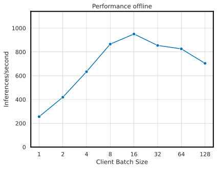|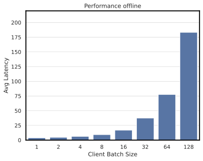|
|-----|-----|

<details>

<summary>
Full tabular data
</summary>

| Precision   | Backend Accelerator   |   Client Batch Size |   Inferences/second |   P90 Latency |   P95 Latency |   P99 Latency |   Avg Latency |
|:------------|:---------------------|--------------------:|--------------------:|--------------:|--------------:|--------------:|--------------:|
| FP16        | TensorRT             |                   1 |               255.6 |         4.032 |         4.061 |         4.141 |         3.909 |
| FP16        | TensorRT             |                   2 |               419.2 |         4.892 |         4.94  |         5.133 |         4.766 |
| FP16        | TensorRT             |                   4 |               633.6 |         6.603 |         6.912 |         7.18  |         6.306 |
| FP16        | TensorRT             |                   8 |               865.6 |         9.657 |         9.73  |         9.834 |         9.236 |
| FP16        | TensorRT             |                  16 |               950.4 |        18.396 |        20.748 |        23.873 |        16.824 |
| FP16        | TensorRT             |                  32 |               854.4 |        37.965 |        38.599 |        40.34  |        37.432 |
| FP16        | TensorRT             |                  64 |               825.6 |        80.118 |        80.758 |        87.374 |        77.596 |
| FP16        | TensorRT             |                 128 |               704   |       189.198 |       189.87  |       191.259 |       183.205 |

</details>


#### Offline: NVIDIA T4, TF-TRT with FP16

Our results were obtained using the following configuration:
 * **GPU:** NVIDIA T4
 * **Backend:** TensorFlow
 * **Model binding:** TF-TRT
 * **Precision:** FP16
 * **Model format:** TensorFlow SavedModel

|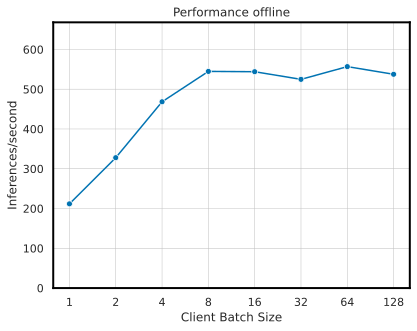|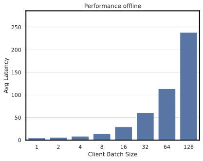|
|-----|-----|

<details>

<summary>
Full tabular data
</summary>

| Precision   | Backend Accelerator   |   Client Batch Size |   Inferences/second |   P90 Latency |   P95 Latency |   P99 Latency |   Avg Latency |
|:------------|:---------------------|--------------------:|--------------------:|--------------:|--------------:|--------------:|--------------:|
| FP16        | TensorRT             |                   1 |               211.7 |         4.89  |         4.926 |         4.965 |         4.717 |
| FP16        | TensorRT             |                   2 |               327.8 |         6.258 |         6.309 |         6.436 |         6.094 |
| FP16        | TensorRT             |                   4 |               468.4 |         8.996 |         9.085 |         9.239 |         8.531 |
| FP16        | TensorRT             |                   8 |               544.8 |        15.654 |        15.978 |        16.324 |        14.673 |
| FP16        | TensorRT             |                  16 |               544   |        30.626 |        30.788 |        31.311 |        29.477 |
| FP16        | TensorRT             |                  32 |               524.8 |        64.527 |        65.35  |        66.13  |        60.943 |
| FP16        | TensorRT             |                  64 |               556.8 |       115.455 |       115.717 |       116.02  |       113.802 |
| FP16        | TensorRT             |                 128 |               537.6 |       242.501 |       244.599 |       246.16  |       238.384 |

</details>


### Online scenario

This table lists the common variable parameters for all performance measurements:
| Parameter Name               | Parameter Value   |
|:-----------------------------|:------------------|
| Max Batch Size               | 128             |
| Number of model instances      | 2               |
| Triton Max Queue Delay       | 1               |
| Triton Preferred Batch Sizes | 64 128            |


#### Online: NVIDIA A40, TF-TRT with FP16

Our results were obtained using the following configuration:
 * **GPU:** NVIDIA A40
 * **Backend:** TensorFlow
 * **Model binding:** TF-TRT
 * **Precision:** FP16
 * **Model format:** TensorFlow SavedModel

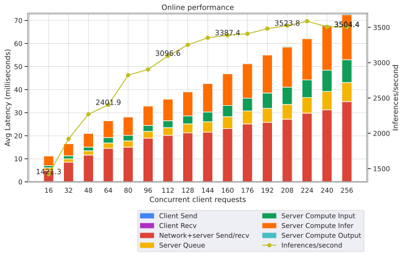
 
<details>

<summary>
Full tabular data
</summary>

|   Concurrent client requests |   Inferences/second |   Client Send |   Network+server Send/recv |   Server Queue |   Server Compute Input |   Server Compute Infer |   Server Compute Output |   Client Recv |   P50 Latency |   P90 Latency |   P95 Latency |   P99 Latency |   Avg Latency |
|-----------------------------:|--------------------:|--------------:|---------------------------:|---------------:|-----------------------:|-----------------------:|------------------------:|--------------:|--------------:|--------------:|--------------:|--------------:|--------------:|
|                           16 |              1421.3 |         0.109 |                      4.875 |          1.126 |                  0.895 |                  4.188 |                   0.053 |             0 |        11.046 |        17.34  |        17.851 |        19.013 |        11.246 |
|                           32 |              1920   |         0.118 |                      8.402 |          1.47  |                  1.323 |                  5.277 |                   0.09  |             0 |        16.328 |        28.052 |        29.871 |        31.932 |        16.68  |
|                           48 |              2270.4 |         0.12  |                     11.505 |          1.856 |                  1.582 |                  5.953 |                   0.113 |             0 |        22.172 |        31.87  |        35.395 |        41.256 |        21.129 |
|                           64 |              2401.9 |         0.12  |                     14.443 |          2.299 |                  2.358 |                  7.285 |                   0.149 |             0 |        26.69  |        37.388 |        40.73  |        47.503 |        26.654 |
|                           80 |              2823   |         0.126 |                     14.917 |          2.71  |                  2.406 |                  7.977 |                   0.174 |             0 |        29.113 |        39.932 |        43.789 |        51.24  |        28.31  |
|                           96 |              2903.8 |         0.133 |                     18.824 |          2.929 |                  2.595 |                  8.364 |                   0.18  |             0 |        33.951 |        46.785 |        51.878 |        60.37  |        33.025 |
|                          112 |              3096.6 |         0.135 |                     20.018 |          3.362 |                  2.97  |                  9.434 |                   0.209 |             0 |        37.927 |        50.587 |        55.169 |        63.141 |        36.128 |
|                          128 |              3252   |         0.138 |                     21.092 |          3.912 |                  3.445 |                 10.505 |                   0.245 |             0 |        41.241 |        53.912 |        58.961 |        68.864 |        39.337 |
|                          144 |              3352.4 |         0.137 |                     21.407 |          4.527 |                  4.237 |                 12.363 |                   0.293 |             0 |        44.211 |        59.876 |        65.971 |        79.335 |        42.964 |
|                          160 |              3387.4 |         0.137 |                     22.947 |          5.179 |                  4.847 |                 13.805 |                   0.326 |             0 |        48.423 |        65.393 |        69.568 |        81.288 |        47.241 |
|                          176 |              3409.1 |         0.142 |                     24.989 |          5.623 |                  5.539 |                 14.956 |                   0.357 |             0 |        52.714 |        71.332 |        78.478 |        99.086 |        51.606 |
|                          192 |              3481.8 |         0.143 |                     25.661 |          6.079 |                  6.666 |                 16.442 |                   0.372 |             0 |        55.383 |        79.276 |        95.479 |       122.295 |        55.363 |
|                          208 |              3523.8 |         0.147 |                     27.042 |          6.376 |                  7.526 |                 17.413 |                   0.4   |             0 |        58.823 |        86.375 |       104.134 |       123.278 |        58.904 |
|                          224 |              3587.2 |         0.148 |                     29.648 |          6.776 |                  7.659 |                 17.85  |                   0.411 |             0 |        61.973 |        91.804 |       107.987 |       130.413 |        62.492 |
|                          240 |              3507.4 |         0.153 |                     31.079 |          7.987 |                  9.246 |                 19.342 |                   0.426 |             0 |        65.697 |       106.035 |       121.914 |       137.572 |        68.233 |
|                          256 |              3504.4 |         0.16  |                     34.664 |          8.252 |                  9.886 |                 19.567 |                   0.461 |             0 |        70.708 |       115.965 |       127.808 |       147.327 |        72.99  |

</details>


#### Online: NVIDIA DGX A100 (1x A100 80GB), TF-TRT with FP16

Our results were obtained using the following configuration:
 * **GPU:** NVIDIA DGX A100 (1x A100 80GB)
 * **Backend:** TensorFlow
 * **Model binding:** TF-TRT
 * **Precision:** FP16
 * **Model format:** TensorFlow SavedModel

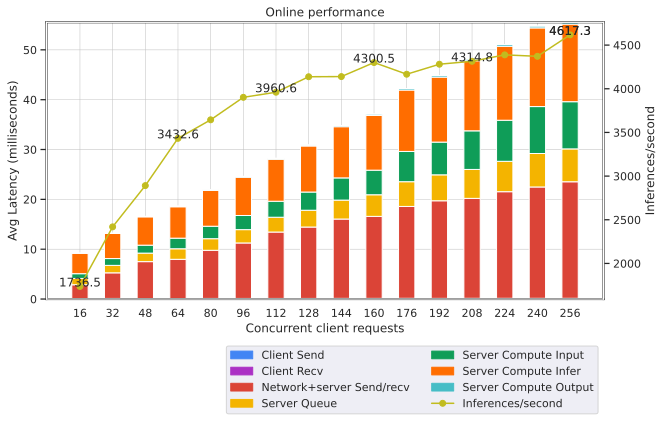
 
<details>

<summary>
Full tabular data
</summary>

|   Concurrent client requests |   Inferences/second |   Client Send |   Network+server Send/recv |   Server Queue |   Server Compute Input |   Server Compute Infer |   Server Compute Output |   Client Recv |   P50 Latency |   P90 Latency |   P95 Latency |   P99 Latency |   Avg Latency |
|-----------------------------:|--------------------:|--------------:|---------------------------:|---------------:|-----------------------:|-----------------------:|------------------------:|--------------:|--------------:|--------------:|--------------:|--------------:|--------------:|
|                           16 |              1736.5 |         0.11  |                      2.754 |          1.272 |                  0.954 |                  4.08  |                   0.036 |             0 |         9.037 |        12.856 |        13.371 |        15.174 |         9.206 |
|                           32 |              2418.9 |         0.114 |                      5.15  |          1.494 |                  1.361 |                  5.031 |                   0.072 |             0 |        13.234 |        20.638 |        21.717 |        23.352 |        13.222 |
|                           48 |              2891.3 |         0.112 |                      7.389 |          1.721 |                  1.586 |                  5.688 |                   0.096 |             0 |        17.089 |        25.946 |        27.611 |        29.784 |        16.592 |
|                           64 |              3432.6 |         0.11  |                      7.866 |          2.11  |                  2.126 |                  6.301 |                   0.131 |             0 |        19.322 |        25.971 |        28.845 |        34.024 |        18.644 |
|                           80 |              3644.6 |         0.116 |                      9.665 |          2.33  |                  2.493 |                  7.185 |                   0.146 |             0 |        22.834 |        29.061 |        32.281 |        37.224 |        21.935 |
|                           96 |              3902.2 |         0.116 |                     11.138 |          2.676 |                  2.828 |                  7.684 |                   0.166 |             0 |        25.589 |        32.572 |        35.307 |        40.123 |        24.608 |
|                          112 |              3960.6 |         0.124 |                     13.321 |          2.964 |                  3.209 |                  8.438 |                   0.186 |             0 |        29.537 |        37.388 |        40.602 |        46.193 |        28.242 |
|                          128 |              4137.7 |         0.124 |                     14.325 |          3.372 |                  3.646 |                  9.244 |                   0.219 |             0 |        31.587 |        41.968 |        44.993 |        51.38  |        30.93  |
|                          144 |              4139.6 |         0.136 |                     15.919 |          3.803 |                  4.451 |                 10.274 |                   0.233 |             0 |        35.696 |        48.301 |        51.345 |        57.414 |        34.816 |
|                          160 |              4300.5 |         0.134 |                     16.453 |          4.341 |                  4.934 |                 10.979 |                   0.274 |             0 |        38.495 |        50.566 |        53.943 |        61.406 |        37.115 |
|                          176 |              4166.6 |         0.143 |                     18.436 |          4.959 |                  6.081 |                 12.321 |                   0.309 |             0 |        43.451 |        60.739 |        69.51  |        84.959 |        42.249 |
|                          192 |              4281.3 |         0.138 |                     19.585 |          5.201 |                  6.571 |                 13.042 |                   0.313 |             0 |        46.175 |        62.718 |        69.46  |        83.032 |        44.85  |
|                          208 |              4314.8 |         0.15  |                     20.046 |          5.805 |                  7.752 |                 14.062 |                   0.335 |             0 |        47.957 |        73.848 |        84.644 |        96.408 |        48.15  |
|                          224 |              4388.2 |         0.141 |                     21.393 |          6.105 |                  8.236 |                 14.85  |                   0.343 |             0 |        50.449 |        77.534 |        88.553 |       100.727 |        51.068 |
|                          240 |              4371.8 |         0.143 |                     22.342 |          6.711 |                  9.423 |                 15.78  |                   0.377 |             0 |        53.216 |        85.983 |        97.756 |       112.48  |        54.776 |
|                          256 |              4617.3 |         0.144 |                     23.392 |          6.595 |                  9.466 |                 15.568 |                   0.367 |             0 |        54.703 |        86.054 |        93.95  |       105.917 |        55.532 |

</details>


#### Online: NVIDIA DGX-1 (1x V100 32GB), TF-TRT with FP16

Our results were obtained using the following configuration:
 * **GPU:** NVIDIA DGX-1 (1x V100 32GB)
 * **Backend:** TensorFlow
 * **Model binding:** TF-TRT
 * **Precision:** FP16
 * **Model format:** TensorFlow SavedModel

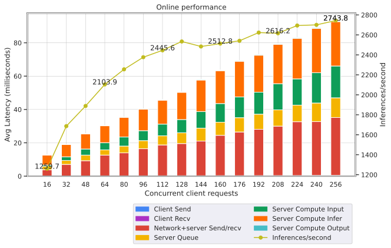
 
<details>

<summary>
Full tabular data
</summary>

|   Concurrent client requests |   Inferences/second |   Client Send |   Network+server Send/recv |   Server Queue |   Server Compute Input |   Server Compute Infer |   Server Compute Output |   Client Recv |   P50 Latency |   P90 Latency |   P95 Latency |   P99 Latency |   Avg Latency |
|-----------------------------:|--------------------:|--------------:|---------------------------:|---------------:|-----------------------:|-----------------------:|------------------------:|--------------:|--------------:|--------------:|--------------:|--------------:|--------------:|
|                           16 |              1259.7 |         0.121 |                      3.735 |          1.999 |                  0.803 |                  5.998 |                   0.034 |         0     |        13.623 |        17.271 |        17.506 |        18.938 |        12.69  |
|                           32 |              1686.4 |         0.17  |                      6.9   |          2.33  |                  2.212 |                  7.303 |                   0.07  |         0     |        18.836 |        28.302 |        30.423 |        32.916 |        18.985 |
|                           48 |              1888.3 |         0.183 |                      9.068 |          3.372 |                  3.65  |                  9.058 |                   0.108 |         0.001 |        26.571 |        36.583 |        40.84  |        50.402 |        25.44  |
|                           64 |              2103.9 |         0.204 |                     12.416 |          3.146 |                  4.304 |                 10.127 |                   0.145 |         0.001 |        32.401 |        37.121 |        41.252 |        49.094 |        30.343 |
|                           80 |              2255.2 |         0.211 |                     13.753 |          4.074 |                  5.455 |                 11.776 |                   0.192 |         0.001 |        38.298 |        47.082 |        54.476 |        65.412 |        35.462 |
|                           96 |              2376.6 |         0.214 |                     16.22  |          4.873 |                  5.972 |                 12.911 |                   0.208 |         0.001 |        43.008 |        52.947 |        57.126 |        69.778 |        40.399 |
|                          112 |              2445.6 |         0.243 |                     18.495 |          5.461 |                  7.012 |                 14.365 |                   0.248 |         0.001 |        48.081 |        62.414 |        68.274 |        85.766 |        45.825 |
|                          128 |              2534.2 |         0.261 |                     19.294 |          6.486 |                  7.925 |                 16.312 |                   0.282 |         0.001 |        52.894 |        68.475 |        74.852 |        89.979 |        50.561 |
|                          144 |              2483.9 |         0.27  |                     20.771 |          7.744 |                  9.993 |                 18.865 |                   0.414 |         0.001 |        64.866 |        70.434 |        80.279 |        99.177 |        58.058 |
|                          160 |              2512.8 |         0.302 |                     24.205 |          7.838 |                 11.217 |                 19.689 |                   0.373 |         0.001 |        69.085 |        85.576 |        95.016 |       109.455 |        63.625 |
|                          176 |              2541   |         0.311 |                     26.206 |          8.556 |                 12.439 |                 21.393 |                   0.418 |         0.001 |        76.666 |        92.266 |       106.889 |       127.055 |        69.324 |
|                          192 |              2623.4 |         0.33  |                     27.783 |          9.058 |                 13.198 |                 22.181 |                   0.433 |         0.001 |        79.724 |        97.736 |       111.44  |       142.418 |        72.984 |
|                          208 |              2616.2 |         0.353 |                     29.667 |          9.759 |                 15.693 |                 23.567 |                   0.444 |         0.001 |        80.571 |       125.202 |       140.527 |       175.331 |        79.484 |
|                          224 |              2693.9 |         0.369 |                     32.283 |          9.941 |                 15.769 |                 24.304 |                   0.439 |         0.001 |        78.743 |       137.09  |       151.955 |       183.397 |        83.106 |
|                          240 |              2700.4 |         0.447 |                     32.287 |         11.128 |                 18.204 |                 26.578 |                   0.456 |         0.001 |        82.561 |       155.011 |       177.925 |       191.51  |        89.101 |
|                          256 |              2743.8 |         0.481 |                     34.688 |         11.834 |                 19.087 |                 26.597 |                   0.459 |         0.001 |        89.387 |       153.866 |       177.805 |       204.319 |        93.147 |

</details>


#### Online: NVIDIA T4, TF-TRT with FP16

Our results were obtained using the following configuration:
 * **GPU:** NVIDIA T4
 * **Backend:** TensorFlow
 * **Model binding:** TF-TRT
 * **Precision:** FP16
 * **Model format:** TensorFlow SavedModel

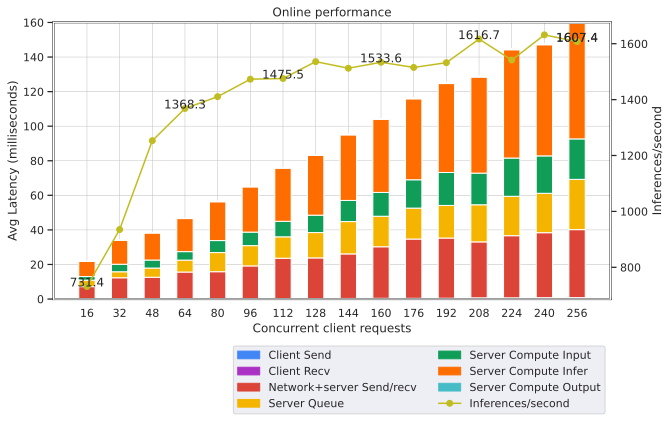
 
<details>

<summary>
Full tabular data
</summary>

|   Concurrent client requests |   Inferences/second |   Client Send |   Network+server Send/recv |   Server Queue |   Server Compute Input |   Server Compute Infer |   Server Compute Output |   Client Recv |   P50 Latency |   P90 Latency |   P95 Latency |   P99 Latency |   Avg Latency |
|-----------------------------:|--------------------:|--------------:|---------------------------:|---------------:|-----------------------:|-----------------------:|------------------------:|--------------:|--------------:|--------------:|--------------:|--------------:|--------------:|
|                           16 |               731.4 |         0.271 |                      6.9   |          3.745 |                  2.073 |                  8.802 |                   0.081 |         0.001 |        25.064 |        28.863 |        29.7   |        32.01  |        21.873 |
|                           32 |               935   |         0.273 |                     12.023 |          3.48  |                  4.375 |                 13.885 |                   0.141 |         0.001 |        31.339 |        50.564 |        52.684 |        55.823 |        34.178 |
|                           48 |              1253   |         0.298 |                     12.331 |          5.313 |                  4.623 |                 15.634 |                   0.178 |         0.001 |        38.099 |        60.665 |        64.537 |        72.38  |        38.378 |
|                           64 |              1368.3 |         0.303 |                     15.3   |          6.926 |                  4.9   |                 19.118 |                   0.2   |         0.001 |        48.758 |        66.391 |        73.271 |        81.537 |        46.748 |
|                           80 |              1410.7 |         0.296 |                     15.525 |         11.06  |                  6.934 |                 22.476 |                   0.286 |         0.001 |        60.346 |        65.664 |        76.055 |        84.643 |        56.578 |
|                           96 |              1473.1 |         0.309 |                     18.846 |         11.746 |                  7.825 |                 26.165 |                   0.319 |         0.001 |        69.785 |        77.337 |        91.586 |       100.918 |        65.211 |
|                          112 |              1475.5 |         0.316 |                     23.275 |         12.412 |                  8.954 |                 30.724 |                   0.338 |         0.001 |        79.904 |       106.324 |       111.382 |       126.559 |        76.02  |
|                          128 |              1535.9 |         0.328 |                     23.486 |         14.64  |                 10.057 |                 34.534 |                   0.352 |         0.001 |        89.451 |       110.789 |       121.814 |       140.139 |        83.398 |
|                          144 |              1512.3 |         0.336 |                     25.79  |         18.7   |                 12.205 |                 37.909 |                   0.435 |         0.001 |       103.388 |       108.917 |       114.44  |       136.469 |        95.376 |
|                          160 |              1533.6 |         0.406 |                     29.825 |         17.67  |                 13.751 |                 42.259 |                   0.44  |         0.001 |       111.899 |       140.67  |       154.76  |       191.391 |       104.352 |
|                          176 |              1515.1 |         0.438 |                     34.286 |         17.867 |                 16.42  |                 46.792 |                   0.461 |         0.001 |       120.503 |       187.317 |       205.71  |       223.391 |       116.265 |
|                          192 |              1532.2 |         0.476 |                     34.796 |         18.86  |                 19.071 |                 51.446 |                   0.483 |         0.001 |       124.044 |       211.466 |       226.921 |       237.664 |       125.133 |
|                          208 |              1616.7 |         0.697 |                     32.363 |         21.465 |                 18.315 |                 55.539 |                   0.516 |         0.001 |       127.891 |       200.478 |       221.404 |       250.348 |       128.896 |
|                          224 |              1541.5 |         0.702 |                     35.932 |         22.786 |                 22.138 |                 62.657 |                   0.527 |         0.001 |       141.32  |       248.069 |       263.661 |       276.579 |       144.743 |
|                          240 |              1631.7 |         0.79  |                     37.581 |         22.791 |                 21.651 |                 64.278 |                   0.549 |         0.001 |       141.393 |       250.354 |       272.17  |       289.926 |       147.641 |
|                          256 |              1607.4 |         0.801 |                     39.342 |         29.09  |                 23.416 |                 66.866 |                   0.593 |         0.001 |       157.87  |       262.818 |       280.921 |       310.504 |       160.109 |

</details>


## Release Notes
We’re constantly refining and improving our performance on AI
and HPC workloads even on the same hardware with frequent updates
to our software stack. For our latest performance data please refer
to these pages for
[AI](https://developer.nvidia.com/deep-learning-performance-training-inference)
and [HPC](https://developer.nvidia.com/hpc-application-performance) benchmarks.

### Changelog

July 2020
- Initial release 

April 2021
- NVIDIA A100 results added

### Known issues

There are no known issues with this model with this model.


