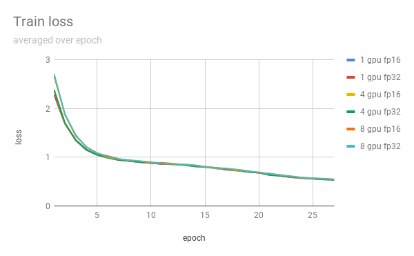
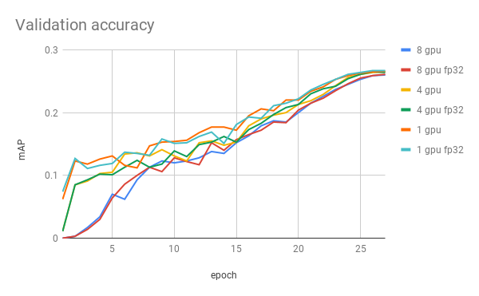

# SSD320 v1.2 For TensorFlow

This repository provides a script and recipe to train SSD320 v1.2 to achieve state of the art accuracy, and is tested and maintained by NVIDIA.

## Table Of Contents
* [Model overview](#model-overview)
  * [Default configuration](#default-configuration)
* [Setup](#setup)
  * [Requirements](#requirements)
* [Quick Start Guide](#quick-start-guide)
* [Advanced](#advanced)
  * [Command line options](#command-line-options)
  * [Getting the data](#getting-the-data)
  * [Training process](#training-process)
    * [Data preprocessing](#data-preprocessing)
    * [Data augmentation](#data-augmentation)
  * [Enabling mixed precision](#enabling-mixed-precision)
* [Performance](#performance)
  * [Benchmarking](#benchmarking)
    * [Training performance benchmark](#training-performance-benchmark)
    * [Inference performance benchmark](#inference-performance-benchmark)
  * [Results](#results)
    * [Training accuracy results](#training-accuracy-results)
    * [Training performance results](#training-performance-results)
    * [Inference performance results](#inference-performance-results)
* [Release notes](#release-notes)
  * [Changelog](#changelog)
  * [Known issues](#known-issues)

## Model overview

The SSD320 v1.2 model is based on the [SSD: Single Shot MultiBox Detector](https://arxiv.org/abs/1512.02325) paper, which describes SSD as “a method for detecting objects in images using a single deep neural network”.

Our implementation is based on the existing [model from the TensorFlow models repository](https://github.com/tensorflow/models/blob/master/research/object_detection/samples/configs/ssd_resnet50_v1_fpn_shared_box_predictor_640x640_coco14_sync.config).
The network was altered in order to improve accuracy and increase throughput. Changes include:
- Replacing the VGG backbone with the more popular ResNet50.
- Adding multi-scale detection to the backbone using [Feature Pyramid Networks](https://arxiv.org/pdf/1612.03144.pdf).
- Replacing the original hard negative mining loss function with [Focal Loss](https://arxiv.org/pdf/1708.02002.pdf).
- Decreasing the input size to 320 x 320.

This model trains with mixed precision tensor cores on NVIDIA Volta GPUs, therefore you can get results much faster than training without tensor cores. This model is tested against each NGC monthly container release to ensure consistent accuracy and performance over time.

The following features were implemented in this model:
- Data-parallel multi-GPU training with Horovod.
- Mixed precision support with TensorFlow Automatic Mixed Precision (TF-AMP), which enables mixed precision training without any changes to the code-base by performing automatic graph rewrites and loss scaling controlled by an environmental variable.
- Tensor Core operations to maximize throughput using NVIDIA Volta GPUs.
- Dynamic loss scaling for tensor cores (mixed precision) training.

Because of these enhancements, the SSD320 v1.2 model achieves higher accuracy.

### Default configuration
We trained the model for 12500 steps (27 epochs) with the following setup:
- [SGDR](https://arxiv.org/pdf/1608.03983.pdf) with cosine decay learning rate
- Learning rate base = 0.16 
- Momentum = 0.9
- Warm-up learning rate = 0.0693312
- Warm-up steps = 1000
- Batch size per GPU = 32
- Number of GPUs = 8

## Setup

The following section list the requirements in order to start training the SSD320 v1.2 model.

### Requirements
This repository contains `Dockerfile` which extends the TensorFlow NGC container and encapsulates some dependencies.  Aside from these dependencies, ensure you have the following software:
* [NVIDIA Docker](https://github.com/NVIDIA/nvidia-docker)
* [TensorFlow 19.03-py3](https://ngc.nvidia.com/catalog/containers/nvidia:tensorflow) (or later) NGC container
* [NVIDIA Volta based GPU](https://www.nvidia.com/en-us/data-center/volta-gpu-architecture/)

For more information about how to get started with NGC containers, see the
following sections from the NVIDIA GPU Cloud Documentation and the Deep Learning
Documentation:
* [Getting Started Using NVIDIA GPU Cloud](https://docs.nvidia.com/ngc/ngc-getting-started-guide/index.html)
* [Accessing And Pulling From The NGC Container Registry](https://docs.nvidia.com/deeplearning/dgx/user-guide/index.html#accessing_registry)
* [Running TensorFlow](https://docs.nvidia.com/deeplearning/dgx/tensorflow-release-notes/running.html#running)


## Quick Start Guide
To train your model using mixed precision with tensor cores or using FP32,
perform the following steps using the default parameters of the SSD320 v1.2 model on the
[COCO 2017](http://cocodataset.org/#download) dataset.


### 1. Clone the repository.
```
git clone https://github.com/NVIDIA/DeepLearningExamples
cd DeepLearningExamples/TensorFlow/Detection/SSD
```

### 2. Build the SSD320 v1.2 TensorFlow NGC container.

```
docker build . -t nvidia_ssd
```

### 3. Download and preprocess the dataset. 

Extract the COCO 2017 dataset with:

```
download_all.sh nvidia_ssd <data_dir_path> <checkpoint_dir_path>
```

Data will be downloaded, preprocessed to tfrecords format and saved in the `<data_dir_path>` directory (on the host).
Moreover the script will download pre-trained RN50 checkpoint in the `<checkpoint_dir_path>` directory


### 4. Launch the NGC container to run training/inference.
```
nvidia-docker run --rm -it --shm-size=1g --ulimit memlock=-1 --ulimit stack=67108864 -v <data_dir_path>:/data/coco2017_tfrecords -v <checkpoint_dir_path>:/checkpoints --ipc=host nvidia_ssd
```

### 5. Start training.

The `./examples` directory provides several sample scripts for various GPU settings and act as wrappers around
`object_detection/model_main.py` script. The example scripts can be modified by arguments: 
- A path to directory for checkpoints
- A path to directory for configs
- Additional arguments to `object_detection/model_main.py`

If you want to run 8 GPUs, training with tensor cores acceleration and save checkpoints in `/checkpoints` directory, run:

```
bash ./examples/SSD320_FP16_8GPU.sh /checkpoints
```


### 6. Start validation/evaluation.


The `model_main.py` training script automatically runs validation during training.
The results from the validation are printed to `stdout`.

Pycocotools’ open-sourced scripts provides a consistent way to evaluate models on the COCO dataset.
We are using these scripts during validation to measure models performance in AP metric.
Metrics below are evaluated using pycocotools’ methodology,
in the following format:during validation to measure models performance in AP metric.
Metrics below are evaluated using pycocotools’ methodology, in the following format:
```
 Average Precision  (AP) @[ IoU=0.50:0.95 | area=   all | maxDets=100 ] = 0.273
 Average Precision  (AP) @[ IoU=0.50      | area=   all | maxDets=100 ] = 0.423
 Average Precision  (AP) @[ IoU=0.75      | area=   all | maxDets=100 ] = 0.291
 Average Precision  (AP) @[ IoU=0.50:0.95 | area= small | maxDets=100 ] = 0.024
 Average Precision  (AP) @[ IoU=0.50:0.95 | area=medium | maxDets=100 ] = 0.218
 Average Precision  (AP) @[ IoU=0.50:0.95 | area= large | maxDets=100 ] = 0.451
 Average Recall     (AR) @[ IoU=0.50:0.95 | area=   all | maxDets=  1 ] = 0.257
 Average Recall     (AR) @[ IoU=0.50:0.95 | area=   all | maxDets= 10 ] = 0.398
 Average Recall     (AR) @[ IoU=0.50:0.95 | area=   all | maxDets=100 ] = 0.427
 Average Recall     (AR) @[ IoU=0.50:0.95 | area= small | maxDets=100 ] = 0.070
 Average Recall     (AR) @[ IoU=0.50:0.95 | area=medium | maxDets=100 ] = 0.418
 Average Recall     (AR) @[ IoU=0.50:0.95 | area= large | maxDets=100 ] = 0.645
```
The metric reported in our results is present in the first row.

To evaluate a checkpointed model saved in the previous step, you can use script from examples directory.
If you want to run inference with tensor cores acceleration, run:

```
bash examples/SSD320_evaluate.sh <path to checkpoint>
```

## Advanced

The following sections provide greater details of the dataset, running training and inference, and the training results.

### Command line options
The SSD model training is conducted by the script from the object_detection library, `model_main.py`.
Our experiments were done with settings described in the `examples` directory.
If you would like to get more details about available arguments, please run:

```
python object_detection/model_main.py --help
```

### Getting the data

The SSD320 v1.2 model was trained on the COCO 2017 dataset. The val2017 validation set was used as a validation dataset.
The `download_data.sh` script will preprocess the data to tfrecords format.

This repository contains the `download_dataset.sh` script which will automatically download and preprocess the training,
validation and test datasets. By default, data will be downloaded to the `/data/coco2017_tfrecords` directory.

### Training process
Training the SSD model is implemented in the `object_detection/model_main.py` script. 

All training parameters are set in the config files. Because evaluation is relatively time consuming,
it does not run every epoch. By default, evaluation is executed only once at the end of the training.
The model is evaluated using pycocotools distributed with the COCO dataset.
The number of evaluations can be changed using the `eval_count` parameter.

To run training with tensor cores, use `./examples/SSD320_FP16_{1,4,8}GPU.sh` scripts. For more details see [Enabling mixed precision](#enabling-mixed-precision) section below.

#### Data preprocessing
Before we feed data to the model, both during training and inference, we perform:
*	Normalization
*	Encoding bounding boxes
*   Resize to 320x320

#### Data augmentation
During training we perform the following augmentation techniques:
*	Random crop
*	Random horizontal flip
*	Color jitter


### Enabling mixed precision
[Mixed precision](https://arxiv.org/abs/1710.03740) training offers significant computational speedup by performing operations in half-precision format,
while storing minimal information in single-precision to retain as much information as possible in critical parts of the network.
Since the introduction of [tensor cores](https://developer.nvidia.com/tensor-cores) in the Volta and Turing architectures,
significant training speedups are experienced by switching to mixed precision --
up to 3x overall speedup on the most arithmetically intense model architectures.
Using [mixed precision](https://docs.nvidia.com/deeplearning/sdk/mixed-precision-training/index.html) training previously required two steps:
1. Porting the model to use the FP16 data type where appropriate.
2. Manually adding loss scaling to preserve small gradient values.
 
This can now be achieved using Automatic Mixed Precision (AMP) for TensorFlow to enable the full [mixed precision methodology](https://docs.nvidia.com/deeplearning/sdk/mixed-precision-training/index.html#tensorflow) in your existing TensorFlow model code.
AMP enables mixed precision training on Volta and Turing GPUs automatically.
The TensorFlow framework code makes all necessary model changes internally.

In TF-AMP, the computational graph is optimized to use as few casts as necessary and maximize the use of FP16,
and the loss scaling is automatically applied inside of supported optimizers.
AMP can be configured to work with the existing `tf.contrib` loss scaling manager by disabling the AMP scaling with a single environment variable to perform only the automatic mixed-precision optimization.
It accomplishes this by automatically rewriting all computation graphs with the necessary operations to enable mixed precision training and automatic loss scaling.


For information about:
- How to train using mixed precision, see the [Mixed Precision Training](https://arxiv.org/abs/1710.03740) paper and [Training With Mixed Precision](https://docs.nvidia.com/deeplearning/sdk/mixed-precision-training/index.html) documentation.
- How to access and enable AMP for TensorFlow, see [Using TF-AMP](https://docs.nvidia.com/deeplearning/dgx/tensorflow-user-guide/index.html#tfamp) from the TensorFlow User Guide.
- Techniques used for mixed precision training, see the [Mixed-Precision Training of Deep Neural Networks](https://devblogs.nvidia.com/mixed-precision-training-deep-neural-networks/) blog.

## Performance

### Benchmarking
The following section shows how to run benchmarks measuring the model performance in training and inference modes.

#### Training performance benchmark
Training benchmark was run in various scenarios on V100 16G GPU. For each scenario, batch size was set to 32. 

To benchmark training, run:

```
bash examples/SSD320_{PREC}_{NGPU}GPU_BENCHMARK.sh
```


Where the `{NGPU}` defines number of GPUs used in benchmark, and the `{PREC}` defines precision.
The benchmark runs training with only 1200 steps and computes average training speed of last 300 steps.


#### Inference performance benchmark
Inference benchmark was run with various batch-sizes on V100 16G GPU.
For inference we are using single GPU setting. Examples are taken from the validation dataset.

To benchmark inference, run:

```
bash examples/SSD320_FP{16,32}_inference.sh --batch_size <batch size> --checkpoint_dir <path to checkpoint>
```

Batch size for the inference benchmark is controlled by the `--batch_size` argument,
while the checkpoint is provided to the script with the `--checkpoint_dir` argument.

The benchmark script provides extra arguments for extra control over the experiment.
We were using default values for the extra arguments during the experiments. For more details about them, please run:

```
bash examples/SSD320_FP16_inference.sh --help
```

### Results

The following sections provide details on how we achieved our performance and accuracy in training and inference.

#### Training accuracy results
Our results were obtained by running the `./examples/SSD320_FP{16,32}_{1,4,8}GPU.sh` script in the TensorFlow-19.03-py3 NGC container on NVIDIA DGX-1 with 8x V100 16G GPUs.
All the results are obtained with batch size set to 32.

| **Number of GPUs** | **Mixed precision mAP** | **Training time with mixed precision** | **FP32 mAP** | **Training time with FP32** |
|:------------------:|:-----------------------:|:--------------------------------------:|:------------:|:---------------------------:|
| 1                  | 0.276                   | 7h 17min                               | 0.278        | 10h 20min                   |
| 4                  | 0.277                   | 2h 15min                               | 0.275        | 2h 53min                    |
| 8                  | 0.269                   | 1h 19min                               | 0.268        | 1h 37min                    |


Here are example graphs of FP32 and FP16 training on 8 GPU configuration:





#### Training performance results

Our results were obtained by running:

```
python bash examples/SSD320_FP*GPU_BENCHMARK.sh
```

scripts in the TensorFlow-19.03-py3 NGC container on NVIDIA DGX-1 with V100 16G GPUs. 


| **Number of GPUs** | **Batch size per GPU** | **Mixed precision img/s** | **FP32 img/s** | **Speed-up with mixed precision** | **Multi-gpu weak scaling with mixed precision** | **Multi-gpu weak scaling with FP32** |
|:------------------:|:----------------------:|:-------------------------:|:--------------:|:---------------------------------:|:-----------------------------------------------:|:------------------------------------:|
| 1                  | 32                     |  124.97                   |   87.87        | 1.42                              | 1.00                                            | 1.00                                 |
| 4                  | 32                     |  430.79                   |  330.35        | 1.39                              | 3.45                                            | 3.76                                 |
| 8                  | 32                     |  752.04                   |  569.01        | 1.32                              | 6.02                                            | 6.48                                 |

To achieve same results, follow the [Quick start guide](#quick-start-guide) outlined above.

Those results can be improved when [XLA](https://www.tensorflow.org/xla) is used 
in conjunction with mixed precision, delivering up to 2x speedup over FP32 on a single GPU (~179 img/s).
However XLA is still considered experimental.

#### Inference performance results

Our results were obtained by running the `examples/SSD320_FP{16,32}_inference.sh` script in the TensorFlow-19.03-py3 NGC container on NVIDIA DGX-1 with 1x V100 16G GPUs.


| **Batch size** | **Mixed precision img/s** | **FP32 img/s** |
|:--------------:|:-------------------------:|:--------------:|
|              1 |                    93.37  |        97.29   |
|              2 |                   135.33  |       134.04   |
|              4 |                   171.70  |       163.38   |
|              8 |                   189.25  |       174.47   |
|             16 |                   187.62  |       175.42   |
|             32 |                   187.37  |       175.07   |
|             64 |                   191.40  |       177.75   |

To achieve same results, follow the [Quick start guide](#quick-start-guide) outlined above.

## Release notes

### Changelog

March 2019
 * Initial release

May 2019
 * Test scripts updated

## Known issues
There are no known issues with this model.

