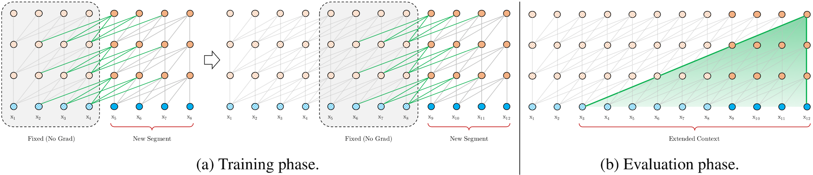
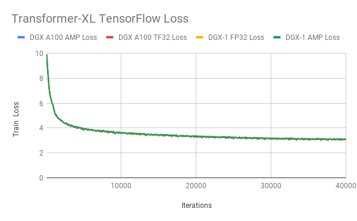

# Transformer-XL For TensorFlow

This repository provides a script and recipe to train the Transformer-XL model
to achieve state-of-the-art accuracy and is tested and maintained by NVIDIA.

## Table Of Contents

<!-- TOC GFM -->

* [Model overview](#model-overview)
  * [Model architecture](#model-architecture)
  * [Default configuration](#default-configuration)
  * [Feature support matrix](#feature-support-matrix)
    * [Features](#features)
  * [Mixed precision training](#mixed-precision-training)
    * [Enabling mixed precision](#enabling-mixed-precision)
* [Setup](#setup)
  * [Requirements](#requirements)
* [Quick Start Guide](#quick-start-guide)
* [Advanced](#advanced)
  * [Scripts and sample code](#scripts-and-sample-code)
  * [Parameters](#parameters)
  * [Command-line options](#command-line-options)
  * [Getting the data](#getting-the-data)
    * [Dataset guidelines](#dataset-guidelines)
    * [Multi-dataset](#multi-dataset)
  * [Training process](#training-process)
  * [Inference process](#inference-process)
* [Performance](#performance)
  * [Benchmarking](#benchmarking)
    * [Training performance benchmark](#training-performance-benchmark)
    * [Inference performance benchmark](#inference-performance-benchmark)
  * [Results](#results)
    * [Training accuracy results](#training-accuracy-results)
      * [Training accuracy: NVIDIA DGX-1 (8x V100 16G)](#training-accuracy-nvidia-dgx-1-8x-v100-16g)
        * [Base model](#base-model)
      * [Training accuracy: NVIDIA DGX-2 (16x V100 32G)](#training-accuracy-nvidia-dgx-2-16x-v100-32g)
        * [Base model](#base-model-1)
      * [Training loss plot](#training-loss-plot)
        * [Base model](#base-model-2)
      * [Training stability test](#training-stability-test)
        * [Base model](#base-model-3)
    * [Training performance results](#training-performance-results)
      * [Training performance: NVIDIA DGX-1 (8x V100 16G)](#training-performance-nvidia-dgx-1-8x-v100-16g)
        * [Base model](#base-model-4)
      * [Training performance: NVIDIA DGX-2 (16x V100 32G)](#training-performance-nvidia-dgx-2-16x-v100-32g)
        * [Base model](#base-model-5)
    * [Inference performance results](#inference-performance-results)
      * [Inference performance: NVIDIA DGX-1 (1x V100 16G)](#inference-performance-nvidia-dgx-1-1x-v100-16g)
        * [Base model](#base-model-6)
      * [Inference performance: NVIDIA T4](#inference-performance-nvidia-t4)
        * [Base model](#base-model-7)
* [Release notes](#release-notes)
  * [Changelog](#changelog)
  * [Known issues](#known-issues)

<!-- /TOC -->

## Model overview

This repository provides an implementation of the Transformer-XL model in
[TensorFlow](https://www.tensorflow.org) from the paper [Transformer-XL: Attentive
Language Models Beyond a Fixed-Length
Context](https://arxiv.org/abs/1901.02860). Transformer-XL is a
transformer-based language model with a segment-level recurrence and a novel
relative positional encoding. Enhancements introduced in Transformer-XL help
capture better long-term dependencies by attending to tokens from multiple
previous segments.

Our implementation is based on the
[codebase](https://github.com/kimiyoung/transformer-xl) published by the
authors of the Transformer-XL paper.
Our implementation uses a modified model architecture. Our
modifications were made to achieve better hardware utilization and to take
advantage of Tensor Cores. Similar modifications were also proposed in an
implementation available from
[github.com/cybertronai/transformer-xl](https://github.com/cybertronai/transformer-xl).
Refer to the [Model architecture](#model-architecture) section for more
details.

This model is trained with mixed precision using Tensor Cores on NVIDIA Volta
GPUs and evaluated on Volta and Turing GPUs. Therefore, researchers can get
results up to 1.5x faster than training without Tensor Cores, while
experiencing the benefits of mixed precision training. This model is tested
against each NGC monthly container release to ensure consistent accuracy and
performance over time.

### Model architecture

The Transformer-XL "base" model for WikiText-103 dataset available in this
repository was modified to use the following hyperparameter values:


|**Hyperparameter**|**Description**|**Original setting for the base model**|**Our modification to the base model**|
|------------------|---------------|--------------------------------------:|--------------------------------------:|
| `d_model` | hidden size                                                      | 410  | 512  |
| `n_head`  | number of attention heads                                        | 10   | 8    |
| `d_head`  | size of each attention head                                      | 41   | 64   |
| `d_inner` | hidden size in fully-connected layers                            | 2100 | 2048 |
| `tgt_len` | number of tokens to predict during training                      | 150  | 192  |
| `mem_len` | number of tokens cached from previous iterations during training | 150  | 192  |

Changes described above were made to align certain hyperparameters with powers
of two, with this modification, the model is able to achieve better hardware
utilization, and therefore higher training throughput.

The following table lists the hyperparameters for the base
Transformer-XL model for WikiText-103 dataset available in this repository.

| **Hyperparameter** | **Description**                                                  | **Base model** |
| ------------------ | ---------------------------------------------------------------- | -------------: |
| `n_layer`          | number of layers                                                 | 16             |
| `d_model`          | hidden size                                                      | 512            |
| `n_head`           | number of attention heads                                        | 8              |
| `d_head`           | size of each attention head                                      | 64             |
| `d_inner`          | inner hidden size in fully-connected layers                      | 2048           |
| `dropout`          | dropout                                                          | 0.1            |
| `dropatt`          | dropout after softmax in the attention                           | 0.0            |
| `lr`               | base learning rate                                               | 0.01           |
| `min_lr_ratio`     | minimum ratio learning rate (for cosine decay)                   | 0.1            |
| `max_step`         | number of training steps                                         | 40,000         |
| `warmup_step`      | number of learning rate warmup steps                             | 1,000          |
| `batch_size`       | training batch size                                              | 256            |
| `tgt_len`          | number of tokens to predict during training                      | 192            |
| `mem_len`          | number of tokens cached from previous iterations during training | 192            |


The Transformer-XL model addresses the limitations of vanilla transformer-based
language models, which are only able to use relatively short context, bounded
by the segment length. The Transformer-XL introduces a recurrence mechanism,
which is able to use a cached hidden state from previous segments. During
training, the context consists of a concatenation of the current segment's hidden
state and cached states from previous iterations. Gradients are backpropagated
only through the current segment, although the model is able to take advantage
of the extra information stored in the cache and therefore is able to model
long-term dependencies.

An illustration of the recurrence mechanism taken from the [Transformer-XL
paper](https://arxiv.org/abs/1901.02860) is shown below.



### Default configuration

The following features were implemented in this model:

* general
  * single-node, Horovod multi-GPU training
  * training and inference with mixed precision using Tensor Cores
  * automatic mixed precision training (AMP)

* model
  * 16-layer base Transformer-XL model with hidden size 512, 8 attention heads,
    each head with hidden size 64
  * the model trained on
    [WikiText-103](https://blog.einstein.ai/the-wikitext-long-term-dependency-language-modeling-dataset/)
    dataset, using word-level vocabulary and
    adaptive softmax
  * embedding weights are tied with weights in the classifier

* training
  * training with [LAMB](https://arxiv.org/abs/1904.00962) optimizer, the
    implementation of the optimizer uses [XLA](https://www.tensorflow.org/xla), which enables
    the fusion of elementwise operations and accelerates the training
  * support for training with a gradient accumulation
  * base model:
    * linear learning rate warmup for 1,000 iterations, followed by the cosine
      learning rate schedule, the initial learning rate is set to 0.0, and the final
      learning rate is set to 0.001 (min_lr_ratio * base_lr)
    * training for 40,000 steps, using a batch size of 256

* inference
  * support for single-GPU inference
  * each token is using the same size of the context from previous time steps.
  * base model:
    * target length is set to 64, length of memory is set to 640
    * positional embeddings are clamped after 400 time steps

### Feature support matrix

The following features are supported by this model:

| **Feature** | **Transformer-XL** |
|:------------|-------------------:|
|[Automatic mixed precision (AMP)](https://nvidia.github.io/apex/amp.html) | Yes |
|[Horovod Multi-GPU (NCCL)](https://github.com/horovod/horovod) | Yes |
|[LAMB](https://arxiv.org/abs/1904.00962v3) | Yes |


#### Features

[TF-AMP](https://docs.nvidia.com/deeplearning/dgx/tensorflow-user-guide/index.html#tfamp) - a 
tool that enables Tensor Core-accelerated training. Refer to the [Enabling
mixed precision](#enabling-mixed-precision) section for more details.

[Horovod](https://github.com/horovod/horovod) - Horovod 
is a distributed training framework for TensorFlow, Keras, PyTorch, and MXNet.
The goal of Horovod is to make distributed deep learning fast and easy to use.
For more information about how to get started with Horovod, see the [Horovod:
Official repository](https://github.com/horovod/horovod).

[Multi-GPU training with Horovod](https://github.com/horovod/horovod/#usage) - our model 
uses Horovod to implement efficient multi-GPU training with NCCL. For details,
see example sources in this repository or see the [TensorFlow
tutorial](https://github.com/horovod/horovod/#usage).

[LAMB](https://arxiv.org/abs/1904.00962v3) - stands 
for Layerwise Adaptive Moments Based optimizer, is a large batch optimization
technique that helps accelerate training of deep neural networks using large
minibatches.

### Mixed precision training

Mixed precision is the combined use of different numerical precisions in a
computational method.
[Mixed precision](https://arxiv.org/abs/1710.03740) training offers significant
computational speedup by performing operations in half-precision format while
storing minimal information in single-precision to retain as much information
as possible in critical parts of the network. Since the introduction of [Tensor
Cores](https://developer.nvidia.com/tensor-cores) in the Volta and Turing
architectures, significant training speedups are experienced by switching to
mixed precision -- up to 3x overall speedup on the most arithmetically intense
model architectures. Using mixed precision training previously required two
steps:

1. Porting the model to use the FP16 data type where appropriate.
2. Manually adding loss scaling to preserve small gradient values.

The ability to train deep learning networks with lower precision was introduced
in the Pascal architecture and first supported in [CUDA
8](https://devblogs.nvidia.com/parallelforall/tag/fp16/) in the NVIDIA Deep
Learning SDK.

For information about:

* How to train using mixed precision, see the [Mixed Precision
  Training](https://arxiv.org/abs/1710.03740) paper and [Training With Mixed
  Precision](https://docs.nvidia.com/deeplearning/sdk/mixed-precision-training/index.html)
  documentation.
* Techniques used for mixed precision training, see the [Mixed-Precision
  Training of Deep Neural
  Networks](https://devblogs.nvidia.com/mixed-precision-training-deep-neural-networks/)
  blog.
* How to access and enable AMP for TensorFlow, see [Using
  TF-AMP](https://docs.nvidia.com/deeplearning/dgx/tensorflow-user-guide/index.html#tfamp)
  from the TensorFlow User Guide. 

#### Enabling mixed precision

Automatic Mixed Precision (AMP) for TensorFlow enables the full [mixed precision
methodology](https://docs.nvidia.com/deeplearning/sdk/mixed-precision-training/index.html#tensorflow) in your existing
TensorFlow model code.  AMP enables mixed precision training on Volta and Turing GPUs automatically. The TensorFlow
framework code makes all necessary model changes internally.

In TF-AMP, the computational graph is optimized to use as few casts as necessary and maximizes the use of FP16, and the
loss scaling is automatically applied inside of supported optimizers. AMP can be configured to work with the existing
`tf.contrib` loss scaling manager by disabling the AMP scaling with a single environment variable to perform only the
automatic mixed precision optimization. It accomplishes this by automatically rewriting all computation graphs with the
necessary operations to enable mixed precision training and automatic loss scaling.

## Setup

The following section lists the requirements that you need to meet in order to
start training the Transformer-XL model.

### Requirements

This repository contains `Dockerfile` which extends the TensorFlow NGC container
and encapsulates some dependencies. Aside from these dependencies, ensure you
have the following components:

* [NVIDIA Docker](https://github.com/NVIDIA/nvidia-docker)
* [TensorFlow 19.12-tf1-py3](https://ngc.nvidia.com/catalog/containers/nvidia:tensorflow) NGC container
* [NVIDIA Volta](https://www.nvidia.com/en-us/data-center/volta-gpu-architecture/)
  or [Turing](https://www.nvidia.com/pl-pl/geforce/turing/) based GPU

For more information about how to get started with NGC containers, see the
following sections from the NVIDIA GPU Cloud Documentation and the Deep
Learning DGX Documentation:

* [Getting Started Using NVIDIA GPU Cloud](https://docs.nvidia.com/ngc/ngc-getting-started-guide/index.html),
* [Accessing And Pulling From The NGC Container Registry](https://docs.nvidia.com/deeplearning/dgx/user-guide/index.html#accessing_registry),
* [Running TensorFlow](https://docs.nvidia.com/deeplearning/frameworks/tensorflow-release-notes/running.html#running)

For those unable to use the TensorFlow NGC container, to set up the required environment or create your own container,
see the versioned [NVIDIA Container Support
Matrix](https://docs.nvidia.com/deeplearning/frameworks/support-matrix/index.html).

## Quick Start Guide

To train your model using mixed precision with Tensor Cores or using FP32,
perform the following steps using the default parameters of the Transformer-XL
base model on the
[WikiText-103](https://blog.einstein.ai/the-wikitext-long-term-dependency-language-modeling-dataset/)
dataset. 

For the specifics concerning training
and inference, see the [Advanced](#advanced) section.

1. Clone the repository.

```
git clone https://github.com/NVIDIA/DeepLearningExamples
cd DeepLearningExamples/TensorFlow/LanguageModeling/Transformer-XL
```

2. Download and preprocess the dataset.

```
bash getdata.sh
```

3. Build the Transformer-XL TensorFlow NGC container.

```
bash tf/scripts/docker/build.sh
```

4. Start an interactive session in the NGC container to run training/inference.

```
bash tf/scripts/docker/interactive.sh
```

5. Create tfrecords before your first training/evaluation for a given batch size per GPU.
Use same --batch_chunk and --training_batch_size flags as in the training.

For training on DGX-1 with gradient accumulation in 2 steps:
```
bash run_wt103_base.sh train_data --batch_chunk 2
```

For single GPU training with gradient accumulation in 16 steps:
```
bash run_wt103_base.sh train_data --batch_chunk 16
```

For evaluation:
```
bash run_wt103_base.sh test_data
```

6. Start training.

To start mixed precision training on 8 GPUs on DGX-1, run:

```
bash run_wt103_base.sh train 8 --fp16 --batch_chunk 2
```

To start FP32 training on single GPU, run:

```
bash run_wt103_base.sh train 1 --batch_chunk 16
```

To start mixed precision training on 16 GPUs on DGX-2, run:

```
bash run_wt103_base.sh train 16 --fp16
```

To start FP32 training on 16 GPUs on DGX-2, run:

```
bash run_wt103_base.sh train 16
```

For more information on the available options, and for an explanation of what
happens at the end of training, refer to the [Training
process](#training-process) section.

7. Start evaluation.

To start mixed precision inference on the test set, run:

```
bash run_wt103_base.sh eval [--fp16]
```

The `--fp16` flag is optional, however, if it's set, then the script
launches mixed precision inference with Tensor Cores. If the flag is not
present, then the script launches FP32 inference.
By default, the script is loading the checkpoint from
`LM-TFM/model.ckpt`, which contains the model corresponding to the
last checkpoint from the previous training run. The path to the
checkpoint can be customized by setting the `--model_dir` flag.

For more information on the available options, refer to the [Inference
process](#inference-process) section.

## Advanced

The following sections provide greater details of the dataset, running training
and inference, and the training results.

### Scripts and sample code

* `Dockerfile`: a container with the basic set of dependencies to run
  Transformer-XL

In the `tf` directory, the most important files are:

* `data_utils.py`: data loading utilities
* `exp_utils.py`: utility functions for running training and benchmarking
* `lamb.py`: implementation of [LAMB](https://arxiv.org/abs/1904.00962)
  optimizer
* `main.py`: serves as the entry point to launch the training and inference
* `model.py`: implementation of the Transformer-XL model
* `vocabulary.py`: implementation of word-level vocabulary

### Parameters

The complete list of available parameters for the `tf/main.py` script contains:

```
  --batch_chunk: Number of accumulation steps.
    (default: '1')
    (an integer)
  --clamp_len: Clamp length
    (default: '-1')
    (an integer)
  --clip: Gradient clipping value.
    (default: '0.25')
    (a number)
  --corpus_info_path: Path to corpus-info.json file.
    (default: '')
  --d_embed: Dimension of the embeddings.
    (default: '512')
    (an integer)
  --d_head: Dimension of each attention head.
    (default: '64')
    (an integer)
  --d_inner: Dimension of inner hidden size in positionwise feed-forward.
    (default: '2048')
    (an integer)
  --d_model: Dimension of the model.
    (default: '512')
    (an integer)
  --data_dir: Path to tf-records directory.
    (default: '')
  --div_val: Divide the embedding size by this val for each bin
    (default: '1')
    (an integer)
  --[no]do_eval: Whether to run eval on the dev set.
    (default: 'false')
  --[no]do_train: Whether to run training.
    (default: 'true')
  --dropatt: Attention dropout rate.
    (default: '0.0')
    (a number)
  --dropout: Dropout rate.
    (default: '0.1')
    (a number)
  --eval_batch_size: Size of valid batch.
    (default: '16')
    (an integer)
  --eval_ckpt_path: Checkpoint path for do_test evaluation.If set, model_dir will be ignored.If unset, will use the latest ckpt in model_dir.
  --eval_split: Which data split to evaluate.
    (default: 'valid')
  --[no]fp16: Whether to enable AMP ops.
    (default: 'false')
  --init: <normal|uniform>: Initialization method.
    (default: 'normal')
  --init_range: Initialization std when init is uniform.
    (default: '0.1')
    (a number)
  --init_std: Initialization std when init is normal.
    (default: '0.02')
    (a number)
  --learning_rate: Maximum learning rate.
    (default: '0.01')
    (a number)
  --log_interval: Number of iterations per repeat loop.
    (default: '100')
    (an integer)
  --max_eval_batch: Set -1 to turn off. Only used in test mode.
    (default: '-1')
    (an integer)
  --mem_len: Number of steps to cache
    (default: '192')
    (an integer)
  --min_lr_ratio: Minimum ratio learning rate.
    (default: '0.1')
    (a number)
  --model_dir: Estimator model_dir.
    (default: 'LM-TFM')
  --n_head: Number of attention heads.
    (default: '8')
    (an integer)
  --n_layer: Number of layers.
    (default: '16')
    (an integer)
  --num_core_per_host: Number of cores per host
    (default: '8')
    (an integer)
  --percentiles: percentiles for latency confidence intervals
    (default: '90,95,99')
    (a comma separated list)
  --proj_init_std: Initialization std for embedding projection.
    (default: '0.01')
    (a number)
  --[no]proj_same_dim: Project the bin with the same dimension.
    (default: 'true')
  --[no]proj_share_all_but_first: True to share all but first projs, False not to share.
    (default: 'false')
  --record_info_dir: Path to local directory containing filenames.txt.
    (default: '')
  --[no]same_length: Same length attention
    (default: 'false')
  --save_steps: number of steps for model checkpointing.
    (default: '5000')
    (an integer)
  --tgt_len: Number of steps to predict
    (default: '192')
    (an integer)
  --[no]tie_weight: Tie embedding and softmax weight.
    (default: 'true')
  --train_batch_size: Size of train batch.
    (default: '256')
    (an integer)
  --train_steps: Total number of training steps.
    (default: '40000')
    (an integer)
  --[no]untie_r: untie r_w_bias and r_r_bias
    (default: 'false')
  --warmup_steps: Number of steps for linear lr warmup.
    (default: '1000')
    (an integer)
```

### Command-line options

To see the full list of available options and their descriptions, use the `--help` command-line option.
For example:

```
python3 main.py --help
```

### Getting the data

The Transformer-XL model was trained on the
[WikiText-103](https://blog.einstein.ai/the-wikitext-long-term-dependency-language-modeling-dataset/)
dataset. The WikiText-103 dataset is a collection of over 100 million tokens
extracted from the set of verified
[Good](https://en.wikipedia.org/wiki/Wikipedia:Good_articles) and
[Featured](https://en.wikipedia.org/wiki/Wikipedia:Featured_articles) articles
on Wikipedia.

This repository contains the `getdata.sh` download script which
automatically downloads and extracts the training, validation and test
datasets. By default, data is downloaded to the `data` directory.

In order to test with other datasets, the script needs to be customized
accordingly.

#### Dataset guidelines

The WikiText-103 dataset was already pre-tokenized with word-level tokens. The
dataset features a large vocabulary of 267,735 tokens and retains the original
case, punctuation and numbers.

The `getdata.sh` script downloads the data, extracts the archive and renames
the training, validation, and test set to `train.txt`, `valid.txt`, `test.txt`
respectively.

#### Multi-dataset

Using other datasets requires changes in the `tf/data_utils.py` file:
* the name of the new dataset should be added to the `dataset` flag
* the support for the new dataset needs to be added to the `Corpus` class:
    names of files containing training, validation and test data, options for
    the tokenizer, dataset iterator and desired values of cutoffs for adaptive softmax

The current codebase supports training with word-level vocabulary
(automatically generated based on the provided dataset)

Additionally, using other datasets may require changes in some hyperparameters
(for example, batch size, learning rate, number of training steps,
and the configuration of learning rate scheduler). 

### Training process

The default training configuration can be launched by running the
`run_wt103_base.sh` script with the first argument
set to `train`. By default, the training results are saved to `tf/LM-TFM` directory,
and map to your container's `/workspace/transformer-x/tf/LM-TFM` directory;
this can be customized by setting the `--model_dir` parameter.

The training script launches a single-node data-parallel training with a fixed
global batch size of 256, optionally with gradient accumulation to allow
training on configurations with less than 16 GPUs.

**Command-line**

You can launch training of the Transformer-XL base model on the
WikiText-103 dataset with the word-based vocabulary and adaptive softmax using
`<#GPUs>` GPUs. For example:

```
bash run_wt103_base.sh train <#GPUs> [--fp16] [--batch_chunk CHUNK]
```

The `--fp16` flag is optional, however, if it's set, then the script
launches mixed precision training with Tensor Cores; if the flag is not
present, then the script launches FP32 training.

The `--batch_chunk CHUNK` parameter controls gradient accumulation. With
gradient accumulation, the batch size is split into `CHUNK` chunks of equal
size, the training script executes the forward and backward pass using each
chunk and then executes the optimizer using accumulated gradients.

**Examples**

You can launch mixed precision training of the Transformer-XL base model on the
WikiText-103 dataset using 16 GPUs. For example:

```
bash run_wt103_base.sh train 16 --fp16 --batch_chunk 1
```

The batch size per GPU is equal to the default global batch size of 256
divided by the product of the number of GPUs times the number of chunks. In this
case, batch size per GPU is equal to `256 / (16 * 1) = 16`.

You can launch FP32 training using 8 GPUs; the batch size per GPU is equal to 16
(`--batch_chunk` was set to `2` because a local batch size of 32 runs out
of memory on a DGX-1 with Tesla V100 16G in FP32 training). For example:

```
bash run_wt103_base.sh train 8 --batch_chunk 2
```

A summary of the training progress is printed after every 100 training
iterations; this can be customized by setting the `--log_interval` parameter.
The summary is printed in the following format:

```
step 1300 | lr 0.009998686 | loss 5.09 | pplx  162.70, bpc  7.3461, tok/s 138037
```

which contains information about a current training
step, current learning rate, current training loss,
training [perplexity](https://en.wikipedia.org/wiki/Perplexity#Perplexity_per_word),
bits per character and throughput in tokens per second.


The script saves one checkpoint: `model.ckpt` which contains the last saved model.
By default, model saving is executed every
5000 training steps, this can be customized by setting the `--save_steps`
parameter.

Evaluation (inference) benefits from longer attention sequences, therefore to
reproduce perplexity values reported in the [Transformer-XL
paper](https://arxiv.org/abs/1901.02860), it's necessary to run the final
evaluation with a dedicated inference script. Refer to the [Inference
process](#inference-process) section for more details.

### Inference process

Inference can be run by launching the `run_wt103_base.sh` script
with the first argument set to `eval`. Running
inference requires a pre-trained model checkpoint.

The script supports only single-GPU inference.

**Command-line**

You can launch inference of the Transformer-XL base model on the
WikiText-103 dataset with the word-based vocabulary and adaptive softmax.

For example:

```
bash run_wt103_base.sh eval --model_dir <PATH TO THE CHECKPOINT> [--fp16]
```

The `--fp16` flag is optional, however, if it's specified, then the script
launches inference with Tensor Cores; if the flag is not present, then the
script launches FP32 inference.

**Examples**

To launch mixed precision inference on a single GPU using a checkpoint
loaded from `LM-TFM/model.ckpt*`, run:

```
bash run_wt103_base.sh eval --model_dir LM-TFM --fp16
```

To launch FP32 inference on a single GPU using a checkpoint loaded
from `LM-TFM/model.ckpt*`, run:

```
bash run_wt103_base.sh eval --model_dir LM-TFM
```

After the execution, the script prints a summary in the following format:

```
I0109 13:02:31.304439 139903273469760 main.py:440] Evaluating with: math fp16
INFO:tensorflow:| loss 3.15 | pplx   23.32, bpc  4.5432, tok/s   9946, ms/batch 102.84
```

which contains information about loss, perplexity and execution performance on the test dataset.

## Performance

### Benchmarking

The following section shows how to run benchmarks measuring the model
performance in training and inference modes.

#### Training performance benchmark

To benchmark the training performance on a specific global batch size `<BS>`,
with a specific number of GPUs `<#GPUs>` for a specific number of training
iterations `<ITER>` run:

For the base model:

```
bash run_wt103_base.sh train <#GPUs> --train_batch_size <BS> --train_steps <ITER> --log_interval 1 [--fp16] [--batch_chunk CHUNK]
```

It's recommended to launch at least 1500 training steps to get a reliable
estimate of training performance. For more information about the available
options, refer to the [Training process](#training-process) section.

The training script prints information in the following format:

```
(...)
[1,0]<stderr>:INFO:tensorflow:step 99 | lr 0.000990000 | loss 9.22 | pplx 10069.60, bpc 13.2977, tok/s 136092
[1,0]<stderr>:I0109 12:18:41.333325 140403024426816 main.py:333] step 99 | lr 0.000990000 | loss 9.22 | pplx 10069.60,
bpc 13.2977, tok/s 136092
[1,0]<stderr>:INFO:tensorflow:step 100 | lr 0.001000000 | loss 9.21 | pplx 9981.87, bpc 13.2851, tok/s 135309
[1,0]<stderr>:I0109 12:18:41.696926 140403024426816 main.py:333] step 100 | lr 0.001000000 | loss 9.21 | pplx 9981.87,
bpc 13.2851, tok/s 135309
(...)
[1,0]<stderr>:INFO:tensorflow:Training throughput: 135959 tok/s
```

The last two lines contain information on the
average training throughput measured in tokens per second.

#### Inference performance benchmark

The inference performance and accuracy benchmarks require a checkpoint from a
trained model.

To benchmark the inference performance on a specific global batch size `<BS>`, run:

```
bash run_wt103_base.sh eval --model_dir <CHECKPOINT_DIR> --eval_batch_size <BS> [--fp16]
```

The inference script prints information in the following format:

```
I0109 13:02:31.304439 139903273469760 main.py:440] Evaluating with: math fp16
INFO:tensorflow:| loss 3.15 | pplx   23.32, bpc  4.5432, tok/s   9946, ms/batch 102.84
```

The output contains information on the achieved test loss and test perplexity,
average inference throughput (measured in tokens per second), average inference
latency (measured in milliseconds).

### Results

The following sections provide details on how we achieved our performance and
accuracy in training and inference.

#### Training accuracy results

##### Training accuracy: NVIDIA DGX-1 (8x V100 16G)

###### Base model
Our results were obtained by running the `tf/run_wt103_base.sh`
training script in the tensorflow:19.12-tf1-py3 NGC container on NVIDIA DGX-1
with 8x V100 16G GPUs.

|**GPUs**|**Batch Size / GPU**|**Accuracy - FP32 (perplexity)**|**Accuracy - Mixed precision (perplexity)**|**Time to Train - FP32 (minutes)**|**Time to Train - Mixed precision (minutes)**|**Time to Train Speedup (FP32 to Mixed precision)**|
|-------:|-------------------:|-------------------------------:|------------------------------------------:|---------------------------------:|--------------------------------------------:|--------------------------------------------------:|
| 1 | 16 | 23.64 | 23.58 | 2943 | 2011 | 1.46 |
| 8 | 16 | 23.36 | 23.38 | 439  | 333 | 1.32 |

##### Training accuracy: NVIDIA DGX-2 (16x V100 32G)

###### Base model

Our results were obtained by running the `tf/run_wt103_base.sh`
training script in the tensorflow:19.12-tf1-py3 NGC container on NVIDIA DGX-2
with 16x V100 32G GPUs.

|**GPUs**|**Batch Size / GPU**|**Accuracy - FP32 (perplexity)**|**Accuracy - Mixed precision (perplexity)**|**Time to Train - FP32 (minutes)**|**Time to Train - Mixed precision (minutes)**|**Time to Train Speedup (FP32 to Mixed precision)**|
|-------:|-------------------:|-------------------------------:|------------------------------------------:|---------------------------------:|--------------------------------------------:|--------------------------------------------------:|
| 16 | 16 | 23.39 | 23.37 | 202 | 161 | 1.25 |
| 8 | 32 | 23.33 | 23.40 | 330 | 227 | 1.46 |


##### Training loss plot

###### Base model



##### Training stability test

###### Base model
The Transformer-XL base model was trained for 40,000 training steps, starting
from 20 different initial random seeds. The training was performed in the tensorflow:19.12-tf1-py3 NGC container on
NVIDIA DGX-1 with 8x V100 16G GPUs.
After training, the models were evaluated on the test dataset. The following
table summarizes the final perplexity on the test set.

|**Average perplexity**|**Standard deviation**|**Minimum**|**Maximum**|**Median**|
|---------------------:|---------------------:|----------:|----------:|---------:|
| 23.39 | 0.0878 | 23.24 | 23.58 | 23.39 |

#### Training performance results

##### Training performance: NVIDIA DGX-1 (8x V100 16G)

###### Base model

Our results were obtained by running the `tf/run_wt103_base.sh`
training script in the tensorflow:19.12-tf1-py3 NGC container on NVIDIA DGX-1 with 8x
V100 16G GPUs. Performance numbers (in tokens per second) were averaged over 2000
training iterations.

|**GPUs**|**Batch Size / GPU**|**Throughput - FP32 (tok/s)**|**Throughput - Mixed precision (tok/s)**|**Throughput speedup (FP32 to Mixed precision)**|**Weak Scaling - FP32**|**Weak Scaling - Mixed precision**|
|-------:|-------------------:|----------------------------:|---------------------------------------:|-----------------------------------------------:|----------------------:|---------------------------------:|
| 1 | 16 |  9,104 | 13,004  | 1.428 | 1.000 | 1.000 |
| 2 | 16 | 18,169 | 23,856  | 1.313 | 1.996 | 1.835 |
| 4 | 16 | 38,876 | 50,310  | 1.294 | 4.270 | 3.869 |
| 8 | 16 | 78,626 | 101,954 | 1.297 | 8.636 | 7.840 |

To achieve these same results, follow the steps in the [Quick Start Guide](#quick-start-guide).

##### Training performance: NVIDIA DGX-2 (16x V100 32G)

###### Base model

Our results were obtained by running the `tf/run_wt103_base.sh` training
script in the tensorflow:19.12-tf1-py3 NGC container on NVIDIA DGX-2 with 16x V100 32G
GPUs. Performance numbers (in tokens per second) were averaged over 2000
training iterations.

|**GPUs**|**Batch Size / GPU**|**Throughput - FP32 (tok/s)**|**Throughput - Mixed precision (tok/s)**|**Throughput speedup (FP32 to Mixed precision)**|**Weak Scaling - FP32**|**Weak Scaling - Mixed precision**|
|-------:|-------------------:|----------------------------:|---------------------------------------:|-----------------------------------------------:|----------------------:|---------------------------------:|
| 1  | 16 | 9,891   | 13,791  | 1.394 | 1.000  | 1.000  |
| 2  | 16 | 21,550  | 28,306  | 1.314 | 2.179  | 2.052  |
| 4  | 16 | 42,616  | 55,430  | 1.301 | 4.309  | 4.019  |
| 8  | 16 | 83,932  | 107,999 | 1.287 | 8.486  | 7.831  |
| 16 | 16 | 164,675 | 206,906 | 1.256 | 16.649 | 15.003 |

To achieve these same results, follow the steps in the [Quick Start Guide](#quick-start-guide).

#### Inference performance results

##### Inference performance: NVIDIA DGX-1 (1x V100 16G)

###### Base model

Our results were obtained by running the
`tf/scripts/inference_benchmark.sh` inferencing benchmarking script in the
tensorflow:19.12-tf1-py3 NGC container on NVIDIA DGX-1 with 1x V100 16G GPU.

The command to launch the inference performance benchmark is provided in the
[Inference performance benchmark](#inference-performance-benchmark) section.

**FP16**

|**Batch size**|**Sequence length**|**Memory length**|**Throughput Avg (tok/s)**|**Latency Avg (ms)**|**Latency 90% (ms)**|**Latency 95% (ms)**|**Latency 99% (ms)**|
|-------------:|------------------:|----------------:|-------------------------:|-------------------:|-------------------:|-------------------:|-------------------:|
|  1  | 64 | 640 | 1394.7    | 45.91  | 47.18  | 47.98  | 49.47  |
|  2  | 64 | 640 | 2560.9    | 50.00  | 51.30  | 52.08  | 54.94  |
|  4  | 64 | 640 | 4326.6    | 59.14  | 60.47  | 61.21  | 63.00  |
|  8  | 64 | 640 | 6621.9    | 77.29  | 78.50  | 79.01  | 81.36  |
| 16  | 64 | 640 | 8872.3    | 115.34 | 116.93 | 117.98 | 121.15 |
| 32  | 64 | 640 | 10441.9   | 196.00 | 197.94 | 199.43 | 203.96 |

**FP32**

|**Batch size**|**Sequence length**|**Memory length**|**Throughput Avg (tok/s)**|**Latency Avg (ms)**|**Latency 90% (ms)**|**Latency 95% (ms)**|**Latency 99% (ms)**|
|-------------:|------------------:|----------------:|-------------------------:|-------------------:|-------------------:|-------------------:|-------------------:|
|  1  | 64 | 640 | 1315.2  | 48.70  | 49.78  | 50.54  | 53.31  |
|  2  | 64 | 640 | 2419.2  | 52.91  | 54.17  | 54.73  | 56.13  |
|  4  | 64 | 640 | 4012.7  | 63.76  | 65.27  | 66.11  | 67.81  |
|  8  | 64 | 640 | 5650.1  | 90.56  | 91.92  | 92.47  | 94.15  |
| 16  | 64 | 640 | 7041.2  | 145.34 | 147.20 | 148.38 | 151.37 |
| 32  | 64 | 640 | 8051.3  | 254.14 | 256.58 | 257.51 | 258.39 |

To achieve these same results, follow the steps in the [Quick Start Guide](#quick-start-guide).

##### Inference performance: NVIDIA T4

###### Base model

Our results were obtained by running the
`tf/scripts/inference_benchmark.sh` inferencing benchmarking script in the
tensorflow:19.12-tf1-py3 NGC container on NVIDIA T4.

The command to launch the inference performance benchmark is provided in the
[Inference performance benchmark](#inference-performance-benchmark) section.

**FP16**

|**Batch size**|**Sequence length**|**Memory length**|**Throughput Avg (tok/s)**|**Latency Avg (ms)**|**Latency 90% (ms)**|**Latency 95% (ms)**|**Latency 99% (ms)**|
|-------------:|------------------:|----------------:|-------------------------:|-------------------:|-------------------:|-------------------:|-------------------:|
|  1  | 64 | 640 | 1053.6    | 60.75  | 61.59  | 62.02  | 63.58  |
|  2  | 64 | 640 | 2024.5    | 63.22  | 63.95  | 64.76  | 67.33  |
|  4  | 64 | 640 | 3309.7    | 77.30  | 78.33  | 78.85  | 80.12  |
|  8  | 64 | 640 | 4713.7    | 108.53 | 109.66 | 110.26 | 111.15 |
| 16  | 64 | 640 | 6075.8    | 168.40 | 169.62 | 170.28 | 171.88 |
| 32  | 64 | 640 | 6850.5    | 298.69 | 300.42 | 301.04 | 302.21 |

**FP32**

|**Batch size**|**Sequence length**|**Memory length**|**Throughput Avg (tok/s)**|**Latency Avg (ms)**|**Latency 90% (ms)**|**Latency 95% (ms)**|**Latency 99% (ms)**|
|-------------:|------------------:|----------------:|-------------------------:|-------------------:|-------------------:|-------------------:|-------------------:|
|  1  | 64 | 640 | 929.5  | 68.88  | 70.43  | 70.88  | 72.05  |
|  2  | 64 | 640 | 1757.6  | 72.84  | 74.30  | 75.08  | 76.62  |
|  4  | 64 | 640 | 2696.7  | 94.87  | 97.02  | 97.58  | 99.19  |
|  8  | 64 | 640 | 3561.6  | 143.65 | 145.98 | 146.96 | 148.18 |
| 16  | 64 | 640 | 4190.4  | 244.16 | 246.34 | 246.62 | 247.32 |
| 32  | 64 | 640 | 4567.7  | 447.96 | 451.19 | 452.77 | 455.32 |

To achieve these same results, follow the steps in the [Quick Start Guide](#quick-start-guide).

## Release notes

### Changelog

* April 2020
  * Initial release
  * Support for FP32 and mixed precision training on NVIDIA
    DGX-1, NVIDIA DGX-2, and inference on NVIDIA Tesla V100 16G
    and NVIDIA T4

### Known issues

There are no known issues with this model.
