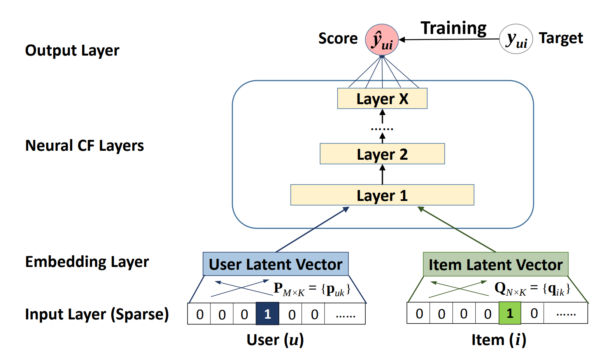

# Neural Collaborative Filtering (NCF) for TensorFlow

This repository provides a script and recipe to train Neural Collaborative Filtering to achieve state of the art
accuracy, and is tested and maintained by NVIDIA.

## Table Of Contents
* [Model overview](#model-overview)
  * [Default Configuration](#default-configuration)
  * [Mixed precision training](#mixed-precision-training)
* [Setup](#setup)
  * [Requirements](#requirements)
* [Quick Start Guide](#quick-start-guide)
* [Advanced](#advanced)
  * [Command Line Arguments](#command-line-arguments)
  * [Getting the Data](#getting-the-data)
  * [Other Datasets](#other-datasets)
  * [Training Process](#training-process)
  * [Evaluation Process](#evaluation-process)
* [Performance](#performance)
  * [Benchmarking](#benchmarking)
    * [Performance Benchmark](#performance-benchmark)
  * [Results](#results)
    * [Training Accuracy Results](#training-accuracy-results)
    * [Training Performance Results](#training-performance-results)
    * [Inference Performance Results](#inference-performance-results)
* [Release notes](#release-notes)
  * [Changelog](#changelog)
  * [Known Issues](#known-issues)

## Model overview

The Neural Collaborative Filtering (NCF) model is a neural network that provides collaborative filtering based on
implicit feedback, specifically, it provides product recommendations based on user and item interactions.  The training
data for this model should contain a sequence of user ID, item ID pairs indicating that the specified user has
interacted with, for example, was given a rating to or clicked on, the specified item. NCF was first described by
Xiangnan He, Lizi Liao, Hanwang Zhang, Liqiang Nie, Xia Hu and Tat-Seng Chua in the [Neural Collaborative Filtering
paper](https://arxiv.org/abs/1708.05031).

The implementation in this repository focuses on the NeuMF instantiation of the NCF architecture. We modified it to use
dropout in the FullyConnected layers. This reduces overfitting and increases the final accuracy. Training the other two
instantiations of NCF (GMF and MLP) is not supported.

Contrary to the original paper, we benchmark the model on the larger [ml-20m
dataset](https://grouplens.org/datasets/movielens/20m/) instead of using the smaller
[ml-1m dataset](https://grouplens.org/datasets/movielens/1m/) as we think this is more realistic of production type
environments. However, using the ml-1m dataset is also supported.

This model takes advantage of the mixed precision tensor cores found on Volta GPUs, demonstrating the reduction in
training time possible by leveraging tensor cores. On a single GPU configuration, training times can be improved close
to 1.6x through the usage of tensor cores.

This model is tested against each NGC monthly container release to ensure consistent accuracy and performance over time.

### Default Configuration

The model takes in a sequence of user ID and item ID pairs as inputs, then feeds them separately into a matrix
factorization step (where the embeddings are multiplied) and a multilayer perceptron (MLP) network.

The outputs of the matrix factorization and the MLP network are then combined and fed into a single dense layer which
predicts whether the input user is likely to interact with the input item. The architecture of the MLP network is shown
below.

<p align="center">
   
   <br>
   Figure 1. The architecture of a Neural Collaborative Filtering model. Taken from the <a href="https://arxiv.org/abs/1708.05031">Neural Collaborative Filtering paper</a>.
</p>

This implementation is implemented with the following features:

- model-parallel multi-gpu training with Horovod
- mixed precision training with TF-AMP (TensorFlow-Automatic Mixed Precision), which enables mixed precision training
  without any changes to the code-base by performing automatic graph rewrites and loss scaling controlled by an
  environmental variable
- fast negative sample generation and data preprocessing with CuPy
    - Before each training epoch, the training data is augmented with randomly generated negatives samples. A “shortcut” is
      enabled by default where the script does not verify that the randomly generated samples are actually negative samples.
      We have found that this shortcut has a low impact on model accuracy while considerably improving the speed and memory
      footprint of the data augmentation stage of training. 
    - Note: The negative samples generated for the test set are always verified regardless if the shortcut is enabled or
      not.

### Mixed Precision Training

[Mixed Precision](https://arxiv.org/abs/1710.03740) training offers significant computational speedup by performing
operations in half-precision format, while storing information in single-precision to retain as much information as
possible. Mixed precision is enabled in TensorFlow by using a custom variable getter that casts variables to
half-precision upon retrieval, while storing variables in single-precision format. Furthermore, to preserve small
gradient magnitudes in backpropagation, a [loss
scaling](https://docs.nvidia.com/deeplearning/sdk/mixed-precision-training/index.html#lossscaling) step must be included
when applying gradients. In TensorFlow, loss scaling can be easily applied by using
[LossScaleOptimizer](https://www.tensorflow.org/api_docs/python/tf/contrib/mixed_precision/LossScaleOptimizer) . The
scaling value to be used can be
[dynamic](https://www.tensorflow.org/api_docs/python/tf/contrib/mixed_precision/ExponentialUpdateLossScaleManager) or
[fixed](https://www.tensorflow.org/api_docs/python/tf/contrib/mixed_precision/FixedLossScaleManager)

Enabling mixed precision is now easier than ever with support for AMP in TensorFlow. TF-AMP is an extension of
TensorFlow that enables mixed precision without any code changes. It accomplishes this by automatically rewriting all
computation graphs with the necessary operations to enable mixed precision training and loss scaling. Currently, TF-AMP
is only available through NVIDIA’s TensorFlow Docker container.

TF-AMP is controlled by the `TF_ENABLE_AUTO_MIXED_PRECISION=1` environment variable; when set, TensorFlow will rewrite
all graphs to perform computations in half-precision format and loss scaling will automatically be applied. 

To enable mixed precision training using TF-AMP, the environment variable can be set prior to running `ncf.py`.
Alternatively, `ncf.py` can be run with the `--fp16` flag.

**Note:**  The `--fp16` flag sets the environment variable to the correct value
for mixed precision training inside the script, for example:

```
# Note that the --fp16 flag maps to the amp variable in code
if args.amp:
    os.environ["TF_ENABLE_AUTO_MIXED_PRECISION"] = "1" 
```

For more information about:
* How to train using mixed precision, see the [Mixed Precision Training](https://arxiv.org/abs/1710.03740) paper
  and the [Training With Mixed Precision documentation](https://docs.nvidia.com/deeplearning/sdk/mixed-precision-training/index.html).
* How to access and enable AMP for TensorFlow, see [Using TF-AMP](https://docs.nvidia.com/deeplearning/dgx/tensorflow-user-guide/index.html#tfamp)
  from the TensorFlow User Guide.


## Setup

The following section lists the requirements in order to start training the NCF model.

### Requirements

This repository contains a `Dockerfile` which extends the TensorFlow NGC container and encapsulates some dependencies.
Aside from these dependencies, ensure you have the following components:

* [NVIDIA Docker](https://github.com/NVIDIA/nvidia-docker)
* [TensorFlow 19.03-py3 NGC container](https://ngc.nvidia.com/catalog/containers/nvidia:tensorflow)
* [NVIDIA Volta based GPU](https://ngc.nvidia.com/catalog/containers/nvidia:tensorflow)

For more information about how to get started with NGC containers, see the following sections from the NVIDIA GPU Cloud
Documentation and the Deep Learning Documentation:

* [Getting Started Using NVIDIA GPU Cloud](https://docs.nvidia.com/ngc/ngc-getting-started-guide/index.html)
* [Accessing And Pulling From The NGC Container Registry](https://docs.nvidia.com/deeplearning/dgx/user-guide/index.html#accessing_registry)
* Running [TensorFlow](https://docs.nvidia.com/deeplearning/dgx/tensorflow-release-notes/running.html#running)

## Quick Start Guide

To train your model using mixed precision with tensor cores or using FP32, perform the following steps using the default
parameters of the NCF model on the ml-20m dataset.

### Clone this repository

```bash
git clone https://github.com/NVIDIA/DeepLearningExamples
cd DeepLearningExamples/TensorFlow/Recommendation/NCF
```

### Build the NCF TensorFlow NGC container.

After Docker is correctly set up, you can build the NCF image with:

```bash
docker build . -t nvidia_ncf
``` 

### Launch the NCF TensorFlow Docker container.

```bash
mkdir data
docker run --runtime=nvidia -it --rm --ipc=host -v ${PWD}/data:/data nvidia_ncf bash
```

This will launch the container and mount the ./data directory as a volume to the /data directory inside the container.
Any datasets and experiment results (logs, checkpoints etc.) saved to /data will be accessible in the ./data directory
on the host.

### Download and preprocess the dataset.

#### ml-20m

Preprocessing consists of downloading the data, filtering out users that have less than 20 ratings (by default), sorting
the data and dropping the duplicates. No data augmentation techniques are used in the preprocessing stage.

To download and preprocess the ml-20m dataset, run:

```bash
./prepare_dataset.sh
```

#### ml-1m

To download and preprocess the ml-1m dataset, run:

```bash
./prepare_dataset.sh ml-1m
```

This will store the preprocessed training and evaluation data in the `/data` directory, so that it can be later used to
train the model (by passing the appropriate `--data` argument to the `ncf.py` script).

### Start training.

After the Docker container is launched, the training with the default hyper-parameters can be started with:

```bash
numgpu=4
datadir=/data/cache/ml-20m
mpirun -np $numgpu \
    --allow-run-as-root \
    python ncf.py --data $datadir
```

After the training is complete, the model parameters that provide the best evaluation accuracy are saved to the
directory passed to the `--checkpoint-dir` argument. By default, this will be in the `/data/checkpoints/` directory.

### Start validation/evaluation.

To run evaluation on a specific checkpoint, simply run the following command:

```bash
checkpoint=/data/checkpoints/model.ckpt
python ncf.py --data /data/cache/ml-20m --mode test --load-checkpoint-path $checkpoint
```

Note: TensorFlow checkpoints consist of 3 files each with a `*.ckpt` prefix.

## Advanced

The following sections provide greater details of the dataset, running training and inference, and the training results.

### Command Line Arguments

To see the full list of available options and their descriptions, use the `-h` or `--help` command line option, for
example: 

```bash
python ncf.py --help
```

Aside from options to set hyperparameters, the relevant options to control the behaviour of the script are: 

```
--data DATA           path to test and training data files
-e EPOCHS, --epochs EPOCHS
                      number of epochs to train for
-b BATCH_SIZE, --batch-size BATCH_SIZE
                      number of examples for each iteration
--valid-users-per-batch VALID_USERS_PER_BATCH
                      Number of users tested in each evaluation batch
-n NEGATIVE_SAMPLES, --negative-samples NEGATIVE_SAMPLES
                      number of negative examples per interaction
-k TOPK, --topk TOPK  rank for test examples to be considered a hit
--fp16                enable half-precision computations using automatic
                      mixed precision (only available in supported
                      containers)
--xla                 enable TensorFlow XLA (Accelerated Linear Algebra)
--valid-negative VALID_NEGATIVE
                      Number of negative samples for each positive test
                      example
--loss-scale LOSS_SCALE
                      Loss scale value to use when manually enabling mixed precision training
--checkpoint-dir CHECKPOINT_DIR
                      Path to store the result checkpoint file for training, or to read from for evaluation
--mode {train,test}   Passing "test" will only run a single evaluation,
                      otherwise full training will be performed
--no-neg-trick        do not use negative sample generation shortcut to
                      speed up preprocessing (will increase GPU memory
                      consumption)
--eval-after EVAL_AFTER
                      Perform evaluations only after this many epochs
--verbose             Log the performance and accuracy after every epoch

```

### Getting the Data

For each user, the test dataset is generated by removing one movie the user has
interacted with. For each removed movie, the data is augmented with a large
number of movies (corresponding to the `--valid-negative option`) that the user
has not interacted with.

The repository contains the `prepare_dataset.sh` download script which will
automatically call `download_dataset.sh` to download the desired dataset, and
then preprocess the training and test datasets. By default, data will be
downloaded to the `/data` directory.

#### Other Datasets

This implementation is tuned for the ml-20m and ml-1m datasets.  Using other
datasets might require tuning some hyperparameters (for example, learning rate,
beta1, beta2).

If you'd like to use your custom dataset, you can do so by adding support for
it in the `prepare_dataset.sh` and `download_dataset.sh` scripts. The required
format of the data is a CSV file which should follow the pattern outlined
below:

```
userId, movieId
1,2
1,10
...
```

The CSV file may contain additional columns with extra features such as ratings
and timestamps, but only the `userId` and `movieId` columns are required.

The performance of the model depends on the dataset size. Generally, the model
should scale better for datasets containing more data points. For a smaller
dataset, you might experience slower performance as fixed cost operations that
do not scale with input size will have a larger impact. Furthermore, it will be
difficult for the model to converge.

### Training Process

The training can be launched with the `ncf.py` script. This script will train the
NCF model for a number of epochs specified by the `--epochs` argument, which has
a default value of 40.

During training, the script will begin logging after the number of epochs
specified by the `--eval-after` option. Once a new accuracy record has been set,
the script will output a line like the one below:

```
New Best Epoch: 09, Train Time: 11.4197, Eval Time: 0.7425, HR: 0.9518, NDCG: 0.7341
```

If the `--verbose` option is set, then a line like the one below will be output
at the end of each epoch:

```
Epoch: 08, Train Time: 2.6491, Eval Time: 0.1602, HR: 0.9566, NDCG: 0.7406
```

The evaluation metrics are HR (hit rate), and NDCG (normalized discounted
cumulative gain). In the evaluation set, each user will be assigned one item
that they have actually interacted with, and a number (by default 99) of items
that they have not interacted with. For each user, the evaluation process will
rank each of the items assigned to that user based on the user’s likeliness to
interact with the items. The hit rate measures the percentage of users for
which the item that they have interacted with is ranked within the top `k` items,
where `k` is a number (by default 10) specified by the `-k` option. NDCG has a
similar meaning, except the rank of the positive item is taken into account.
Typically, HR is used as the primary evaluation metric.

At the end of training, output similar to the following provides statistics
regarding the training and evaluation throughputs, as well as the model
accuracies:

```
Minimum Train Time per Epoch: 2.0085
Average Train Time per Epoch: 2.0847
Average Train Throughput:     47654877.9464
Minimum Eval Time per Epoch:  0.1199
Average Eval Time per Epoch:  0.1372
Average Eval Throughput:      1030575.0538
First Epoch to hit:           9
Time to Train:                26.1703
Best HR:                      0.9594
Best Epoch:                   13
```

Additionally, the model parameters that give the best accuracy in validation
will be stored at the directory pointed to by the `--checkpoint-dir` argument.

Multiple GPUs can be used for training through Horovod. The number of GPUs can
be controlled by the `-np` parameter passed to `mpirun`.

### Evaluation Process

The evaluation process can be run by the ncf.py script as well. By passing the
`--mode=test argument`, the script will run evaluation once using the TensorFlow
checkpoint specified by the `--checkpoint-dir` file.


The script will then output a line like the one below which describes the model accuracy:

```
Eval Time = 1.1829, HR@10 = 0.9574, NDCG@10 = 0.7420
```

## Performance

### Benchmarking

The following section shows how to run benchmarks measuring the model
performance in training and inference modes.

#### Performance Benchmark

To benchmark the training and inference performance, run: 

```
mpirun -np 1 --allow-run-as-root python ncf.py --data /data/cache/ml-20m
```

By default, the `ncf.py` script outputs metrics describing the following:

* Training speed and throughput
* Evaluation speed and throughput

### Results

The following sections provide details on how we achieved our performance and accuracy in training and inference.

### Training Accuracy Results

Our results were obtained by running the `ncf.py` training script in the
TensorFlow 19.03-py3 NGC container on a NVIDIA DGX-1 with 8x V100 16G GPUs.
Results for mixed precision were obtained using the `--fp16` flag.

For each configuration, the `ncf.py` script was run 5 times each with different
initial random seeds.  The maximum hit rate achieved among all 5 runs is
recorded to demonstrate the maximum accuracy the model can achieve.

| **Number of GPUs** | **Maximum HR achieved, FP16** | **Maximum HR achieved, FP32** |
|:---:|:--------:|:-------:|
| 1 | 0.9585 | 0.9592 |
| 4 | 0.9589 | 0.9591 |
| 8 | 0.9597 | 0.9598 |

### Training Performance Results

#### NVIDIA DGX-1 (8x V100 16G)

Our results were obtained by running the `ncf.py` training script in the
TensorFlow 19.03-py3 NGC container on a NVIDIA DGX-1 with 8x V100 16GB GPUs
with a consistent global batch size of 1048576 samples. Additionally, for
multiple GPU configurations, a strong scaling strategy is used where the global
batch size remains constant, as opposed to the more traditional weak scaling
strategy where the local batch size is kept constant and the global batch size
increases.  Strong scaling is required due to the model’s inability to converge
at larger batch sizes. Results for mixed precision were obtained using the `--fp16` flag.

For each configuration, the `ncf.py` script was run 5 times each with different
initial random seeds.  The average training throughput among all 5 runs is
recorded to demonstrate the expected training performance the model can
achieve.

| **Number of GPUs** | **FP16 items/sec** | **FP32 items/sec** | **FP16/FP32 speedup** |
|:---:|:-------------:|:-----------:|:-----:|
| 1 | 14,913,842 | 9,255,160 | 1.61x |
| 4 | 39,507,815 | 29,632,703 | 1.33x |
| 8 | 59,462,515 | 49,636,357 | 1.20x |

To achieve these same results, follow the [Quick Start Guide](#quick-start-guide) outlined above.

The performance was measured by the wall clock time over one training epoch.
The number of samples in the epoch (roughly 100 million samples), was then
divided by the average training duration to obtain the items per second metric.

Those results can be improved when [XLA](https://www.tensorflow.org/xla) is used 
in conjunction with mixed precision, delivering up to 2.6x speedup over FP32 on a single GPU (~24.3M items/sec). 
However XLA is still considered experimental.

#### NVIDIA DGX-1 (8x V100 32G)

Our results were obtained by running the `ncf.py` training script in the
TensorFlow 19.03-py3 NGC container on a NVIDIA DGX-1 with 8x V100 32G GPUs with
a consistent global batch size of 1048576 samples. Strong scaling is required
due to the model’s inability to converge at larger batch sizes.

For each configuration, the `ncf.py` script was run 5 times each with different
initial random seeds.  The average training throughput among all 5 runs is
recorded to demonstrate the expected training performance the model can
achieve.

| **Number of GPUs** | **FP16 items/sec** | **FP32 items/sec** | **FP16/FP32 speedup** |
|:---:|:-------------:|:-----------:|:-----:|
| 1 | 14,150,737 | 8,936,983 | 1.58x |
| 4 | 37,770,501 | 28,848,636 | 1.31x |
| 8 | 55,563,205 | 47,057,615 | 1.18x |

To achieve these same results, follow the [Quick Start Guide](#quick-start-guide) outlined above.

The performance was measured by the wall clock time over one training epoch.
The number of samples in the epoch (roughly 100 million samples), was then
divided by the average training duration to obtain the items per second metric.

### Inference Performance Results

Our results were obtained by running the `ncf.py` training script in the
TensorFlow 19.03-py3 NGC container on a NVIDIA DGX-1 with 1x V100 16G GPUs.

For each configuration, the `ncf.py` script was run 5 times each with different
initial random seeds.  The average inference throughput among all 5 runs is
recorded to demonstrate the expected inference performance the model can
achieve.

| **Number of GPUs** | **FP16 items/sec** | **FP32 items/sec** | **FP16/FP32 speedup** |
|:---:|:-------------:|:-----------:|:-----:|
| 1 | 29,248,168 | 19,718,807 | 1.48x |
| 4 | 88,255,971 | 66,625,422 | 1.32x |
| 8 | 119,159,304 | 100,117,608 | 1.19x |

## Release Notes

### Changelog

March 2019
* Initial Release

### Known Issues 

#### Multi-GPU Scaling Efficiency

Currently, this model does not exhibit good scaling efficiency when scaling to
4 and 8 GPUs.  Since we could not find hyper-parameters that could hit the
target accuracy for batch size of over 1 million samples, we elected to use a
strong scaling strategy which generally has worse scaling efficiency compared
to a more common weak scaling strategy. Additionally, we believe that the small
dataset size does not facilitate great scaling. However, the training scripts
allow the use of custom datasets provided they are in the correct format.

#### Scaling beyond 8 GPUs

Neural Collaborative Filtering (NCF) is a relatively lightweight model that
trains quickly with this relatively smaller dataset, ml-20m. Because of the
smaller dataset, the high ratio of communication to computation makes it
difficult to efficiently use more than 8 GPUs. Typically, this is not an issue
because when using 8 GPUs with FP16 precision the training is sufficiently
fast. However, if you would like to scale the training to 16 GPUs and beyond,
you might try modifying the model so that the communication to computation
ratio facilitates better scaling. This could be done, for example, by finding
hyper-parameters that enable using a larger global batch size.

### Preprocessing Out-of-Memory with 16GB GPUs

When running on GPUs with 16GB of memory, ensure the `--no-neg-trick` flag is
**not** set. Otherwise, the data augmentation stage of training will consume
too much GPU memory, causing TensorFlow to raise an out-of-memory error.

This flag, when it is not set, reduces memory consumption in the negative
samples generation phase of training by telling the script not to verify that
the randomly generated samples are actually negative samples (verification
still occurs for negative samples generated for the test set). Therefore, there
is no need to keep the data structures used to verify negative samples in
memory during training.
