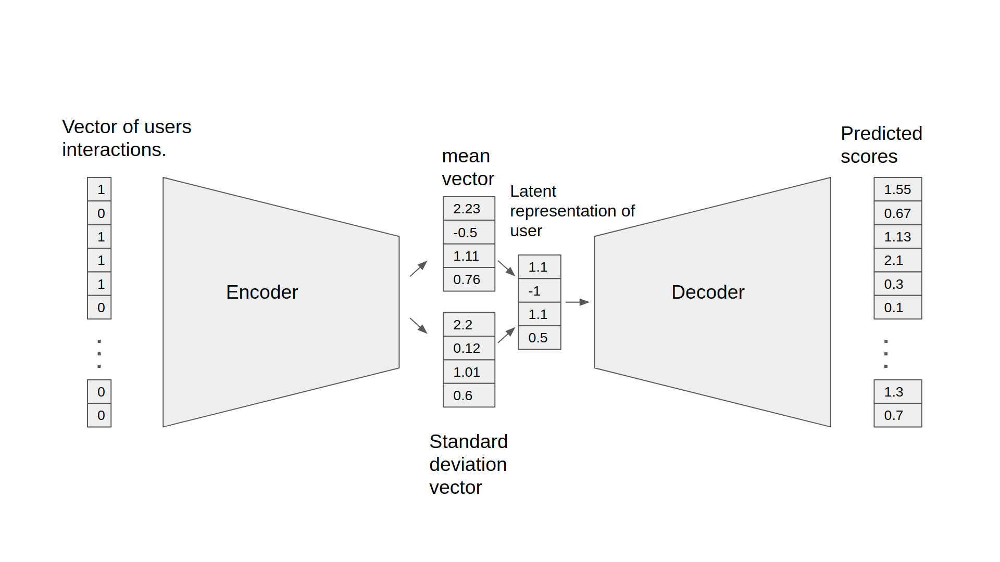

# Variational Autoencoder for Collaborative Filtering for TensorFlow

This repository provides a script and recipe to train the Variational Autoencoder model for TensorFlow to achieve state-of-the-art accuracy on a Collaborative Filtering task and is tested and maintained by NVIDIA.

## Table Of Contents

- [Model overview](#model-overview)
    * [Model architecture](#model-architecture)
    * [Default configuration](#default-configuration)
    * [Feature support matrix](#feature-support-matrix)
	    * [Features](#features)
    * [Mixed precision training](#mixed-precision-training)
	    * [Enabling mixed precision](#enabling-mixed-precision)
- [Setup](#setup)
    * [Requirements](#requirements)
- [Quick Start Guide](#quick-start-guide)
- [Advanced](#advanced)
    * [Scripts and sample code](#scripts-and-sample-code)
    * [Parameters](#parameters)
    * [Command-line options](#command-line-options)
    * [Getting the data](#getting-the-data)
        * [Dataset guidelines](#dataset-guidelines)
    * [Training process](#training-process)
    * [Inference process](#inference-process)

- [Performance](#performance)
    * [Benchmarking](#benchmarking)
        * [Training performance benchmark](#training-performance-benchmark)
        * [Inference performance benchmark](#inference-performance-benchmark)
    * [Results](#results)
        * [Training accuracy results](#training-accuracy-results)
            * [Training accuracy: NVIDIA DGX-1 (8x V100 16G)](#training-accuracy-nvidia-dgx-1-8x-v100-16g)
        * [Training performance results](#training-performance-results)
            * [Training performance: NVIDIA DGX-1 (8x V100 16G)](#training-performance-nvidia-dgx-1-8x-v100-16g)
        * [Inference performance results](#inference-performance-results)
            * [Inference performance: NVIDIA DGX-1 (1x V100 16G)](#inference-performance-nvidia-dgx-1-1x-v100-16g)
- [Release notes](#release-notes)
    * [Changelog](#changelog)
    * [Known issues](#known-issues)


## Model overview

The Variational Autoencoder (VAE) shown here is an optimized implementation of the architecture first described in [Variational Autoencoders for Collaborative Filtering](https://arxiv.org/abs/1802.05814) and can be used for recommendation tasks. The main differences between this model and the original one are the performance optimizations, such as using sparse matrices, mixed precision, larger mini-batches and multiple GPUs. These changes enabled us to achieve a significantly better speed while maintaining the same accuracy. Because of our fast implementation, we’ve also been able to carry out an extensive hyperparameter search to slightly improve the accuracy metrics.

When using Variational Autoencoder for Collaborative Filtering (VAE-CF), you can quickly train a recommendation model for a collaborative filtering task. The required input data consists of pairs of user-item IDs for each interaction between a user and an item. With a trained model, you can run inference to predict what items are a new user most likely to interact with. 

This model is trained with mixed precision using Tensor Cores on NVIDIA Volta and Turing GPUs. Therefore, researchers can get results 1.9x faster than training without Tensor Cores, while experiencing the benefits of mixed precision training. This model is tested against each NGC monthly container release to ensure consistent accuracy and performance over time.

This implementation has been initially developed as an educational project at the University of Warsaw by Albert Cieślak, Michał Filipiuk, Frederic Grabowski and Radosław Rowicki.

### Model architecture

<p align="center">
   
   <br>
   Figure 1. The architecture of the VAE-CF model </p>


The Variational Autoencoder is a neural network that provides collaborative filtering based on implicit feedback. Specifically, it provides product recommendations based on user and item interactions. The training data for this model should contain a sequence of user ID, item ID pairs indicating that the specified user has interacted with,  and the specified item. 

The model consists of two parts: the encoder and the decoder. 
The encoder transforms the vector, that contains the interactions for a specific user, into an n-dimensional variational distribution. We can then use this variational distribution to obtain a latent representation of a user. 
This latent representation is then fed into the decoder. The result is a vector of item interaction probabilities for a particular user.

### Default configuration

The following features were implemented in this model:
- general
	- sparse matrix support
	- data-parallel multi-GPU training
	- dynamic loss scaling with backoff for tensor cores (mixed precision) training 
    
### Feature support matrix

The following features are supported by this model: 

| Feature               | VAE-CF       
|-----------------------|--------------------------   
|Horovod Multi-GPU (NCCL)          |     Yes            
|Automatic mixed precision (AMP)   |     Yes     
         
#### Features

##### Horovod

Horovod is a distributed training framework for TensorFlow, Keras, PyTorch and MXNet. The goal of Horovod is to make distributed deep learning fast and easy to use. For more information about how to get started with Horovod, see the [Horovod: Official repository](https://github.com/horovod/horovod).

##### Multi-GPU training with Horovod

Our model uses Horovod to implement efficient multi-GPU training with NCCL. For details, see example sources in this repository or see the [TensorFlow tutorial](https://github.com/horovod/horovod/#usage).


### Mixed precision training

Mixed precision is the combined use of different numerical precisions in a computational method. [Mixed precision](https://arxiv.org/abs/1710.03740) training offers significant computational speedup by performing operations in half-precision format, while storing minimal information in single-precision to retain as much information as possible in critical parts of the network. Since the introduction of [Tensor Cores](https://developer.nvidia.com/tensor-cores) in the Volta and Turing architecture, significant training speedups are experienced by switching to mixed precision -- up to 3x overall speedup on the most arithmetically intense model architectures. Using mixed precision training requires two steps:
1.  Porting the model to use the FP16 data type where appropriate.    
2.  Adding loss scaling to preserve small gradient values.

The ability to train deep learning networks with lower precision was introduced in the Pascal architecture and first supported in [CUDA 8](https://devblogs.nvidia.com/parallelforall/tag/fp16/) in the NVIDIA Deep Learning SDK.

For information about:
-   How to train using mixed precision, see the [Mixed Precision Training](https://arxiv.org/abs/1710.03740) paper and [Training With Mixed Precision](https://docs.nvidia.com/deeplearning/sdk/mixed-precision-training/index.html) documentation.
-   Techniques used for mixed precision training, see the [Mixed-Precision Training of Deep Neural Networks](https://devblogs.nvidia.com/mixed-precision-training-deep-neural-networks/) blog.
-   How to access and enable AMP for TensorFlow, see [Using TF-AMP](https://docs.nvidia.com/deeplearning/dgx/tensorflow-user-guide/index.html#tfamp) from the TensorFlow User Guide.


#### Enabling mixed precision

To enable mixed precision in VAE-CF, run the `main.py` script with the `--use_tf_amp` flag.


## Setup

The following section lists the requirements that you need to meet in order to start training the VAE-CF model.

### Requirements

This repository contains Dockerfile which extends the Tensorflow NGC container and encapsulates some dependencies. Aside from these dependencies, ensure you have the following components:
-   [NVIDIA Docker](https://github.com/NVIDIA/nvidia-docker)
-   Tensorflow 19.11+ NGC container
-   [NVIDIA Volta](https://www.nvidia.com/en-us/data-center/volta-gpu-architecture/) or [Turing](https://www.nvidia.com/en-us/geforce/turing/) based GPU

For more information about how to get started with NGC containers, see the following sections from the NVIDIA GPU Cloud Documentation and the Deep Learning Documentation:
-   [Getting Started Using NVIDIA GPU Cloud](https://docs.nvidia.com/ngc/ngc-getting-started-guide/index.html)
-   [Accessing And Pulling From The NGC Container Registry](https://docs.nvidia.com/deeplearning/frameworks/user-guide/index.html#accessing_registry)
- [Running TensorFlow](https://docs.nvidia.com/deeplearning/frameworks/tensorflow-release-notes/running.html#running)
  
For those unable to use the TensorFlow NGC container, to set up the required environment or create your own container, see the versioned [NVIDIA Container Support Matrix](https://docs.nvidia.com/deeplearning/frameworks/support-matrix/index.html).

## Quick Start Guide

To train your model using mixed precision with Tensor Cores or using FP32, perform the following steps using the default parameters of the VAE-CF model on the [MovieLens 20m dataset](https://grouplens.org/datasets/movielens/20m/). For the specifics concerning training and inference, see the [Advanced](#advanced) section.

1. Clone the repository.
```bash
git clone https://github.com/NVIDIA/DeepLearningExamples
cd DeepLearningExamples/Tensorflow/Recommendation/VAE_CF
```

2. Build the VAE TensorFlow NGC container.
```bash
docker build . -t vae
``` 

3. Launch the VAE-CF TensorFlow Docker container.
```bash
docker run -it --rm --runtime=nvidia -v /data/vae-cf:/data vae /bin/bash
``` 

4. Prepare the dataset.
```bash
python3 prepare_dataset.py
``` 

5. Start training.
```bash
python3 main.py --train --use_tf_amp --checkpoint_dir ./checkpoints
```

6. Start validation/evaluation.
The model is exported to the default `model_dir` and can be loaded and tested using:
```bash
python3 main.py --test --use_tf_amp --checkpoint_dir ./checkpoints
```


## Advanced

The following sections provide greater details of the dataset, running training and inference, and the training results.

### Scripts and sample code

The `main.py` script provides an entry point to all the provided functionalities. This includes running training, testing and inference. The behavior of the script is controlled by command-line arguments listed below in the [Parameters](#parameters) section. The `prepare_dataset.py` script can be used to download and preprocess the MovieLens 20m dataset.

Most of the deep learning logic is implemented in the `vae/models` subdirectory. The `vae/load` subdirectory contains code for downloading and preprocessing the dataset. The `vae/metrics` subdirectory provides functions for computing the validation metrics such as recall and [NDCG](https://en.wikipedia.org/wiki/Discounted_cumulative_gain#Normalized_DCG).

### Parameters

To train a VAE-CF model in TensorFlow the following parameters are supported:

```
usage: main.py [-h] [--train] [--test] [--inference] [--inference_benchmark]
               [--use_tf_amp] [--epochs EPOCHS]
               [--batch_size_train BATCH_SIZE_TRAIN]
               [--batch_size_validation BATCH_SIZE_VALIDATION]
               [--validation_step VALIDATION_STEP]
               [--warm_up_epochs WARM_UP_EPOCHS]
               [--total_anneal_steps TOTAL_ANNEAL_STEPS]
               [--anneal_cap ANNEAL_CAP] [--lam LAM] [--lr LR] [--beta1 BETA1]
               [--beta2 BETA2] [--top_results TOP_RESULTS] [--xla] [--trace]
               [--activation ACTIVATION] [--log_path LOG_PATH] [--seed SEED]
               [--data_dir DATA_DIR] [--checkpoint_dir CHECKPOINT_DIR]

Train a Variational Autoencoder for Collaborative Filtering in TensorFlow

optional arguments:
  -h, --help            show this help message and exit
  --train               Run training of VAE
  --test                Run validation of VAE
  --inference           Run inference on a single random example.This can also
                        be used to measure the latency for a batch size of 1
  --inference_benchmark
                        Benchmark the inference throughput on a very large
                        batch size
  --use_tf_amp          Enable Automatic Mixed Precision
  --epochs EPOCHS       Number of epochs to train
  --batch_size_train BATCH_SIZE_TRAIN
                        Global batch size for training
  --batch_size_validation BATCH_SIZE_VALIDATION
                        Used both for validation and testing
  --validation_step VALIDATION_STEP
                        Train epochs for one validation
  --warm_up_epochs WARM_UP_EPOCHS
                        Number of epochs to omit during benchmark
  --total_anneal_steps TOTAL_ANNEAL_STEPS
                        Number of annealing steps
  --anneal_cap ANNEAL_CAP
                        Annealing cap
  --lam LAM             Regularization parameter
  --lr LR               Learning rate
  --beta1 BETA1         Adam beta1
  --beta2 BETA2         Adam beta2
  --top_results TOP_RESULTS
                        Number of results to be recommended
  --xla                 Enable XLA
  --trace               Save profiling traces
  --activation ACTIVATION
                        Activation function
  --log_path LOG_PATH   Path to the detailed JSON log from to be created
  --seed SEED           Random seed for TensorFlow and numpy
  --data_dir DATA_DIR   Directory for storing the training data
  --checkpoint_dir CHECKPOINT_DIR
                        Path for saving a checkpoint after the training

```

### Command-line options

To see the full list of available options and their descriptions, use the `-h` or `--help` command-line option, for example:
```bash
python main.py --help
```


### Getting the data

The VA-CF model was trained on the [MovieLens 20M dataset](https://grouplens.org/datasets/movielens/20m/). The dataset can be downloaded and preprocessed simply by running: `python prepare_dataset.py` in the Docker container. By default, the dataset will be stored in the `/data` directory. If you want to store the data in a different location, you can pass the desired location to the `--data_dir` argument.

#### Dataset guidelines

As a Collaborative Filtering model, VAE-CF only uses information about which user interacted with which item. For the MovieLens dataset, this means that a particular user has positively reviewed a particular movie. VAE-CF can be adapted to any other collaborative filtering task. The input to the model is generally a list of all interactions between users and items. One column of the CSV should contain user IDs while the other should contain item IDs. Example preprocessing for the MovieLens 20M dataset is provided in the `vae/load/preprocessing.py` file.


### Training process

The training can be started by running the `main.py` script with the `train` argument. The resulting checkpoints containing the trained model weights are then stored in the directory specified by the `--checkpoint_dir` directory (by default, no checkpoints are saved).

Additionally, a command-line argument called `--results_dir` (by default None) can be used to enable saving some statistics to JSON files in a directory specified by this parameter. The statistics saved are:
1) a complete list of command-line arguments saved as `<results_dir>/args.json` and
2) a dictionary of validation metrics and performance metrics recorded during training

The main validation metric used is [NDCG@100](https://en.wikipedia.org/wiki/Discounted_cumulative_gain#Normalized_DCG). Following the original VAE-CF paper we also report numbers for Recall@20 and Recall@50.

Multi-GPU training uses horovod. You can run it with:
```horovodrun -np 8 -H localhost:8 python3 main.py  --train --use_tf_amp```

Mixed precision support is controlled by the `--use_tf_amp` command-line flag. It enables TensorFlow’s Automatic Mixed Precision mode.


### Inference process

Inference on a trained model can be run by passing the `--inference` argument to the main.py script, for example:
```
python3 main.py --inference --use_tf_amp --checkpoint_dir /checkpoints
```
This will generate a user with a collection of random items that they interacted with and run inference for that user. The result is a list of K recommended items the user is likely to interact with. You can control the number of items to be recommended by setting the `--top_results` command-line argument (by default 100).


## Performance

### Benchmarking

The following section shows how to run benchmarks measuring the model performance in training and inference modes.

#### Training performance benchmark


To benchmark the training performance, run:
```
horovodrun -np 8 -H localhost:8 python3 main.py  --train --use_tf_amp
```

Training benchmark was run on 8x V100 16G GPUs.

#### Inference performance benchmark

To benchmark the inference performance, run:
```
python3 main.py  --inference_benchmark --use_tf_amp --batch_size_validation 24576
```
 
Inference benchmark was run on 1x V100 16G GPU.

### Results

The following sections provide details on how we achieved our performance and accuracy in training and inference.

#### Training accuracy results

##### Training accuracy: NVIDIA DGX-1 (8x V100 16G)

Our results were obtained by running the `main.py` training script in the TensorFlow 19.11 NGC container on NVIDIA DGX-1 with (8x V100 16G) GPUs.

| GPUs | Batch size / GPU | Accuracy - FP32 | Accuracy - mixed precision  | Time to train - FP32 (s) |  Time to train - mixed precision (s) | Time to train speedup (FP32 to mixed precision) |
|---|---|---|---|---|---|---|
| 1 | 24576 | 0.42863  | 0.42824 | 357.6| 205.9  | 1.737 |
| 8 | 3072  | 0.42763  | 0.42766 | 59.7 | 43.2   | 1.381 |


#### Training performance results

##### Training performance: NVIDIA DGX-1 (8x V100 16G)

Our results were obtained by running:
```
 horovodrun -np 8 -H localhost:8 python3 main.py  --train --use_tf_amp
```
in the TensorFlow 19.11 NGC container on NVIDIA DGX-1 with 8x V100 16G GPUs. Performance numbers (throughput in users processed per second) were averaged over an entire training run.

| GPUs   | Batch size / GPU   | Throughput - FP32    | Throughput - mixed precision    | Throughput speedup (FP32 - mixed precision)   | Strong scaling - FP32    | Strong scaling - mixed precision |
|---|---|---|---|---|---|---|
| 1 | 24576| 116k | 219k | 1.897 | 1.00| 1.00|
| 8 | 3072 | 685k | 966k | 1.410 | 5.92 | 4.41 |

We use users processed per second as a throughput metric for measuring training performance.

#### Inference performance results

##### Inference performance: NVIDIA DGX-1 (1x V100 16G)

Our results were obtained by running:
```
python3 main.py  --inference_benchmark --use_tf_amp --batch_size_validation 24576
```
in the TensorFlow 19.11 NGC container on NVIDIA DGX-1 with (1x V100 16G) GPU.

| GPUs   | Batch size / GPU   | Inference Throughput - FP32    | Inference Throughput - mixed precision    | Inference Throughput speedup (FP32 - mixed precision) |
|---|---|---|---|---|
| 1 | 24576| 127k | 154k | 1.215 |

We use users processed per second as a throughput metric for measuring inference performance.

To achieve these same results, follow the steps in the [Quick Start Guide](#quick-start-guide).

## Release notes

### Changelog

November 2019
- Initial release

### Known issues

Multi-GPU scaling

We benchmark this implementation on the ML-20m dataset so that our results are comparable to the original VAE-CF paper. We also use the same neural network architecture. As a consequence, the ratio of communication to computation is relatively large. This means that although using multiple GPUs speeds up the training substantially, the scaling efficiency is worse from what one would expect if using a larger model and a more realistic dataset.

