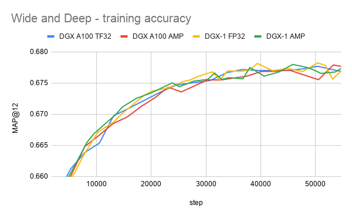

# Wide & Deep Recommender Model Training For TensorFlow

This repository provides a script and recipe to train the Wide and Deep Recommender model to achieve state-of-the-art accuracy and is tested and maintained by NVIDIA.

## Table Of Contents

- [Model overview](#model-overview)
    * [Model architecture](#model-architecture)
    * [Applications and dataset](#applications-and-dataset)
    * [Default configuration](#default-configuration)
    * [Feature support matrix](#feature-support-matrix)
	    * [Features](#features)
    * [Mixed precision](#mixed-precision)
	    * [Enabling mixed precision](#enabling-mixed-precision)
            * [Impact of mixed precision on training accuracy](#impact-of-mixed-precision-on-training-accuracy)
            * [Impact of mixed precision on inference accuracy](#impact-of-mixed-precision-on-inference-accuracy)
	    * [Enabling TF32](#enabling-tf32)
    * [Glossary](#glossary)
- [Setup](#setup)
    * [Requirements](#requirements)
- [Quick Start Guide](#quick-start-guide)
- [Advanced](#advanced)
    * [Scripts and sample code](#scripts-and-sample-code)
    * [Parameters](#parameters)
    * [Command-line options](#command-line-options)
    * [Getting the data](#getting-the-data)
        * [Dataset guidelines](#dataset-guidelines)
        * [Spark preprocessing](#spark-preprocessing)
    * [Training process](#training-process)
- [Performance](#performance)
    * [Benchmarking](#benchmarking)
        * [Training performance benchmark](#training-performance-benchmark)
    * [Results](#results)
        * [Training accuracy results](#training-accuracy-results)
            * [Training accuracy: NVIDIA DGX A100 (8x A100 40GB)](#training-accuracy-nvidia-dgx-a100-8x-a100-40gb)
            * [Training accuracy: NVIDIA DGX-1 (8x V100 16GB)](#training-accuracy-nvidia-dgx-1-8x-v100-16gb)
            * [Training accuracy plots](#training-accuracy-plots)
            * [Training stability test](#training-stability-test)
        * [Training performance results](#training-performance-results)
            * [Training performance: NVIDIA DGX A100 (8x A100 40GB)](#training-performance-nvidia-dgx-a100-8x-a100-40gb)
            * [Training performance: NVIDIA DGX-1 (8x V100 16GB)](#training-performance-nvidia-dgx-1-8x-v100-16gb)
- [Release notes](#release-notes)
    * [Changelog](#changelog)
    * [Known issues](#known-issues)


## Model overview

Recommendation systems drive engagement on many of the most popular online platforms. As the volume of data available to power these systems grows exponentially, data scientists are increasingly turning from more traditional machine learning methods to highly expressive deep learning models to improve the quality of their recommendations. Google's [Wide & Deep Learning for Recommender Systems](https://arxiv.org/abs/1606.07792) has emerged as a popular model for these problems both for its robustness to signal sparsity as well as its user-friendly implementation in [TensorFlow](https://www.tensorflow.org/api_docs/python/tf/estimator/DNNLinearCombinedClassifier).

The differences between this Wide & Deep Recommender Model and the model from the paper is the size of the Deep part of the model. Originally, in Google's paper, the fully connected part was three layers of 1024, 512, and 256 neurons. Our model consists of 5 layers each of 1024 neurons. 

The model enables you to train a recommender model that combines the memorization of the Wide part and generalization of the Deep part of the network.

This model is trained with mixed precision using Tensor Cores on NVIDIA Volta, Turing and the NVIDIA Ampere GPU architectures. Therefore, researchers can get results 1.43 times faster than training without Tensor Cores, while experiencing the benefits of mixed precision training. This model is tested against each NGC monthly container release to ensure consistent accuracy and performance over time.

### Model architecture

Wide & Deep refers to a class of networks that use the output of two parts working in parallel - wide model and deep model - to make predictions of recommenders. The wide model is a generalized linear model of features together with their transforms. The deep model is a series of 5 hidden MLP layers of 1024 neurons each beginning with a dense embedding of features. The architecture is presented in Figure 1.

<p align="center">
  
  <br>
Figure 1. The architecture of the Wide & Deep model.</a>
</p>

### Applications and dataset

As a reference dataset, we used a subset of [the features engineered](https://github.com/gabrielspmoreira/kaggle_outbrain_click_prediction_google_cloud_ml_engine) by the 19th place finisher in the [Kaggle Outbrain Click Prediction Challenge](https://www.kaggle.com/c/outbrain-click-prediction/). This competition challenged competitors to predict the likelihood with which a particular ad on a website's display would be clicked on. Competitors were given information about the user, display, document, and ad in order to train their models. More information can be found [here](https://www.kaggle.com/c/outbrain-click-prediction/data).


### Default configuration

For reference, and to give context to the acceleration numbers described below, some important properties of our features and model are as follows:

- Features
    - Request Level
        - 16 scalar numeric features `(shape=(1,)`)
        - 12 one-hot categorical features (all `int` dtype)
            - 5 indicator embeddings with sizes 2, 2, 3, 3, 6
            - 7 trainable embeddings
                - all except two have an embedding size of 64 (remaining two have 128), though it's important to note for *all* categorical features that we *do not* leverage that information to short-circuit the lookups by treating them as a single multi-hot lookup. Our API is fully general to any combination of embedding sizes.
                - all use hash bucketing with `num_buckets=` 300k, 100k, 4k, 2.5k, 2k, 1k, and 300 respectively
        - 3 multi-hot categorical features (all `int` dtype)
            - all trainable embeddings
            - all with embedding size 64
            - all use hash bucketing with `num_buckets=` 10k, 350, and 100 respectively
    - Item Level
        - 16 scalar numeric features
        - 4 one hot categorical features (all `int` dtype)
            - embedding sizes of 128, 64, 64, 64 respectively
            - hash bucketing with `num_buckets=` 250k, 4k, 2.5k, and 1k respectively
        - 3 multi-hot categorical features (all `int` dtype)
            - all with embedding size 64
            - hash bucketing with `num_buckets=` 10k, 350, and 100 respectively
    - All features are used in both wide *and* deep branches of the network

- Model
    - Total embedding dimension is 1328
    - 5 hidden layers each with size 1024
    - Output dimension is 1 (probability of click)

### Feature support matrix

The following features are supported by this model: 

| Feature               | Wide & Deep                
|-----------------------|--------------------------
|Horovod Multi-GPU      | Yes        
|Automatic mixed precision (AMP)   | Yes          
         
#### Features

Horovod

Horovod is a distributed training framework for TensorFlow, Keras, PyTorch and MXNet. The goal of Horovod is to make distributed deep learning fast and easy to use. For more information about how to get started with Horovod, see the [Horovod: Official repository](https://github.com/horovod/horovod).

Multi-GPU training with Horovod

Our model uses Horovod to implement efficient multi-GPU training with NCCL. For details, see example sources in this repository or see the [TensorFlow tutorial](https://github.com/horovod/horovod/#usage).


### Mixed precision

Mixed precision is the combined use of different numerical precisions in a computational method. [Mixed precision](https://arxiv.org/abs/1710.03740) training offers significant computational speedup by performing operations in half-precision format while storing minimal information in single-precision to retain as much information as possible in critical parts of the network. Since the introduction of [Tensor Cores](https://developer.nvidia.com/tensor-cores) in the Volta and Turing architecture, significant training speedups are experienced by switching to mixed precision -- up to 3x overall speedup on the most arithmetically intense model architectures. Using mixed precision training requires two steps:
1.  Porting the model to use the FP16 data type where appropriate.    
2.  Adding loss scaling to preserve small gradient values.

The ability to train deep learning networks with lower precision was introduced in the Pascal architecture and first supported in [CUDA 8](https://devblogs.nvidia.com/parallelforall/tag/fp16/) in the NVIDIA Deep Learning SDK.

For information about:
-   How to train using mixed precision, see the [Mixed Precision Training](https://arxiv.org/abs/1710.03740) paper and [Training With Mixed Precision](https://docs.nvidia.com/deeplearning/sdk/mixed-precision-training/index.html) documentation.
-   Techniques used for mixed precision training, see the [Mixed-Precision Training of Deep Neural Networks](https://devblogs.nvidia.com/mixed-precision-training-deep-neural-networks/) blog.
-   How to access and enable AMP for TensorFlow, see [Using TF-AMP](https://docs.nvidia.com/deeplearning/dgx/tensorflow-user-guide/index.html#tfamp) from the TensorFlow User Guide.

#### Enabling mixed precision

To enable Wide & Deep training to use mixed precision you don't need to perform input quantization, only an additional flag `--amp` to the training script is needed (see [Quick Start Guide](#quick-start-guide)).

##### Impact of mixed precision on training accuracy
The accuracy of training, measured with MAP@12 metric was not impacted by enabling mixed precision. The obtained results were statistically similar (i.e. similar run-to-run variance was observed, with standard deviation of the level of `0.002`).

##### Impact of mixed precision on inference accuracy
For our reference model, the average absolute error on the probability of interaction induced by reduced precision inference is `0.0002`, producing a near-perfect fit between predictions produced by full and mixed precision models. Moreover, this error is uncorrelated with the magnitude of the predicted value, which means for most predictions of interest (i.e. greater than `0.01` or `0.1` likelihood of interaction), the relative magnitude of the error is approaching the noise floor of the problem.

#### Enabling TF32

TensorFloat-32 (TF32) is the new math mode in [NVIDIA A100](https://www.nvidia.com/en-us/data-center/a100/) GPUs for handling the matrix math also called tensor operations. TF32 running on Tensor Cores in A100 GPUs can provide up to 10x speedups compared to single-precision floating-point math (FP32) on Volta GPUs. 

TF32 Tensor Cores can speed up networks using FP32, typically with no loss of accuracy. It is more robust than FP16 for models which require high dynamic range for weights or activations.

For more information, refer to the [TensorFloat-32 in the A100 GPU Accelerates AI Training, HPC up to 20x](https://blogs.nvidia.com/blog/2020/05/14/tensorfloat-32-precision-format/) blog post.

TF32 is supported in the NVIDIA Ampere GPU architecture and is enabled by default.


### Glossary

Request level features: Features that describe the person or object _to which_ we wish to make recommendations.

Item level features: Features that describe those objects which we are considering recommending.

## Setup

The following section lists the requirements that you need to meet in order to start training the Wide & Deep model.

### Requirements

This repository contains Dockerfile which extends the TensorFlow NGC container and encapsulates some dependencies. Aside from these dependencies, ensure you have the following components:
-   [NVIDIA Docker](https://github.com/NVIDIA/nvidia-docker)
-   [20.06-tf1-py3](https://ngc.nvidia.com/catalog/containers/nvidia:tensorflow) NGC container
-   Supported GPUs:
	- [NVIDIA Volta architecture](https://www.nvidia.com/en-us/data-center/volta-gpu-architecture/)
	- [NVIDIA Turing architecture](https://www.nvidia.com/en-us/geforce/turing/)
	- [NVIDIA Ampere architecture](https://www.nvidia.com/en-us/data-center/nvidia-ampere-gpu-architecture/)

For more information about how to get started with NGC containers, see the following sections from the NVIDIA GPU Cloud Documentation and the Deep Learning Documentation:
-   [Getting Started Using NVIDIA GPU Cloud](https://docs.nvidia.com/ngc/ngc-getting-started-guide/index.html)
-   [Accessing And Pulling From The NGC Container Registry](https://docs.nvidia.com/deeplearning/frameworks/user-guide/index.html#accessing_registry)
-   [Running TensorFlow](https://docs.nvidia.com/deeplearning/frameworks/tensorflow-release-notes/running.html#running)

For those unable to use the TensorFlow NGC container, to set up the required environment or create your own container, see the versioned [NVIDIA Container Support Matrix](https://docs.nvidia.com/deeplearning/frameworks/support-matrix/index.html).

## Quick Start Guide

To train your model using mixed or TF32 precision with Tensor Cores or using FP32, perform the following steps using the default parameters of the Wide & Deep model on the Outbrain dataset. For the specifics concerning training and inference, see the [Advanced](#advanced) section.

1. Clone the repository.

```
git clone https://github.com/NVIDIA/DeepLearningExamples
cd DeepLearningExamples/TensorFlow/Recommendation/WideAndDeep
```

2.  Download the Outbrain dataset.

The Outbrain dataset can be downloaded from [Kaggle](https://www.kaggle.com/c/outbrain-click-prediction/data) (requires Kaggle account).
Unzip the downloaded archive e.g. to `/raid/outbrain/orig` and set the `HOST_OUTBRAIN_PATH` variable to the parent directory:

```bash
HOST_OUTBRAIN_PATH=/raid/outbrain
```

3.  Build the Wide & Deep Tensorflow NGC container.

```bash
docker build . -t wide_deep
```

4.  Start an interactive session in the NGC container to run preprocessing/training/inference.

```bash
docker run --runtime=nvidia --privileged --rm -ti -v ${HOST_OUTBRAIN_PATH}:/outbrain wide_deep /bin/bash
```
5. Start preprocessing.

```bash
bash scripts/preproc.sh 4096
```
The result of preprocessing scripts are prebatched TFRecords. The argument to the script is the prebatch
size (4096 is the default).

6. Start training.

Single GPU:
```bash
python -m trainer.task --gpu
```
8 GPU:
```bash
mpiexec --allow-run-as-root --bind-to socket -np 8 python -m trainer.task --gpu --hvd
```

If you want to run validation or inference, you can either use the checkpoint obtained from the training 
commands above, or download the pretrained checkpoint from NGC. 

In order to download the checkpoint from NGC, visit [ngc.nvidia.com](https://ngc.nvidia.com) website and
browse the available models.
Download the checkpoint files and unzip them to some path, e.g. to `/raid/outbrain/checkpoints/`
(which is the default path for storing the checkpoints during training).


7. Start validation/evaluation.

In order to validate the checkpoint on the evaluation set, run the `task.py` script with `--evaluate` flag:

```bash
python -m trainer.task --gpu --evaluate --model_dir /outbrain/checkpoints
```

8. Start inference/predictions.

In order to run inference and predict the results, run the `task.py`
script with `--predict` flag:

```bash
python -m trainer.task --gpu --predict --model_dir /outbrain/checkpoints
```


## Advanced

The following sections provide greater details of the dataset, running training, and the training results.

### Scripts and sample code

These are the important scripts in this repository:
*  `trainer/task.py` - Python script for training the Wide & Deep recommender model
*  `trainer/features.py` - Python file describing the request and item level features

### Parameters

These are the important parameters in the `trainer/task.py` script:

```
--model_dir: Path to model checkpoint directory
--deep_hidden_units: [DEEP_LAYER1 DEEP_LAYER2 ...] hidden units per layer, separated by spaces
--prebatch_size: Number of samples in each pre-batch in tfrecords
--global_batch_size: Training batch size (per all GPUs, must be a multiplicity of prebatch_size)
--eval_batch_size: Evaluation batch size (must be a multiplicity of prebatch_size)
--num_epochs: Number of epochs to train
--linear_learning_rate: Learning rate for the wide part of the model
--linear_l1_regularization: L1 regularization for the wide part of the model
--linear_l2_regularization: L2 regularization for the wide part of the model
--deep_learning_rate: Learning rate for the deep part of the model
--deep_l1_regularization: L1 regularization for the deep part of the model
--deep_l2_regularization: L2 regularization for the deep part of the model
--deep_dropout: Dropout probability for deep model
--predict: Perform only the prediction on the validation set, do not train
--evaluate: Perform only the evaluation on the validation set, do not train
--gpu: Run computations on GPU
--amp: Enable Automatic Mixed Precision
--xla: Enable XLA
--hvd: Use Horovod for multi-GPU training
--eval_epoch_interval: Perform evaluation every this many epochs
```

### Command-line options

To see the full list of available options and their descriptions, use the `-h` or `--help` command-line option:
```bash
python -m trainer.task --help
```


### Getting the data

The Outbrain dataset can be downloaded from [Kaggle](https://www.kaggle.com/c/outbrain-click-prediction/data) (requires Kaggle account).


#### Dataset guidelines

The dataset contains a sample of users’ page views and clicks, as observed on multiple publisher sites. Viewed pages and clicked recommendations have additional semantic attributes of the documents.
The dataset contains sets of content recommendations served to a specific user in a specific context. Each context (i.e. a set of recommended ads) is given a `display_id`. In each such recommendation set, the user has clicked on exactly one of the ads.

The original data is stored in several separate files:
- `page_views.csv` - log of users visiting documents (2B rows, ~100GB uncompressed)
- `clicks_train.csv` - data showing which ad was clicked in each recommendation set (87M rows)
- `clicks_test.csv` - used only for the submission in the original Kaggle contest
- `events.csv` - metadata about the context of each recommendation set (23M rows)
- `promoted_content.csv` - metadata about the ads
- `document_meta.csv`, `document_topics.csv`, `document_entities.csv`, `document_categories.csv` - metadata about the documents
 
During the preprocessing stage the data is transformed into 55M rows tabular data of 54 features and eventually saved in pre-batched TFRecord format.


#### Spark preprocessing

The original dataset is preprocessed using Spark scripts from the `preproc` directory. The preprocessing consists of the following operations:
- separating out the validation set for cross-validation
- filling missing data with the most frequent value
- generating the user profiles from the page views data
- joining the tables for the ad clicks data
- computing click-through rates (CTR) for ads grouped by different contexts
- computing cosine similarity between the features of the clicked ads and the viewed ads
- math transformations of the numeric features (taking logarithm, scaling, binning)
- storing the resulting set of features in TFRecord format

The `preproc1-4.py` preprocessing scripts use PySpark. 
In the Docker image, we have installed Spark 2.3.1 as a standalone cluster of Spark. 
The `preproc1.py` script splits the data into a training set and a validation set. 
The `preproc2.py` script generates the user profiles from the page views data. 
The `preproc3.py` computes the click-through rates (CTR) and cosine similarities between the features. 
The `preproc4.py` script performs the math transformations and generates the final TFRecord files. 
The data in the output files is pre-batched (with the default batch size of 4096) to avoid the overhead 
of the TFRecord format, which otherwise is not suitable for the tabular data - 
it stores a separate dictionary with each feature name in plain text for every data entry.

The preprocessing includes some very resource-exhausting operations, like joining 2B+ rows tables. 
Such operations may not fit into the RAM memory, therefore we decided to use Spark which is a suitable tool 
for handling tabular operations on large data. 
Note that the Spark job requires about 1 TB disk space and 500 GB RAM to perform the preprocessing.
For more information about Spark, please refer to the
[Spark documentation](https://spark.apache.org/docs/2.3.1/).


### Training process

The training can be started by running the `trainer/task.py` script. By default the script is in train mode. Other training related 
configs are also present in the `trainer/task.py` and can be seen using the command `python -m trainer.task --help`. Training happens for `--num_epochs` epochs with a custom estimator for the model. The model has a wide linear part and a deep feed forward network, and the networks are built according to the default configuration.

Two separate optimizers are used to optimize the wide and the deep part of the network:
    
-  FTLR (Follow the Regularized Leader) optimizer is used to optimize the wide part of the network.
-  Adagrad optimizer is used to optimize the deep part of the network.

The training log will contain information about:

-  Loss value after every 100 steps.
-  Training throughput if `--benchmark` option is selected.
-  Evaluation metrics after every `--eval_epoch_interval` epochs.

Checkpoints are stored with every evaluation at the `--model_dir` location.

## Performance

### Benchmarking

The following section shows how to run benchmarks measuring the model performance in training mode.

#### Training performance benchmark

We provide 8 scripts to benchmark the performance of training:
```bash
bash scripts/DGXA100_benchmark_training_tf32_1gpu.sh
bash scripts/DGXA100_benchmark_training_amp_1gpu.sh
bash scripts/DGXA100_benchmark_training_tf32_8gpu.sh
bash scripts/DGXA100_benchmark_training_amp_8gpu.sh
bash scripts/DGX1_benchmark_training_fp32_1gpu.sh
bash scripts/DGX1_benchmark_training_amp_1gpu.sh
bash scripts/DGX1_benchmark_training_fp32_8gpu.sh
bash scripts/DGX1_benchmark_training_amp_8gpu.sh
```

### Results

The following sections provide details on how we achieved our performance and
accuracy in training.

#### Training accuracy results

##### Training accuracy: NVIDIA DGX A100 (8x A100 40GB)

Our results were obtained by running the benchmark scripts from the `scripts` directory in the TensorFlow NGC container on NVIDIA DGX A100 with (8x A100 40GB) GPUs.

|**GPUs**|**Batch size / GPU**|**Accuracy - TF32 (MAP@12)**|**Accuracy - mixed precision (MAP@12)**|**Time to train - TF32 (minutes)**|**Time to train - mixed precision (minutes)**|**Time to train speedup (FP32 to mixed precision)**|
|-------:|-------------------:|----------------------------:|---------------------------------------:|-----------------------------------------------:|----------------------:|---------------------------------:|
| 1 | 131,072 | 0.67683 | 0.67632  | 312 | 325 | [-](#known-issues) |
| 8 | 16,384 | 0.67709 | 0.67721  | 178 | 188 | [-](#known-issues) |

To achieve the same results, follow the steps in the [Quick Start Guide](#quick-start-guide).

##### Training accuracy: NVIDIA DGX-1 (8x V100 16GB)

Our results were obtained by running the benchmark scripts from the `scripts` directory in the TensorFlow NGC container on NVIDIA DGX-1 with (8x V100 16GB) GPUs.

|**GPUs**|**Batch size / GPU**|**Accuracy - FP32 (MAP@12)**|**Accuracy - mixed precision (MAP@12)**|**Time to train - FP32 (minutes)**|**Time to train - mixed precision (minutes)**|**Time to train speedup (FP32 to mixed precision)**|
|-------:|-------------------:|----------------------------:|---------------------------------------:|-----------------------------------------------:|----------------------:|---------------------------------:|
| 1 | 131,072 | 0.67648 | 0.67744 | 609 | 426 | 1.429 |
| 8 | 16,384 | 0.67692 | 0.67725  | 233 | 232 |  [-](#known-issues) |

To achieve the same results, follow the steps in the [Quick Start Guide](#quick-start-guide).

##### Training accuracy plots

Models trained with FP32, TF32 and Automatic Mixed Precision (AMP) achieve similar precision.



##### Training stability test

The Wide and Deep model was trained for 54,713 training steps, starting
from 6 different initial random seeds for each setup. The training was performed in the 20.06-tf1-py3 NGC container on
NVIDIA DGX A100 40GB and DGX-1 16GB machines with and without mixed precision enabled.
After training, the models were evaluated on the validation set. The following
table summarizes the final MAP@12 score on the validation set.

||**Average MAP@12**|**Standard deviation**|**Minimum**|**Maximum**|
|:-------|-----------------:|---------------------:|----------:|----------:|
| DGX A100 TF32            | 0.67709 | 0.00094 | 0.67463 | 0.67813 | 
| DGX A100 mixed precision | 0.67721 | 0.00048 | 0.67643 | 0.67783 | 
| DGX-1 FP32               | 0.67692 | 0.00060 | 0.67587 | 0.67791 | 
| DGX-1 mixed precision    | 0.67725 | 0.00064 | 0.67561 | 0.67803 | 


#### Training performance results


##### Training performance: NVIDIA DGX A100 (8x A100 40GB)

Our results were obtained by running the `trainer/task.py` training script in the TensorFlow NGC container on NVIDIA DGX A100 with (8x A100 40GB) GPUs. Performance numbers (in samples per second) were averaged over 50 training iterations. Improving model scaling for multi-GPU is [under development](#known-issues).

To achieve these same results, follow the steps in the [Quick Start Guide](#quick-start-guide).

|**GPUs**|**Batch size / GPU**|**Throughput - TF32 (samples/s)**|**Throughput - mixed precision (samples/s)**|**Strong scaling - FP32**|**Strong scaling - mixed precision**|
|-------:|-------------------:|----------------------------:|---------------------------------------:|----------------------:|---------------------------------:|
| 1 | 131,072 | 352,904 | 338,356 | 1.00 | 1.00 |
| 8 | 16,384 | 617,910 | 584,688 | 1.75 | 1.73 |


##### Training performance: NVIDIA DGX-1 (8x V100 16GB)

Our results were obtained by running the `trainer/task.py` training script in the TensorFlow NGC container on NVIDIA DGX-1 with (8x V100 16GB) GPUs. Performance numbers (in samples per second) were averaged over 50 training iterations. Improving model scaling for multi-GPU is planned, see [known issues](#known-issues).

To achieve these same results, follow the steps in the [Quick Start Guide](#quick-start-guide).

|**GPUs**|**Batch size / GPU**|**Throughput - FP32 (samples/s)**|**Throughput - mixed precision (samples/s)**|**Throughput speedup (FP32 to mixed precision)**|**Strong scaling - FP32**|**Strong scaling - mixed precision**|
|-------:|-------------------:|----------------------------:|---------------------------------------:|-----------------------------------------------:|----------------------:|---------------------------------:|
| 1 | 131,072 | 180,561 | 257,995 | 1.429 | 1.00 | 1.00 |
| 8 | 16,384 | 472,143 | 473,195 | 1.002 | 2.61 | 1.83 |


## Release notes

### Changelog

June 2020
- Updated performance tables to include A100 results

April 2020
- Improved Spark preprocessing scripts performance

March 2020
- Initial release

### Known issues

- Limited tf.feature_column support
- Limited scaling for multi-GPU because of inefficient handling of embedding operations (multiple memory transfers between CPU and GPU), work in progress to cover all the operations on GPU.
- In this model the TF32 precision can in some cases be as fast as the FP16 precision on Ampere GPUs.
This is because TF32 also uses Tensor Cores and doesn't need any additional logic
such as maintaining FP32 master weights and casts.
However, please note that W&D is, by modern recommender standards, a very small model.
Larger models should still see significant benefits of using FP16 math.