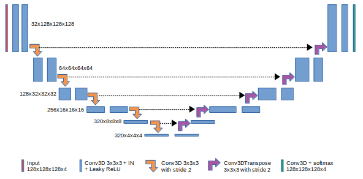

# 3D-UNet Medical Image Segmentation for TensorFlow 1.x
 
This repository provides a script and recipe to train 3D-UNet to achieve state of the art accuracy, and is tested and maintained by NVIDIA.
 
## Table of Contents
 
- [Model overview](#model-overview)
   * [Model architecture](#model-architecture)
   * [Default configuration](#default-configuration)
   * [Feature support matrix](#feature-support-matrix)
     * [Features](#features)
   * [Mixed precision training](#mixed-precision-training)
     * [Enabling mixed precision](#enabling-mixed-precision)
     * [Enabling TF32](#enabling-tf32)
- [Setup](#setup)
   * [Requirements](#requirements)
- [Quick Start Guide](#quick-start-guide)
- [Advanced](#advanced)
   * [Scripts and sample code](#scripts-and-sample-code)
   * [Parameters](#parameters)
   * [Command-line options](#command-line-options)
   * [Getting the data](#getting-the-data)
     * [Dataset guidelines](#dataset-guidelines)
     * [Multi-dataset](#multi-dataset)
   * [Training process](#training-process)
   * [Inference process](#inference-process)
- [Performance](#performance)   
   * [Benchmarking](#benchmarking)
     * [Training performance benchmark](#training-performance-benchmark)
     * [Inference performance benchmark](#inference-performance-benchmark)
   * [Results](#results)
     * [Training accuracy results](#training-accuracy-results) 
       * [Training accuracy: NVIDIA DGX-1 (8x V100 32GB)](#training-accuracy-nvidia-dgx-1-8x-v100-16gb)
     * [Training performance results](#training-performance-results)
       * [Training performance: NVIDIA DGX-1 (8x V100 16GB)](#training-performance-nvidia-dgx-1-8x-v100-16gb)
       * [Training performance: NVIDIA DGX-1 (8x V100 32GB)](#training-performance-nvidia-dgx-1-8x-v100-32gb)
     * [Inference performance results](#inference-performance-results)
        * [Inference performance: NVIDIA DGX-1 (1x V100 16GB)](#inference-performance-nvidia-dgx-1-1x-v100-16gb)
        * [Inference performance: NVIDIA DGX-1 (1x V100 32GB)](#inference-performance-nvidia-dgx-1-1x-v100-32gb)
- [Release notes](#release-notes)
   * [Changelog](#changelog)
   * [Known issues](#known-issues)

 
## Model overview
 
The U-Net model is a convolutional neural network for 3D image segmentation. This repository contains a 3D-UNet implementation introduced in [3D U-Net: Learning Dense Volumetric Segmentation from Sparse Annotation](https://arxiv.org/pdf/1606.06650), with modifications described in [No New-Net](https://arxiv.org/pdf/1809.10483).
 
This model is trained with mixed precision using Tensor Cores on Volta, Turing, and the NVIDIA Ampere GPU architectures. Therefore, researchers can get results up to 2.3x faster than training without Tensor Cores, while experiencing the benefits of mixed precision training. This model is tested against each NGC monthly container release to ensure consistent accuracy and performance over time.


### Model architecture
 
3D-UNet was first introduced by Olaf Ronneberger, Philip Fischer, and Thomas Brox in the paper: [3D U-Net: Learning Dense Volumetric Segmentation from Sparse Annotation](https://arxiv.org/pdf/1606.06650). In this repository we host a 3D-UNet version adapted by Fabian Isensee et al. to brain tumor segmentation. 3D-UNet allows for seamless segmentation of 3D volumes, with high accuracy and performance, and can be adapted to solve many different segmentation problems.
 
The following figure shows the construction of the 3D-UNet model and its different components. 3D-UNet is composed of a contractive and an expanding path, that aims at building a bottleneck in its centermost part through a combination of convolution and pooling operations. After this bottleneck, the image is reconstructed through a combination of convolutions and upsampling. Skip connections are added with the goal of helping the backward flow of gradients in order to improve the training.
 

 
### Default configuration
 
3D-UNet consists of a contractive (left-side) and expanding (right-side) path. It repeatedly applies unpadded convolutions followed by max pooling for downsampling. Every step in the expanding path consists of an upsampling of the feature maps and a concatenation with the correspondingly cropped feature map from the contractive path.
 
### Feature support matrix
 
The following features are supported by this model.
 
| **Feature** | **3D-UNet** |
|---------------------------------|-----|
| Automatic mixed precision (AMP) | Yes |
| Horovod Multi-GPU (NCCL)        | Yes |
| Accelerated Linear Algebra (XLA)| Yes |
 
#### Features
 
**Automatic Mixed Precision (AMP)**
 
This implementation of 3D-UNet uses AMP to implement mixed precision training. Computation graphs can be modified by TensorFlow on runtime to support mixed precision training. Detailed explanation of mixed precision can be found in the next section.
 
**Horovod**
 
Horovod is a distributed training framework for TensorFlow, Keras, PyTorch, and MXNet. The goal of Horovod is to make distributed deep learning fast and easy to use. For more information about how to get started with Horovod, see the [Horovod: Official repository](https://github.com/horovod/horovod).
 
Multi-GPU training with Horovod
 
Our model uses Horovod to implement efficient multi-GPU training with NCCL. For details, see example sources in this repository or see the [TensorFlow tutorial](https://github.com/horovod/horovod/#usage).
 
**XLA support (experimental)**
 
XLA is a domain-specific compiler for linear algebra that can accelerate TensorFlow models with potentially no source code changes. The results are improvements in speed and memory usage: most internal benchmarks run ~1.1-1.5x faster after XLA is enabled.
 
### Mixed precision training
 
Mixed precision is the combined use of different numerical precisions in a computational method. [Mixed precision](https://arxiv.org/abs/1710.03740) training offers significant computational speedup by performing operations in half-precision format while storing minimal information in single-precision to retain as much information as possible in critical parts of the network. Since the introduction of [Tensor Cores](https://developer.nvidia.com/tensor-cores) in Volta, and following with both the Turing and Ampere architectures, significant training speedups are experienced by switching to mixed precision -- up to 3x overall speedup on the most arithmetically intense model architectures. Using [mixed precision training](https://docs.nvidia.com/deeplearning/performance/mixed-precision-training/index.html) previously required two steps:
1.  Porting the model to use the FP16 data type where appropriate.    
2.  Adding loss scaling to preserve small gradient values.

This can now be achieved using Automatic Mixed Precision (AMP) for TensorFlow to enable the full [mixed precision methodology](https://docs.nvidia.com/deeplearning/sdk/mixed-precision-training/index.html#tensorflow) in your existing TensorFlow model code.  AMP enables mixed precision training on Volta, Turing, and NVIDIA Ampere GPU architectures automatically. The TensorFlow framework code makes all necessary model changes internally.

In TF-AMP, the computational graph is optimized to use as few casts as necessary and maximize the use of FP16, and the loss scaling is automatically applied inside of supported optimizers. AMP can be configured to work with the existing tf.contrib loss scaling manager by disabling the AMP scaling with a single environment variable to perform only the automatic mixed-precision optimization. It accomplishes this by automatically rewriting all computation graphs with the necessary operations to enable mixed precision training and automatic loss scaling.

For information about:
-   How to train using mixed precision, see the [Mixed Precision Training](https://arxiv.org/abs/1710.03740) paper and [Training With Mixed Precision](https://docs.nvidia.com/deeplearning/performance/mixed-precision-training/index.html) documentation.
-   Techniques used for mixed precision training, see the [Mixed-Precision Training of Deep Neural Networks](https://devblogs.nvidia.com/mixed-precision-training-deep-neural-networks/) blog.
-   How to access and enable AMP for TensorFlow, see [Using TF-AMP](https://docs.nvidia.com/deeplearning/dgx/tensorflow-user-guide/index.html#tfamp) from the TensorFlow User Guide.

#### Enabling mixed precision
 
Mixed precision is enabled in TensorFlow by using the Automatic Mixed Precision (TF-AMP) extension which casts variables to half-precision upon retrieval, while storing variables in single-precision format. Furthermore, to preserve small gradient magnitudes in backpropagation, a [loss scaling](https://docs.nvidia.com/deeplearning/sdk/mixed-precision-training/index.html#lossscaling) step must be included when applying gradients. In TensorFlow, loss scaling can be applied statically by using simple multiplication of loss by a constant value or automatically, by TF-AMP. Automatic mixed precision makes all the adjustments internally in TensorFlow, providing two benefits over manual operations. First, programmers need not modify network model code, reducing development and maintenance effort. Second, using AMP maintains forward and backward compatibility with all the APIs for defining and running TensorFlow models.

To enable mixed precision, you can simply add the values to the environmental variable inside your training script:
  ```
  os.environ['TF_ENABLE_AUTO_MIXED_PRECISION'] = '1'
  ```
Exporting these variables ensures that loss scaling is performed correctly and automatically.
By supplying the `--amp` flag to the `main.py` script while training in FP32/TF32, the following variables are set to their correct value for mixed precision training:
```
if params.amp:
  os.environ['TF_ENABLE_AUTO_MIXED_PRECISION'] = '1'
```


 #### Enabling TF32

TensorFloat-32 (TF32) is the new math mode in [NVIDIA A100](#https://www.nvidia.com/en-us/data-center/a100/) GPUs for handling the matrix math also called tensor operations. TF32 running on Tensor Cores in A100 GPUs can provide up to 10x speedups compared to single-precision floating-point math (FP32) on Volta GPUs. 

TF32 Tensor Cores can speed up networks using FP32, typically with no loss of accuracy. It is more robust than FP16 for models which require high dynamic range for weights or activations.

For more information, refer to the [TensorFloat-32 in the A100 GPU Accelerates AI Training, HPC up to 20x](#https://blogs.nvidia.com/blog/2020/05/14/tensorfloat-32-precision-format/) blog post.

TF32 is supported in the NVIDIA Ampere GPU architecture and is enabled by default.
 
## Setup
 
The following section lists the requirements that you need to meet in order to start training the 3D-UNet model.
 
### Requirements
 
This repository contains Dockerfile which extends the TensorFlow NGC container and encapsulates some dependencies. Aside from these dependencies, ensure you have the following components:
- [NVIDIA Docker](https://github.com/NVIDIA/nvidia-docker)
- TensorFlow 20.06-tf1-py3 [NGC container](https://ngc.nvidia.com/registry/nvidia-tensorflow)
-   GPU-based architecture:
    - [NVIDIA Volta](https://www.nvidia.com/en-us/data-center/volta-gpu-architecture/)
    - [NVIDIA Turing](https://www.nvidia.com/en-us/geforce/turing/)
    - [NVIDIA Ampere architecture](https://www.nvidia.com/en-us/data-center/nvidia-ampere-gpu-architecture/)

 
For more information about how to get started with NGC containers, see the following sections from the NVIDIA GPU Cloud Documentation and the Deep Learning Documentation:
- [Getting Started Using NVIDIA GPU Cloud](https://docs.nvidia.com/ngc/ngc-getting-started-guide/index.html)
- [Accessing And Pulling From The NGC container registry](https://docs.nvidia.com/deeplearning/dgx/user-guide/index.html#accessing_registry)
- [Running TensorFlow](https://docs.nvidia.com/deeplearning/dgx/tensorflow-release-notes/running.html#running)
 
For those unable to use the TensorFlow NGC container, to set up the required environment or create your own container, see the versioned [NVIDIA Container Support Matrix](https://docs.nvidia.com/deeplearning/frameworks/support-matrix/index.html).


## Quick Start Guide
 
To train your model using mixed or TF32 precision with Tensor Cores or using FP32, perform the following steps using the default parameters of the 3D-UNet model on the [Brain Tumor Segmentation 2019](https://www.med.upenn.edu/cbica/brats-2019/) dataset. These steps enable you to build the 3D-UNet TensorFlow NGC container, train and evaluate your model, and generate predictions on the test data. For the specifics concerning training and inference, see the [Advanced](#advanced) section.
 
 
1. Clone the repository.
 
    Executing this command will create your local repository with all the code to run 3D-UNet.
    
    ```bash
    git clone https://github.com/NVIDIA/DeepLearningExamples
    cd DeepLearningExamples/TensorFlow/Segmentation/U-Net3D_TF
 
2. Build the U-Net TensorFlow NGC container.
 
    This command will use the `Dockerfile` to create a Docker image named `unet3d_tf`, downloading all the required components automatically.
    
    ```bash
    docker build -t unet3d_tf .
    ```
    
    The NGC container contains all the components optimized for usage on NVIDIA hardware.
 
3. Start an interactive session in the NGC container to run preprocessing/training/inference.
 
    The following command will launch the container and mount the `./data` directory as a volume to the `/data` directory inside the container, and `./results` directory to the `/results` directory in the container.
    
    ```bash
    mkdir data
    mkdir results
    docker run --runtime=nvidia -it --shm-size=1g --ulimit memlock=-1 --ulimit stack=67108864 --rm --ipc=host -v ${PWD}/data:/data -v ${PWD}/results:/results unet3d_tf:latest /bin/bash
    ```
    
    Any datasets and experiment results (logs, checkpoints, etc.) saved to `/data` or `/results` will be accessible
    in the `./data` or `./results` directory on the host, respectively.
 
4. Download and pre-process the data.
   
    Data can be obtained by registering on [Brain Tumor Segmentation 2019 dataset](https://www.med.upenn.edu/cbica/brats-2019/) website. The data should be downloaded and placed where `/data` in the container is mounted. The `dataset/preprocess_data.py` script will convert the raw data into tfrecord format used for training and evaluation.

    The script can be launched as 
    
    ```python
    python dataset/preprocess_data.py -i /data/<name/of/the/raw/data/folder> -o /data/<name/of/the/preprocessed/data/folder> -v
    ```
 
5. Start training.
  
    After the Docker container is launched, the training of a single fold (fold 0) with the [default hyperparameters](#default-parameters) (for example 1/8 GPUs TF-AMP/FP32/TF32) can be started with:
    
    ```bash
    bash examples/unet3d_train_single{_TF-AMP}.sh <number/of/gpus> <path/to/dataset> <path/to/checkpoint> <batch/size>
    ```
    
    For example, to run with 32-bit precision (FP32 or TF32) with batch size 2 on 1 GPU, simply use:
    
    ```bash
    bash examples/unet3d_train_single.sh 1 /data/preprocessed /results 2
    ```
    
    to train a single fold with mixed precision (TF-AMP) with on 8 GPUs batch size 2 per GPU, use:
    
    ```bash
    bash examples/unet3d_train_single_TF-AMP.sh 8 /data/preprocessed /results 2
    ```
    The obtained dice scores will be reported after the training has finished.
 
6. Start benchmarking.
  
    The training performance can be evaluated by using benchmarking scripts, such as:
    
    ```bash
    bash examples/unet3d_{train,infer}_benchmark{_TF-AMP}.sh <number/of/gpus/for/training> <path/to/dataset> <path/to/checkpoint> <batch/size>
    ```
    
    which will make the model run and report the performance. For example, to benchmark training with TF-AMP with batch size 2 on 4 GPUs, use:
    
    ```bash
    bash examples/unet3d_train_benchmark_TF-AMP.sh 4 /data/preprocessed /results 2
    ```
    
    to obtain inference performance with 32-bit precision (FP32 or TF32) with batch size 1, use:
    
    ```bash
    bash examples/unet3d_infer_benchmark.sh /data/preprocessed /results 1
    ```

## Advanced
 
The following sections provide greater details of the dataset, running training and inference, and the training results.
 
### Scripts and sample code
 
In the root directory, the most important files are:
* `main.py`: Serves as the entry point to the application. Encapsulates the training routine.
* `Dockerfile`: Container with the basic set of dependencies to run U-Net.
* `requirements.txt`: Set of extra requirements for running U-Net.
* `preprocess_data.py`: Converts the dataset to tfrecord format for training.
 
The `dataset/` folder contains the necessary tools to train and perform inference using U-Net. Its main components are:
* `data_loader.py`: Implements the data loading and augmentation.
* `transforms.py`: Implements the data augmentation functions.
* `preprocess_data.py`: Implements the data conversion and pre-processing functionality.
 
The `runtime/` folder contains scripts with training and inference logic. Its contents are:
* `arguments.py`: Implements the command-line arguments parsing.
* `hooks.py`: Collects different metrics to be used for benchmarking and testing.
* `parse_results.py`: Defines a set of functions used for parsing the partial results.
* `setup.py`: Defines a set of functions to set the environment up.
 
 The `model/` folder contains information about the building blocks of 3D-UNet and the way they are assembled. Its contents are:
* `layers.py`: Defines the different blocks that are used to assemble 3D-UNet.
* `losses.py`: Defines the different losses used during training and evaluation.
* `model_fn.py`: Defines the computational graph to optimize.
* `unet3d.py`: Defines the model architecture using the blocks from the `layers.py` file.

Other folders included in the root directory are:
* `examples/`: Provides examples for training and benchmarking U-Net
* `images/`: Contains the model diagram
 
### Parameters
 
The complete list of the available parameters for the main.py script contains:
* `--exec_mode`: Select the execution mode to run the model (default: `train`). Modes available:
  * `train` - trains a model and stores checkpoints in the directory passed using `--model_dir`
  * `evaluate` - loads checkpoint (if available) and performs evaluation on validation subset (requires `--fold` other than `None`).
  * `train_and_evaluate` - trains model from scratch and performs validation at the end (requires `--fold` other than `None`).
  * `predict` - loads checkpoint (if available) and runs inference on the test set. Stores the results in the `--model_dir` directory.
  * `train_and_predict` - trains model from scratch and performs inference.
* `--model_dir`: Set the output directory for information related to the model (default: `/results`).
* `--log_dir`: Set the output directory for logs (default: None).
* `--data_dir`: Set the input directory containing the dataset (default: `None`).
* `--batch_size`: Size of each minibatch per GPU (default: `1`).
* `--fold`: Selected fold for cross-validation (default: `None`).
* `--max_steps`: Maximum number of steps (batches) for training (default: `16000`).
* `--seed`: Set random seed for reproducibility (default: `0`).
* `--log_every`: Log performance every n steps (default: `100`).
* `--learning_rate`: Model’s learning rate (default: `0.0002`).
* `--augment`: Enable data augmentation (disabled by default).
* `--benchmark`: Enable performance benchmarking (disabled by default). If the flag is set, the script runs in a benchmark mode - each iteration is timed and the performance result (in images per second) is printed at the end. Works for both `train` and `predict` execution modes.
* `--warmup_steps`: Used during benchmarking - the number of steps to skip (default: `200`). First iterations are usually much slower since the graph is being constructed. Skipping the initial iterations is required for a fair performance assessment.
* `--resume_training`: Whether to resume training from a checkpoint, if there is one (disabled by default)
* `--xla`: Enable accelerated linear algebra optimization (disabled by default).
* `--amp`: Enable automatic mixed precision (disabled by default).
 
### Command line options
 
To see the full list of available options and their descriptions, use the `-h` or `--help` command-line option, for example:
```bash
python main.py --help
```
 
The following example output is printed when running the model:
```python main.py --help
usage: main.py [-h] --data_dir DATA_DIR --model_dir MODEL_DIR
               [--exec_mode {train,evaluate,train_and_evaluate,predict}]
               [--benchmark] [--max_steps MAX_STEPS]
               [--learning_rate LEARNING_RATE] [--log_every LOG_EVERY]
               [--log_dir LOG_DIR] [--loss {dice,ce,dice+ce}]
               [--warmup_steps WARMUP_STEPS][--resume_training] 
               [--augment] [--batch_size BATCH_SIZE] [--fold FOLD] 
               [--amp] [--xla]
 
UNet-3D
 
optional arguments:
 -h, --help            show this help message and exit
 --model_dir MODEL_DIR
                       Output directory for information related to the model
 --data_dir DATA_DIR   Input directory containing the dataset for training
                       the model
 --exec_mode {train,train_and_predict,predict,evaluate,train_and_evaluate}
                       Execution mode of running the model
 --log_dir LOG_DIR     Output directory for training logs
 --batch_size BATCH_SIZE
                       Size of each minibatch per GPU
 --learning_rate LEARNING_RATE
                       Learning rate coefficient for AdamOptimizer
 --fold                Fold number
                       Chosen fold for cross-validation. Use None to disable
                       cross-validation
 --max_steps MAX_STEPS
                       Maximum number of steps (batches) used for training
 --log_every LOG_EVERY
                       Log performance every n steps
 --warmup_steps WARMUP_STEPS
                       Number of warmup steps
 --resume_training     Whether to resume training from the checkpoint
 --seed SEED           Random seed
 --augment             Perform data augmentation during training
 --benchmark           Collect performance metrics during training
 --amp                 Train using TF-AMP
 --xla                 Train using XLA
```
 
The 3D-UNet model was trained in the [Brain Tumor Segmentation 2019 dataset](https://www.med.upenn.edu/cbica/brats-2019/). Test images provided by the organization were used to produce the resulting masks for submission. Upon registration, the challenge's data is made available through the https//ipp.cbica.upenn.edu service.
 
The dataset consists of 335 240x240x155 `nifti` volumes. Each volume is represented by 4 modalities and a corresponding segmentation mask. 
The modalities are:
* Native T1-weighted (T1),
* Post-contrast T1-weighted (T1Gd),
* Native T2-weighted (T2),
* T2 Fluid Attenuated Inversion Recovery (FLAIR).

Each voxel in a segmentation mask belongs to one of four classes:
* 0 corresponds to healthy tissue or background,
* 1 indicates the presence of the necrotic and non-enhancing tumor core (TC),
* 2 indicates the presence of the peritumoral edema (ED),
* 4 indicates the presence of the GD-enhancing tumor (ET).
 
The objective is to produce a set of masks that segment the data as accurately as possible. The results are expected to be submitted as a 12-bit `nifti` 3D image, with values corresponding to the underlying class.
 
#### Dataset guidelines
 
The training and test datasets are given as 3D `nifti` volumes that can be read using the Nibabel library and NumPy (both packages are installed by the `Dockerfile`).
 
Initially, all modalities are loaded, stacked and converted into 240x240x155x4 NumPy arrays using Nibabel. To decrease the size of the dataset, each volume is clipped to 85% of the maximal value, normalized to 255 for each modality separately, casted to 8-bit, grouped by 4 volumes, and saved as a `tfrecord` file. The process of converting from `nifti` to `tfrecord` can be found in the `preprocess_data.py` script.
 
The `tfrecord` files are fed to the model through `tf.data.TFRecordDataset()` to achieve high performance.
 
The foreground voxel intensities then z-score normalized, whereas labels are one-hot encoded for their later use in dice or pixel-wise cross-entropy loss, becoming 240x240x155x4 tensors.
 
If augmentation is enabled, the following set of augmentation techniques are applied:
* Random horizontal flipping
* Random 128x128x128x4 crop
* Random brightness shifting
 
In addition, random vertical flip and random gamma correction augmentations were implemented, but are not used. The process of loading, normalizing and augmenting the data contained in the dataset can be found in the `data_loader.py` script.
 
#### Multi-dataset
 
This implementation is tuned for the Brain Tumor Segmentation 2019 dataset. Using other datasets is possible, but might require changes to the code (data loader) and tuning some hyperparameters (e.g. learning rate, number of iterations).
 
In the current implementation, the data loader works with tfrecord files. It should work seamlessly with any dataset containing 3D data stored in tfrecord format, as long as features (with corresponding mean and standard deviation) and labels are stored as bytestream in the same file as `X`, `Y`, `mean`, and `stdev`.  See the data pre-processing script for details. If your data is stored in a different format, you will have to modify the parsing function in the `dataset/data_loader.py` file. For a walk-through, check the [TensorFlow tf.data API guide](https://www.tensorflow.org/guide/data_performance)
 
## Training process
 
The model trains for a total 16,000 (16,000 / number of GPUs) iterations for each fold, with the default 3D-UNet setup:
* Adam optimizer with learning rate of 0.0002.
* Training and evaluation batch size of 2.
 
This default parametrization is applied when running scripts from the `./examples` directory and when running `main.py` without explicitly overriding these parameters. By default, the training is in full precision. To enable AMP, pass the `--amp` flag. AMP can be enabled for every mode of execution.
 
The default configuration minimizes a function _L = 1 - DICE + cross entropy_ during training and reports achieved convergence as dice score per class, mean dice score, and dice score for whole tumor vs background. The training with a combination of dice and cross entropy has been proven to achieve better convergence than a training using only dice.
 
The training can be run directly without using the predefined scripts. The name of the training script is `main.py`. Because of the multi-GPU support, training should always be run with the Horovod distributed launcher like this:
```bash
horovodrun -np <number/of/gpus> python main.py --data_dir /data/preprocessed --exec_mode train [other parameters]
```
 
*Note:* When calling the `main.py` script manually, data augmentation is disabled. In order to enable data augmentation, use the `--augment` flag in your invocation.
 
The main result of the training are checkpoints stored by default in `./results/` directory on the host machine, and in the `/results` directory in the container. This location can be controlled
by the `--model_dir` command-line argument, if a different location was mounted while starting the container. In the case when the training is run in `train_and_predict` mode, the inference will take place after the training is finished, and inference results will be stored to the `/results` directory.
 
If the `--exec_mode train_and_evaluate` parameter was used, and if `--fold` parameter is set to an integer value of {0, 1, 2, 3, 4}, the evaluation of the validation set takes place after the training is completed. The results of the evaluation will be printed to the console.

### Inference process
 
Inference can be launched with the same script used for training by passing the `--exec_mode predict` flag:
```bash
python main.py --exec_mode predict --data_dir /data/preprocessed --model_dir <path/to/checkpoint> [other parameters]
```
 
The script will then:
* Load the checkpoint from the directory specified by the `<path/to/checkpoint>` directory (`/results`),
* Run inference on the test dataset,
* Save the resulting masks in the `numpy` format in the `--model_dir` directory.
 
## Performance
 
### Benchmarking
 
The following section shows how to run benchmarks measuring the model performance in training and inference modes.
 
#### Training performance benchmark
 
To benchmark training, run one of the `train_benchmark` scripts in `./examples/`:
```bash
bash examples/unet3d_train_benchmark{_TF-AMP}.sh <num/of/gpus> <path/to/dataset> <path/to/checkpoints> <batch/size>
```
For example, to benchmark training using mixed-precision on 4 GPUs with batch size of 2 use:
```bash
bash examples/unet3d_train_benchmark_TF-AMP.sh 4 <path/to/dataset> <path/to/checkpoints> 2
```
 
Each of these scripts will by default run 40 warm-up iterations and benchmark the performance during training in the next 40 iterations.
 
To have more control, you can run the script by directly providing all relevant run parameters. For example:
```bash
horovodrun -np <num/of/gpus> python main.py --exec_mode train --benchmark --augment --data_dir <path/to/dataset> --model_dir <path/to/checkpoints> --batch_size <batch/size> --warmup_steps <warm-up/steps> --max_steps <max/steps>
```
 
At the end of the script, a line reporting the best train throughput will be printed.
 
#### Inference performance benchmark
 
To benchmark inference, run one of the scripts in `./examples/`:
```bash
bash examples/unet3d_infer_benchmark{_TF-AMP}.sh <path/to/dataset> <path/to/checkpoints> <batch/size>
```
 
For example, to benchmark inference using mixed-precision with batch size 4:
```bash
bash examples/unet3d_infer_benchmark_TF-AMP.sh <path/to/dataset> <path/to/checkpoints> 4
```
 
Each of these scripts will by default run 20 warm-up iterations and benchmark the performance during inference in the next 20 iterations.
 
To have more control, you can run the script by directly providing all relevant run parameters. For example:
```bash
python main.py --exec_mode predict --benchmark --data_dir <path/to/dataset> --model_dir <optional, path/to/checkpoint> --batch_size <batch/size> --warmup_steps <warm-up/steps> --max_steps <max/steps>
```
 
At the end of the script, a line reporting the best inference throughput will be printed.

### Results
 
The following sections provide details on how we achieved our performance and accuracy of training and inference.
 
#### Training accuracy results

##### Training accuracy: NVIDIA DGX-1 (8x V100 32GB)
 
The following table lists the average DICE score across 5-fold cross-validation. Our results were obtained by running the `examples/unet3d_train_full{_TF-AMP}.sh` training script in the `tensorflow:20.06-tf1-py3` NGC container on NVIDIA DGX-1 (8x V100 32GB) GPUs.
 
| GPUs | Batch size / GPU | DICE - FP32 | DICE - mixed precision | Time to train - FP32 | Time to train - mixed precision | Time to train speedup (FP32 to mixed precision) |
|---|---|--------|--------|--------|--------|------|
| 8 | 2 | 0.8818 | 0.8819 | 41 min | 23 min | 1.78 |
 
To reproduce this result, start the Docker container interactively and run one of the train scripts:
```bash
bash examples/unet3d_train_full{_TF-AMP}.sh <num/of/gpus> <path/to/dataset> <path/to/checkpoint> <batch/size>
```
 for example to train using 8 GPUs and batch size of 2:
```bash
bash examples/unet3d_train_full_TF-AMP.sh 8 /data/preprocessed /results 2
```

This command will launch a script which will run 5-fold cross-validation training for 16,000 iterations on each fold and print:
 * the validation DICE scores for each class: Tumor Core (TC), Peritumoral Edema (ED), Enhancing Tumor (ET),
 * the mean DICE score,
 * the whole tumor (WT) which represents a binary classification case (tumor vs background).
 
The time reported is for one fold, which means that the training of 5 folds will take 5 times longer. The default batch size is 2, however if you have less than 16 GB memory card and you encounter GPU memory issues you should decrease the batch size. The logs of the runs can be found in the `/results` directory once the script is finished.

#### Training performance results

##### Training performance: NVIDIA DGX-1 (8x V100 16GB)
 
Our results were obtained by running the `examples/unet3d_train_benchmark{_TF-AMP}.sh` training script in the `tensorflow:20.06-tf1-py3` NGC container on NVIDIA DGX-1 with (8x V100 16GB) GPUs. Performance numbers (in volumes per second) were averaged over 80 iterations, excluding the first 40 warm-up steps.
 
| GPUs | Batch size / GPU | Throughput - FP32 [img/s] | Throughput - mixed precision [img/s] | Throughput speedup (FP32 - mixed precision) | Weak scaling - FP32 | Weak scaling - mixed precision |       
|---|---|--------|--------|-------|-------|-------|
| 1 | 2 | 1.987  | 4.381  | 2.205 | N/A   | N/A   |
| 8 | 2 | 14.843 | 28.948 | 1.950 | 7.471 | 6.608 |

##### Training performance: NVIDIA DGX-1 (8x V100 32GB)
 
Our results were obtained by running the `examples/unet3d_train_benchmark{_TF-AMP}.sh` training script in the `tensorflow:20.06-tf1-py3` NGC container on NVIDIA DGX-1 with (8x V100 32GB) GPUs. Performance numbers (in volumes per second) were averaged over 80 iterations, excluding the first 40 warm-up steps.
 
| GPUs | Batch size / GPU | Throughput - FP32 [img/s] | Throughput - mixed precision [img/s] | Throughput speedup (FP32 - mixed precision) | Weak scaling - FP32 | Weak scaling - mixed precision |       
|---|---|--------|--------|-------|-------|-------|
| 1 | 2 | 2.002  | 4.360  | 2.177 | N/A   | N/A   |
| 1 | 4 | 2.160  | 4.407  | 2.041 | N/A   | N/A   |
| 8 | 2 | 14.781 | 26.694 | 1.806 | 7.381 | 6.123 |
| 8 | 4 | 16.013 | 28.423 | 1.775 | 7.414 | 6.449 |

 
To achieve these same results, follow the steps in the [Training performance benchmark](#training-performance-benchmark) section.
 
#### Inference performance results

##### Inference performance: NVIDIA DGX-1 (1x V100 16GB)
 
Our results were obtained by running the `examples/unet3d_infer_benchmark{_TF-AMP}.sh` inferencing benchmarking script in the `tensorflow:20.06-tf1-py3` NGC container on NVIDIA DGX-1 with (1x V100 16GB) GPU. Performance numbers (in volumes per second) were averaged over 40 iterations, excluding the first 20 warm-up steps.
 
FP16
 
| Batch size | Resolution | Throughput Avg [img/s] | Latency Avg [ms] | Latency 90% [ms] | Latency 95% [ms] | Latency 99% [ms] |
|---|---------------|-------|----------|----------|----------|----------|
| 1 | 224x224x160x4 | 2.546 | 392.803  | 393.031  | 393.075  | 393.160  |
| 2 | 224x224x160x4 | 2.923 | 684.363  | 684.806  | 684.891  | 685.056  |
| 4 | 224x224x160x4 | 3.408 | 1173.739 | 1174.369 | 1174.489 | 1174.725 |
 
FP32
 
| Batch size | Resolution | Throughput Avg [img/s] | Latency Avg [ms] | Latency 90% [ms] | Latency 95% [ms] | Latency 99% [ms] |
|---|---------------|-------|----------|----------|----------|----------|
| 1 | 224x224x160x4 | 1.527 | 654.911  | 655.180  | 655.232  | 655.333  |
| 2 | 224x224x160x4 | 1.554 | 1287.376 | 1287.997 | 1288.116 | 1288.348 |
| 4 | 224x224x160x4 | OOM   |          |          |          |          |
 
 
##### Inference performance: NVIDIA DGX-1 (1x V100 32GB)
 
Our results were obtained by running the `examples/unet3d_infer_benchmark{_TF-AMP}.sh` inferencing benchmarking script in the `tensorflow:20.06-tf1-py3` NGC container on NVIDIA DGX-1 with (1x V100 32GB) GPU. Performance numbers (in volumes per second) were averaged over 40 iterations, excluding the first 20 warm-up steps.

 
FP16
 
| Batch size | Resolution | Throughput Avg [img/s] | Latency Avg [ms] | Latency 90% [ms] | Latency 95% [ms] | Latency 99% [ms] |
|---|---------------|-------|----------|----------|----------|----------|
| 1 | 224x224x160x4 | 2.576 | 388.276  | 388.400  | 388.423  | 388.470  |
| 2 | 224x224x160x4 | 2.861 | 699.078  | 699.567  | 699.660  | 699.843  |
| 4 | 224x224x160x4 | 3.333 | 1200.198 | 1200.631 | 1200.714 | 1200.877 |
 
FP32
 
| Batch size | Resolution | Throughput Avg [img/s] | Latency Avg [ms] | Latency 90% [ms] | Latency 95% [ms] | Latency 99% [ms] |
|---|---------------|-------|----------|----------|----------|----------|
| 1 | 224x224x160x4 | 1.990 | 502.485  | 502.550  | 502.563  | 502.587  |
| 2 | 224x224x160x4 | 2.013 | 993.650  | 993.982  | 994.046  | 994.170  |
| 4 | 224x224x160x4 | 2.435 | 1642.637 | 1643.058 | 1643.139 | 1643.297 |
 
To achieve these same results, follow the steps in the [Inference performance benchmark](#inference-performance-benchmark) section.
 

 
## Release notes
 
### Changelog
 
June 2020
* Initial release
 
 
### Known issues
 
There are no known issues in this release.

 


