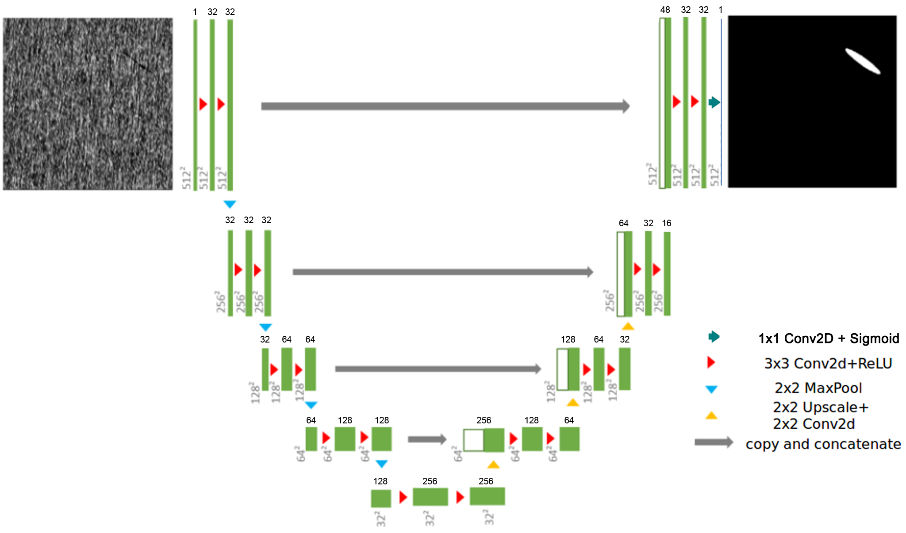
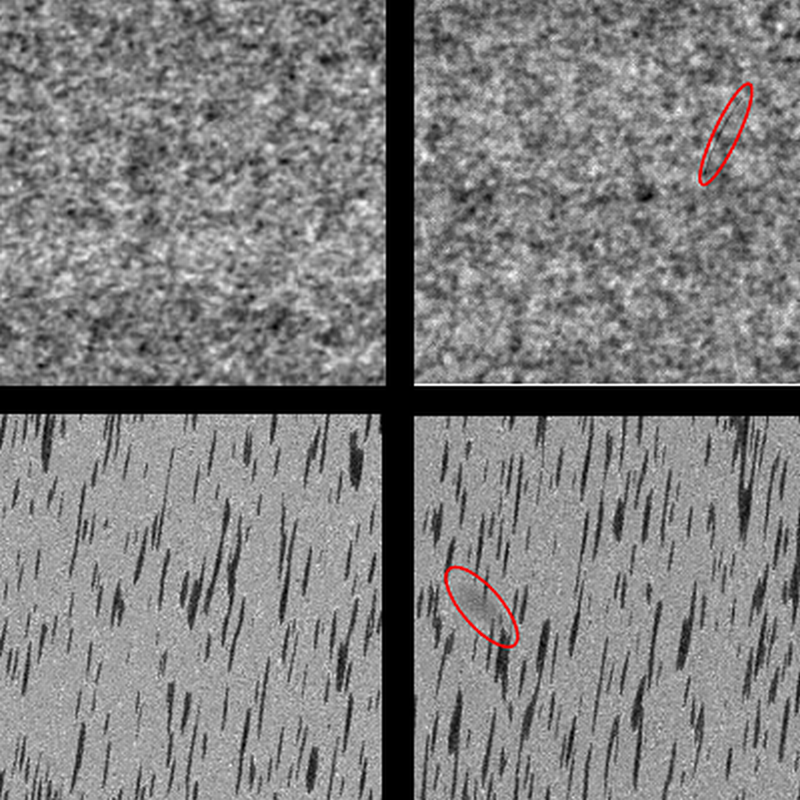

# U-Net Industrial Defect Segmentation for TensorFlow

This repository provides a script and recipe to train U-Net Industrial to achieve state of the art
accuracy on the dataset DAGM2007, and is tested and maintained by NVIDIA.


## Table of Contents

* [Model overview](#model-overview)
    * [Default Configuration](#default-configuration)
    * [Enabling mixed precision](#enabling-mixed-precision)
* [Setup](#setup)
    * [Requirements](#requirements)
* [Quick Start Guide](#quick-start-guide)
* [Advanced](#advanced)
    * [Command line options](#command-line-options)
    * [Getting the data](#getting-the-data)
    * [Training process](#training-process)
* [Performance](#performance)
    * [Benchmarking](#benchmarking)
        * [Training performance benchmark](#training-performance-benchmark)
        * [Inference performance benchmark](#inference-performance-benchmark)
    * [Results](#results)
        * [Training accuracy results](#training-accuracy-results)
        * [Training performance results](#training-performance-results)
        * [Inference performance results](#inference-performance-results)
* [Release notes](#release-notes)
    * [Changelog](#changelog)
    * [Known issues](#known-issues)

## Model overview

This U-Net model is adapted from the original version of the [U-Net model](https://arxiv.org/abs/1505.04597) which is
a convolutional auto-encoder for 2D image segmentation. U-Net was first introduced by
Olaf Ronneberger, Philip Fischer, and Thomas Brox in the paper:
[U-Net: Convolutional Networks for Biomedical Image Segmentation](https://arxiv.org/abs/1505.04597).

This work proposes a modified version of U-Net, called `TinyUNet` which performs efficiently and with very high accuracy
on the industrial anomaly dataset [DAGM2007](https://resources.mpi-inf.mpg.de/conference/dagm/2007/prizes.html).
*TinyUNet*, like the original *U-Net* is composed of two parts:
- an encoding sub-network (left-side)
- a decoding sub-network (right-side).

It repeatedly applies 3 downsampling blocks composed of two 2D convolutions followed by a 2D max pooling
layer in the encoding sub-network. In the decoding sub-network, 3 upsampling blocks are composed of a upsample2D
layer followed by a 2D convolution, a concatenation operation with the residual connection and two 2D convolutions.

`TinyUNet` has been introduced to reduce the model capacity which was leading to a high degree of over-fitting on a
small dataset like DAGM2007. The complete architecture is presented in the figure below:



This model trains with mixed precision tensor cores on Volta, therefore researchers can get results much faster than
training without tensor cores. This model is tested against each NGC monthly container release to ensure consistent
accuracy and performance over time.

The following features were implemented in this model:
* Data-parallel multi-GPU training with Horovod.
* Mixed precision support with TensorFlow Automatic Mixed Precision (TF-AMP), which enables mixed precision
training without any changes to the code-base by performing automatic graph rewrites and loss scaling controlled
by an environmental variable.
* Tensor Core operations to maximize throughput using NVIDIA Volta GPUs.
* Loss auto-scaling for Tensor Cores (mixed precision) training

The following performance optimizations were implemented in this model:
* [XLA](https://www.tensorflow.org/xla) support (experimental)

### Default Configuration

This model trains in 2500 epochs, under the following setup:

* Global Batch Size: 16

* Optimizer RMSProp:
    * decay: 0.9
    * momentum: 0.8
    * centered: True

* Learning Rate Schedule: Exponential Step Decay
    * decay: 0.8
    * steps: 500
    * initial learning rate: 1e-4

* Weight Initialization: He Uniform Distribution (introduced by [Kaiming He et al. in 2015](https://arxiv.org/abs/1502.01852) to address issues related ReLU activations in deep neural networks)

* Loss Function: Adaptive
    * When DICE Loss < 0.3, Loss = Binary Cross Entropy
    * Else, Loss = DICE Loss

* Data Augmentation
    * Random Horizontal Flip (50% chance)
    * Random Rotation 90°

* Activation Functions:
    * ReLU is used for all layers
    * Sigmoid is used at the output to ensure that the ouputs are between [0, 1]

* Weight decay: 1e-5

### Enabling mixed precision

[Mixed precision](https://arxiv.org/abs/1710.03740) training offers significant computational speedup by performing
operations in half-precision format, while storing minimal information in single-precision to retain as much
information as possible in critical parts of the network.  Since the introduction of
[tensor cores](https://developer.nvidia.com/tensor-cores) in the Volta and Turing architectures, significant training
speedups are experienced by switching to mixed precision -- up to 3x overall speedup on the most arithmetically
intense model architectures.  Using
[mixed precision training](https://docs.nvidia.com/deeplearning/sdk/mixed-precision-training/index.html) previously
required two steps:
1. Porting the model to use the FP16 data type where appropriate.
2. Manually adding loss scaling to preserve small gradient values.

This can now be achieved using Automatic Mixed Precision (AMP) for TensorFlow to enable the full [mixed precision
methodology](https://docs.nvidia.com/deeplearning/sdk/mixed-precision-training/index.html#tensorflow) in your existing
TensorFlow model code.  AMP enables mixed precision training on Volta and Turing GPUs automatically. The TensorFlow
framework code makes all necessary model changes internally.

In TF-AMP, the computational graph is optimized to use as few casts as necessary and maximize the use of FP16,
and the loss scaling is automatically applied inside of supported optimizers. AMP can be configured to work with
the existing tf.contrib loss scaling manager by disabling the AMP scaling with a single environment variable to
perform only the automatic mixed-precision optimization. It accomplishes this by automatically rewriting all
computation graphs with the necessary operations to enable mixed precision training and automatic loss scaling.

For information about:
- How to train using mixed precision, see the [Mixed Precision Training](https://arxiv.org/abs/1710.03740) paper and
[Training With Mixed Precision](https://docs.nvidia.com/deeplearning/sdk/mixed-precision-training/index.html) documentation.
- How to access and enable AMP for TensorFlow, see [Using TF-AMP](https://docs.nvidia.com/deeplearning/dgx/tensorflow-user-guide/index.html#tfamp) from the TensorFlow User Guide.
- Techniques used for mixed precision training, see the [Mixed-Precision Training of Deep Neural Networks](https://devblogs.nvidia.com/mixed-precision-training-deep-neural-networks/) blog.

## Setup

The following section list the requirements in order to start training the U-Net model
(only the `TinyUnet` model is proposed here).

### Requirements
This repository contains Dockerfile which extends the TensorFlow NGC container and encapsulates some dependencies.  
Aside from these dependencies, ensure you have the following components:

* [NVIDIA Docker](https://github.com/NVIDIA/nvidia-docker)

* [TensorFlow 19.03-py3 NGC container](https://ngc.nvidia.com/catalog/containers/nvidia:tensorflow)
* (optional) NVIDIA Volta GPU (see section below) - for best training performance using mixed precision

For more information about how to get started with NGC containers, see the
following sections from the NVIDIA GPU Cloud Documentation and the Deep Learning Documentation:
- [Getting Started Using NVIDIA GPU Cloud](https://docs.nvidia.com/ngc/ngc-getting-started-guide/index.html),
- [Accessing And Pulling From The NGC container registry](https://docs.nvidia.com/deeplearning/dgx/user-guide/index.html#accessing_registry)
- [Running TensorFlow](https://docs.nvidia.com/deeplearning/dgx/tensorflow-release-notes/running.html#running).


## Quick Start Guide

To train your model using mixed precision with tensor cores or using FP32, perform the following steps using the
default configuration of the U-Net model (only `TinyUNet` has been made available here) on the DAGM2007 dataset.

### Clone the repository

```bash
git clone https://github.com/NVIDIA/DeepLearningExamples
cd DeepLearningExamples/TensorFlow/Segmentation/UNetIndustrial
```

### Download and preprocess the dataset: DAGM2007

In order to download the dataset. You can execute the following:

```bash
./download_and_preprocess_dagm2007.sh /path/to/dataset/directory/
```

**Important Information:** Some files of the dataset require an account to be downloaded, the script will invite you to download them manually and put them in the correct directory.

### Build and start the docker container based on the TensorFlow NGC container.

```bash
# Build the docker container
docker build . --rm -t unet_industrial:latest

# start the container with nvidia-docker
nvidia-docker run -it --rm \
    --shm-size=2g --ulimit memlock=-1 --ulimit stack=67108864 \
    -v /path/to/dataset:/data/dagm2007/ \
    -v /path/to/results:/results \
    unet_industrial:latest
```

### Run training  

To run training for a default configuration (as described in Default configuration, for example 1/4/8 GPUs,
FP32/TF-AMP), launch one of the scripts in the `./scripts` directory called
`./scripts/UNet_{FP32, AMP}_{1, 4, 8}GPU.sh`

Each of the scripts requires three parameters:
* path to the result directory of the model as the first argument
* path to the dataset as a second argument
* class ID from DAGM used (between 1-10)

For example:

```bash
cd scripts/
./UNet_FP32_1GPU.sh <path to result repository> <path to dataset> <DAGM2007 classID (1-10)>
```

### Run evaluation

Model evaluation on a checkpoint can be launched by running  one of the scripts in the `./scripts` directory
called `./scripts/UNet_{FP32, AMP}_EVAL.sh`.

Each of the scripts requires three parameters:
* path to the result directory of the model as the first argument
* path to the dataset as a second argument
* class ID from DAGM used (between 1-10)

For example:

```bash
cd scripts/
./UNet_FP32_EVAL.sh <path to result repository> <path to dataset> <DAGM2007 classID (1-10)>
```

If you wish to evaluate external checkpoint, make sure to put the TF ckpt files inside a folder named "checkpoints"
and provide its parent path as `<path to result repository>` in the example above. 
Be aware that the script will not fail if it does not find the checkpoint. 
It will randomly initialize the weights and run performance tests.

## Advanced

The following sections provide greater details of the dataset, running training and inference, and the training results.

### Command line options

To see the full list of available options and their descriptions, use the -h or --help command line option, for example:

```bash
python main.py --help
```

The following mandatory flags must be used to tune different aspects of the training:

general
-------
`--exec_mode=train_and_evaluate` Which execution mode to run the model into.

`--iter_unit=batch` Will the model be run for X batches or X epochs ?

`--num_iter=2500` Number of iterations to run.

`--batch_size=16` Size of each minibatch per GPU.

`--results_dir=/path/to/results` Directory in which to write training logs, summaries and checkpoints.

`--data_dir=/path/to/dataset` Directory which contains the DAGM2007 dataset.

`--dataset_name=DAGM2007` Name of the dataset used in this run (only DAGM2007 is supported atm).

`--dataset_classID=1` ClassID to consider to train or evaluate the network (used for DAGM).

model
-----

`--use_tf_amp` Enable Automatic Mixed Precision to speedup FP32 computation using tensor cores.

`--use_xla` Enable TensorFlow XLA to maximise performance.

`--use_auto_loss_scaling` Use AutoLossScaling in TF-AMP

### Getting the data

The U-Net model was trained with the [Weakly Supervised Learning for Industrial Optical Inspection (DAGM 2007)](https://resources.mpi-inf.mpg.de/conference/dagm/2007/prizes.html) dataset.

> The competition is inspired by problems from industrial image processing. In order to satisfy their customers' needs, companies have to guarantee the quality of their products, which can often be achieved only by inspection of the finished product. Automatic visual defect detection has the potential to reduce the cost of quality assurance significantly.
>
> The competitors have to design a stand-alone algorithm which is able to detect miscellaneous defects on various background textures.
>
> The particular challenge of this contest is that the algorithm must learn, without human intervention, to discern defects automatically from a weakly labeled (i.e., labels are not exact to the pixel level) training set, the exact characteristics of which are unknown at development time. During the competition, the programs have to be trained on new data without any human guidance.

**Source:** https://resources.mpi-inf.mpg.de/conference/dagm/2007/prizes.html

#### Data description

> The provided data is artificially generated, but similar to real world problems. It consists of multiple data sets, each consisting of 1000 images showing the background texture without defects, and of 150 images with one labeled defect each on the background texture. The images in a single data set are very similar, but each data set is generated by a different texture model and defect model.

> Not all deviations from the texture are necessarily defects. The algorithm will need to use the weak labels provided during the training phase to learn the properties that characterize a defect.

> Below are two sample images from two data sets. In both examples, the left images are without defects; the right ones contain a scratch-shaped defect which appears as a thin dark line, and a diffuse darker area, respectively. The defects are weakly labeled by a surrounding ellipse, shown in red.



The DAGM2007 challenge comes in propose two different challenges:
- A development set: public and available for download from
[here](https://resources.mpi-inf.mpg.de/conference/dagm/2007/prizes.html).
The number of classes and sub-challenges for the development set is 6.
- A competition set: which requires an account to be downloaded from [here](https://hci.iwr.uni-heidelberg.de/node/3616).
The number of classes and sub-challenges for the competition set is 10.

#### Challenge description

The challenge consists in designing a single model with a set of predefined hyper-parameters which will not change
across the 10 different classes or sub-challenges of the competition set.

The performance shall be measured on the competition set which is normalized and more complex that the public dataset
while offering the most unbiased evaluation method.

### Training Process

#### Laplace Smoothing

We use this technique in the DICE loss to improve the training efficiency. This technique consists in replacing the
epsilon parameter (used to avoid dividing by zero and very small: +/- 1e-7) by 1. You can find more information on:
[https://en.wikipedia.org/wiki/Additive_smoothing](https://en.wikipedia.org/wiki/Additive_smoothing)

#### Adaptive Loss

The DICE Loss is not able to provide a meaningful gradient at initialisation. This leads to a model instability which
often push the model to diverge. Nonetheless, once the model starts to converge, DICE loss is able to very efficiently
fully train the model. Therefore, we implemented an *adaptive loss* which is composed of two sub-losses:

- Binary Cross-Entropy (BCE)
- DICE Loss

The model is trained with the BCE loss until the DICE Loss reach a experimentally defined threshold (0.3).
Thereafter, DICE loss is used to finish training.

#### Weak Labelling

This dataset is referred as weakly labelled. That means that the segmentation labels are not given at the pixel level
but rather in an approximate fashion.

## Performance

### Benchmarking

The following sections shows how to run benchmarks measuring the model performance in training and inference modes.

#### Training performance benchmark

To benchmark the inference performance, you can run one of the scripts in the `./scripts/benchmarking/` directory
called `./scripts/benchmarking/DGX1v_trainbench_{FP32, AMP}_{1, 4, 8}GPU.sh`.

Each of the scripts requires three parameters:
* path to the result directory of the model as the first argument
* path to the dataset as a second argument
* class ID from DAGM used (between 1-10)

For example:

```bash
cd scripts/benchmarking/
./DGX1v_trainbench_FP32_1GPU.sh <path to result repository> <path to dataset> <DAGM2007 classID (1-10)>
```

#### Inference performance benchmark

To benchmark the training performance, you can run one of the scripts in the `./scripts/benchmarking/` directory
called `./scripts/benchmarking/DGX1v_trainbench_{FP32, AMP}_{1, 4, 8}GPU.sh`.

Each of the scripts requires three parameters:
* path to the result directory of the model as the first argument
* path to the dataset as a second argument
* class ID from DAGM used (between 1-10)

For example:

```bash
cd scripts/benchmarking/
./DGX1v_evalbench_FP16_1GPU.sh <path to result repository> <path to dataset> <dagm classID (1-10)>
```

### Results

The following sections provide details on the achieved results in training accuracy, performance and inference performance.

#### Training accuracy results

Our results were obtained by running the `./scripts/UNet_{FP32, AMP}_{1, 4, 8}GPU.sh` training
script in the Tensorflow:19.03-py3 NGC container on NVIDIA DGX-1 with 8x V100 16G GPUs.

##### Threshold = 0.75

| # DAGM Class ID | Precision                       | IoU (Intersection over Union) | TPR (True Positive Rate) | TNR (True Negative Rate) |
|-----------------|---------------------------------|-------------------------------|--------------------------|--------------------------|
| 1               | FP32                            | 0.968                         | 100.00                   | 97.88                    |
| 1               | Automatic Mixed Precision (AMP) | 0.966                         | 100.00                   | 97.55                    |
| 2               | FP32                            | 0.976                         | 100.00                   | 99.62                    |
| 2               | Automatic Mixed Precision (AMP) | 0.976                         | 100.00                   | 99.66                    |
| 3               | FP32                            | 0.979                         | 100.00                   | 99.64                    |
| 3               | Automatic Mixed Precision (AMP) | 0.979                         | 100.00                   | 99.63                    |
| 4               | FP32                            | 0.965                         | 100.00                   | 97.43                    |
| 4               | Automatic Mixed Precision (AMP) | 0.960                         | 100.00                   | 96.85                    |
| 5               | FP32                            | 0.992                         | 100.00                   | 99.88                    |
| 5               | Automatic Mixed Precision (AMP) | 0.991                         | 100.00                   | 99.78                    |
| 6               | FP32                            | 0.982                         | 100.00                   | 98.78                    |
| 6               | Automatic Mixed Precision (AMP) | 0.979                         | 100.00                   | 98.39                    |
| 7               | FP32                            | 0.980                         | 100.00                   | 99.58                    |
| 7               | Automatic Mixed Precision (AMP) | 0.980                         | 100.00                   | 99.56                    |
| 8               | FP32                            | 0.970                         | 100.00                   | 99.85                    |
| 8               | Automatic Mixed Precision (AMP) | 0.971                         | 100.00                   | 100.00                   |
| 9               | FP32                            | 0.988                         | 99.82                    | 99.81                    |
| 9               | Automatic Mixed Precision (AMP) | 0.988                         | 99.87                    | 99.81                    |
| 10              | FP32                            | 0.979                         | 100.00                   | 99.43                    |
| 10              | Automatic Mixed Precision (AMP) | 0.982                         | 100.00                   | 99.70                    |

##### Threshold = 0.85

| # DAGM Class ID | Precision                       | IoU (Intersection over Union) | TPR (True Positive Rate) | TNR (True Negative Rate) |
|-----------------|---------------------------------|-------------------------------|--------------------------|--------------------------|
| 1               | FP32                            | 0.968                         | 100.00                   | 97.88                    |
| 1               | Automatic Mixed Precision (AMP) | 0.966                         | 100.00                   | 97.56                    |
| 2               | FP32                            | 0.976                         | 100.00                   | 99.62                    |
| 2               | Automatic Mixed Precision (AMP) | 0.976                         | 100.00                   | 99.66                    |
| 3               | FP32                            | 0.979                         | 100.00                   | 99.64                    |
| 3               | Automatic Mixed Precision (AMP) | 0.977                         | 100.00                   | 99.33                    |
| 4               | FP32                            | 0.966                         | 100.00                   | 97.44                    |
| 4               | Automatic Mixed Precision (AMP) | 0.960                         | 100.00                   | 96.85                    |
| 5               | FP32                            | 0.992                         | 100.00                   | 99.88                    |
| 5               | Automatic Mixed Precision (AMP) | 0.991                         | 100.00                   | 99.78                    |
| 6               | FP32                            | 0.982                         | 100.00                   | 98.80                    |
| 6               | Automatic Mixed Precision (AMP) | 0.979                         | 100.00                   | 98.41                    |
| 7               | FP32                            | 0.980                         | 100.00                   | 99.60                    |
| 7               | Automatic Mixed Precision (AMP) | 0.980                         | 100.00                   | 99.58                    |
| 8               | FP32                            | 0.970                         | 100.00                   | 99.85                    |
| 8               | Automatic Mixed Precision (AMP) | 0.971                         | 100.00                   | 100.00                   |
| 9               | FP32                            | 0.988                         | 99.82                    | 99.81                    |
| 9               | Automatic Mixed Precision (AMP) | 0.988                         | 99.87                    | 99.81                    |
| 10              | FP32                            | 0.980                         | 100.00                   | 99.45                    |
| 10              | Automatic Mixed Precision (AMP) | 0.982                         | 100.00                   | 99.71                    |

##### Threshold = 0.95

| # DAGM Class ID | Precision                       | IoU (Intersection over Union) | TPR (True Positive Rate) | TNR (True Negative Rate) |
|-----------------|---------------------------------|-------------------------------|--------------------------|--------------------------|
| 1               | FP32                            | 0.969                         | 100.00                   | 97.93                    |
| 1               | Automatic Mixed Precision (AMP) | 0.966                         | 100.00                   | 97.58                    |
| 2               | FP32                            | 0.976                         | 100.00                   | 99.64                    |
| 2               | Automatic Mixed Precision (AMP) | 0.976                         | 100.00                   | 99.66                    |
| 3               | FP32                            | 0.979                         | 100.00                   | 99.64                    |
| 3               | Automatic Mixed Precision (AMP) | 0.980                         | 100.00                   | 99.64                    |
| 4               | FP32                            | 0.966                         | 100.00                   | 97.52                    |
| 4               | Automatic Mixed Precision (AMP) | 0.961                         | 100.00                   | 96.88                    |
| 5               | FP32                            | 0.992                         | 100.00                   | 99.88                    |
| 5               | Automatic Mixed Precision (AMP) | 0.991                         | 100.00                   | 99.78                    |
| 6               | FP32                            | 0.982                         | 100.00                   | 98.83                    |
| 6               | Automatic Mixed Precision (AMP) | 0.980                         | 100.00                   | 98.58                    |
| 7               | FP32                            | 0.981                         | 100.00                   | 99.65                    |
| 7               | Automatic Mixed Precision (AMP) | 0.980                         | 100.00                   | 99.59                    |
| 8               | FP32                            | 0.970                         | 100.00                   | 99.88                    |
| 8               | Automatic Mixed Precision (AMP) | 0.971                         | 100.00                   | 100.00                   |
| 9               | FP32                            | 0.988                         | 99.82                    | 99.83                    |
| 9               | Automatic Mixed Precision (AMP) | 0.988                         | 99.87                    | 99.82                    |
| 10              | FP32                            | 0.980                         | 100.00                   | 99.54                    |
| 10              | Automatic Mixed Precision (AMP) | 0.982                         | 100.00                   | 99.72                    |

##### Threshold = 0.99

| # DAGM Class ID | Precision                       | IoU (Intersection over Union) | TPR (True Positive Rate) | TNR (True Negative Rate) |
|-----------------|---------------------------------|-------------------------------|--------------------------|--------------------------|
| 1               | FP32                            | 0.969                         | 100.00                   | 97.95                    |
| 1               | Automatic Mixed Precision (AMP) | 0.967                         | 100.00                   | 97.66                    |
| 2               | FP32                            | 0.976                         | 100.00                   | 99.64                    |
| 2               | Automatic Mixed Precision (AMP) | 0.976                         | 100.00                   | 99.71                    |
| 3               | FP32                            | 0.979                         | 100.00                   | 99.64                    |
| 3               | Automatic Mixed Precision (AMP) | 0.980                         | 100.00                   | 99.66                    |
| 4               | FP32                            | 0.967                         | 100.00                   | 97.55                    |
| 4               | Automatic Mixed Precision (AMP) | 0.961                         | 100.00                   | 96.89                    |
| 5               | FP32                            | 0.992                         | 100.00                   | 99.88                    |
| 5               | Automatic Mixed Precision (AMP) | 0.991                         | 100.00                   | 99.78                    |
| 6               | FP32                            | 0.983                         | 100.00                   | 98.88                    |
| 6               | Automatic Mixed Precision (AMP) | 0.981                         | 100.00                   | 98.65                    |
| 7               | FP32                            | 0.981                         | 100.00                   | 99.67                    |
| 7               | Automatic Mixed Precision (AMP) | 0.980                         | 100.00                   | 99.62                    |
| 8               | FP32                            | 0.970                         | 100.00                   | 99.92                    |
| 8               | Automatic Mixed Precision (AMP) | 0.971                         | 100.00                   | 100.00                   |
| 9               | FP32                            | 0.988                         | 99.82                    | 99.84                    |
| 9               | Automatic Mixed Precision (AMP) | 0.988                         | 99.87                    | 99.82                    |
| 10              | FP32                            | 0.981                         | 100.00                   | 99.62                    |
| 10              | Automatic Mixed Precision (AMP) | 0.982                         | 100.00                   | 99.78                    |

#### Training performance results

<!-- Spreedsheet to Markdown: https://thisdavej.com/copy-table-in-excel-and-paste-as-a-markdown-table/ -->

Our results were obtained by running the scripts
`./scripts/benchmarking/DGX1v_trainbench_{FP16, FP32, FP32AMP, FP32FM}_{1, 4, 8}GPU.sh` training script in the
TensorFlow 19.03-py3 NGC container on an NVIDIA DGX-1 with 8 V100 16G GPUs.


| # GPUs | Precision                       | Throughput (Imgs/sec) | Training Time | Speedup |
|--------|---------------------------------|-----------------------|---------------|---------|
| 1      | FP32                            | 89                    | 7m44          | 1.00    |
| 1      | Automatic Mixed Precision (AMP) | 104                   | 6m40          | 1.17    |
| 4      | FP32                            | 261                   | 2m48          | 1.00    |
| 4      | Automatic Mixed Precision (AMP) | 302                   | 2m27          | 1.16    |
| 8      | FP32                            | 445                   | 1m44          | 1.00    |
| 8      | Automatic Mixed Precision (AMP) | 491                   | 1m36          | 1.10    |

To achieve these same results, follow the [Quick Start Guide](#quick-start-guide) outlined above.

#### Inference performance results

Our results were obtained by running the aforementioned scripts in the TensorFlow 
19.03-py3 NGC container on an NVIDIA DGX-1 server with 8 V100 16G GPUs.

| # GPUs | Precision                       | Throughput (Imgs/sec) | Speedup |
|--------|---------------------------------|-----------------------|---------|
| 1      | FP32                            | 228                   | 1.00    |
| 1      | Automatic Mixed Precision (AMP) | 301                   | 1.32    |

To achieve these same results, follow the [Quick Start Guide](#quick-start-guide) outlined above.

## Release notes

### Changelog

* October 2019
  * Jupyter notebooks added
* March,2019
  * Initial release

### Known issues
There are no known issues with this model.
