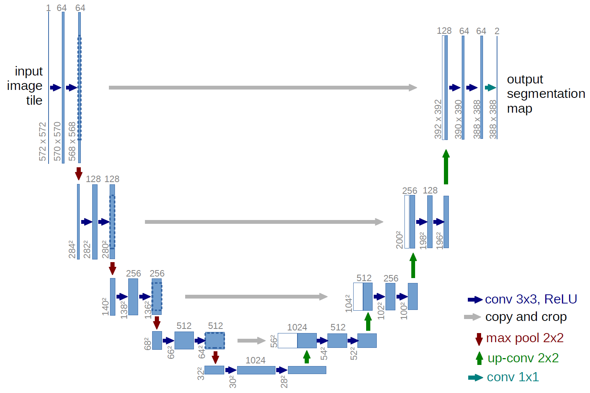

# UNet

This repository provides a script and recipe to train U-Net Medical to achieve state of the art accuracy, and is tested and maintained by NVIDIA.

## Table of contents

1. [The model](#1-the-model)
    1. [Default configuration](#11-default-configuration)
    2. [Model architecture](#12-model-architecture)
    3. [Feature support matrix](#13-feature-support-matrix)
        1.  [Features](##131) 
2. [Setup](#2-setup)
    1. [Requirements](#21-requirements)
3. [Quick start guide](#3-quick-start-guide)
    1. [Clone the repository](#31-clone-the-repository)
    2. [Download and preprocess the dataset](#32-download-and-preprocess-the-dataset)
    3. [Build the U-Net TensorFlow container](#33-build-and-start-the-docker-container-based-on-the-tensorflow-ngc-container)
    4. [Start an interactive session in the NGC container to run training/inference](#34-start-an-interactive-session-in-the-ngc-container-to-run-traininginference)
    5. [Start training](#35-start-training)
    6. [Start inference/predictions](#36-start-inferencepredictions)
4. [Details](#4-details)
    1. [Scripts and sample code](#41-scripts-and-sample-code)
    2. [Parameters](#42-parameters)
    3. [Command line options](#43-command-line-options)
    4. [Getting the data](#44-getting-the-data)
        1. [Dataset guidelines](#441-dataset-guidelines)
    5. [Training process](#45-training-process)
        1. [Optimizer](#451-optimizer)
        2. [Augmentation](#452-augmentation)
    6. [Inference process](#46-inference-process) 
5. [Mixed precision training](#5-mixed-precision-training)
    1. [Enabling mixed precision](#51-enabling-mixed-precision)
6. [Benchmarking](#6-benchmarking)
    1. [Training performance benchmark](#61-training-performance-benchmark)
    2. [Inference performance benchmark](#62-inference-performance-benchmark)
7. [Results](#7-results)
    1. [Training accuracy results](#71-training-accuracy-results)
        1. [NVIDIA DGX-1 (8x V100 16G)](#711-nvidia-dgx-1-8x-v100-16g) 
    2. [Training performance results](#72-training-performance-results)
        1. [NVIDIA DGX-1 (1x V100 16G)](#721-nvidia-dgx-1-1x-v100-16g)
        2. [NVIDIA DGX-1 (8x V100 16G)](#721-nvidia-dgx-1-8x-v100-16g)
    3. [Inference performance results](#73-inference-performance-results)
        1. [NVIDIA DGX-1 (1x V100 16G)](#731)
7. [Glossary](#7-glossary)
8. [Changelog](#8-changelog)
9. [Known issues](#9-known-issues)

## 1. The model

The U-Net model is a convolutional neural network for 2D image segmentation. This repository contains a U-Net implementation as described in the paper [U-Net: Convolutional Networks for Biomedical Image Segmentation](https://arxiv.org/abs/1505.04597), without any alteration.

This model is trained with mixed precision using tensor cores on NVIDIA Volta GPUs. Therefore, researchers can get results much faster than training without Tensor Cores, while experiencing the benefits of mixed precision training (for example, up to 3.5x performance boost). This model is tested against each NGC monthly container release to ensure consistent accuracy and performance over time.

### 1.1. Model architecture

U-Net was first introduced by Olaf Ronneberger, Philip Fischer, and Thomas Brox in the paper: U-Net: Convolutional Networks for Biomedical Image Segmentation.  U-Net allows for seamless segmentation of 2D images, with high accuracy and performance, and can be adapted to solve many different segmentation problems.

The following figure shows the construction of the UNet model and its different components. UNet is composed of a contractive and an expanding path, that aims at building a bottleneck in its centermost part through a combination of convolution and pooling operations. After this bottleneck, the image is reconstructed through a combination of convolutions and upsampling. Skip connections are added with the goal of helping the backward flow of gradients in order to improve the training.



### 1.2. Default configuration

U-Net consists of a contractive (left-side) and expanding (right-side) path. It repeatedly applies unpadded convolutions followed by max pooling for downsampling. Every step in the expanding path consists of an upsampling of the feature maps and a concatenation with the correspondingly cropped feature map from the contractive path.

The following features were implemented in this model:
* Data-parallel multi-GPU training with Horovod.
* Mixed precision support with TensorFlow Automatic Mixed Precision (TF-AMP), which enables mixed precision training without any changes to the code-base by performing automatic graph rewrites and loss scaling controlled by an environmental variable.
* Tensor Core operations to maximize throughput using NVIDIA Volta GPUs.
* Static loss scaling for tensor cores (mixed precision) training.

The following performance optimizations were implemented in this model:
* XLA support (experimental). For TensorFlow, easily adding mixed-precision support is available from NVIDIA’s APEX, a TensorFlow extension that contains utility libraries, such as AMP, which require minimal network code changes to leverage tensor cores performance.

### 1.3. Feature support matrix

The following features are supported by this model.

| **Feature** | **UNet_Medical_TF** |
|:---:|:--------:|
| Horovod Multi-GPU (NCCL) | Yes |

### 1.3.1. Features

**Horovod** - Horovod is a distributed training framework for TensorFlow, Keras, PyTorch and MXNet. The goal of Horovod is to make distributed deep learning fast and easy to use.  For more information about how to get started with Horovod, see the [Horovod: Official repository](https://github.com/horovod/horovod).

## 2. Setup

The following section lists the requirements in order to start training the U-Net model.

### 2.1. Requirements

This repository contains a `Dockerfile` which extends the TensorFlow NGC container and encapsulates some additional dependencies. Aside from these dependencies, ensure you have the following components:
* [NVIDIA Docker](https://github.com/NVIDIA/nvidia-docker)
* [tensorflow:19.03-py3 NGC container](https://ngc.nvidia.com/registry/nvidia-tensorflow)
* [NVIDIA Volta based GPU](https://www.nvidia.com/en-us/data-center/volta-gpu-architecture/)

For more information about how to get started with NGC containers, see the following sections from the NVIDIA GPU Cloud Documentation and the Deep Learning DGX Documentation:

* [Getting Started Using NVIDIA GPU Cloud](https://docs.nvidia.com/ngc/ngc-getting-started-guide/index.html)
* [Accessing And Pulling From The NGC container registry](https://docs.nvidia.com/deeplearning/dgx/user-guide/index.html#accessing_registry)
* [Running Tensorflow](https://docs.nvidia.com/deeplearning/dgx/tensorflow-release-notes/running.html#running)

## 3. Quick start guide

To train your model using mixed precision with tensor cores or using FP32, perform the following steps using the default parameters of the U-Net model on the [EM segmentation challenge dataset](http://brainiac2.mit.edu/isbi_challenge/home).

### 3.1. Clone the repository
```
git clone https://github.com/NVIDIA/DeepLearningExamples
cd DeepLearningExamples/TensorFlow/Segmentation/UNet_Medical
```

### 3.2. Download and preprocess the dataset

The U-Net script  main.py operates on data from the [ISBI Challenge](http://brainiac2.mit.edu/isbi_challenge/home), the dataset originally employed in the [U-Net paper](https://arxiv.org/abs/1505.04597). Upon registration, the challenge's data is made available through the following links:

* [train-volume.tif](http://brainiac2.mit.edu/isbi_challenge/sites/default/files/train-volume.tif)
* [train-labels.tif](http://brainiac2.mit.edu/isbi_challenge/sites/default/files/train-labels.tif)
* [train-volume.tif](http://brainiac2.mit.edu/isbi_challenge/sites/default/files/test-volume.tif)

The script `download_dataset.py` is provided for data download. It is possible to select the destination folder when downloading the files by using the `--data_dir` flag.  For example: 
```
python download_dataset.py --data_dir ./dataset
```
Training and test data are composed of 3 multi-page `TIF` files, each containing 30 2D-images. The training and test datasets are given as stacks of 30 2D-images provided as a multi-page `TIF` that can be read using the Pillow library and NumPy (both Python packages are installed by the `Dockerfile`):
```
From PIL import Image, ImageSequence
Import numpy as np

im = Image.open(path)
slices = [np.array(i) for i in ImageSequence.Iterator(im)]
```
Once downloaded the data using the `download_dataset.py` script, it can be used to run the training and benchmark scripts described below, by pointing `main.py` to its location using the `--data_dir` flag.

**Note:** Masks are only provided for training data.

### 3.3. Build the U-Net TensorFlow container

After Docker is correctly set up, the U-Net TensorFlow container can be built with:
```
user@~/Documents/unet_medical_tf # docker build -t unet_tf .
```

### 3.4. Start an interactive session in the NGC container to run training/inference.

Run the previously built Docker container:
```
user@~/path/to/unet_medical_tf # docker run --runtime=nvidia --rm -it --shm-size=1g --ulimit memlock=-1 --ulimit stack=67108864 -v /path/to/dataset:/data unet_tf:latest bash
```
**Note:** Ensure to mount your dataset using the -v flag to make it available for training inside the NVIDIA Docker container.

### 3.5. Start training

To run training for a default configuration (for example 1/8 GPUs FP32/TF-AMP), run one of the scripts in the `./examples` directory, as follows:
```
bash examples/unet_{FP32, TF-AMP}_{1,8}.sh <path to main.py> <path to dataset> <path to results directory>
```
For example:
```
root@8e522945990f:/workspace/unet# bash examples/unet_FP32_1GPU.sh . /data results
```

### 3.6. Start inference/predictions
To run inference on a checkpointed model, run:
```
python main.py --data_dir /data --model_dir <path to checkpoint> --exec_mode predict
```

## 4. Details

The following sections provide greater details of the dataset, running training and inference, and the training results.

### 4.1. Scripts and sample code

In the root directory, the most important files are:
* `main.py`: Serves as the entry point to the application.
* `Dockerfile`: Container with the basic set of dependencies to run UNet
* `requirements.txt`: Set of extra requirements for running UNet
* `download_data.py`: Automatically downloads the dataset for training

The utils/ folder encapsulates the necessary tools to train and perform inference using UNet. Its main components are:
* `runner.py`: Implements the logic for training and inference
* `data_loader.py`: Implements the data loading and augmentation
* `hooks/profiler.py`: Collects different metrics to be used for benchmarking and testing
* `var_storage.py`: Helper functions for TF-AMP

The model/ folder contains information about the building blocks of UNet and the way they are assembled. Its contents are:
* `layers.py`: Defines the different blocks that are used to assemble UNet
* `unet.py`: Defines the model architecture using the blocks from the `layers.py` script

Other folders included in the root directory are:
* `dllogger/`: Contains the utils for logging
* `examples/`: Provides examples for training and benchmarking UNet
* `images/`: Contains a model diagram

### 4.2. Parameters
The complete list of the available parameters for the main.py script contains:
* `--exec_mode`: Select the execution mode to run the model (default: train_and_predict)
* `--model_dir`: Set the output directory for information related to the model (default: result/)
* `--data_dir`: Set the input directory containing the dataset (defaut: None)
* `--batch_size`: Size of each minibatch per GPU (default: 1)
* `--max_steps`: Maximum number of steps (batches) for training (default: 1000)
* `--seed`: Set random seed for reproducibility (default: 0)
* `--weight_decay`: Weight decay coefficient (default: 0.0005)
* `--log_every`: Log performance every n steps (default: 100)
* `--warmup_steps`: Skip logging during the first n steps (default: 200)
* `--learning_rate`: Model’s learning rate (default: 0.01)
* `--momentum`: Momentum coefficient for model’s optimizer (default: 0.99)
* `--decay_steps`: Number of steps before learning rate decay (default: 5000)
* `--decay_rate`: Decay rate for polynomial learning rate decay (default 0.95)
* `--augment`: Enable data augmentation (default: False)
* `--benchmark`: Enable performance benchmarking (default: False)
* `--use_amp`: Enable automatic mixed precision (default: False)

### 4.3. Command line options

To see the full list of available options and their descriptions, use the `-h` or `--help` command line option, for example: 
```
root@ac1c9afe0a0b:/workspace/unet# python main.py
usage: main.py [-h] 
            [--exec_mode {train,train_and_predict,predict,benchmark}]
            [--model_dir MODEL_DIR] 
            --data_dir DATA_DIR 
            [--batch_size BATCH_SIZE] 
            [--max_steps MAX_STEPS]
            [--seed SEED]
            [--weight_decay WEIGHT_DECAY]
            [--log_every LOG_EVERY]
            [--warmup_steps WARMUP_STEPS]
            [--learning_rate LEARNING_RATE]
            [--momentum MOMENTUM]
            [--decay_steps DECAY_STEPS]
            [--decay_rate DECAY_RATE]
            [--augment]
            [--no-augment]
            [--benchmark]
            [--no-benchmark]
            [--use_amp]
```

### 4.4. Getting the data

The U-Net model was trained in the [EM segmentation challenge dataset](http://brainiac2.mit.edu/isbi_challenge/home). Test images provided by the organization were used to produce the resulting masks for submission.

Training and test data is comprised of three 512x512x30 `TIF` volumes (`test-volume.tif`, `train-volume.tif` and `train-labels.tif`). Files `test-volume.tif` and `train-volume.tif` contain grayscale 2D slices to be segmented. Additionally, training masks are provided in `train-labels.tif` as a 512x512x30 `TIF` volume, where each pixel has one of two classes: 
* 0 indicating the presence of cellular membrane, and 
* 1 corresponding to background.

The objective is to produce a set of masks that segment the data as accurately as possible. The results are expected to be submitted as a 32-bit `TIF` 3D image, which values between `0` (100% membrane certainty) and `1` (100% non-membrane certainty). 

#### 4.4.1 Dataset guidelines

The process of loading, normalizing and augmenting the data contained in the dataset can be found in the `data_loader.py` script. 

Initially, data is loaded from a multi-page `TIF` file and converted to 512x512x30 NumPy arrays with the use of Pillow. These NumPy arrays are fed to the model through `tf.data.Dataset.from_tensor_slices()`, in order to achieve high performance.

Intensities on the volumes are then normalized to an interval `[-1, 1]`, whereas labels are one-hot encoded for their later use in pixel wise cross entropy loss, becoming 512x512x30x2 tensors.

If augmentation is enabled, the following set of augmentation techniques are applied:
* Random horizontal flipping
* Random vertical flipping
* Elastic deformation through dense_image_warp
* Random rotation
* Crop to a random dimension and resize to input dimension
* Random brightness shifting

At the end, intensities are clipped to the `[-1, 1]` interval.


### 4.5. Training process

#### 4.5.1. Optimizer

The model trains for 40,000 batches, with the default U-Net setup as specified in the [original paper](https://arxiv.org/abs/1505.04597):

* SGD with momentum (0.99)
* Learning rate = 0.01


This default parametrization is employed when running scripts from the ./examples directory and when running main.py without explicitly overriding these fields.
* Augmentation
* During training, we perform the following augmentation techniques:
* Random flip left and right
* Random flip up and down
* Elastic deformation
* Random rotation
* Random crop and resize
* Random brightness changes

To run a pre-parameterized configuration (1 or 8 GPUs, FP32 or AMP), run one of the scripts in the `./examples` directory, for example:
```
./examples/unet_{FP32, TF-AMP}_{1, 8}GPU.sh <path/to/main.py> <path/to/dataset> <path/to/checkpoints> <batch size>
```
Use `-h` or `--help` to obtain a list of available options in the `main.py` script.

**Note:** When calling the `main.py` script manually, data augmentation is disabled. In order to enable data augmentation, use the `--augment` flag at the end of your invocation.

Use the `--model_dir` flag to select the location where to store the artifacts of the training.

### 4.6. Inference process

To run inference on a checkpointed model, run the script below, although, it requires a pre-trained model checkpoint and tokenized input.
```
python main.py --data_dir /data --model_dir <path to checkpoint> --exec_mode predict
```
This script should produce the prediction results over a set of masks which will be located in `<path to checkpoint>/eval`.

## 5. Mixed precision training

Mixed precision is the combined use of different numerical precisions in a computational method. [Mixed precision](https://arxiv.org/abs/1710.03740) training offers significant computational speedup by performing operations in half-precision format, while storing minimal information in single-precision to retain as much information as possible in critical parts of the network. Since the introduction of [tensor cores](https://developer.nvidia.com/tensor-cores) in the Volta and Turing architecture, significant training speedups are experienced by switching to mixed precision -- up to 3x overall speedup on the most arithmetically intense model architectures.  Using mixed precision training requires two steps:
1. Porting the model to use the FP16 data type where appropriate.
2. Adding loss scaling to preserve small gradient values.

The ability to train deep learning networks with lower precision was introduced in the Pascal architecture and first supported in [CUDA 8](https://devblogs.nvidia.com/parallelforall/tag/fp16/) in the NVIDIA Deep Learning SDK.

For information about:
- How to train using mixed precision, see the [Mixed Precision Training](https://arxiv.org/abs/1710.03740) paper and [Training With Mixed Precision](https://docs.nvidia.com/deeplearning/sdk/mixed-precision-training/index.html) documentation.
- Techniques used for mixed precision training, see the [Mixed-Precision Training of Deep Neural Networks](https://devblogs.nvidia.com/mixed-precision-training-deep-neural-networks/) blog.
- How to access and enable AMP for TensorFlow, see [Using TF-AMP](https://docs.nvidia.com/deeplearning/dgx/tensorflow-user-guide/index.html#tfamp) from the TensorFlow User Guide.
- APEX tools for mixed precision training, see the [NVIDIA Apex: Tools for Easy Mixed-Precision Training in PyTorch](https://devblogs.nvidia.com/apex-pytorch-easy-mixed-precision-training/).

## 5.1. Enabling mixed precision

In order to enable mixed precision training, the following environment variables must be defined with the correct value before the training starts:
```
TF_ENABLE_AUTO_MIXED_PRECISION=1
```
Exporting these variables ensures that loss scaling is performed correctly and automatically. 
By supplying the `--use_amp` flag to the `main.py` script while training in FP32, the following variables are set to their correct value for mixed precision training inside the `./utils/runner.py` script:
```
if params['use_amp']:
   assert params['dtype'] == tf.float32, "TF-AMP requires FP32 precision"

   LOGGER.log("TF AMP is activated - Experimental Feature")
   os.environ['TF_ENABLE_AUTO_MIXED_PRECISION'] = '1'
```

## 6. Benchmarking

The following section shows how to run benchmarks measuring the model performance in training and inference modes.

### 6.1. Training performance benchmark

To benchmark training, run one of the scripts in `./examples/unet_TRAIN_BENCHMARK_{FP32, TF-AMP}_{1, 8}GPU.sh  <path/to/main.py> <path/to/dataset> <path/to/checkpoints> <batch size>`.

Each of these scripts will by default run 200 warm-up iterations and benchmark the performance during training in the next 100 iterations. To control warmup and benchmark length, use `--warmup_steps`, and `--max_steps` flags.

### 6.2. Inference performance benchmark

To benchmark inference, run one of the scripts in `./examples/unet_INFER_BENCHMARK_{FP32, TF-AMP}.sh <path/to/main.py> <path/to/dataset> <path/to/checkpoints> <batch size>`.

Each of these scripts will by default run 200 warmup iterations and benchmark the performance during inference in the next 100 iterations. To control warmup and benchmark length, use `--warmup_steps`, and `--max_steps` flags.

## 7. Results

The following sections provide details on how we achieved our performance and accuracy in training and inference. 

### 7.1. Training accuracy results

#### 7.1.1 NVIDIA DGX-1 (8x V100 16G)

Our results were obtained by running the `./examples/unet_{FP32, TF-AMP}_{1, 8}GPU.sh` scripts in the tensorflow:19.03-py3 NGC container on NVIDIA DGX-1 with 8x V100 16G GPUs.

Metrics employed by the organization are explained in detail [here](http://brainiac2.mit.edu/isbi_challenge/evaluation).

The results described below were obtained after the submission of our evaluations to the [ISBI Challenge](http://brainiac2.mit.edu/isbi_challenge) organizers. 

| **Number og GPUs** | **FP32 Rand Score Thin** | **FP32 Information Score Thin** | **TF-AMP Rand Score Thin** | **TF-AMP Information Score Thin** | **Total time to train with FP16 (Hrs)** | **Total time to train with FP32 (Hrs)** |
|:---:|:--------:|:-------:|:--------:|:-------:|:--------:|:-------:|
|1 | 0.938508265 | 0.970255682 | 0.939619101 | 0.970120138 | 7.1 | 11.28 |
|8 | 0.932395087 | 0.9786346 | 0.941360867 | 0.976235311 | 0.9 | 1.41 |

### 7.2. Training performance results

#### 7.2.1 NVIDIA DGX-1 (1x V100 16G)

Our results were obtained by running the `./examples/unet_TRAIN_BENCHMARK_{FP32, TF-AMP}_1GPU.sh` scripts in
the tensorflow:19.03-py3 NGC container on NVIDIA DGX-1 with 1x V100 16G GPU while data augmentation is enabled.


| **Batch size** | **FP32 max img/s** | **TF-AMP max img/s** | **Speedup factor** | 
|:---:|:--------:|:-------:|:-------:|
| 1 | 12.37 | 21.91 | 1.77 |
| 8 | 13.81  | 29.58 | 2.14 |
| 16 | Out of memory | 30.77 | - |

To achieve these same results, follow the [Quick start guide](#3-quick-start-guide) outlined above.

#### 7.2.2 NVIDIA DGX-1 (8x V100 16G)

Our results were obtained by running the `./examples/unet_TRAIN_BENCHMARK_{FP32, TF-AMP}_8GPU.sh` scripts in
the tensorflow:19.03-py3 NGC container on NVIDIA DGX-1 with 8x V100 16G GPU while data augmentation is enabled.

| **Batch size per GPU** | **FP32 max img/s** | **TF-AMP max img/s** | **Speedup factor** | 
|:---:|:--------:|:-------:|:-------:|
| 1 | 89.93 | 126.66  | 1.41 |
| 8 | 105.35 | 130.66 | 1.24 |
| 16 | Out of memory | 132.78  | - |

To achieve these same results, follow the [Quick start guide](#3-quick-start-guide) outlined above.

### 7.3. Inference performance results

Our results were obtained by running the `./examples/unet_INFER_BENCHMARK_{FP32, TF-AMP}.sh` scripts in
the tensorflow:19.03-py3 NGC container on NVIDIA DGX-1 with 1x V100 16G GPU while data augmentation is enabled.

| **Batch size** | **FP32 img/s** | **TF-AMP img/s** | **Speedup factor** | 
|:---:|:--------:|:-------:|:-------:|
| 1 | 34.27 | 62.81  | 1.83 |
| 8 | 37.09 | 79.62 | 2.14 |
| 16 | Out of memory | 83.33  | - |

To achieve these same results, follow the [Quick start guide](#3-quick-start-guide) outlined above.

## 8. Changelog

May 2019
* Initial release

## 9. Known issues

There are no known issues in this release.
