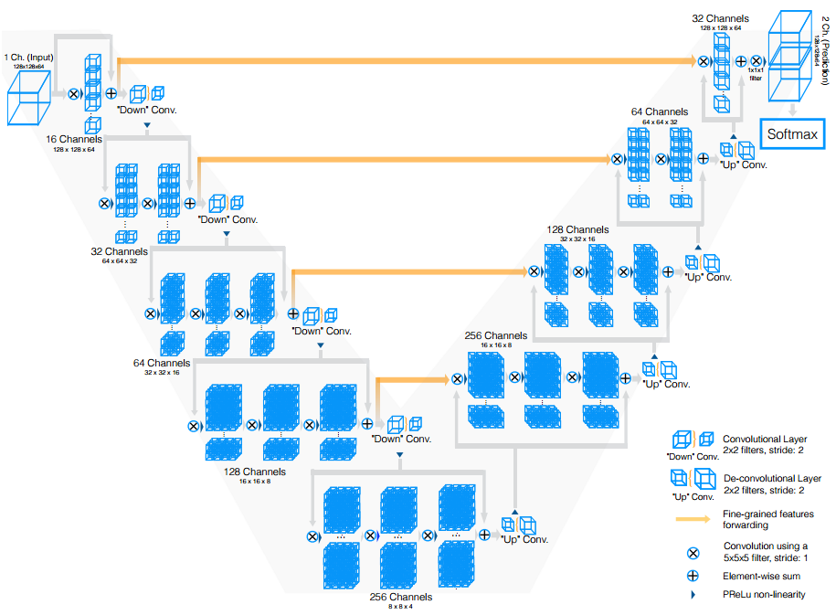
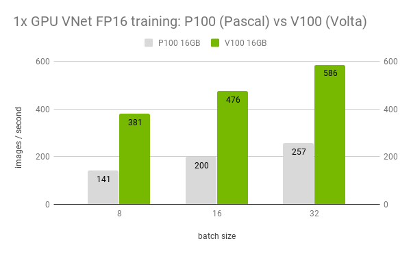
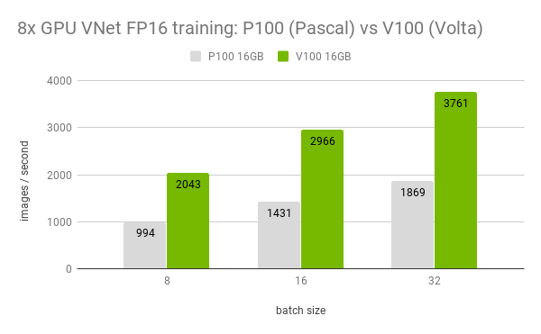

# V-Net Medical For Tensorflow

This repository provides a script and recipe to train the V-Net model to achieve state of the art accuracy, and is tested and maintained by NVIDIA.

## Table of Contents
 
- [Model overview](#model-overview)
   * [Model architecture](#model-architecture)
   * [Default configuration](#default-configuration)
   * [Feature support matrix](#feature-support-matrix)
     * [Features](#features)
   * [Mixed precision training](#mixed-precision-training)
     * [Enabling mixed precision](#enabling-mixed-precision)
     * [Enabling TF32](#enabling-tf32)
- [Setup](#setup)
   * [Requirements](#requirements)
- [Quick Start Guide](#quick-start-guide)
- [Advanced](#advanced)
   * [Scripts and sample code](#scripts-and-sample-code)
   * [Parameters](#parameters)
   * [Command-line options](#command-line-options)
   * [Getting the data](#getting-the-data)
     * [Dataset guidelines](#dataset-guidelines)
     * [Multi-dataset](#multi-dataset)
   * [Training process](#training-process)
   * [Inference process](#inference-process)
- [Performance](#performance)   
   * [Benchmarking](#benchmarking)
     * [Training performance benchmark](#training-performance-benchmark)
     * [Inference performance benchmark](#inference-performance-benchmark)
   * [Results](#results)
     * [Training accuracy results](#training-accuracy-results)
       * [Training accuracy: NVIDIA DGX-1 (8x V100 16GB)](#training-accuracy-nvidia-dgx-1-8x-v100-16gb)
     * [Training performance results](#training-performance-results)
       * [Training performance: NVIDIA DGX-1 (8x V100 16GB)](#training-performance-nvidia-dgx-1-8x-v100-16gb)
     * [Inference performance results](#inference-performance-results)
        * [Inference performance: NVIDIA DGX-1 (1x V100 16GB)](#inference-performance-nvidia-dgx-1-1x-v100-16gb)
- [Release notes](#release-notes)
   * [Changelog](#changelog)
   * [Known issues](#known-issues)


## Model overview

The V-Net model for Tensorflow, called V-Net_Medical_TF is a convolutional neural network for 3D image segmentation. This repository contains a V-Net implementation and is based on the paper [V-Net: Fully Convolutional Neural Networks for Volumetric Medical Image Segmentation](https://arxiv.org/pdf/1606.04797), with small alterations to support a new dataset for Hippocampus segmentation.

This implementation differs from the original in the following ways:
* Convolution filters are 3x3x3 instead of 5x5x5 to increase performance without negatively affecting the accuracy
* The number of upsample/downsample levels is reduced to 3 to accommodate the different input size
* PReLU activation has been substituted by ReLU to increase performance without negatively affecting the accuracy

This model is trained with mixed precision using Tensor Cores on Volta, Turing, and the NVIDIA Ampere GPU architectures. Therefore, researchers can get results  2.2x faster than training without Tensor Cores, while experiencing the benefits of mixed precision training. This model is tested against each NGC monthly container release to ensure consistent accuracy and performance over time.

### Model architecture

V-Net was first introduced by Fausto Milletari, Nassir Navab, Seyed-Ahmad Ahmadi in the paper: [V-Net: Fully Convolutional Neural Networks for Volumetric Medical Image Segmentation](https://arxiv.org/pdf/1606.04797). V-Net allows for seamless segmentation of 3D images, with high accuracy and performance, and can be adapted to solve many different segmentation problems.

The following figure shows the construction of the standard V-Net model and its different components. V-Net is composed of a contractive and an expanding path, that aims at building a bottleneck in its centermost part through a combination of convolution and downsampling. After this bottleneck, the image is reconstructed through a combination of convolutions and upsampling. Skip connections are added with the goal of helping the backward flow of gradients in order to improve the training.


 
Figure 1. VNet architecture

### Default configuration

V-Net consists of a contractive (left-side) and expanding (right-side) path. It repeatedly applies unpadded convolutions followed by max pooling for downsampling. Every step in the expanding path consists of an upsampling of the feature maps and a concatenation with the correspondingly cropped feature map from the contractive path.

The following performance optimizations were implemented in this model:
* XLA support.
* Reduced size of convolutional filters to 3x3x3
* ReLU activation used instead of PReLU
* Batchnorm used for training

### Feature support matrix    
     
The following features are supported by this model.

| **Feature** | **V-Net_Medical_TF** |
|:---:|:--------:|
| Horovod Multi-GPU (NCCL) | Yes |
| Automatic Mixed Precision (AMP) | Yes |

The following features were implemented in this model:
* Data-parallel multi-GPU training with Horovod.
* Mixed precision support with TensorFlow Automatic Mixed Precision (TF-AMP), which enables mixed precision training without any changes to the code-base by performing automatic graph rewrites and loss scaling controlled by an environmental variable.
* Tensor Core operations to maximize throughput using NVIDIA Volta GPUs.

#### Features

* Multi-GPU training with Horovod

Our model uses Horovod to implement efficient multi-GPU training with NCCL. For details, see example sources in this repository or see the [TensorFlow tutorial](https://github.com/horovod/horovod/#usage).

* Automatic Mixed Precision (AMP)

Enables mixed precision training without any changes to the code-base by performing automatic graph rewrites and loss scaling controlled by an environmental variable.

### Mixed precision training

Mixed precision is the combined use of different numerical precisions in a computational method. [Mixed precision](https://arxiv.org/abs/1710.03740) training offers significant computational speedup by performing operations in half-precision format while storing minimal information in single-precision to retain as much information as possible in critical parts of the network. Since the introduction of [Tensor Cores](https://developer.nvidia.com/tensor-cores) in Volta, and following with both the Turing and Ampere architectures, significant training speedups are experienced by switching to mixed precision -- up to 3x overall speedup on the most arithmetically intense model architectures. Using [mixed precision training](https://docs.nvidia.com/deeplearning/performance/mixed-precision-training/index.html) previously required two steps:
1.  Porting the model to use the FP16 data type where appropriate.    
2.  Adding loss scaling to preserve small gradient values.

This can now be achieved using Automatic Mixed Precision (AMP) for TensorFlow to enable the full [mixed precision methodology](https://docs.nvidia.com/deeplearning/sdk/mixed-precision-training/index.html#tensorflow) in your existing TensorFlow model code.  AMP enables mixed precision training on Volta and Turing GPUs automatically. The TensorFlow framework code makes all necessary model changes internally.

In TF-AMP, the computational graph is optimized to use as few casts as necessary and maximize the use of FP16, and the loss scaling is automatically applied inside of supported optimizers. AMP can be configured to work with the existing tf.contrib loss scaling manager by disabling the AMP scaling with a single environment variable to perform only the automatic mixed-precision optimization. It accomplishes this by automatically rewriting all computation graphs with the necessary operations to enable mixed precision training and automatic loss scaling.

-   How to train using mixed precision, see the [Mixed Precision Training](https://arxiv.org/abs/1710.03740) paper and [Training With Mixed Precision](https://docs.nvidia.com/deeplearning/performance/mixed-precision-training/index.html) documentation.
-   Techniques used for mixed precision training, see the [Mixed-Precision Training of Deep Neural Networks](https://devblogs.nvidia.com/mixed-precision-training-deep-neural-networks/) blog.
-   How to access and enable AMP for TensorFlow, see [Using TF-AMP](https://docs.nvidia.com/deeplearning/dgx/tensorflow-user-guide/index.html#tfamp) from the TensorFlow User Guide.

### Enabling mixed precision

In order to enable mixed precision training, the following environment variables must be defined with the correct value before the training starts:
```
TF_ENABLE_AUTO_MIXED_PRECISION=1
```
Exporting these variables ensures that loss scaling is performed correctly and automatically. 
By supplying the `--amp` flag to the `main.py` script while training in FP32, the following variables are set to their correct value for mixed precision training inside the `./utils/runner.py` script:
```
if params['use_amp']:
   LOGGER.log("TF AMP is activated - Experimental Feature")
   os.environ['TF_ENABLE_AUTO_MIXED_PRECISION'] = '1'
```

#### Enabling TF32

TensorFloat-32 (TF32) is the new math mode in [NVIDIA A100](#https://www.nvidia.com/en-us/data-center/a100/) GPUs for handling the matrix math also called tensor operations. TF32 running on Tensor Cores in A100 GPUs can provide up to 10x speedups compared to single-precision floating-point math (FP32) on Volta GPUs. 

TF32 Tensor Cores can speed up networks using FP32, typically with no loss of accuracy. It is more robust than FP16 for models which require high dynamic range for weights or activations.

For more information, refer to the [TensorFloat-32 in the A100 GPU Accelerates AI Training, HPC up to 20x](#https://blogs.nvidia.com/blog/2020/05/14/tensorfloat-32-precision-format/) blog post.

TF32 is supported in the NVIDIA Ampere GPU architecture and is enabled by default.


## Setup

The following section lists the requirements in order to start training the V-Net Medical model.

### Requirements

This repository contains a `Dockerfile` which extends the TensorFlow NGC container and encapsulates some additional dependencies. Aside from these dependencies, ensure you have the following components:
* [NVIDIA Docker](https://github.com/NVIDIA/nvidia-docker)
- TensorFlow 20.06-tf1-py3 [NGC container](https://ngc.nvidia.com/registry/nvidia-tensorflow)
- GPU-based architecture:
    - [NVIDIA Volta](https://www.nvidia.com/en-us/data-center/volta-gpu-architecture/)
    - [NVIDIA Turing](https://www.nvidia.com/en-us/geforce/turing/)
    - [NVIDIA Ampere architecture](https://www.nvidia.com/en-us/data-center/nvidia-ampere-gpu-architecture/)


For more information about how to get started with NGC containers, see the following sections from the NVIDIA GPU Cloud Documentation and the Deep Learning DGX Documentation:

* [Getting Started Using NVIDIA GPU Cloud](https://docs.nvidia.com/ngc/ngc-getting-started-guide/index.html)
* [Accessing And Pulling From The NGC container registry](https://docs.nvidia.com/deeplearning/dgx/user-guide/index.html#accessing_registry)
* [Running Tensorflow](https://docs.nvidia.com/deeplearning/dgx/tensorflow-release-notes/running.html#running)

## Quick Start Guide

To train your model using mixed precision with Tensor Cores or using FP32, perform the following steps using the default parameters of the V-Net model on the Hippocampus head and body dataset present on the [medical segmentation decathlon website](http://medicaldecathlon.com/).

1. Clone the repository
```
git clone https://github.com/NVIDIA/DeepLearningExamples
cd DeepLearningExamples/TensorFlow/Segmentation/V-Net_tf
```

2. Download and preprocess the dataset

The V-Net script `main.py` operates on Hippocampus head and body data from the [medical segmentation decathlon](http://medicaldecathlon.com/). Upon registration, the challenge's data is made available through the following link:

* [Medical segmentation decathlon Google Drive](https://drive.google.com/drive/folders/1HqEgzS8BV2c7xYNrZdEAnrHk7osJJ--2)

The script `download_dataset.py` is provided for data download. It is possible to select the destination folder when downloading the files by using the `--data_dir` flag.  For example: 
```
python download_dataset.py --data_dir ./data
```

Once downloaded the data using the `download_dataset.py` script, it can be used to run the training and benchmark scripts described below, by pointing `main.py` to its location using the `--data_dir` flag.

**Note:** Masks are only provided for training data.

3. Build the V-Net TensorFlow container

After Docker is correctly set up, the V-Net TensorFlow container can be built with:
```
docker build -t vnet_tf .
```

4. Start an interactive session in the NGC container to run training/inference.

Run the previously built Docker container:
```
$ docker run --runtime=nvidia --rm -it --shm-size=1g --ulimit memlock=-1 --ulimit stack=67108864 -v /path/to/dataset:/data vnet_tf:latest bash
```
**Note:** Ensure to mount your dataset using the `-v` flag to make it available for training inside the NVIDIA Docker container. Data can be downloaded as well from inside the container.

5. Start training

To run training on all training data for a default configuration (for example 1/4/8 GPUs FP32/TF-AMP), run the `vnet_train.py` script in the `./examples` directory:
```
usage: vnet_train.py [-h] 
                          --data_dir DATA_DIR 
                          --model_dir MODEL_DIR 
                          --gpus {1, 8} 
                          --batch_size BATCH_SIZE 
                          --epochs EPOCHS
                          OPTIONAL [--amp]
```
For example:
```
python examples/vnet_train.py --data_dir ./data/Task04_Hippocampus --model_dir ./tmp --gpus 8 --batch_size 260 --epochs 50 --amp
```

To run training on 9/10 of the training data and perform evaluation on the remaining 1/10, run the `vnet_train_and_evaluate.py` script in the `./examples` directory:
```
usage: vnet_train_and_evaluate.py [-h] 
                          --data_dir DATA_DIR 
                          --model_dir MODEL_DIR 
                          --gpus {1, 8} 
                          --batch_size BATCH_SIZE 
                          --epochs EPOCHS
                          OPTIONAL [--amp]
```
This is useful to estimate the convergence point of the training. For example:
```
python examples/vnet_train_and_evaluate.py --data_dir ./data/Task04_Hippocampus --model_dir ./tmp --gpus 1 --batch_size 8 --epochs 260 --amp
```

6. Start inference/predictions
To run inference on a checkpointed model, run the `vnet_predict.py` script in the `./examples` directory:
```
usage: vnet_predict.py [-h] 
                         --data_dir DATA_DIR 
                         --model_dir MODEL_DIR
                         --batch_size BATCH_SIZE 
                         OPTIONAL [--amp]
```
For example:
```
python examples/vnet_predict.py --data_dir ./data/Task04_Hippocampus --model_dir ./tmp --batch_size 4 --amp
```

## Advanced

The following sections provide greater details of the dataset, running training and inference, and the training results.

### Scripts and sample code

In the root directory, the most important files are:
* `main.py`: Serves as the entry point to the application.
* `Dockerfile`: Container with the basic set of dependencies to run V-Net
* `requirements.txt`: Set of extra requirements for running V-Net
* `download_data.py`: Automatically downloads the dataset for training

The `utils/` folder encapsulates the necessary tools to train and perform inference using V-Net. Its main components are:
* `runner.py`: Implements the logic for training and inference
* `data_loader.py`: Implements the data loading and augmentation
* `hooks/profiling_hook.py`: Collects different metrics to be used for benchmarking
* `hooks/training_hook.py`: Collects different metrics to be used for training
* `hooks/evaluation_hook.py`: Collects different metrics to be used for testing
* `var_storage.py`: Helper functions for TF-AMP

The model/ folder contains information about the building blocks of V-Net and the way they are assembled. Its contents are:
* `layers.py`: Defines the different blocks that are used to assemble V-Net
* `vnet.py`: Defines the model architecture using the blocks from the `layers.py` script

Other folders included in the root directory are:
* `dllogger/`: Contains the utilities for logging
* `examples/`: Provides examples for training and benchmarking V-Net
* `images/`: Contains a model diagram

### Parameters
The complete list of the available parameters for the main.py script contains:
* `--exec_mode`: Select the execution mode to run the model (default: `train_and_predict`)
* `--data_normalization`: Select the type of data normalization (default: `zscore`)
* `--activation`: Select the activation to be used in the network (default: `prelu`)
* `--resize_interpolator`: Select the interpolator for image resizing (default: `nearest_neighbor`)
* `--loss`: Loss function to be utilized for training (default: `dice`)
* `--normalization_layer`: Type of normalization layer to be used in the model (default: `batchnorm`)
* `--pooling`: Type of pooling layer to be used in the model (default: `conv_pool`)
* `--upsampling`: Type of upsampling layer to be used in the model (default: `transposed_conv`)
* `--seed`: Random seed value (default: `0`)
* `--input_shape`: Target resize dimension for input samples (default: `[32 32 32]`)
* `--upscale_blocks`: Number of upscale blocks with the depth of their residual component (default: `[3 3 3]`)
* `--downscale_blocks`: Number of downscale blocks with the depth of their residual component (default: `[3 3]`)
* `--model_dir`: Set the output directory for information related to the model (default: `result/`)
* `--convolution_size`: Size of the convolutional kernel filters (default: `3`)
* `--batch_size`: Number of samples processed per execution step
* `--log_every`: Log every this number of epochs (default: `100`)
* `--warmup_steps`: Initial number of steps that will not be benchmarked as the model starts running (default: `200`)
* `--train_epochs`: Number of times that training will go through the entire dataset
* `--optimizer`: Optimizer to be used during training (default: `rmsprop`)
* `--base_lr`: Model’s learning rate (default: `0.01`)
* `--momentum`: Momentum coefficient for model’s optimizer (default: `0.99`)
* `--train_split`: Proportion of the dataset that will become the training set (default: `0.9`)
* `--split_seed`: Random seed for the splitting of the dataset between training and validation
* `--model_dir`: Path where checkpoints and information related to the model will be stored
* `--data_dir`: Path to the dataset
* `--augment`: Enable data augmentation (default: `False`)
* `--benchmark`: Enable performance benchmarking (default: `False`)
* `--amp`: Enable automatic mixed precision (default: `False`)
* `--xla`: Enable xla (default: `False`)

### Command-line options

To see the full list of available options and their descriptions, use the `-h` or `--help` command line option, for example: 
```
python main.py 
usage: main.py [-h]
               --exec_mode {train,predict,train_and_predict,train_and_evaluate}
               [--data_normalization {zscore}]
               [--activation {relu}]
               [--resize_interpolator {linear}]
               [--loss {dice}]
               [--normalization_layer {batchnorm}]
               [--pooling {conv_pool}]
               [--upsampling {transposed_conv}]
               [--seed SEED]
               [--input_shape INPUT_SHAPE [INPUT_SHAPE ...]]
               [--upscale_blocks UPSCALE_BLOCKS [UPSCALE_BLOCKS ...]]
               [--downscale_blocks DOWNSCALE_BLOCKS [DOWNSCALE_BLOCKS ...]]
               [--convolution_size {3}]
               --batch_size BATCH_SIZE
               [--log_every LOG_EVERY]
               [--warmup_steps WARMUP_STEPS]
               [--train_epochs TRAIN_EPOCHS]
               [--optimizer {rmsprop}]
               [--base_lr BASE_LR]
               [--momentum MOMENTUM]
               [--train_split TRAIN_SPLIT]
               [--split_seed SPLIT_SEED]
               --model_dir MODEL_DIR
               --data_dir DATA_DIR
               [--benchmark]
               [--amp]
               [--xla]
               [--augment]

```

### Getting the data

The V-Net model was trained on the Hippocampus dataset from [medical segmentation decathlon](http://medicaldecathlon.com/). Test images provided by the organization were used to produce the resulting masks for submission.

The objective is to produce a set of masks that segment the data as accurately as possible. 

Medical segmentation decathlon (MSD) datasets are conformed by the following elements:
* `dataset.json` contains a high level description of the contents of the dataset
* `ImagesTr` contains the training images as Nifti files
* `LabelsTr` contains the training labels as Nifti files
* `ImagesTs` contains the test images as Nifti files

#### Dataset guidelines

The process of loading, normalizing and augmenting the data contained in the dataset can be found in the `data_loader.py` script. 

Initially, data is loaded from a `Nifti` file and converted to NumPy arrays with the use of SimpleItk, with target dimensions specified through `--input_shape`. These NumPy arrays are fed to the model through `tf.data.Dataset.from_tensor_slices()`, in order to achieve high performance.

Intensities on the volumes are then normalized using the method specified in `--data_normalization`, whereas labels are one-hot encoded for their later use.

If augmentation is enabled, the following set of augmentation techniques are applied:
* Random horizontal flipping
* Random vertical flipping

### Training process

#### Optimizer

The model trains for 80 epochs with the following hyperparameters:

* RMSProp optimizer with momentum = 0.0
* Base learning rate = 0.0001

### Inference process

To run inference on a checkpointed model, run the script below, although it requires a pre-trained model checkpoint and tokenized input.
```
python examples/vnet_predict.py --data_dir ./data/Task04_Hippocampus --model_dir ./tmp --batch_size {N} [--amp]
```
This script should produce the prediction results over a set of masks which will be located in `./tmp/eval`.

## Performance

###  Benchmarking

Starting from CuDNN 7.6.2, enhanced support for 3D convolutions in mixed precision has been introduced to our containers. This enhanced support accelerates even further both training and inference, while maintaining the reduction of the model's memory footprint characteristic of mixed precision training.




In the two figures above, it's displayed the difference in throughput for P100 and V100 GPUs when training V-Net in a single and multi-GPU setup. We do this for different batch sizes. 
For both single and multi-GPU, training V-Net using mixed precision in Volta GPUs (V100) is at least 2x faster than in Pascal (P100). 


The figure above displays the difference in throughput for P100 and V100 GPUs when performing inference using V-Net. We do this for different batch sizes. 
In general, V-Net inference when using mixed precision in Volta GPUs (V100) is at least 2x faster than in Pascal (P100). 

The following section shows how to run benchmarks measuring the model performance in training and inference modes.

#### Training performance benchmark

To benchmark training, run the script `vnet_benchmark.py` in  the `./examples` directory.
```
usage: vnet_benchmark.py [-h] 
                        --data_dir DATA_DIR 
                        --model_dir MODEL_DIR 
                        --mode train 
                        --gpus {1, 8} 
                        --batch_size BATCH_SIZE 
                        OPTIONAL [--amp]
```

This script will by default run 200 warm-up iterations and benchmark the performance during training in the next 200 iterations.

#### Inference performance benchmark

To benchmark inference, run the script `vnet_benchmark.py` in  the `./examples` directory.
```
usage: vnet_benchmark.py [-h] 
                        --data_dir DATA_DIR 
                        --model_dir MODEL_DIR 
                        --mode predict
                        --gpus {1, 8} 
                        --batch_size BATCH_SIZE 
                        OPTIONAL [--amp]
```

This script will by default run 200 warm-up iterations and benchmark the performance  during inference in the next 200 iterations.

### Results

The following sections provide details on how we achieved our performance and accuracy in training and inference. 

#### Training accuracy results

Dataset is divided on training data (samples with ground truth) and test data (unlabelled). In order to obtain instant feedback on the quality of the model, test data is put aside and training and evaluation is performed on the original training set.

For training, 90% of the traning data is used, while for validation it is used the remaining 10%, which is treated as validation data. This validation data remains unseen during training and it is used exclusively to calculate the final accuracy of the model.

##### Training accuracy: NVIDIA DGX-1 (8x V100 16GB)

Our results were obtained by running the `./examples/vnet_train_and_evaluate.py` script in the `nvcr.io/nvidia/tensorflow:20.06-tf1-py3` NGC container on NVIDIA DGX-1 with 8x V100 16GB GPUs.

To train until convergence in FP32 using 1GPU, run:
```
python examples/vnet_train_and_evaluate.py --gpus 1 --batch_size 2 --base_lr 0.0001 --epochs 80 --data_dir ./data/Task04_Hippocampus/ --model_dir /tmp
```
To train until convergence in FP32 using 8GPU, run:
```
python examples/vnet_train_and_evaluate.py --gpus 8 --batch_size 2 --base_lr 0.0001 --epochs 320 --data_dir ./data/Task04_Hippocampus/ --model_dir /tmp
```
To train until convergence in FP16 using 1GPU, run:
```
python examples/vnet_train_and_evaluate.py --gpus 1 --batch_size 2 --base_lr 0.0001 --epochs 80 --data_dir ./data/Task04_Hippocampus/ --model_dir /tmp --amp
```
To train until convergence in FP16 using 8GPU, run:
```
python examples/vnet_train_and_evaluate.py --gpus 8 --batch_size 2 --base_lr 0.0001 --epochs 320 --data_dir ./data/Task04_Hippocampus/ --model_dir /tmp --amp
```
 
| GPUs    | Batch size / GPU    | Anterior dice - FP32  | Anterior dice - mixed precision  |   Time to train - FP32  |  Time to train - mixed precision | Time to train speedup (FP32 to mixed precision)|        
|---------|-------|----------|----------|----------|---------|---------|
|    1    |   2   |  0.8537  |  0.8533  | 11 min   | 11 min  |   1.0   |
|    8    |   2   |  0.8409  |  0.8398  | 2 min    | 2 min   |   1.0   |

To achieve these same results, follow the steps in the [Quick Start Guide](#quick-start-guide).


### Training performance results

##### Training performance: NVIDIA DGX-1 (8x V100 16GB)

Our results were obtained by running the `./examples/vnet_benchmark.py` scripts in the `nvcr.io/nvidia/tensorflow:20.06-tf1-py3` NGC container on NVIDIA DGX-1 with 8x V100 16GB GPUs. Performance numbers (in images per second) were averaged over 200 iterations.

For example:
```
python examples/vnet_benchmark.py --data_dir ./data/Task04_Hippocampus --model_dir /tmp --mode train --gpus {1,8} --batch_size {8,16,32} [--amp]
```

| GPUs | Batch size / GPU | Throughput - FP32 | Throughput - mixed precision | Throughput speedup (FP32 - mixed precision) | Weak scaling - FP32 | Weak scaling - mixed precision |       
|---|----|---------|---------|------|------|------|
| 1 |  2 |  117.82 |  114.11 | 0.97 |  N/A |  N/A |
| 1 |  8 |  277.46 |  368.93 | 1.33 |  N/A |  N/A |
| 1 | 16 |  339.56 |  427.02 | 1.26 |  N/A |  N/A |
| 1 | 32 |  444.98 |  639.03 | 1.44 |  N/A |  N/A |
| 8 |  2 |  584.23 |  497.05 | 0.85 | 4.96 | 4.36 |
| 8 |  8 | 1783.44 | 1851.75 | 1.04 | 6.43 | 5.02 |
| 8 | 16 | 2342.51 | 2821.20 | 1.20 | 6.90 | 6.61 |
| 8 | 32 | 3189.86 | 4282.41 | 1.34 | 7.17 | 6.70 |


To achieve these same results, follow the [Quick start guide](#quick-start-guide) outlined above.

#### Inference performance results

##### Inference performance: NVIDIA DGX-1 (1x V100 16GB)

Our results were obtained by running the `./examples/vnet_benchmark.py` scripts in the `nvcr.io/nvidia/tensorflow:20.06-tf1-py3` NGC container on NVIDIA DGX-1 with 1x V100 16GB GPUs.

For example:
```
python examples/vnet_benchmark.py --data_dir ./data/Task04_Hippocampus --model_dir /tmp --mode predict --gpus 1 --batch_size {8, 16, 32} [--amp]
```

FP16

| Batch size | Sequence length | Throughput Avg | Latency Avg | Latency 90% |Latency 95% |Latency 99% |
|----|------------|---------|-------|-------|-------|-------|
|  8 | 32x32x32x1 | 1428.89 | 6.59  |  8.25	|  8.57 |  9.19 |
| 16 | 32x32x32x1 | 2010.71 | 10.23 | 14.04	| 14.77 | 16.20 |
| 32 | 32x32x32x1 | 3053.85 | 16.36 | 26.08	| 27.94 | 31.58 |

FP32

| Batch size | Sequence length | Throughput Avg | Latency Avg | Latency 90% | Latency 95% | Latency 99% |
|----|------------|---------|-------|-------|-------|-------|
|  8 | 32x32x32x1 | 1009.75 |  8.89 | 10.53 | 10.84 | 11.45 |
| 16 | 32x32x32x1 | 1262.54 | 14.92 | 18.71 | 19.43 | 20.85 |
| 32 | 32x32x32x1 | 1496.08 | 27.32 | 37.27 | 39.17 | 42.90 |

To achieve these same results, follow the steps in the [Quick Start Guide](#quick-start-guide).

## Release notes

### Changelog

June 2020

* Updated training and inference accuracy
* Updated training and inference performance

November 2019
* Initial release

### Known issues


There are no known issues in this release.
