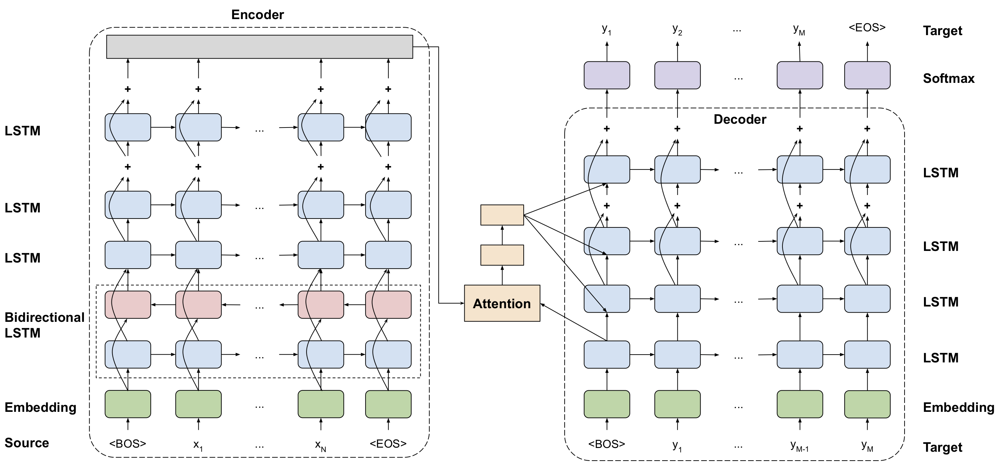
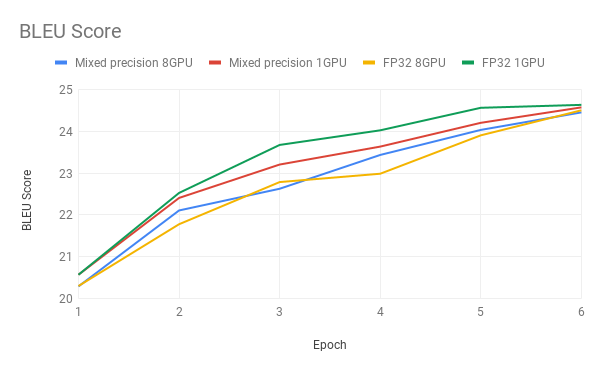

# GNMT v2 For TensorFlow

This repository provides a script and recipe to train the GNMT v2 model to achieve state of the art accuracy, and is tested and maintained by NVIDIA.

## Table Of Contents
- [Model overview](#model-overview)
    * [Model architecture](#model-architecture)
    * [Default configuration](#default-configuration)
    * [Feature support matrix](#feature-support-matrix)
        * [Features](#features)
    * [Mixed precision training](#mixed-precision-training)
        * [Enabling mixed precision](#enabling-mixed-precision)
- [Setup](#setup)
    * [Requirements](#requirements)
- [Quick Start Guide](#quick-start-guide)
- [Advanced](#advanced)
    * [Scripts and sample code](#scripts-and-sample-code)
    * [Parameters](#parameters)
    * [Command-line options](#command-line-options)
    * [Getting the data](#getting-the-data)
        * [Dataset guidelines](#dataset-guidelines)
    * [Training process](#training-process)
    * [Inference process](#inference-process)
        * [Validation process](#validation-process)
        * [Translation process](#translation-process)
- [Performance](#performance)
    * [Benchmarking](#benchmarking)
        * [Training performance benchmark](#training-performance-benchmark)
        * [Inference performance benchmark](#inference-performance-benchmark)
    * [Results](#results)
        * [Training accuracy results](#training-accuracy-results)
            * [Training accuracy: NVIDIA DGX-1 (8x V100 16G)](#training-accuracy-nvidia-dgx-1-(8x-v100-16G))
            * [Training stability test](#training-stability-test)
        * [Inference accuracy results](#inference-accuracy-results)
            * [Inference accuracy: NVIDIA DGX-1 (8x V100 16G)](#inference-accuracy-nvidia-dgx-1-(8x-v100-16G))
        * [Training performance results](#training-performance-results)
            * [Training performance: NVIDIA DGX-1 (8x V100 16G)](#training-performance-nvidia-dgx-1-(8x-v100-16G))
        * [Inference performance results](#inference-performance-results)
            * [Inference performance: NVIDIA T4](#inference-performance-nvidia-t4)
- [Release notes](#release-notes)
    * [Changelog](#changelog)
    * [Known issues](#known-issues)


## Model overview

The GNMT v2 model is similar to the one discussed in the [Google's Neural Machine
Translation System: Bridging the Gap between Human and Machine
Translation](https://arxiv.org/abs/1609.08144) paper.

The most important difference between the two models is in the attention
mechanism. In our model, the output from the first LSTM layer of the decoder
goes into the attention module, then the re-weighted context is concatenated
with inputs to all subsequent LSTM layers in the decoder at the current
timestep.

The same attention mechanism is also implemented in the default
GNMT-like models from
[TensorFlow Neural Machine Translation Tutorial](https://github.com/tensorflow/nmt)
and
[NVIDIA OpenSeq2Seq Toolkit](https://github.com/NVIDIA/OpenSeq2Seq).

This model is trained with mixed precision using Tensor Cores on NVIDIA Volta and Turing GPUs. Therefore, researchers can get results 2x faster than training without Tensor Cores, while experiencing the benefits of mixed precision training. This model is tested against each NGC monthly container release to ensure consistent accuracy and performance over time.

### Model architecture

The following image shows the GNMT model architecture:



### Default configuration

The following features were implemented in this model:

* general:
  * encoder and decoder are using shared embeddings
  * data-parallel multi-GPU training
  * dynamic loss scaling with backoff for Tensor Cores (mixed precision) training
  * trained with label smoothing loss (smoothing factor 0.1)

* encoder:
  * 4-layer LSTM, hidden size 1024, first layer is bidirectional, the rest are
    unidirectional
  * with residual connections starting from 3rd layer
  * dropout is applied on input to all LSTM layers, probability of dropout is
    set to 0.2
  * hidden state of LSTM layers is initialized with zeros
  * weights and bias of LSTM layers is initialized with uniform (-0.1, 0.1)
    Distribution

* decoder:
  * 4-layer unidirectional LSTM with hidden size 1024 and fully-connected
    classifier
  * with residual connections starting from 3rd layer
  * dropout is applied on input to all LSTM layers, probability of dropout is
    set to 0.2
  * hidden state of LSTM layers is initialized with the last hidden state from
    encoder
  * weights and bias of LSTM layers is initialized with uniform (-0.1, 0.1)
    distribution
  * weights and bias of fully-connected classifier is initialized with
    uniform (-0.1, 0.1) distribution

* attention:
  * normalized Bahdanau attention
  * output from first LSTM layer of decoder goes into attention,
  then re-weighted context is concatenated with the input to all subsequent
  LSTM layers of the decoder at the current timestep
  * linear transform of keys and queries is initialized with uniform (-0.1, 0.1), normalization scalar is initialized with 1.0 / sqrt(1024),     normalization bias is initialized with zero

* inference:
  * beam search with default beam size of 5
  * with coverage penalty and length normalization, coverage penalty factor is
    set to 0.1, length normalization factor is set to 0.6 and length
    normalization constant is set to 5.0
  * de-tokenized BLEU computed by [SacreBLEU](https://github.com/awslabs/sockeye/tree/master/sockeye_contrib/sacrebleu)
  * [motivation](https://github.com/awslabs/sockeye/tree/master/sockeye_contrib/sacrebleu#motivation) for choosing SacreBLEU

When comparing the BLEU score, there are various tokenization approaches and
BLEU calculation methodologies; therefore, ensure you align similar metrics.

Code from this repository can be used to train a larger, 8-layer GNMT v2 model.
Our experiments show that a 4-layer model is significantly faster to train and
yields comparable accuracy on the public
[WMT16 English-German](http://www.statmt.org/wmt16/translation-task.html)
dataset. The number of LSTM layers is controlled by the `--num_layers` parameter
in the `nmt.py` script.

### Feature support matrix

The following features are supported by this model.

| **Feature** | **GNMT TF** |
|:---:|:--------:|
| Automatic Mixed Precision | yes |


#### Features

The following features are supported by this model.

* Automatic Mixed Precision (TF-AMP) - enables mixed precision training without any changes to the code-base by performing automatic graph rewrites and loss scaling controlled by an environmental variable.


### Mixed precision training

Mixed precision is the combined use of different numerical precisions in a computational method. [Mixed precision](https://arxiv.org/abs/1710.03740) training offers significant computational speedup by performing operations in half-precision format, while storing minimal information in single-precision to retain as much information as possible in critical parts of the network. Since the introduction of [Tensor Cores](https://developer.nvidia.com/tensor-cores) in the Volta and Turing architecture, significant training speedups are experienced by switching to mixed precision -- up to 3x overall speedup on the most arithmetically intense model architectures. Using mixed precision training requires two steps:
1.  Porting the model to use the FP16 data type where appropriate.
2.  Adding loss scaling to preserve small gradient values.

The ability to train deep learning networks with lower precision was introduced in the Pascal architecture and first supported in [CUDA 8](https://devblogs.nvidia.com/parallelforall/tag/fp16/) in the NVIDIA Deep Learning SDK.

For information about:
-   How to train using mixed precision, see the [Mixed Precision Training](https://arxiv.org/abs/1710.03740) paper and [Training With Mixed Precision](https://docs.nvidia.com/deeplearning/sdk/mixed-precision-training/index.html) documentation.
-   Techniques used for mixed precision training, see the [Mixed-Precision Training of Deep Neural Networks](https://devblogs.nvidia.com/mixed-precision-training-deep-neural-networks/) blog.
-   How to access and enable AMP for TensorFlow, see [Using TF-AMP](https://docs.nvidia.com/deeplearning/dgx/tensorflow-user-guide/index.html#tfamp) from the TensorFlow User Guide.

#### Enabling mixed precision

To enable this feature inside the container, simply set a single environment variable:

```bash
export TF_ENABLE_AUTO_MIXED_PRECISION=1
```

As an alternative, the environment variable can be set inside the TensorFlow Python script:

```python
os.environ['TF_ENABLE_AUTO_MIXED_PRECISION'] = '1'
```

## Setup

The following section lists the requirements in order to start training the GNMT
v2 model.

### Requirements

This repository contains Dockerfile which extends the TensorFlow NGC container and encapsulates some dependencies. Aside from these dependencies, ensure you have the following components:
-   [NVIDIA Docker](https://github.com/NVIDIA/nvidia-docker)
-   [TensorFlow 19.07-py3 NGC container](https://ngc.nvidia.com/catalog/containers/nvidia:tensorflow)
-   [NVIDIA Volta](https://www.nvidia.com/en-us/data-center/volta-gpu-architecture/) or [Turing](https://www.nvidia.com/en-us/geforce/turing/) based GPU

For more information about how to get started with NGC containers, see the following sections from the NVIDIA GPU Cloud Documentation and the Deep Learning Documentation:
-   [Getting Started Using NVIDIA GPU Cloud](https://docs.nvidia.com/ngc/ngc-getting-started-guide/index.html)
-   [Accessing And Pulling From The NGC Container Registry](https://docs.nvidia.com/deeplearning/frameworks/user-guide/index.html#accessing_registry)
-   [Running TensorFlow](https://docs.nvidia.com/deeplearning/dgx/tensorflow-release-notes/running.html#running).

For those unable to use the TensorFlow NGC container, to set up the required environment or create your own container, see the versioned [NVIDIA Container Support Matrix](https://docs.nvidia.com/deeplearning/frameworks/support-matrix/index.html).


## Quick Start Guide

To train your model using mixed precision with Tensor Cores or using FP32,
perform the following steps using the default parameters of the GNMT v2 model
on the WMT16 English German dataset.

**1. Clone the repository.**
```
git clone https://github.com/NVIDIA/DeepLearningExamples
cd DeepLearningExamples/TensorFlow/Translation/GNMT
```

**2. Build the GNMT v2 TensorFlow container.**
```
bash scripts/docker/build.sh
```

**3. Start an interactive session in the NGC container to run.** training/inference.
```
bash scripts/docker/interactive.sh
```

**4. Download and preprocess the dataset.**

Data will be downloaded to the `data` directory (on the host). The `data`
directory is mounted to the `/workspace/gnmt/data` location in the Docker
container.
```
bash scripts/wmt16_en_de.sh
```

**5. Start training.**

All results and logs are saved to the `results` directory (on the host) or to
the `/workspace/gnmt/results` directory (in the container). The training script
saves the checkpoint after every training epoch and after every 2000 training steps
within each epoch. You can modify the results directory using the `--output_dir`
argument.


To launch mixed precision training on 1 GPU, run:

```
python nmt.py --output_dir=results --batch_size=128 --learning_rate=5e-4
```

To launch mixed precision training on 8 GPUs, run:

```
python nmt.py --output_dir=results --batch_size=1024 --num_gpus=8 --learning_rate=2e-3
```

To launch FP32 training on 1 GPU, run:

```
python nmt.py --output_dir=results --batch_size=128 --learning_rate=5e-4 --use_amp=false
```

To launch FP32 training on 8 GPUs, run:

```
python nmt.py --output_dir=results --batch_size=1024 --num_gpus=8 --learning_rate=2e-3 --use_amp=false
```

**6. Start evaluation.**

The training process automatically runs evaluation and outputs the BLEU score
after each training epoch. Additionally, after the training is done, you can
manually run inference on test dataset with the checkpoint saved during the
training.

To launch mixed precision inference on 1 GPU, run:

```
python nmt.py --output_dir=results --infer_batch_size=128 --mode=infer
```

To launch FP32 inference on 1 GPU, run:

```
python nmt.py --output_dir=results --infer_batch_size=128 --use_amp=false --mode=infer
```

**7. Start translation.**

After the training is done, you can translate custom sentences with the checkpoint saved during the training.

```bash
echo "The quick brown fox jumps over the lazy dog" >file.txt
python nmt.py --output_dir=results --mode=translate --translate-file=file.txt
cat file.txt.trans
```
```
Der schnelle braune Fuchs springt über den faulen Hund
```

## Advanced

The following sections provide greater details of the dataset, running training
and inference, and the training results.

### Scripts and sample code
In the root directory, the most important files are:

* `nmt.py`: serves as the entry point to launch the training
* `Dockerfile`: container with the basic set of dependencies to run GNMT v2
* `requirements.txt`: set of extra requirements for running GNMT v2
* `attention_wrapper.py`, `gnmt_model.py`, `model.py`: model definition
* `estimator.py`: functions for training and inference

In the `script` directory, the most important files are:
* `translate.py`: wrapped on `nmt.py` for benchmarking and running inference
* `parse_log.py`: script for retrieving information in JSON format from the training log
* `wmt16_en_de.sh`: script for downloading and preprocessing the dataset

In the `script/docker` directory, the files are:
* `build.sh`: script for building the GNMT container
* `interactive.sh`: script for running the GNMT container interactively

### Parameters

The most useful arguments are as follows:

```
  --learning_rate LEARNING_RATE
                        Learning rate.
  --warmup_steps WARMUP_STEPS
                        How many steps we inverse-decay learning.
  --max_train_epochs MAX_TRAIN_EPOCHS
                        Max number of epochs.
  --target_bleu TARGET_BLEU
                        Target bleu.
  --data_dir DATA_DIR   Training/eval data directory.
  --translate_file TRANSLATE_FILE
                        File to translate, works only with translate mode
  --output_dir OUTPUT_DIR
                        Store log/model files.
  --batch_size BATCH_SIZE
                        Total batch size.
  --log_step_count_steps LOG_STEP_COUNT_STEPS
                        The frequency, in number of global steps, that the
                        global step and the loss will be logged during training
  --num_gpus NUM_GPUS   Number of gpus in each worker.
  --random_seed RANDOM_SEED
                        Random seed (>0, set a specific seed).
  --ckpt CKPT           Checkpoint file to load a model for inference.
                        (defaults to newest checkpoint)
  --infer_batch_size INFER_BATCH_SIZE
                        Batch size for inference mode.
  --beam_width BEAM_WIDTH
                        beam width when using beam search decoder. If 0, use
                        standard decoder with greedy helper.
  --use_amp USE_AMP     use_amp for training and inference
  --mode {train_and_eval,infer,translate}
```

### Command-line options

To see the full list of available options and their descriptions, use the `-h`
or `--help` command line option, for example:

```
python nmt.py --help
```


### Getting the data

The GNMT v2 model was trained on the
[WMT16 English-German](http://www.statmt.org/wmt16/translation-task.html)
dataset and newstest2014 is used as a testing dataset.

This repository contains the `scripts/wmt16_en_de.sh` download script which
automatically downloads and preprocesses the training and test datasets. By
default, data is downloaded to the `data` directory.

Our download script is very similar to the `wmt16_en_de.sh` script from the
[tensorflow/nmt](https://github.com/tensorflow/nmt/blob/master/nmt/scripts/wmt16_en_de.sh)
repository. Our download script contains an extra preprocessing step, which
discards all pairs of sentences which can't be decoded by latin-1 encoder.
The `scripts/wmt16_en_de.sh` script uses the
[subword-nmt](https://github.com/rsennrich/subword-nmt)
package to segment text into subword units (Byte Pair Encodings - [BPE](https://en.wikipedia.org/wiki/Byte_pair_encoding)). By default, the script builds
the shared vocabulary of 32,000 tokens.

In order to test with other datasets, the scripts need to be customized accordingly.

#### Dataset guidelines

The process of downloading and preprocessing the data can be found in the
`scripts/wmt16_en_de.sh` script.

Initially, data is downloaded from [www.statmt.org](www.statmt.org). Then, `europarl-v7`,
`commoncrawl` and `news-commentary` corpora are concatenated to form the
training dataset, similarly `newstest2015` and `newstest2016` are concatenated
to form the validation dataset. Raw data is preprocessed with
[Moses](https://github.com/moses-smt/mosesdecoder), first by launching [Moses
tokenizer](https://github.com/moses-smt/mosesdecoder/blob/master/scripts/tokenizer/tokenizer.perl)
(tokenizer breaks up text into individual words), then by launching
[clean-corpus-n.perl](https://github.com/moses-smt/mosesdecoder/blob/master/scripts/training/clean-corpus-n.perl)
which removes invalid sentences and does initial filtering by sequence length.

Second stage of preprocessing is done by launching the
`scripts/filter_dataset.py` script, which discards all pairs of sentences that
can't be decoded by latin-1 encoder.

Third state of preprocessing uses the
[subword-nmt](https://github.com/rsennrich/subword-nmt) package. First it
builds shared [byte pair
encoding](https://en.wikipedia.org/wiki/Byte_pair_encoding) vocabulary with
32,000 merge operations (command `subword-nmt learn-bpe`), then it applies
generated vocabulary to training, validation and test corpora (command
`subword-nmt apply-bpe`).


### Training process

The training configuration can be launched by running the `nmt.py` script.
By default, the training script saves the checkpoint after every training epoch
and after every 2000 training steps within each epoch.
Results are stored in the `results` directory.

The training script launches data-parallel training on multiple GPUs. We have
tested reliance on up to 8 GPUs on a single node.

After each training epoch, the script runs an evaluation and outputs a BLEU
score on the test dataset (*newstest2014*). BLEU is computed by the
[SacreBLEU](https://github.com/awslabs/sockeye/tree/master/sockeye_contrib/sacrebleu)
package. Logs from the training and evaluation are saved to the `results`
directory.

The training script automatically runs testing after each training epoch. The
results from the testing are printed to the standard output and saved to the
log files.

The summary after each training epoch is printed in the following format:

```
training time for epoch 1: 29.37 mins (2918.36 sent/sec, 139640.48 tokens/sec)
[...]
bleu is 20.50000
eval time for epoch 1: 1.57 mins (78.48 sent/sec, 4283.88 tokens/sec)
```
The BLEU score is computed on the test dataset.
Performance is reported in total sentences per second and in total tokens per
second. The performance result is averaged over an entire training epoch and
summed over all GPUs participating in the training.


To view all available options for training, run `python nmt.py --help`.

### Inference process

Validation and translation can be run by launching the `nmt.py` script, although, it requires a
pre-trained model checkpoint and tokenized input (for validation) and  non-tokenized input (for translation).

#### Validation process

The `nmt.py` script, supports batched validation (`--mode=infer` flag). By
default, it launches beam search with beam size of 5, coverage penalty term and
length normalization term. Greedy decoding can be enabled by setting the
`--beam_width=1` flag for the `nmt.py` inference script. To control the
batch size use the `--infer_batch_size` flag.

To view all available options for validation, run `python nmt.py --help`.

#### Translation process

The `nmt.py` script, supports batched translation (`--mode=translate` flag). By
default, it launches beam search with beam size of 5, coverage penalty term and
length normalization term. Greedy decoding can be enabled by setting the
`--beam_width=1` flag for the `nmt.py` prediction script. To control the
batch size use the `--infer_batch_size` flag.

The input file may contain many sentences, each on a new line. The file can be specified
by the `--translate_file <file>` flag. This script will create a new file called `<file>.trans`,
with translation of the input file.

To view all available options for translation, run `python nmt.py --help`.


## Performance

### Benchmarking

The following section shows how to run benchmarks measuring the model performance in training and inference modes.

#### Training performance benchmark

To benchmark training performance, run:

* `python nmt.py --output_dir=results --max_train_epochs=1 --num_gpus <num GPUs> --batch_size <total batch size>` for mixed precision
* `python nmt.py --output_dir=results --max_train_epochs=1 --num_gpus <num GPUs> --batch_size <total batch size> --use_amp=false` for FP32


The log file will contain training performance in the following format:

```
training time for epoch 1: 25.75 mins (3625.19 sent/sec, 173461.27 tokens/sec)
```

#### Inference performance benchmark

To benchmark inference performance, run the `scripts/translate.py` script:

* For FP32:
    `python scripts/translate.py --output_dir=/path/to/trained/model --use_amp=false --beam_width <comma separated beam widths> --infer_batch_size <comma separated batch sizes>`

* For mixed precision
    `python scripts/translate.py --output_dir=/path/to/trained/model --beam_width <comma separated beam widths> --infer_batch_size <comma separated batch sizes>`

The benchmark requires a checkpoint from a fully trained model.

### Results

The following sections provide details on how we achieved our performance and
accuracy in training and inference.


#### Training accuracy results

##### Training accuracy: NVIDIA DGX-1 (8x V100 16G)

Our results were obtained by running the `nmt.py` script in the
tensorflow-19.07-py3 NGC container on NVIDIA DGX-1 with (8x V100 16G)  GPUs.

| **GPUs** | **Batch size / GPU** |**Accuracy - mixed precision (BLEU)** | **Accuracy - FP32 (BLEU)** | **Time to train - mixed precision** | **Time to train - FP32** | **Time to train speedup (FP32 to mixed precision)** |
| --- | --- | ----- | ----- | -------- | -------- | ---- |
|  1  | 128 | 24.90 | 24.84 | 763 min  | 1237 min | 1.62 |
|  8  | 128 | 24.33 | 24.34 | 168 min  | 237 min  | 1.41 |


In the following plot, the BLEU scores after each training epoch for different
configurations are displayed.




##### Training stability test

The GNMT v2 model was trained for 6 epochs, starting from 6 different initial
random seeds. After each training epoch, the model was evaluated on the test
dataset and the BLEU score was recorded. The training was performed in the
tensorflow-19.07-py3 NGC container on NVIDIA DGX-1 with 8 Tesla V100 16G GPUs.

In the following table, the BLEU scores after each training epoch for different
initial random seeds are displayed.

| **Epoch** | **Average** | **Standard deviation** | **Minimum** | **Maximum** | **Median** |
| --- | ------ | ----- | ------ | ------ | ------ |
|  1  | 20.365 | 0.096 | 20.200 | 20.480 | 20.385 |
|  2  | 22.002 | 0.080 | 21.900 | 22.110 | 22.000 |
|  3  | 22.793 | 0.078 | 22.690 | 22.890 | 22.790 |
|  4  | 23.220 | 0.160 | 22.890 | 23.360 | 23.260 |
|  5  | 24.007 | 0.153 | 23.870 | 24.220 | 23.925 |
|  6  | 24.362 | 0.167 | 24.210 | 24.710 | 24.310 |


#### Inference accuracy results

##### Inference accuracy: NVIDIA DGX-1 (8x V100 16G)

Our results were obtained by running the `scripts/translate.py` script in the tensorflow-19.07-py3 NGC container on NVIDIA DGX-1 8x V100 16G GPUs.

* For mixed precision: `python scripts/translate.py --output_dir=/path/to/trained/model --beam_width 1,2,5 --infer_batch_size 128`

* For FP32: `python scripts/translate.py --output_dir=/path/to/trained/model --beam_width 1,2,5 --infer_batch_size 128 --use_amp=false`

| **Batch size** | **Beam size** | **Mixed precision BLEU** | **FP32 BLEU** |
|:---:|:---:|:---:|:---:|
|128|1|23.80|23.80|
|128|2|24.58|24.59|
|128|5|25.10|25.09|

#### Training performance results

##### Training performance: NVIDIA DGX-1 (8x V100 16G)

Our results were obtained by running the `nmt.py` script in the tensorflow-19.07-py3 NGC container on NVIDIA DGX-1 with 8x V100 16G GPUs.
Performance numbers (in tokens per second) were averaged over an entire
training epoch.

| **GPUs** | **Batch size / GPU** | **Throughput - mixed precision (tokens/s)** | **Throughput - FP32 (tokens/s)** | **Throughput speedup (FP32 - mixed precision)** | **Weak scaling - mixed precision** | **Weak scaling - FP32** |
| --- | --- | ------- | ------ | ---- | ---- | ---- |
|  1  | 128 | 23 011  | 14 106 | 1.63 | 1.00 | 1.00 |
|  8  | 128 | 138 106 | 93 688 | 1.47 | 6.00 | 6.64 |

To achieve these same results, follow the [Quick Start Guide](#quick-start-guide)
outlined above.

#### Inference performance results

The benchmark requires a checkpoint from a fully trained model.

To launch the inference benchmark in mixed precision on 1 GPU, run:

```
python scripts/translate.py --output_dir=/path/to/trained/model --beam_width 1,2,5 --infer_batch_size 1,2,4,8,32,128,512
```

To launch the inference benchmark in FP32 on 1 GPU, run:

```
python scripts/translate.py --output_dir=/path/to/trained/model --beam_width 1,2,5 --infer_batch_size 1,2,4,8,32,128,512 --use_amp=false
```

To achieve these same results, follow the [Quick Start Guide](#quick-start-guide)
outlined above.

##### Inference performance: NVIDIA T4

Our results were obtained by running the `scripts/translate.py` script in the tensorflow-19.07-py3 NGC container on NVIDIA T4.

Reported mixed precision speedups are relative to FP32 numbers for corresponding configuration.

| **Batch size** | **Beam size** | **Mixed precision tokens/s** | **Speedup** | **Mixed precision average latency (ms)** | **Average latency speedup** | **Mixed precision latency 50% (ms)** | **Latency 50% speedup** | **Mixed precision latency 90% (ms)** | **Latency 90% speedup** | **Mixed precision latency 95% (ms)** | **Latency 95% speedup** | **Mixed precision latency 99% (ms)** | **Latency 99% speedup** | **Mixed precision latency 100% (ms)** | **Latency 100% speedup** |
| :---: | :---: | :---: | :---: | :---: | :---: | :---: | :---: | :---: | :---: | :---: | :---: | :---: | :---: | :---: | :---: |
| 1     | 1     | 643   | 1.278 | 84    | 1.278 | 78    | 1.279 | 138   | 1.309 | 154   | 1.312 | 180   | 1.304 | 220   | 1.296 |
| 1     | 2     | 584   | 1.693 | 92    | 1.692 | 86    | 1.686 | 150   | 1.743 | 168   | 1.737 | 201   | 1.770 | 236   | 1.742 |
| 1     | 5     | 552   | 1.702 | 97    | 1.701 | 90    | 1.696 | 158   | 1.746 | 176   | 1.738 | 218   | 1.769 | 244   | 1.742 |
| 2     | 1     | 948   | 1.776 | 114   | 1.776 | 108   | 1.769 | 170   | 1.803 | 184   | 1.807 | 218   | 1.783 | 241   | 1.794 |
| 2     | 2     | 912   | 1.761 | 118   | 1.760 | 112   | 1.763 | 175   | 1.776 | 192   | 1.781 | 226   | 1.770 | 246   | 1.776 |
| 2     | 5     | 832   | 1.900 | 128   | 1.900 | 121   | 1.910 | 192   | 1.912 | 214   | 1.922 | 258   | 1.922 | 266   | 1.905 |
| 4     | 1     | 1596  | 1.792 | 135   | 1.792 | 132   | 1.791 | 187   | 1.799 | 197   | 1.815 | 241   | 1.784 | 245   | 1.796 |
| 4     | 2     | 1495  | 1.928 | 144   | 1.927 | 141   | 1.926 | 201   | 1.927 | 216   | 1.936 | 250   | 1.956 | 264   | 1.890 |
| 4     | 5     | 1308  | 1.702 | 164   | 1.702 | 159   | 1.702 | 230   | 1.722 | 251   | 1.742 | 283   | 1.708 | 288   | 1.699 |
| 8     | 1     | 2720  | 1.981 | 159   | 1.981 | 158   | 1.992 | 204   | 1.975 | 219   | 1.986 | 249   | 1.987 | 252   | 1.966 |
| 8     | 2     | 2554  | 1.809 | 169   | 1.808 | 168   | 1.829 | 224   | 1.797 | 237   | 1.783 | 260   | 1.807 | 262   | 1.802 |
| 8     | 5     | 1979  | 1.768 | 216   | 1.768 | 213   | 1.780 | 292   | 1.797 | 319   | 1.793 | 334   | 1.760 | 336   | 1.769 |
| 32    | 1     | 7449  | 1.775 | 232   | 1.774 | 231   | 1.777 | 292   | 1.789 | 300   | 1.760 | 301   | 1.768 | 301   | 1.768 |
| 32    | 2     | 5569  | 1.670 | 309   | 1.669 | 311   | 1.672 | 389   | 1.652 | 392   | 1.665 | 401   | 1.651 | 404   | 1.644 |
| 32    | 5     | 3079  | 1.867 | 556   | 1.867 | 555   | 1.865 | 692   | 1.858 | 695   | 1.860 | 702   | 1.847 | 703   | 1.847 |
| 128   | 1     | 12986 | 1.662 | 532   | 1.662 | 529   | 1.667 | 607   | 1.643 | 608   | 1.645 | 609   | 1.647 | 609   | 1.647 |
| 128   | 2     | 7856  | 1.734 | 878   | 1.734 | 911   | 1.755 | 966   | 1.742 | 967   | 1.741 | 968   | 1.744 | 968   | 1.744 |
| 128   | 5     | 3361  | 1.683 | 2036  | 1.682 | 2186  | 1.678 | 2210  | 1.673 | 2210  | 1.674 | 2211  | 1.674 | 2211  | 1.674 |
| 512   | 1     | 14932 | 1.825 | 1851  | 1.825 | 1889  | 1.808 | 1927  | 1.801 | 1928  | 1.800 | 1929  | 1.800 | 1930  | 1.799 |
| 512   | 2     | 8109  | 1.786 | 3400  | 1.786 | 3505  | 1.783 | 3520  | 1.782 | 3523  | 1.781 | 3525  | 1.781 | 3525  | 1.781 |
| 512   | 5     | 3370  | 1.802 | 8123  | 1.801 | 8376  | 1.798 | 8391  | 1.804 | 8394  | 1.804 | 8396  | 1.805 | 8397  | 1.805 |


## Release notes

### Changelog
1. Mar 18, 2019
  * Initial release
2. June, 2019
  * Performance improvements

### Known issues
There are no known issues in this release.
