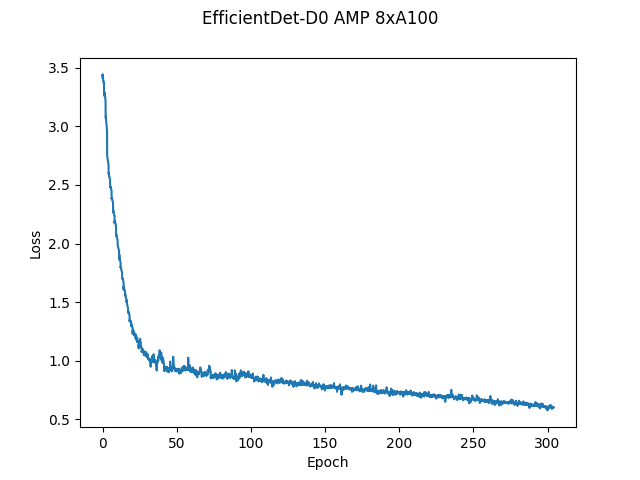

# EfficientDet-D0 For TensorFlow 2
This repository provides scripts and recipes to train and infer EfficientDet-D0 to achieve state-of-the-art accuracy and is tested and maintained by NVIDIA.
 
## Table Of Contents
* [Model overview](#model-overview)
  * [Model Architecture](#model-architecture)
  * [Feature support matrix](#feature-support-matrix)
    * [Features](#features)
  * [Mixed precision training](#mixed-precision-training)
    * [Enabling mixed precision](#enabling-mixed-precision)
    * [Enabling TF32](#enabling-tf32)
* [Setup](#setup)
  * [Requirements](#requirements)
* [Quick start guide](#quick-start-guide)
* [Advanced](#advanced)
  * [Command-line arguments](#command-line-arguments)
  * [Getting the data](#getting-the-data)
    * [Dataset guidelines](#dataset-guidelines)
  * [Training process](#training-process)
* [Performance](#performance)
  * [Benchmarking](#benchmarking)
    * [Training performance benchmark](#training-performance-benchmark)
    * [Inference performance benchmark](#inference-performance-benchmark)
  * [Results](#results)
    * [Training accuracy results](#training-accuracy-results)
      * [Training accuracy: NVIDIA DGX A100 (8x A100 80GB)](#training-accuracy-nvidia-dgx-a100-8x-a100-80gb)  
      * [Training accuracy: NVIDIA DGX-1 (8x V100 32GB)](#training-accuracy-nvidia-dgx-1-8x-v100-32gb)
      * [Training accuracy: NVIDIA DGX-1 (32x V100 32GB)](#training-accuracy-nvidia-dgx-1-32x-v100-32gb)
      * [Training loss curves](#training-loss-curves)
      * [Training stability test](#training-stability-test)
    * [Training performance results](#training-performance-results)
      * [Training performance: NVIDIA DGX A100 (8x A100 80GB)](#training-performance-nvidia-dgx-a100-8x-a100-80gb)
      * [Training performance: NVIDIA DGX-1 (8x V100 32GB)](#training-performance-nvidia-dgx-1-8x-v100-32gb)
    * [Inference performance results](#inference-performance-results)
      * [Inference performance: NVIDIA DGX A100 (1x A100 80GB)](#inference-performance-nvidia-dgx-a100-1x-a100-80gb)
      * [Inference performance: NVIDIA DGX-1 (1x V100 32GB)](#inference-performance-nvidia-dgx-1-1x-v100-32gb)
* [Release notes](#release-notes)
  * [Changelog](#changelog)
  * [Known issues](#known-issues)
 
## Model overview
 
EfficientDet is a family of convolution-based neural networks for object detection. Specifically, this repository covers model D0. This model is based on [EfficientDet: Scalable and Efficient Object Detection](https://arxiv.org/abs/1911.09070). NVIDIA's implementation of EfficientDet-D0 is an optimized version of [TensorFlow Automl](https://github.com/google/automl/tree/master/efficientdet) implementation, leveraging mixed precision arithmetic on NVIDIA Volta, NVIDIA Turing, and the NVIDIA Ampere GPU architectures for faster training times while maintaining target accuracy.
 
The EfficientDet model covered in this repository is tested against each NGC monthly released container to ensure consistent accuracy and performance over time.
 
The major differences between the official implementation of the paper and our version of EfficientDet are as follows:
  - Automatic mixed precision (AMP) training support
  - Multi-node training support using [Horovod](https://github.com/horovod/horovod)
  - XLA enabled for better performance
  - Lightweight logging using [dllogger](https://github.com/NVIDIA/dllogger)
  - [EfficientNet backbone](https://github.com/NVIDIA/DeepLearningExamples/tree/master/TensorFlow2/Classification/ConvNets/efficientnet) implemented by NVIDIA
  - Use [BatchNormalization](https://www.tensorflow.org/api_docs/python/tf/keras/layers/BatchNormalization) instead of [SyncBatchNormalization](https://www.tensorflow.org/api_docs/python/tf/keras/layers/experimental/SyncBatchNormalization) for better performance
 
These techniques/optimizations improve model performance and reduce training time, allowing you to perform more efficient object detection with no additional effort.

Other publicly available implementations of EfficientDet include:

  - [Google's automl](https://github.com/google/automl/tree/master/efficientdet)
  - [PyTorch version](https://github.com/NVIDIA/DeepLearningExamples/tree/master/PyTorch/Detection/Efficientdet)
 
### Model architecture
 
EfficientDet is a one-stage detector with the following architecture components:
- ImageNet-pretrained EfficientNet backbone
- Weighted bi-directional feature pyramid network (BiFPN)
- Bounding and classification box head
- A compound scaling method that uniformly scales the resolution, depth, and width for all backbone, feature network, and box/class prediction networks at the same time
 
### Feature support matrix
 
The model supports the following features.  
 
| **Feature** | **EfficientDet** |
|:---------:|:----------:|
|Horovod Multi-GPU training (NCCL)|Yes|
|Multi-GPU training|Yes|
|Multi-node training|Yes|
|XLA|Yes|
|AMP (Automatic Mixed Precision)|Yes|

#### Features

Horovod is used to implement efficient multi-GPU training with NCCL. It is also used for multi-node training. For details, refer to example sources in this repository or refer to the [TensorFlow tutorial](https://github.com/horovod/horovod/#usage).

AMP or Automatic Mixed Precision modifies computation graphs during runtime to support mixed precision training. A detailed explanation of mixed precision can be found below.
  
### Automatic Mixed Precision

Mixed precision is the combined use of different numerical precisions in a computational method. [Mixed precision](https://arxiv.org/abs/1710.03740) training offers significant computational speedup by performing operations in half-precision format while storing minimal information in single-precision to retain as much information as possible in critical parts of the network. Since the introduction of [Tensor Cores](https://developer.nvidia.com/tensor-cores) in NVIDIA Volta, and following with both the NVIDIA Turing and NVIDIA Ampere Architectures, significant training speedups are experienced by switching to mixed precision -- up to 3x overall speedup on the most arithmetically intense model architectures. Using [mixed precision training](https://docs.nvidia.com/deeplearning/performance/mixed-precision-training/index.html) previously required two steps:
1.  Porting the model to use the FP16 data type where appropriate.    
2.  Adding loss scaling to preserve small gradient values.

This can now be achieved using Automatic Mixed Precision (AMP) for TensorFlow to enable the full [mixed precision methodology](https://docs.nvidia.com/deeplearning/sdk/mixed-precision-training/index.html#tensorflow) in your existing TensorFlow model code.  AMP enables mixed precision training on NVIDIA Volta, NVIDIA Turing, and NVIDIA Ampere GPU architectures automatically. The TensorFlow framework code makes all necessary model changes internally.

In TF-AMP, the computational graph is optimized to use as few casts as necessary and maximize the use of FP16. The loss scaling is automatically applied inside of supported optimizers. AMP can be configured to work with the existing tf.contrib loss scaling manager by disabling the AMP scaling with a single environment variable to perform only the automatic mixed-precision optimization. It accomplishes this by automatically rewriting all computation graphs with the necessary operations to enable mixed precision training and automatic loss scaling.

For information about:
-   How to train using mixed precision, refer to the [Mixed Precision Training](https://arxiv.org/abs/1710.03740) paper and [Training With Mixed Precision](https://docs.nvidia.com/deeplearning/performance/mixed-precision-training/index.html) documentation.
-   Techniques used for mixed precision training, refer to the [Mixed-Precision Training of Deep Neural Networks](https://devblogs.nvidia.com/mixed-precision-training-deep-neural-networks/) blog.
-   How to access and enable AMP for TensorFlow, refer to [Using TF-AMP](https://docs.nvidia.com/deeplearning/dgx/tensorflow-user-guide/index.html#tfamp) from the TensorFlow User Guide.


#### Enabling AMP

Mixed precision is enabled in TensorFlow by using the Automatic Mixed Precision (TF-AMP) extension which casts variables to half-precision upon retrieval while storing variables in single-precision format. Furthermore, to preserve small gradient magnitudes in backpropagation, a [loss scaling](https://docs.nvidia.com/deeplearning/sdk/mixed-precision-training/index.html#lossscaling) step must be included when applying gradients. 

In TensorFlow, loss scaling can be applied statically by using simple multiplication of loss by a constant value or automatically, by TF-AMP. Automatic mixed precision makes all the adjustments internally in TensorFlow, providing two benefits over manual operations. First, programmers need not modify network model code, reducing development and maintenance effort. Second, using AMP maintains forward and backward compatibility with all the APIs for defining and running TensorFlow models.

To enable mixed precision,  you can simply add `--amp=True` to the training command. This will enable the following code:

```
policy = tf.keras.mixed_precision.experimental.Policy('mixed_float16', loss_scale='dynamic')
tf.keras.mixed_precision.experimental.set_policy(policy)
```

### TensorFloat-32 (TF32) Compute Mode

TensorFloat-32 (TF32) is the new math mode in [NVIDIA A100](https://www.nvidia.com/en-us/data-center/a100/) GPUs for handling the matrix math, also called tensor operations. TF32 running on Tensor Cores in A100 GPUs can provide up to 10x speedups compared to single-precision floating-point math (FP32) on Volta GPUs. 

TF32 Tensor Cores can speed up networks using FP32, typically with no loss of accuracy. It is more robust than FP16 for models which require a high dynamic range for weights or activations.

For more information, refer to the [TensorFloat-32 in the A100 GPU Accelerates AI Training, HPC up to 20x](https://blogs.nvidia.com/blog/2020/05/14/tensorfloat-32-precision-format/) blog post.

TF32 is supported in the NVIDIA Ampere GPU architecture and is enabled by default.
 
 
## Setup
The following sections list the requirements in order to start training the EfficientDet model.
 
### Requirements
 
This repository contains a `Dockerfile` that extends the TensorFlow NGC container and encapsulates some dependencies.  Aside from these dependencies, ensure you have the following components:
  - [NVIDIA Docker](https://github.com/NVIDIA/nvidia-docker)
  - [TensorFlow 22.03-tf2-py3 NGC container or later](https://ngc.nvidia.com/catalog/containers/nvidia:tensorflow)
  - Supported GPUs:
    - [NVIDIA Volta architecture: 32GB](https://www.nvidia.com/en-us/data-center/volta-gpu-architecture/)
    - [NVIDIA Turing architecture](https://www.nvidia.com/en-us/geforce/turing/)
    - [NVIDIA Ampere architecture: 80GB](https://www.nvidia.com/en-us/data-center/nvidia-ampere-gpu-architecture/)
 
  For more information about how to get started with NGC containers, refer to the
  following sections from the NVIDIA GPU Cloud Documentation and the Deep Learning
  Documentation:
  - [Getting Started Using NVIDIA GPU Cloud](https://docs.nvidia.com/ngc/ngc-getting-started-guide/index.html)
  - [Accessing And Pulling From The NGC Container Registry](https://docs.nvidia.com/deeplearning/dgx/user-guide/index.html#accessing_registry)
  - [Running TensorFlow](https://docs.nvidia.com/deeplearning/frameworks/tensorflow-release-notes/running.html#running)
 
For those unable to use the TensorFlow NGC container, to set up the required environment or create your own container, refer to the versioned [NVIDIA Container Support Matrix](https://docs.nvidia.com/deeplearning/frameworks/support-matrix/index.html).
 
For multi-node, the sample provided in this repository requires [Enroot](https://github.com/NVIDIA/enroot) and [Pyxis](https://github.com/NVIDIA/pyxis) to be set up on a [SLURM](https://slurm.schedmd.com) cluster.

## Quick Start Guide
To train your model using mixed or TF32 precision with Tensor Cores or using FP32, perform the following steps using the default parameters of the EfficientDet on the COCO 2017 dataset. For the specifics concerning training and inference, refer to the [Advanced](#advanced) section.
 
 
### 1. Clone the repository
```
git clone https://github.com/NVIDIA/DeepLearningExamples.git
cd DeepLearningExamples/Tensorflow2/Detection/EfficientDet
```

### 2. Download and preprocess the dataset

To download COCO 2017 images and annotations and convert them to tfrecords, run the script as follows:
```bash
bash dataset/get_coco.sh
```

By default, the data is organized into the following structure:
```
</workspace/coco/>
  train-*****-of-00256.tfrecord
  val-*****-of-00032.tfrecord
```

### 3. Build the EfficientDet PyTorch NGC container
```
bash scripts/docker/build.sh
```

### 4. Start an interactive session in the NGC container to run training/inference
After you build the container image, you can start an interactive CLI session with  
```
DATA=<path to coco tfrecords> BACKBONE_CKPT=<path to pretrained efficientnet checkpoint> bash scripts/docker/interactive.sh
```
Note: The `interactive.sh` script requires the location of the dataset and the pretrained checkpoint to be passed.

### 5. Start training
```
bash ./scripts/D0/convergence-{AMP, FP32, TF32}-{8, 32}x{V100-32G, A100-80G}.sh
```
The training scripts train EfficientDet-D0 and perform an evaluation on the COCO 2017 dataset. By default, the training script runs training on standard configuration (DGX A100/DGX-1 V100, AMP/FP32/TF32, 300 epochs). Run one of the scripts in `scripts/D0` directory using `bash scripts/D0/convergence-{AMP, FP32, TF32}-{8, 32}x{V100-32G, A100-80G}.sh`. Ensure COCO-2017 tfrecords are mounted to `/workspace/coco` and EfficientNet-B0 backbone weights are mounted to `/workspace/checkpoints`. The backbone checkpoint can be downloaded from [this](https://catalog.ngc.nvidia.com/orgs/nvidia/teams/dle/models/efficientnet_tf2_savedmodel_nohead_b0_amp_cosine) location.

After training, the logs are present in the model directory where the data is organized in the following structure:
```
</tmp/convergence-{AMP, FP32, TF32}-{8, 32}x{V100-32G, A100-80G}>
  ema_weights                           *contains the ema checkpoints of the model, checkpointed after every 10 epochs of training*
    checkpoint
    emackpt-10.data-00000-of-00001
    emackpt-10.index
    emackpt-20.data-00000-of-00001
    emackpt-20.index
    ...
    emackpt-300.data-00000-of-00001
    emackpt-300.index
  emackpt-final                         *final savedmodel with ema weights which can be used for inference*
    assets
    variables
      variables.data-00000-of-00001
      variables.index
    keras_metadata.pb
    saved_model.pb
  train *tensorboard logs*
    events.out.tfevents.*
  checkpoint
  ckpt.data-00000-of-00001
  ckpt.index
  ckpt-final.data-00000-of-00001
  ckpt-final.index
  time_log.txt                          *dllogger logs*
  train-<time_stamp>.log                *training log file*
```

### 6. Start validation/evaluation

To run validation/evaluation for a standard configuration (DGX A100/DGX-1 V100, AMP/TF32/FP32, EfficientDet-D0),
run one of the evaluation scripts in `scripts/D0` directory using `bash scripts/D0/evaluate-{AMP, FP32, TF32}-{8, 32}x{A100-80G, V100-32G}.sh`.
The script requires:
  - `CKPT` is the path to the checkpoint that needs to be evaluated. For example, `CKPT=/tmp/convergence-AMP-8xA100-80G/ema_weights/emackpt-300`

Evaluation command:
```bash
CKPT=<path to checkpoint> bash ./scripts/D0/evaluate-{AMP, FP32, TF32}-{8, 32}x{A100-80G, V100-32G}.sh
```

Ensure COCO-2017 is mounted in `/workspace/coco`.

### 7. Inference benchmark

Inference loop can be benchmarked by running the `scripts/D0/inference-benchmark.sh` script. The script requires:
  - batch size to use for inference `BS`. For example, `BS=128`
  - Boolean to enable/disable `AMP` (Automatic Mixed Precision)

Inference benchmark command:
```bash
BS=<batch size> AMP=<True/False for Automatic Mixed Precision> bash scripts/D0/inference-benchmark.sh
```

### 8. Inference/Prediction

Model predictions can be obtained by running the `scripts/D0/inference.sh` script. This script reads a test image and annotates the image after object detection by drawing boxes on the objects in the image. The script requires:
  - `MODEL_DIR` in which the file `checkpoint` contains path to the latest checkpoint that needs to be used for inference. For example, `MODEL_DIR=/tmp/convergence-AMP-8xA100-80G/ema_weights`

Inference command:
```bash
MODEL_DIR=<path to trained model directory> bash scripts/D0/inference.sh
```

Note that the above script assumes that the test image is present in `testdata` and is named `img1.jpg`.

## Advanced
The following sections provide greater details of the dataset, running training and inference, and the training results.
 
### Scripts and sample code
 
Descriptions of the key scripts and folders are provided below.
 
-   `model` and `object_detection` - Contains code to build individual components of the model such as backbone, FPN, RPN, classification and bbox heads, and so on.
-   data - Contains code to convert raw data to tfrecords
-   dataset - Contains code to build the data pipeline such as dataloader, transforms, dataset builder.
-   scripts/ - Contains shell scripts to launch training and evaluation of the model and perform inference.

    -   D0/convergence-{AMP, TF32, FP32}-{8, 32}x{V100-32G, A100-80G}.sh - Launches model training
      
  	-   D0/evaluate-{AMP, FP32, TF32}-{8, 32}x{A100-80G, V100-32G}.sh  - Performs inference and computes mAP of predictions.

    -   D0/inference.sh - Performs inference on an image

    -   D0/training-benchmark-{AMP, TF32, FP32}-{V100-32G, A100-80G}.sh - Launches model training for 500 iterations to benchmark training

    -   D0/inference-benchmark.sh - Benchmarks inference
  
  	-   docker/ - Scripts to build the docker image and to start an interactive session
    
-   utils/
    - Contains utility components like default hyper parameters, checkpoint utils, training utils, and so on.

- train.py - End to end to script to load data, build and train the model.
- eval.py - End to end script to load data and checkpoint to perform inference and compute mAP scores.
 
 
### Parameters

#### train.py script parameters

Important parameters for training are listed below with defaults.

  
### Command-line options
 
To display the full list of available options and their descriptions, use the --helpshort command-line option:

```
  --amp:                Enable mixed precision training
  --backbone_init:      Initialize backbone weights from 
                        checkpoint in this directory
  --batch_size:         training local batch size
  --benchmark:          Train for a fixed number of steps for performance
  --benchmark_steps:    Train for these many steps to benchmark training
    performance
  --checkpoint_period:  Save ema model weights after every X epochs for eval
  --debug:              Enable debug mode
  --enable_map_parallelization: 
                        Parallelize stateless map transformations in dataloader
  --eval_samples:       The number of samples for evaluation.
  --hparams:            Comma separated k=v pairs of hyperparameters or a module 
                        containing attributes to use as hyperparameters
  --log_filename:       Filename for dllogger logs
  --log_steps:          Interval of steps between logging of batch level stats
  --lr:                 Learning rate
  --lr_tb:              Log learning rate at each step to TB
  --training_mode:      Training mode (train/traineval/train300)
  --model_dir:          Location of model_dir
  --model_name:         Model name
  --num_epochs:         Number of epochs for training
  --num_examples_per_epoch: 
                        Number of examples in one epoch (coco is 117266).
                        Default is 120000.
  --pretrained_ckpt: Start training from this EfficientDet checkpoint.
  --seed:               Random seed
  --set_num_threads:    Set inter-op and intra-op parallelism threads
  --testdev_dir:        COCO testdev dir. If not None, ignore val_json_file.
  --time_history:       Get time history
  --training_file_pattern: 
                        Glob for training data files, e.g., coco/train-*.tfrecord.
  --use_fake_data:      Use fake input
  --use_xla:            Use XLA
  --val_file_pattern:   Glob for eval tfrecords, e.g. coco/val-*.tfrecord.
  --val_json_file:      COCO validation JSON containing golden bounding boxes. If
                        None, use the ground truth from the dataloader. Ignored if 
                        testdev_dir is not None.
  --validate:           Get validation loss after each epoch
  --warmup_epochs:      Number of warmup epochs
  --warmup_value:       Initial warmup value
```

The default `training_mode` (`traineval`) is training along with evaluation. Note that evaluation starts only after 200 epochs of training, and the frequency of evaluation can be set by setting `checkpoint_period=<every n epochs>` which is currently set to 10. Also, in the `traineval` `training_mode`, the model stops training at 300 epochs to avoid overfitting. To run only training without evaluation, set the `training_mode` to train. In this `training_mode`, the ema checkpoints are stored in path `model_dir/ema_weights/` every `checkpoint_period` (in epochs) . The training stops after training for 75% of the total number of epochs, and the last ema-weight checkpoint is evaluated.
For benchmarking only the training time for 300 epochs, the `training_mode` can be set to `train300` where the model trains for exactly 300 epochs without any evaluation.
 
### Getting the data
By default, the EfficientDet model is trained on the [COCO 2017](http://cocodataset.org/#download) dataset.  This dataset comes with a training and validation set. Follow steps in the [Quick Start Guide](#quick-start-guide) to download and pre-process the dataset into tfrecord format.
 
### Training Process
Training is performed using the `train.py` script. The default parameters can be overridden by command-line arguments.
 
The training process can start from scratch or resume from a checkpoint.

By default, bash script `scripts/D0/convergence-{AMP, FP32, TF32}-8x{A100-80G, V100-32G}.sh` will start the training process from scratch with the following settings.
   - Use 8 GPUs
   - Saves checkpoints after every 10 epochs to `model_dir` which is `/tmp/convergence-{AMP, FP32, TF32}-8x{A100-80G, V100-32G}` folder

To resume from a checkpoint, just make sure that the `model_dir` stays the same and that the checkpoints saved are already present in it.


#### Multi-node

Multi-node runs can be launched on a Pyxis/enroot Slurm cluster (refer to [Requirements](#requirements)) with the `./scripts/D0/convergence-{AMP, FP32}-32xV100-32G.sub` script with the following command for a 4-node NVIDIA DGX V100 example:

```
checkpointdir=<path to efficientnet B0 pretrained checkpoint directory> datadir=<path to coco 2017 dataset in tfrecord format> sbatch N 4 --ntasks-per-node=8 --ntasks=32 ./scripts/D0/convergence-{AMP, FP32}-32xV100-32G.sub
```
 
Note that the `./scripts/D0/convergence-{AMP, FP32}-32xV100-32G.sub` script is a starting point that has to be adapted depending on the environment. In particular, variables such as `--container-image` handles the container image to train using, `datadir` handles the location of the COCO-2017 data, and `checkpointdir` has the path to the pre-trained backbone (EfficientNet) weights.
 
Refer to the file's content to view the full list of variables to adjust for your system.

 
## Performance
 
### Benchmarking
Benchmarking can be performed for both training and inference. Both the scripts run the EfficientDet model. You can specify whether benchmarking is performed in AMP, TF32, or FP32 by specifying it as an argument to the benchmarking scripts.
 
#### Training performance benchmark
Training benchmarking can be performed by running the script:
```
NGPU=<number of GPUs> bash scripts/D0/training-benchmark-{AMP, TF32, FP32}-{V100-32G, A100-80G}.sh
```
To train on 1 DGXA100-80G run script:
```
bash scripts/D0/training-benchmark-{AMP, TF32}-1xA100-80G.sh
```

#### Inference performance benchmark
Inference benchmarking can be performed by running the script:
```
AMP=<enable mixed precision training? TRUE/FALSE> BS=<inference batchsize> bash scripts/D0/inference-benchmark.sh
```

### Results
The following sections provide details on how we achieved our performance and accuracy in training and inference.
#### Training Accuracy Results
 
##### Training accuracy: NVIDIA DGX A100 (8x A100 80GB)
 
Our results were obtained by running the `scripts/D0/convergence-{AMP, TF32}-8xA100-80G.sh` training script in the 22.03-tf2 NGC container on NVIDIA DGX A100 (8x A100 80GB) GPUs while evaluating every 10 epochs after 200 epochs of training until the 300th epoch is completed.

| GPUs     | Image size | Precision | Local Batch size | BBOX mAP | Time to train | Time to train - speedup (TF32 to mixed precision)
| --| --| -- | -- | -- | -- | -- 
| 8 | 512 x 512 | TF32 | 104 | 34.53 | 8.5 hrs | -
| 8 | 512 x 512 | FP16 | 200 | 34.27 | 4.6 hrs | 1.84x
 
##### Training accuracy: NVIDIA DGX-1 (8x V100 32GB)

Our results were obtained by running the `scripts/D0/convergence-{AMP, FP32}-8xV100-32G.sh`  training script in the 22.03-tf2 NGC container on NVIDIA DGX-1 with 8x V100 32GB GPUs with no intermediate evaluation.
 
| GPUs     | Image size | Precision | Local Batch size | BBOX mAP | Time to train | Time to train - speedup (FP32 to mixed precision)
| --| --| -- | -- | -- | -- | -- 
| 8 | 512 x 512 | FP32 | 40 | 34.42 | 16.9 hrs | -
| 8 | 512 x 512 | FP16 | 64 | 34.45 | 14.3 hrs | 1.18x

##### Training accuracy: NVIDIA DGX-1 (32x V100 32GB)
 
Our results were obtained by running the `scripts/D0/convergence-{AMP, FP32}-32xV100-32G.sub`  training script in the 22.03-tf2 NGC container on NVIDIA DGX-1 with 32x V100 32GB GPUs with no intermediate evaluation.

| GPUs     | Image size | Precision | Local Batch size | BBOX mAP | Time to train | Time to train - speedup (FP32 to mixed precision)
| --| --| -- | -- | -- | -- | -- 
| 32 | 512 x 512 | FP32 | 40 | 34.14 | 5.6 hrs | -
| 32 | 512 x 512 | FP16 | 64 | 34.02 | 4.19 hrs | 1.33x


##### Training loss curves
 

 
Here, the loss is simply the weighted sum of losses on the classification head and the bounding box head.
 
 
##### Training Stability Test
The following tables compare mAP scores across five different training runs with different seeds.  The runs showcase consistent convergence on all five seeds with very little deviation.
 
| **Config** | **Seed 1** | **Seed 2** | **Seed 3** |  **Seed 4** | **Seed 5** | **Mean** | **Standard Deviation** |
| --- | --- | ----- | ----- | --- | --- | ----- | ----- |
|  8 GPUs, final AP BBox  | 34.38 | 34.56 | 34.3 | 34.34 | 34.4 | 34.39 | 0.1 |
 
#### Training Performance Results
 
##### Training performance: NVIDIA DGX A100 (8x A100 80GB)
 
Our results were obtained by running the `scripts/D0/training-benchmark-{AMP, TP32}-A100-80G.sh` training script in the 22.03-tf2 NGC container on NVIDIA DGX A100 (8x A100 80GB) GPUs. Performance numbers in images per second were averaged over an entire training epoch. The number of GPUs used to benchmark can be set as `NGPU=<4/8>`. For 1-gpu benchmarking run script `scripts/D0/training-benchmark-{AMP, TP32}-1xA100-80G.sh`
 
| GPUs  | Throughput - TF32 (BS=104)   | Throughput - mixed precision (BS=200)   | Throughput speedup (TF32 - mixed precision)   | Weak scaling - TF32    | Weak scaling - mixed precision
| --- | ----- | ----- | --- | --- | ----- |
| 1 | 162 | 397 | 2.45 | 1 | 1 |
| 8 | 1266 | 2711 | 2.14 | 7.81 | 6.82 |
 
##### Training performance: NVIDIA DGX-1 (8x V100 32GB)
 
Our results were obtained by running the `scripts/D0/training-benchmark-{AMP, FP32}-V100-32G.sh` training script in the 22.03-tf2 NGC container on NVIDIA DGX-1 with (8x V100 32GB) GPUs. Performance numbers in images per second were averaged over an entire training epoch. The number of GPUs used to benchmark can be set as `NGPU=<1/4/8>`.
 
| GPUs  | Throughput - FP32 (BS=40)   | Throughput - mixed precision (BS=64)    | Throughput speedup (FP32 - mixed precision)   | Weak scaling - FP32    | Weak scaling - mixed precision |
| --- | ----- | ----- | --- | --- | ----- |
| 1 | 113 | 232 | 2.05 | 1 | 1 |
| 8 | 645 | 777 | 1.2 | 5.7 | 3.34 |

To achieve similar results, follow the steps in the [Quick Start Guide](#quick-start-guide).
Note: The dataloader is a performance bottleneck for this model. So the training throughputs could be higher if the bottleneck is optimized further.
  
#### Inference performance results
 
##### Inference performance: NVIDIA DGX A100 (1x A100 80GB)
 
Our results were obtained by running the `scripts/inference-benchmark.sh` training script in the 22.03-tf2 NGC container on NVIDIA DGX A100 (1x A100 80GB) GPU. The image resolution is 512 x 512.

FP16 Inference Latency

| Batch size   | Throughput Avg   | Latency Avg (ms)    | Latency 90% (ms)    | Latency 95% (ms)    | Latency 99% (ms)
| --- | ----- | ----- | ----- | ----- | ----- |
|  1  | 38 | 26.31 | 26.27 | 26.29 | 26.31 |
|  2  | 40 | 49.75 | 49.68 | 49.71 | 49.74 |
|  4  | 80 | 50.12 | 50.06 | 50.08 | 50.11 |
|  8  | 153 | 52.16 | 52.09 | 52.12 | 52.15 |
|  16  | 276 | 57.83 | 57.77 | 57.79 | 57.81 |
|  32  | 465 | 68.75 | 68.69 | 68.72 | 68.74 |
|  64  | 706 | 90.63 | 90.56 | 90.59 | 90.62 |
|  128  | 791 | 161.65 | 160.94 | 161.08 | 161.14 |
|  256  | 858 | 298.33 | 296.1 | 296.62 | 297.76 |

TF32 Inference Latency

| Batch size   | Throughput Avg   | Latency Avg (ms)    | Latency 90% (ms)    | Latency 95% (ms)    | Latency 99% (ms)
| --- | ----- | ----- | ----- | ----- | ----- |
|  1  | 38 | 26.09 | 26 | 26.03 | 26.07 |
|  2  | 40 | 49.94 | 49.84 | 49.88 | 49.91 |
|  4  | 78 | 50.98 | 50.91 | 50.94 | 50.96 |
|  8  | 144 | 55.21 | 55.16 | 55.19 | 55.21 |
|  16  | 250 | 63.76 | 63.69 | 63.72 | 63.75 |
|  32  | 394 | 81.06 | 80.97 | 81 | 81.04 |
|  64  | 563 | 113.54 | 113.44 | 113.47 | 113.51 |
|  128  | 623 | 205.33 | 205.06 | 205.16 | 205.28 |

To achieve similar results, follow the steps in the [Quick Start Guide](#quick-start-guide).

##### Inference performance: NVIDIA DGX-1 (1x V100 32GB)
 
Our results were obtained by running the `scripts/inference-benchmark.sh` training script in the 22.03-tf2 NGC container on NVIDIA DGX-1 with 1x V100 32GB GPUs. The image resolution is 512 x 512.
 
FP16 Inference Latency

| Batch size   | Throughput Avg   | Latency Avg (ms)    | Latency 90% (ms)    | Latency 95% (ms)    | Latency 99% (ms)
| --- | ----- | ----- | ----- | ----- | ----- |
|  1  | 35 | 27.84 | 27.67 | 27.74 | 27.82 |
|  2  | 40 | 49.81 | 49.42 | 49.62 | 49.77 |
|  4  | 81 | 49.35 | 49.3 | 49.32 | 49.34 |
|  8  | 146 | 54.51 | 54.44 | 54.47 | 54.5 |
|  16  | 245 | 65.07 | 65.01 | 65.04 | 65.06 |
|  32  | 366 | 87.24 | 87.1 | 87.16 | 87.22 |
|  64  | 477 | 134.09 | 133.98 | 134.02 | 134.07 |
|  128  | 497 | 257.39 | 257.09 | 257.19 | 257.34 |

FP32 Inference Latency

| Batch size   | Throughput Avg   | Latency Avg (ms)    | Latency 90% (ms)    | Latency 95% (ms)    | Latency 99% (ms)
| --- | ----- | ----- | ----- | ----- | ----- |
|  1  | 36 | 27.21 | 27.02 | 27.11 | 27.19 |
|  2  | 39 | 51.04 | 50.81 | 50.91 | 51.01 |
|  4  | 78 | 51.23 | 51.19 | 51.21 | 51.22 |
|  8  | 135 | 59.06 | 58.98 | 59.02 | 59.06 |
|  16  | 214 | 74.73 | 74.64 | 74.68 | 74.71 |
|  32  | 305 | 104.76 | 104.67 | 104.72 | 104.76 |
|  64  | 374 | 171.08 | 170.92 | 170.98 | 171.05 |
|  128  | 385 | 332.11 | 331.81 | 331.92 | 332.06 |

To achieve these same results, follow the steps in the [Quick Start Guide](#quick-start-guide).
 
## Release notes
 
### Changelog
 
May 2022
- Initial Release
 
### Known Issues
The dataloader is a bottleneck during training thus to gain any more performance boosts the dataloader needs to be improved.


