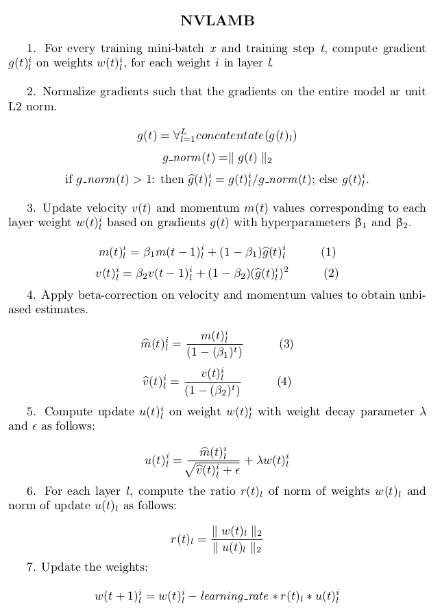

# BERT 1.0 for TensorFlow 2

This repository provides a script and recipe to train the BERT
model for TensorFlow 2 to achieve state-of-the-art accuracy and is tested and maintained by NVIDIA.

## Table of Contents
   * [Model overview](#model-overview)
      * [Model architecture](#model-architecture)
      * [Default configuration](#default-configuration)
      * [Feature support matrix](#feature-support-matrix)
         * [Features](#features)
      * [Mixed precision training](#mixed-precision-training)
         * [Enabling mixed precision](#enabling-mixed-precision)
         * [Enabling TF32](#enabling-tf32)
      * [Glossary](#glossary)
   * [Setup](#setup)
      * [Requirements](#requirements)
   * [Quick Start Guide](#quick-start-guide)
   * [Advanced](#advanced)
      * [Scripts and sample code](#scripts-and-sample-code)
      * [Command-line options](#command-line-options)
      * [Getting the data](#getting-the-data)
         * [Dataset guidelines](#dataset-guidelines)
         * [Multi-dataset](#multi-dataset)
      * [Training process](#training-process)
         * [Pre-training](#pre-training)
         * [Fine tuning](#fine-tuning)
         * [Multi-node](#multi-node)
      * [Inference process](#inference-process)
   * [Performance](#performance)
      * [Benchmarking](#benchmarking)
         * [Training performance benchmark](#training-performance-benchmark)
         * [Inference performance benchmark](#inference-performance-benchmark)
      * [Results](#results)
         * [Training accuracy results](#training-accuracy-results)
            * [Pre-training accuracy](#pre-training-accuracy)
            * [Fine-tuning accuracy for SQuAD v1.1: NVIDIA DGX A100 (8x A100 40GB)](#fine-tuning-accuracy-for-squad-v1.1-nvidia-dgx-a100-(8x-a100-40gb))
            * [Pre-training SQuAD v1.1 stability test: NVIDIA DGX A100 (256x A100 80GB)](#pre-training-squad-v1.1-stability-test-nvidia-dgx-a100-(256x-a100-80gb))
            * [Fine-tuning SQuAD v1.1 stability test: NVIDIA DGX A100 (8x A100 80GB)](#fine-tuning-squad-v1.1-stability-test-nvidia-dgx-a100-(8x-a100-80gb))
         * [Training performance results](#training-performance-results)
            * [Pre-training training performance: Single-node on NVIDIA DGX-2 V100 (16x V100 32GB)](#pre-training-training-performance-single-node-on-nvidia-dgx-1-v100-(16x-v100-32gb))
            * [Pre-training training performance: Multi-node on NVIDIA DGX-2H V100 (16x V100 32GB)](#pre-training-training-performance-multi-node-on-nvidia-dgx-2h-v100-(16x-v100-32gb))
            * [Pre-training training performance: Single-node on NVIDIA DGX A100 (8x A100 80GB)](#pre-training-training-performance-single-node-on-nvidia-dgx-a100-(8x-a100-80gb))
            * [Pre-training training performance: Multi-node on NVIDIA DGX A100 (8x A100 40GB)](#pre-training-training-performance-multi-node-on-nvidia-dgx-a100-(8x-a100-40gb))
            * [Fine-tuning training performance for SQuAD v1.1 on NVIDIA DGX-1 V100 (8x V100 16GB)](#fine-tuning-training-performance-for-squad-v1.1-on-nvidia-dgx-1-v100-(8x-v100-16gb))
            * [Fine-tuning training performance for SQuAD v1.1 on NVIDIA DGX-1 V100 (8x V100 32GB)](#fine-tuning-training-performance-for-squad-v1.1-on-nvidia-dgx-1-v100-(8x-v100-32gb))
            * [Fine-tuning training performance for SQuAD v1.1 on NVIDIA DGX A100 (8x A100 80GB)](#fine-tuning-training-performance-for-squad-v1.1-on-nvidia-dgx-a100-(8x-a100-80gb))
         * [Inference performance results](#inference-performance-results)
            * [Fine-tuning inference performance for SQuAD v1.1 on NVIDIA DGX-1 V100 (1x V100 16GB)](#fine-tuning-inference-performance-for-squad-v1.1-on-nvidia-dgx-1-v100-(1x-v100-16gb))
            * [Fine-tuning inference performance for SQuAD v1.1 on NVIIDA DGX-1 V100 (1x V100 32GB)](#fine-tuning-inference-performance-for-squad-v1.1-on-nvidia-dgx-1-v100-(1x-v100-32gb))
            * [Fine-tuning inference performance for SQuAD v1.1 on NVIDIA DGX A100 (8x A100 80GB)](#fine-tuning-inference-performance-for-squad-v1.1-on-nvidia-dgx-a100-(1x-a100-80gb))
            * [Fine-tuning inference performance for SQuAD v1.1 on NVIDIA Tesla T4 (1x T4 16GB)](#fine-tuning-inference-performance-for-squad-v1.1-on-nvidia-tesla-t4-(1x-t4-16gb))
   * [Release Notes](#release-notes)
      * [Changelog](#changelog)
      * [Known issues](#known-issues)

## Model overview

BERT, or Bidirectional Encoder Representations from Transformers, is a new method of pre-training language representations which obtains state-of-the-art results on a wide array of Natural Language Processing (NLP) tasks. This model is based on the [BERT: Pre-training of Deep Bidirectional Transformers for Language Understanding](https://arxiv.org/abs/1810.04805) paper. NVIDIA's BERT is an optimized version of [Google's official implementation](https://github.com/google-research/bert), leveraging mixed precision arithmetic and Tensor Cores on V100 GPUs for faster training times while maintaining target accuracy.

Other publicly available implementations of BERT include:
[NVIDIA PyTorch](https://github.com/NVIDIA/DeepLearningExamples/tree/master/PyTorch/LanguageModeling/BERT)
[Hugging Face](https://github.com/huggingface/pytorch-pretrained-BERT)
[codertimo](https://github.com/codertimo/BERT-pytorch)
[gluon-nlp](https://github.com/dmlc/gluon-nlp/tree/master/scripts/bert)
[Google's official implementation](https://github.com/google-research/bert)

This model is trained with mixed precision using Tensor Cores on Volta, Turing, and the NVIDIA Ampere GPU architectures. Therefore, researchers can get results up to 4x faster than training without Tensor Cores, while experiencing the benefits of mixed precision training. This model is tested against each NGC monthly container release to ensure consistent accuracy and performance over time.

### Model architecture

BERT's model architecture is a multi-layer bidirectional transformer encoder. Based on the model size, we have the following two default configurations of BERT:

| **Model** | **Hidden layers** | **Hidden unit size** | **Attention heads** | **Feedforward filter size** | **Max sequence length** | **Parameters** |
|:---------:|:----------:|:----:|:---:|:--------:|:---:|:----:|
|BERTBASE |12 encoder| 768| 12|4 x  768|512|110M|
|BERTLARGE|24 encoder|1024| 16|4 x 1024|512|330M|

BERT training consists of two steps, pre-training the language model in an unsupervised fashion on vast amounts of unannotated datasets, and then using this pre-trained model for fine-tuning for various NLP tasks, such as question and answer, sentence classification, or sentiment analysis. Fine-tuning typically adds an extra layer or two for the specific task and further trains the model using a task-specific annotated dataset, starting from the pre-trained backbone weights. The end-to-end process is depicted in the following image:


Figure 1: BERT Pipeline

### Default configuration

This repository contains scripts to interactively launch data download, training, benchmarking, and inference routines in a Docker container for fine tuning Question Answering. The major differences between the official implementation of the paper and our version of BERT are as follows:

- Mixed precision support with TensorFlow Automatic Mixed Precision (TF-AMP), which enables mixed precision training without any changes to the code-base by performing automatic graph rewrites and loss scaling controlled by an environmental variable.
- Scripts to download dataset and pretrained checkpoints for:
    - Pre-training - [Wikipedia](https://dumps.wikimedia.org/),  [BookCorpus](http://yknzhu.wixsite.com/mbweb)
    - Fine tuning - [SQuAD](https://rajpurkar.github.io/SQuAD-explorer/) (Stanford Question Answering Dataset)
    - Pretrained weights from Google
- Custom fused CUDA kernels for faster computations
- Multi-GPU/Multi-node support using Horovod

The following performance optimizations were implemented in this model:
- [XLA](https://www.tensorflow.org/xla) support (experimental).

These techniques and optimizations improve model performance and reduce training time, allowing you to perform various NLP tasks with no additional effort.

### Feature support matrix

The following features are supported by this model.

| **Feature**               | **BERT** |
|:-----------------------:|:--------------------------:|
| Horovod Multi-GPU      | Yes |
| Horovod Multi-node     | Yes |
| Automatic mixed precision (AMP)      | Yes |
| XLA | Yes |
| LAMB | Yes |


#### Features

**Multi-GPU training with Horovod**
Our model uses Horovod to implement efficient multi-GPU training with NCCL. For details, see example sources in this repository or see the [TensorFlow tutorial](https://github.com/horovod/horovod/#usage).

**XLA support**

XLA is a domain-specific compiler for linear algebra that can accelerate TensorFlow models with potentially no source code changes. The results are improvements in speed and memory usage: most internal benchmarks run ~1.1-1.5x faster after XLA is enabled.

**Multi-node Training**

Supported on a Pyxis/Enroot Slurm cluster.

**LAMB**

[LAMB](https://arxiv.org/pdf/1904.00962.pdf) stands for Layerwise Adaptive Moments based optimizer, is a large batch optimization technique that helps accelerate training of deep neural networks using large minibatches. It allows using a global batch size of 65536 and 32768 on sequence lengths 128 and 512 respectively, compared to a batch size of 256 for Adam. The optimized implementation accumulates 1024 gradient batches in phase 1 and 4096 steps in phase 2 before updating weights once. This results in 27% training speedup on a single DGX2 node. On multi-node systems, LAMB allows scaling up to 1024 GPUs resulting in training speedups of up to 17x in comparison to [Adam](https://arxiv.org/pdf/1412.6980.pdf). Adam has limitations on the learning rate that can be used since it is applied globally on all parameters whereas LAMB follows a layerwise learning rate strategy.

NVLAMB adds necessary tweaks to [LAMB version 1](https://arxiv.org/abs/1904.00962v1), to ensure correct convergence. A guide to implementating the LAMB optimizer can be found in our [article](https://medium.com/@NvidiaAI/a-guide-to-optimizer-implementation-for-bert-at-scale-8338cc7f45fd) on Medium.com. The algorithm is as follows:
  


### Mixed precision training

Mixed precision is the combined use of different numerical precision in a computational method. [Mixed precision](https://arxiv.org/abs/1710.03740) training offers significant computational speedup by performing operations in half-precision format, while storing minimal information in single-precision to retain as much information as possible in critical parts of the network. Since the introduction of [Tensor Cores](https://developer.nvidia.com/tensor-cores) in Volta, and following with both the Turing and Ampere architectures, significant training speedups are experienced by switching to mixed precision -- up to 3x overall speedup on the most arithmetically intense model architectures. Using mixed precision training requires two steps:
1.  Porting the model to use the FP16 data type where appropriate.
2.  Adding loss scaling to preserve small gradient values.

This can now be achieved using Automatic Mixed Precision (AMP) for TensorFlow to enable the full [mixed precision methodology](https://docs.nvidia.com/deeplearning/sdk/mixed-precision-training/index.html#tensorflow) in your existing TensorFlow model code.  AMP enables mixed precision training on Volta, Turing, and NVIDIA Ampere GPU architectures automatically. The TensorFlow framework code makes all necessary model changes internally.

In TF-AMP, the computational graph is optimized to use as few casts as necessary and maximize the use of FP16, and the loss scaling is automatically applied inside of supported optimizers. AMP can be configured to work with the existing tf.contrib loss scaling manager by disabling the AMP scaling with a single environment variable to perform only the automatic mixed-precision optimization. It accomplishes this by automatically rewriting all computation graphs with the necessary operations to enable mixed precision training and automatic loss scaling.

For information about:
-   How to train using mixed precision, see the [Mixed Precision Training](https://arxiv.org/abs/1710.03740) paper and [Training With Mixed Precision](https://docs.nvidia.com/deeplearning/performance/mixed-precision-training/index.html) documentation.
-   Techniques used for mixed precision training, see the [Mixed Precision Training of Deep Neural Networks](https://devblogs.nvidia.com/mixed-precision-training-deep-neural-networks/) blog.
-   How to access and enable AMP for TensorFlow, see [Using TF-AMP](https://docs.nvidia.com/deeplearning/dgx/tensorflow-user-guide/index.html#tfamp) from the TensorFlow User Guide.

#### Enabling mixed precision

This implementation exploits the TensorFlow Automatic Mixed Precision feature. To enable AMP, you simply need to supply the `--use_fp16` flag to the `run_pretraining.py` or `run_squad.py` script. For reference, enabling AMP required us to apply the following changes to the code:

1. Set the Keras mixed precision policy:
   ```python
   if FLAGS.use_fp16:
     policy = tf.keras.mixed_precision.experimental.Policy("mixed_float16")
     tf.keras.mixed_precision.experimental.set_policy(policy)
   ```

2. Use the loss scaling wrapper on the optimizer:
   ```python
   if FLAGS.use_fp16:
      squad_model.optimizer = tf.keras.mixed_precision.LossScaleOptimizer(squad_model.optimizer,
        dynamic=True)
   ```

3. Use scaled loss to calculate the gradients:
   ```python
   if use_float16:
     scaled_loss = optimizer.get_scaled_loss(loss)
     scaled_grads = tape.gradient(scaled_loss, training_vars)
     grads = optimizer.get_unscaled_gradients(scaled_grads)
   ```

#### Enabling TF32

TensorFloat-32 (TF32) is the new math mode in [NVIDIA A100](https://www.nvidia.com/en-us/data-center/a100/) GPUs for handling the matrix math also called tensor operations. TF32 running on Tensor Cores in A100 GPUs can provide up to 10x speedups compared to single-precision floating-point math (FP32) on Volta GPUs.

TF32 Tensor Cores can speed up networks using FP32, typically with no loss of accuracy. It is more robust than FP16 for models which require high dynamic range for weights or activations.

For more information, refer to the [TensorFloat-32 in the A100 GPU Accelerates AI Training, HPC up to 20x](https://blogs.nvidia.com/blog/2020/05/14/tensorfloat-32-precision-format/) blog post.

TF32 is supported in the NVIDIA Ampere GPU architecture and is enabled by default.

### Glossary

**Fine-tuning**
Training an already pretrained model further using a task specific dataset for subject-specific refinements, by adding task-specific layers on top if required.

**Language model**
Assigns a probability distribution over a sequence of words. Given a sequence of words, it assigns a probability to the whole sequence.

**Pre-training**
Training a model on vast amounts of data on the same (or different) task to build general understandings.

**Transformer**
The paper [Attention Is All You Need](https://arxiv.org/abs/1706.03762) introduces a novel architecture called Transformer that uses an attention mechanism and transforms one sequence into another.

## Setup

The following section lists the requirements that you need to meet in order to start training the BERT model.


### Requirements

This repository contains `Dockerfile` which extends the TensorFlow NGC container and encapsulates some dependencies. Aside from these dependencies, ensure you have the following components:
- [NVIDIA Docker](https://github.com/NVIDIA/nvidia-docker)
- [TensorFlow 21.02-py3+](https://ngc.nvidia.com/catalog/containers/nvidia:tensorflow) NGC container
- GPU-based architecture:
    - [NVIDIA Volta](https://www.nvidia.com/en-us/data-center/volta-gpu-architecture/)
    - [NVIDIA Turing](https://www.nvidia.com/en-us/geforce/turing/)
    - [NVIDIA Ampere architecture](https://www.nvidia.com/en-us/data-center/nvidia-ampere-gpu-architecture/)

For more information about how to get started with NGC containers, see the following sections from the NVIDIA GPU Cloud Documentation and the Deep Learning Documentation:
- [Getting Started Using NVIDIA GPU Cloud](https://docs.nvidia.com/ngc/ngc-getting-started-guide/index.html)
- [Accessing And Pulling From The NGC Container Registry](https://docs.nvidia.com/deeplearning/frameworks/user-guide/index.html#accessing_registry)
- [Running TensorFlow](https://docs.nvidia.com/deeplearning/frameworks/tensorflow-release-notes/running.html#running)

For those unable to use the TensorFlow NGC container, to set up the required environment or create your own container, see the versioned [NVIDIA Container Support Matrix](https://docs.nvidia.com/deeplearning/frameworks/support-matrix/index.html).

For multi-node, the sample provided in this repository requires [Enroot](https://github.com/NVIDIA/enroot) and [Pyxis](https://github.com/NVIDIA/pyxis) set up on a [SLURM](https://slurm.schedmd.com) cluster.

More information on how to set up and launch can be found in the [Multi-node Documentation](https://docs.nvidia.com/ngc/multi-node-bert-user-guide).

## Quick Start Guide

To pretrain or fine tune your model for Question Answering using mixed precision with Tensor Cores or using FP32/TF32, perform the following steps using the default parameters of the BERT model.

1. Clone the repository.

```bash
git clone https://github.com/NVIDIA/DeepLearningExamples
cd DeepLearningExamples/TensorFlow2/LanguageModeling/BERT
```

2. Build the BERT TensorFlow NGC container.

```bash
bash scripts/docker/build.sh
```

3. Download and preprocess the dataset.

This repository provides scripts to download, verify, extract the SQuAD dataset and pretrained weights for fine tuning as well as Wikipedia and BookCorpus dataset for pre-training.

To download, verify, and extract the required datasets, run:

```bash
bash scripts/data_download.sh
```

The script launches a Docker container with the current directory mounted and downloads the datasets to a `data/` folder on the host.

- Download datasets for fine tuning and pretraining

`bash scripts/data_download.sh all`

- Download datasets for fine tuning only

`bash scripts/data_download.sh squad`

- Download Wikipedia only for pretraining

The pretraining dataset is 170GB+ and takes 15+ hours to download. The BookCorpus server most of the times get overloaded and also contains broken links resulting in HTTP 403 and 503 errors. Hence, it is recommended to skip downloading BookCorpus data by running:

`bash scripts/data_download.sh pretrained wiki_only`

Note: Wikipedia dataset is 17GB and takes about one hour to download.

- Download Wikipedia and BookCorpus

Users can download BookCorpus from other sources to match our accuracy, or repeatedly try our script until the required number of files are downloaded by running the following:

`bash scripts/data_download.sh pretrained wiki_books`

Note: Not using BookCorpus can potentially change final accuracy on a few downstream tasks.

4. Download the pretrained models from NGC.

We have uploaded checkpoints for fine tuning with various configurations on the NGC Model Registry. You can download them directly from the [NGC model catalog](https://ngc.nvidia.com/catalog/models). Download them to the `results/models/` to easily access them in your scripts.

5. Start an interactive session in the NGC container to run training/inference.

After you build the container image and download the data, you can start an interactive CLI session as follows:

```bash
bash scripts/docker/launch.sh
```

6. Start pre-training.

BERT is designed to pre-train deep bidirectional representations for language representations. The following scripts are to replicate pre-training on Wikipedia and BookCorpus from the [LAMB paper](https://arxiv.org/pdf/1904.00962.pdf). These scripts are general and can be used for pre-training language representations on any corpus of choice.

From within the container, you can use the following script to run pre-training using LAMB.
```bash
bash scripts/run_pretraining_lamb.sh <train_batch_size_phase1> <train_batch_size_phase2> <eval_batch_size> <learning_rate_phase1> <learning_rate_phase2> <precision> <use_xla> <num_gpus> <warmup_steps_phase1> <warmup_steps_phase2> <train_steps> <save_checkpoint_steps> <num_accumulation_phase1> <num_accumulation_steps_phase2> <bert_model>
```

For BERT-Large FP16 training with XLA using a DGX-2H, run:
```bash
bash scripts/run_pretraining_lamb.sh 60 10 8 7.5e-4 5e-4 fp16 true 8 2000 200 7820 100 64 192 large
```

This repository also contains a number of predefined configurations to run the LAMB pretraining on NVIDIA DGX-1, NVIDIA DGX-2H or NVIDIA DGX A100 nodes in `scripts/configs/pretrain_config.sh`. For example, to use the default DGX A100 8 GPU config, run:

```bash
bash scripts/run_pretraining_lamb.sh $(source scripts/configs/pretrain_config.sh && dgxa100_8gpu_fp16)
```

Alternatively, to run pre-training with Adam as in the original [BERT paper](https://arxiv.org/pdf/1810.04805.pdf) from within the container, run:

```bash
bash scripts/run_pretraining_adam.sh <train_batch_size_per_gpu> <eval_batch_size> <learning_rate_per_gpu> <precision> <use_xla> <num_gpus> <warmup_steps> <train_steps> <save_checkpoint_steps>
```

7. Start fine tuning.

The above pretrained BERT representations can be fine tuned with just one additional output layer for a state-of-the-art Question Answering system. From within the container, you can use the following script to run fine-training for SQuAD.

```bash
bash scripts/run_squad.sh <num_gpus> <batch_size_per_gpu> <learning_rate_per_gpu> <precision> <use_xla> <bert_model> <squad_version> <epochs>
```

For SQuAD 1.1 FP16 training with XLA using a DGX-1 V100 32G, run:
```bash
bash scripts/run_squad.sh 8 12 5e-6 fp16 true large 1.1 2
```

For SQuAD 2.0 FP32 training without XLA using a DGX-1 V100 32G, run:
```bash
bash scripts/run_squad.sh 8 8 5e-6 fp32 false large 2.0 2
```

The fine-tuned checkpoint will save to `/results/tf_bert_finetuning_squad_xxxxxx/ctl_step_xxx.ckpt-x`

8. Start validation/evaluation.

The `run_squad_inference.sh` script runs inference on a checkpoint fine tuned for SQuAD and evaluates the validity of predictions on the basis of exact match and F1 score.

```bash
bash scripts/run_squad_inference.sh <init_checkpoint> <batch_size> <precision> <use_xla> <bert_model> <squad_version>
```

The `init_checkpoint` is the fine-tuned checkpoint path. For example, we take the checkpoint from previous step `/results/tf_bert_finetuning_squad_xxxxxx/ctl_step_xxx.ckpt-x` and rename to `/results/model.ckpt`. SQuAD 1.1 and SQuAD 2.0 should be different checkpoints.

For SQuAD 2.0 FP16 inference with XLA using a DGX-1 V100 32G, run:
```bash
bash scripts/run_squad_inference.sh /results/model.ckpt 8 fp16 true large 2.0
```

For SQuAD 1.1 FP32 inference without XLA using a DGX-1 V100 32G, run:
```bash
bash scripts/run_squad_inference.sh /results/model.ckpt 8 fp32 false large 1.1
```


## Advanced

The following sections provide greater details of the dataset, running training and inference, and the training results.


### Scripts and sample code

In the root directory, the most important files are:
* `run_pretraining.py` - Serves as entry point for pre-training
* `run_squad.py` - Serves as entry point for SQuAD training
* `Dockerfile` - Container with the basic set of dependencies to run BERT

The `scripts/` folder encapsulates all the one-click scripts required for running various functionalities supported such as:
* `run_squad.sh` - Runs SQuAD training and inference using `run_squad.py` file
* `run_pretraining_adam.sh` - Runs pre-training with Adam optimizer using the `run_pretraining.py` file
* `run_pretraining_lamb.sh` - Runs pre-training with LAMB optimizer using the `run_pretraining.py` file in two phases. Phase 1 does 90% of training with sequence length = 128. In phase 2, the remaining 10% of the training is done with sequence length = 512.
* `data_download.sh` - Downloads datasets using files in the `data/` folder
* `finetune_train_benchmark.sh` - Captures performance metrics of training for multiple configurations
* `finetune_inference_benchmark.sh` - Captures performance metrics of inference for multiple configurations

The `data/` folder contains necessary folders and scripts to download datasets required for fine tuning and pre-training BERT.

After downloading the data, the `launch.sh` script assumes that the datasets are in the following locations by default

- SQuAD v1.1 - `data/download/squad/v1.1`
- SQuAD v2.0 - `data/download/squad/v2.0`
- BERT-Large - `data/download/google_pretrained_weights/uncased_L-24_H-1024_A-16`
- BERT-Base - `data/download/google_pretrained_weights/uncased_L-12_H-768_A-12`
- Wikipedia + BookCorpus TFRecords - `data/tfrecords/books_wiki_en_corpus`

The `official/` folder contains necessary files of building model architecture and training process.

### Parameters

Aside from the options to set hyperparameters, the relevant options to control the behaviour of the `run_pretraining.py` script are:

```
  --bert_config_file: Bert configuration file to define core bert layers.
  --init_checkpoint: Initial checkpoint (usually from a pre-trained BERT model).
  --[no]use_horovod: Whether to use horovod.(default: 'false')
  --[no]use_fp16: Whether to use fp32 or fp16 arithmetic on GPU. When false, uses TF32 on A100 and FP32 on V100 GPUS.(default: 'false')
  --[no]enable_xla: Whether to enable XLA auto jit compilation.(default: 'false')
  --input_files: File path to retrieve training data for pre-training.
  --model_dir: The location of the model checkpoint files.
  --optimizer_type: Optimizer used for training - LAMB or ADAM
  --num_accumulation_steps: Number of accumulation steps before gradient update. Global batch size = num_accumulation_steps * train_batch_size
```

Aside from the options to set hyperparameters, some relevant options to control the behaviour of the `run_squad.py` script are:

```
  --bert_config_file: Bert configuration file to define core bert layers.
  --model_dir: The location of the model checkpoint files.
  --mode: <train_and_predict|train|predict|export_only>: One of {"train_and_predict", "train", "predict", "export_only"}. `train_and_predict`: both train and predict to a json file. `train`: only trains the model. trains the model and evaluates in the meantime. `predict`: predict answers from the squad json file. `export_only`: will take the latest checkpoint inside model_dir and export a `SavedModel`.
  --max_answer_length: The maximum length of an answer that can be generated. (default: '30')(an integer)
  --input_meta_data_path: Path to file that contains meta data about input to be used for training and evaluation.
  --predict_batch_size: Total batch size for predictions.(default: '8')(an integer)
  --train_batch_size: Total batch size for training.(default: '8')(an integer)
  --[no]use_fp16: Whether to use fp32 or fp16 arithmetic on GPU. When false, uses TF32 on A100 and FP32 on V100 GPUS.(default: 'false')
  --[no]enable_xla: Whether to enable XLA auto jit compilation.(default: 'false')
```

### Command-line options

To see the full list of available options and their descriptions, use the `-h` or `--helpfull` command-line option with the Python file, for example:

```bash
python run_pretraining.py --helpfull
python run_squad.py --helpfull
```


### Getting the data

For pre-training BERT, we use the concatenation of Wikipedia (2500M words) as well as BookCorpus (800M words). For Wikipedia, we extract only the text passages from [here](https://dumps.wikimedia.your.org/enwiki/latest/enwiki-latest-pages-articles.xml.bz2) and ignore headers list and tables. It is structured as a document level corpus rather than a shuffled sentence level corpus because it is critical to extract long contiguous sentences.

The next step is to run `create_pretraining_data.py` with the document level corpus as input, which generates input data and labels for the masked language modeling and next sentence prediction tasks. Pre-training can also be performed on any corpus of your choice. The collection of data generation scripts are intended to be modular to allow modifications for additional preprocessing steps or to use additional data. They can hence easily be modified for an arbitrary corpus.

The preparation of an individual pre-training dataset is described in the `create_datasets_from_start.sh` script found in the `data/` folder. The component steps to prepare the datasets are as follows:

1.  Data download and extract - the dataset is downloaded and extracted.
2.  Clean and format - document tags, etc. are removed from the dataset. The end result of this step is a `{dataset_name_one_article_per_line}.txt` file that contains the entire corpus. Each line in the text file contains an entire document from the corpus. One file per dataset is created in the `formatted_one_article_per_line` folder.
3.  Sharding - the sentence segmented corpus file is split into a number of smaller text documents. The sharding is configured so that a document will not be split between two shards. Sentence segmentation is performed at this time using Natural Language Toolkit (NLTK).
4.  TFRecord file creation - each text file shard is processed by the `create_pretraining_data.py` script to produce a corresponding TFRecord file. The script generates input data and labels for masked language modeling and sentence prediction tasks for the input text shard.

For fine tuning BERT, for the task of Question Answering, we use SQuAD. SQuAD v1.1 has 100,000+ question-answer pairs on 500+ articles. SQuAD v2.0 combines v1.1 with an additional 50,000 new unanswerable questions and must not only answer questions but also determine when that is not possible.

#### Dataset guidelines

The procedure to prepare a text corpus for pre-training is described in the previous section. This section provides additional insight into how exactly raw text is processed so that it is ready for pre-training.

First, raw text is tokenized using [WordPiece tokenization](https://arxiv.org/pdf/1609.08144.pdf). A [CLS] token is inserted at the start of every sequence, and the two sentences in the sequence are separated by a [SEP] token.

Note: BERT pre-training looks at pairs of sentences at a time. A sentence embedding token [A] is added to the first sentence and token [B] to the next.

BERT pre-training optimizes for two unsupervised classification tasks. The first is Masked Language Modelling (Masked LM). One training instance of Masked LM is a single modified sentence. Each token in the sentence has a 15% chance of being replaced by a [MASK] token. The chosen token is replaced with [MASK] 80% of the time, 10% with another random token, and the remaining 10% with the same token. The task is then to predict the original token.

The second task is next sentence prediction. One training instance of BERT pre-training is two sentences (a sentence pair). A sentence pair may be constructed by simply taking two adjacent sentences from a single document, or by pairing up two random sentences with equal probability. The goal of this task is to predict whether or not the second sentence followed the first in the original document.

The `create_pretraining_data.py` script takes in raw text and creates training instances for both pre-training tasks.

#### Multi-dataset

We are able to combine multiple datasets into a single dataset for pre-training on a diverse text corpus. Once TFRecords have been created for each component dataset, you can create a combined dataset by adding the directory to `SOURCES` in `run_pretraining_*.sh`. This will feed all matching files to the input pipeline in `run_pretraining.py`. However, in the training process, only one TFRecord file is consumed at a time, therefore, the training instances of any given training batch will all belong to the same source dataset.


### Training process

#### Pre-training

Pre-training is performed using the `run_pretraining.py` script along with parameters defined in the `scripts/run_pretraining_lamb.sh`.

The `run_pretraining_lamb.sh` script runs a job on a single node that trains the BERT-Large model from scratch using the Wikipedia and BookCorpus datasets as training data. By default, the training script:
- Runs on 8 GPUs.
- Has FP16 precision enabled.
- Is XLA enabled.
- Creates a log file containing all the output.
- Saves a checkpoint every 100 iterations (keeps only the latest checkpoint) at the end of training. All checkpoints, evaluation results, and training logs are saved to the `/results` directory (in the container which can be mounted to a local directory).
- Evaluates the model at the end of each phase.

- Phase 1
    - Runs 7506 steps with 2133 warmup steps
    - Sets Maximum sequence length to 128
    - Sets Global Batch size to 61K

- Phase 2
    - Runs 1668 steps with 213 warm-up steps
    - Sets Maximum sequence length to 512
    - Sets Global Batch size to 30K
    - Starts from Phase1's final checkpoint

These parameters train Wikipedia and BookCorpus with reasonable accuracy on a DGX-1 with 32GB V100 cards.

For example:
```bash
scripts/run_pretraining_lamb.sh <train_batch_size_phase1> <train_batch_size_phase2> <eval_batch_size> <learning_rate_phase1> <learning_rate_phase2> <precision> <use_xla> <num_gpus> <warmup_steps_phase1> <warmup_steps_phase2> <train_steps> <save_checkpoint_steps> <num_accumulation_phase1> <num_accumulation_steps_phase2> <bert_model>
```

Where:
- `<training_batch_size_phase*>` is per-GPU batch size used for training in the respective phase. Batch size varies with precision, larger batch sizes run more efficiently, but require more memory.

- `<eval_batch_size>` is per-GPU batch size used for evaluation after training.

- `<learning_rate_phase1>` is the default rate of 5e-4 is good for global batch size 61K.

- `<learning_rate_phase2>` is the default rate of 7.5e-4 is good for global batch size 30K.

- `<precision>` is the type of math in your model, can be either `fp32` or `fp16`. Specifically:

    - `fp32` is 32-bit IEEE single precision floats. Is enabled by default on V100.
    - `fp16` is Automatic rewrite of TensorFlow compute graph to take advantage of 16-bit arithmetic whenever it is safe.
    - `tf32` uses same 10 bit mantissa as FP16 and 8-bit exponent as FP32. Is enabled by default on A100.


- `<num_gpus>` is the number of GPUs to use for training. Must be equal to or smaller than the number of GPUs attached to your node.

- `<warmup_steps_phase*>` is the number of warm-up steps at the start of training in the respective phase.

- `<training_steps>` is the total number of training steps in both phases combined.

- `<save_checkpoint_steps>` controls how often checkpoints are saved. Default is 100 steps.

- `<num_accumulation_phase*>` is used to mimic higher batch sizes in the respective phase by accumulating gradients N times before weight update.

- `<bert_model>` is used to indicate whether to pretrain BERT-Large or BERT-Base model

The following sample code trains BERT-Large from scratch on a single DGX-2 using FP16 arithmetic. This will take around 4.5 days.

```bash
scripts/run_pretraining_lamb.sh 60 10 8 7.5e-4 5e-4 fp16 true 8 2000 200 7820 100 64 192 large
```

#### Fine tuning

Fine tuning is performed using the `run_squad.py` script along with parameters defined in `scripts/run_squad.sh`.

The `run_squad.sh` script trains a model and performs evaluation on the SQuAD dataset. By default, the training script:

- Trains for SQuAD v1.1 dataset.
- Trains on BERT-Large model.
- Uses 8 GPUs and batch size of 12 on each GPU.
- Has FP16 precision enabled.
- Is XLA enabled.
- Runs for 2 epochs.
- Saves a checkpoint every 180 seconds (keeps only the latest checkpoint) at the end of training. All checkpoints, evaluation results, and training logs are saved to the `/results` directory (in the container which can be mounted to a local directory).
- Evaluation is done at the end of training. To skip evaluation, modify `--mode` from `train_and_predict` to `train`.

This script outputs checkpoints to the `/results` directory, by default, inside the container. Mount point of `/results` can be changed in the `scripts/docker/launch.sh` file. The training log contains information about:
- Loss for the final step
- Training and evaluation performance
- F1 and exact match score on the Dev Set of SQuAD after evaluation.

The summary after training is printed in the following format:
```bash
I0415 18:12:49.376930 140671213582144 model_training_utils.py:82] Training Summary:
{'total_training_steps': 1846, 'train_loss': 0.6074678301811218}
I0415 18:12:49.377982 140671213582144 model_training_utils.py:564] -----------------------------
I0415 18:12:49.377468 140671213582144 model_training_utils.py:558]   Batch size = 12
...
I0415 18:12:49.379069 140671213582144 model_training_utils.py:568] -----------------------------
```

Multi-GPU training is enabled with the Horovod TensorFlow module. The following example runs training on 8 GPUs:

```bash
BERT_DIR=data/download/google_pretrained_weights/uncased_L-24_H-1024_A-16

mpirun -np 8 \
    --allow-run-as-root -bind-to none -map-by slot \
    -x NCCL_DEBUG=INFO \
    -x LD_LIBRARY_PATH \
    -x PATH -mca pml ob1 -mca btl ^openib \
     python run_squad.py --use_horovod --vocab_file=$BERT_DIR/vocab.txt \
     --bert_config_file=$BERT_DIR/bert_config.json \
     --model_dir=/results
```

#### Multi-node

Multi-node runs can be launched on a pyxis/enroot Slurm cluster (see [Requirements](#requirements)) with the `run.sub` script with the following command for a 4-node DGX-1 example for both phase 1 and phase 2:

```
BATCHSIZE=16 LEARNING_RATE='1.875e-4' NUM_ACCUMULATION_STEPS=128 PHASE=1 sbatch -N4 --ntasks-per-node=8 run.sub
BATCHSIZE=2 LEARNING_RATE='1.25e-4' NUM_ACCUMULATION_STEPS=512 PHASE=1 sbatch -N4 --ntasks-per-node=8 run.sub
```

Checkpoint after phase 1 will be saved in `model_dir` specified in `run.sub`. The checkpoint will be automatically picked up to resume training on phase 2. Note that phase 2 should be run after phase 1.

Variables to re-run the [Training performance results](#training-performance-results) are available in the `scripts/configs/configurations.yml` file.

The batch variables `BATCHSIZE`, `LEARNING_RATE`, `NUM_ACCUMULATION_STEPS` refer to the Python arguments `train_batch_size`, `learning_rate`, `num_accumulation_steps` respectively.
The variable `PHASE` refers to phase specific arguments available in `run.sub`.

Note that the `run.sub` script is a starting point that has to be adapted depending on the environment. In particular, variables such as `datadir` handle the location of the files for each phase.

Refer to the files contents to see the full list of variables to adjust for your system.

### Inference process

Inference on a fine tuned Question Answering system is performed using the `run_squad.py` script along with parameters defined in `scripts/run_squad_inference.sh`. Inference is supported on a single GPU.

The `run_squad_inference.sh` script trains a model and performs evaluation on the SQuAD dataset. By default, the inferencing script:

- Uses SQuAD v1.1 dataset
- Has FP16 precision enabled
- Is XLA enabled
- Evaluates the latest checkpoint present in `/results` with a batch size of 8

This script outputs predictions file to `/results/predictions.json` and computes F1 score and exact match score using SQuAD's evaluate file. Mount point of `/results` can be changed in the `scripts/docker/launch.sh` file.

The output log contains information about:
Inference performance
Inference accuracy (F1 and exact match scores) on the Dev Set of SQuAD after evaluation.

The summary after inference is printed in the following format:
```bash
I0424 23:59:50.030514 139905798453056 run_squad.py:268] -----------------------------
I0424 23:59:50.030774 139905798453056 run_squad.py:269] Summary Inference Statistics
I0424 23:59:50.030934 139905798453056 run_squad.py:270] Batch size = 8
I0424 23:59:50.031085 139905798453056 run_squad.py:271] Sequence Length = 384
I0424 23:59:50.031238 139905798453056 run_squad.py:272] Precision = fp16
I0424 23:59:50.031387 139905798453056 run_squad.py:274] Total Inference Time = 88.29 for Sentences = 10840
I0424 23:59:50.031537 139905798453056 run_squad.py:302] -----------------------------
{"exact_match": 84.08703878902554, "f1": 90.87995817872932}
```


## Performance

The performance measurements in this document were conducted at the time of publication and may not reflect the performance achieved from NVIDIA’s latest software release. For the most up-to-date performance measurements, go to [NVIDIA Data Center Deep Learning Product Performance](https://developer.nvidia.com/deep-learning-performance-training-inference).


### Benchmarking

The following section shows how to run benchmarks measuring the model performance in training and inference modes.

Both of these benchmarking scripts enable you to run a number of epochs, extract performance numbers, and run the BERT model for fine tuning.

#### Training performance benchmark

Training benchmarking can be performed by running the script:
``` bash
scripts/finetune_train_benchmark.sh <bert_model> <num_gpu> <batch_size> <precision> <use_xla>
```

This script runs 800 steps by default on the SQuAD v1.1 dataset and extracts performance numbers for the given configuration. These numbers are saved at `/results/squad_train_benchmark_<bert_model>_gpu<num_gpu>_bs<batch_size>.log`.

#### Inference performance benchmark

Inference benchmarking can be performed by running the script:

``` bash
scripts/finetune_inference_benchmark.sh <bert_model> <batch_size> <precision> <use_xla>
```

This script runs 1000 eval iterations by default on the SQuAD v1.1 dataset and extracts performance and latency numbers for the given configuration. These numbers are saved at `/results/squad_inference_benchmark_<bert_model>_<precision>_bs<batch_size>.log`.


### Results

The following sections provide details on how we achieved our performance and accuracy in training and inference for fine tuning Question Answering. All results are on BERT-Large model unless otherwise mentioned. All fine tuning results are on SQuAD v1.1 using a sequence length of 384 unless otherwise mentioned.

#### Training accuracy results

##### Pre-training accuracy

Our results were obtained by running the `scripts/run_pretraining_lamb.sh` training script in the TensorFlow 21.02-py3 NGC container on NVIDIA DGX-2 and NVIDIA DGX A100.

| **DGX System** | **Nodes x GPUs** | **Precision** | **Batch Size/GPU: Phase1, Phase2** | **Accumulation Steps: Phase1, Phase2** | **Time to Train (Hrs)** | **Final Loss** |
|----------------|-----------|---------------|------------------------------------|----------------------------------------|----------------|-------------------------|
| DGX2H | 32 x 16 | FP16 | 56, 10 | 2, 6   | 2.67  | 1.69 |
| DGX2H | 32 x 16 | FP32 | 32, 4 | 4, 16   | 8.02  | 1.71 |
| DGXA100 | 32 x 8 | FP16 | 312, 40 | 1, 3   | 2.02  | 1.68 |
| DGXA100 | 32 x 8 | TF32 | 176, 22 | 2, 6   | 3.57  | 1.67 |

##### Fine-tuning accuracy for SQuAD v1.1: NVIDIA DGX A100 (8x A100 40GB)

Our results were obtained by running the `scripts/run_squad.sh` training script in the TensorFlow 20.12-py3 NGC container on NVIDIA DGX A100 with 8x A100 80GB GPUs.

| **GPUs** | **Batch size / GPU: TF32, FP16 ** | **Accuracy - TF32** | **Accuracy - mixed precision** | **Time to Train - TF32 (Hrs)** | **Time to Train - mixed precision (Hrs)** |
|:---:|:----:|:----:|:---:|:----:|:----:|
| 8 | 38, 76 | 90.88 | 91.12 | 0.16 | 0.11 |


##### Pre-training SQuAD v1.1 stability test: NVIDIA DGX A100 (256x A100 80GB)

The following tables compare `Final Loss` scores across 3 different training runs with different seeds, for both FP16 and TF32.  The runs showcase consistent convergence on all 3 seeds with very little deviation.

| **FP16, 256x GPUs** | **seed 1** | **seed 2** | **seed 3** | **mean** | **std** |
|:-----------:|:-----:|:-----:|:-----:|:-----:|:-----:|
|Final Loss   |1.657  |1.661 |1.683 |1.667 |0.014 |

| **TF32, 256x GPUs** | **seed 1** | **seed 2** | **seed 3** | **mean** | **std** |
|:-----------:|:-----:|:-----:|:-----:|:-----:|:-----:|
|Final Loss         |1.67  |1.654 |1.636 |1.653 |0.017 |

##### Fine-tuning SQuAD v1.1 stability test: NVIDIA DGX A100 (8x A100 80GB)

The following tables compare `F1` scores across 5 different training runs with different seeds, for both FP16 and TF32 respectively using the (NVIDIA Pretrained Checkpoint)[https://ngc.nvidia.com/catalog/models].  The runs showcase consistent convergence on all 5 seeds with very little deviation.

| **FP16, 8x GPUs** | **seed 1** | **seed 2** | **seed 3** | **seed 4** | **seed 5** | **mean** | **std** |
|:-----------:|:-----:|:-----:|:-----:|:-----:|:-----:|:-----:|:-----:|
|F1         |91.12 |90.80 |90.94 |90.90 |90.94 |90.94 |0.11 |

| **TF32, 8x GPUs** | **seed 1** | **seed 2** | **seed 3** | **seed 4** | **seed 5** | **mean** | **std** |
|:-----------:|:-----:|:-----:|:-----:|:-----:|:-----:|:-----:|:-----:|
|F1         |90.79 |90.88 |90.80 |90.88 |90.83 |90.84 |0.04 |


#### Training performance results

##### Pre-training training performance: Single-node on NVIDIA DGX-2 V100 (16x V100 32GB)

Our results were obtained by running the `scripts/run_pretraining_lamb.sh` training script in the TensorFlow 21.02-py3 NGC container on NVIDIA DGX-2 with 16x V100 32GB GPUs. Performance (in sequences per second) is the steady state throughput.

| **GPUs** | **Sequence Length** | **Batch size / GPU: mixed precision, FP32** | **Gradient Accumulation: mixed precision, FP32** | **Global Batch Size: mixed precision, FP32** | **Throughput - mixed precision** | **Throughput - FP32** | **Throughput speedup (FP32 - mixed precision)** | **Weak scaling - mixed precision** | **Weak scaling - FP32** |
|:--------:|:-------------------:|:-------------------------------------------:|--------------------------------------------------|:--------------------------------------------:|:--------------------------------:|:---------------------:|-------------------------------------------------|------------------------------------|-------------------------|
|        1 |                 128 | 60 , 32                                     | 1024 , 2048                                      | 61440 , 65536         | 206.5    | 49.97  | 4.13 | 1.00	| 1.00   |
|        4 |                 128 | 60 , 32                                     | 256 , 512                                        | 61440 , 65536         | 789.75   | 194.02 | 4.07 | 3.82	| 3.88   |
|        8 |                 128 | 60 , 32                                     | 128 , 256                                        | 61440 , 65536         | 1561.77	| 367.9  | 4.25 | 7.56	| 7.36   |
|       16 |                 128 | 60 , 32                                     | 64 , 128                                         | 61440 , 65536         | 3077.99	| 762.22 | 4.04 | 14.9	| 15.25  |
|        1 |                 512 | 10 , 6                                      | 3072 , 5120                                      | 30720 , 30720         | 40.95	   | 11.06  | 3.70 | 1.00	| 1.00   |
|        4 |                 512 | 10 , 6                                      | 768 , 1280                                       | 30720 , 30720         | 158.5	   | 43.05  | 3.68 | 3.87	| 3.89   |
|        8 |                 512 | 10 , 6                                      | 384 , 640                                        | 30720 , 30720         | 312.03	| 85.51  | 3.65 | 7.62	| 7.73   |
|       16 |                 512 | 10 , 4                                      | 192 , 512                                        | 30720 , 32768         | 614.94	| 161.38 | 3.81 | 15.02	| 14.59  |

Note: The respective values for FP32 runs that use a batch size of 60 and 10 in sequence lengths 128 and 512 are not available due to out of memory errors that arise.

##### Pre-training training performance: Multi-node on NVIDIA DGX-2H V100 (16x V100 32GB)

Our results were obtained by running the `run.sub` training script in the TensorFlow 21.02-py3 NGC container using multiple NVIDIA DGX-2 with 16x V100 32GB GPUs. Performance (in sequences per second) is the steady state throughput.

| **Num Nodes** | **Sequence Length** | **Batch size / GPU: mixed precision, FP32** | **Gradient Accumulation: mixed precision, FP32** | **Global Batch Size: mixed precision, FP32** | **Throughput - mixed precision** | **Throughput - FP32** | **Throughput speedup (FP32 - mixed precision)** | **Weak scaling - mixed precision** | **Weak scaling - FP32** |
|:-------------:|:-------------------:|:-------------------------------------------:|--------------------------------------------------|:--------------------------------------------:|:--------------------------------:|:---------------------:|-------------------------------------------------|------------------------------------|-------------------------|
|             1 |                 128 | 60 , 32                                     | 64 , 128                                         | 61440 , 65536         | 3528.51	| 841.72    | 4.19 | 1.00  | 1.00   |
|             4 |                 128 | 60 , 32                                     | 16 , 32                                          | 61440 , 65536         | 13370.21	| 3060.49   | 4.37 | 3.79	| 3.64   |
|            16 |                 128 | 60 , 32                                     | 4 , 8                                            | 61440 , 65536         | 42697.42	| 10383.57  | 4.11 | 12.1	| 12.34  |
|            32 |                 128 | 60 , 32                                     | 2 , 4                                            | 61440 , 65536         | 84223.16	| 20094.14  | 4.19 | 23.87	| 23.87  |
|             1 |                 512 | 10 , 4                                      | 192 , 256                                        | 30720 , 32768         | 678.35		| 180       | 3.77 | 1.00  | 1.00   |
|             4 |                 512 | 10 , 4                                      | 96 , 64                                          | 30720 , 32768         | 2678.29	| 646.76    | 4.14 | 3.95	| 3.59   |
|            16 |                 512 | 10 , 4                                      | 24 , 32                                          | 30720 , 32768         | 7834.72	| 2204.72   | 3.55 | 11.55	| 12.25  |
|            32 |                 512 | 10 , 4                                      | 6 , 16                                           | 30720 , 32768         | 18786.93	| 4196.15   | 4.48 | 27.70	| 23.31  |

Note: The respective values for FP32 runs that use a batch size of 60 and 10 in sequence lengths 128 and 512 are not available due to out of memory errors that arise.

##### Pre-training training performance: Single-node on NVIDIA DGX A100 (8x A100 80GB)

Our results were obtained by running the `scripts/run_pretraining_lamb.sh` training script in the TensorFlow 21.02-py3 NGC container on NVIDIA DGX A100 with 8x A100 80GB GPUs. Performance (in sequences per second) is the steady state throughput.

| **GPUs** | **Sequence Length** | **Batch size / GPU: mixed precision, TF32** | **Gradient Accumulation: mixed precision, TF32** | **Global Batch Size: mixed precision, FP32** | **Throughput - mixed precision** | **Throughput - TF32** | **Throughput speedup (TF32 - mixed precision)** | **Weak scaling - mixed precision** | **Weak scaling -TF32** |
|:--------:|:-------------------:|:-------------------------------------------:|--------------------------------------------------|:--------------------------------------------:|:--------------------------------:|:---------------------:|-------------------------------------------------|------------------------------------|------------------------|
|        1 |                 128 | 312 , 176                                   | 256 , 512                                        | 79872 , 90112         | 485.59   | 282.98    | 1.72 | 1.00  | 1.00   |
|        8 |                 128 | 312 , 176                                   | 32 , 64                                          | 79872 , 90112         | 3799.24  | 1944.77   | 1.95 | 7.82  | 6.87   |
|        1 |                 512 | 40 , 22                                     | 768 , 1536                                       | 30720 , 33792         | 96.52    | 54.92     | 1.76 | 1.00  | 1.00   |
|        8 |                 512 | 40 , 22                                     | 96 , 192                                         | 30720 , 33792         | 649.69   | 427.39    | 1.52 | 6.73  | 7.78   |

Note: The respective values for TF32 runs that use a batch size of 312 and 40 in sequence lengths 128 and 512 are not available due to out of memory errors that arise.

##### Pre-training training performance: Multi-node on NVIDIA DGX A100 (8x A100 80GB)

Our results were obtained by running the `scripts/run_pretraining_lamb.sh` training script in the TensorFlow 21.02-py3 NGC container on NVIDIA DGX A100 with 8x A100 40GB GPUs. Performance (in sequences per second) is the steady state throughput.

| **Num Nodes** | **Sequence Length** | **Batch size / GPU: mixed precision, TF32** | **Gradient Accumulation: mixed precision, TF32** | **Global Batch Size: mixed precision, FP32** | **Throughput - mixed precision** | **Throughput - TF32** | **Throughput speedup (TF32 - mixed precision)** | **Weak scaling - mixed precision** | **Weak scaling -TF32** |
|:-------------:|:-------------------:|:-------------------------------------------:|--------------------------------------------------|:--------------------------------------------:|:--------------------------------:|:---------------------:|-------------------------------------------------|------------------------------------|------------------------|
|             1 |                 128 | 312 , 176                                   | 32 , 64                                          | 79872 , 90112         | 3803.82	| 2062.98   | 1.84   |1.00    | 1.00   |
|             2 |                 128 | 312 , 176                                   | 16 , 32                                          | 79872 , 90112         | 7551.37	| 4084.76   | 1.85   |1.99    | 1.98   |
|             8 |                 128 | 312 , 176                                   | 4 , 8                                            | 79872 , 90112         | 29711.11	| 16134.02  | 1.84   |7.81    | 7.82   |
|            32 |                 128 | 312 , 176                                   | 1 , 2                                            | 79872 , 90112         | 110280.73	| 59569.77  | 1.85   |28.99   | 28.88  |
|             1 |                 512 | 40 , 22                                     | 96 , 192                                         | 30720 , 33792         | 749.73	   | 431.89    | 1.74   |1.00    | 1.00   |
|             2 |                 512 | 40 , 22                                     | 48 , 96                                          | 30720 , 33792         | 1491.87	| 739.14    | 2.02   |1.99    | 1.71   |
|             8 |                 512 | 40 , 22                                     | 12 , 24                                          | 30720 , 33792         | 5870.83	| 2926.58   | 2.01   |7.83    | 6.78   |
|            32 |                 512 | 40 , 22                                     | 3 , 6                                            | 30720 , 33792         | 22506.23	| 11240.5   | 2.00   |30.02   | 26.03  |

Note: The respective values for TF32 runs that use a batch size of 312 and 40 in sequence lengths 128 and 512 are not available due to out of memory errors that arise.

##### Fine-tuning training performance for SQuAD v1.1 on NVIDIA DGX-1 V100 (8x V100 16GB)

Our results were obtained by running the `scripts/run_squad.sh` training script in the TensorFlow 21.02-py3 NGC container on NVIDIA DGX-1 with 8x V100 16GB GPUs. Performance (in sequences per second) is the mean throughput from 2 epochs.

| **GPUs** | **Batch size / GPU: mixed precision, FP32** | **Throughput - mixed precision** | **Throughput - FP32** | **Throughput speedup (FP32 to mixed precision)** | **Weak scaling - FP32** | **Weak scaling - mixed precision** |
|:---:|:---:|:------:|:-----:|:----:|:----:|:----:|
| 1 | 6,3 | 39.10    | 9.85	| 3.97   | 1.00 | 1.00 |
| 4 | 6,3 | 128.48	| 36.52	| 3.52   | 3.29 | 3.71 |
| 8 | 6,3 | 255.36	| 73.03	| 3.5    | 6.53 | 7.41 |

Note: The respective values for FP32 runs that use a batch size of 6 are not available due to out of memory errors that arise. Batch size of 6 is only available on using FP16.

To achieve these same results, follow the [Quick Start Guide](#quick-start-guide) outlined above.

##### Fine-tuning training performance for SQuAD v1.1 on NVIDIA DGX-1 V100 (8x V100 32GB)

Our results were obtained by running the `scripts/run_squad.sh` training script in the TensorFlow 21.02-py3 NGC container on NVIDIA DGX-1 with 8x V100 32GB GPUs. Performance (in sequences per second) is the mean throughput from 2 epochs.


| **GPUs** | **Batch size / GPU: mixed precision, FP32** | **Throughput - mixed precision** | **Throughput - FP32** | **Throughput speedup (FP32 to mixed precision)** | **Weak scaling - FP32** | **Weak scaling - mixed precision** |
|---|---|-----|------|----|----|----|
| 1 | 12,8 | 47.06   | 11.11	| 4.24 | 1.00 | 1.00 |
| 4 | 12,8 | 165.26	| 42.84	| 3.86 | 3.51 | 3.86 |
| 8 | 12,8 | 330.29	| 85.91	| 3.84 | 7.02 | 7.73 |

Note: The respective values for FP32 runs that use a batch size of 12 are not available due to out of memory errors that arise. Batch size of 12 is only available on using FP16.

To achieve these same results, follow the [Quick Start Guide](#quick-start-guide) outlined above.

##### Fine-tuning training performance for SQuAD v1.1 on NVIDIA DGX A100 (8x A100 80GB)

Our results were obtained by running the `scripts/run_squad.sh` training script in the TensorFlow 21.02-py3 NGC container on NVIDIA DGX-2 with 16x V100 32GB GPUs. Performance (in sequences per second) is the mean throughput from 2 epochs.

| **GPUs** | **Batch size / GPU: mixed precision, TF32** | **Throughput - mixed precision** | **Throughput - FP32** | **Throughput speedup (FP32 to mixed precision)** | **Weak scaling - FP32** | **Weak scaling - mixed precision** |
|---|---|------|------|----|-----|-----|
| 1  | 76,38 | 134.22	| 43.9	| 3.057 | 1.00 | 1.00 |
| 8  | 76,38 | 1048.23	| 341.31	| 3.071 | 7.81 | 7.77 |


Note: The respective values for TF32 runs that use a batch size of 76 are not available due to out of memory errors that arise. Batch size of 12 is only available on using FP16.

To achieve these same results, follow the [Quick Start Guide](#quick-start-guide) outlined above.


#### Inference performance results

##### Fine-tuning inference performance for SQuAD v1.1 on NVIDIA DGX-1 V100 (1x V100 16GB)

Our results were obtained by running the `scripts/finetune_inference_benchmark.sh` training script in the TensorFlow 21.02-py3 NGC container on NVIDIA DGX-1 with 1x V100 16GB GPUs. Performance numbers (throughput in sequences per second and latency in milliseconds) were averaged from 1000 iterations. Latency is computed as the time taken for a batch to process as they are fed in one after another in the model ie no pipelining.

BERT-LARGE FP16

| Sequence Length | Batch Size | Throughput-Average(seq/sec) | Throughput speedup (FP32 to mixed precision) | Latency-Average(ms) | Latency-90%(ms) | Latency-95%(ms) | Latency-99%(ms) |
|-----------------|------------|------------------------------|----------------------------------------------|---------------------|-----------------|-----------------|-----------------|
| 128 | 1 | 105.04	| 1.277237354	| 9.52	| 9.67	| 9.77	| 10.16  |
| 128 | 2 | 184.9	   | 1.671487977	| 10.82	| 11.15	| 11.27	| 11.8   |
| 128 | 4 | 301.9	   | 2.448102498	| 13.25	| 13.38	| 13.45	| 13.96  |
| 128 | 8 | 421.98	| 3.149809659	| 18.96	| 19.12	| 19.2	| 19.82  |
| 384 | 1 | 74.99	   | 2.15055922	| 13.34	| 13.5	| 13.58	| 14.53  |
| 384 | 2 | 109.84	| 2.709422792	| 18.21	| 18.4	| 18.6	| 19.39  |
| 384 | 4 | 142.58	| 3.313502208	| 28.05	| 28.28	| 28.48	| 28.85  |
| 384 | 8 | 168.34	| 3.823302294	| 47.52	| 47.74	| 47.86	| 48.52  |

BERT-Large FP32

| Sequence Length | Batch Size | Throughput-Average(seq/sec) | Latency-Average(ms) | Latency-90%(ms) | Latency-95%(ms) | Latency-99%(ms) |
|-----------------|------------|------------------------------|---------------------|-----------------|-----------------|-----------------|
| 128 | 1 | 82.24	   | 12.16	   | 12.28	| 12.33	| 12.92  |
| 128 | 2 | 110.62	| 18.08	   | 18.22	| 18.28	| 18.88  |
| 128 | 4 | 123.32	| 32.44	   | 32.72	| 32.82	| 32.98  |
| 128 | 8 | 133.97	| 59.71	   | 60.29	| 60.49	| 60.69  |
| 384 | 1 | 34.87	   | 28.67	   | 28.92	| 29.02	| 29.33  |
| 384 | 2 | 40.54	   | 49.34	   | 49.74	| 49.86	| 50.05  |
| 384 | 4 | 43.03	   | 92.97	   | 93.59	| 93.75	| 94.57  |
| 384 | 8 | 44.03	   | 181.71	   | 182.34	| 182.48	| 183.03 |

BERT-Base FP16

| Sequence Length | Batch Size | Throughput-Average(seq/sec) | Throughput speedup (FP32 to mixed precision) | Latency-Average(ms) | Latency-90%(ms) | Latency-95%(ms) | Latency-99%(ms) |
|-----------------|------------|------------------------------|----------------------------------------------|---------------------|-----------------|-----------------|-----------------|
| 128 | 1 | 236.26	| 1.179589595	| 4.23	| 4.37	| 4.49	| 4.59   |
| 128 | 2 | 425.1	   | 1.441554478	| 4.7	   | 4.84	| 4.97	| 5.26   |
| 128 | 4 | 710.48	| 1.911691107	| 5.63	| 5.78	| 5.93	| 6.4    |
| 128 | 8 | 1081.17	| 2.523032764	| 7.4	   | 7.5	   | 7.54	| 7.73   |
| 384 | 1 | 190.53	| 1.757170525	| 5.25	| 5.35	| 5.42	| 5.8    |
| 384 | 2 | 289.67	| 2.248292456	| 6.9	   | 7.08	| 7.24	| 7.57   |
| 384 | 4 | 404.03	| 2.946328302	| 9.9	   | 10	   | 10.03	| 10.13  |
| 384 | 8 | 504.24	| 3.450153951	| 15.87	| 15.96	| 16.01	| 16.3   |

BERT-Base FP32

| Sequence Length | Batch Size | Throughput-Average(seq/sec) | Latency-Average(ms) | Latency-90%(ms) | Latency-95%(ms) | Latency-99%(ms) |
|-----------------|------------|------------------------------|---------------------|-----------------|-----------------|-----------------|
| 128 | 1 | 200.29	| 4.99	| 5.08	| 5.16	| 5.53   |
| 128 | 2 | 294.89	| 6.78	| 6.89	| 6.93	| 7.37   |
| 128 | 4 | 371.65	| 10.76	| 10.89	| 10.96	| 11.92  |
| 128 | 8 | 428.52	| 18.67	| 18.89	| 18.98	| 19.17  |
| 384 | 1 | 108.43	| 9.22	| 9.26	| 9.31	| 10.24  |
| 384 | 2 | 128.84	| 15.52	| 15.6	| 15.71	| 16.49  |
| 384 | 4 | 137.13	| 29.17	| 29.4	| 29.48	| 29.64  |
| 384 | 8 | 146.15	| 54.74	| 55.19	| 55.3	| 55.54  |

To achieve these same results, follow the [Quick Start Guide](#quick-start-guide) outlined above.

##### Fine-tuning inference performance for SQuAD v1.1 on NVIIDA DGX-1 V100 (1x V100 32GB)

Our results were obtained by running the `scripts/finetune_inference_benchmark.sh` training script in the TensorFlow 21.02-py3 NGC container on NVIDIA DGX-1 with 1x V100 32GB GPUs. Performance numbers (throughput in sequences per second and latency in milliseconds) were averaged from 1000 iterations. Latency is computed as the time taken for a batch to process as they are fed in one after another in the model ie no pipelining.

BERTLarge FP16

| Sequence Length | Batch Size | Throughput-Average(seq/sec) | Throughput speedup (FP32 to mixed precision) | Latency-Average(ms) | Latency-90%(ms) | Latency-95%(ms) | Latency-99%(ms) |
|-----------------|------------|------------------------------|----------------------------------------------|---------------------|-----------------|-----------------|-----------------|
| 128 | 1 | 101.58	| 1.242112986	| 9.84	| 9.99	| 10.06	| 10.39  |
| 128 | 2 | 181.89	| 1.651593571	| 11	   | 11.14	| 11.2	| 11.87  |
| 128 | 4 | 295.86	| 2.348840902	| 13.52	| 13.67	| 13.75	| 14.5   |
| 128 | 8 | 411.29	| 3.010246652	| 19.45	| 19.62	| 19.69	| 20.4   |
| 384 | 1 | 72.95	   | 2.083690374	| 13.71	| 13.93	| 14.08	| 14.81  |
| 384 | 2 | 107.02	| 2.583775954	| 18.69	| 18.8	| 18.88	| 19.57  |
| 384 | 4 | 139.8	   | 3.14652262	| 28.61	| 28.75	| 28.88	| 29.6   |
| 384 | 8 | 163.68	| 3.595782074	| 48.88	| 49.09	| 49.18	| 49.77  |

BERT-Large FP32

| Sequence Length | Batch Size | Throughput-Average(seq/sec) | Latency-Average(ms) | Latency-90%(ms) | Latency-95%(ms) | Latency-99%(ms) |
|-----------------|------------|------------------------------|---------------------|-----------------|-----------------|-----------------|
| 128 | 1 | 81.78	   | 12.23	| 12.37	| 12.43	| 13.2   |
| 128 | 2 | 110.13	| 18.16	| 18.29	| 18.37	| 19.27  |
| 128 | 4 | 125.96	| 31.76	| 32.09	| 32.21	| 32.42  |
| 128 | 8 | 136.63	| 58.55	| 58.93	| 59.05	| 59.4   |
| 384 | 1 | 35.01	   | 28.56	| 28.81	| 28.94	| 29.16  |
| 384 | 2 | 41.42	   | 48.29	| 48.57	| 48.67	| 49.02  |
| 384 | 4 | 44.43	   | 90.03	| 90.43	| 90.59	| 90.89  |
| 384 | 8 | 45.52	   | 175.76	| 176.66	| 176.89	| 177.33 |

BERT-Base FP16

| Sequence Length | Batch Size | Throughput-Average(seq/sec) | Throughput speedup (FP32 to mixed precision) | Latency-Average(ms) | Latency-90%(ms) | Latency-95%(ms) | Latency-99%(ms) |
|-----------------|------------|------------------------------|----------------------------------------------|---------------------|-----------------|-----------------|-----------------|
| 128 | 1 | 234.85	| 1.217533309	| 4.26	| 4.33	| 4.37	| 4.62   |
| 128 | 2 | 415.86	| 1.435782351	| 4.81	| 4.92	| 5.06	| 5.55   |
| 128 | 4 | 680.09	| 1.84912586	| 5.88	| 6.1	   | 6.2	   | 6.53   |
| 128 | 8 | 1030.03	| 2.264548752	| 7.77	| 7.87	| 7.95	| 8.53   |
| 384 | 1 | 183.18	| 1.700993593	| 5.46	| 5.56	| 5.61	| 5.93   |
| 384 | 2 | 275.77	| 2.175528558	| 7.25	| 7.38	| 7.44	| 7.89   |
| 384 | 4 | 385.61	| 2.778570399	| 10.37	| 10.56	| 10.63	| 11.1   |
| 384 | 8 | 488.45	| 3.292329469	| 16.38	| 16.48	| 16.52	| 16.64  |

BERT-Base FP32

| Sequence Length | Batch Size | Throughput-Average(seq/sec) | Latency-Average(ms) | Latency-90%(ms) | Latency-95%(ms) | Latency-99%(ms) |
|-----------------|------------|------------------------------|---------------------|-----------------|-----------------|-----------------|
| 128 | 1 | 192.89	| 5.18	| 5.3	   | 5.36	| 5.65   |
| 128 | 2 | 289.64	| 6.91	| 7	   | 7.22	| 7.83   |
| 128 | 4 | 367.79	| 10.88	| 10.98	| 11.02	| 11.59  |
| 128 | 8 | 454.85	| 17.59	| 17.76	| 17.81	| 17.92  |
| 384 | 1 | 107.69	| 9.29	| 9.37	| 9.42	| 9.88   |
| 384 | 2 | 126.76	| 15.78	| 15.89	| 15.97	| 16.72  |
| 384 | 4 | 138.78	| 28.82	| 28.98	| 29.06	| 29.88  |
| 384 | 8 | 148.36	| 53.92	| 54.16	| 54.26	| 54.58  |


To achieve these same results, follow the [Quick Start Guide](#quick-start-guide) outlined above.

##### Fine-tuning inference performance for SQuAD v1.1 on NVIDIA DGX A100 (1x A100 80GB)

Our results were obtained by running the `scripts/finetune_inference_benchmark.sh` training script in the TensorFlow 21.02-py3 NGC container on NVIDIA DGX-2 with 1x V100 32GB GPUs. Performance numbers (throughput in sequences per second and latency in milliseconds) were averaged from 1000 iterations. Latency is computed as the time taken for a batch to process as they are fed in one after another in the model ie no pipelining.

BERT-Large FP16

| Sequence Length | Batch Size | Throughput-Average(seq/sec) | Throughput speedup (FP32 to mixed precision) | Latency-Average(ms) | Latency-90%(ms) | Latency-95%(ms) | Latency-99%(ms) |
|-----------------|------------|------------------------------|----------------------------------------------|---------------------|-----------------|-----------------|-----------------|
| 128 | 1 | 145.21	| 0.9435347628	| 6.89	| 7.14	| 7.4	   | 8.35  |
| 128 | 2 | 272.81	| 1.093953003	| 7.33	| 7.61	| 7.77	| 8.35  |
| 128 | 4 | 468.98	| 1.273087573	| 8.53	| 8.71	| 8.83	| 9.85  |
| 128 | 8 | 705.67	| 1.191627687	| 11.34	| 11.64	| 11.9	| 13.1  |
| 384 | 1 | 118.34	| 1.042459479	| 8.45	| 8.82	| 8.99	| 9.52  |
| 384 | 2 | 197.8	   | 1.231478023	| 10.11	| 10.48	| 10.62	| 11.4  |
| 384 | 4 | 275.19	| 1.268332027	| 14.54	| 14.73	| 14.8	| 16.8  |
| 384 | 8 | 342.22	| 1.416004634	| 23.38	| 23.64	| 23.75	| 24.1  |

BERT-Large TF32

| Sequence Length | Batch Size | Throughput-Average(seq/sec) | Latency-Average(ms) | Latency-90%(ms) | Latency-95%(ms) | Latency-99%(ms) |
|-----------------|------------|------------------------------|---------------------|-----------------|-----------------|-----------------|
| 128 | 1 | 153.9	   | 6.5	   | 6.76	| 6.86	| 7.4   |
| 128 | 2 | 249.38	| 8.02	| 8.22	| 8.34	| 9.45  |
| 128 | 4 | 368.38	| 10.86	| 11.11	| 11.24	| 12.76 |
| 128 | 8 | 592.19	| 13.51	| 13.64	| 13.77	| 15.85 |
| 384 | 1 | 113.52	| 8.81	| 9.02	| 9.16	| 10.19 |
| 384 | 2 | 160.62	| 12.45	| 12.61	| 12.68	| 14.47 |
| 384 | 4 | 216.97	| 18.44	| 18.6	| 18.7	| 18.84 |
| 384 | 8 | 241.68	| 33.1	| 33.29	| 33.36	| 33.5  |

BERT-Base FP16

| Sequence Length | Batch Size | Throughput-Average(seq/sec) | Throughput speedup (FP32 to mixed precision) | Latency-Average(ms) | Latency-90%(ms) | Latency-95%(ms) | Latency-99%(ms) |
|-----------------|------------|------------------------------|----------------------------------------------|---------------------|-----------------|-----------------|-----------------|
| 128 | 1 | 295.01	| 1.014023992	| 3.39	| 3.59	| 3.65	| 3.73   |
| 128 | 2 | 594.81	| 1.048455898	| 3.36	| 3.59	| 3.68	| 4.19   |
| 128 | 4 | 1043.12	| 1.005145599	| 3.83	| 3.97	| 4.2	   | 4.44   |
| 128 | 8 | 1786.25	| 1.198278638	| 4.48	| 4.73	| 4.8	   | 5.19   |
| 384 | 1 | 278.85	| 1.103395062	| 3.59	| 3.67	| 3.99	| 4.15   |
| 384 | 2 | 464.77	| 1.252006896	| 4.3	   | 4.59	| 4.87	| 5.29   |
| 384 | 4 | 675.82	| 1.264822578	| 5.92	| 6.15	| 6.27	| 6.94   |
| 384 | 8 | 846.81	| 1.31109494	| 9.45	| 9.65	| 9.74	| 11.03  |

BERT-Base TF32

| Sequence Length | Batch Size | Throughput-Average(seq/sec) | Latency-Average(ms) | Latency-90%(ms) | Latency-95%(ms) | Latency-99%(ms) |
|-----------------|------------|------------------------------|---------------------|-----------------|-----------------|-----------------|
| 128 | 1 | 290.93	| 3.44	| 3.61	| 3.73	| 4.69  |
| 128 | 2 | 567.32	| 3.53	| 3.64	| 3.96	| 5.01  |
| 128 | 4 | 1037.78	| 3.85	| 3.95	| 4.06	| 4.58  |
| 128 | 8 | 1490.68	| 5.37	| 5.61	| 5.66	| 6.19  |
| 384 | 1 | 252.72	| 3.96	| 3.96	| 4.52	| 4.66  |
| 384 | 2 | 371.22	| 5.39	| 5.64	| 5.71	| 6.38  |
| 384 | 4 | 534.32	| 7.49	| 7.69	| 7.76	| 8.56  |
| 384 | 8 | 645.88	| 12.39	| 12.61	| 12.67	| 12.77 |

To achieve these same results, follow the [Quick Start Guide](#quick-start-guide) outlined above.

##### Fine-tuning inference performance for SQuAD v1.1 on NVIDIA Tesla T4 (1x T4 16GB)

Our results were obtained by running the `scripts/finetune_inference_benchmark.sh` training script in the TensorFlow 21.02-py3 NGC container on NVIDIA Tesla T4 with 1x T4 16GB GPUs. Performance numbers (throughput in sequences per second and latency in milliseconds) were averaged from 1000 iterations. Latency is computed as the time taken for a batch to process as they are fed in one after another in the model ie no pipelining.

BERT-Large FP16

| Sequence Length | Batch Size | Throughput-Average(seq/sec) | Throughput speedup (FP32 to mixed precision) | Latency-Average(ms) | Latency-90%(ms) | Latency-95%(ms) | Latency-99%(ms) |
|-----------------|------------|------------------------------|----------------------------------------------|---------------------|-----------------|-----------------|-----------------|
| 128 | 1 | 57.6	   | 1.364605544	| 17.36	| 18.16	| 19.02	| 21.67  |
| 128 | 2 | 102.76	| 2.17988969	| 19.46	| 20.68	| 21.27	| 22.2   |
| 128 | 4 | 151.11	| 3.146813828	| 26.47	| 26.9	| 27.06	| 27.45  |
| 128 | 8 | 186.99	| 3.733080455	| 42.78	| 43.87	| 44.18	| 44.78  |
| 384 | 1 | 38.88	   | 2.590273151	| 25.72	| 26.06	| 26.16	| 26.38  |
| 384 | 2 | 50.53	   | 3.202154626	| 39.58	| 39.93	| 40.35	| 40.95  |
| 384 | 4 | 57.69	   | 3.721935484	| 69.34	| 70.5	| 70.77	| 71.09  |
| 384 | 8 | 62.99	   | 3.927057357	| 127	   | 129.18	| 130.07	| 131.86 |

BERT-Large FP32

| Sequence Length | Batch Size | Throughput-Average(seq/sec) | Latency-Average(ms) | Latency-90%(ms) | Latency-95%(ms) | Latency-99%(ms) |
|-----------------|------------|------------------------------|---------------------|-----------------|-----------------|-----------------|
| 128 | 1 | 42.21	| 23.69	| 24.8	| 25.02	| 25.48  |
| 128 | 2 | 47.14	| 42.42	| 43.48	| 43.63	| 44.32  |
| 128 | 4 | 48.02	| 83.29	| 84.37	| 84.68	| 85.14  |
| 128 | 8 | 50.09	| 159.72	| 161.66	| 161.97	| 162.52 |
| 384 | 1 | 15.01	| 66.63	| 67.76	| 68.08	| 68.66  |
| 384 | 2 | 15.78	| 126.78	| 128.21	| 128.58	| 129.08 |
| 384 | 4 | 15.5	| 258.1	| 261.01	| 261.66	| 262.55 |
| 384 | 8 | 16.04	| 498.61	| 504.29	| 504.74	| 505.55 |

BERT-Base FP16

| Sequence Length | Batch Size | Throughput-Average(seq/sec) | Throughput speedup (FP32 to mixed precision) | Latency-Average(ms) | Latency-90%(ms) | Latency-95%(ms) | Latency-99%(ms) |
|-----------------|------------|------------------------------|----------------------------------------------|---------------------|-----------------|-----------------|-----------------|
| 128 | 1 | 116.56	| 1.039878669	| 8.58	| 9.53	| 10.84	| 11.74 |
| 128 | 2 | 238.62	| 1.675937632	| 8.38	| 9.09	| 9.27	| 12.33 |
| 128 | 4 | 402.93	| 2.440964439	| 9.93	| 10.07	| 10.13	| 12.17 |
| 128 | 8 | 532.56	| 3.052619512	| 15.02	| 15.43	| 15.6	| 16.52 |
| 384 | 1 | 102.12	| 2.035073735	| 9.79	| 11.06	| 11.18	| 12.07 |
| 384 | 2 | 149.3	   | 2.910898811	| 13.4	| 13.54	| 13.62	| 14.36 |
| 384 | 4 | 177.78	| 3.563439567	| 22.5	| 23.11	| 23.27	| 23.59 |
| 384 | 8 | 192.61	| 3.752386519	| 41.53	| 42.67	| 42.81	| 43.31 |


BERT-Base FP32

| Sequence Length | Batch Size | Throughput-Average(seq/sec) | Latency-Average(ms) | Latency-90%(ms) | Latency-95%(ms) | Latency-99%(ms) |
|-----------------|------------|------------------------------|---------------------|-----------------|-----------------|-----------------|
| 128 | 1 | 112.09	| 8.92	| 9.12	| 9.49	| 10.93  |
| 128 | 2 | 142.38	| 14.05	| 14.34	| 14.48	| 15.03  |
| 128 | 4 | 165.07	| 24.23	| 24.86	| 24.92	| 25.05  |
| 128 | 8 | 174.46	| 45.86	| 46.71	| 46.8	| 47.2   |
| 384 | 1 | 50.18	   | 19.93	| 20.53	| 21.04	| 21.73  |
| 384 | 2 | 51.29	   | 38.99	| 39.68	| 39.93	| 40.2   |
| 384 | 4 | 49.89	   | 80.18	| 81.54	| 82	   | 82.65  |
| 384 | 8 | 51.33	   | 155.85	| 158.11	| 158.5	| 159.17 |


To achieve these same results, follow the [Quick Start Guide](#quick-start-guide) outlined above.


## Release notes

### Changelog

April 2021
Initial release

### Known issues

There are no known issues with this model.
