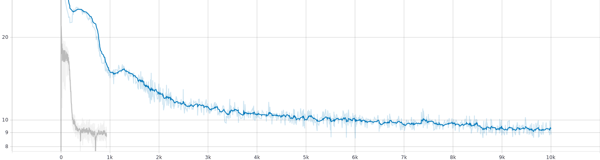

# ELECTRA For TensorFlow2
 
This repository provides a script and recipe to train the ELECTRA model for TensorFlow2 to achieve state-of-the-art accuracy, and is tested and maintained by NVIDIA.
 
 
## Table Of Contents
- [Model overview](#model-overview)
  * [Model architecture](#model-architecture)
  * [Default configuration](#default-configuration)
  * [Feature support matrix](#feature-support-matrix)
      * [Features](#features)
  * [Mixed precision training](#mixed-precision-training)
      * [Enabling mixed precision](#enabling-mixed-precision)
      * [Enabling TF32](#enabling-tf32)
  * [Glossary](#glossary)
- [Setup](#setup)
  * [Requirements](#requirements)
- [Quick Start Guide](#quick-start-guide)
- [Advanced](#advanced)
  * [Scripts and sample code](#scripts-and-sample-code)
  * [Parameters](#parameters)
    + [Pre-training parameters](#pre-training-parameters)
    + [Fine-tuning parameters](#fine-tuning-parameters)
  * [Command-line options](#command-line-options)
  * [Getting the data](#getting-the-data)
    + [Multi-dataset](#multi-dataset)
  * [Training process](#training-process)
    + [Pre-training](#pre-training)
    + [Multi-node](#multi-node)
    + [Fine-tuning](#fine-tuning)
  * [Inference process](#inference-process)
    + [Fine-tuning inference](#fine-tuning-inference)
- [Performance](#performance)
  * [Benchmarking](#benchmarking)
    + [Training performance benchmark](#training-performance-benchmark)
    + [Inference performance benchmark](#inference-performance-benchmark)
  * [Results](#results)
    + [Training accuracy results](#training-accuracy-results)
      - [Pre-training loss curves](#pre-training-loss-curves)
      - [Pre-training loss results](#pre-training-loss-results)  
      - [Fine-tuning accuracy: NVIDIA DGX A100 (8x A100 40GB)](#fine-tuning-accuracy-nvidia-dgx-a100-8x-a100-40gb)
      - [Fine-tuning accuracy: NVIDIA DGX-1 (8x V100 16GB)](#fine-tuning-accuracy-nvidia-dgx-1-8x-v100-16gb)
      - [Fine-tuning accuracy: NVIDIA DGX-2 (16x V100 32GB)](#fine-tuning-accuracy-nvidia-dgx-2-16x-v100-32gb)
      - [Training stability test](#training-stability-test)
        * [Pre-training stability test: NVIDIA DGX A100 (8x A100 40GB)](#pre-training-stability-test-nvidia-dgx-a100-8x-a100-40gb)
        * [Fine-tuning stability test: NVIDIA DGX-1 (8x V100 16GB)](#fine-tuning-stability-test-nvidia-dgx-1-8x-v100-16gb)
    + [Training performance results](#training-performance-results)
      - [Training performance: NVIDIA DGX A100 (8x A100 40GB)](#training-performance-nvidia-dgx-a100-8x-a100-40gb)
        * [Pre-training NVIDIA DGX A100 (8x A100 40GB)](#pre-training-nvidia-dgx-a100-8x-a100-40gb)
        * [Fine-tuning NVIDIA DGX A100 (8x A100 40GB)](#fine-tuning-nvidia-dgx-a100-8x-a100-40gb)
      - [Training performance: NVIDIA DGX-1 (8x V100 16GB)](#training-performance-nvidia-dgx-1-8x-v100-16gb)
        * [Pre-training NVIDIA DGX-1 (8x V100 16GB)](#pre-training-nvidia-dgx-1-8x-v100-16gb)
        * [Fine-tuning NVIDIA DGX-1 (8x V100 16GB)](#fine-tuning-nvidia-dgx-1-8x-v100-16gb)
      - [Training performance: NVIDIA DGX-2 (16x V100 32GB)](#training-performance-nvidia-dgx-2-16x-v100-32gb)
        * [Pre-training NVIDIA DGX-2 (16x V100 32GB)](#pre-training-nvidia-dgx-2-16x-v100-32gb)
        * [Fine-tuning NVIDIA DGX-2 (16x V100 32GB)](#fine-tuning-nvidia-dgx-2-16x-v100-32gb)
    + [Inference performance results](#inference-performance-results)
      - [Inference performance: NVIDIA DGX A100 (1x A100 40GB)](#inference-performance-nvidia-dgx-a100-1x-a100-40gb)
        * [Fine-tuning inference on NVIDIA DGX A100 (1x A100 40GB)](#fine-tuning-inference-on-nvidia-dgx-a100-1x-a100-40gb)
      - [Inference performance: NVIDIA T4](#inference-performance-nvidia-t4)
        * [Fine-tuning inference on NVIDIA T4](#fine-tuning-inference-on-nvidia-t4)
- [Release notes](#release-notes)
  * [Changelog](#changelog)
  * [Known issues](#known-issues)
 
## Model overview
 
Electra (Efficiently Learning an Encoder that Classifies Token Replacements Accurately), is a novel pre-training method for language representations which outperforms existing techniques, given the same compute budget on a wide array of Natural Language Processing (NLP) tasks. This model is based on the [ELECTRA: Pre-training Text Encoders as Discriminators Rather Than Generators](https://openreview.net/forum?id=r1xMH1BtvB) paper. NVIDIA's implementation of ELECTRA is an optimized version of the [Hugging Face implementation](https://huggingface.co/transformers/model_doc/electra.html), leveraging mixed precision arithmetic and Tensor Cores on Volta, Turing, and the NVIDIA Ampere GPU architectures for faster training times with state-of-the-art accuracy.
 
This repository contains the scripts to interactively launch data download, training, benchmarking and inference routines in a Docker container for pre-training on your own dataset (Wikipedia and BookCorpus shown as an example), and fine-tuning for tasks such as question answering. The major differences between the original implementation as described in the paper and this version of ELECTRA are as follows:
 
-   Scripts to download Wikipedia and BookCorpus datasets
-   Scripts to preprocess downloaded data or a custom corpus into inputs and targets for pre-training in a modular fashion
-   Automatic mixed precision (AMP) support and optimized for performance
-   Multi-GPU and Multi-node training support with push-button scripts to reach state-of-the-art accuracy and performance.
 
Other publicly available implementations of Electra include:
1. [Hugging Face](https://huggingface.co/transformers/model_doc/electra.html)
2. [Google's implementation](https://github.com/google-research/electra)
 
This model is trained with mixed precision using Tensor Cores on Volta, Turing, and the NVIDIA Ampere GPU architectures. Additionally, this model provides push-button solutions to pre-training, fine-tuning and inference and on a corpus of choice. As a result, researchers can get results up to 4x faster than training without Tensor Cores. This model is tested against each NGC monthly container release to ensure consistent accuracy and performance over time.
 
### Model architecture
 
ELECTRA is a combination of two Transformer models: a generator and a discriminator. The generator’s role is to replace tokens in a sequence, and is therefore trained as a masked language model. The discriminator, which is the model we are interested in, tries to identify which tokens were replaced by the generator in the sequence. Both generator and discriminator use the same architecture as the encoder of the Transformer. The encoder is simply a stack of Transformer blocks, which consist of a multi-head attention layer followed by successive stages of feed-forward networks and layer normalization. The multi-head attention layer performs self-attention on multiple input representations.
 

 
 
 
### Default configuration
 
ELECTRA uses a new pre-training task called replaced token detection (RTD), that trains a bidirectional model (like a MLM) while learning from all input positions (like a LM). Inspired by generative adversarial networks (GANs), instead of corrupting the input by replacing tokens with “[MASK]” as in BERT, the generator is trained to corrupt the input by replacing some input tokens with incorrect, but somewhat plausible, fakes. On the other hand, the discriminator is trained to distinguish between “real” and “fake” input data. 
 
The [Google ELECTRA repository](https://github.com/google-research/electra) reports the results for three configurations of ELECTRA, each corresponding to a unique model size. This implementation provides the same configurations by default, which are described in the table below.
 
| **Model** | **Hidden layers** | **Hidden unit size** | **Parameters** |
|:---------:|:----------:|:---:|:----:|
|ELECTRA_SMALL|12 encoder| 256 | 14M|
|ELECTRA_BASE |12 encoder| 768 |110M|
|ELECTRA_LARGE|24 encoder|1024 |335M|
 
The following features were implemented in this model:
- General:
  - Mixed precision support with TensorFlow Automatic Mixed Precision (TF-AMP)
  - Multi-GPU support using Horovod
  - XLA support
  - Multi-Node support
 
 
- Training
  - Pre-training support
  - Fine-tuning example
 
 
- Inference:
  - Joint predictions with beam search.
 
### Feature support matrix
 
The following features are supported by this model.
 
| **Feature** | **ELECTRA** |
|:---------:|:----------:|
|LAMB|Yes|
|Automatic mixed precision (AMP)|Yes|
|XLA|Yes|
|Horovod Multi-GPU|Yes|
|Multi-node|Yes|
   
#### Features
 
**Automatic Mixed Precision (AMP)**
 
This implementation of ELECTRA uses AMP to implement mixed precision training. It allows us to use FP16 training with FP32 master weights by modifying just a few lines of code.
 
**Horovod**
 
Horovod is a distributed training framework for TensorFlow, Keras, PyTorch, and MXNet. The goal of Horovod is to make distributed deep learning fast and easy to use. For more information about how to get started with Horovod, see the [Horovod: Official repository](https://github.com/horovod/horovod).
 
Multi-GPU training with Horovod
 
Our model uses Horovod to implement efficient multi-GPU training with NCCL. For details, see example sources in this repository or see the [TensorFlow tutorial](https://github.com/horovod/horovod/#usage).
 
**XLA support (experimental)**
 
XLA is a domain-specific compiler for linear algebra that can accelerate TensorFlow models with potentially no source code changes. The results are improvements in speed and memory usage: most internal benchmarks run ~1.1-1.5x faster after XLA is enabled. 
[AMP](https://nvidia.github.io/apex/amp.html) is an abbreviation used for automatic mixed precision training.
 
**Multi-node Training**
 
Supported on a Pyxis/Enroot Slurm cluster.
 
### Mixed precision training
 
Mixed precision is the combined use of different numerical precisions in a computational method. [Mixed precision](https://arxiv.org/abs/1710.03740) training offers significant computational speedup by performing operations in half-precision format, while storing minimal information in single-precision to retain as much information as possible in critical parts of the network. Since the introduction of [Tensor Cores](https://developer.nvidia.com/tensor-cores) in Volta, and following with both the Turing and Ampere architectures, significant training speedups are experienced by switching to mixed precision -- up to 3x overall speedup on the most arithmetically intense model architectures. Using mixed precision training requires two steps:
 
1.  Porting the model to use the FP16 data type where appropriate.
2.  Adding loss scaling to preserve small gradient values.
 
This can now be achieved using Automatic Mixed Precision (AMP) for TensorFlow to enable the full [mixed precision methodology](https://docs.nvidia.com/deeplearning/sdk/mixed-precision-training/index.html#tensorflow) in your existing TensorFlow model code. AMP enables mixed precision training on Volta, Turing, and NVIDIA Ampere GPU architectures automatically. The TensorFlow framework code makes all necessary model changes internally.
 
In TF-AMP, the computational graph is optimized to use as few casts as necessary and maximize the use of FP16, and the loss scaling is automatically applied inside of supported optimizers. AMP can be configured to work with the existing tf.contrib loss scaling manager by disabling the AMP scaling with a single environment variable to perform only the automatic mixed-precision optimization. It accomplishes this by automatically rewriting all computation graphs with the necessary operations to enable mixed precision training and automatic loss scaling.
 
For information about:
-   How to train using mixed precision, see the [Mixed Precision Training](https://arxiv.org/abs/1710.03740) paper and [Training With Mixed Precision](https://docs.nvidia.com/deeplearning/performance/mixed-precision-training/index.html) documentation.
-   Techniques used for mixed precision training, see the [Mixed-Precision Training of Deep Neural Networks](https://devblogs.nvidia.com/mixed-precision-training-deep-neural-networks/) blog.
-   How to access and enable AMP for TensorFlow, see [Using TF-AMP](https://docs.nvidia.com/deeplearning/dgx/tensorflow-user-guide/index.html#tfamp) from the TensorFlow User Guide.
 
 
#### Enabling mixed precision
 
This implementation exploits the TensorFlow Automatic Mixed Precision feature. To enable AMP, you simply need to supply the `--amp` flag to the `run_pretraining.py` or `run_tf_squad.py` script. For reference, enabling AMP required us to apply the following changes to the code:
 
1. Set the Keras mixed precision policy:
   ```python
   if config.amp:
       policy = tf.keras.mixed_precision.experimental.Policy("mixed_float16", loss_scale="dynamic")
       tf.keras.mixed_precision.experimental.set_policy(policy)
   ```
 
2. Use the loss scaling wrapper on the optimizer:
   ```python
   if config.amp:
        optimizer = tf.keras.mixed_precision.experimental.LossScaleOptimizer(optimizer, "dynamic")
   ```
 
3. Use scaled loss to calculate the gradients:
   ```python
   #Scale loss
   if config.amp:
       total_loss = optimizer.get_scaled_loss(total_loss)
   gradients = tape.gradient(total_loss, model.trainable_variables)
   #Get unscaled gradients if AMP
   if config.amp:
       gradients = optimizer.get_unscaled_gradients(gradients)
   ```
 
#### Enabling TF32
 
TensorFloat-32 (TF32) is the new math mode in [NVIDIA A100](https://www.nvidia.com/en-us/data-center/a100/) GPUs for handling the matrix math also called tensor operations. TF32 running on Tensor Cores in A100 GPUs can provide up to 10x speedups compared to single-precision floating-point math (FP32) on Volta GPUs. 
 
TF32 Tensor Cores can speed up networks using FP32, typically with no loss of accuracy. It is more robust than FP16 for models which require high dynamic range for weights or activations.
 
For more information, refer to the [TensorFloat-32 in the A100 GPU Accelerates AI Training, HPC up to 20x](https://blogs.nvidia.com/blog/2020/05/14/tensorfloat-32-precision-format/) blog post.
 
TF32 is supported in the NVIDIA Ampere GPU architecture and is enabled by default.
 
### Glossary
 
**Fine-tuning**  
Training an already pretrained model further using a task specific dataset for subject-specific refinements, by adding task-specific layers on top if required.
 
**Language Model**  
Assigns a probability distribution over a sequence of words. Given a sequence of words, it assigns a probability to the whole sequence.
 
**Pre-training**  
Training a model on vast amounts of data on the same (or different) task to build general understandings.
 
**Transformer**  
The paper [Attention Is All You Need](https://arxiv.org/abs/1706.03762) introduces a novel architecture called Transformer that uses an attention mechanism and transforms one sequence into another.
 
 **Phase 1**
Pretraining on samples of sequence length 128 and at most 15% masked predictions per sequence.
 
**Phase 2**
Pretraining on samples of sequence length 512 and at most 15% masked predictions per sequence.
 
## Setup
 
The following section lists the requirements that you need to meet in order to start training the ELECTRA model.
 
### Requirements
 
This repository contains Dockerfile which extends the TensorFlow2 NGC container and encapsulates some dependencies. Aside from these dependencies, ensure you have the following components:
 
-   [NVIDIA Docker](https://github.com/NVIDIA/nvidia-docker)
-   [TensorFlow2 20.07-py3 NGC container or later](https://ngc.nvidia.com/registry/nvidia-tensorflow)
-   Supported GPUs:
    - [NVIDIA Volta architecture](https://www.nvidia.com/en-us/data-center/volta-gpu-architecture/)
    - [NVIDIA Turing architecture](https://www.nvidia.com/en-us/geforce/turing/)
    - [NVIDIA Ampere architecture](https://www.nvidia.com/en-us/data-center/nvidia-ampere-gpu-architecture/)
 
For more information about how to get started with NGC containers, see the following sections from the NVIDIA GPU Cloud Documentation and the Deep Learning Documentation:
-   [Getting Started Using NVIDIA GPU Cloud](https://docs.nvidia.com/ngc/ngc-getting-started-guide/index.html)
-   [Accessing And Pulling From The NGC Container Registry](https://docs.nvidia.com/deeplearning/dgx/user-guide/index.html#accessing_registry)
-   [Running TensorFlow2](https://docs.nvidia.com/deeplearning/frameworks/tensorflow-release-notes/running.html#running)
 
For those unable to use the TensorFlow 2 NGC container, to set up the required environment or create your own container, see the versioned [NVIDIA Container Support Matrix](https://docs.nvidia.com/deeplearning/dgx/support-matrix/index.html).
 
For multi-node, the sample provided in this repository requires [Enroot](https://github.com/NVIDIA/enroot) and [Pyxis](https://github.com/NVIDIA/pyxis) set up on a [SLURM](https://slurm.schedmd.com) cluster.
 
More information on how to set up and launch can be found in the [Multi-node Documentation](https://docs.nvidia.com/ngc/multi-node-bert-user-guide).
 
## Quick Start Guide
 
To train your model using mixed precision or TF32 precision with Tensor Cores or using FP32, perform the following steps using the default parameters of the ELECTRA model. The default parameters for pre-training have been set to run on both 8x A100 40G and 8 x V100 32G GPUs. For the specifics concerning training and inference, see the [Advanced](#advanced) section.
 
1. Clone the repository.
 
```
git clone https://github.com/NVIDIA/DeepLearningExamples.git
cd DeepLearningExamples/TensorFlow2/LanguageModeling/ELECTRA
```
 
2. Build ELECTRA on top of the NGC container.
```
bash scripts/docker/build.sh
```
 
3. Start an interactive session in the NGC container to run data download, training and inference.
```
bash scripts/docker/launch.sh
```
 
Resultant logs of pre-training and fine-tuning routines are stored in the `results/` folder. Checkpoints are stored in the `results/<model-name>/` folder.
 
Required data is downloaded into the `data/` directory by default.
 
4. Download and preprocess the dataset.
 
This repository provides scripts to download, verify, and extract the following datasets:
 
-   [SQuAD](https://rajpurkar.github.io/SQuAD-explorer/) (fine-tuning for question answering)
-   Wikipedia (pre-training)
-   BookCorpus (pre-training)
 
To download, verify, extract the datasets, and create the shards in `tfrecord` format, run:
```
/workspace/electra/data/create_datasets_from_start.sh
```
 
Note: For fine-tuning only, Wikipedia and Bookscorpus dataset download and preprocessing can be skipped by commenting it out.
 
- Download Wikipedia only for pretraining
 
The pre-training dataset is 170GB+ and takes 15+ hours to download. The BookCorpus server most of the time gets overloaded and also contains broken links resulting in HTTP 403 and 503 errors. Hence, it is recommended to skip downloading BookCorpus data by running:
 
```
/workspace/electra/data/create_datasets_from_start.sh wiki_only
```
 
- Download Wikipedia and BookCorpus
 
Users are welcome to download the BookCorpus from other sources to match our accuracy, or repeatedly try our script until the required number of files are downloaded by running the following:
```
/workspace/electra/data/create_datasets_from_start.sh wiki_books
```
 
Note: Not using the BookCorpus can potentially change the final accuracy on a few downstream tasks.
 
5. Start pretraining.
 
To run on a single node 8 x V100 32G, from within the container, you can use the following script to run pre-training.
```
bash scripts/run_pretraining.sh
```
 
The default hyperparameters are set to run on both 8 x A100 40G and 8 x V100 32G.
 
For the other platforms, the configs present in `scripts/configs/pretrain_config.sh` can be used as shown below:
```
bash scripts/run_pretraining.sh $(source scripts/configs/pretrain_config.sh && dgxa100_8gpu_amp)
```
 
To run pre-training on multiple nodes, see the [Multi-node](#multi-node) section.
 
6. Postprocess pretrained checkpoint and fine-tune on SQuAD dataset
 
The above pretrained ELECTRA model representations can be fine-tuned with just one additional output layer for a state-of-the-art question answering system. Running the following script extracts and saves the discriminator and generator from the pretrained checkpoint and fine-tunes the discriminator on SQuAD:
 
```
checkpoints=results/base/checkpoints bash scripts/finetune_ckpts_on_squad.sh
```
 
It internally runs `postprocess_pretrained_ckpt.py` which extracts and saves the discriminator and the generator from the pretrained checkpoint.
 
The default hyperparameters are set to run on 8 x V100 16G.
 
To run fine-tuning with the SQuAD dataset on Google's pretrained checkpoints, do the following.
```
bash scripts/run_squad.sh
```
 
For other platforms, configs present in `scripts/configs/squad_config.sh` can be used as shown below:
```
bash scripts/run_squad.sh $(source scripts/configs/squad_config.sh && dgxa100_8gpu_amp) train_eval
```
 
7. Start validation/evaluation.
 
Validation can be performed by running:
```
bash scripts/run_squad.sh $(source scripts/configs/squad_config.sh && dgxa100_8gpu_amp) eval
```
Running training first is required to generate needed checkpoints.
 
8. Start inference/predictions.
 
Inference can be performed by running:
```
bash scripts/run_squad.sh $(source scripts/configs/squad_config.sh && dgxa100_8gpu_amp) prediction
```
Inference predictions are saved to `<OUTPUT_DIRECTORY>/predictions.json`.
 
## Advanced
 
The following sections provide greater details of the datasets, running training and inference, and the training results.
 
### Scripts and sample code
 
Descriptions of the key scripts and folders are provided below.
 
-   `data/` - Contains scripts for downloading and preparing individual datasets, and will contain downloaded and processed datasets.
-   `scripts/` - Contains shell scripts to launch the Docker container, data download, pre-training, fine-tuning and inference.
-   `results/` - Folder where all training and inference results get stored by default.
-   `run_squad.sh`  - Interface for launching question answering fine-tuning with `run_tf_squad.py`.
-   `run_pretraining.sh`  - Interface for launching ELECTRA pre-training with `run_pretraining.py`.
-   `finetune_ckpts_on_squad.sh` - Interface for extracting and saving discriminator and generator from the pretrained checkpoint and run SQuAD fine-tuning on discriminator.
-   `build_pretraining_dataset.py` - Creates `tfrecord` files from shared text files in the final step of dataset creation.
-   `postprocess_pretrained_ckpt.py` - Converts pretrained checkpoint to discriminator checkpoint and generator checkpoint which can be fed into `run_tf_squad.py`.
-   `modeling.py` - Implements the ELECTRA pre-training and fine-tuning model architectures with TensorFlow2.
-   `optimization.py` - Implements the Adam optimizer, LAMB and the learning rate schedule with TensorFlow2.
-   `configuration.py` - Implements parent class for model config.
-   `tokenization.py` - Implements the ELECTRA tokenizer.
-   `run_pretraining.py` - Implements ELECTRA pre-training.
-   `pretrain_utils.py` - Utilities required for pre-training such as dynamic masking etc.,
-   `run_tf_squad.py` - Implements fine-tuning training and evaluation for question answering on the [SQuAD](https://rajpurkar.github.io/SQuAD-explorer/) dataset.
-   `inference.py` - Implements interactive question answering.
-   `postprocess_pretrained_ckpt.py` - Implements extracting and saving the discriminator and the generator from the pretrained checkpoint.
 
 
### Parameters
 
#### Pre-training parameters
 
ELECTRA is designed to pre-train deep bidirectional networks for language representations. The following scripts replicate pre-training on Wikipedia + BookCorpus from this [paper](https://openreview.net/forum?id=r1xMH1BtvB). These scripts are general and can be used for pre-training language representations on any corpus of choice.
 
In the parameters expected by `scripts/run_pretraining.sh`, `p1` stands for phase 1 whereas `p2` stands for phase 2 training. They are as follows:
 
-   `<training_batch_size_p1>` is per-GPU batch size used for training. Larger batch sizes run more efficiently, but require more GPU memory. Default is 176.
-   `<learning_rate_p1>` is the base learning rate for training. Default is 6e-3.
-   `<precision>` is the type of math in your model, can be either `fp32` or `amp`. Default is `amp`. The options mean:
    -   FP32: 32-bit IEEE single precision float format.
    -   AMP: Automatic mixed precision 16 and 32-bit float format.
-   `<num_gpus>` is the number of GPUs to use for training. Must be equal to or smaller than the number of GPUs attached to your node. Default is 8.
-   `<warmup_steps_p1>` is the percentage of training steps used for warm-up at the start of training. Default is 2000.
-   `<train_steps_p1>` is the total number of training steps. Default is 10000.
-   `<save_checkpoint_steps>` controls how often checkpoints are saved. Default is 500.
-   `<resume_training>` if set to `true`, training should resume from the latest model in `/results/checkpoints`. Default is `false`.
-   `<accumulate_gradient>` a flag indicating whether a larger batch should be simulated with gradient accumulation. Default is `true`.
-   `<gradient_accumulation_steps_p1>` an integer indicating the number of steps to accumulate gradients over. Effective batch size / GPU = `training_batch_size` x `gradient_accumulation_steps`. Default is 48.
-   `<seed>` random seed for the run.
 
-  `<training_batch_size_p2>` is per-GPU batch size used for training in phase 2. Larger batch sizes run more efficiently, but require more memory. Default is 24.
-   `<learning_rate_p2>` is the base learning rate for training phase 2. Default is 4e-3.
-   `<warmup_steps_p2>` is the percentage of training steps used for warm-up at the start of training. Default is 200.
-   `<training_steps_p2>` is the total number of training steps for phase 2, to be continued in addition to phase 1. Default is 930.
-   `<gradient_accumulation_steps_p2>` an integer indicating the number of steps to accumulate gradients over in phase 2. Effective batch size / GPU = `training_batch_size_p2` * `gradient_accumulation_steps_p2`. Default is 144.
-   `<init_checkpoint>` A checkpoint to start the pre-training routine on (Usually a ELECTRA pretrained checkpoint). Default is `None`.
 
 
The complete list of the available parameters for the `run_pretraining.py` script are:
 
```
  --model_name MODEL_NAME
                              - Model name, used to define the name of the results folder.
 
  --pretrain_tfrecords PRETRAIN_TFRECORDS
                              - Specifies tfrecord files used for pretraining.
 
  --max_seq_length MAX_SEQ_LENGTH
                              - The maximum total input sequence length after
                                WordPiece tokenization. Sequences longer than
                                this will be truncated, and sequences shorter
                                than this will be padded.
 
  --mask_prob MASK_PROB       - Percentage of input tokens to mask out / replace.
 
  --disc_weight DISC_WEIGHT
                              - Ratio of discriminator loss over generator loss.
 
  --generator_hidden_size GENERATOR_HIDDEN_SIZE
                              - Fraction of discriminator hidden size for generator.
 
  --train_batch_size TRAIN_BATCH_SIZE
                              - Batch size per GPU for training.
 
  --learning_rate LEARNING_RATE
                              - The initial learning rate for the optimizer.
 
  --num_train_steps NUM_TRAIN_STEPS
                              - Total number of training steps to perform.
 
  --num_warmup_steps NUM_WARMUP_STEPS
                              - Number of steps of training to perform linear learning
                                rate warmup for. For example, 0.1 = 10% of training.
 
  --seed SEED                 - Sets the seed to use for random number generation.
 
  --gradient_accumulation_steps GRADIENT_ACCUMULATION_STEPS
                              - Number of update steps to accumulate before
                                performing a backward/update pass.
 
  --fp16_compression          - Whether to use 16-bit all reduce
 
  --amp                       - If set, will perform computations using
                                automatic mixed precision.
 
  --log_freq LOG_FREQ         - If set, the script will output the training
                                loss every LOG_FREQ steps.
 
  --save_checkpoints_steps SAVE_CHECKPOINTS_STEPS
                              - Checkpoints saving frequency.
 
  --keep_checkpoint_max KEEP_CHECKPOINT_MAX
                              - Maximum number of checkpoints to keep.
 
  --restore_checkpoint RESTORE_CHECKPOINT
                              - Whether to restore from a checkpoint; if specified,
                                set to `path-to-checkpoint` or `latest`
 
  --phase2                    - Specified if training on phase 2 only. 
                                If not specified, default pre-training is on phase 1.
 
  --optimizer OPTIMIZER       - Specifies optimizer, `adam` or `lamb`.
 
  --skip_adaptive             - Whether to apply adaptive learning rate on LayerNorm and biases.
 
  --gradient_accumulation_steps GRADIENT_ACCUMULATION_STEPS
                              - Number of steps to accumulate gradients across before
                                performing an update.
 
  --lr_decay_power LR_DECAY_POWER
                              - Learning rate polynomial decay power.
 
  --opt_beta_1 OPT_BETA_1     - beta2 of optimizer.
 
  --opt_beta_2 OPT_BETA_2     - beta2 of optimizer.
 
  --end_lr END_LR             - Ending learning rate.
 
```
 
#### Fine-tuning parameters
 
Default arguments are listed below in the order `scripts/run_squad.sh` expects:
 
-   ELECTRA MODEL - The default is `"google/electra-base-discriminator"`.
-   Number of training Epochs - The default is `2`.
-   Batch size - The default is `16`.
-   Learning rate - The default is `4e-4`.
-   Precision (either `amp`, `tf32` or `fp32`) - The default is `amp`.
-   Number of GPUs - The default is `8`.
-   Seed - The default is `1`.
-   SQuAD version - The default is `1.1`
-   SQuAD directory -  The default is `/workspace/electra/data/download/squad/v$SQUAD_VERSION`.
-   Output directory for result - The default is `results/`.
-   Initialize checkpoint - The default is `"None"`
-   Mode (`train`, `eval`, `train_eval`, `prediction`) - The default is `train_eval`.
 
The script saves the checkpoint at the end of each epoch to the `checkpoints/` folder.
 
The main script `run_tf_squad.py` specific parameters are:
 
```
 --electra_model ELECTRA_MODEL     - Specifies the type of ELECTRA model to use;
                                     should be the discriminator of a pretrained checkpoint(output of postprocess_pretrained_ckpt.py)
                                     or one of the following:
              google/electra-small-generator
                google/electra-base-generator
                google/electra-large-generator
                google/electra-small-discriminator
                google/electra-base-discriminator
                google/electra-large-discriminator
 
 --amp                        - If set, will perform computations using
                                automatic mixed precision.
 
 --data_dir DATA_DIR          - Path to the SQuAD json for training and evaluation.
 
 --max_seq_length MAX_SEQ_LENGTH
                              - The maximum total input sequence length
                                after WordPiece tokenization.
                                Sequences longer than this will be truncated,
                                and sequences shorter than this will be padded.
 
 --doc_stride DOC_STRIDE      - When splitting up a long document into chunks
                                this parameters sets how much stride to take
                                between chunks of tokens.
 
 --max_query_length MAX_QUERY_LENGTH
                              - The maximum number of tokens for the question.
                                Questions longer than <max_query_length>
                                will be truncated to the value specified.
 
 --n_best_size N_BEST_SIZE       - The total number of n-best predictions to
                                generate in the nbest_predictions.json
                                output file.
 
 --max_answer_length MAX_ANSWER_LENGTH
                              - The maximum length of an answer that can be
                                generated. This is needed because the start and
                                end predictions are not conditioned on one another.
    
 --joint_head <True|False>    - If true, beam search will be used to jointly predict
                                the start and end positions. Default is True.
 
 --beam_size BEAM_SIZE        - The beam size used to do joint predictions. The default value is 5.
 
 --verbose_logging            - If true, all the warnings related to data
                                processing will be printed. A number of warnings
                                are expected for a normal SQuAD evaluation.
 
 --do_lower_case              - Whether to lower case the input text. Set to
                                true for uncased models and false for cased models.
 
 --version_2_with_negative       - If true, the SQuAD examples contain questions
                                that do not have an answer.
 
 --null_score_diff_threshold NULL_SCORE_DIFF_THRES HOLD
                              - A null answer will be predicted if null_score
                                is greater than NULL_SCORE_DIFF_THRESHOLD.
```
 
### Command-line options
 
To see the full list of available options and their descriptions, use the `-h` or `--help` command line option, for example:
 
`python run_pretraining.py --help`
 
`python run_tf_squad.py --help`
 
Detailed descriptions of command-line options can be found in the [Parameters](#parameters) section.
 
### Getting the data
 
For pre-training ELECTRA, we use the concatenation of Wikipedia (2500M words) as well as BookCorpus (800M words). For Wikipedia, we extract only the text passages and ignore headers, lists, and tables. ELECTRA requires that datasets are structured as a document level corpus rather than a shuffled sentence level corpus because it is critical to extract long contiguous sentences.
 
The preparation of the pre-training dataset is described in the `dataPrep.py` script found in the `data/` folder. The component steps in the automated scripts to prepare the datasets are as follows:
 
1.  Data download and extract - the dataset is downloaded and extracted.
 
2.  Clean and format - document tags, etc. are removed from the dataset.
 
3.  Sentence segmentation - the corpus text file is processed into separate sentences.
 
4.  Sharding - the sentence segmented corpus file is split into a number of uniformly distributed smaller text documents.
 
5.  `tfrecord` file creation - each text file shard is processed by the `build_pretraining_dataset.py` script to produce a corresponding `tfrecord` file. The script generates input data for the input text shard.
 
The tools used for preparing the BookCorpus and Wikipedia datasets can be applied to prepare an arbitrary corpus. The `create_datasets_from_start.sh` script in the `data/` directory applies sentence segmentation, sharding, and `tfrecord` file creation given an arbitrary text file containing a document-separated text corpus.
 
For fine-tuning a pre-trained ELECTRA model for specific tasks, by default this repository prepares the following dataset:
 
-   [SQuAD](https://rajpurkar.github.io/SQuAD-explorer/): for question answering
 
Depending on the speed of your internet connection, this process takes about a day to complete. The BookCorpus server could sometimes get overloaded and also contain broken links resulting in HTTP 403 and 503 errors. You can either skip the missing files or retry downloading at a later time.
 
 
#### Multi-dataset
 
This repository provides functionality to combine multiple datasets into a single dataset for pre-training on a diverse text corpus at the shard level. Currently Wikipedia and BookCorpus get merged in `data/create_datasets_from_start.sh`. Snippets to download and format more text corpuses can be added to `data/dataPrep.py`. The sharding scheme combines multiple corpuses together and splits them into the required number of training(90%) and testing(10%) shards. Once the data is sharded, the `build_pretraining_dataset.py` converts raw text shards to tokenized segments and saves the dataset to the `data` directory in TFRecord format. This dataset can now be used to pre-train ELECTRA.
 
 
### Training process
 
The training process consists of two steps: pre-training and fine-tuning.
 
#### Pre-training
 
Pre-training is performed using `run_pretraining.py` along with parameters defined in `scripts/run_pretraining.sh` and `scripts/configs/pretrain_configs.sh`.
 
The `run_pretraining.sh` script runs a job on a single node that trains the ELECTRA-base model from scratch using Wikipedia and BookCorpus datasets as training data using the LAMB optimizer.
 
Phase 1: (Maximum sequence length of 128)
-   Runs on 8 GPUs with training batch size of 176 per GPU
-   Uses a learning rate of 6e-3
-   Has FP16 precision enabled
-   Runs for 10000 steps, where the first 2000 are warm-up steps
-   Saves a checkpoint every 500 iterations (keeps only the latest 5 checkpoints) and at the end of training. All checkpoints, and training logs are saved to the `results/<model_name>` directory.
-   Creates a log file containing all the output
 
Phase 2: (Maximum sequence length of 512)
-   Runs on 8 GPUs with training batch size of 24 per GPU
-   Uses a learning rate of 4e-3
-   Has FP16 precision enabled
-   Runs for 930 steps, where the first 200 are warm-up steps
-   Saves a checkpoint every 500 iterations (keeps only the latest 5 checkpoints) and at the end of training. All checkpoints, and training logs are saved to the `results/<model_name>` directory.
-   Creates a log file containing all the output
 
Specific configs available at `scripts/configs/pretrain_config.sh` can be run as follows:
```
bash scripts/run_pretraining.sh $(source scripts/configs/pretrain_config.sh && dgxa100_8gpu_amp)
bash scripts/run_pretraining.sh $(source scripts/configs/pretrain_config.sh && dgx2_16gpu_amp)
bash scripts/run_pretraining.sh $(source scripts/configs/pretrain_config.sh && dgx1_8gpu_amp)
```
 
The above commands will train ELECTRA based on Wikipedia and BookCorpus to state-of-the-art accuracy on any DGX platform using FP16 arithmetic. Around 96% of the training sequences are of length 128 (phase 1 of training) and less than 4% of the training sequences are of length 512 (phase 2 of training).
 
In order to run pre-training routine on an initial checkpoint, perform the following in `scripts/run_pretraining.sh`:
-   set `restore_checkpoint=<path_to_checkpoint>`
-   Note: The parameter value assigned to `--model_size` during training should remain unchanged. Also, to resume pre-training on your corpus of choice, the training dataset should be created using the same vocabulary file used in `data/create_datasets_from_start.sh`.
 
 
#### Multi-node
 
Multi-node runs can be launched on a Pyxis/enroot Slurm cluster (see [Requirements](#requirements)) with the `run.sub` script with the following command for a 48-node NVIDIA DGX A100 example for both phase 1 and phase 2:
 
```
BATCHSIZE=176 LR=6e-3 GRAD_ACCUM_STEPS=1 PHASE=1 STEPS=10000 WARMUP=2000 b1=0.878 b2=0.974 decay=0.5 skip_adaptive=yes end_lr=0.0 sbatch N48 --ntasks-per-node=8 run.sub
BATCHSIZE=24 LR=4e-3 GRAD_ACCUM_STEPS=3 PHASE=2 STEPS=930 WARMUP=200 b1=0.878 b2=0.974 decay=0.5 skip_adaptive=yes end_lr=0.0 sbatch N48 --ntasks-per-node=8 run.sub
```
 
Checkpoint after phase 1 will be saved in `<results_dir>/models/<model_name>`. The checkpoint will be automatically picked up to resume training on phase 2. Note that phase 2 should be run after phase 1.
 
The batch variables `BATCHSIZE`, `LR`, `GRAD_ACCUM_STEPS`, `PHASE`, `STEPS`, `WARMUP`, `b1`, `b2`, `decay`, `skip_adaptive` and `end_lr` refer to the Python arguments `train_batch_size`, `learning_rate`, `gradient_accumulation_steps`, `phase2`, `num_train_steps`, `num_warmup_steps`, `opt_beta_1`, `opt_beta_2`, `lr_decay_power`, `skip_adaptive` and `end_lr` in `run_pretraining.py` respectively.
 
Note that the `run.sub` script is a starting point that has to be adapted depending on the environment. In particular, variables such as `docker_image` and `datadir` handle the location of the files for each phase.
 
Refer to the files contents to see the full list of variables to adjust for your system.
 
 
#### Fine-tuning
 
Fine-tuning is provided for a variety of tasks. The following tasks are included with this repository through the following scripts:
 
-   Question Answering (`scripts/run_squad.sh`)
 
By default, each Python script implements fine-tuning a pre-trained ELECTRA model for a specified number of training epochs as well as evaluation of the fine-tuned model. Each shell script invokes the associated Python script with the following default parameters:
 
-   Uses 8 GPUs
-   Has FP16 precision enabled
-   Has XLA enabled
-   Saves a checkpoint at the end of training to the `checkpoints/` folder
 
Specific configs available at `scripts/configs/squad_configs.sh` can be run as follows:
```
bash scripts/run_squad.sh $(source scripts/configs/squad_config.sh && dgxa100_8gpu_amp) train_eval
bash scripts/run_squad.sh $(source scripts/configs/squad_config.sh && dgx2_16gpu_amp) train_eval
bash scripts/run_squad.sh $(source scripts/configs/squad_config.sh && dgx1_8gpu_amp) train_eval
```
 
Fine-tuning Python scripts implement support for mixed precision and multi-GPU training through [Horovod](https://github.com/horovod/horovod). For a full list of parameters and associated explanations, see the [Parameters](#parameters) section.
 
All fine-tuning shell scripts have the same positional arguments, outlined below:
 
```bash scripts/run_squad.sh <pretrained electra model> <epochs> <batch size> <learning rate> <amp|fp32> <num_gpus> <seed> <SQuAD version> <path to SQuAD dataset> <results directory> <checkpoint_to_load> <mode (either `train`, `eval` or `train_eval`)>```
 
By default, the mode positional argument is set to `train_eval`. See the [Fine-tuning parameters](#fine-tuning-parameters) for explanations of each positional argument.
 
Note: The first positional argument (the path to the checkpoint to load) is required.
 
Each fine-tuning script assumes that the corresponding dataset files exist in the `data/` directory or separate path can be a command-line input to `run_squad.sh`.
 
### Inference process
 
#### Fine-tuning inference
 
Evaluation fine-tuning is enabled by the same scripts as training:
 
-   Question Answering (`scripts/run_squad.sh`)
 
The mode positional argument of the shell script is used to run in evaluation mode. The fine-tuned ELECTRA model will be run on the evaluation dataset, and the evaluation loss and accuracy will be displayed.
 
Each inference shell script expects dataset files to exist in the same locations as the corresponding training scripts. The inference scripts can be run with default settings. By setting the `mode` variable in the script to either `eval` or `prediction` flag, you can choose between running predictions and evaluating them on a given dataset or just the former.
 
`bash scripts/run_squad.sh <pretrained electra model> <epochs> <batch size> <learning rate> <amp|fp32> <num_gpus> <seed> <SQuAD version> <path to SQuAD dataset> <results directory> <path to fine-tuned model checkpoint> <eval or prediction>`
 
To run inference interactively on question-context pairs, use the script `run_inference.py` as follows:
 
`python run_inference.py --electra_model <electra_model_type> --init_checkpoint <fine_tuned_checkpoint>  --question="What food does Harry like?" --context="My name is Harry and I grew up in Canada. I love apples."`
 
 
## Performance

The performance measurements in this document were conducted at the time of publication and may not reflect the performance achieved from NVIDIA’s latest software release. For the most up-to-date performance measurements, go to [NVIDIA Data Center Deep Learning Product Performance](https://developer.nvidia.com/deep-learning-performance-training-inference).
 
### Benchmarking
 
The following section shows how to run benchmarks measuring the model performance in training and inference modes.
 
#### Training performance benchmark
 
Training performance benchmarks for both pre-training phases can be obtained by running `scripts/benchmark_pretraining.sh`. Default parameters are set to run a few training steps for a converging NVIDIA DGX A100 system.
 
To benchmark training performance with other parameters, run:
```
bash scripts/benchmark_pretraining.sh <train_batch_size_p1> <amp|tf32|fp32> <xla|no_xla> <num_gpus> <accumulate_gradients=true|false> <gradient_accumulation_steps_p1> <train_batch_size_p2> <gradient_accumulation_steps_p2> <base> 
```
 
An example call used to generate throughput numbers:
```
bash scripts/benchmark_pretraining.sh 88 amp xla 8 true 2 12 4 base
```
 
Training performance benchmarks for fine-tuning can be obtained by running `scripts/benchmark_squad.sh`. The required parameters can be passed through the command-line as described in [Training process](#training-process). The performance information is printed after 200 training iterations.
 
To benchmark the training performance on a specific batch size, run:
```
bash scripts/benchmark_squad.sh train <num_gpus> <batch size> <infer_batch_size> <amp|tf32|fp32> <SQuAD version> <path to SQuAD dataset> <results directory> <checkpoint_to_load> <cache_Dir>
```
 
An example call used to generate throughput numbers:
```
bash scripts/benchmark_squad.sh train 8 16
```
 
#### Inference performance benchmark
 
Inference performance benchmarks fine-tuning can be obtained by running `scripts/benchmark_squad.sh`. The required parameters can be passed through the command-line as described in [Inference process](#inference-process). This script runs one epoch by default on the SQuAD v1.1 dataset and extracts the average performance for the given configuration. 
 
To benchmark the training performance on a specific batch size, run:
`bash scripts/benchmark_squad.sh train <num_gpus> <batch size> <infer_batch_size> <amp|fp32> <SQuAD version> <path to SQuAD dataset> <results directory> <checkpoint_to_load> <cache_Dir>`
 
An example call used to generate throughput numbers:
`bash scripts/benchmark_squad.sh eval 8 256`
  
 
### Results
 
The following sections provide details on how we achieved our performance and accuracy in training and inference. All results are on ELECTRA-base model and on SQuAD v1.1 dataset with a sequence length of 384 unless otherwise mentioned.
 
#### Training accuracy results
 
##### Pre-training loss curves

 
Phase 1 is shown by the blue curve and Phase 2 by the grey. Y axis stands for the total loss and x axis for the total steps trained.
 
##### Pre-training loss results
 
| DGX System | GPUs | Batch size / GPU (Phase 1 and Phase 2) | Accumulation steps (Phase 1 and Phase 2) | Final Loss - TF32/FP32 | Final Loss - mixed precision | Time to train(hours) - TF32/FP32 | Time to train(hours) - mixed precision | Time to train speedup (TF32/FP32 to mixed precision)
|---|---|---|---|---|---|---|---|---
|48 x DGX A100 |8 |176 and 24 |1 and 3   |8.686|8.68|1.61  |1.126|1.43  
|24 x DGX-2H   |16|176 and 24 |1 and 3   |8.72 |8.67|5.58  |1.74 |3.20
|1 x DGX A100  |8 |176 and 24 |48 and 144|-    |-   |54.84 |30.47|1.8
|1 x DGX-1 16G |8 |88 and 12  |96 and 288|-    |-   |241.8 |65.1 |3.71
|1 x DGX-2 32G |16|176 and 24 |24 and 72 |-    |-   |109.97|29.08|3.78
 
In the above table, FP32 and TF32 runs were made at half the batch per GPU and twice the gradient accumulation steps of a run with mixed precision in order to not run out of memory.
 
 
The SQuAD fine-tuning scripts by default train on [Google's ELECTRA++ base pretrained checkpoint](https://github.com/google-research/electra#released-models) which uses around 10x training dataset (dataset used by XLNet authors) and greater than 5x training steps compared to the training recipe in `scripts/run_pretraining.sh`. The latter trains and achieves state-of-the-art accuracy on Wikipedia and BookCorpus datasets only.
 
##### Fine-tuning accuracy: NVIDIA DGX A100 (8x A100 40GB)
 
Our results were obtained by running the `scripts/run_squad.sh` training script in the tensorflow:20.07-tf2-py3 NGC container on NVIDIA DGX A100 (8x A100 40GB) GPUs. 
 
*ELECTRA BASE++*
 
| GPUs    | Batch size / GPU    | Accuracy / F1 - FP32  | Accuracy / F1 - mixed precision  |   Time to train - TF32 (sec) |  Time to train - mixed precision (sec) | Time to train speedup (FP32 to mixed precision) | 
|---------|---------------------|------------------|-----------------------------|--------------------------|---------------------------------|-------------------------------------------------|
|   1   |       32            |           87.19 / 92.85       |              87.19 / 92.84               |          1699                |               749                  |                    2.27         |
|   8   |       32            |           86.84 / 92.57      |                86.83 / 92.56            |          263                |               201                  |                    1.30         |
 
 
##### Fine-tuning accuracy: NVIDIA DGX-1 (8x V100 16GB)
 
Our results were obtained by running the `scripts/run_squad.sh` training script in the tensorflow:20.07-tf2-py3 NGC container on NVIDIA DGX-1 with (8x V100 16GB) GPUs.
 
*ELECTRA BASE++*
 
| GPUs    | Batch size / GPU (FP32 : mixed precision)   | Accuracy / F1 - FP32  | Accuracy / F1 - mixed precision  |   Time to train - FP32 (sec) |  Time to train - mixed precision (sec) | Time to train speedup (FP32 to mixed precision) |       
|---------|---------------------|------------------|-----------------------------|--------------------------|---------------------------------|-------------------------------------------------|
|   1   |          8 : 16           |         87.36 / 92.82        |             87.32 / 92.74              |              5136            |                  1378               |          3.73                 |
|   8   |          8 : 16           |         87.02 / 92.73       |             87.02 / 92.72              |              730            |                  334               |          2.18                 |
 
*ELECTRA BASE checkpoint Wikipedia and BookCorpus*
 
GPUs | SQuAD version| Batch size / GPU (FP32 : mixed precision)   | Accuracy / F1 - FP32  | Accuracy / F1 - mixed precision  |   Time to train - FP32 (sec) |  Time to train - mixed precision (sec) | Time to train speedup (FP32 to mixed precision) |       
|---------|-----|----------------|------------------|-----------------------------|--------------------------|---------------------------------|-------------------------------------------------|
|   8   |  v1.1 |        8 : 16           |         85.00 / 90.94        |             85.04 / 90.96              |              5136            |                  1378               |          3.73                 |
|   8   |  v2.0 |        8 : 16           |         80.517 / 83.36       |             80.523 / 83.43              |              730            |                  334               |          2.18      
 
##### Fine-tuning accuracy: NVIDIA DGX-2 (16x V100 32GB)
 
Our results were obtained by running the `scripts/run_squad.sh` training script in the tensorflow:20.07-tf2-py3 NGC container on NVIDIA DGX-2 (16x V100 32G) GPUs.
 
*ELECTRA BASE++*
 
| GPUs    | Batch size / GPU    | Accuracy / F1 - FP32  | Accuracy / F1 - mixed precision  |   Time to train - FP32 (sec) |  Time to train - mixed precision (sec) | Time to train speedup (FP32 to mixed precision) |       
|---------|---------------------|------------------|-----------------------------|--------------------------|---------------------------------|-------------------------------------------------|
|   1   |          32           |         87.14 / 92.69        |             86.95 / 92.69              |              4478            |                  1162               |          3.85                 |
|   16   |          32           |         86.95 / 90.58         |             86.93 / 92.48               |              333            |                  229               |          1.45                 |
 
  
##### Training stability test
 
###### Pre-training stability test: NVIDIA DGX A100 (8x A100 40GB)
 
*ELECTRA BASE Wikipedia and BookCorpus*
 
Training stability with 48 x DGX A100, TF32 computations and loss reported after Phase 2:
 
| Accuracy Metric | Seed 1 | Seed 2 | Seed 3 | Seed 4 | Seed 5 | Mean | Standard Deviation
|---|---|---|---|---|---|---|---
|Final Loss| 8.72 | 8.69 | 8.71 | 8.7 | 8.68 | 8.7 | 0.015
 
###### Fine-tuning stability test: NVIDIA DGX-1 (8x V100 16GB)
 
*ELECTRA BASE++*
 
Training stability with 8 GPUs, FP16 computations, batch size of 16 on SQuAD v1.1:
  
| Accuracy Metric | Seed 1 | Seed 2 | Seed 3 | Seed 4 | Seed 5 | Mean | Standard Deviation
|---|---|---|---|---|---|---|---
|Exact Match %| 86.99 | 86.81 | 86.95 | 87.10 | 87.26 | 87.02 | 0.17
| f1 % | 92.7 | 92.66 | 92.65 |  92.61 | 92.97 | 92.72 | 0.14
 
 Training stability with 8 GPUs, FP16 computations, batch size of 16 on SQuAD v2.0:
 
| Accuracy Metric | Seed 1 | Seed 2 | Seed 3 | Seed 4 | Seed 5 | Mean | Standard Deviation
|---|---|---|---|---|---|---|---
|Exact Match %| 83.00 | 82.84 | 83.11 | 82.70 | 82.94 | 82.91 | 0.15
| f1 % | 85.63 | 85.48 | 85.69 | 85.31 | 85.57 | 85.54 | 0.15
 
#### Training performance results
 
##### Training performance: NVIDIA DGX A100 (8x A100 40GB)
 
Our results were obtained by running the `scripts/benchmark_squad.sh` training script in the tensorflow:20.07-tf2-py3 NGC container on NVIDIA DGX A100 (8x A100 40GB) GPUs. Performance numbers (in items/images per second) were averaged over an entire training epoch.
 
###### Pre-training NVIDIA DGX A100 (8x A100 40GB)
 
| GPUs | Batch size / GPU (TF32 and FP16) | Accumulation steps (TF32 and FP16) | Sequence length | Throughput - TF32(sequences/sec) | Throughput - mixed precision(sequences/sec) | Throughput speedup (TF32 - mixed precision) | Weak scaling - TF32 | Weak scaling - mixed precision
|------------------|----------------------|----------------------|-------------------|-----------------------------------------------|------------------------------------|---------------------------------|----------------------|----------------------------------------------
|1 | 88 and 176| 768 and 384  | 128| 533 |955 |1.79|1.00| 1.00
|8 | 88 and 176| 96 and 48    | 128| 4202|7512|1.79|7.88| 7.87
|1 | 12 and 24 | 2304 and 1152| 512| 90  |171 |1.90|1.00| 1.00
|8 | 12 and 24 | 288 and 144  | 512| 716 |1347|1.88|7.96| 7.88 
 
###### Fine-tuning NVIDIA DGX A100 (8x A100 40GB)
  
| GPUs | Batch size / GPU | Sequence length | Throughput - TF32 (sequences/sec) | Throughput - mixed precision (sequences/sec) | Throughput speedup (TF32 - mixed precision) | Weak scaling - TF32 | Weak scaling - mixed precision |
|------------------|-----------|-----------|-----------------------------------------------|------------------------------------|---------------------------------|----------------------|----------------------------------------------
| 1 |  32 |  384 | 107  | 317 |  2.96  |  1.00  | 1.00
| 8 |  32 |  384 | 828  | 2221|  2.68  |  7.74  | 7.00
 
##### Training performance: NVIDIA DGX-1 (8x V100 16GB)
 
Our results were obtained by running the `scripts/benchmark_squad.sh` training scripts in the tensorflow:20.07-tf2-py3 NGC container on NVIDIA DGX-1 with (8x V100 16GB) GPUs. Performance numbers (in sequences per second) were averaged over an entire training epoch.
 
###### Pre-training NVIDIA DGX-1 (8x V100 16GB)
 
| GPUs | Batch size / GPU (FP32 and FP16) | Accumulation steps (FP32 and FP16) | Sequence length | Throughput - FP32(sequences/sec) | Throughput - mixed precision(sequences/sec) | Throughput speedup (FP32 - mixed precision) | Weak scaling - FP32 | Weak scaling - mixed precision
|------------------|----------------------|----------------------|-------------------|-----------------------------------------------|------------------------------------|---------------------------------|----------------------|----------------------------------------------
|1 | 40 and 88| 1689 and 768 | 128| 116 |444 |3.83 |1.00 | 1.00
|8 | 40 and 88| 211 and 96   | 128| 920 |3475|3.77 |7.93 | 7.83
|1 | 6 and 12 | 4608 and 2304| 512| 24  |84  |3.50 |1.00 | 1.00
|8 | 6 and 12 | 576 and 288  | 512| 190 |656 |3.45 |7.92 | 7.81 
 
###### Fine-tuning NVIDIA DGX-1 (8x V100 16GB)
 
| GPUs | Batch size / GPU (FP32 : mixed precision)   | Sequence length | Throughput - FP32 (sequences/sec) | Throughput - mixed precision (sequences/sec) | Throughput speedup (FP32 - mixed precision) | Weak scaling - FP32 | Weak scaling - mixed precision |
|------------------|-----------|-----------|-----------------------------------------------|------------------------------------|---------------------------------|----------------------|----------------------------------------------
|1 | 8 : 16| 384| 35| 154| 4.4 | 1.00| 1.00
|8 | 8 : 16| 384|268|1051| 3.92| 7.66| 6.82
 
To achieve these same results, follow the steps in the [Quick Start Guide](#quick-start-guide).
 
##### Training performance: NVIDIA DGX-2 (16x V100 32GB)
 
Our results were obtained by running the `scripts/benchmark_squad.sh` training scripts in the tensorflow:20.07-tf2-py3 NGC container on NVIDIA DGX-2 with (16x V100 32G) GPUs. Performance numbers (in sequences per second) were averaged over an entire training epoch.
 
###### Pre-training NVIDIA DGX-2 (16x V100 32GB)
 
| GPUs | Batch size / GPU (FP32 and FP16) | Accumulation steps (FP32 and FP16) | Sequence length | Throughput - FP32(sequences/sec) | Throughput - mixed precision(sequences/sec) | Throughput speedup (FP32 - mixed precision) | Weak scaling - FP32 | Weak scaling - mixed precision
|------------------|----------------------|----------------------|-------------------|-----------------------------------------------|------------------------------------|---------------------------------|----------------------|----------------------------------------------
|1 | 88 and 176| 768 and 384  | 128| 128 |500 |3.91| 1.00 | 1.00
|8 | 88 and 176| 96 and 48    | 128| 1011|3916|3.87| 7.90 | 7.83
|16| 88 and 176| 48 and 24    | 128| 2018|7773|3.85|15.77 |15.55
|1 | 12 and 24 | 2304 and 1152| 512| 27  |96  |3.55| 1.00 | 1.00
|8 | 12 and 24 | 288 and 144  | 512| 213 |754 |3.54| 7.89 | 7.85 
|16| 12 and 24 | 144 and 72   | 512| 426 |1506|3.54| 15.78|15.69 
 
###### Fine-tuning NVIDIA DGX-2 (16x V100 32GB)
 
| GPUs | Batch size / GPU | Sequence length | Throughput - FP32 (sequences/sec) | Throughput - mixed precision (sequences/sec) | Throughput speedup (FP32 - mixed precision) | Weak scaling - FP32 | Weak scaling - mixed precision |
|------|-----------|-------|----------------------------------|---------------------------------------------|---------------------------------------------|---------------------|--------------------------------|
|    1 |               16 |          384 |                     40 |                                         184 |                                        4.6  |                1.00 |                           1.00 |
|    8 |               16 |          384 |                    311 |                                        1289 |                                        4.14 |                7.77 |                           7.00 |
|   16 |               16 |          384 |                    626 |                                        2594 |                                        4.14 |               15.65 |                          14.09 |
 
To achieve these same results, follow the steps in the [Quick Start Guide](#quick-start-guide).
 
#### Inference performance results
 
##### Inference performance: NVIDIA DGX A100 (1x A100 40GB)
 
Our results were obtained by running the `scripts/benchmark_squad.sh` inferencing benchmarking script in the tensorflow:20.07-tf2-py3 NGC container on NVIDIA DGX A100 (1x A100 40GB) GPU.
 
###### Fine-tuning inference on NVIDIA DGX A100 (1x A100 40GB)
 
FP16
 
| Batch size | Sequence length | Throughput Avg (sequences/sec) | Latency Avg (ms) | Latency 90% (ms) | Latency 95% (ms) | Latency 99% (ms) |
|------------|-----------------|--------------------------------|------------------|------------------|------------------|------------------|
|          1 |             384 |                            166 |            6.035 |            5.995 |            6.013 |            6.029 |
|        256 |             384 |                            886 |           276.26 |           274.53 |          275.276 |          275.946 |
|        512 |             384 |                            886 |           526.5  |          525.014 |          525.788 |          525.788 |
 
TF32
 
| Batch size | Sequence length | Throughput Avg (sequences/sec) | Latency Avg (ms) | Latency 90% (ms) | Latency 95% (ms) | Latency 99% (ms) |
|------------|-----------------|--------------------------------|------------------|------------------|------------------|------------------|
|          1 |             384 |                            122 |            8.228 |            8.171 |            8.198 |            8.221 |
|        256 |             384 |                            342 |          729.293 |          727.990 |          728.505 |          729.027 |
|        512 |             384 |                            350 |         1429.314 |         1427.719 |         1428.550 |         1428.550 |
 
 
 
##### Inference performance: NVIDIA T4
 
Our results were obtained by running the `scripts/benchmark_squad.sh` script in the tensorflow:20.07-tf2-py3 NGC container on NVIDIA Tesla T4 (1x T4 16GB) GPU. 
 
###### Fine-tuning inference on NVIDIA T4
 
FP16
 
| Batch size | Sequence length | Throughput Avg (sequences/sec) | Latency Avg (ms) | Latency 90% (ms) | Latency 95% (ms) | Latency 99% (ms) |
|------------|-----------------|--------------------------------|------------------|------------------|------------------|------------------|
|          1 |             384 |                            58  |           17.413 |           17.295 |           17.349 |           17.395 |
|        128 |             384 |                            185 |          677.298 |          675.211 |          675.674 |          676.269 |
|        256 |             384 |                            169 |         1451.396 |         1445.070 |         1447.654 |         1450.141 |
   
To achieve these same results, follow the steps in the [Quick Start Guide](#quick-start-guide).
  
## Release notes
 
### Changelog
 
July 2020
- Initial release.
 
October 2020
- Data preparation scripts for pre-training.
- Pre-training support.
- Mixed precision support with Keras AMP policy.
- Update beam size in SQuAD fine-tuning from 4 to 5 for higher accuracy.
- T4 inference performance.
 
### Known issues
 
There are no known issues with this model.
