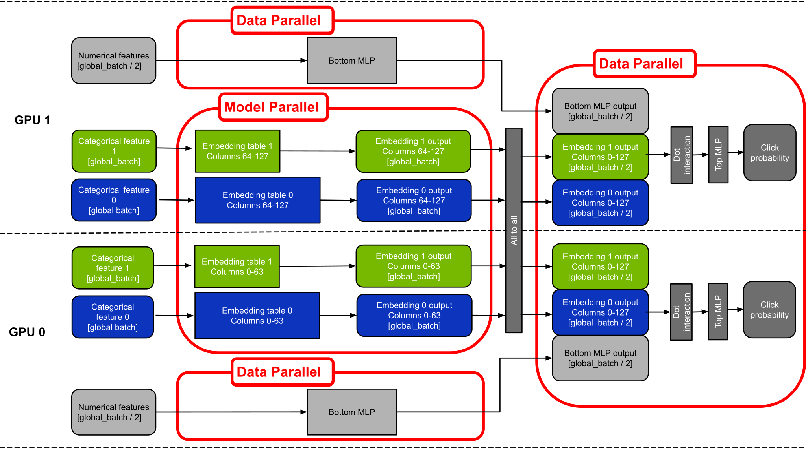

# DLRM For TensorFlow 2

This repository provides a script and recipe to train the Deep Learning Recommendation Model (DLRM) to achieve state-of-the-art accuracy is tested and maintained by NVIDIA.

## Table Of Contents

  * [Model overview](#model-overview)
     * [Model architecture](#model-architecture)
     * [Default configuration](#default-configuration)
     * [Feature support matrix](#feature-support-matrix)
        * [Features](#features)
     * [Mixed precision training](#mixed-precision-training)
        * [Enabling mixed precision](#enabling-mixed-precision)
        * [Enabling TF32](#enabling-tf32)
     * [Hybrid-parallel multi-GPU with all-2-all communication](#hybrid-parallel-multi-gpu-with-all-2-all-communication)
        * [Embedding table placement and load balancing (default mode)](#embedding-table-placement-and-load-balancing-default-mode)
        * [Training very large embedding tables (experimental mode)](#training-very-large-embedding-tables-experimental-mode)
        * [Multi-node training](#multi-node-training)
     * [Preprocessing on GPU with Spark 3](#preprocessing-on-gpu-with-spark-3)
  * [Setup](#setup)
     * [Requirements](#requirements)
  * [Quick Start Guide](#quick-start-guide)
  * [Advanced](#advanced)
     * [Scripts and sample code](#scripts-and-sample-code)
     * [Parameters](#parameters)
     * [Command-line options](#command-line-options)
     * [Getting the data](#getting-the-data)
        * [Dataset guidelines](#dataset-guidelines)
        * [Multi-dataset](#multi-dataset)
        * [Preprocess with Spark](#preprocess-with-spark)
     * [Training process](#training-process)
  * [Performance](#performance)
     * [Benchmarking](#benchmarking)
        * [Training performance benchmark](#training-performance-benchmark)
        * [Inference performance benchmark](#inference-performance-benchmark)
     * [Results](#results)
        * [Training accuracy results](#training-accuracy-results)
           * [Training accuracy: NVIDIA DGX A100 (8x A100 80GB)](#training-accuracy-nvidia-dgx-a100-8x-a100-80gb)
           * [Training accuracy: NVIDIA DGX-1 (8x V100 32GB)](#training-accuracy-nvidia-dgx-1-8x-v100-32gb)
           * [Training accuracy: NVIDIA DGX-2 (16x V100 32GB)](#training-accuracy-nvidia-dgx-2-16x-v100-32gb)
           * [Training stability test](#training-stability-test)
        * [Training performance results](#training-performance-results)
           * [Training performance: NVIDIA DGX A100 (8x A100 80GB)](#training-performance-nvidia-dgx-a100-8x-a100-80gb)
           * [Training performance: NVIDIA DGX-1 (8x V100 32GB)](#training-performance-nvidia-dgx-1-8x-v100-32gb)
           * [Training performance: NVIDIA DGX-2 (16x V100 32GB)](#training-performance-nvidia-dgx-2-16x-v100-32gb)
        * [Inference performance results](#inference-performance-results)
           * [Inference performance: NVIDIA DGX A100 (8x A100 80GB)](#inference-performance-nvidia-dgx-a100-8x-a100-80gb)
           * [Inference performance: NVIDIA DGX1V-32GB (8x V100 32GB)](#inference-performance-nvidia-dgx1v-32gb-8x-v100-32gb)
           * [Inference performance: NVIDIA DGX2 (16x V100 16GB)](#inference-performance-nvidia-dgx2-16x-v100-16gb)
  * [Release notes](#release-notes)
     * [Changelog](#changelog)
     * [Known issues](#known-issues)
        * [Horovod issues](#horovod-issues)
        * [Checkpointing](#checkpointing)


## Model overview

The Deep Learning Recommendation Model (DLRM) is a recommendation model designed to make use of both categorical and numerical inputs. It was first described in [Deep Learning Recommendation Model for Personalization and Recommendation Systems](https://arxiv.org/abs/1906.00091).
This repository provides a reimplementation of the code-base provided originally [here](https://github.com/facebookresearch/dlrm).
The scripts enable you to train DLRM on the [Criteo Terabyte Dataset](https://labs.criteo.com/2013/12/download-terabyte-click-logs/).

Using the scripts provided here, you can efficiently train models that are too large to fit into a single GPU. This is because we use a hybrid-parallel approach, which combines model parallelism with data parallelism for different parts of the neural network. This is explained in details in the [next section](#hybrid-parallel-multi-gpu-with-all-2-all-communication).

This model uses a slightly different preprocessing procedure than the one found in the original implementation. You can find a detailed description of the preprocessing steps in the [Dataset guidelines](#dataset-guidelines) section.

Using DLRM, you can train a high-quality general model for recommendations.

This model is trained with mixed precision using Tensor Cores on Volta, Turing and NVIDIA Ampere GPU architectures. Therefore, researchers can get results 2x faster than training without Tensor Cores while experiencing the benefits of mixed precision training. This model is tested against each NGC monthly container release to ensure consistent accuracy and performance over time.


### Model architecture

DLRM accepts two types of features: categorical and numerical. For each categorical feature, an embedding table is used to provide dense representation to each unique value. The dense features enter the model and are transformed by a simple neural network referred to as "bottom MLP".

This part of the network consists of a series
of linear layers with ReLU activations. The output of the bottom MLP and the embedding vectors are then fed into the "dot interaction" operation. The output of "dot interaction" is then concatenated with the features resulting from bottom MLP and fed into the "top MLP" which is a series of dense layers with activations.
The model outputs a single number which can be interpreted as a likelihood of a certain user clicking an ad.


<p align="center">
  
  <br>
Figure 1. The architecture of DLRM.
</p>

### Default configuration

The following features were implemented in this model:
- general
	- static loss scaling for Tensor Cores (mixed precision) training
	- hybrid-parallel multi-GPU training
- preprocessing
    - dataset preprocessing using Spark 3 on GPUs

### Feature support matrix

The following features are supported by this model:

| Feature               | DLRM
|----------------------|--------------------------
|Automatic mixed precision (AMP)   | Yes
|XLA | Yes
|Hybrid-parallel multiGPU with Horovod all-to-all| Yes
|Preprocessing on GPU with Spark 3| Yes
|Multi-node training | Yes

#### Features

**Automatic Mixed Precision (AMP)**
Enables mixed precision training without any changes to the code-base by performing automatic graph rewrites and loss scaling controlled by an environmental variable.

**XLA**

The training script supports a `--xla` flag. It can be used to enable XLA JIT compilation. Currently, we use [XLA Lite](https://docs.nvidia.com/deeplearning/frameworks/tensorflow-user-guide/index.html#xla-lite). It delivers a steady 10-30% performance boost depending on your hardware platform, precision, and the number of GPUs. It is turned off by default.

**Horovod**
Horovod is a distributed training framework for TensorFlow, Keras, PyTorch, and MXNet. The goal of Horovod is to make distributed deep learning fast and easy to use. For more information about how to get started with Horovod, see the Horovod [official repository](https://github.com/horovod/horovod).

**Hybrid-parallel multiGPU with Horovod all-to-all**
Our model uses Horovod to implement efficient multi-GPU training with NCCL. For details, see example sources in this repository or see the TensorFlow tutorial. For the detailed description of our multi-GPU approach, visit this [section](hybrid-parallel-multi-gpu-with-all-2-all-communication).

**Multi-node training**
This repository supports multinode training. For more information refer to the [multinode section](#multi-node-training)


### Mixed precision training

Mixed precision is the combined use of different numerical precisions in a computational method. [Mixed precision](https://arxiv.org/abs/1710.03740) training offers significant computational speedup by performing operations in half-precision format while storing minimal information in single-precision to retain as much information as possible in critical parts of the network. Since the introduction of [Tensor Cores](https://developer.nvidia.com/tensor-cores) in Volta, and following with both the Turing and Ampere architectures, significant training speedups are experienced by switching to mixed precision -- up to 3.4x overall speedup on the most arithmetically intense model architectures. Using mixed precision training requires two steps:
1.  Porting the model to use the FP16 data type where appropriate.
2.  Adding loss scaling to preserve small gradient values.

The ability to train deep learning networks with lower precision was introduced in the Pascal architecture and first supported in [CUDA 8](https://devblogs.nvidia.com/parallelforall/tag/fp16/) in the NVIDIA Deep Learning SDK.

For information about:
-   How to train using mixed precision, see the [Mixed Precision Training](https://arxiv.org/abs/1710.03740) paper and [Training With Mixed Precision](https://docs.nvidia.com/deeplearning/performance/mixed-precision-training/index.html) documentation.
-   Techniques used for mixed precision training, see the [Mixed-Precision Training of Deep Neural Networks](https://devblogs.nvidia.com/mixed-precision-training-deep-neural-networks/) blog.

#### Enabling mixed precision

Mixed precision training is turned off by default. To turn it on, issue the `--amp` flag to the `main.py` script.


#### Enabling TF32

TensorFloat-32 (TF32) is the new math mode in [NVIDIA A100](https://www.nvidia.com/en-us/data-center/a100/) GPUs for handling the matrix math also called tensor operations. TF32 running on Tensor Cores in A100 GPUs can provide up to 10x speedups compared to single-precision floating-point math (FP32) on Volta GPUs.

TF32 Tensor Cores can speed up networks using FP32, typically with no loss of accuracy. It is more robust than FP16 for models which require high dynamic range for weights or activations.

For more information, refer to the [TensorFloat-32 in the A100 GPU Accelerates AI Training, HPC up to 20x](https://blogs.nvidia.com/blog/2020/05/14/tensorfloat-32-precision-format/) blog post.

TF32 is supported in the NVIDIA Ampere GPU architecture and is enabled by default.


### Hybrid-parallel multi-GPU with all-2-all communication

Many recommendation models contain very large embedding tables. As a result, the model is often too large to fit onto a single device. This could be easily solved by training in a model-parallel way, using either the CPU or other GPUs as "memory donors". However, this approach is suboptimal as the "memory donor" devices' compute is not utilized. In this repository, we use the model-parallel approach for the bottom part of the model (Embedding Tables + bottom MLP) while using a usual data parallel approach for the top part of the model (Dot Interaction + top MLP). This way, we can train models much larger than what would normally fit into a single GPU while at the same time making the training faster by using multiple GPUs. We call this approach hybrid-parallel training.

The transition from model-parallel to data-parallel in the middle of the neural net needs a specific multi-GPU communication pattern called [all-2-all](https://en.wikipedia.org/wiki/All-to-all_\(parallel_pattern\)) which is available in our [TensorFlow 2 21.02-py3](https://ngc.nvidia.com/catalog/containers/nvidia:tensorflow/tags) NGC Docker container. In the [original DLRM whitepaper](https://arxiv.org/abs/1906.00091) this has been referred to as "butterfly shuffle".


<p align="center">
  
  <br>
Figure 2. The default multi-GPU mode.
</p>


As the example shows, in this repository we train models of two sizes: "small" (~15 GB) and "large" (~82 GB). The "large" model cannot be trained in a single GPU paradigm as it will not fit into a single GPU memory.

#### Embedding table placement and load balancing (default mode)

By default, we use the following heuristic for dividing the work between the GPUs:
- The bottom MLP is placed on GPU-0 and no embedding tables are placed on this device.
- The tables are sorted from the largest to the smallest.
- Set `max_tables_per_gpu := ceil(number_of_embedding_tables / number_of_available_gpus)`.
- Repeat until all embedding tables have an assigned device:
    - Out of all the available GPUs, find the one with the largest amount of unallocated memory.
    - Place the largest unassigned embedding table on this GPU. Raise an exception if it does not fit.
    - If the number of embedding tables on this GPU is now equal to `max_tables_per_gpu`, remove this GPU from the list of available GPUs, so that no more embedding tables will be placed on this GPU. This ensures the all-2-all communication is well-balanced between all devices.

#### Training very large embedding tables (experimental mode)

The default multi-GPU paradigm described above has a constraint – each individual table has to fit into a single device's memory. If that's not met, then an Out-of-Memory error will be raised. To enable experimentation with very large models, we provide a way of circumventing this constraint by passing the `--experimental_columnwise_split --data_parallel_bottom_mlp` command-line flags. As a result, each table will be split across the latent space dimension. Some dimensions of the latent space will be placed on one GPU and the rest of them are stored on other GPUs. This means that a table that originally encoded C unique categories into D dense dimensions will now become N separate tables of shape `[C, D / N]` each stored on a different GPU, where N is the number of GPUs used. Symbolically, the computations are exactly equivalent.

The figure below illustrates this paradigm for a model with 2 embedding tables distributed across two GPUs. Note that this approach is currently slower than the default mode described above.

<p align="center">
  
  <br>
Figure 3. The "columnwise split" multi-GPU mode. 
</p>


We tested this approach by training a DLRM model on the Criteo Terabyte dataset with the frequency limiting option turned off (set to zero). The weights of the resulting model take 421 GB. The largest table weighs 140 GB. Here are the commands you can use to reproduce this:

```
# build and run the preprocessing container as in the Quick Start Guide
# then when preprocessing set the frequency limit to 0:
./prepare_dataset.sh DGX2 0

# build and run the training container same as in the Quick Start Guide
# then append options necessary for training very large embedding tables:
horovodrun -np 8 -H localhost:8 --mpi-args=--oversubscribe numactl --interleave=all -- python -u main.py --dataset_path /data/dlrm/ --amp --tf_gpu_memory_limit_gb 72 --experimental_columnwise_split --data_parallel_bottom_mlp --xla
```

When using this method on a DGX A100 with 8 A100-80GB GPUs and a large-enough dataset, it is possible to train a single embedding table of up to 600 GB. You can also use multi-node training (described below) to train even larger recommender systems.

#### Multi-node training

Multi-node training is supported. Depending on the exact interconnect hardware and model configuration, you might experience only a modest speedup with multi-node. Multi-node training can also be used to train larger models. For example, to train a 1.68 TB variant of DLRM on multi-node, you can run:

```
cmd='numactl --interleave=all -- python -u main.py --dataset_path /data/dlrm/full_criteo_data --amp \
--tf_gpu_memory_limit_gb 72 --experimental_columnwise_split --data_parallel_bottom_mlp \
--embedding_dim 512 --bottom_mlp_dims 512,256,512' \
srun_flags='--mpi=pmix' \
cont=nvidia_dlrm_tf \
mounts=/data/dlrm:/data/dlrm \
sbatch -n 32 -N 4 -t 00:20:00 slurm_multinode.sh
```

### Preprocessing on GPU with Spark 3

Refer to the ["Preprocessing with Spark" section](#preprocess-with-spark) for a detailed description of the Spark 3 GPU functionality.

## Setup

The following section lists the requirements for training DLRM.

### Requirements

This repository contains Dockerfile which extends the TensorFlow 2 NGC container and encapsulates some dependencies. Aside from these dependencies, ensure you have the following components:
-   [NVIDIA Docker](https://github.com/NVIDIA/nvidia-docker)
-   [TensorFlow 2  21.02-py3](https://ngc.nvidia.com/catalog/containers/nvidia:tensorflow/tags) NGC container
-   Supported GPUs:
    - [NVIDIA Volta architecture](https://www.nvidia.com/en-us/data-center/volta-gpu-architecture/)
    - [NVIDIA Turing architecture](https://www.nvidia.com/en-us/geforce/turing/)
    - [NVIDIA Ampere architecture](https://www.nvidia.com/en-us/data-center/nvidia-ampere-gpu-architecture/)


For more information about how to get started with NGC containers, see the following sections from the NVIDIA GPU Cloud Documentation and the Deep Learning Documentation:
-   [Getting Started Using NVIDIA GPU Cloud](https://docs.nvidia.com/ngc/ngc-getting-started-guide/index.html)
-   [Accessing And Pulling From The NGC Container Registry](https://docs.nvidia.com/deeplearning/frameworks/user-guide/index.html#accessing_registry)
- [Running TensorFlow](https://docs.nvidia.com/deeplearning/frameworks/tensorflow-release-notes/running.html#running)

For those unable to use the TensorFlow NGC container, to set up the required environment or create your own container, see the versioned [NVIDIA Container Support Matrix](https://docs.nvidia.com/deeplearning/frameworks/support-matrix/index.html).

## Quick Start Guide

To train your model using mixed or TF32 precision with Tensor Cores or using FP32, perform the following steps using
the default parameters of DLRM on the Criteo Terabyte dataset. For the specifics concerning training and inference,
see the [Advanced](#advanced) section.

1. Clone the repository.
```
git clone https://github.com/NVIDIA/DeepLearningExamples
cd DeepLearningExamples/TensorFlow2/Recommendation/DLRM
```

2. Build a DLRM Docker container.
```bash
docker build -t nvidia_dlrm_tf .
docker build -t nvidia_dlrm_spark -f Dockerfile_spark .
```

3. Start an interactive session in the NGC container to run preprocessing.
The DLRM TensorFlow container can be launched with:
```bash
mkdir -p data
docker run --runtime=nvidia -it --rm --ipc=host  -v ${PWD}/data:/data nvidia_dlrm_spark bash
```

4.  Download and preprocess the dataset.

You can download the data by following the instructions at: http://labs.criteo.com/2013/12/download-terabyte-click-logs/.

When you have successfully downloaded the dataset, put it in the `/data/dlrm/criteo/` directory in the container (`$PWD/data/dlrm/criteo` in the host system).

Here are a few examples of different preprocessing commands. For the details on how those scripts work and detailed description of all the parameters,  consult the [preprocess with spark section](#preprocess-with-spark).

```bash
cd preproc

# to run on a DGX-2 with a frequency limit of 3 (will need 8xV100-32GB to fit the model in GPU memory)
./prepare_dataset.sh DGX2 3

# to run on a DGX-2 with a frequency limit of 15 (should fit on a single V100-32GB):
./prepare_dataset.sh DGX2 15
#
# to run on CPU with a frequency limit of 15:
./prepare_dataset.sh CPU 15
```

5. Start training.

First, start the Docker container:
```bash
docker run --runtime=nvidia -it --rm --ipc=host  -v ${PWD}/data:/data nvidia_dlrm_tf bash
```

- single-GPU A100-80GB:
```bash
horovodrun -np 1 -H localhost:1 --mpi-args=--oversubscribe numactl --interleave=all -- python -u main.py --dataset_path /data/dlrm/ --amp --tf_gpu_memory_limit_gb 72 --xla --save_checkpoint_path /data/dlrm/checkpoint/dlrm
```

- single-GPU V100-32GB:
```bash
horovodrun -np 1 -H localhost:1 --mpi-args=--oversubscribe numactl --interleave=all -- python -u main.py --dataset_path /data/dlrm/ --xla --save_checkpoint_path /data/dlrm/checkpoint/dlrm
```

- multi-GPU for DGX A100:
```bash
horovodrun -np 8 -H localhost:8 --mpi-args=--oversubscribe numactl --interleave=all -- python -u main.py --dataset_path /data/dlrm/ --amp --tf_gpu_memory_limit_gb 72 --xla --save_checkpoint_path /data/dlrm/checkpoint/dlrm
```

- multi-GPU for DGX2:
```bash
horovodrun -np 16 -H localhost:16 --mpi-args=--oversubscribe numactl --interleave=all -- python -u main.py --dataset_path /data/dlrm/ --amp --xla  --save_checkpoint_path /data/dlrm/checkpoint/dlrm
```

- multi-GPU for DGX1V-32GB:
```bash
horovodrun -np 8 -H localhost:8 --mpi-args=--oversubscribe numactl --interleave=all -- python -u main.py --dataset_path /data/dlrm/ --amp --xla --save_checkpoint_path /data/dlrm/checkpoint/dlrm
```

6. Start evaluation.

To evaluate a previously trained checkpoint, append `--restore_checkpoint_path <path> --mode eval` to the command used for training. For example, to test a checkpoint trained on 8x A100 80GB, run:

```bash
horovodrun -np 8 -H localhost:8 --mpi-args=--oversubscribe numactl --interleave=all -- python -u main.py --dataset_path /data/dlrm/ --amp --tf_gpu_memory_limit_gb 72 --xla --restore_checkpoint_path /data/dlrm/checkpoint/dlrm --mode eval
```

## Advanced

The following sections provide greater details of the dataset, running training and inference, and the training results.

### Scripts and sample code

These are the important modules in this repository:
- `main.py` - The main entrypoint script for training, evaluating, and benchmarking.
- `model.py` - Defines the DLRM model and some auxiliary functions used to train it.
- `dataloader.py` - Handles defining the dataset objects based on command-line flags.
- `split_binary_dataset.py` - Defines the `RawBinaryDataset` class responsible for storing and loading the training data.
- `distributed_utils.py` - Contains the heuristic used for placing the embedding tables across devices. Additionally, defines some data classes describing this placement and some utilities for multi-GPU and multi-node training.
- `slurm_multinode.sh` - Example batch script for multi-node training on SLURM clusters.
- `lr_scheduler.py` - Defines a TensorFlow learning rate scheduler that supports both learning rate warmup and polynomial decay.
- `embedding.py` - Implementations of the embedding layers.
- `interaction.py` - Implementation of the dot-interaction layer using TensorFlow operations.
- `tensorflow-dot-based-interact` - A directory with a set of custom CUDA kernels. They provide fast implementations of the dot-interaction operation for various precisions and hardware platforms.
- `utils.py` - General utilities, such as a timer used for taking performance measurements.


### Parameters

The table below lists the most important command-line parameters of the `main.py` script.

| Scope| parameter| Comment| Default Value |
| ----- | --- | ---- | ---- |
|datasets|dataset_path|Path to the JSON file with the sizes of embedding tables|
|function|mode| Choose "train" to train the model, "inference" to benchmark inference and "eval" to run validation| train|
|optimizations|amp| Enable automatic mixed precision| False
|optimizations|xla| Enable XLA| False|
|hyperparameters|batch_size| Batch size used for training|65536|
|hyperparameters|epochs| Number of epochs to train for|1|
|hyperparameters|optimizer| Optimization algorithm for training |SGD|
|hyperparameters|evals_per_epoch| Number of evaluations per epoch|1|
|hyperparameters|valid_batch_size| Batch size used for validation|65536|
|hyperparameters|max_steps| Stop the training/inference after this many optimization steps|-1|
|checkpointing|restore_checkpoint_path| Path from which to restore a checkpoint before training|None|
|checkpointing|save_checkpoint_path| Path to which to save a checkpoint file at the end of the training|None|
|debugging|run_eagerly| Disable all tf.function decorators for debugging|False|
|debugging|print_freq| Number of steps between debug prints|1000|


### Command-line options

The `main.py` script supports a number of command-line flags. You can get the descriptions of those by running `python main.py --help`.

### Getting the data

This example uses the [Criteo Terabyte Dataset](https://labs.criteo.com/2013/12/download-terabyte-click-logs/).
The first 23 days are used as the training set. The last day is split in half. The first part is used as a validation set and the second set is used as a hold-out test set.


#### Dataset guidelines

The preprocessing steps applied to the raw data include:
- Replacing the missing values with `0`.
- Replacing the categorical values that exist fewer than 15 times with a special value.
- Converting the hash values to consecutive integers.
- Adding 2 to all the numerical features so that all of them are greater or equal to 1.
- Taking a natural logarithm of all numerical features.

#### Multi-dataset

Our preprocessing scripts are designed for the Criteo Terabyte Dataset and should work with any other dataset with the same format. The data should be split into text files. Each line of those text files should contain a single training example. An example should consist of multiple fields separated by tabulators:
- The first field is the label – `1` for a positive example and `0` for negative.
- The next `N` tokens should contain the numerical features separated by tabs.
- The next `M` tokens should contain the hashed categorical features separated by tabs.


#### Preprocess with Spark

The preprocessing scripts provided in this repository support running both on CPU and on DGX-2 using [Apache Spark 3.0](https://www.nvidia.com/en-us/deep-learning-ai/solutions/data-science/apache-spark-3/).
It should be possible to change the values in `preproc/dgx2_config.sh`
so that they'll work on other hardware platforms such as DGX-1.

Note that the preprocessing will require about 4TB of disk storage.

The syntax for the preprocessing script is as follows:
```bash
cd preproc
./prepare_dataset.sh <DGX2|CPU> <frequency_threshold>
```

The first argument is the hardware platform to use (either DGX-2 or pure-CPU). The second argument means the frequency
threshold to apply to the categorical variables. For a frequency threshold `T`, the categorical values that occur less
often than `T` will be replaced with a special embedding. Thus, a larger value of `T` will require smaller embedding tables
and will substantially reduce the overall size of the model.

For the Criteo Terabyte dataset we recommend a frequency threshold of `T=3` if you intend to run the hybrid-parallel mode
on multiple GPUs. If you want to make the model fit into a single NVIDIA Tesla V100-32GB, you can set `T=15`.

The preprocessing scripts makes use of the following environment variables to configure the data directory paths:
- `download_dir` – this directory should contain the original Criteo Terabyte CSV files
- `spark_output_path` – directory to which the parquet data will be written
- `conversion_intermediate_dir` – directory used for storing intermediate data used to convert from parquet to train-ready format
- `final_output_dir` – directory to store the final results of the preprocessing which can then be used to train DLRM

The script `spark_data_utils.py` is a PySpark application, which is used to preprocess the Criteo Terabyte Dataset. In the Docker image, we have installed Spark 3.0.1, which will start a standalone cluster of Spark. The scripts `run_spark_cpu.sh` and `run_spark_gpu.sh` start Spark, then runs several PySpark jobs with `spark_data_utils.py`, for example:
generates the dictionary
- transforms the train dataset
- transforms the test dataset
- transforms the validation dataset

    Change the variables in the `run-spark.sh` script according to your environment.
    Configure the paths.
```
export SPARK_LOCAL_DIRS=/data/spark-tmp
export INPUT_PATH=/data/criteo
export OUTPUT_PATH=/data/output
```
Note that the Spark job requires about 3TB disk space used for data shuffle.

Where:
`SPARK_LOCAL_DIRS` is the path where Spark uses to write shuffle data.
`INPUT_PATH` is the path of the Criteo Terabyte Dataset, including uncompressed files like day_0, day_1…
`OUTPUT_PATH` is where the script writes the output data. It will generate the following subdirectories of `models`, `train`, `test`, and `validation`.
- The `model` is the dictionary folder.
- The `train` is the train dataset transformed from day_0 to day_22.
- The `test` is the test dataset transformed from the prior half of day_23.
- The `validation` is the dataset transformed from the latter half of day_23.

Configure the resources which Spark will use.
```
export TOTAL_CORES=80
export TOTAL_MEMORY=800
```

Where:
`TOTAL_CORES` is the total CPU cores you want Spark to use.

`TOTAL_MEMORY` is the total memory Spark will use.

Configure frequency limit.
```
USE_FREQUENCY_LIMIT=15
```
The frequency limit is used to filter out the categorical values which appear less than n times in the whole dataset, and make them be 0. Change this variable to 1 to enable it. The default frequency limit is 15 in the script. You also can change the number as you want by changing the line of `OPTS="--frequency_limit 8"`.


### Training process

The main training script resides in `main.py`. The speed of training is measured by throughput i.e., the number
of samples processed per second. We use mixed precision training with static loss scaling for the bottom and top MLPs while embedding tables are stored in FP32 format.

## Performance

The performance measurements in this document were conducted at the time of publication and may not reflect the performance achieved from NVIDIA’s latest software release. For the most up-to-date performance measurements, go to [NVIDIA Data Center Deep Learning Product Performance](https://developer.nvidia.com/deep-learning-performance-training-inference).

### Benchmarking

The following section shows how to run benchmarks measuring the model performance in training and inference modes.

#### Training performance benchmark

To benchmark the training performance on a specific batch size, follow the instructions
in the [Quick Start Guide](#quick-start-guide). You can also add the `--max_steps 1000`
if you want to get a reliable throughput measurement without running the entire training.

You can also use synthetic data by running with the `--dataset_type synthetic` option if you haven't downloaded the dataset yet.

#### Inference performance benchmark

To benchmark the inference performance on a specific batch size, run:

```
horovodrun -np 1 -H localhost:1 --mpi-args=--oversubscribe numactl --interleave=all -- python -u main.py --dataset_path /data/dlrm/ --amp --restore_checkpoint_path <checkpoint_path> --mode inference
```

### Results

The following sections provide details on how we achieved our performance and accuracy in training and inference.

We used two model size variants to show memory scalability in multi-GPU setup:
- small - refers to model trained on Criteo dataset with frequency thresholding set to 15 resulting in smaller embedding tables - total model size: ~15 GB
- large - refers to model trained on Criteo dataset with frequency thresholding set to 3 resulting in larger embedding tables - total model size: ~82 GB

#### Training accuracy results


##### Training accuracy: NVIDIA DGX A100 (8x A100 80GB)

Our results were obtained by running training scripts as described in the Quick Start Guide in the DLRM Docker container.

| GPUs    | Model size    | Batch size / GPU    | Accuracy (AUC) - TF32  | Accuracy (AUC) - mixed precision  |   Time to train - TF32 [minutes]  |  Time to train - mixed precision [minutes] | Time to train speedup (TF32 to mixed precision)
|----:|----|----|----:|----:|---:|---:|---:|
| 1 | small | 64k | 0.8026 | 0.8026 | 34.78| 25.07| 1.39|
| 8 | large | 8k | 0.8026 | 0.8026 | 9.33| 7.30| 1.28|


##### Training accuracy: NVIDIA DGX-1 (8x V100 32GB)

Our results were obtained by running training scripts as described in the Quick Start Guide in the DLRM Docker container.

| GPUs    | Model size    | Batch size / GPU    | Accuracy (AUC) - FP32  | Accuracy (AUC) - mixed precision  |   Time to train - FP32  [minutes] |  Time to train - mixed precision  [minutes] | Time to train speedup (FP32 to mixed precision)
|----:|----|----|----:|----:|---:|---:|---:|
| 1 | small | 64k | 0.8026 | 0.8026 | 127.53| 50.55| 2.52|
| 8 | large | 8k | 0.8026 | 0.8026 | 31.73| 14.92| 2.13|


##### Training accuracy: NVIDIA DGX-2 (16x V100 32GB)

Our results were obtained by running training scripts as described in the Quick Start Guide in the DLRM Docker container.

| GPUs    | Model size    | Batch size / GPU    | Accuracy (AUC) - FP32  | Accuracy (AUC) - mixed precision  |   Time to train - FP32  [minutes] |  Time to train - mixed precision  [minutes] | Time to train speedup (FP32 to mixed precision)
|----:|----|----|----:|----:|---:|---:|---:|
| 1 | small | 64k | 0.8026 | 0.8026 | 112.78| 43.20| 2.61|
| 8 | large | 8k | 0.8026 | 0.8026 | 25.28| 11.65| 2.17|
| 16 | large | 4k | 0.8026 | 0.8026 |20.93 | 11.90| 1.76|


##### Training stability test

The histograms below show the distribution of ROC AUC results achieved at the end of the training for each precision/hardware platform tested. There are no statistically significant differences between precision, number of GPUs or hardware platform. Using the larger dataset has a modest, positive impact on final AUC score.   


<p align="center">
  
  <br>
Figure 4. Results of stability tests for DLRM.
</p>


#### Training performance results


We used throughput in items processed per second as the performance metric.


##### Training performance: NVIDIA DGX A100 (8x A100 80GB)

Our results were obtained by following the commands from the Quick Start Guide
in the DLRM Docker container on NVIDIA DGX A100 (8x A100 80GB) GPUs. Performance numbers (in items per second) were averaged over 1000 training steps.

| GPUs   | Model size    | Batch size / GPU   | Throughput - TF32    | Throughput - mixed precision    | Throughput speedup (TF32 - mixed precision)
|----:|----|----|---:|---:|---:|
| 1 | small | 64k | 1.99M | 2.78M | 1.40|
| 8 | large | 8k | 8.41M | 12.6M | 1.50|

To achieve these same results, follow the steps in the [Quick Start Guide](#quick-start-guide).


##### Training performance: NVIDIA DGX-1 (8x V100 32GB)

| GPUs   | Model size    | Batch size / GPU   | Throughput - FP32    | Throughput - mixed precision    | Throughput speedup (FP32 - mixed precision)   |
|----:|----|----|---:|---:|---:|
| 1 | small | 64k | 0.52M| 2.27M| 3.11|
| 8 | large | 8k | 2.27M| 5.46M | 2.41|

To achieve the same results, follow the steps in the [Quick Start Guide](#quick-start-guide).


##### Training performance: NVIDIA DGX-2 (16x V100 32GB)

| GPUs   | Model size   | Batch size / GPU   | Throughput - FP32    | Throughput - mixed precision    | Throughput speedup (FP32 - mixed precision)
|----:|----|---|---:|---:|---:|
| 1 | small | 64k | 0.64M| 1.65M | 2.58|
| 8 | large | 8k | 3.05M| 7.98M| 2.61|
| 16 | large | 4k | 4.30M| 9.21M| 2.14|


To achieve the same results, follow the steps in the [Quick Start Guide](#quick-start-guide).

#### Inference performance results

##### Inference performance: NVIDIA DGX A100 (8x A100 80GB)
| GPUs   | Model size   | Batch size / GPU | Throughput - TF32 | Throughput - mixed precision |  Average latency - TF32 [ms] | Average latency - mixed precision [ms] | Throughput speedup (mixed precision to TF32)
|----:|----|---|---:|---:|---:|---:|---:|
| 1| small| 2048| 755k|828k |2.71|2.47|1.10 |

##### Inference performance: NVIDIA DGX1V-32GB (8x V100 32GB)
| GPUs   | Model size   | Batch size / GPU | Throughput - FP32 | Throughput - mixed precision |  Average latency - FP32 [ms] | Average latency - mixed precision [ms] | Throughput speedup (mixed precision to FP32)
|----:|----|---|---:|---:|---:|---:|---:|
| 1| small| 2048| 441k| 497k |4.65|4.12|1.13 |

##### Inference performance: NVIDIA DGX2 (16x V100 16GB)
| GPUs   | Model size   | Batch size / GPU | Throughput - FP32 | Throughput - mixed precision |  Average latency - FP32 [ms] | Average latency - mixed precision [ms] | Throughput speedup (mixed precision to FP32)
|----:|----|---|---:|---:|---:|---:|---:|
| 1| small| 2048| 558k| 774k |3.67|2.65|1.39|


## Release notes
We’re constantly refining and improving our performance on AI and HPC workloads even on the same hardware with frequent updates to our software stack. For our latest performance data please refer to these pages for [AI](https://developer.nvidia.com/deep-learning-performance-training-inference) and [HPC](https://developer.nvidia.com/hpc-application-performance) benchmarks.

### Changelog

March 2021
- Initial release

### Known issues

#### Horovod issues
In certain cases, TensorFlow can structure the graph in such a way that the rank-0 GPU has a different order of Horovod all-2-all calls then the other ranks. This will cause a deadlock. It does not happen in the default settings, but there's a chance it will, especially if you make heavy modifications to the bottom part of the model. To circumvent this, you can run the bottom MLP in data-parallel mode. This causes the computational graphs of each GPU to be very similar, thus eliminating the chance of a deadlock. Note this mode will be up to 10% slower than the default mode.

#### Checkpointing
TensorFlow runs into issues when trying to save model checkpoints for extremely large variables. We circumvent this by using a custom checkpoint format that splits the variables into pieces and stores each piece independently. However, this custom format cannot be used by the standard inference deployment frameworks such as ONNX.

#### Inference performance
Current inference performance was evaluated in python using TensorFlow 2.4.0. This provides ease of use and flexibility but is suboptimal in terms of performance. If you're interested in state-of-the-art performance for recommender system inference, please review our results in [the MLPerf v0.7 benchmark](https://mlperf.org/inference-results/) where we used [TensorRT](https://developer.nvidia.com/tensorrt). You might also want to check [the source code of our MLPerf Inference submission](https://github.com/mlcommons/inference_results_v0.7/tree/master/closed/NVIDIA/code/dlrm/tensorrt).

