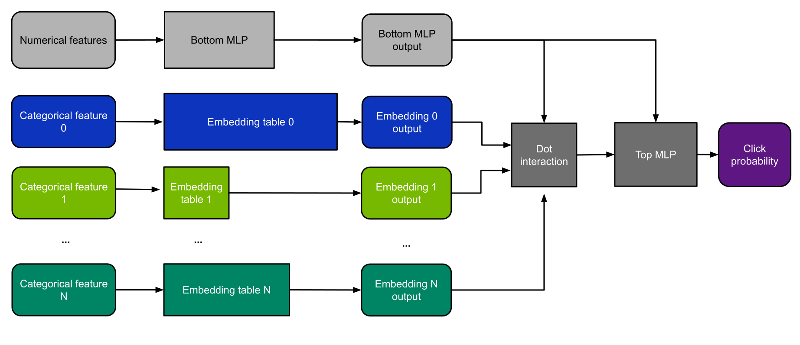
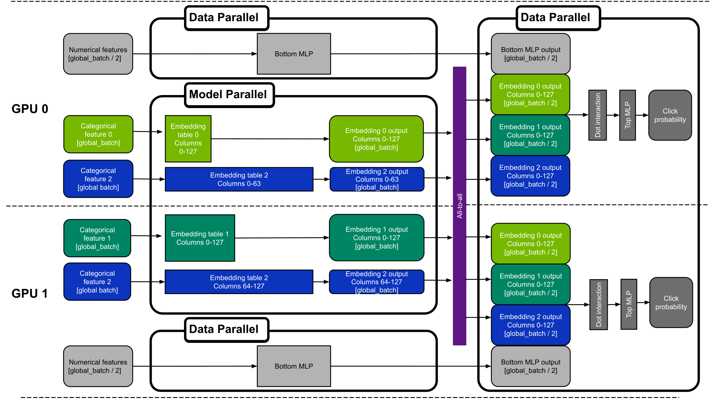
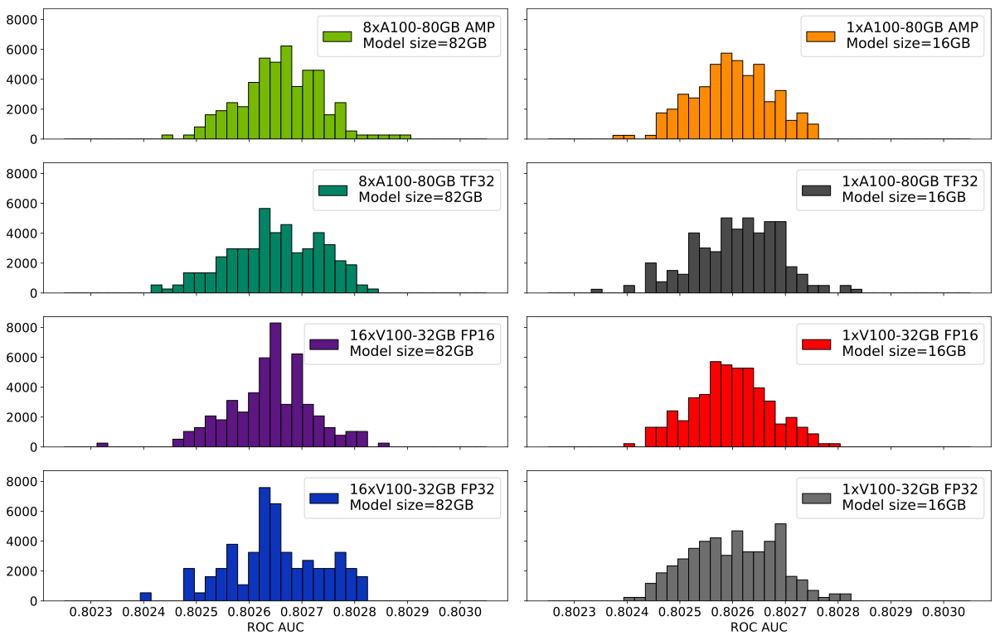

# DLRM For TensorFlow 2

This repository provides a script and recipe to train the Deep Learning Recommendation Model (DLRM) to achieve state-of-the-art accuracy is tested and maintained by NVIDIA.

## Table Of Contents

  * [Model overview](#model-overview)
     * [Model architecture](#model-architecture)
     * [Default configuration](#default-configuration)
     * [Feature support matrix](#feature-support-matrix)
        * [Features](#features)
     * [Mixed precision training](#mixed-precision-training)
        * [Enabling mixed precision](#enabling-mixed-precision)
        * [Enabling TF32](#enabling-tf32)
     * [Hybrid-parallel training with Merlin Distributed Embeddings](#hybrid-parallel-training-with-merlin-distributed-embeddings)
        * [Training very large embedding tables](#training-very-large-embedding-tables)
        * [Multi-node training](#multi-node-training)
     * [Preprocessing on GPU with Spark 3](#preprocessing-on-gpu-with-spark-3)
     * [BYO dataset functionality overview](#byo-dataset-functionality-overview)
         * [Glossary](#glossary)
         * [Dataset feature specification](#dataset-feature-specification)
         * [Data flow in NVIDIA Deep Learning Examples recommendation models](#data-flow-in-nvidia-deep-learning-examples-recommendation-models)
         * [Example of dataset feature specification](#example-of-dataset-feature-specification)
         * [BYO dataset functionality](#byo-dataset-functionality)
  * [Setup](#setup)
     * [Requirements](#requirements)
  * [Quick Start Guide](#quick-start-guide)
  * [Advanced](#advanced)
     * [Scripts and sample code](#scripts-and-sample-code)
     * [Parameters](#parameters)
     * [Command-line options](#command-line-options)
     * [Getting the data](#getting-the-data)
        * [Dataset guidelines](#dataset-guidelines)
        * [BYO dataset](#byo-dataset)
          * [Channel definitions and requirements](#channel-definitions-and-requirements)
          * [BYO dataset constraints for the model](#BYO-dataset-constraints-for-the-model)
        * [Preprocess with Spark](#preprocess-with-spark)
     * [Training process](#training-process)
  * [Performance](#performance)
     * [Benchmarking](#benchmarking)
        * [Training performance benchmark](#training-performance-benchmark)
        * [Inference performance benchmark](#inference-performance-benchmark)
     * [Results](#results)
        * [Training accuracy results](#training-accuracy-results)
           * [Training accuracy: NVIDIA DGX A100 (8x A100 80GB)](#training-accuracy-nvidia-dgx-a100-8x-a100-80gb)
           * [Training accuracy: NVIDIA DGX-1 (8x V100 32GB)](#training-accuracy-nvidia-dgx-1-8x-v100-32gb)
           * [Training accuracy: NVIDIA DGX-2 (16x V100 32GB)](#training-accuracy-nvidia-dgx-2-16x-v100-32gb)
           * [Training stability test](#training-stability-test)
        * [Training performance results](#training-performance-results)
           * [Training performance: NVIDIA DGX A100 (8x A100 80GB)](#training-performance-nvidia-dgx-a100-8x-a100-80gb)
           * [Training performance: NVIDIA DGX-1 (8x V100 32GB)](#training-performance-nvidia-dgx-1-8x-v100-32gb)
           * [Training performance: NVIDIA DGX-2 (16x V100 32GB)](#training-performance-nvidia-dgx-2-16x-v100-32gb)
        * [Inference performance results](#inference-performance-results)
           * [Inference performance: NVIDIA DGX A100 (8x A100 80GB)](#inference-performance-nvidia-dgx-a100-8x-a100-80gb)
           * [Inference performance: NVIDIA DGX1V-32GB (8x V100 32GB)](#inference-performance-nvidia-dgx1v-32gb-8x-v100-32gb)
           * [Inference performance: NVIDIA DGX2 (16x V100 16GB)](#inference-performance-nvidia-dgx2-16x-v100-16gb)
  * [Release notes](#release-notes)
     * [Changelog](#changelog)
     * [Known issues](#known-issues)
        * [Horovod issues](#horovod-issues)
        * [Checkpointing](#checkpointing)


## Model overview

The Deep Learning Recommendation Model (DLRM) is a recommendation model designed to make use of both categorical and numerical inputs.
It was first described in [Deep Learning Recommendation Model for Personalization and Recommendation Systems](https://arxiv.org/abs/1906.00091).
This repository provides a reimplementation of the code base provided originally [here](https://github.com/facebookresearch/dlrm).
The scripts enable you to train DLRM on the [Criteo Terabyte Dataset](https://labs.criteo.com/2013/12/download-terabyte-click-logs/).

Using the scripts provided here, you can efficiently train models that are too large to fit into a single GPU.
This is because we use a hybrid-parallel approach, which combines model parallelism with data parallelism for
different parts of the neural network.
This is explained in detail in the [next section](#hybrid-parallel-multi-gpu-with-all-2-all-communication).

This model uses a slightly different preprocessing procedure than the one found in the original implementation.
Most importantly, we use a technique called frequency thresholding to demonstrate models of different sizes.
The smallest model can be trained on a single V100-32GB GPU, while the largest one needs 8xA100-80GB GPUs.  
The table below summarizes the model sizes and frequency thresholds used in this repository:

| Name          | Frequency threshold   | Number of parameters   | Model size|
|:--------------|:---|:-------------|:-------------------|
| Small         | 15| 4.2B | 15.6 GiB |
| Large         | 3 | 22.8B | 84.9 GiB |
| Extra large   | 0 | 113B | 421 GiB |

You can find a detailed description of the preprocessing steps in the [Dataset guidelines](#dataset-guidelines) section.

Using DLRM, you can train a high-quality general model for recommendations.

This model is trained with mixed precision using Tensor Cores on Volta, Turing ,and NVIDIA Ampere GPU architectures.
Therefore, researchers can get results 2x faster than training without Tensor Cores while experiencing the
benefits of mixed precision training. This model is tested against each NGC monthly container
release to ensure consistent accuracy and performance over time.


### Model architecture

DLRM accepts two types of features: categorical and numerical. For each categorical feature, an embedding table is used to provide a dense representation of each unique value. The dense features enter the model and are transformed by a simple neural network referred to as "bottom MLP".

This part of the network consists of a series
of linear layers with ReLU activations. The output of the bottom MLP and the embedding vectors are then fed into the "dot interaction" operation. The output of "dot interaction" is then concatenated with the features resulting from the bottom MLP and fed into the "top MLP" which is a series of dense layers with activations.
The model outputs a single number which can be interpreted as a likelihood of a certain user clicking an ad.

<p align="center">
  
  <br>
Figure 1. The architecture of DLRM.
</p>

### Default configuration

The following features were implemented in this model:
- general
	- static loss scaling for Tensor Cores (mixed precision) training
	- hybrid-parallel multi-GPU training
- preprocessing
    - dataset preprocessing using Spark 3 on GPUs

### Feature support matrix

The following features are supported by this model:

| Feature               | DLRM
|----------------------|--------------------------
|Automatic mixed precision (AMP)   | Yes
|XLA | Yes
|Hybrid-parallel training with Merlin Distributed Embeddings | Yes
|Preprocessing on GPU with Spark 3| Yes
|Multi-node training | Yes

#### Features

**Automatic Mixed Precision (AMP)**
Enables mixed precision training without any changes to the code-base by performing automatic graph rewrites and loss scaling controlled by an environmental variable.

**XLA**

The training script supports a `--xla` flag. It can be used to enable XLA JIT compilation. Currently, we use [XLA Lite](https://docs.nvidia.com/deeplearning/frameworks/tensorflow-user-guide/index.html#xla-lite). It delivers a steady 10-30% performance boost depending on your hardware platform, precision, and the number of GPUs. It is turned off by default.

**Horovod**
Horovod is a distributed training framework for TensorFlow, Keras, PyTorch, and MXNet. The goal of Horovod is to make distributed deep learning fast and easy to use. For more information about how to get started with Horovod, see the Horovod [official repository](https://github.com/horovod/horovod).

**Hybrid-parallel training with Merlin Distributed Embeddings**
Our model uses Merlin Distributed Embeddings to implement efficient multi-GPU training.
For details, see example sources in this repository or see the TensorFlow tutorial.
For a detailed description of our multi-GPU approach, visit this [section](#hybrid-parallel-training-with-merlin-distributed-embeddings).

**Multi-node training**
This repository supports multi-node training. For more information refer to the [multinode section](#multi-node-training)


### Mixed precision training

Mixed precision is the combined use of different numerical precisions in a computational method. [Mixed precision](https://arxiv.org/abs/1710.03740) training offers significant computational speedup by performing operations in half-precision format while storing minimal information in single-precision to retain as much information as possible in critical parts of the network. Since the introduction of [Tensor Cores](https://developer.nvidia.com/tensor-cores) in Volta, and following with both the Turing and Ampere architectures, significant training speedups are experienced by switching to mixed precision -- up to 3.4x overall speedup on the most arithmetically intense model architectures. Using mixed precision training requires two steps:
1.  Porting the model to use the FP16 data type where appropriate.
2.  Adding loss scaling to preserve small gradient values.

The ability to train deep learning networks with lower precision was introduced in the Pascal architecture and first supported in [CUDA 8](https://devblogs.nvidia.com/parallelforall/tag/fp16/) in the NVIDIA Deep Learning SDK.

For information about:
-   How to train using mixed precision, see the [Mixed Precision Training](https://arxiv.org/abs/1710.03740) paper and [Training With Mixed Precision](https://docs.nvidia.com/deeplearning/performance/mixed-precision-training/index.html) documentation.
-   Techniques used for mixed precision training, see the [Mixed-Precision Training of Deep Neural Networks](https://devblogs.nvidia.com/mixed-precision-training-deep-neural-networks/) blog.

#### Enabling mixed precision

Mixed precision training is turned off by default. To turn it on, issue the `--amp` flag to the `main.py` script.


#### Enabling TF32

TensorFloat-32 (TF32) is the new math mode in [NVIDIA A100](https://www.nvidia.com/en-us/data-center/a100/) GPUs for handling the matrix math also called tensor operations. TF32 running on Tensor Cores in A100 GPUs can provide up to 10x speedups compared to single-precision floating-point math (FP32) on Volta GPUs.

TF32 Tensor Cores can speed up networks using FP32, typically with no loss of accuracy. It is more robust than FP16 for models which require high dynamic range for weights or activations.

For more information, refer to the [TensorFloat-32 in the A100 GPU Accelerates AI Training, HPC up to 20x](https://blogs.nvidia.com/blog/2020/05/14/tensorfloat-32-precision-format/) blog post.

TF32 is supported in the NVIDIA Ampere GPU architecture and is enabled by default.


### Hybrid-parallel training with Merlin Distributed Embeddings

Many recommendation models contain very large embedding tables. As a result, the model is often too large to fit onto a single device.
This could be easily solved by training in a model-parallel way, using either the CPU or other GPUs as "memory donors".
However, this approach is suboptimal as the "memory donor" devices' computing is not utilized.
In this repository, we use the model-parallel approach for the Embedding Tables while employing a usual data-parallel approach
for the more compute-intensive MLPs and Dot Interaction layer. This way, we can train models much larger than what would normally fit into
a single GPU while at the same time making the training faster by using multiple GPUs. We call this approach hybrid-parallel training.

To implement this approach we use the [Merlin Distributed Embeddings](https://github.com/NVIDIA-Merlin/distributed-embeddings) library. 
It provides a scalable model parallel wrapper called `distributed_embeddings.dist_model_parallel`. This wrapper automatically distributes embedding tables to multiple GPUs.                                  
This way embeddings can be scaled beyond single GPU’s memory capacity without
complex code to handle cross-worker communication.

Under the hood, Merlin Distributed Embeddings uses a
specific multi-GPU communication pattern called
[all-2-all](https://en.wikipedia.org/wiki/All-to-all_\(parallel_pattern\)) to transition from model-parallel to data-parallel
paradigm. In the [original DLRM whitepaper](https://arxiv.org/abs/1906.00091) this has been referred to as "butterfly shuffle".

An example model using Hybrid Parallelism is shown in Figure 2. The compute intensive dense layers are run in data-parallel
mode. The smaller embedding tables are run model-parallel, such that each smaller table is placed entirely on a single device.
This is not suitable for larger tables that need more memory than can be provided by a single device. Therefore,
those large tables are split into multiple parts and each part is run on a different GPU.

<p align="center">
  
  <br>
Figure 2. Hybrid parallelism with Merlin Distributed Embeddings.
</p>

In this repository we train models of three sizes: "small" (15.6 GiB), "large" (84.9 GiB) and "extra large" (421 GiB).
The "small" model can be trained on a single V100-32GB GPU. The "large" model needs at least 8xV100-32GB GPUs,
but each of the tables it uses can fit on a singleGPU. 

The "extra large" model, on the other hand, contains tables that do not fit into a singledevice, and will be automatically
split and stored across multiple GPUs by Merlin Distributed Embeddings.

#### Training very large embedding tables

We tested this approach by training a DLRM model on the Criteo Terabyte dataset with the frequency limiting option turned off (set to zero).
The weights of the resulting model take 421 GiB. The largest table weighs 140 GiB.
Here are the commands you can use to reproduce this:

```
# build and run the preprocessing container as in the Quick Start Guide
# then when preprocessing set the frequency limit to 0:
./prepare_dataset.sh DGX2 0

# build and run the training container same as in the Quick Start Guide
# then append options necessary for training very large embedding tables:
horovodrun -np 8 -H localhost:8 --mpi-args=--oversubscribe numactl --interleave=all -- python -u main.py --dataset_path /data/dlrm/ --amp --xla
```

When using this method on a DGX A100 with 8 A100-80GB GPUs and a large-enough dataset, it is possible to train a single embedding table of up to 600 GB. You can also use multi-node training (described below) to train even larger recommender systems.

This mode was used to train the 421GiB "extra large" model in [the DGX A100-80G performance section](#training-performance-nvidia-dgx-a100-8x-a100-80gb).

#### Multi-node training

Multi-node training is supported. Depending on the exact interconnect hardware and model configuration,
you might experience only a modest speedup with multi-node.
Multi-node training can also be used to train larger models.
For example, to train a 1.68 TB variant of DLRM on multi-node, you can run:

```
cmd='numactl --interleave=all -- python -u main.py --dataset_path /data/dlrm/full_criteo_data --amp --xla\
--embedding_dim 512 --bottom_mlp_dims 512,256,512' \
srun_flags='--mpi=pmix' \
cont=nvidia_dlrm_tf \
mounts=/data/dlrm:/data/dlrm \
sbatch -n 32 -N 4 -t 00:20:00 slurm_multinode.sh
```

### Preprocessing on GPU with Spark 3

Refer to the ["Preprocessing with Spark" section](#preprocess-with-spark) for a detailed description of the Spark 3 GPU functionality.

### BYO dataset functionality overview

This section describes how you can train the DeepLearningExamples RecSys models on your own datasets without changing
the model or data loader and with similar performance to the one published in each repository.
This can be achieved thanks to Dataset Feature Specification, which describes how the dataset, data loader and model
interact with each other during training, inference and evaluation.
Dataset Feature Specification has a consistent format across all recommendation models in NVIDIA’s DeepLearningExamples
repository, regardless of dataset file type and the data loader,
giving you the flexibility to train RecSys models on your own datasets.

- [Glossary](#glossary)
- [Dataset Feature Specification](#dataset-feature-specification)
- [Data Flow in Recommendation Models in DeepLearning examples](#data-flow-in-nvidia-deep-learning-examples-recommendation-models)
- [Example of Dataset Feature Specification](#example-of-dataset-feature-specification)
- [BYO dataset functionality](#byo-dataset-functionality)

#### Glossary

The Dataset Feature Specification consists of three mandatory and one optional section:

<b>feature_spec </b> provides a base of features that may be referenced in other sections, along with their metadata.
	Format: dictionary (feature name) => (metadata name => metadata value)<br>

<b>source_spec </b> provides information necessary to extract features from the files that store them. 
	Format: dictionary (mapping name) => (list of chunks)<br>

* <i>Mappings</i> are used to represent different versions of the dataset (think: train/validation/test, k-fold splits). A mapping is a list of chunks.<br>
* <i>Chunks</i> are subsets of features that are grouped together for saving. For example, some formats may constrain data saved in one file to a single data type. In that case, each data type would correspond to at least one chunk. Another example where this might be used is to reduce file size and enable more parallel loading. Chunk description is a dictionary of three keys:<br>
  * <i>type</i> provides information about the format in which the data is stored. Not all formats are supported by all models.<br>
  * <i>features</i> is a list of features that are saved in a given chunk. Order of this list may matter: for some formats, it is crucial for assigning read data to the proper feature.<br>
  * <i>files</i> is a list of paths to files where the data is saved. For Feature Specification in yaml format, these paths are assumed to be relative to the yaml file’s directory (basename). <u>Order of this list matters:</u> It is assumed that rows 1 to i appear in the first file, rows i+1 to j in the next one, etc. <br>

<b>channel_spec</b> determines how features are used. It is a mapping (channel name) => (list of feature names). 

Channels are model specific magic constants. In general, data within a channel is processed using the same logic. Example channels: model output (labels), categorical ids, numerical inputs, user data, and item data.

<b>metadata</b> is a catch-all, wildcard section: If there is some information about the saved dataset that does not fit into the other sections, you can store it here.

#### Dataset feature specification

Data flow can be described abstractly:
Input data consists of a list of rows. Each row has the same number of columns; each column represents a feature.
The columns are retrieved from the input files, loaded, aggregated into channels and supplied to the model/training script. 

FeatureSpec contains metadata to configure this process and can be divided into three parts:

* Specification of how data is organized on disk (source_spec). It describes which feature (from feature_spec) is stored in which file and how files are organized on disk.

* Specification of features (feature_spec). Describes a dictionary of features, where key is feature name and values are features’ characteristics such as  dtype and other metadata (for example, cardinalities for categorical features)

* Specification of model’s inputs and outputs (channel_spec). Describes a dictionary of model’s inputs where keys specify model channel’s names and values specify lists of features to be loaded into that channel. Model’s channels are groups of data streams to which common model logic is applied, for example categorical/continuous data, user/item ids. Required/available channels depend on the model


The FeatureSpec is a common form of description regardless of underlying dataset format, dataset data loader form and model. 


#### Data flow in NVIDIA Deep Learning Examples recommendation models

The typical data flow is as follows:
* <b>S.0.</b> Original dataset is downloaded to a specific folder.
* <b>S.1.</b> Original dataset is preprocessed into Intermediary Format. For each model, the preprocessing is done differently, using different tools. The Intermediary Format also varies (for example, for DLRM PyTorch, the Intermediary Format is a custom binary one.)
* <b>S.2.</b> The Preprocessing Step outputs Intermediary Format with dataset split into training and validation/testing parts along with the Dataset Feature Specification yaml file. Metadata in the preprocessing step is automatically calculated.
* <b>S.3.</b> Intermediary Format data together with Dataset Feature Specification are fed into training/evaluation scripts. Data loader reads Intermediary Format and feeds the data into the model according to the description in the Dataset Feature Specification.
* <b>S.4.</b> The model is trained and evaluated


<p align="center">
  
  <br>

Fig.1. Data flow in Recommender models in NVIDIA Deep Learning Examples repository. Channels of the model are drawn in green</a>.
</p>


#### Example of dataset feature specification

As an example, let’s consider a Dataset Feature Specification for a small CSV dataset for some abstract model.

```yaml
feature_spec:
  user_gender:
    dtype: torch.int8
    cardinality: 3 #M,F,Other
  user_age: #treated as numeric value
    dtype: torch.int8
  user_id:
    dtype: torch.int32
    cardinality: 2655
  item_id:
    dtype: torch.int32
    cardinality: 856
  label:
    dtype: torch.float32

source_spec:
  train:
    - type: csv
      features:
        - user_gender
        - user_age
      files:
        - train_data_0_0.csv
        - train_data_0_1.csv
    - type: csv
      features:
        - user_id
        - item_id
        - label
      files:
        - train_data_1.csv
  test:
    - type: csv
      features:
        - user_id
        - item_id
        - label
        - user_gender
        - user_age
        
      files:
        - test_data.csv

channel_spec:
  numeric_inputs: 
    - user_age
  categorical_user_inputs: 
    - user_gender
    - user_id
  categorical_item_inputs: 
    - item_id
  label_ch: 
    - label
```


The data contains five features: (user_gender, user_age, user_id, item_id, label). Their data types and necessary metadata are described in the feature specification section.

In the source mapping section, two mappings are provided: one describes the layout of the training data, the other of the testing data. The layout for training data has been chosen arbitrarily to showcase the flexibility.
The train mapping consists of two chunks. The first one contains user_gender and user_age, saved as a CSV, and is further broken down into two files. For specifics of the layout, refer to the following example and consult the glossary. The second chunk contains the remaining columns and is saved in a single file. Notice that the order of columns is different in the second chunk - this is alright, as long as the order matches the order in that file (that is, columns in the .csv are also switched)


Let’s break down the train source mapping. The table contains example data color-paired to the files containing it.

<p align="center">

</p>


The channel spec describes how the data will be consumed. Four streams will be produced and available to the script/model.
The feature specification does not specify what happens further: names of these streams are only lookup constants defined by the model/script.
Based on this example, we can speculate that the model has three  input channels: numeric_inputs, categorical_user_inputs,
categorical_item_inputs, and one  output channel: label.
Feature names are internal to the FeatureSpec and can be freely modified.


#### BYO dataset functionality

In order to train any Recommendation model in NVIDIA Deep Learning Examples one can follow one of three possible ways:
* One delivers already preprocessed dataset in the Intermediary Format supported by data loader used by the training script
(different models use different data loaders) together with FeatureSpec yaml file describing at least specification of dataset, features and model channels

* One uses a transcoding script

* One delivers dataset in non-preprocessed form and uses preprocessing scripts that are a part of the model repository.
In order to use already existing preprocessing scripts, the format of the dataset needs to match the one of the original datasets.
This way, the FeatureSpec file will be generated automatically, but the user will have the same preprocessing as in the original model repository.

## Setup

The following section lists the requirements for training DLRM.

### Requirements

This repository contains Dockerfile which extends the TensorFlow 2 NGC container and encapsulates some dependencies. Aside from these dependencies, ensure you have the following components:
-   [NVIDIA Docker](https://github.com/NVIDIA/nvidia-docker)
-   [TensorFlow 2  21.02-py3](https://ngc.nvidia.com/catalog/containers/nvidia:tensorflow/tags) NGC container
-   Supported GPUs:
    - [NVIDIA Volta architecture](https://www.nvidia.com/en-us/data-center/volta-gpu-architecture/)
    - [NVIDIA Turing architecture](https://www.nvidia.com/en-us/geforce/turing/)
    - [NVIDIA Ampere architecture](https://www.nvidia.com/en-us/data-center/nvidia-ampere-gpu-architecture/)


For more information about how to get started with NGC containers, see the following sections from the NVIDIA GPU Cloud Documentation and the Deep Learning Documentation:
-   [Getting Started Using NVIDIA GPU Cloud](https://docs.nvidia.com/ngc/ngc-getting-started-guide/index.html)
-   [Accessing And Pulling From The NGC Container Registry](https://docs.nvidia.com/deeplearning/frameworks/user-guide/index.html#accessing_registry)
- [Running TensorFlow](https://docs.nvidia.com/deeplearning/frameworks/tensorflow-release-notes/running.html#running)

For those unable to use the TensorFlow NGC container, to set up the required environment or create your own container, see the versioned [NVIDIA Container Support Matrix](https://docs.nvidia.com/deeplearning/frameworks/support-matrix/index.html).

## Quick Start Guide

To train your model using mixed or TF32 precision with Tensor Cores or using FP32, perform the following steps using
the default parameters of DLRM on the Criteo Terabyte dataset. For the specifics concerning training and inference,
see the [Advanced](#advanced) section.

1. Clone the repository.
```
git clone https://github.com/NVIDIA/DeepLearningExamples
cd DeepLearningExamples/TensorFlow2/Recommendation/DLRM
```

2. Build a DLRM Docker container.
```bash
docker build -t nvidia_dlrm_tf .
docker build -t nvidia_dlrm_spark -f Dockerfile_spark .
```

3. Start an interactive session in the NGC container to run preprocessing.
The DLRM TensorFlow container can be launched with:
```bash
mkdir -p data
docker run --runtime=nvidia -it --rm --ipc=host  -v ${PWD}/data:/data nvidia_dlrm_spark bash
```

4.  Download and preprocess the dataset.

You can download the data by following the instructions at: http://labs.criteo.com/2013/12/download-terabyte-click-logs/.

When you have successfully downloaded the dataset, put it in the `/data/dlrm/criteo/` directory in the container (`$PWD/data/dlrm/criteo` in the host system).

Here are a few examples of different preprocessing commands. For the details on how those scripts work and detailed description of all the parameters,  consult the [preprocess with spark section](#preprocess-with-spark).

```bash
cd preproc

# to run on a DGX-2 with a frequency limit of 3 (will need 8xV100-32GB to fit the model in GPU memory)
./prepare_dataset.sh DGX2 3

# to run on a DGX-2 with a frequency limit of 15 (should fit on a single V100-32GB):
./prepare_dataset.sh DGX2 15
#
# to run on CPU with a frequency limit of 15:
./prepare_dataset.sh CPU 15

# to run on DGX-2 with no frequency limit:
./prepare_dataset.sh DGX2 0
```

5. Start training.

First, start the Docker container:
```bash
docker run --cap-add SYS_NICE --runtime=nvidia -it --rm --ipc=host  -v ${PWD}/data:/data nvidia_dlrm_tf bash
```

- single-GPU A100-80GB:
```bash
horovodrun -np 1 -H localhost:1 --mpi-args=--oversubscribe numactl --interleave=all -- python -u main.py --dataset_path /data/dlrm/ --amp --xla --save_checkpoint_path /data/dlrm/checkpoint/dlrm
```

- single-GPU V100-32GB:
```bash
horovodrun -np 1 -H localhost:1 --mpi-args=--oversubscribe numactl --interleave=all -- python -u main.py --dataset_path /data/dlrm/ --xla --save_checkpoint_path /data/dlrm/checkpoint/dlrm
```

- multi-GPU for DGX A100 (model size 90GiB or 421GiB depending on the dataset passed)
```bash
horovodrun -np 8 -H localhost:8 --mpi-args=--oversubscribe numactl --interleave=all -- python -u main.py --dataset_path /data/dlrm/ --amp --xla --save_checkpoint_path /data/dlrm/checkpoint/dlrm
```

- multi-GPU for DGX2 (model size 90GiB):
```bash
horovodrun -np 16 -H localhost:16 --mpi-args=--oversubscribe numactl --interleave=all -- python -u main.py --dataset_path /data/dlrm/ --amp --xla --column_slice_threshold 5000000000 --save_checkpoint_path /data/dlrm/checkpoint/dlrm 
```

- multi-GPU for DGX1V-32GB (model size 90GiB):
```bash
horovodrun -np 8 -H localhost:8 --mpi-args=--oversubscribe numactl --interleave=all -- python -u main.py --dataset_path /data/dlrm/ --amp --xla --column_slice_threshold 5000000000 --save_checkpoint_path /data/dlrm/checkpoint/dlrm
```

6. Start evaluation.

To evaluate a previously trained checkpoint, append `--restore_checkpoint_path <path> --mode eval` to the command used for training. For example, to test a checkpoint trained on 8xA100 80GB, run:

```bash
horovodrun -np 8 -H localhost:8 --mpi-args=--oversubscribe numactl --interleave=all -- python -u main.py --dataset_path /data/dlrm/ --amp --xla --restore_checkpoint_path /data/dlrm/checkpoint/dlrm --mode eval
```

## Advanced

The following sections provide greater details of the dataset, running training and inference, and the training results.

### Scripts and sample code

These are the important modules in this repository:
- `main.py` - The main entrypoint script for training, evaluating, and benchmarking.
- `model.py` - Defines the DLRM model and some auxiliary functions used to train it.
- `dataloader.py` - Handles defining the dataset objects based on command-line flags.
- `datasets.py` - Defines the `TfRawBinaryDataset` class responsible for storing and loading the training data.
- `slurm_multinode.sh` - Example batch script for multi-node training on SLURM clusters.
- `lr_scheduler.py` - Defines a TensorFlow learning rate scheduler that supports both learning rate warmup and polynomial decay.
- `embedding.py` - Implementations of the embedding layers.
- `interaction.py` - Implementation of the dot-interaction layer using TensorFlow operations.
- `tensorflow-dot-based-interact` - A directory with a set of custom CUDA kernels. They provide fast implementations of the dot-interaction operation for various precisions and hardware platforms.
- `utils.py` - General utilities, such as a timer used for taking performance measurements.


### Parameters

The table below lists the most important command-line parameters of the `main.py` script.

| Scope| parameter| Comment| Default Value |
| ----- | --- | ---- | ---- |
|datasets|dataset_path|Path to the JSON file with the sizes of embedding tables|
|function|mode| Choose "train" to train the model, "inference" to benchmark inference and "eval" to run validation| train|
|optimizations|amp| Enable automatic mixed precision| False
|optimizations|xla| Enable XLA| False|
|hyperparameters|batch_size| Batch size used for training|65536|
|hyperparameters|epochs| Number of epochs to train for|1|
|hyperparameters|optimizer| Optimization algorithm for training |SGD|
|hyperparameters|evals_per_epoch| Number of evaluations per epoch|1|
|hyperparameters|valid_batch_size| Batch size used for validation|65536|
|hyperparameters|max_steps| Stop the training/inference after this many optimization steps|-1|
|checkpointing|restore_checkpoint_path| Path from which to restore a checkpoint before training|None|
|checkpointing|save_checkpoint_path| Path to which to save a checkpoint file at the end of the training|None|
|debugging|run_eagerly| Disable all tf.function decorators for debugging|False|
|debugging|print_freq| Number of steps between debug prints|1000|


### Command-line options

The `main.py` script supports a number of command-line flags. You can get the descriptions of those by running `python main.py --help`.

### Getting the data

This example uses the [Criteo Terabyte Dataset](https://labs.criteo.com/2013/12/download-terabyte-click-logs/).
The first 23 days are used as the training set. The last day is split in half. The first part is used as a validation set and the second set is used as a hold-out test set.


#### Dataset guidelines

The preprocessing steps applied to the raw data include:
- Replacing the missing values with `0`.
- Replacing the categorical values that exist fewer than 15 times with a special value.
- Converting the hash values to consecutive integers.
- Adding 2 to all the numerical features so that all of them are greater or equal to 1.
- Taking a natural logarithm of all numerical features.

#### BYO dataset 

This implementation supports using other datasets thanks to BYO dataset functionality. 
The BYO dataset functionality allows users to plug in their dataset in a common fashion for all Recommender models 
that support this functionality. Using BYO dataset functionality, the user does not have to modify the source code of 
the model thanks to the Feature Specification file. For general information on how BYO dataset works, refer to the 
[BYO dataset overview section](#byo-dataset-functionality-overview).

There are three ways to plug in user's dataset:
<details>
<summary><b>1. Provide an unprocessed dataset in a format matching the one used by Criteo 1TB, then use Criteo 1TB's preprocessing. Feature Specification file is then generated automatically.</b></summary>
The required format of the user's dataset is:

The data should be split into text files. Each line of those text files should contain a single training example. 
An example should consist of multiple fields separated by tabulators:

* The first field is the label – 1 for a positive example and 0 for negative.
* The next N tokens should contain the numerical features separated by tabs.
* The next M tokens should contain the hashed categorical features separated by tabs.

The correct dataset files together with the Feature Specification yaml file will be generated automatically by preprocessing script.

For an example of using this process, refer to the [Quick Start Guide](#quick-start-guide)

</details>

<details>
<summary><b>2. Provide a CSV containing preprocessed data and a simplified Feature Specification yaml file, then transcode the data with `transcode.py` script </b> </summary>
This option should be used if the user has their own CSV file with a preprocessed dataset they want to train on.

The required format of the user's dataset is:
* CSV files containing the data, already split into train and test sets. 
* Feature Specification yaml file describing the layout of the CSV data

For an example of a feature specification file, refer to the `tests/transcoding` folder.

The CSV containing the data:
* should be already split into train and test
* should contain no header
* should contain one column per feature, in the order specified by the list of features for that chunk 
  in the source_spec section of the feature specification file
* categorical features should be non-negative integers in the range [0,cardinality-1] if cardinality is specified

The Feature Specification yaml file:
* needs to describe the layout of data in CSV files
* may contain information about cardinalities. However, if set to `auto`, they will be inferred from the data by the transcoding script.

Refer to `tests/transcoding/small_csv.yaml` for an example of the yaml Feature Specification.

The following example shows how to use this way of plugging user's dataset:

Prepare your data and save the path:
```bash
DATASET_PARENT_DIRECTORY=/raid/dlrm
```

Build the DLRM image with:
```bash
docker build -t nvidia_dlrm_tf .
```
Launch the container with:
```bash
docker run --cap-add SYS_NICE --runtime=nvidia -it --rm --ipc=host  -v ${DATASET_PARENT_DIRECTORY}/data:/data nvidia_dlrm_tf bash
```

If you are just testing the process, you can create synthetic csv data:
```bash
python gen_csv.py --feature_spec_in tests/transcoding/small_csv.yaml
```

Convert the data:
```bash
mkdir /data/conversion_output
cp tests/transcoding/small_csv.yaml /data/feature_spec.yaml
python transcode.py --input /data --output /data/converted
```
You may need to tune the --chunk_size parameter. Higher values speed up the conversion but require more RAM.

This will convert the data from `/data` and save the output in `/data/converted`.
A feature specification file describing the new data will be automatically generated.

To run the training on 1 GPU:
```bash
horovodrun -np 1 -H localhost:1 --mpi-args=--oversubscribe numactl --interleave=all -- python -u main.py --dataset_path /data/converted --amp --xla
```

- multi-GPU for DGX A100:
```bash
horovodrun -np 8 -H localhost:8 --mpi-args=--oversubscribe numactl --interleave=all -- python -u main.py --dataset_path /data/converted --amp --xla
```

- multi-GPU for DGX-1 and DGX-2:
```bash
horovodrun -np 8 -H localhost:8 --mpi-args=--oversubscribe numactl --interleave=all -- python -u main.py --dataset_path /data/converted --amp --xla
```
</details>
<details>
<summary><b>3. Provide a fully preprocessed dataset, saved in split binary files, and a Feature Specification yaml file</b></summary>
This is the option to choose if you want full control over preprocessing and/or want to preprocess data directly to the target format.

Your final output will need to contain a Feature Specification yaml describing data and file layout. 
For an example feature specification file, refer to `tests/feature_specs/criteo_f15.yaml`

For details, refer to the [BYO dataset overview section](#byo-dataset-functionality-overview).
</details>


##### Channel definitions and requirements

This model defines three channels:

- categorical, accepting an arbitrary number of features
- numerical, accepting an arbitrary number of features
- label, accepting a single feature


The training script expects two mappings:

- train
- test

For performance reasons:
* The only supported dataset type is split binary
* Splitting chunks into multiple files is not supported.
* Each categorical feature has to be provided in a separate chunk
* All numerical features have to be provided in a single chunk
* All numerical features have to appear in the same order in channel_spec and source_spec
* Only integer types are supported for categorical features
* Only float16 is supported for numerical features

##### BYO dataset constraints for the model

There are the following constraints of BYO dataset functionality for this model:
1. The performance of the model depends on the dataset size. Generally, the model should scale better for datasets containing more data points. For a smaller dataset, you might experience slower performance than the one reported for Criteo
2. Using other datasets might require tuning some hyperparameters (for example, learning rate, beta1 and beta2) to reach desired accuracy.
3. The optimized cuda interaction kernels for FP16 and TF32 assume that the number of categorical variables is smaller than WARP_SIZE=32 and embedding size is <=128


#### Preprocess with Spark

The preprocessing scripts provided in this repository support running both on CPU and on DGX-2 using [Apache Spark 3.0](https://www.nvidia.com/en-us/deep-learning-ai/solutions/data-science/apache-spark-3/).
It should be possible to change the values in `preproc/dgx2_config.sh`
so that they'll work on other hardware platforms such as DGX-1.

Note that the preprocessing will require about 4TB of disk storage.

The syntax for the preprocessing script is as follows:
```bash
cd preproc
./prepare_dataset.sh <DGX2|CPU> <frequency_threshold>
```

The first argument is the hardware platform to use (either DGX-2 or pure-CPU). The second argument means the frequency
threshold to apply to the categorical variables. For a frequency threshold `T`, the categorical values that occur less
often than `T` will be replaced with a special embedding. Thus, a larger value of `T` will require smaller embedding tables
and will substantially reduce the overall size of the model.

For the Criteo Terabyte dataset we recommend a frequency threshold of `T=3` if you intend to run the hybrid-parallel mode
on multiple GPUs. If you want to make the model fit into a single NVIDIA Tesla V100-32GB, you can set `T=15`.

The preprocessing scripts makes use of the following environment variables to configure the data directory paths:
- `download_dir` – this directory should contain the original Criteo Terabyte CSV files
- `spark_output_path` – directory to which the parquet data will be written
- `conversion_intermediate_dir` – directory used for storing intermediate data used to convert from parquet to train-ready format
- `final_output_dir` – directory to store the final results of the preprocessing which can then be used to train DLRM

The script `spark_data_utils.py` is a PySpark application, which is used to preprocess the Criteo Terabyte Dataset. In the Docker image, we have installed Spark 3.0.1, which will start a standalone cluster of Spark. The scripts `run_spark_cpu.sh` and `run_spark_gpu.sh` start Spark, then runs several PySpark jobs with `spark_data_utils.py`, for example:
generates the dictionary
- transforms the train dataset
- transforms the test dataset
- transforms the validation dataset

    Change the variables in the `run-spark.sh` script according to your environment.
    Configure the paths.
```
export SPARK_LOCAL_DIRS=/data/spark-tmp
export INPUT_PATH=/data/criteo
export OUTPUT_PATH=/data/output
```
Note that the Spark job requires about 3TB disk space used for data shuffle.

Where:
`SPARK_LOCAL_DIRS` is the path where Spark uses to write shuffle data.
`INPUT_PATH` is the path of the Criteo Terabyte Dataset, including uncompressed files like day_0, day_1…
`OUTPUT_PATH` is where the script writes the output data. It will generate the following subdirectories of `models`, `train`, `test`, and `validation`.
- The `model` is the dictionary folder.
- The `train` is the train dataset transformed from day_0 to day_22.
- The `test` is the test dataset transformed from the prior half of day_23.
- The `validation` is the dataset transformed from the latter half of day_23.

Configure the resources which Spark will use.
```
export TOTAL_CORES=80
export TOTAL_MEMORY=800
```

Where:
`TOTAL_CORES` is the total CPU cores you want Spark to use.

`TOTAL_MEMORY` is the total memory Spark will use.

Configure frequency limit.
```
USE_FREQUENCY_LIMIT=15
```
The frequency limit is used to filter out the categorical values which appear less than n times in the whole dataset, and make them be 0. Change this variable to 1 to enable it. The default frequency limit is 15 in the script. You also can change the number as you want by changing the line of `OPTS="--frequency_limit 8"`.


### Training process

The main training script resides in `main.py`. The speed of training is measured by throughput i.e., the number
of samples processed per second. We use mixed precision training with static loss scaling for the bottom and top MLPs while embedding tables are stored in FP32 format.

## Performance

The performance measurements in this document were conducted at the time of publication and may not reflect the performance achieved from NVIDIA’s latest software release. For the most up-to-date performance measurements, go to [NVIDIA Data Center Deep Learning Product Performance](https://developer.nvidia.com/deep-learning-performance-training-inference).

### Benchmarking

The following section shows how to run benchmarks measuring the model performance in training and inference modes.

#### Training performance benchmark

To benchmark the training performance on a specific batch size, follow the instructions
in the [Quick Start Guide](#quick-start-guide). You can also add the `--max_steps 1000`
if you want to get a reliable throughput measurement without running the entire training.

You can also use synthetic data by running with the `--dataset_type synthetic` option if you haven't downloaded the dataset yet.

#### Inference performance benchmark

To benchmark the inference performance on a specific batch size, run:

```
horovodrun -np 1 -H localhost:1 --mpi-args=--oversubscribe numactl --interleave=all -- python -u main.py --dataset_path /data/dlrm/ --amp --restore_checkpoint_path <checkpoint_path> --mode inference
```

### Results

The following sections provide details on how we achieved our performance and accuracy in training and inference.

We used three model size variants to show memory scalability in multi-GPU setup:

| Name | Dataset | Number of parameters | Model size |
|:-----|:--------|:---------------------|:------|
| small | Criteo 1TB, FL=15| 4.2B | 15.6 GiB |
| large | Criteo 1TB, FL=3 | 22.8B | 84.9 GiB | 
| extra large | Criteo 1TB, FL=0 | 113B | 421 GiB |

#### Training accuracy results


##### Training accuracy: NVIDIA DGX A100 (8x A100 80GB)

Our results were obtained by running training scripts as described in the Quick Start Guide in the DLRM Docker container.

| GPUs   | Model size   | Batch size / GPU   | Accuracy (AUC) - TF32   | Accuracy (AUC) - mixed precision   | Time to train - TF32 [minutes]   | Time to train - mixed precision [minutes]   | Time to train speedup (TF32 to mixed precision)   |
|:-------|:-------------|:-------------------|:------------------------|:-----------------------------------|:---------------------------------|:--------------------------------------------|:--------------------------------------------------|
| 1      | small        | 64k                | 0.8025                  | 0.8025                             | 26.75                            | 16.27                                       | 1.64                                              |
| 8      | large        | 8k                 | 0.8027                  | 0.8026                             | 8.77                             | 6.57                                        | 1.33                                              |
| 8      | extra large  | 8k                 | 0.8026                  | 0.8026                             | 10.47                            | 9.08                                        | 1.15                                              |

##### Training accuracy: NVIDIA DGX-1 (8x V100 32GB)

Our results were obtained by running training scripts as described in the Quick Start Guide in the DLRM Docker container.

| GPUs   | Model size   | Batch size / GPU   | Accuracy (AUC) - FP32   | Accuracy (AUC) - mixed precision   | Time to train - FP32 [minutes]   | Time to train - mixed precision [minutes]   | Time to train speedup (FP32 to mixed precision)   |
|:-------|:-------------|:-------------------|:------------------------|:-----------------------------------|:---------------------------------|:--------------------------------------------|:--------------------------------------------------|
| 1      | small        | 64k                | 0.8027                  | 0.8025                             | 109.63                           | 34.83                                       |  3.15                                             |
| 8      | large        | 8k                 | 0.8028                  | 0.8026                             | 26.01                            | 13.73                                       |  1.89                                             |
##### Training accuracy: NVIDIA DGX-2 (16x V100 32GB)

Our results were obtained by running training scripts as described in the Quick Start Guide in the DLRM Docker container.

| GPUs   | Model size   | Batch size / GPU   | Accuracy (AUC) - FP32   | Accuracy (AUC) - mixed precision   | Time to train - FP32 [minutes]   | Time to train - mixed precision [minutes]   | Time to train speedup (FP32 to mixed precision)   |
|:-------|:-------------|:-------------------|:------------------------|:-----------------------------------|:---------------------------------|:--------------------------------------------|:--------------------------------------------------|
| 1      | small        | 64k                | 0.8026                  | 0.8026                             | 105.13                           | 33.37                                       | 3.15                                              |
| 8      | large        | 8k                 | 0.8027                  | 0.8027                             | 21.21                            | 11.43                                       | 1.86                                              |
| 16     | large        | 4k                 | 0.8025                  | 0.8026                             | 15.52                            | 10.88                                       | 1.43                                              |

##### Training stability test

The histograms below show the distribution of ROC AUC results achieved at the end of the training for each precision/hardware platform tested. There are no statistically significant differences between precision, number of GPUs or hardware platform. Using the larger dataset has a modest, positive impact on final AUC score.   


<p align="center">
  
  <br>
Figure 4. Results of stability tests for DLRM.
</p>


#### Training performance results


We used throughput in items processed per second as the performance metric.


##### Training performance: NVIDIA DGX A100 (8x A100 80GB)

Our results were obtained by following the commands from the Quick Start Guide
in the DLRM Docker container on NVIDIA DGX A100 (8x A100 80GB) GPUs. Performance numbers (in items per second) were averaged over 1000 training steps.

| GPUs   | Model size   | Batch size / GPU   | Throughput - TF32   | Throughput - mixed precision   | Throughput speedup (TF32 to mixed precision)   |
|:-------|:-------------|:-------------------|:--------------------|:-------------------------------|:-----------------------------------------------|
| 1      | small        | 64k                | 2.68M               | 4.47M                          | 1.67                                           |
| 8      | large        | 8k                 | 9.39M               | 13.31M                         | 1.42                                           |
| 8      | extra large  | 8k                 | 9.93M               | 12.1M                          | 1.22

To achieve these results, follow the steps in the [Quick Start Guide](#quick-start-guide).

##### Training performance: comparison with CPU for the "extra large" model 

For the "extra large" model (113B parameters) we also obtained CPU results for comparison using the same source code
(using the `--cpu` command line flag for the CPU-only experiments).  

We compare three hardware setups:
- CPU only,
- a single GPU that uses CPU memory for the largest embedding tables,
- Hybrid-Parallel using the full DGX A100-80GB

| Hardware | Throughput [samples / second]|  Speedup over CPU|
|:---|:---|:---|
2xAMD EPYC 7742 | 17.7k | 1x |
1xA100-80GB + 2xAMD EPYC 7742 (large embeddings on CPU) | 768k |43x |
DGX A100 (8xA100-80GB) (hybrid parallel) | 12.1M | 683x |


##### Training performance: NVIDIA DGX-1 (8x V100 32GB)

| GPUs   | Model size   | Batch size / GPU   | Throughput - FP32   | Throughput - mixed precision   | Throughput speedup (FP32 to mixed precision)   |
|:-------|:-------------|:-------------------|:--------------------|:-------------------------------|:-----------------------------------------------|
| 1      | small        | 64k                | 0.648M               | 2.06M                          | 3.18                                          |
| 8      | large        | 8k                 | 2.9M               | 5.89M                          | 2.03                                          |

To achieve the same results, follow the steps in the [Quick Start Guide](#quick-start-guide).


##### Training performance: NVIDIA DGX-2 (16x V100 32GB)

| GPUs   | Model size   | Batch size / GPU   | Throughput - FP32   | Throughput - mixed precision   | Throughput speedup (FP32 to mixed precision)   |
|:-------|:-------------|:-------------------|:--------------------|:-------------------------------|:-----------------------------------------------|
| 1      | small        | 64k                | 0.675M              | 2.16M                          | 3.2                                           |
| 8      | large        | 8k                 | 3.75M               | 7.72M                          | 2.06                                           |
| 16     | large        | 4k                 | 5.74M               | 9.39M                          | 1.64                                           |


To achieve the same results, follow the steps in the [Quick Start Guide](#quick-start-guide).

#### Inference performance results

##### Inference performance: NVIDIA DGX A100 (8x A100 80GB)

|   GPUs | Model size   |   Batch size / GPU | Throughput - TF32   | Throughput - mixed precision   |   Average latency - TF32 [ms] |   Average latency - mixed precision [ms] |   Throughput speedup (mixed precision to TF32) |
|-------:|:-------------|-------------------:|:--------------------|:-------------------------------|------------------------------:|-----------------------------------------:|-----------------------------------------------:|
|      1 | small        |               2048 | 1.43M               | 1.54M                          |                          1.48 |                                     1.33 |                                              1.08 |


##### Inference performance: NVIDIA DGX1V-32GB (8x V100 32GB)

|   GPUs | Model size   |   Batch size / GPU | Throughput - FP32   | Throughput - mixed precision   |   Average latency - FP32 [ms] |   Average latency - mixed precision [ms] |   Throughput speedup (mixed precision to FP32) |
|-------:|:-------------|-------------------:|:--------------------|:-------------------------------|------------------------------:|-----------------------------------------:|-----------------------------------------------:|
|      1 | small        |               2048 | 0.765M               | 1.05M                          | 2.90                          | 1.95                                     | 1.37                                           |

##### Inference performance: NVIDIA DGX2 (16x V100 16GB)

|   GPUs | Model size   |   Batch size / GPU | Throughput - FP32   | Throughput - mixed precision   |   Average latency - FP32 [ms] |   Average latency - mixed precision [ms] |   Throughput speedup (mixed precision to FP32) |
|-------:|:-------------|-------------------:|:--------------------|:-------------------------------|------------------------------:|-----------------------------------------:|-----------------------------------------------:|
|      1 | small        |               2048 | 1.03M               | 1.37M                          | 2.10                          |   1.63                                   | 1.53                                           |


## Release notes
We’re constantly refining and improving our performance on AI and HPC workloads even on the same hardware with frequent updates to our software stack. For our latest performance data please refer to these pages for [AI](https://developer.nvidia.com/deep-learning-performance-training-inference) and [HPC](https://developer.nvidia.com/hpc-application-performance) benchmarks.

### Changelog
July 2022
- Start using Merlin Distributed Embeddings

March 2022
- Major performance improvements
- Support for BYO dataset

March 2021
- Initial release

### Known issues

#### Checkpointing
TensorFlow runs into issues when trying to save model checkpoints for extremely large variables.
We circumvent this by using a custom checkpoint format that splits the variables into pieces and stores each piece independently.
However, this custom format cannot be used by the standard inference deployment frameworks such as ONNX.

#### Inference performance
Current inference performance was evaluated in python using TensorFlow 2.9.1.
This provides ease of use and flexibility but is suboptimal in terms of performance.
If you're interested in state-of-the-art performance for recommender system inference,
please review our results in [the MLPerf v0.7 benchmark](https://mlperf.org/inference-results/)
where we used [TensorRT](https://developer.nvidia.com/tensorrt).
You might also want to check [the source code of our MLPerf Inference submission](https://github.com/mlcommons/inference_results_v0.7/tree/master/closed/NVIDIA/code/dlrm/tensorrt).

