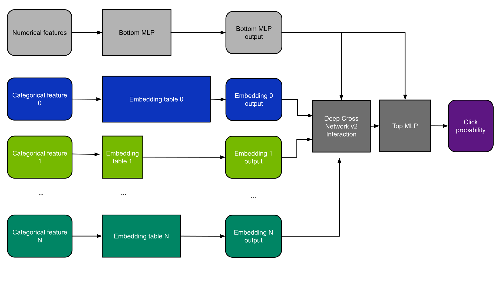
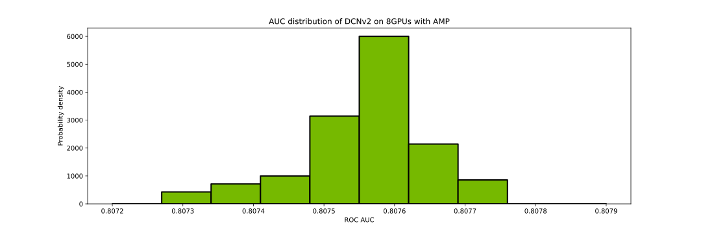

# DCNv2 for TensorFlow 2

## Table Of Contents
  * [Model overview](#model-overview)
     * [Model architecture](#model-architecture)
  * [Quick Start Guide](#quick-start-guide)
  * [Performance](#performance)
     * [Benchmarking](#benchmarking)
        * [Training performance benchmark](#training-performance-benchmark)
        * [Inference performance benchmark](#inference-performance-benchmark)
     * [Training process](#training-process)
     * [Results](#results)
        * [Training accuracy results](#training-accuracy-results)
           * [Training accuracy: NVIDIA DGX A100 (8x A100 80GB)](#training-accuracy-nvidia-dgx-a100-8x-a100-80gb)
           * [Training stability test](#training-stability-test)
        * [Training performance results](#training-performance-results)
           * [Training performance: NVIDIA DGX A100 (8x A100 80GB)](#training-performance-nvidia-dgx-a100-8x-a100-80gb)
        * [Inference performance results](#inference-performance-results)
           * [Inference performance: NVIDIA DGX A100 (8x A100 80GB)](#inference-performance-nvidia-dgx-a100-8x-a100-80gb)

    
## Model overview

The Deep Cross Network version 2 models (DCNv2) were first proposed in 
[DCN V2: Improved Deep & Cross Network and Practical Lessons for Web-scale Learning to Rank Systems](https://arxiv.org/abs/2008.13535)
as an improvement upon [ Deep & Cross Network for Ad Click Predictions.](https://arxiv.org/abs/1708.05123).
It is a learning-to-rank algorithm designed to efficiently learn feature interactions. In this repository, we implement
an example of a DCNv2 model by replacing DLRM's dot interaction layer with a low-rank Deep Cross Network v2 interaction.

For DCNv2, we also chose to use the Adam optimization algorithm to better reflect common industry practices.
This also significantly improves results on the Criteo 1TB dataset but also increases memory usage.


Similarly to our DLRM implementation, we use a technique
called frequency thresholding to demonstrate models of different sizes.
The table below summarizes the model sizes and frequency thresholds used in this repository.
"Total embedding size" means the amount of memory necessary for a single forward pass, while the "GPU Memory required for training"
also includes the memory needed to store the full optimizer state.

The table below summarizes the model sizes and frequency thresholds used in this repository, for both the synthetic and real datasets supported.

| Dataset   | Frequency Threshold | Final dataset size | Intermediate preprocessing storage required |  Suitable for accuracy tests | Total download & preprocess time | GPU Memory required for training | Total embedding size | Number of model parameters | 
|:-------|:-------|:-------|:-------------|:-------------------|:-------------------|:-------------------|:-------------------|:-------------------|
| Synthetic T15             |15  |  6 GiB   | None       | No  | ~Minutes | 48 GiB    | 15.6 GiB  | 4.2B  |
| Synthetic T3              |3   |  6 GiB   | None       | No  | ~Minutes | 250 GiB   | 84.9 GiB  | 22.8B |
| Synthetic T0              |0   |  6 GiB   | None       | No  | ~Minutes | 1.27 TiB  | 421 GiB   | 113B  |
| Real Criteo T15           |15  |  370 GiB | ~Terabytes | Yes | ~Hours   | 48 GiB    | 15.6 GiB  | 4.2B  |
| Real Criteo T3            |3   |  370 GiB | ~Terabytes | Yes | ~Hours   | 250 GiB   | 84.9 GiB  | 22.8B |
| Real Criteo T0            |0   |  370 GiB | ~Terabytes | Yes | ~Hours   | 1.27 TiB  | 421 GiB   | 113B  |

You can find a detailed description of the Criteo dataset preprocessing the [preprocessing documentation](./criteo_dataset.md#advanced).

### Model architecture

DCNv2 accepts two types of features: categorical and numerical. For each categorical feature,
an embedding table is used to provide a dense representation of each unique value.
The dense features enter the model and are transformed by a simple neural network referred to as "Bottom MLP".

This part of the network consists of a series
of linear layers with ReLU activations. The output of the bottom MLP and the embedding vectors are then fed into the
Deep Cross Network v2 interaction layer.
The output of this layer is then concatenated
with the features resulting from the bottom MLP and fed
into the "top MLP," which is a series of dense layers with activations.
The model outputs a single number which can be interpreted as a likelihood of a certain user clicking an ad.

<p align="center">
  
  <br>
Figure 1. The architecture of our DCNv2 model.
</p>

### Hardware requirements

| Dataset   | Disk space required | Total GPU memory required for training | Total embedding size | Suitable for accuracy tests | Total download & preprocess time |
|:-------|:-------------|:-------------------|:-------------------|:-------------------|:-------------------|
| Synthetic Criteo T15 |  370 GiB  | 48 GiB    | 16 GiB  | No  | ~Hours |
| Synthetic Criteo T3  |  370 GiB  | 250 GiB   | 82 GiB  | No  | ~Hours | 
| Synthetic Criteo T0  |  370 GiB  | 1.27 TiB  | 421 GiB | No  | ~Hours |
| Real Criteo T15      |  6 GiB    | 48 GiB    | 16 GiB  | Yes | ~Minutes |
| Real Criteo T3       |  6 GiB    | 250 GiB   | 82 GiB  | Yes | ~Minutes |
| Real Criteo T0       |  6 GiB    | 1.27 TiB  | 421 GiB | Yes | ~Minutes |

## Quick Start Guide

To train DCNv2 perform the following steps.
For the specifics concerning training and inference,
refer to the [Advanced](../README.md#advanced) section.

1. Clone the repository.
```
git clone https://github.com/NVIDIA/DeepLearningExamples
cd DeepLearningExamples/TensorFlow2/Recommendation/DLRM
```

2. Build and run a DCNv2 Docker container.
```bash
docker build -t train_docker_image .
docker run --cap-add SYS_NICE --runtime=nvidia -it --rm --ipc=host  -v ${PWD}/data:/data train_docker_image bash
```

3. Generate a synthetic dataset.

Downloading and preprocessing the Criteo 1TB dataset requires a lot of time and disk space.
Because of this we provide a synthetic dataset generator that roughly matches Criteo 1TB characteristics. 
This will enable you to benchmark quickly.
If you prefer to benchmark on the real data, please follow [these instructions](./criteo_dataset.md#quick-start-guide)
to download and preprocess the dataset.

```bash
python -m dataloading.generate_feature_spec --variant criteo_t15_synthetic  --dst feature_spec.yaml
python -m dataloading.transcribe --src_dataset_type synthetic --src_dataset_path . \
       --dst_dataset_path /data/preprocessed --max_batches_train 1000 --max_batches_test 100 --dst_dataset_type tf_raw
```
4. Verify the input data:

After running `tree /data/preprocessed` you should see the following directory structure:
```bash
$ tree /data/preprocessed
/data/preprocessed
├── feature_spec.yaml
├── test
│   ├── cat_0.bin
│   ├── cat_1.bin
│   ├── ...
│   ├── label.bin
│   └── numerical.bin
└── train
    ├── cat_0.bin
    ├── cat_1.bin
    ├── ...
    ├── label.bin
    └── numerical.bin

2 directories, 57 files
```

5. Start training.

- single-GPU:
```bash
horovodrun -np 1 -H localhost:1 --mpi-args=--oversubscribe numactl --interleave=all -- python -u dcnv2.py --dataset_path /data/preprocessed --amp --xla --save_checkpoint_path /data/checkpoint/
```

- multi-GPU:
```bash
horovodrun -np 8 -H localhost:8 --mpi-args=--oversubscribe numactl --interleave=all -- python -u dcnv2.py --dataset_path /data/preprocessed --amp --xla --save_checkpoint_path /data/checkpoint/
```

6. Start evaluation.

To evaluate a previously trained checkpoint, append `--restore_checkpoint_path <path> --mode eval` to the command used for training. For example, to test a checkpoint trained on 8xA100 80GB, run:

```bash
horovodrun -np 8 -H localhost:8 --mpi-args=--oversubscribe numactl --interleave=all -- python -u dcnv2.py --dataset_path /data/preprocessed --amp --xla --restore_checkpoint_path /data/checkpoint/ --mode eval
```

## Performance

The performance measurements in this document were conducted at the time of publication and may not reflect the performance achieved from NVIDIA’s latest software release. For the most up-to-date performance measurements, go to [NVIDIA Data Center Deep Learning Product Performance](https://developer.nvidia.com/deep-learning-performance-training-inference).

### Benchmarking

The following section shows how to run benchmarks measuring the model performance in training and inference modes.

#### Training performance benchmark

To benchmark the training performance on a specific batch size, follow the instructions
in the [Quick Start Guide](#quick-start-guide). You can also add the `--max_steps 1000`
if you want to get a reliable throughput measurement without running the entire training.

You can also use synthetic data by running with the `--dataset_type synthetic` option if you haven't downloaded the dataset yet.

#### Inference performance benchmark

To benchmark the inference performance on a specific batch size, run:

```
horovodrun -np 1 -H localhost:1 --mpi-args=--oversubscribe numactl --interleave=all -- python -u dcnv2.py --dataset_path /data/preprocessed --amp --restore_checkpoint_path <checkpoint_path> --mode inference
```

### Training process

The main training scripts resides in `dcnv2.py`. The training speed  is measured by throughput, that is,
the number of samples processed per second.
We use mixed precision training with static loss scaling for the bottom and top MLPs
while embedding tables are stored in FP32 format.

### Results

The following sections provide details on how we achieved our performance and accuracy in training and inference.

We used three model size variants to show memory scalability in a multi-GPU setup
(4.2B params, 22.8B params, and 113B params). Refer to the [Model overview](#model-overview) section for detailed
information about the model variants.

#### Training accuracy results

##### Training accuracy: NVIDIA DGX A100 (8x A100 80GB)

Our results were obtained by running training scripts as described in the Quick Start Guide in the DCNv2 Docker container.

| GPUs   | Model size   | Batch size / GPU   | Accuracy (AUC) - TF32   | Accuracy (AUC) - mixed precision   | Time to train - TF32 [minutes]   | Time to train - mixed precision [minutes]   | Time to train speedup (TF32 to mixed precision)   |
|:-------|:-------------|:-------------------|:------------------------|:-----------------------------------|:---------------------------------|:--------------------------------------------|:--------------------------------------------------|
| 1      | small        | 64k                | 0.8078                  | 0.8077                             | 102.7                            | 51.7                                        | 1.99                                              |
| 8      | large        | 8k                 | 0.8075                  | 0.8074                             | 19.5                             | 13.3                                        | 1.33                                              |


##### Training stability test

The histograms below show the distribution of ROC AUC results achieved at the end of the training.

<p align="center">
  
  <br>
Figure 4. Results of stability tests for DCNv2.
</p>


#### Training performance results


We used throughput in items processed per second as the performance metric.


##### Training performance: NVIDIA DGX A100 (8x A100 80GB)

Our results were obtained by following the commands from the Quick Start Guide
in the DCNv2 Docker container on NVIDIA DGX A100 (8x A100 80GB) GPUs. Performance numbers (in items per second) were averaged over 1000 training steps.

| GPUs   | Model size   | Batch size / GPU   | Throughput - TF32   | Throughput - mixed precision   | Throughput speedup (TF32 to mixed precision)   |
|:-------|:-------------|:-------------------|:--------------------|:-------------------------------|:-----------------------------------------------|
| 1      | small        | 64k                | 0.689M              | 1.37M                          | 1.99                                           |
| 8      | large        | 8k                 | 3.81M               | 5.75M                          | 1.51                                           |


To achieve the same results, follow the steps in the [Quick Start Guide](#quick-start-guide).

#### Inference performance results

##### Inference performance: NVIDIA DGX A100 (8x A100 80GB)

|   GPUs | Model size   |   Batch size / GPU | Throughput - TF32   | Throughput - mixed precision   |   Average latency - TF32 [ms] |   Average latency - mixed precision [ms] |   Throughput speedup (mixed precision to TF32) |
|-------:|:-------------|-------------------:|:--------------------|:-------------------------------|------------------------------:|-----------------------------------------:|-----------------------------------------------:|
|      1 | small        |               2048 | 1.30M               | 1.31                           |                         1.57  |                                    1.56  |                                           1.01 |
