# Deploying Large Recommender models with Merlin HPS and Triton Inference Server

This file contains instructions to run inference
on Triton Inference Server as well as detailed performance analysis for DLRM and DCNv2
with Merlin HPS and TensorRT. It is intended to provide the best possible performance for
inference with recommender models that don't fit into a single GPU memory.

For models that can fit into a single GPU or, for some reason, cannot use Merlin HPS, we maintain 
a separate solution, described [here](tensorflow_inference.md).


## Solution overview
### Introduction

The [NVIDIA Triton Inference Server](https://github.com/NVIDIA/triton-inference-server)
provides a data center and cloud inferencing solution optimized for NVIDIA GPUs.
The server provides an inference service via an HTTP or gRPC endpoint,
allowing remote clients to request inferencing for any number of GPU
or CPU models being managed by the server.

This README provides step-by-step deployment instructions for models generated
during training (as described in the [model README](../README.md)).
Additionally, this README provides the corresponding deployment scripts that
ensure optimal GPU utilization during inferencing on Triton Inference Server.

### Deployment with Merlin Hierarchical Parameter Server (HPS)

[Merlin Hierarchical Parameter Server (HPS)](https://nvidia-merlin.github.io/HugeCTR/main/hierarchical_parameter_server/index.html)
library is a native C++ library that provides caching and
hierarchical storage for embeddings. The library is built from the GPU embedding cache
and HPS database backend subcomponents.

HPS offers flexible deployment and configuration to meet site-specific recommender system needs and is integrated
by other projects that need the ability to work with embeddings that exceed the capacity of the GPU and host memory.

Here, HPS is used to offload the least frequently used embedding vectors into CPU memory. This way, we can efficiently
serve models that do not fit in the GPU. This approach is illustrated in Figure 1.

<p align="center">
  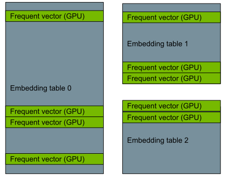
  <br>
Figure 1. GPU cache as a way to serve very large embedding tables.
</p>

In the example below, the model served as a Triton Ensemble, that is, it is 
composed of two submodels. The first submodel is the HPS part that handles the embedding lookup (sparse submodel). 

The second part is the dense submodel. It consists of the interaction layer and the MLPs with linear layers. Those are
run with NVIDIA TensorRT Triton backend.

The communication between the submodels is managed efficiently with CUDA memory copies by Triton.

This solution allows us to get the benefits of Merlin HPS for the sparse part as well as the latest performance optimizations
for the linear and interaction layers offered by NVIDIA TensorRT. The overall architecture of this approach is depicted in Figure 2.

<p align="center">
  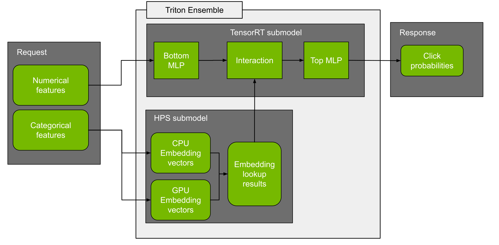
  <br>
Figure 2. Overall architecture of the Merlin HPS + TensorRT ensemble for running large recommender inference.
</p>


### Deployment process

The deployment process consists of two steps:

1. Conversion.

   The purpose of conversion is to transform the checkpoint saved during training into a ready-to-serve model.
   
2. Configuration.

   Model configuration on Triton Inference Server that generates
   necessary [configuration files](https://github.com/triton-inference-server/server/blob/master/docs/model_configuration.md).

After deployment, the Triton inference server is used for the evaluation of the converted model in two steps:

1. Correctness tests.

   Produce results that are tested against given correctness thresholds.

2. Performance tests.

   Produce latency and throughput results for offline (static batching)
   and online (dynamic batching) scenarios.


Refer to [Quick Start Guide](#quick-start-guide) for further instructions on performing these tests.


## Setup
Ensure you have the following components:
* [NVIDIA Docker](https://github.com/NVIDIA/nvidia-docker)
* [NVIDIA TensorFlow NGC container 22.02](https://catalog.ngc.nvidia.com/orgs/nvidia/containers/tensorflow)
* [NVIDIA Triton Inference Server NGC container 22.02](https://ngc.nvidia.com/catalog/containers/nvidia:tritonserver)
* [NVIDIA CUDA](https://docs.nvidia.com/cuda/archive//index.html)
* [NVIDIA Ampere](https://www.nvidia.com/en-us/data-center/nvidia-ampere-gpu-architecture/), [Volta](https://www.nvidia.com/en-us/data-center/volta-gpu-architecture/) or [Turing](https://www.nvidia.com/en-us/geforce/turing/) based GPU


## Quick Start Guide
The instructions below assume you have already cloned the repository,
built the training docker container, preprocessed the Criteo
1TB dataset, run the training and saved a model checkpoint.
If you haven't completed those steps, refer
to the [Quick Start Guide for DLRM](DLRM.md#quick-start-guide)
or the [Quick Start Guide to DCNv2](DCNv2.md#quick-start-guide),
depending on which model you'd like to deploy.


1. Build the Merlin HPS docker container:

```
cd deployment/hps
docker build -t hps_triton .
```

2. Run the training docker container built during the training stage:

```
# set input variables
checkpoint_path=<path_to_checkpoint_saved_during_training>
deploy_path=<destination_path_of_the_triton_model_repository>
dataset_path=<path_to_the_dataset>

mkdir -p $deploy_path
docker run -v $checkpoint_path:$checkpoint_path -v $deploy_path:$deploy_path -v $dataset_path:$dataset_path -it --rm --network=host --ipc=host \
    --shm-size=2g --ulimit memlock=-1 --ulimit stack=67108864 --gpus=all --cap-add SYS_NICE train_docker_image \
    bash
```

3. Convert the model checkpoint into a Triton model repository:

```
# set input variables inside the container
checkpoint_path=<path_to_checkpoint_saved_during_training>
deploy_path=<destination_path_of_the_triton_model_repository>
dataset_path=<path_to_the_dataset>

# run the deployment
horovodrun -np 1 --mpi-args=--oversubscribe numactl --interleave=all \
  python -m deployment.deploy --hps_gpucacheper 0.1 \
  --checkpoint-dir $checkpoint_path --model-repository-path $deploy_path --num_gpus 1\
  --fused_embedding --model-name dlrm --model-precision fp16 --dense-format trt\
  --sparse-format hps
```

4. In a separate terminal start the Triton Inference Server:

```
deploy_path=<destination_path_of_the_triton_model_repository>

docker run -v $deploy_path:$deploy_path -it --rm --network=host --detach --ipc=host \
  --shm-size=2g --ulimit memlock=-1 --ulimit stack=67108864 --gpus=all hps_triton \
  bash -c "tritonserver --model-repository=${deploy_path} --backend-config=hps,ps=${deploy_path}/sparse/sparse.json\
  --pinned-memory-pool-byte-size=4000000000 --cuda-memory-pool-byte-size=0:2000000000 2>&1"
```

5. Switch back to the first terminal with the training container. Warm up the server with some initial requests:

```
python -u -m deployment.evaluate_accuracy --max_steps 1000 --dataset_path $dataset_path \
    --fused_embedding --model_name dlrm --test_on_train --batch_size 16384 --sparse_input_format hps
```

6. Measure inference execution speed

```
python -u -m deployment.evaluate_latency --sparse-format hps --model-name dlrm --dataset_path $dataset_path \
    --fused-embedding --measurement-request-count 50 --measurement-interval 5000 \
    --batch-sizes 4096 --num-benchmark-samples 262144
```

7. Measure the prediction quality of the deployed model

```
python -u -m deployment.evaluate_accuracy --dataset_path $dataset_path --fused_embedding \
    --model_name dlrm --batch_size 16384 --sparse_input_format hps"
```


## Performance
The performance measurements in this document were conducted at the time of publication and may not reflect
the performance achieved from NVIDIA’s latest software release. For the most up-to-date performance measurements, go to
[NVIDIA Data Center Deep Learning Product Performance](https://developer.nvidia.com/deep-learning-performance-training-inference).


### Offline scenario

The offline scenario assumes the client and server are located on the same host. The tests uses:
- tensors are passed through shared memory between client and server, the Perf Analyzer flag `shared-memory=system` is used
- single request is send from client to server with static size of batch

#### Offline: DLRM on NVIDIA DGX A100 (1x A100 80GB), Merlin HPS + TensorRT with FP32
Our results were obtained using the following configuration:

| Parameter Name               | Parameter Value              |
|:-----------------------------|:-----------------------------|
| GPU                          |NVIDIA DGX A100 (1x A100 80GB)            |
| Model architecture | DLRM |
| Model size | 22B parameters |
| Backend                      |NVDIA Merlin HPS + NVIDIA TensorRT|
| Backend accelerator          |-|
| Precision                    |FP32      |
| Model format                 |NVIDIA Triton Ensemble (NVDIA Merlin HPS + NVIDIA TensorRT)|
| Max batch size               |65536|
| Number of model instances    |1|
| Export Format | TensorFlow SavedModel|
| NVIDIA TensorRT Capture CUDA Graph | Enabled|
| Device Kind | gpu|

<details><summary>Results Table</summary>

|    |   Batch |   Concurrency |   Inferences/Second |   Client Send |   Network+Server Send/Recv |   Server Queue |   Server Compute Input |   Server Compute Infer |   Server Compute Output |   Client Recv |   p50 latency |   p90 latency |   p95 latency |   p99 latency |   avg latency |
|---:|--------:|--------------:|--------------------:|--------------:|---------------------------:|---------------:|-----------------------:|-----------------------:|------------------------:|--------------:|--------------:|--------------:|--------------:|--------------:|--------------:|
|  0 |     256 |             1 |            3.64e+05 |            22 |                        175 |              0 |                     35 |                    393 |                      71 |             0 |           689 |           713 |           718 |           794 |           696 |
|  1 |    1024 |             1 |            1.25e+06 |            23 |                        169 |              0 |                     46 |                    506 |                      69 |             0 |           787 |           849 |          1054 |          1128 |           813 |
|  2 |    4096 |             1 |            2.33e+06 |            24 |                        236 |              0 |                    100 |                   1276 |                     114 |             0 |          1717 |          1748 |          1893 |          2408 |          1750 |
|  3 |   16384 |             1 |            2.88e+06 |            86 |                        648 |              0 |                    337 |                   4291 |                     320 |             0 |          5527 |          5602 |          7016 |          8573 |          5682 |
|  4 |   65536 |             1 |            3.36e+06 |            31 |                       1210 |              0 |                   1228 |                  15777 |                    1144 |             0 |         19093 |         19277 |         21757 |         24888 |         19390 |

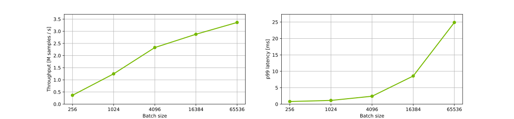
</details>


#### Offline: DLRM on NVIDIA DGX A100 (1x A100 80GB), Merlin HPS + TensorRT with FP16
Our results were obtained using the following configuration:

| Parameter Name               | Parameter Value              |
|:-----------------------------|:-----------------------------|
| GPU                          |NVIDIA DGX A100 (1x A100 80GB)            |
| Model architecture | DLRM |
| Model size | 22B parameters |
| Backend                      |NVDIA Merlin HPS + NVIDIA TensorRT|
| Backend accelerator          |-|
| Precision                    |FP16      |
| Model format                 |NVIDIA Triton Ensemble (NVDIA Merlin HPS + NVIDIA TensorRT)|
| Max batch size               |65536|
| Number of model instances    |1|
| Export Format | TensorFlow SavedModel|
| NVIDIA TensorRT Capture CUDA Graph | Enabled|
| Device Kind | gpu|

<details><summary>Results Table</summary>

|    |   Batch |   Concurrency |   Inferences/Second |   Client Send |   Network+Server Send/Recv |   Server Queue |   Server Compute Input |   Server Compute Infer |   Server Compute Output |   Client Recv |   p50 latency |   p90 latency |   p95 latency |   p99 latency |   avg latency |
|---:|--------:|--------------:|--------------------:|--------------:|---------------------------:|---------------:|-----------------------:|-----------------------:|------------------------:|--------------:|--------------:|--------------:|--------------:|--------------:|--------------:|
|  0 |     256 |             1 |            4.01e+05 |            23 |                        156 |              0 |                     33 |                    351 |                      69 |             0 |           624 |           661 |           669 |           738 |           632 |
|  1 |    1024 |             1 |            1.25e+06 |            23 |                        211 |              0 |                     52 |                    456 |                      68 |             0 |           786 |           807 |          1057 |          1130 |           810 |
|  2 |    4096 |             1 |            2.62e+06 |            26 |                        294 |              0 |                     99 |                   1028 |                     109 |             0 |          1533 |          1568 |          1579 |          1743 |          1556 |
|  3 |   16384 |             1 |            4.00e+06 |            27 |                        379 |              0 |                    328 |                   3042 |                     309 |             0 |          4001 |          4098 |          4627 |          5833 |          4085 |
|  4 |   65536 |             1 |            4.30e+06 |            34 |                       1660 |              0 |                   1227 |                  11150 |                    1102 |             0 |         14941 |         15309 |         16989 |         20144 |         15173 |


</details>


#### Offline: DLRM on NVIDIA A30, Merlin HPS + TensorRT with FP32
Our results were obtained using the following configuration:

| Parameter Name               | Parameter Value              |
|:-----------------------------|:-----------------------------|
| GPU                          |NVIDIA A30            |
| Model architecture | DLRM |
| Model size | 22B parameters |
| Backend                      |NVDIA Merlin HPS + NVIDIA TensorRT|
| Backend accelerator          |-|
| Precision                    |FP32      |
| Model format                 |NVIDIA Triton Ensemble (NVDIA Merlin HPS + NVIDIA TensorRT)|
| Max batch size               |65536|
| Number of model instances    |1|
| Export Format | TensorFlow SavedModel|
| NVIDIA TensorRT Capture CUDA Graph | Enabled|
| Device Kind | gpu|

<details><summary>Results Table</summary>

|    |   Batch |   Concurrency |   Inferences/Second |   Client Send |   Network+Server Send/Recv |   Server Queue |   Server Compute Input |   Server Compute Infer |   Server Compute Output |   Client Recv |   p50 latency |   p90 latency |   p95 latency |   p99 latency |   avg latency |
|---:|--------:|--------------:|--------------------:|--------------:|---------------------------:|---------------:|-----------------------:|-----------------------:|------------------------:|--------------:|--------------:|--------------:|--------------:|--------------:|--------------:|
|  0 |     256 |             1 |            3.07e+05 |            22 |                        194 |              0 |                     42 |                    512 |                      57 |             0 |           801 |           832 |          1001 |          1103 |           827 |
|  1 |    1024 |             1 |            9.60e+05 |            30 |                        194 |              0 |                     78 |                    690 |                      65 |             0 |          1040 |          1120 |          1154 |          1475 |          1057 |
|  2 |    4096 |             1 |            1.38e+06 |            53 |                        482 |              0 |                    233 |                   2014 |                     181 |             0 |          2941 |          3009 |          3021 |          3059 |          2963 |
|  3 |   16384 |             1 |            1.71e+06 |            47 |                        467 |              0 |                    894 |                   7529 |                     648 |             0 |          9534 |          9714 |          9783 |         11371 |          9585 |
|  4 |   65536 |             1 |            1.79e+06 |            76 |                       4207 |              1 |                   2574 |                  27369 |                    2307 |             0 |         34512 |         39707 |         39914 |         61100 |         36534 |

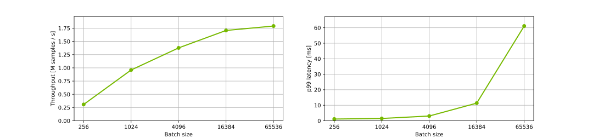
</details>


#### Offline: DLRM on NVIDIA A30, Merlin HPS + TensorRT with FP16
Our results were obtained using the following configuration:

| Parameter Name               | Parameter Value              |
|:-----------------------------|:-----------------------------|
| GPU                          |NVIDIA A30            |
| Model architecture | DLRM |
| Model size | 22B parameters |
| Backend                      |NVDIA Merlin HPS + NVIDIA TensorRT|
| Backend accelerator          |-|
| Precision                    |FP16      |
| Model format                 |NVIDIA Triton Ensemble (NVDIA Merlin HPS + NVIDIA TensorRT)|
| Max batch size               |65536|
| Number of model instances    |1|
| Export Format | TensorFlow SavedModel|
| NVIDIA TensorRT Capture CUDA Graph | Enabled|
| Device Kind | gpu|

<details><summary>Results Table</summary>

|    |   Batch |   Concurrency |   Inferences/Second |   Client Send |   Network+Server Send/Recv |   Server Queue |   Server Compute Input |   Server Compute Infer |   Server Compute Output |   Client Recv |   p50 latency |   p90 latency |   p95 latency |   p99 latency |   avg latency |
|---:|--------:|--------------:|--------------------:|--------------:|---------------------------:|---------------:|-----------------------:|-----------------------:|------------------------:|--------------:|--------------:|--------------:|--------------:|--------------:|--------------:|
|  0 |     256 |             1 |            3.30e+05 |            21 |                        210 |              0 |                     37 |                    447 |                      54 |             0 |           757 |           773 |           790 |          1035 |           769 |
|  1 |    1024 |             1 |            1.06e+06 |            22 |                        220 |              0 |                     95 |                    567 |                      58 |             0 |           955 |           978 |           986 |          1138 |           962 |
|  2 |    4096 |             1 |            1.49e+06 |            36 |                        664 |              0 |                    244 |                   1623 |                     172 |             0 |          2735 |          2770 |          2781 |          2820 |          2739 |
|  3 |   16384 |             1 |            2.17e+06 |            66 |                        607 |              0 |                    903 |                   5357 |                     606 |             0 |          7558 |          7633 |          7641 |          7662 |          7539 |
|  4 |   65536 |             1 |            2.40e+06 |            73 |                       3640 |              1 |                   2584 |                  18617 |                    2292 |             0 |         25568 |         31138 |         31241 |         39514 |         27207 |

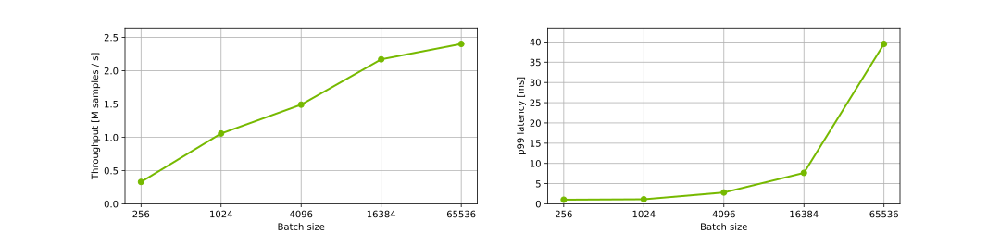
</details>


#### Offline: DLRM on NVIDIA T4, Merlin HPS + TensorRT with FP32
Our results were obtained using the following configuration:

| Parameter Name               | Parameter Value              |
|:-----------------------------|:-----------------------------|
| GPU                          |NVIDIA T4            |
| Model architecture | DLRM |
| Model size | 22B parameters |
| Backend                      |NVDIA Merlin HPS + NVIDIA TensorRT|
| Backend accelerator          |-|
| Precision                    |FP32      |
| Model format                 |NVIDIA Triton Ensemble (NVDIA Merlin HPS + NVIDIA TensorRT)|
| Max batch size               |65536|
| Number of model instances    |1|
| Export Format | TensorFlow SavedModel|
| NVIDIA TensorRT Capture CUDA Graph | Enabled|
| Device Kind | gpu|

<details><summary>Results Table</summary>

|    |   Batch |   Concurrency |   Inferences/Second |   Client Send |   Network+Server Send/Recv |   Server Queue |   Server Compute Input |   Server Compute Infer |   Server Compute Output |   Client Recv |   p50 latency |   p90 latency |   p95 latency |   p99 latency |   avg latency |
|---:|--------:|--------------:|--------------------:|--------------:|---------------------------:|---------------:|-----------------------:|-----------------------:|------------------------:|--------------:|--------------:|--------------:|--------------:|--------------:|--------------:|
|  0 |     256 |             1 |            1.33e+05 |            53 |                        523 |              0 |                    104 |                   1156 |                      75 |             0 |          1916 |          2120 |          2170 |          2295 |          1911 |
|  1 |    1024 |             1 |            3.76e+05 |            50 |                        405 |              0 |                    131 |                   1957 |                     159 |             0 |          2697 |          2804 |          2836 |          2904 |          2702 |
|  2 |    4096 |             1 |            4.41e+05 |            46 |                        759 |              0 |                    479 |                   7384 |                     610 |             0 |          9228 |          9511 |          9645 |         10538 |          9278 |
|  3 |   16384 |             1 |            4.77e+05 |            48 |                       1219 |              1 |                   1865 |                  29110 |                    1942 |             0 |         33483 |         34759 |         35025 |         55576 |         34185 |
|  4 |   65536 |             1 |            4.93e+05 |            54 |                       4437 |              0 |                   7400 |                 113167 |                    7262 |             0 |        131638 |        133320 |        133731 |        142058 |        132320 |

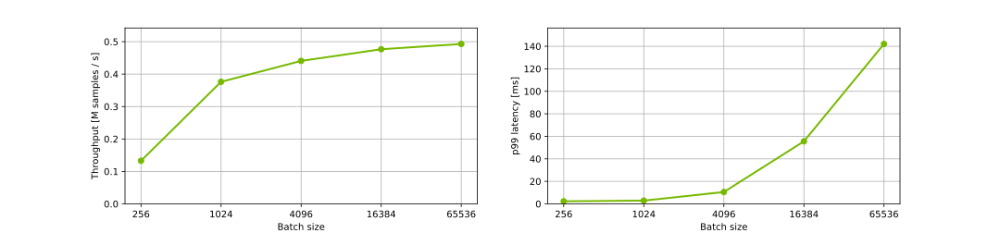
</details>


#### Offline: DLRM on NVIDIA T4, Merlin HPS + TensorRT with FP16
Our results were obtained using the following configuration:

| Parameter Name               | Parameter Value              |
|:-----------------------------|:-----------------------------|
| GPU                          |NVIDIA T4            |
| Model architecture | DLRM |
| Model size | 22B parameters |
| Backend                      |NVDIA Merlin HPS + NVIDIA TensorRT|
| Backend accelerator          |-|
| Precision                    |FP16      |
| Model format                 |NVIDIA Triton Ensemble (NVDIA Merlin HPS + NVIDIA TensorRT)|
| Max batch size               |65536|
| Number of model instances    |1|
| Export Format | TensorFlow SavedModel|
| NVIDIA TensorRT Capture CUDA Graph | Enabled|
| Device Kind | gpu|

<details><summary>Results Table</summary>

|    |   Batch |   Concurrency |   Inferences/Second |   Client Send |   Network+Server Send/Recv |   Server Queue |   Server Compute Input |   Server Compute Infer |   Server Compute Output |   Client Recv |   p50 latency |   p90 latency |   p95 latency |   p99 latency |   avg latency |
|---:|--------:|--------------:|--------------------:|--------------:|---------------------------:|---------------:|-----------------------:|-----------------------:|------------------------:|--------------:|--------------:|--------------:|--------------:|--------------:|--------------:|
|  0 |     256 |             1 |            2.36e+05 |            28 |                        201 |              0 |                     83 |                    703 |                      63 |             0 |          1039 |          1250 |          1355 |          1593 |          1078 |
|  1 |    1024 |             1 |            4.92e+05 |            49 |                        622 |              0 |                    190 |                   1112 |                      95 |             0 |          2061 |          2220 |          2259 |          2324 |          2068 |
|  2 |    4096 |             1 |            7.55e+05 |            43 |                        657 |              0 |                    483 |                   3600 |                     626 |             0 |          5402 |          5514 |          5533 |          5599 |          5409 |
|  3 |   16384 |             1 |            8.73e+05 |            46 |                       1120 |              0 |                   1884 |                  13703 |                    1966 |             0 |         18175 |         19323 |         23458 |         29656 |         18719 |
|  4 |   65536 |             1 |            9.34e+05 |            40 |                       3691 |              0 |                   7466 |                  51644 |                    7330 |             0 |         69254 |         71662 |         72009 |         86622 |         70171 |

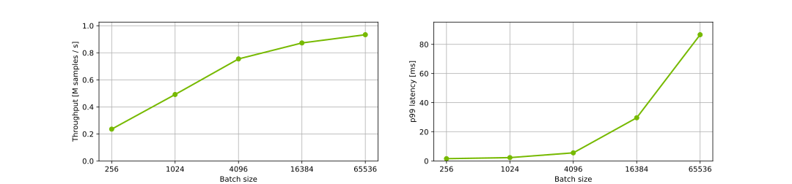
</details>


#### Offline: DCNv2 on NVIDIA DGX A100 (1x A100 80GB), Merlin HPS + TensorRT with FP32
Our results were obtained using the following configuration:

| Parameter Name               | Parameter Value              |
|:-----------------------------|:-----------------------------|
| GPU                          |NVIDIA DGX A100 (1x A100 80GB)            |
| Model architecture | DCNv2 |
| Model size | 22B parameters |
| Backend                      |NVDIA Merlin HPS + NVIDIA TensorRT|
| Backend accelerator          |-|
| Precision                    |FP32      |
| Model format                 |NVIDIA Triton Ensemble (NVDIA Merlin HPS + NVIDIA TensorRT)|
| Max batch size               |65536|
| Number of model instances    |1|
| Export Format | TensorFlow SavedModel|
| NVIDIA TensorRT Capture CUDA Graph | Enabled|
| Device Kind | gpu|

<details><summary>Results Table</summary>

|    |   Batch |   Concurrency |   Inferences/Second |   Client Send |   Network+Server Send/Recv |   Server Queue |   Server Compute Input |   Server Compute Infer |   Server Compute Output |   Client Recv |   p50 latency |   p90 latency |   p95 latency |   p99 latency |   avg latency |
|---:|--------:|--------------:|--------------------:|--------------:|---------------------------:|---------------:|-----------------------:|-----------------------:|------------------------:|--------------:|--------------:|--------------:|--------------:|--------------:|--------------:|
|  0 |     256 |             1 |            2.63e+05 |            23 |                        159 |              0 |                     36 |                    681 |                      69 |             0 |           955 |           983 |          1098 |          1137 |           968 |
|  1 |    1024 |             1 |            8.19e+05 |            22 |                        204 |              0 |                     50 |                    897 |                      68 |             0 |          1234 |          1254 |          1261 |          1384 |          1241 |
|  2 |    4096 |             1 |            1.25e+06 |            33 |                        349 |              0 |                    107 |                   2681 |                     105 |             0 |          3204 |          3316 |          4108 |          4271 |          3275 |
|  3 |   16384 |             1 |            1.31e+06 |            32 |                        468 |              0 |                    326 |                  11346 |                     329 |             0 |         12338 |         12459 |         14463 |         14674 |         12501 |
|  4 |   65536 |             1 |            1.33e+06 |            35 |                       1180 |              0 |                   1260 |                  45518 |                    1183 |             0 |         48985 |         49121 |         49142 |         54691 |         49176 |

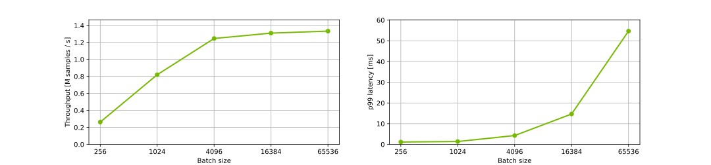
</details>


#### Offline: DCNv2 on NVIDIA DGX A100 (1x A100 80GB), Merlin HPS + TensorRT with FP16
Our results were obtained using the following configuration:

| Parameter Name               | Parameter Value              |
|:-----------------------------|:-----------------------------|
| GPU                          |NVIDIA DGX A100 (1x A100 80GB)            |
| Model architecture | DCNv2 |
| Model size | 22B parameters |
| Backend                      |NVDIA Merlin HPS + NVIDIA TensorRT|
| Backend accelerator          |-|
| Precision                    |FP16      |
| Model format                 |NVIDIA Triton Ensemble (NVDIA Merlin HPS + NVIDIA TensorRT)|
| Max batch size               |65536|
| Number of model instances    |1|
| Export Format | TensorFlow SavedModel|
| NVIDIA TensorRT Capture CUDA Graph | Enabled|
| Device Kind | gpu|

<details><summary>Results Table</summary>

|    |   Batch |   Concurrency |   Inferences/Second |   Client Send |   Network+Server Send/Recv |   Server Queue |   Server Compute Input |   Server Compute Infer |   Server Compute Output |   Client Recv |   p50 latency |   p90 latency |   p95 latency |   p99 latency |   avg latency |
|---:|--------:|--------------:|--------------------:|--------------:|---------------------------:|---------------:|-----------------------:|-----------------------:|------------------------:|--------------:|--------------:|--------------:|--------------:|--------------:|--------------:|
|  0 |     256 |             1 |            3.17e+05 |            23 |                        172 |              0 |                     36 |                    501 |                      69 |             0 |           797 |           809 |           815 |           942 |           801 |
|  1 |    1024 |             1 |            1.03e+06 |            24 |                        181 |              0 |                     48 |                    667 |                      69 |             0 |           960 |          1018 |          1277 |          1337 |           989 |
|  2 |    4096 |             1 |            1.85e+06 |            24 |                        276 |              0 |                    101 |                   1708 |                     101 |             0 |          2144 |          2184 |          2485 |          3562 |          2210 |
|  3 |   16384 |             1 |            2.24e+06 |            82 |                        429 |              0 |                    327 |                   6081 |                     383 |             0 |          7056 |          7145 |          8028 |          9417 |          7302 |
|  4 |   65536 |             1 |            2.45e+06 |            33 |                       1262 |              0 |                   1237 |                  23144 |                    1102 |             0 |         26602 |         26709 |         26800 |         33534 |         26778 |

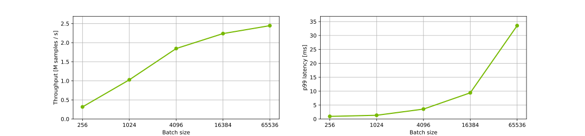
</details>


#### Offline: DCNv2 on NVIDIA A30, Merlin HPS + TensorRT with FP32
Our results were obtained using the following configuration:

| Parameter Name               | Parameter Value              |
|:-----------------------------|:-----------------------------|
| GPU                          |NVIDIA A30            |
| Model architecture | DCNv2 |
| Model size | 22B parameters |
| Backend                      |NVDIA Merlin HPS + NVIDIA TensorRT|
| Backend accelerator          |-|
| Precision                    |FP32      |
| Model format                 |NVIDIA Triton Ensemble (NVDIA Merlin HPS + NVIDIA TensorRT)|
| Max batch size               |65536|
| Number of model instances    |1|
| Export Format | TensorFlow SavedModel|
| NVIDIA TensorRT Capture CUDA Graph | Enabled|
| Device Kind | gpu|

<details><summary>Results Table</summary>

|    |   Batch |   Concurrency |   Inferences/Second |   Client Send |   Network+Server Send/Recv |   Server Queue |   Server Compute Input |   Server Compute Infer |   Server Compute Output |   Client Recv |   p50 latency |   p90 latency |   p95 latency |   p99 latency |   avg latency |
|---:|--------:|--------------:|--------------------:|--------------:|---------------------------:|---------------:|-----------------------:|-----------------------:|------------------------:|--------------:|--------------:|--------------:|--------------:|--------------:|--------------:|
|  0 |     256 |             1 |            1.85e+05 |            22 |                        207 |              0 |                     42 |                   1036 |                      70 |             0 |          1355 |          1377 |          1388 |          1442 |          1377 |
|  1 |    1024 |             1 |            5.64e+05 |            24 |                        180 |              0 |                     79 |                   1458 |                      66 |             0 |          1806 |          1824 |          1832 |          1866 |          1807 |
|  2 |    4096 |             1 |            7.55e+05 |            57 |                        323 |              0 |                    245 |                   4629 |                     156 |             0 |          5399 |          5484 |          5519 |          5588 |          5410 |
|  3 |   16384 |             1 |            8.16e+05 |            74 |                       1249 |              1 |                    899 |                  17135 |                     674 |             0 |         19579 |         20101 |         24995 |         27916 |         20032 |
|  4 |   65536 |             1 |            8.79e+05 |            78 |                       1603 |              1 |                   3586 |                  66689 |                    2346 |             0 |         73906 |         74311 |         74558 |         85554 |         74303 |

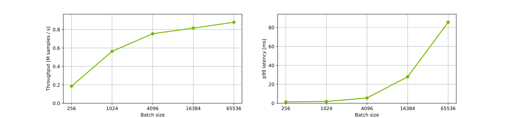
</details>


#### Offline: DCNv2 on NVIDIA A30, Merlin HPS + TensorRT with FP16
Our results were obtained using the following configuration:

| Parameter Name               | Parameter Value              |
|:-----------------------------|:-----------------------------|
| GPU                          |NVIDIA A30            |
| Model architecture | DCNv2 |
| Model size | 22B parameters |
| Backend                      |NVDIA Merlin HPS + NVIDIA TensorRT|
| Backend accelerator          |-|
| Precision                    |FP16      |
| Model format                 |NVIDIA Triton Ensemble (NVDIA Merlin HPS + NVIDIA TensorRT)|
| Max batch size               |65536|
| Number of model instances    |1|
| Export Format | TensorFlow SavedModel|
| NVIDIA TensorRT Capture CUDA Graph | Enabled|
| Device Kind | gpu|

<details><summary>Results Table</summary>

|    |   Batch |   Concurrency |   Inferences/Second |   Client Send |   Network+Server Send/Recv |   Server Queue |   Server Compute Input |   Server Compute Infer |   Server Compute Output |   Client Recv |   p50 latency |   p90 latency |   p95 latency |   p99 latency |   avg latency |
|---:|--------:|--------------:|--------------------:|--------------:|---------------------------:|---------------:|-----------------------:|-----------------------:|------------------------:|--------------:|--------------:|--------------:|--------------:|--------------:|--------------:|
|  0 |     256 |             1 |            2.72e+05 |            30 |                        177 |              0 |                     37 |                    636 |                      55 |             0 |           918 |           961 |          1108 |          1144 |           935 |
|  1 |    1024 |             1 |            7.02e+05 |            22 |                        309 |              0 |                     95 |                    964 |                      62 |             0 |          1436 |          1455 |          1462 |          1629 |          1452 |
|  2 |    4096 |             1 |            1.14e+06 |            57 |                        319 |              1 |                    243 |                   2788 |                     166 |             0 |          3579 |          3630 |          3647 |          3672 |          3574 |
|  3 |   16384 |             1 |            1.25e+06 |            72 |                       1942 |              1 |                    856 |                   9644 |                     626 |             0 |         13295 |         13556 |         13650 |         16335 |         13141 |
|  4 |   65536 |             1 |            1.42e+06 |            80 |                       2698 |              1 |                   2700 |                  38237 |                    2331 |             0 |         44644 |         48730 |         49194 |         61910 |         46047 |

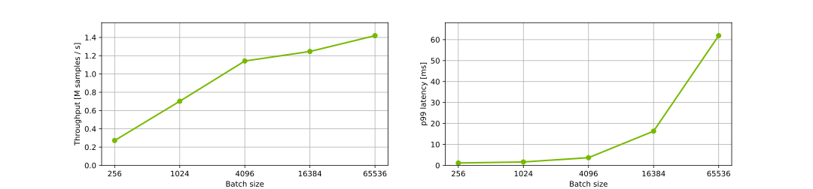
</details>


#### Offline: DCNv2 on NVIDIA T4, Merlin HPS + TensorRT with FP32
Our results were obtained using the following configuration:

| Parameter Name               | Parameter Value              |
|:-----------------------------|:-----------------------------|
| GPU                          |NVIDIA T4            |
| Model architecture | DCNv2 |
| Model size | 22B parameters |
| Backend                      |NVDIA Merlin HPS + NVIDIA TensorRT|
| Backend accelerator          |-|
| Precision                    |FP32      |
| Model format                 |NVIDIA Triton Ensemble (NVDIA Merlin HPS + NVIDIA TensorRT)|
| Max batch size               |65536|
| Number of model instances    |1|
| Export Format | TensorFlow SavedModel|
| NVIDIA TensorRT Capture CUDA Graph | Enabled|
| Device Kind | gpu|

<details><summary>Results Table</summary>

|    |   Batch |   Concurrency |   Inferences/Second |   Client Send |   Network+Server Send/Recv |   Server Queue |   Server Compute Input |   Server Compute Infer |   Server Compute Output |   Client Recv |   p50 latency |   p90 latency |   p95 latency |   p99 latency |   avg latency |
|---:|--------:|--------------:|--------------------:|--------------:|---------------------------:|---------------:|-----------------------:|-----------------------:|------------------------:|--------------:|--------------:|--------------:|--------------:|--------------:|--------------:|
|  0 |     256 |             1 |            7.73e+04 |            46 |                        523 |              0 |                    101 |                   2419 |                     207 |             0 |          3272 |          3466 |          3528 |          3906 |          3296 |
|  1 |    1024 |             1 |            1.04e+05 |            51 |                        556 |              0 |                    195 |                   8733 |                     243 |             0 |          9477 |         10197 |         11500 |         15047 |          9778 |
|  2 |    4096 |             1 |            1.11e+05 |            63 |                        936 |              0 |                    473 |                  34713 |                     594 |             0 |         35969 |         38166 |         40363 |         55363 |         36779 |
|  3 |   16384 |             1 |            1.13e+05 |           159 |                       1216 |              0 |                   1834 |                 138852 |                    1952 |             0 |        143232 |        145827 |        147995 |        150841 |        144013 |
|  4 |   65536 |             1 |            1.12e+05 |            60 |                       4961 |              0 |                   7310 |                 561876 |                    7248 |             0 |        581850 |        585347 |        586993 |        593200 |        581455 |

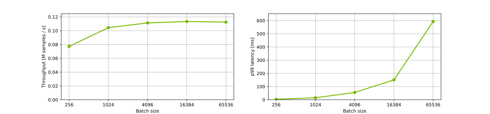
</details>


#### Offline: DCNv2 on NVIDIA T4, Merlin HPS + TensorRT with FP16
Our results were obtained using the following configuration:

| Parameter Name               | Parameter Value              |
|:-----------------------------|:-----------------------------|
| GPU                          |NVIDIA T4            |
| Model architecture | DCNv2 |
| Model size | 22B parameters |
| Backend                      |NVDIA Merlin HPS + NVIDIA TensorRT|
| Backend accelerator          |-|
| Precision                    |FP16      |
| Model format                 |NVIDIA Triton Ensemble (NVDIA Merlin HPS + NVIDIA TensorRT)|
| Max batch size               |65536|
| Number of model instances    |1|
| Export Format | TensorFlow SavedModel|
| NVIDIA TensorRT Capture CUDA Graph | Enabled|
| Device Kind | gpu|

<details><summary>Results Table</summary>

|    |   Batch |   Concurrency |   Inferences/Second |   Client Send |   Network+Server Send/Recv |   Server Queue |   Server Compute Input |   Server Compute Infer |   Server Compute Output |   Client Recv |   p50 latency |   p90 latency |   p95 latency |   p99 latency |   avg latency |
|---:|--------:|--------------:|--------------------:|--------------:|---------------------------:|---------------:|-----------------------:|-----------------------:|------------------------:|--------------:|--------------:|--------------:|--------------:|--------------:|--------------:|
|  0 |     256 |             1 |            1.42e+05 |            52 |                        362 |              0 |                     74 |                   1222 |                      73 |             0 |          1778 |          1915 |          1961 |          2032 |          1783 |
|  1 |    1024 |             1 |            3.27e+05 |            46 |                        558 |              0 |                    147 |                   2097 |                     264 |             0 |          3084 |          3241 |          3266 |          3584 |          3112 |
|  2 |    4096 |             1 |            4.09e+05 |            47 |                        728 |              0 |                    474 |                   8106 |                     638 |             0 |          9993 |         10239 |         10318 |         10551 |          9993 |
|  3 |   16384 |             1 |            4.30e+05 |            68 |                       1695 |              0 |                   1836 |                  32338 |                    1990 |             0 |         37402 |         39030 |         40043 |         50287 |         37927 |
|  4 |   65536 |             1 |            4.23e+05 |            54 |                       4446 |              0 |                   7287 |                 135833 |                    7202 |             0 |        154310 |        157113 |        157725 |        161462 |        154822 |

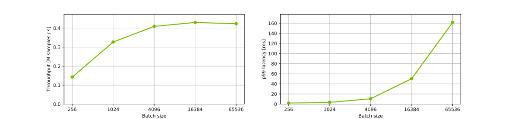
</details>

## Advanced
### Latency explanation
A typical Triton Inference Server pipeline can be broken down into the following steps:

1. The client serializes the inference request into a message and sends it to
the server (Client Send).
2. The message travels over the network from the client to the server (Network).
3. The message arrives at the server and is deserialized (Server Receive).
4. The request is placed on the queue (Server Queue).
5. The request is removed from the queue and computed (Server Compute).
6. The completed request is serialized in a message and sent back to
the client (Server Send).
7. The completed message then travels over the network from the server
to the client (Network).
8. The completed message is deserialized by the client and processed as
a completed inference request (Client Receive).

Generally, for local clients, steps 1-4 and 6-8 will only occupy
a small fraction of time compared to step 5. In distributed systems and online processing
where the client and server side are connected through a network, the send and receive steps might have an impact
on overall processing performance. In order to analyze the possible bottlenecks, detailed
charts are presented in online scenario cases.


## Release Notes
We’re constantly refining and improving our performance on AI
and HPC workloads, even on the same hardware, with frequent updates
to our software stack. For our latest performance data, refer
to these pages for
[AI](https://developer.nvidia.com/deep-learning-performance-training-inference)
and [HPC](https://developer.nvidia.com/hpc-application-performance) benchmarks.

### Changelog

April 2023
- Initial release

### Known issues

- There are no known issues with this model.
