# Deploying Large Recommender models with TensorFlow and Triton Inference Server

This file contains instructions to run inference
on Triton Inference Server as well as detailed performance analysis for DLRM and DCNv2
with TensorFlow and TensorRT. It is intended to provide the best possible performance for
models that fit into a single GPU or, for some reason,  cannot use Merlin HPS.

When the best possible performance is required for models larger than single GPU memory,
we recommend the solution described [here](merlin_hps_inference.md) instead

## Solution overview
### Introduction

The [NVIDIA Triton Inference Server](https://github.com/NVIDIA/triton-inference-server)
provides a data center and cloud inferencing solution optimized for NVIDIA GPUs.
The server provides an inference service via an HTTP or gRPC endpoint,
allowing remote clients to request inferencing for any number of GPU
or CPU models being managed by the server.

This README provides step-by-step deployment instructions for models generated
during training (as described in the [model README](../README.md)).
Additionally, this README provides the corresponding deployment scripts that
ensure optimal GPU utilization during inferencing on Triton Inference Server.

### Deployment using a TensorFlow SavedModel + TensorRT ensemble

Embedding tables used in recommender models can often get so large that serving them becomes challenging. In this example,
we show a way to serve a model that is larger than a GPU-memory device using CPU offloading. As opposed to the solution
shown in [the Merlin HPS inference guide](merlin_hps_inference.md), this guide does not use any custom Triton backends.

The solution below also efficiently handles models that are large but can still fit into GPU memory.

The first step is to sort the embedding tables by their size (from smallest to largest) and decide the amount of GPU memory to be spent
on storing the embeddings. First N smallest embedding tables that can be fit in this amount will be placed in GPU memory,
while the rest will be run on the CPU. This ensures that a large proportion of embedding lookups will be performed on the GPU.
This process is depicted in Figure 1. 
The resulting part of the model that contains the embedding with encoded device placement is then saved in the TensorFlow
SavedModel format. We will refer to it as the "sparse submodel." 


<p align="center">
  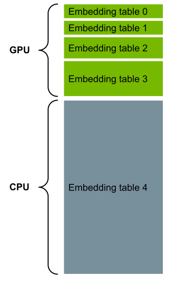
  <br>
Figure 1. Sorting the embedding tables by size as a way to serve very large recommender models.
</p>


The other part of the network that contains the interaction layer and the MLPs can benefit significantly from running it
with NVIDIA TensorRT. We, therefore, save it to a separate SavedModel file and then convert it first to the ONNX format
and then from the ONNX format to a TensorRT engine. We refer to this part as the "dense submodel."

The entire model is run as a Triton Ensemble of the sparse and dense submodel. The communication between
the two parts is managed efficiently with CUDA memcopies by Triton. The overall architecture of this solution
is depicted in Figure 2.

<p align="center">
  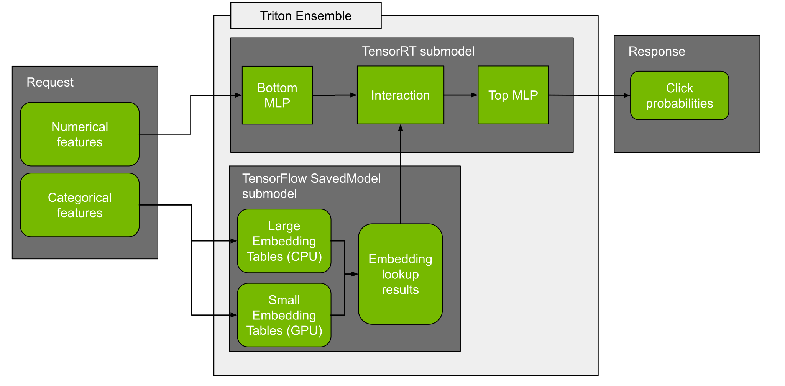
  <br>
Figure 2. Overall architecture of the TF SavedModel + TensorRT ensemble for running large recommender inference.
</p>


### Deployment process

The deployment process consists of two steps:

1. Conversion.

   The purpose of conversion is to transform the checkpoint saved during training into a ready-to-serve  model.
   
2. Configuration.

   Model configuration on Triton Inference Server, which generates
   necessary [configuration files](https://github.com/triton-inference-server/server/blob/master/docs/model_configuration.md).

After deployment, the Triton inference server is used for the evaluation of the converted model in two steps:

1. Correctness tests.

   Produce results that are tested against given correctness thresholds.

2. Performance tests.

   Produce latency and throughput results for offline (static batching)
   and online (dynamic batching) scenarios.


Refer to [Quick Start Guide](#quick-start-guide) for further instructions on performing these tests.

## Setup
Ensure you have the following components:
* [NVIDIA Docker](https://github.com/NVIDIA/nvidia-docker)
* [NVIDIA TensorFlow NGC container 22.02](https://catalog.ngc.nvidia.com/orgs/nvidia/containers/tensorflow)
* [NVIDIA Triton Inference Server NGC container 22.02](https://ngc.nvidia.com/catalog/containers/nvidia:tritonserver)
* [NVIDIA CUDA](https://docs.nvidia.com/cuda/archive//index.html)
* [NVIDIA Ampere](https://www.nvidia.com/en-us/data-center/nvidia-ampere-gpu-architecture/), [Volta](https://www.nvidia.com/en-us/data-center/volta-gpu-architecture/) or [Turing](https://www.nvidia.com/en-us/geforce/turing/) based GPU


## Quick Start Guide
The instructions below assume you have already cloned the repository,
built the training docker container, preprocessed the Criteo
1TB dataset, run the training and saved a model checkpoint.
If you haven't completed those steps, refer
to the [Quick Start Guide for DLRM](DLRM.md#quick-start-guide)
or the [Quick Start Guide to DCNv2](DCNv2.md#quick-start-guide),
depending on which model you'd like to deploy.


1. Run the training docker container built during the training stage:

```
# set input variables
checkpoint_path=<path_to_checkpoint_saved_during_training>
deploy_path=<destination_path_of_the_triton_model_repository>
dataset_path=<path_to_the_dataset>

mkdir -p $deploy_path
docker run -v $checkpoint_path:$checkpoint_path -v $deploy_path:$deploy_path -v $dataset_path:$dataset_path -it --rm --network=host --ipc=host \
    --shm-size=2g --ulimit memlock=-1 --ulimit stack=67108864 --gpus=all --cap-add SYS_NICE train_docker_image \
    bash
```

2. Convert the model checkpoint into a Triton model repository:

```
# set input variables inside the container
checkpoint_path=<path_to_checkpoint_saved_during_training>
deploy_path=<destination_path_of_the_triton_model_repository>
dataset_path=<path_to_the_dataset>

# run the deployment
horovodrun -np 1 --mpi-args=--oversubscribe numactl --interleave=all \
  python -m deployment.deploy --checkpoint-dir $checkpoint_path --model-repository-path $deploy_path \
  --num_gpus 1 --fused_embedding --model-name dlrm --model-precision fp16 --dense-format trt \
  --sparse-format tf-savedmodel --memory-threshold-gb 60
```

3. In a separate terminal, start the Triton Inference Server:

```
deploy_path=<destination_path_of_the_triton_model_repository>

docker run -v $deploy_path:$deploy_path -it --rm --network=host --detach --ipc=host \
  --shm-size=2g --ulimit memlock=-1 --ulimit stack=67108864 --gpus=all nvcr.io/nvidia/tritonserver:23.02-py3 \
  bash -c "tritonserver --model-repository=${deploy_path} \
  --pinned-memory-pool-byte-size=4000000000 --cuda-memory-pool-byte-size=0:2000000000 2>&1"
```

4. Measure inference execution speed

```
python -u -m deployment.evaluate_latency --sparse-format tf-savedmodel --model-name dlrm --dataset_path $dataset_path \
    --fused-embedding --measurement-request-count 50 --measurement-interval 5000 \
    --num-benchmark-samples 262144
```

5. Measure the prediction quality of the deployed model

```
python -u -m deployment.evaluate_accuracy --dataset_path $dataset_path --fused_embedding \
    --model_name dlrm --batch_size 16384 --sparse_input_format tf-savedmodel"
```


## Performance
The performance measurements in this document were conducted at the time of publication and may not reflect
the performance achieved from NVIDIA’s latest software release. For the most up-to-date performance measurements, go to
[NVIDIA Data Center Deep Learning Product Performance](https://developer.nvidia.com/deep-learning-performance-training-inference).


### Offline scenario

#### Offline: DLRM on NVIDIA DGX A100 (1x A100 80GB), TensorFlow + TensorRT with FP32, 4B parameters
Our results were obtained using the following configuration:

| Parameter Name               | Parameter Value              |
|:-----------------------------|:-----------------------------|
| GPU                          |NVIDIA DGX A100 (1x A100 80GB)            |
| Model architecture | DLRM |
| Model size | 4B parameters |
| Backend                      |TensorFlow + NVIDIA TensorRT|
| Backend accelerator          |-|
| Precision                    |FP32      |
| Model format                 |NVIDIA Triton Ensemble (TensorFlow SavedModel + NVIDIA TensorRT)|
| Max batch size               |32768|
| Number of model instances    |1|
| Export Format | TensorFlow SavedModel|
| NVIDIA TensorRT Capture CUDA Graph | Enabled|
| Device Kind | gpu|

<details><summary>Results Table</summary>

|    |   Batch |   Concurrency |   Inferences/Second |   Client Send |   Network+Server Send/Recv |   Server Queue |   Server Compute Input |   Server Compute Infer |   Server Compute Output |   Client Recv |   p50 latency |   p90 latency |   p95 latency |   p99 latency |   avg latency |
|---:|--------:|--------------:|--------------------:|--------------:|---------------------------:|---------------:|-----------------------:|-----------------------:|------------------------:|--------------:|--------------:|--------------:|--------------:|--------------:|--------------:|
|  0 |     256 |             1 |            3.99e+05 |            24 |                        143 |              0 |                     44 |                    336 |                      88 |             0 |           626 |           672 |           688 |           729 |           635 |
|  1 |     512 |             1 |            6.90e+05 |            31 |                        152 |              0 |                     55 |                    406 |                      91 |             0 |           738 |           770 |           789 |           814 |           735 |
|  2 |    1024 |             1 |            1.22e+06 |            34 |                        162 |              0 |                     72 |                    472 |                      94 |             0 |           830 |           863 |           884 |           906 |           834 |
|  3 |    2048 |             1 |            1.68e+06 |            26 |                        164 |              0 |                    127 |                    772 |                     124 |             0 |          1199 |          1274 |          1317 |          1341 |          1213 |
|  4 |    4096 |             1 |            2.46e+06 |            36 |                        176 |              0 |                    160 |                   1128 |                     157 |             0 |          1653 |          1669 |          1675 |          1716 |          1657 |
|  5 |    8192 |             1 |            3.08e+06 |            37 |                        182 |              0 |                    327 |                   1879 |                     222 |             0 |          2612 |          2721 |          2915 |          3135 |          2647 |
|  6 |   16384 |             1 |            3.36e+06 |            39 |                        193 |              0 |                    668 |                   3623 |                     349 |             0 |          4822 |          4979 |          5357 |          5505 |          4872 |
|  7 |   32768 |             1 |            3.85e+06 |            42 |                        204 |              0 |                    991 |                   6623 |                     627 |             0 |          8439 |          8584 |          8613 |          8768 |          8487 |

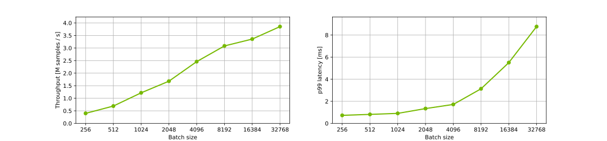
</details>


#### Offline: DLRM on NVIDIA DGX A100 (1x A100 80GB), TensorFlow + TensorRT with FP16, 4B parameters
Our results were obtained using the following configuration:

| Parameter Name               | Parameter Value              |
|:-----------------------------|:-----------------------------|
| GPU                          |NVIDIA DGX A100 (1x A100 80GB)            |
| Model architecture | DLRM |
| Model size | 4B parameters |
| Backend                      |TensorFlow + NVIDIA TensorRT|
| Backend accelerator          |-|
| Precision                    |FP16      |
| Model format                 |NVIDIA Triton Ensemble (TensorFlow SavedModel + NVIDIA TensorRT)|
| Max batch size               |32768|
| Number of model instances    |1|
| Export Format | TensorFlow SavedModel|
| NVIDIA TensorRT Capture CUDA Graph | Enabled|
| Device Kind | gpu|

<details><summary>Results Table</summary>

|    |   Batch |   Concurrency |   Inferences/Second |   Client Send |   Network+Server Send/Recv |   Server Queue |   Server Compute Input |   Server Compute Infer |   Server Compute Output |   Client Recv |   p50 latency |   p90 latency |   p95 latency |   p99 latency |   avg latency |
|---:|--------:|--------------:|--------------------:|--------------:|---------------------------:|---------------:|-----------------------:|-----------------------:|------------------------:|--------------:|--------------:|--------------:|--------------:|--------------:|--------------:|
|  0 |     256 |             1 |            4.00e+05 |            26 |                        144 |              0 |                     48 |                    326 |                      90 |             0 |           631 |           645 |           651 |           679 |           634 |
|  1 |     512 |             1 |            6.65e+05 |            23 |                        161 |              0 |                     62 |                    417 |                      99 |             0 |           762 |           779 |           786 |           803 |           762 |
|  2 |    1024 |             1 |            1.23e+06 |            23 |                        160 |              0 |                     80 |                    457 |                     106 |             0 |           821 |           837 |           843 |           865 |           826 |
|  3 |    2048 |             1 |            1.95e+06 |            25 |                        158 |              0 |                    125 |                    615 |                     123 |             0 |          1030 |          1102 |          1123 |          1157 |          1046 |
|  4 |    4096 |             1 |            2.89e+06 |            26 |                        160 |              0 |                    204 |                    866 |                     154 |             0 |          1393 |          1444 |          1515 |          1641 |          1410 |
|  5 |    8192 |             1 |            3.80e+06 |            35 |                        173 |              0 |                    364 |                   1360 |                     215 |             0 |          2115 |          2270 |          2377 |          2484 |          2147 |
|  6 |   16384 |             1 |            4.32e+06 |            38 |                        209 |              0 |                    751 |                   2440 |                     347 |             0 |          3741 |          3914 |          4060 |          4352 |          3785 |
|  7 |   32768 |             1 |            4.95e+06 |            44 |                        223 |              0 |                   1294 |                   4449 |                     614 |             0 |          6604 |          6758 |          6820 |          7107 |          6624 |


</details>


#### Offline: DLRM on NVIDIA DGX A100 (1x A100 80GB), TensorFlow + TensorRT with FP32, 22B parameters
Our results were obtained using the following configuration:

| Parameter Name               | Parameter Value              |
|:-----------------------------|:-----------------------------|
| GPU                          |NVIDIA DGX A100 (1x A100 80GB)            |
| Model architecture | DLRM |
| Model size | 22B parameters |
| Backend                      |TensorFlow + NVIDIA TensorRT|
| Backend accelerator          |-|
| Precision                    |FP32      |
| Model format                 |NVIDIA Triton Ensemble (TensorFlow SavedModel + NVIDIA TensorRT)|
| Max batch size               |32768|
| Number of model instances    |1|
| Export Format | TensorFlow SavedModel|
| NVIDIA TensorRT Capture CUDA Graph | Enabled|
| Device Kind | gpu|

<details><summary>Results Table</summary>

|    |   Batch |   Concurrency |   Inferences/Second |   Client Send |   Network+Server Send/Recv |   Server Queue |   Server Compute Input |   Server Compute Infer |   Server Compute Output |   Client Recv |   p50 latency |   p90 latency |   p95 latency |   p99 latency |   avg latency |
|---:|--------:|--------------:|--------------------:|--------------:|---------------------------:|---------------:|-----------------------:|-----------------------:|------------------------:|--------------:|--------------:|--------------:|--------------:|--------------:|--------------:|
|  0 |     256 |             1 |            2.44e+05 |            24 |                        153 |              0 |                     51 |                    715 |                     100 |             0 |          1029 |          1077 |          1103 |          1468 |          1043 |
|  1 |     512 |             1 |            4.10e+05 |            30 |                        160 |              0 |                     63 |                    891 |                      98 |             0 |          1241 |          1277 |          1289 |          1448 |          1242 |
|  2 |    1024 |             1 |            6.45e+05 |            24 |                        157 |              0 |                     88 |                   1204 |                     109 |             0 |          1559 |          1665 |          1705 |          2289 |          1582 |
|  3 |    2048 |             1 |            8.00e+05 |            23 |                        160 |              0 |                    179 |                   2051 |                     139 |             0 |          2478 |          2761 |          2880 |          3978 |          2552 |
|  4 |    4096 |             1 |            1.07e+06 |            34 |                        190 |              0 |                    305 |                   3104 |                     179 |             0 |          3514 |          4683 |          5312 |          7935 |          3812 |
|  5 |    8192 |             1 |            1.52e+06 |            39 |                        201 |              0 |                    425 |                   4484 |                     218 |             0 |          5213 |          5486 |          5567 |          7479 |          5367 |
|  6 |   16384 |             1 |            1.69e+06 |            43 |                        221 |              0 |                    853 |                   8189 |                     354 |             0 |          9473 |         10195 |         10620 |         12676 |          9660 |
|  7 |   32768 |             1 |            1.88e+06 |            53 |                        267 |              0 |                   1199 |                  15221 |                     631 |             0 |         16969 |         18753 |         20200 |         22143 |         17371 |


</details>


#### Offline: DLRM on NVIDIA DGX A100 (1x A100 80GB), TensorFlow + TensorRT with FP16, 22B parameters
Our results were obtained using the following configuration:

| Parameter Name               | Parameter Value              |
|:-----------------------------|:-----------------------------|
| GPU                          |NVIDIA DGX A100 (1x A100 80GB)            |
| Model architecture | DLRM |
| Model size | 22B parameters |
| Backend                      |TensorFlow + NVIDIA TensorRT|
| Backend accelerator          |-|
| Precision                    |FP16      |
| Model format                 |NVIDIA Triton Ensemble (TensorFlow SavedModel + NVIDIA TensorRT)|
| Max batch size               |32768|
| Number of model instances    |1|
| Export Format | TensorFlow SavedModel|
| NVIDIA TensorRT Capture CUDA Graph | Enabled|
| Device Kind | gpu|

<details><summary>Results Table</summary>

|    |   Batch |   Concurrency |   Inferences/Second |   Client Send |   Network+Server Send/Recv |   Server Queue |   Server Compute Input |   Server Compute Infer |   Server Compute Output |   Client Recv |   p50 latency |   p90 latency |   p95 latency |   p99 latency |   avg latency |
|---:|--------:|--------------:|--------------------:|--------------:|---------------------------:|---------------:|-----------------------:|-----------------------:|------------------------:|--------------:|--------------:|--------------:|--------------:|--------------:|--------------:|
|  0 |     256 |             1 |            2.58e+05 |            23 |                        159 |              0 |                     47 |                    661 |                      96 |             0 |           981 |          1000 |          1010 |          1103 |           986 |
|  1 |     512 |             1 |            4.33e+05 |            26 |                        152 |              0 |                     60 |                    841 |                      95 |             0 |          1182 |          1211 |          1220 |          1264 |          1174 |
|  2 |    1024 |             1 |            7.24e+05 |            23 |                        130 |              0 |                     76 |                   1076 |                     103 |             0 |          1402 |          1426 |          1435 |          1609 |          1408 |
|  3 |    2048 |             1 |            9.36e+05 |            24 |                        134 |              0 |                    124 |                   1776 |                     125 |             0 |          2131 |          2422 |          2486 |          2556 |          2183 |
|  4 |    4096 |             1 |            1.20e+06 |            27 |                        141 |              0 |                    215 |                   2853 |                     161 |             0 |          3236 |          4163 |          4436 |          4952 |          3397 |
|  5 |    8192 |             1 |            1.38e+06 |            38 |                        196 |              0 |                    398 |                   5079 |                     224 |             0 |          5625 |          7542 |          8188 |         10051 |          5935 |
|  6 |   16384 |             1 |            1.89e+06 |            45 |                        225 |              0 |                    797 |                   7226 |                     347 |             0 |          8472 |          9362 |         10036 |         11189 |          8640 |
|  7 |   32768 |             1 |            2.16e+06 |            43 |                        246 |              0 |                   1049 |                  13171 |                     620 |             0 |         14827 |         16124 |         16971 |         18651 |         15129 |

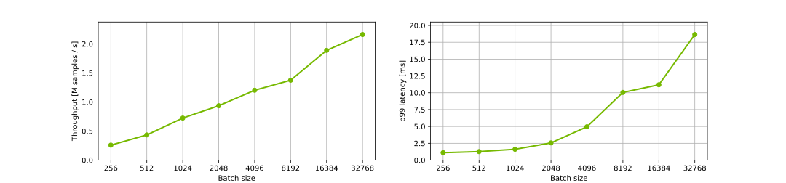
</details>


#### Offline: DLRM on NVIDIA A30, TensorFlow + TensorRT with FP32, 4B parameters
Our results were obtained using the following configuration:

| Parameter Name               | Parameter Value              |
|:-----------------------------|:-----------------------------|
| GPU                          |NVIDIA A30            |
| Model architecture | DLRM |
| Model size | 4B parameters |
| Backend                      |TensorFlow + NVIDIA TensorRT|
| Backend accelerator          |-|
| Precision                    |FP32      |
| Model format                 |NVIDIA Triton Ensemble (TensorFlow SavedModel + NVIDIA TensorRT)|
| Max batch size               |32768|
| Number of model instances    |1|
| Export Format | TensorFlow SavedModel|
| NVIDIA TensorRT Capture CUDA Graph | Enabled|
| Device Kind | gpu|

<details><summary>Results Table</summary>

|    |   Batch |   Concurrency |   Inferences/Second |   Client Send |   Network+Server Send/Recv |   Server Queue |   Server Compute Input |   Server Compute Infer |   Server Compute Output |   Client Recv |   p50 latency |   p90 latency |   p95 latency |   p99 latency |   avg latency |
|---:|--------:|--------------:|--------------------:|--------------:|---------------------------:|---------------:|-----------------------:|-----------------------:|------------------------:|--------------:|--------------:|--------------:|--------------:|--------------:|--------------:|
|  0 |     256 |             1 |            2.31e+05 |            24 |                        147 |              0 |                     47 |                    804 |                      77 |             0 |          1086 |          1148 |          1224 |          1266 |          1099 |
|  1 |     512 |             1 |            3.67e+05 |            26 |                        145 |              0 |                     63 |                   1070 |                      82 |             0 |          1353 |          1552 |          1586 |          1740 |          1386 |
|  2 |    1024 |             1 |            5.36e+05 |            27 |                        152 |              0 |                    107 |                   1517 |                     101 |             0 |          1897 |          1977 |          1993 |          2068 |          1904 |
|  3 |    2048 |             1 |            5.53e+05 |            68 |                        248 |              0 |                    236 |                   2997 |                     142 |             0 |          3661 |          3928 |          4044 |          4351 |          3691 |
|  4 |    4096 |             1 |            6.18e+05 |            51 |                        275 |              0 |                    686 |                   5374 |                     220 |             0 |          6407 |          7397 |          8148 |         10301 |          6606 |
|  5 |    8192 |             1 |            7.94e+05 |            57 |                        379 |              0 |                    625 |                   8812 |                     410 |             0 |          9833 |         13872 |         15165 |         15940 |         10283 |
|  6 |   16384 |             1 |            9.77e+05 |            61 |                        459 |              1 |                   1251 |                  14220 |                     690 |             0 |         15220 |         20960 |         23930 |         27304 |         16682 |
|  7 |   32768 |             1 |            1.02e+06 |           101 |                        577 |              2 |                   2188 |                  28085 |                    1294 |             2 |         30168 |         43267 |         48349 |         54028 |         32249 |

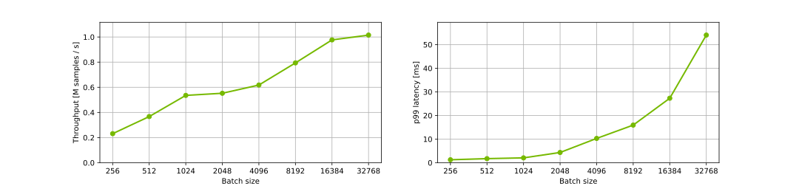
</details>


#### Offline: DLRM on NVIDIA A30, TensorFlow + TensorRT with FP16, 4B parameters
Our results were obtained using the following configuration:

| Parameter Name               | Parameter Value              |
|:-----------------------------|:-----------------------------|
| GPU                          |NVIDIA A30            |
| Model architecture | DLRM |
| Model size | 4B parameters |
| Backend                      |TensorFlow + NVIDIA TensorRT|
| Backend accelerator          |-|
| Precision                    |FP16      |
| Model format                 |NVIDIA Triton Ensemble (TensorFlow SavedModel + NVIDIA TensorRT)|
| Max batch size               |32768|
| Number of model instances    |1|
| Export Format | TensorFlow SavedModel|
| NVIDIA TensorRT Capture CUDA Graph | Enabled|
| Device Kind | gpu|

<details><summary>Results Table</summary>

|    |   Batch |   Concurrency |   Inferences/Second |   Client Send |   Network+Server Send/Recv |   Server Queue |   Server Compute Input |   Server Compute Infer |   Server Compute Output |   Client Recv |   p50 latency |   p90 latency |   p95 latency |   p99 latency |   avg latency |
|---:|--------:|--------------:|--------------------:|--------------:|---------------------------:|---------------:|-----------------------:|-----------------------:|------------------------:|--------------:|--------------:|--------------:|--------------:|--------------:|--------------:|
|  0 |     256 |             1 |            1.93e+05 |            59 |                        237 |              1 |                     65 |                    852 |                     100 |             1 |          1308 |          1346 |          1360 |          1428 |          1315 |
|  1 |     512 |             1 |            3.16e+05 |            60 |                        244 |              1 |                     91 |                   1110 |                     105 |             1 |          1606 |          1675 |          1699 |          1750 |          1612 |
|  2 |    1024 |             1 |            4.98e+05 |            64 |                        253 |              1 |                    147 |                   1458 |                     125 |             1 |          2013 |          2191 |          2275 |          2472 |          2049 |
|  3 |    2048 |             1 |            5.87e+05 |           105 |                        323 |              1 |                    258 |                   2621 |                     160 |             1 |          3436 |          3631 |          3813 |          4128 |          3469 |
|  4 |    4096 |             1 |            5.43e+05 |           108 |                        423 |              2 |                   1041 |                   5735 |                     237 |             1 |          7142 |          9926 |         10563 |         11887 |          7547 |
|  5 |    8192 |             1 |            7.86e+05 |            96 |                        439 |              2 |                   1155 |                   8309 |                     380 |             1 |         10056 |         14265 |         15897 |         18104 |         10382 |
|  6 |   16384 |             1 |            1.13e+06 |            96 |                        471 |              2 |                   1321 |                  11777 |                     729 |             1 |         13512 |         18506 |         19884 |         23454 |         14397 |
|  7 |   32768 |             1 |            1.27e+06 |            96 |                        491 |              2 |                   2062 |                  22107 |                    1272 |             1 |         23498 |         33255 |         38954 |         65158 |         26031 |

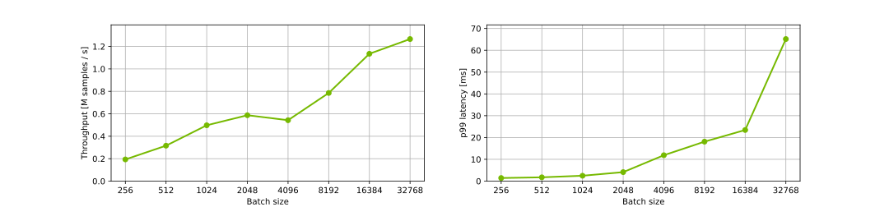
</details>


#### Offline: DLRM on NVIDIA A30, TensorFlow + TensorRT with FP32, 22B parameters
Our results were obtained using the following configuration:

| Parameter Name               | Parameter Value              |
|:-----------------------------|:-----------------------------|
| GPU                          |NVIDIA A30            |
| Model architecture | DLRM |
| Model size | 22B parameters |
| Backend                      |TensorFlow + NVIDIA TensorRT|
| Backend accelerator          |-|
| Precision                    |FP32      |
| Model format                 |NVIDIA Triton Ensemble (TensorFlow SavedModel + NVIDIA TensorRT)|
| Max batch size               |32768|
| Number of model instances    |1|
| Export Format | TensorFlow SavedModel|
| NVIDIA TensorRT Capture CUDA Graph | Enabled|
| Device Kind | gpu|

<details><summary>Results Table</summary>

|    |   Batch |   Concurrency |   Inferences/Second |   Client Send |   Network+Server Send/Recv |   Server Queue |   Server Compute Input |   Server Compute Infer |   Server Compute Output |   Client Recv |   p50 latency |   p90 latency |   p95 latency |   p99 latency |   avg latency |
|---:|--------:|--------------:|--------------------:|--------------:|---------------------------:|---------------:|-----------------------:|-----------------------:|------------------------:|--------------:|--------------:|--------------:|--------------:|--------------:|--------------:|
|  0 |     256 |             1 |            1.93e+05 |            23 |                        186 |              0 |                     56 |                    986 |                      71 |             0 |          1307 |          1435 |          1481 |          1545 |          1322 |
|  1 |     512 |             1 |            2.80e+05 |            26 |                        206 |              0 |                     86 |                   1423 |                      79 |             0 |          1814 |          1884 |          1914 |          1973 |          1820 |
|  2 |    1024 |             1 |            1.99e+05 |            62 |                        339 |              2 |                    165 |                   4453 |                     119 |             0 |          5200 |          6259 |          6428 |          6966 |          5140 |
|  3 |    2048 |             1 |            3.00e+05 |            50 |                        301 |              1 |                    721 |                   5571 |                     167 |             0 |          6006 |          9340 |         10103 |         11385 |          6811 |
|  4 |    4096 |             1 |            3.49e+05 |            61 |                        408 |              1 |                   1782 |                   9183 |                     299 |             0 |         11165 |         15907 |         17936 |         23733 |         11734 |
|  5 |    8192 |             1 |            5.87e+05 |            65 |                        380 |              1 |                   1106 |                  12027 |                     360 |             0 |         13332 |         18063 |         21316 |         24739 |         13939 |
|  6 |   16384 |             1 |            6.85e+05 |            56 |                        398 |              1 |                   3061 |                  19763 |                     674 |             0 |         23218 |         31017 |         34275 |         38914 |         23953 |
|  7 |   32768 |             1 |            7.61e+05 |            69 |                        496 |              1 |                   9223 |                  31973 |                    1266 |             0 |         41964 |         55256 |         59519 |         65834 |         43028 |

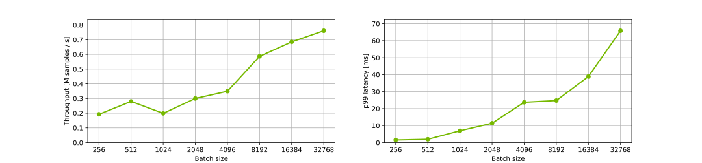
</details>


#### Offline: DLRM on NVIDIA A30, TensorFlow + TensorRT with FP16, 22B parameters
Our results were obtained using the following configuration:

| Parameter Name               | Parameter Value              |
|:-----------------------------|:-----------------------------|
| GPU                          |NVIDIA A30            |
| Model architecture | DLRM |
| Model size | 22B parameters |
| Backend                      |TensorFlow + NVIDIA TensorRT|
| Backend accelerator          |-|
| Precision                    |FP16      |
| Model format                 |NVIDIA Triton Ensemble (TensorFlow SavedModel + NVIDIA TensorRT)|
| Max batch size               |32768|
| Number of model instances    |1|
| Export Format | TensorFlow SavedModel|
| NVIDIA TensorRT Capture CUDA Graph | Enabled|
| Device Kind | gpu|

<details><summary>Results Table</summary>

|    |   Batch |   Concurrency |   Inferences/Second |   Client Send |   Network+Server Send/Recv |   Server Queue |   Server Compute Input |   Server Compute Infer |   Server Compute Output |   Client Recv |   p50 latency |   p90 latency |   p95 latency |   p99 latency |   avg latency |
|---:|--------:|--------------:|--------------------:|--------------:|---------------------------:|---------------:|-----------------------:|-----------------------:|------------------------:|--------------:|--------------:|--------------:|--------------:|--------------:|--------------:|
|  0 |     256 |             1 |            1.79e+05 |            57 |                        244 |              1 |                     60 |                    969 |                      93 |             1 |          1416 |          1497 |          1527 |          1637 |          1425 |
|  1 |     512 |             1 |            2.69e+05 |            63 |                        264 |              1 |                     88 |                   1373 |                     104 |             1 |          1865 |          1999 |          2050 |          2375 |          1894 |
|  2 |    1024 |             1 |            3.63e+05 |            67 |                        253 |              1 |                    133 |                   2228 |                     129 |             1 |          2806 |          2909 |          2933 |          3047 |          2812 |
|  3 |    2048 |             1 |            4.04e+05 |           113 |                        344 |              1 |                    262 |                   4155 |                     170 |             1 |          4996 |          5287 |          5401 |          5799 |          5046 |
|  4 |    4096 |             1 |            5.54e+05 |            72 |                        277 |              1 |                    643 |                   6119 |                     248 |             1 |          7329 |          9277 |         10541 |         12213 |          7361 |
|  5 |    8192 |             1 |            7.18e+05 |            74 |                        313 |              2 |                   1193 |                   9424 |                     382 |             1 |         10820 |         14038 |         15253 |         19589 |         11389 |
|  6 |   16384 |             1 |            8.89e+05 |            82 |                        329 |              2 |                   1646 |                  15666 |                     685 |             1 |         17436 |         23288 |         24813 |         27289 |         18411 |
|  7 |   32768 |             1 |            9.44e+05 |            87 |                        420 |              2 |                   4725 |                  28180 |                    1277 |             1 |         32825 |         44277 |         49607 |         56222 |         34692 |

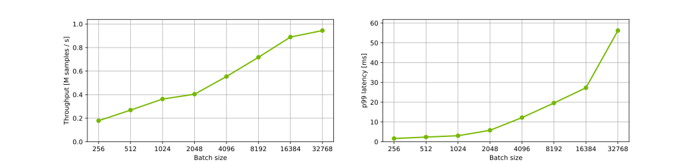
</details>


#### Offline: DLRM on NVIDIA T4, TensorFlow + TensorRT with FP32, 4B parameters
Our results were obtained using the following configuration:

| Parameter Name               | Parameter Value              |
|:-----------------------------|:-----------------------------|
| GPU                          |NVIDIA T4            |
| Model architecture | DLRM |
| Model size | 4B parameters |
| Backend                      |TensorFlow + NVIDIA TensorRT|
| Backend accelerator          |-|
| Precision                    |FP32      |
| Model format                 |NVIDIA Triton Ensemble (TensorFlow SavedModel + NVIDIA TensorRT)|
| Max batch size               |32768|
| Number of model instances    |1|
| Export Format | TensorFlow SavedModel|
| NVIDIA TensorRT Capture CUDA Graph | Enabled|
| Device Kind | gpu|

<details><summary>Results Table</summary>

|    |   Batch |   Concurrency |   Inferences/Second |   Client Send |   Network+Server Send/Recv |   Server Queue |   Server Compute Input |   Server Compute Infer |   Server Compute Output |   Client Recv |   p50 latency |   p90 latency |   p95 latency |   p99 latency |   avg latency |
|---:|--------:|--------------:|--------------------:|--------------:|---------------------------:|---------------:|-----------------------:|-----------------------:|------------------------:|--------------:|--------------:|--------------:|--------------:|--------------:|--------------:|
|  0 |     256 |             1 |            1.38e+05 |            47 |                        282 |              0 |                     75 |                   1341 |                      95 |             0 |          1788 |          2072 |          2144 |          2319 |          1840 |
|  1 |     512 |             1 |            1.87e+05 |            52 |                        356 |              0 |                    109 |                   2078 |                     131 |             0 |          2708 |          2936 |          3023 |          3190 |          2726 |
|  2 |    1024 |             1 |            2.34e+05 |            44 |                        455 |              0 |                    240 |                   3395 |                     227 |             0 |          4323 |          4653 |          4805 |          5763 |          4361 |
|  3 |    2048 |             1 |            2.59e+05 |            45 |                        553 |              0 |                    418 |                   6382 |                     498 |             0 |          7879 |          8220 |          8424 |          9091 |          7896 |
|  4 |    4096 |             1 |            3.15e+05 |            45 |                        535 |              0 |                    718 |                  10922 |                     744 |             0 |         12784 |         13496 |         13736 |         17274 |         12964 |
|  5 |    8192 |             1 |            3.47e+05 |            49 |                        600 |              0 |                   1293 |                  20431 |                    1183 |             0 |         23484 |         24332 |         24569 |         25045 |         23556 |
|  6 |   16384 |             1 |            3.57e+05 |            58 |                        670 |              0 |                   2448 |                  40605 |                    2077 |             0 |         45913 |         47110 |         47411 |         47908 |         45858 |
|  7 |   32768 |             1 |            3.63e+05 |            72 |                        769 |              1 |                   4837 |                  80249 |                    3924 |             0 |         89881 |         91684 |         92614 |         94206 |         89852 |

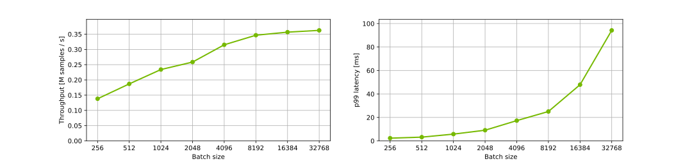
</details>


#### Offline: DLRM on NVIDIA T4, TensorFlow + TensorRT with FP16, 4B parameters
Our results were obtained using the following configuration:

| Parameter Name               | Parameter Value              |
|:-----------------------------|:-----------------------------|
| GPU                          |NVIDIA T4            |
| Model architecture | DLRM |
| Model size | 4B parameters |
| Backend                      |TensorFlow + NVIDIA TensorRT|
| Backend accelerator          |-|
| Precision                    |FP16      |
| Model format                 |NVIDIA Triton Ensemble (TensorFlow SavedModel + NVIDIA TensorRT)|
| Max batch size               |32768|
| Number of model instances    |1|
| Export Format | TensorFlow SavedModel|
| NVIDIA TensorRT Capture CUDA Graph | Enabled|
| Device Kind | gpu|

<details><summary>Results Table</summary>

|    |   Batch |   Concurrency |   Inferences/Second |   Client Send |   Network+Server Send/Recv |   Server Queue |   Server Compute Input |   Server Compute Infer |   Server Compute Output |   Client Recv |   p50 latency |   p90 latency |   p95 latency |   p99 latency |   avg latency |
|---:|--------:|--------------:|--------------------:|--------------:|---------------------------:|---------------:|-----------------------:|-----------------------:|------------------------:|--------------:|--------------:|--------------:|--------------:|--------------:|--------------:|
|  0 |     256 |             1 |            1.86e+05 |            35 |                        191 |              0 |                     75 |                    965 |                     103 |             0 |          1356 |          1456 |          1501 |          1606 |          1369 |
|  1 |     512 |             1 |            2.48e+05 |            43 |                        221 |              0 |                    110 |                   1513 |                     172 |             0 |          2017 |          2263 |          2353 |          2565 |          2059 |
|  2 |    1024 |             1 |            2.81e+05 |            53 |                        470 |              0 |                    205 |                   2676 |                     224 |             0 |          3576 |          3950 |          4047 |          4400 |          3628 |
|  3 |    2048 |             1 |            3.38e+05 |            51 |                        524 |              0 |                    341 |                   4735 |                     380 |             0 |          5833 |          6743 |          7420 |          8829 |          6031 |
|  4 |    4096 |             1 |            4.29e+05 |            47 |                        548 |              0 |                    621 |                   7603 |                     720 |             0 |          9480 |          9910 |         10013 |         12769 |          9539 |
|  5 |    8192 |             1 |            4.75e+05 |            49 |                        585 |              0 |                   1202 |                  14118 |                    1191 |             0 |         16936 |         17653 |         18283 |         20753 |         17145 |
|  6 |   16384 |             1 |            5.08e+05 |            55 |                        667 |              0 |                   2371 |                  26920 |                    2094 |             0 |         32044 |         33005 |         33383 |         35777 |         32107 |
|  7 |   32768 |             1 |            5.27e+05 |            63 |                        747 |              1 |                   4668 |                  52568 |                    3899 |             0 |         62101 |         63747 |         64063 |         66173 |         61946 |

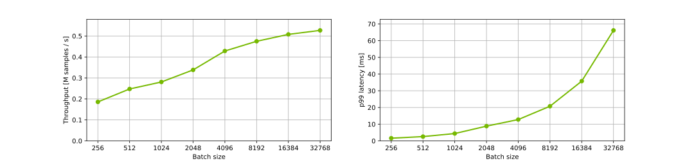
</details>


#### Offline: DLRM on NVIDIA T4, TensorFlow + TensorRT with FP32, 22B parameters
Our results were obtained using the following configuration:

| Parameter Name               | Parameter Value              |
|:-----------------------------|:-----------------------------|
| GPU                          |NVIDIA T4            |
| Model architecture | DLRM |
| Model size | 22B parameters |
| Backend                      |TensorFlow + NVIDIA TensorRT|
| Backend accelerator          |-|
| Precision                    |FP32      |
| Model format                 |NVIDIA Triton Ensemble (TensorFlow SavedModel + NVIDIA TensorRT)|
| Max batch size               |32768|
| Number of model instances    |1|
| Export Format | TensorFlow SavedModel|
| NVIDIA TensorRT Capture CUDA Graph | Enabled|
| Device Kind | gpu|

<details><summary>Results Table</summary>

|    |   Batch |   Concurrency |   Inferences/Second |   Client Send |   Network+Server Send/Recv |   Server Queue |   Server Compute Input |   Server Compute Infer |   Server Compute Output |   Client Recv |   p50 latency |   p90 latency |   p95 latency |   p99 latency |   avg latency |
|---:|--------:|--------------:|--------------------:|--------------:|---------------------------:|---------------:|-----------------------:|-----------------------:|------------------------:|--------------:|--------------:|--------------:|--------------:|--------------:|--------------:|
|  0 |     256 |             1 |            1.47e+05 |            35 |                        177 |              0 |                     80 |                   1357 |                      91 |             0 |          1697 |          1948 |          2039 |          2342 |          1740 |
|  1 |     512 |             1 |            1.81e+05 |            57 |                        238 |              0 |                    123 |                   2257 |                     135 |             0 |          2801 |          3042 |          3118 |          3281 |          2810 |
|  2 |    1024 |             1 |            2.28e+05 |            48 |                        490 |              0 |                    236 |                   3478 |                     224 |             0 |          4448 |          4776 |          4885 |          5811 |          4476 |
|  3 |    2048 |             1 |            2.57e+05 |            44 |                        530 |              0 |                    364 |                   6548 |                     490 |             0 |          7966 |          8273 |          8391 |          9240 |          7976 |
|  4 |    4096 |             1 |            3.06e+05 |            45 |                        518 |              0 |                    648 |                  11450 |                     729 |             0 |         13389 |         13797 |         14082 |         14728 |         13390 |
|  5 |    8192 |             1 |            3.25e+05 |            49 |                        570 |              0 |                   1253 |                  22088 |                    1181 |             0 |         24847 |         25946 |         26689 |         36261 |         25141 |
|  6 |   16384 |             1 |            3.37e+05 |            67 |                        654 |              1 |                   2507 |                  43155 |                    2069 |             0 |         48132 |         49830 |         50316 |         54283 |         48453 |
|  7 |   32768 |             1 |            3.47e+05 |            77 |                        763 |              1 |                   4675 |                  84544 |                    3899 |             0 |         93086 |         96342 |         97109 |        101241 |         93959 |

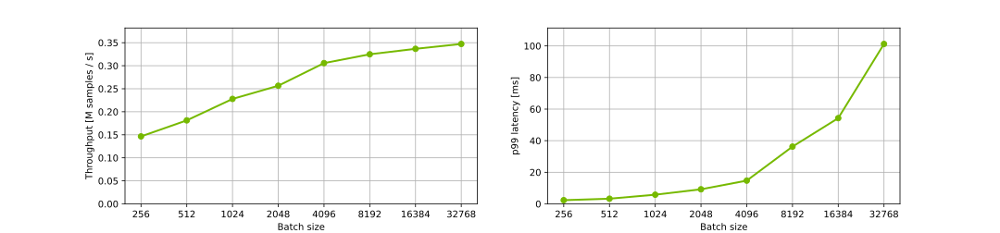
</details>


#### Offline: DLRM on NVIDIA T4, TensorFlow + TensorRT with FP16, 22B parameters
Our results were obtained using the following configuration:

| Parameter Name               | Parameter Value              |
|:-----------------------------|:-----------------------------|
| GPU                          |NVIDIA T4            |
| Model architecture | DLRM |
| Model size | 22B parameters |
| Backend                      |TensorFlow + NVIDIA TensorRT|
| Backend accelerator          |-|
| Precision                    |FP16      |
| Model format                 |NVIDIA Triton Ensemble (TensorFlow SavedModel + NVIDIA TensorRT)|
| Max batch size               |32768|
| Number of model instances    |1|
| Export Format | TensorFlow SavedModel|
| NVIDIA TensorRT Capture CUDA Graph | Enabled|
| Device Kind | gpu|

<details><summary>Results Table</summary>

|    |   Batch |   Concurrency |   Inferences/Second |   Client Send |   Network+Server Send/Recv |   Server Queue |   Server Compute Input |   Server Compute Infer |   Server Compute Output |   Client Recv |   p50 latency |   p90 latency |   p95 latency |   p99 latency |   avg latency |
|---:|--------:|--------------:|--------------------:|--------------:|---------------------------:|---------------:|-----------------------:|-----------------------:|------------------------:|--------------:|--------------:|--------------:|--------------:|--------------:|--------------:|
|  0 |     256 |             1 |            1.72e+05 |            44 |                        249 |              0 |                     75 |                   1006 |                     106 |             0 |          1472 |          1623 |          1670 |          1807 |          1480 |
|  1 |     512 |             1 |            2.40e+05 |            50 |                        249 |              0 |                    108 |                   1535 |                     180 |             0 |          2085 |          2355 |          2443 |          2656 |          2122 |
|  2 |    1024 |             1 |            2.83e+05 |            52 |                        483 |              0 |                    222 |                   2574 |                     272 |             0 |          3560 |          3879 |          4013 |          4351 |          3603 |
|  3 |    2048 |             1 |            3.44e+05 |            49 |                        534 |              0 |                    346 |                   4634 |                     376 |             0 |          5863 |          6467 |          6891 |          7474 |          5939 |
|  4 |    4096 |             1 |            4.04e+05 |            46 |                        594 |              0 |                    713 |                   8003 |                     735 |             0 |         10131 |         10606 |         10838 |         11176 |         10091 |
|  5 |    8192 |             1 |            4.61e+05 |            47 |                        612 |              0 |                   1220 |                  14633 |                    1226 |             0 |         17645 |         18614 |         18848 |         21215 |         17738 |
|  6 |   16384 |             1 |            4.91e+05 |            54 |                        651 |              0 |                   2406 |                  28024 |                    2112 |             0 |         33225 |         34406 |         34675 |         35664 |         33247 |
|  7 |   32768 |             1 |            4.94e+05 |            65 |                        737 |              1 |                   4816 |                  56577 |                    3944 |             0 |         65870 |         68351 |         69091 |         70905 |         66140 |

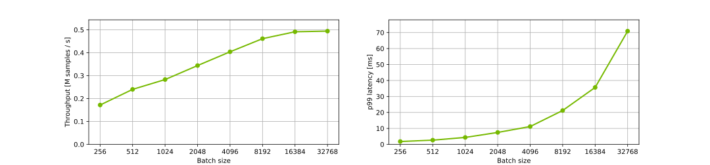
</details>


#### Offline: DCNv2 on NVIDIA DGX A100 (1x A100 80GB), TensorFlow + TensorRT with FP32, 4B parameters
Our results were obtained using the following configuration:

| Parameter Name               | Parameter Value              |
|:-----------------------------|:-----------------------------|
| GPU                          |NVIDIA DGX A100 (1x A100 80GB)            |
| Model architecture | DCNv2 |
| Model size | 4B parameters |
| Backend                      |TensorFlow + NVIDIA TensorRT|
| Backend accelerator          |-|
| Precision                    |FP32      |
| Model format                 |NVIDIA Triton Ensemble (TensorFlow SavedModel + NVIDIA TensorRT)|
| Max batch size               |32768|
| Number of model instances    |1|
| Export Format | TensorFlow SavedModel|
| NVIDIA TensorRT Capture CUDA Graph | Enabled|
| Device Kind | gpu|

<details><summary>Results Table</summary>

|    |   Batch |   Concurrency |   Inferences/Second |   Client Send |   Network+Server Send/Recv |   Server Queue |   Server Compute Input |   Server Compute Infer |   Server Compute Output |   Client Recv |   p50 latency |   p90 latency |   p95 latency |   p99 latency |   avg latency |
|---:|--------:|--------------:|--------------------:|--------------:|---------------------------:|---------------:|-----------------------:|-----------------------:|------------------------:|--------------:|--------------:|--------------:|--------------:|--------------:|--------------:|
|  0 |     256 |             1 |            2.70e+05 |            23 |                        149 |              0 |                     49 |                    630 |                      93 |             0 |           929 |           953 |          1047 |          1112 |           944 |
|  1 |     512 |             1 |            4.95e+05 |            23 |                        151 |              0 |                     59 |                    705 |                      90 |             0 |          1032 |          1058 |          1172 |          1191 |          1028 |
|  2 |    1024 |             1 |            8.42e+05 |            23 |                        152 |              0 |                     76 |                    862 |                      96 |             0 |          1193 |          1233 |          1354 |          1396 |          1209 |
|  3 |    2048 |             1 |            1.08e+06 |            30 |                        172 |              0 |                    123 |                   1421 |                     150 |             0 |          1810 |          2047 |          2069 |          4216 |          1896 |
|  4 |    4096 |             1 |            1.37e+06 |            32 |                        167 |              0 |                    200 |                   2414 |                     166 |             0 |          2927 |          3072 |          3295 |          3435 |          2979 |
|  5 |    8192 |             1 |            1.49e+06 |            40 |                        200 |              0 |                    342 |                   4649 |                     239 |             0 |          5419 |          5587 |          5618 |          5749 |          5470 |
|  6 |   16384 |             1 |            1.41e+06 |            29 |                        186 |              0 |                    661 |                  10358 |                     348 |             0 |         11501 |         11719 |         12265 |         12401 |         11582 |
|  7 |   32768 |             1 |            1.37e+06 |            43 |                        232 |              0 |                   1379 |                  21628 |                     616 |             0 |         23233 |         23738 |         24043 |         24865 |         23898 |

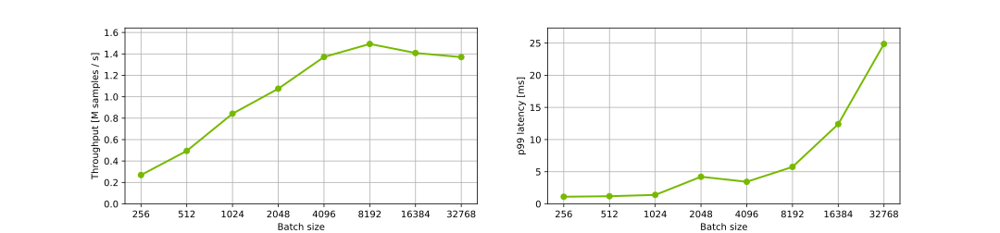
</details>


#### Offline: DCNv2 on NVIDIA DGX A100 (1x A100 80GB), TensorFlow + TensorRT with FP16, 4B parameters
Our results were obtained using the following configuration:

| Parameter Name               | Parameter Value              |
|:-----------------------------|:-----------------------------|
| GPU                          |NVIDIA DGX A100 (1x A100 80GB)            |
| Model architecture | DCNv2 |
| Model size | 4B parameters |
| Backend                      |TensorFlow + NVIDIA TensorRT|
| Backend accelerator          |-|
| Precision                    |FP16      |
| Model format                 |NVIDIA Triton Ensemble (TensorFlow SavedModel + NVIDIA TensorRT)|
| Max batch size               |32768|
| Number of model instances    |1|
| Export Format | TensorFlow SavedModel|
| NVIDIA TensorRT Capture CUDA Graph | Enabled|
| Device Kind | gpu|

<details><summary>Results Table</summary>

|    |   Batch |   Concurrency |   Inferences/Second |   Client Send |   Network+Server Send/Recv |   Server Queue |   Server Compute Input |   Server Compute Infer |   Server Compute Output |   Client Recv |   p50 latency |   p90 latency |   p95 latency |   p99 latency |   avg latency |
|---:|--------:|--------------:|--------------------:|--------------:|---------------------------:|---------------:|-----------------------:|-----------------------:|------------------------:|--------------:|--------------:|--------------:|--------------:|--------------:|--------------:|
|  0 |     256 |             1 |            3.39e+05 |            24 |                        152 |              0 |                     46 |                    440 |                      88 |             0 |           732 |           791 |           800 |           827 |           750 |
|  1 |     512 |             1 |            6.15e+05 |            23 |                        150 |              0 |                     58 |                    505 |                      91 |             0 |           826 |           854 |           905 |           935 |           827 |
|  2 |    1024 |             1 |            1.12e+06 |            23 |                        150 |              0 |                     74 |                    566 |                      98 |             0 |           901 |           929 |          1002 |          1034 |           911 |
|  3 |    2048 |             1 |            1.55e+06 |            23 |                        154 |              0 |                    122 |                    894 |                     121 |             0 |          1302 |          1332 |          1434 |          1465 |          1314 |
|  4 |    4096 |             1 |            2.16e+06 |            24 |                        155 |              0 |                    166 |                   1387 |                     157 |             0 |          1871 |          1909 |          2096 |          2173 |          1889 |
|  5 |    8192 |             1 |            2.53e+06 |            30 |                        180 |              0 |                    333 |                   2458 |                     231 |             0 |          3195 |          3399 |          3544 |          3731 |          3232 |
|  6 |   16384 |             1 |            2.48e+06 |            40 |                        204 |              0 |                    765 |                   5201 |                     367 |             0 |          6501 |          6684 |          7033 |          7235 |          6577 |
|  7 |   32768 |             1 |            2.67e+06 |            42 |                        235 |              0 |                   1243 |                  10114 |                     622 |             0 |         12115 |         12815 |         13240 |         14024 |         12256 |

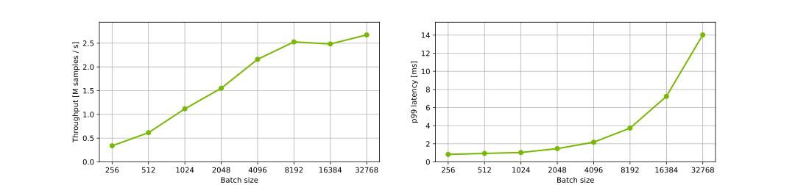
</details>


#### Offline: DCNv2 on NVIDIA DGX A100 (1x A100 80GB), TensorFlow + TensorRT with FP32, 22B parameters
Our results were obtained using the following configuration:

| Parameter Name               | Parameter Value              |
|:-----------------------------|:-----------------------------|
| GPU                          |NVIDIA DGX A100 (1x A100 80GB)            |
| Model architecture | DCNv2 |
| Model size | 22B parameters |
| Backend                      |TensorFlow + NVIDIA TensorRT|
| Backend accelerator          |-|
| Precision                    |FP32      |
| Model format                 |NVIDIA Triton Ensemble (TensorFlow SavedModel + NVIDIA TensorRT)|
| Max batch size               |32768|
| Number of model instances    |1|
| Export Format | TensorFlow SavedModel|
| NVIDIA TensorRT Capture CUDA Graph | Enabled|
| Device Kind | gpu|

<details><summary>Results Table</summary>

|    |   Batch |   Concurrency |   Inferences/Second |   Client Send |   Network+Server Send/Recv |   Server Queue |   Server Compute Input |   Server Compute Infer |   Server Compute Output |   Client Recv |   p50 latency |   p90 latency |   p95 latency |   p99 latency |   avg latency |
|---:|--------:|--------------:|--------------------:|--------------:|---------------------------:|---------------:|-----------------------:|-----------------------:|------------------------:|--------------:|--------------:|--------------:|--------------:|--------------:|--------------:|
|  0 |     256 |             1 |            1.92e+05 |            24 |                        149 |              0 |                     52 |                   1012 |                      91 |             0 |          1300 |          1411 |          1434 |          1555 |          1328 |
|  1 |     512 |             1 |            3.36e+05 |            24 |                        152 |              0 |                     62 |                   1184 |                      93 |             0 |          1511 |          1587 |          1658 |          1717 |          1515 |
|  2 |    1024 |             1 |            5.49e+05 |            24 |                        155 |              0 |                     79 |                   1498 |                     101 |             0 |          1836 |          1906 |          2009 |          2139 |          1857 |
|  3 |    2048 |             1 |            6.99e+05 |            26 |                        156 |              0 |                    124 |                   2487 |                     130 |             0 |          2857 |          3174 |          3308 |          3655 |          2923 |
|  4 |    4096 |             1 |            8.30e+05 |            30 |                        177 |              0 |                    215 |                   4348 |                     153 |             0 |          4812 |          5567 |          5971 |          6442 |          4923 |
|  5 |    8192 |             1 |            9.85e+05 |            45 |                        209 |              0 |                    414 |                   7393 |                     225 |             0 |          8177 |          8742 |          9208 |         10278 |          8286 |
|  6 |   16384 |             1 |            9.93e+05 |            49 |                        233 |              0 |                    843 |                  14939 |                     352 |             0 |         16206 |         17388 |         17870 |         18617 |         16416 |
|  7 |   32768 |             1 |            1.06e+06 |            49 |                        259 |              0 |                   1131 |                  28711 |                     628 |             0 |         30315 |         32463 |         33532 |         36270 |         30778 |

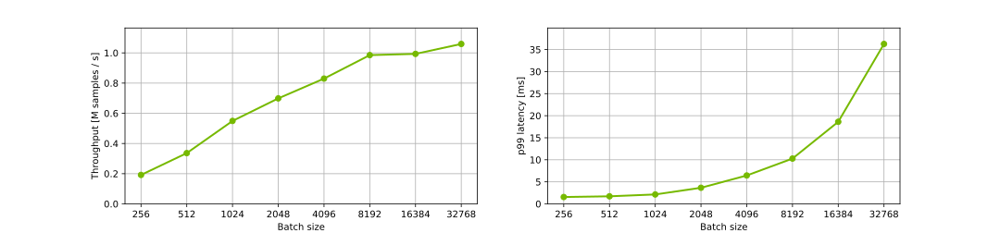
</details>


#### Offline: DCNv2 on NVIDIA DGX A100 (1x A100 80GB), TensorFlow + TensorRT with FP16, 22B parameters
Our results were obtained using the following configuration:

| Parameter Name               | Parameter Value              |
|:-----------------------------|:-----------------------------|
| GPU                          |NVIDIA DGX A100 (1x A100 80GB)            |
| Model architecture | DCNv2 |
| Model size | 22B parameters |
| Backend                      |TensorFlow + NVIDIA TensorRT|
| Backend accelerator          |-|
| Precision                    |FP16      |
| Model format                 |NVIDIA Triton Ensemble (TensorFlow SavedModel + NVIDIA TensorRT)|
| Max batch size               |32768|
| Number of model instances    |1|
| Export Format | TensorFlow SavedModel|
| NVIDIA TensorRT Capture CUDA Graph | Enabled|
| Device Kind | gpu|

<details><summary>Results Table</summary>

|    |   Batch |   Concurrency |   Inferences/Second |   Client Send |   Network+Server Send/Recv |   Server Queue |   Server Compute Input |   Server Compute Infer |   Server Compute Output |   Client Recv |   p50 latency |   p90 latency |   p95 latency |   p99 latency |   avg latency |
|---:|--------:|--------------:|--------------------:|--------------:|---------------------------:|---------------:|-----------------------:|-----------------------:|------------------------:|--------------:|--------------:|--------------:|--------------:|--------------:|--------------:|
|  0 |     256 |             1 |            1.98e+05 |            34 |                        198 |              0 |                     61 |                    884 |                     106 |             0 |          1269 |          1327 |          1368 |          1480 |          1283 |
|  1 |     512 |             1 |            3.45e+05 |            29 |                        191 |              0 |                     76 |                   1077 |                     104 |             0 |          1467 |          1516 |          1539 |          1596 |          1477 |
|  2 |    1024 |             1 |            5.67e+05 |            36 |                        192 |              0 |                    101 |                   1354 |                     113 |             0 |          1782 |          1829 |          1848 |          2143 |          1796 |
|  3 |    2048 |             1 |            7.91e+05 |            36 |                        183 |              0 |                    158 |                   2072 |                     131 |             0 |          2553 |          2703 |          2800 |          3127 |          2580 |
|  4 |    4096 |             1 |            1.16e+06 |            36 |                        179 |              0 |                    254 |                   2895 |                     166 |             0 |          3449 |          3809 |          3965 |          5094 |          3530 |
|  5 |    8192 |             1 |            1.29e+06 |            55 |                        261 |              0 |                    449 |                   5356 |                     224 |             0 |          6194 |          7174 |          7493 |          8730 |          6345 |
|  6 |   16384 |             1 |            1.46e+06 |            46 |                        250 |              0 |                    748 |                   9808 |                     369 |             0 |         10971 |         12202 |         12713 |         14880 |         11221 |
|  7 |   32768 |             1 |            1.61e+06 |            44 |                        266 |              0 |                   1214 |                  18171 |                     659 |             0 |         19841 |         20937 |         23008 |         28718 |         20354 |

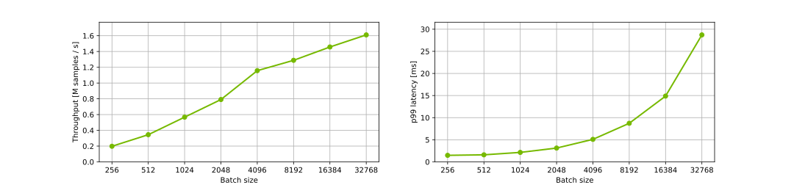
</details>


#### Offline: DCNv2 on NVIDIA A30, TensorFlow + TensorRT with FP32, 4B parameters
Our results were obtained using the following configuration:

| Parameter Name               | Parameter Value              |
|:-----------------------------|:-----------------------------|
| GPU                          |NVIDIA A30            |
| Model architecture | DCNv2 |
| Model size | 4B parameters |
| Backend                      |TensorFlow + NVIDIA TensorRT|
| Backend accelerator          |-|
| Precision                    |FP32      |
| Model format                 |NVIDIA Triton Ensemble (TensorFlow SavedModel + NVIDIA TensorRT)|
| Max batch size               |32768|
| Number of model instances    |1|
| Export Format | TensorFlow SavedModel|
| NVIDIA TensorRT Capture CUDA Graph | Enabled|
| Device Kind | gpu|

<details><summary>Results Table</summary>

|    |   Batch |   Concurrency |   Inferences/Second |   Client Send |   Network+Server Send/Recv |   Server Queue |   Server Compute Input |   Server Compute Infer |   Server Compute Output |   Client Recv |   p50 latency |   p90 latency |   p95 latency |   p99 latency |   avg latency |
|---:|--------:|--------------:|--------------------:|--------------:|---------------------------:|---------------:|-----------------------:|-----------------------:|------------------------:|--------------:|--------------:|--------------:|--------------:|--------------:|--------------:|
|  0 |     256 |             1 |            1.40e+05 |            60 |                        222 |              1 |                     51 |                   1396 |                      92 |             1 |          1789 |          1869 |          2256 |          2394 |          1823 |
|  1 |     512 |             1 |            2.35e+05 |            60 |                        217 |              1 |                     66 |                   1721 |                     100 |             1 |          2123 |          2375 |          2530 |          2916 |          2166 |
|  2 |    1024 |             1 |            3.43e+05 |            76 |                        244 |              1 |                    118 |                   2410 |                     124 |             1 |          2980 |          3053 |          3084 |          3226 |          2974 |
|  3 |    2048 |             1 |            3.72e+05 |            90 |                        361 |              1 |                    208 |                   4646 |                     169 |             1 |          5452 |          5804 |          6076 |          6376 |          5476 |
|  4 |    4096 |             1 |            5.14e+05 |            96 |                        429 |              1 |                    368 |                   6770 |                     262 |             1 |          7888 |          8321 |          8427 |          8842 |          7927 |
|  5 |    8192 |             1 |            6.25e+05 |            94 |                        442 |              2 |                    692 |                  11322 |                     537 |             1 |         13014 |         13343 |         13442 |         14706 |         13090 |
|  6 |   16384 |             1 |            6.41e+05 |           103 |                        581 |              2 |                   1292 |                  22762 |                     760 |             1 |         25280 |         27910 |         28633 |         29536 |         25501 |
|  7 |   32768 |             1 |            6.88e+05 |           112 |                        641 |              2 |                   2666 |                  42753 |                    1336 |             2 |         46470 |         50954 |         52078 |         56703 |         47512 |

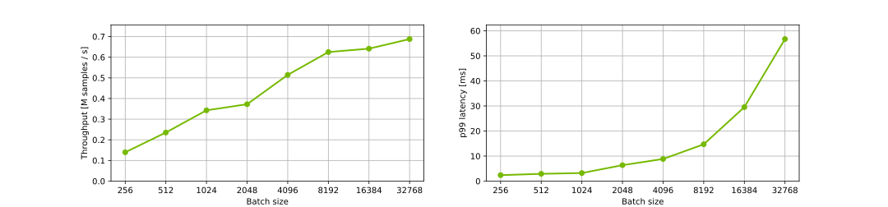
</details>


#### Offline: DCNv2 on NVIDIA A30, TensorFlow + TensorRT with FP16, 4B parameters
Our results were obtained using the following configuration:

| Parameter Name               | Parameter Value              |
|:-----------------------------|:-----------------------------|
| GPU                          |NVIDIA A30            |
| Model architecture | DCNv2 |
| Model size | 4B parameters |
| Backend                      |TensorFlow + NVIDIA TensorRT|
| Backend accelerator          |-|
| Precision                    |FP16      |
| Model format                 |NVIDIA Triton Ensemble (TensorFlow SavedModel + NVIDIA TensorRT)|
| Max batch size               |32768|
| Number of model instances    |1|
| Export Format | TensorFlow SavedModel|
| NVIDIA TensorRT Capture CUDA Graph | Enabled|
| Device Kind | gpu|

<details><summary>Results Table</summary>

|    |   Batch |   Concurrency |   Inferences/Second |   Client Send |   Network+Server Send/Recv |   Server Queue |   Server Compute Input |   Server Compute Infer |   Server Compute Output |   Client Recv |   p50 latency |   p90 latency |   p95 latency |   p99 latency |   avg latency |
|---:|--------:|--------------:|--------------------:|--------------:|---------------------------:|---------------:|-----------------------:|-----------------------:|------------------------:|--------------:|--------------:|--------------:|--------------:|--------------:|--------------:|
|  0 |     256 |             1 |            1.84e+05 |            59 |                        234 |              1 |                     52 |                    937 |                      98 |             1 |          1369 |          1513 |          1569 |          1640 |          1382 |
|  1 |     512 |             1 |            2.99e+05 |            64 |                        231 |              1 |                     68 |                   1231 |                     107 |             1 |          1678 |          1849 |          1956 |          2055 |          1703 |
|  2 |    1024 |             1 |            4.25e+05 |            73 |                        271 |              1 |                    147 |                   1781 |                     127 |             1 |          2368 |          2578 |          2644 |          2786 |          2401 |
|  3 |    2048 |             1 |            4.97e+05 |           104 |                        337 |              1 |                    258 |                   3224 |                     171 |             1 |          4019 |          4501 |          4761 |          5127 |          4096 |
|  4 |    4096 |             1 |            4.71e+05 |            77 |                        306 |              2 |                    517 |                   7521 |                     256 |             1 |          8184 |         10650 |         12194 |         15546 |          8680 |
|  5 |    8192 |             1 |            7.56e+05 |            92 |                        383 |              2 |                    672 |                   9269 |                     391 |             1 |          9902 |         13945 |         14758 |         17802 |         10810 |
|  6 |   16384 |             1 |            9.28e+05 |            96 |                        500 |              2 |                   1141 |                  15117 |                     723 |             1 |         16894 |         21048 |         22180 |         25198 |         17580 |
|  7 |   32768 |             1 |            1.03e+06 |           103 |                        589 |              2 |                   2228 |                  27519 |                    1320 |             1 |         30467 |         35800 |         36760 |         39742 |         31762 |

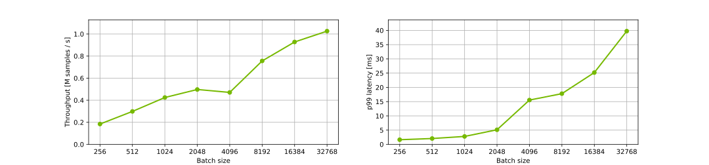
</details>


#### Offline: DCNv2 on NVIDIA A30, TensorFlow + TensorRT with FP32, 22B parameters
Our results were obtained using the following configuration:

| Parameter Name               | Parameter Value              |
|:-----------------------------|:-----------------------------|
| GPU                          |NVIDIA A30            |
| Model architecture | DCNv2 |
| Model size | 22B parameters |
| Backend                      |TensorFlow + NVIDIA TensorRT|
| Backend accelerator          |-|
| Precision                    |FP32      |
| Model format                 |NVIDIA Triton Ensemble (TensorFlow SavedModel + NVIDIA TensorRT)|
| Max batch size               |32768|
| Number of model instances    |1|
| Export Format | TensorFlow SavedModel|
| NVIDIA TensorRT Capture CUDA Graph | Enabled|
| Device Kind | gpu|

<details><summary>Results Table</summary>

|    |   Batch |   Concurrency |   Inferences/Second |   Client Send |   Network+Server Send/Recv |   Server Queue |   Server Compute Input |   Server Compute Infer |   Server Compute Output |   Client Recv |   p50 latency |   p90 latency |   p95 latency |   p99 latency |   avg latency |
|---:|--------:|--------------:|--------------------:|--------------:|---------------------------:|---------------:|-----------------------:|-----------------------:|------------------------:|--------------:|--------------:|--------------:|--------------:|--------------:|--------------:|
|  0 |     256 |             1 |            1.41e+05 |            34 |                        201 |              0 |                     68 |                   1422 |                      86 |             0 |          1798 |          1937 |          2161 |          2380 |          1811 |
|  1 |     512 |             1 |            2.50e+05 |            37 |                        193 |              0 |                     91 |                   1629 |                      91 |             0 |          2015 |          2233 |          2318 |          2554 |          2041 |
|  2 |    1024 |             1 |            2.38e+05 |            39 |                        248 |              0 |                    149 |                   3730 |                     127 |             0 |          4226 |          5017 |          5430 |          6047 |          4293 |
|  3 |    2048 |             1 |            3.25e+05 |            64 |                        331 |              0 |                    209 |                   5504 |                     182 |             0 |          5933 |          7999 |          8351 |          9265 |          6290 |
|  4 |    4096 |             1 |            4.33e+05 |            60 |                        336 |              0 |                    345 |                   8492 |                     224 |             0 |          8519 |         12891 |         13500 |         14957 |          9457 |
|  5 |    8192 |             1 |            5.05e+05 |            69 |                        328 |              0 |                    757 |                  14507 |                     489 |             0 |         15555 |         20018 |         21217 |         24015 |         16150 |
|  6 |   16384 |             1 |            5.29e+05 |            70 |                        452 |              1 |                   1861 |                  27757 |                     729 |             0 |         30222 |         36890 |         38138 |         42585 |         30870 |
|  7 |   32768 |             1 |            5.61e+05 |            85 |                        602 |              1 |                   3301 |                  52915 |                    1302 |             0 |         57743 |         66789 |         69415 |         80008 |         58206 |

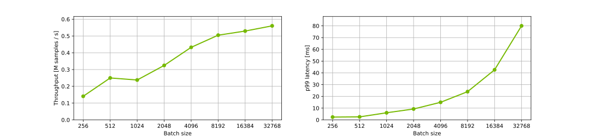
</details>


#### Offline: DCNv2 on NVIDIA A30, TensorFlow + TensorRT with FP16, 22B parameters
Our results were obtained using the following configuration:

| Parameter Name               | Parameter Value              |
|:-----------------------------|:-----------------------------|
| GPU                          |NVIDIA A30            |
| Model architecture | DCNv2 |
| Model size | 22B parameters |
| Backend                      |TensorFlow + NVIDIA TensorRT|
| Backend accelerator          |-|
| Precision                    |FP16      |
| Model format                 |NVIDIA Triton Ensemble (TensorFlow SavedModel + NVIDIA TensorRT)|
| Max batch size               |32768|
| Number of model instances    |1|
| Export Format | TensorFlow SavedModel|
| NVIDIA TensorRT Capture CUDA Graph | Enabled|
| Device Kind | gpu|

<details><summary>Results Table</summary>

|    |   Batch |   Concurrency |   Inferences/Second |   Client Send |   Network+Server Send/Recv |   Server Queue |   Server Compute Input |   Server Compute Infer |   Server Compute Output |   Client Recv |   p50 latency |   p90 latency |   p95 latency |   p99 latency |   avg latency |
|---:|--------:|--------------:|--------------------:|--------------:|---------------------------:|---------------:|-----------------------:|-----------------------:|------------------------:|--------------:|--------------:|--------------:|--------------:|--------------:|--------------:|
|  0 |     256 |             1 |            1.75e+05 |            31 |                        155 |              0 |                     52 |                   1136 |                      78 |             0 |          1419 |          1591 |          1640 |          1831 |          1452 |
|  1 |     512 |             1 |            2.71e+05 |            33 |                        163 |              0 |                     82 |                   1520 |                      80 |             0 |          1849 |          1924 |          1958 |          3602 |          1878 |
|  2 |    1024 |             1 |            3.14e+05 |            73 |                        260 |              0 |                    148 |                   2651 |                     110 |             0 |          3218 |          3445 |          3536 |          5800 |          3242 |
|  3 |    2048 |             1 |            2.80e+05 |            58 |                        209 |              0 |                    245 |                   6634 |                     156 |             0 |          6994 |         10021 |         10424 |         10919 |          7302 |
|  4 |    4096 |             1 |            4.48e+05 |            68 |                        283 |              0 |                    346 |                   8211 |                     219 |             0 |          8385 |         12535 |         13358 |         16307 |          9127 |
|  5 |    8192 |             1 |            5.62e+05 |            77 |                        271 |              0 |                    650 |                  13167 |                     366 |             0 |         14355 |         18585 |         19638 |         22077 |         14531 |
|  6 |   16384 |             1 |            6.11e+05 |            83 |                        377 |              0 |                   2297 |                  23271 |                     680 |             0 |         26604 |         34647 |         36354 |         39316 |         26708 |
|  7 |   32768 |             1 |            7.17e+05 |            73 |                        514 |              1 |                   5409 |                  38366 |                    1279 |             0 |         44389 |         55813 |         58518 |         70669 |         45642 |

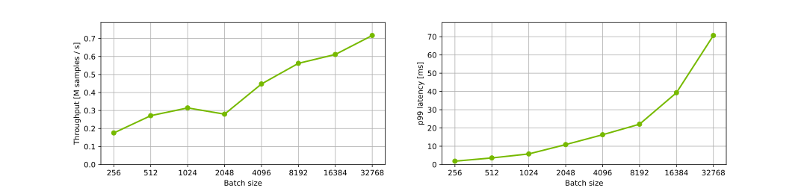
</details>


/tmp/ipykernel_771557/1052116882.py:9: RuntimeWarning: More than 20 figures have been opened. Figures created through the pyplot interface (`matplotlib.pyplot.figure`) are retained until explicitly closed and may consume too much memory. (To control this warning, see the rcParam `figure.max_open_warning`).
  fig, axarr = plt.subplots(1, 2, figsize=[15, 3.5], dpi=100)
#### Offline: DCNv2 on NVIDIA T4, TensorFlow + TensorRT with FP32, 4B parameters
Our results were obtained using the following configuration:

| Parameter Name               | Parameter Value              |
|:-----------------------------|:-----------------------------|
| GPU                          |NVIDIA T4            |
| Model architecture | DCNv2 |
| Model size | 4B parameters |
| Backend                      |TensorFlow + NVIDIA TensorRT|
| Backend accelerator          |-|
| Precision                    |FP32      |
| Model format                 |NVIDIA Triton Ensemble (TensorFlow SavedModel + NVIDIA TensorRT)|
| Max batch size               |32768|
| Number of model instances    |1|
| Export Format | TensorFlow SavedModel|
| NVIDIA TensorRT Capture CUDA Graph | Enabled|
| Device Kind | gpu|

<details><summary>Results Table</summary>

|    |   Batch |   Concurrency |   Inferences/Second |   Client Send |   Network+Server Send/Recv |   Server Queue |   Server Compute Input |   Server Compute Infer |   Server Compute Output |   Client Recv |   p50 latency |   p90 latency |   p95 latency |   p99 latency |   avg latency |
|---:|--------:|--------------:|--------------------:|--------------:|---------------------------:|---------------:|-----------------------:|-----------------------:|------------------------:|--------------:|--------------:|--------------:|--------------:|--------------:|--------------:|
|  0 |     256 |             1 |            7.86e+04 |            44 |                        375 |              0 |                     92 |                   2501 |                     236 |             0 |          3248 |          3415 |          3457 |          3569 |          3248 |
|  1 |     512 |             1 |            9.13e+04 |            44 |                        433 |              0 |                    131 |                   4681 |                     301 |             0 |          5447 |          5701 |          5830 |          9042 |          5590 |
|  2 |    1024 |             1 |            1.04e+05 |            45 |                        435 |              0 |                    203 |                   8767 |                     382 |             0 |          9849 |         10118 |         10238 |         11009 |          9832 |
|  3 |    2048 |             1 |            1.08e+05 |            46 |                        407 |              0 |                    341 |                  17573 |                     481 |             0 |         19072 |         19665 |         19791 |         20127 |         18848 |
|  4 |    4096 |             1 |            1.11e+05 |            49 |                        433 |              0 |                    620 |                  34940 |                     753 |             0 |         36648 |         38501 |         39238 |         40913 |         36795 |
|  5 |    8192 |             1 |            1.11e+05 |            54 |                        520 |              0 |                   1183 |                  70303 |                    1170 |             0 |         72605 |         75982 |         76263 |         80393 |         73230 |
|  6 |   16384 |             1 |            1.10e+05 |            67 |                        587 |              0 |                   2425 |                 143325 |                    2060 |             0 |        148529 |        150641 |        151048 |        154147 |        148464 |
|  7 |   32768 |             1 |            1.07e+05 |            98 |                        846 |              1 |                   4860 |                 295283 |                    3870 |             0 |        305032 |        308246 |        310093 |        311552 |        304958 |

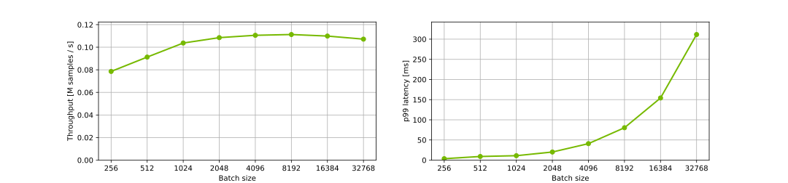
</details>


#### Offline: DCNv2 on NVIDIA T4, TensorFlow + TensorRT with FP16, 4B parameters
Our results were obtained using the following configuration:

| Parameter Name               | Parameter Value              |
|:-----------------------------|:-----------------------------|
| GPU                          |NVIDIA T4            |
| Model architecture | DCNv2 |
| Model size | 4B parameters |
| Backend                      |TensorFlow + NVIDIA TensorRT|
| Backend accelerator          |-|
| Precision                    |FP16      |
| Model format                 |NVIDIA Triton Ensemble (TensorFlow SavedModel + NVIDIA TensorRT)|
| Max batch size               |32768|
| Number of model instances    |1|
| Export Format | TensorFlow SavedModel|
| NVIDIA TensorRT Capture CUDA Graph | Enabled|
| Device Kind | gpu|

<details><summary>Results Table</summary>

|    |   Batch |   Concurrency |   Inferences/Second |   Client Send |   Network+Server Send/Recv |   Server Queue |   Server Compute Input |   Server Compute Infer |   Server Compute Output |   Client Recv |   p50 latency |   p90 latency |   p95 latency |   p99 latency |   avg latency |
|---:|--------:|--------------:|--------------------:|--------------:|---------------------------:|---------------:|-----------------------:|-----------------------:|------------------------:|--------------:|--------------:|--------------:|--------------:|--------------:|--------------:|
|  0 |     256 |             1 |            1.09e+05 |            49 |                        439 |              0 |                     94 |                   1579 |                     171 |             0 |          2330 |          2553 |          2604 |          2704 |          2332 |
|  1 |     512 |             1 |            1.77e+05 |            51 |                        367 |              0 |                    124 |                   2113 |                     225 |             0 |          2880 |          3038 |          3080 |          3219 |          2880 |
|  2 |    1024 |             1 |            2.54e+05 |            40 |                        361 |              0 |                    198 |                   3053 |                     360 |             0 |          4000 |          4132 |          4192 |          4341 |          4012 |
|  3 |    2048 |             1 |            2.77e+05 |            49 |                        535 |              0 |                    348 |                   5934 |                     514 |             0 |          7334 |          7648 |          7793 |          9272 |          7380 |
|  4 |    4096 |             1 |            3.11e+05 |            48 |                        541 |              0 |                    644 |                  11095 |                     796 |             0 |         12911 |         13438 |         15733 |         18127 |         13124 |
|  5 |    8192 |             1 |            3.34e+05 |            50 |                        576 |              0 |                   1180 |                  21472 |                    1187 |             0 |         24101 |         25307 |         27011 |         30350 |         24465 |
|  6 |   16384 |             1 |            3.48e+05 |            59 |                        662 |              0 |                   2345 |                  41747 |                    2110 |             0 |         46995 |         47956 |         48105 |         48710 |         46923 |
|  7 |   32768 |             1 |            3.49e+05 |            69 |                        756 |              1 |                   4705 |                  83982 |                    3881 |             0 |         93290 |         95408 |         96025 |         97009 |         93394 |

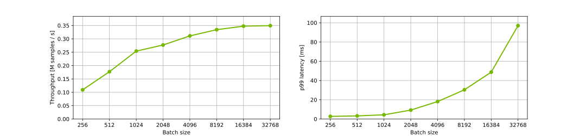
</details>


#### Offline: DCNv2 on NVIDIA T4, TensorFlow + TensorRT with FP32, 22B parameters
Our results were obtained using the following configuration:

| Parameter Name               | Parameter Value              |
|:-----------------------------|:-----------------------------|
| GPU                          |NVIDIA T4            |
| Model architecture | DCNv2 |
| Model size | 22B parameters |
| Backend                      |TensorFlow + NVIDIA TensorRT|
| Backend accelerator          |-|
| Precision                    |FP32      |
| Model format                 |NVIDIA Triton Ensemble (TensorFlow SavedModel + NVIDIA TensorRT)|
| Max batch size               |32768|
| Number of model instances    |1|
| Export Format | TensorFlow SavedModel|
| NVIDIA TensorRT Capture CUDA Graph | Enabled|
| Device Kind | gpu|

<details><summary>Results Table</summary>

|    |   Batch |   Concurrency |   Inferences/Second |   Client Send |   Network+Server Send/Recv |   Server Queue |   Server Compute Input |   Server Compute Infer |   Server Compute Output |   Client Recv |   p50 latency |   p90 latency |   p95 latency |   p99 latency |   avg latency |
|---:|--------:|--------------:|--------------------:|--------------:|---------------------------:|---------------:|-----------------------:|-----------------------:|------------------------:|--------------:|--------------:|--------------:|--------------:|--------------:|--------------:|
|  0 |     256 |             1 |            7.24e+04 |            46 |                        377 |              0 |                     94 |                   2710 |                     297 |             0 |          3514 |          3707 |          3770 |          3848 |          3524 |
|  1 |     512 |             1 |            8.90e+04 |            48 |                        467 |              0 |                    133 |                   4741 |                     345 |             0 |          5717 |          5959 |          6026 |          6227 |          5734 |
|  2 |    1024 |             1 |            1.01e+05 |            46 |                        562 |              0 |                    217 |                   8898 |                     418 |             0 |         10061 |         10551 |         10735 |         12662 |         10141 |
|  3 |    2048 |             1 |            9.99e+04 |            46 |                        612 |              0 |                    431 |                  18812 |                     562 |             0 |         20075 |         21090 |         22357 |         31101 |         20463 |
|  4 |    4096 |             1 |            1.06e+05 |            46 |                        655 |              0 |                    727 |                  36089 |                     753 |             0 |         38056 |         39816 |         40214 |         48450 |         38270 |
|  5 |    8192 |             1 |            1.09e+05 |            49 |                        668 |              1 |                   1272 |                  71380 |                    1213 |             0 |         74280 |         75644 |         76134 |         77127 |         74583 |
|  6 |   16384 |             1 |            1.06e+05 |            72 |                        817 |              1 |                   2419 |                 147768 |                    2099 |             0 |        153166 |        155120 |        155385 |        156117 |        153176 |
|  7 |   32768 |             1 |            1.02e+05 |            89 |                        940 |              1 |                   4824 |                 311509 |                    3941 |             0 |        321135 |        325901 |        327276 |        330134 |        321304 |

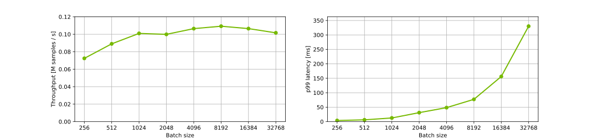
</details>


#### Offline: DCNv2 on NVIDIA T4, TensorFlow + TensorRT with FP16, 22B parameters
Our results were obtained using the following configuration:

| Parameter Name               | Parameter Value              |
|:-----------------------------|:-----------------------------|
| GPU                          |NVIDIA T4            |
| Model architecture | DCNv2 |
| Model size | 22B parameters |
| Backend                      |TensorFlow + NVIDIA TensorRT|
| Backend accelerator          |-|
| Precision                    |FP16      |
| Model format                 |NVIDIA Triton Ensemble (TensorFlow SavedModel + NVIDIA TensorRT)|
| Max batch size               |32768|
| Number of model instances    |1|
| Export Format | TensorFlow SavedModel|
| NVIDIA TensorRT Capture CUDA Graph | Enabled|
| Device Kind | gpu|

<details><summary>Results Table</summary>

|    |   Batch |   Concurrency |   Inferences/Second |   Client Send |   Network+Server Send/Recv |   Server Queue |   Server Compute Input |   Server Compute Infer |   Server Compute Output |   Client Recv |   p50 latency |   p90 latency |   p95 latency |   p99 latency |   avg latency |
|---:|--------:|--------------:|--------------------:|--------------:|---------------------------:|---------------:|-----------------------:|-----------------------:|------------------------:|--------------:|--------------:|--------------:|--------------:|--------------:|--------------:|
|  0 |     256 |             1 |            1.08e+05 |            44 |                        398 |              0 |                     93 |                   1710 |                     119 |             0 |          2341 |          2613 |          2725 |          3053 |          2364 |
|  1 |     512 |             1 |            1.57e+05 |            62 |                        485 |              0 |                    131 |                   2418 |                     147 |             0 |          3229 |          3460 |          3530 |          3859 |          3243 |
|  2 |    1024 |             1 |            2.15e+05 |            68 |                        513 |              0 |                    208 |                   3619 |                     339 |             0 |          4692 |          5164 |          5571 |          5999 |          4747 |
|  3 |    2048 |             1 |            2.64e+05 |            71 |                        570 |              0 |                    406 |                   6183 |                     504 |             0 |          7687 |          8198 |          8412 |          9083 |          7734 |
|  4 |    4096 |             1 |            3.02e+05 |            62 |                        618 |              0 |                    677 |                  11380 |                     792 |             0 |         13459 |         13972 |         14300 |         15488 |         13529 |
|  5 |    8192 |             1 |            3.21e+05 |            68 |                        618 |              0 |                   1257 |                  22300 |                    1193 |             0 |         25401 |         26175 |         26493 |         27150 |         25436 |
|  6 |   16384 |             1 |            3.37e+05 |            69 |                        704 |              1 |                   2488 |                  43214 |                    2089 |             0 |         48548 |         49881 |         50164 |         50964 |         48565 |
|  7 |   32768 |             1 |            3.36e+05 |            69 |                        838 |              1 |                   4720 |                  87391 |                    3864 |             0 |         96664 |         98617 |         99489 |        100986 |         96883 |

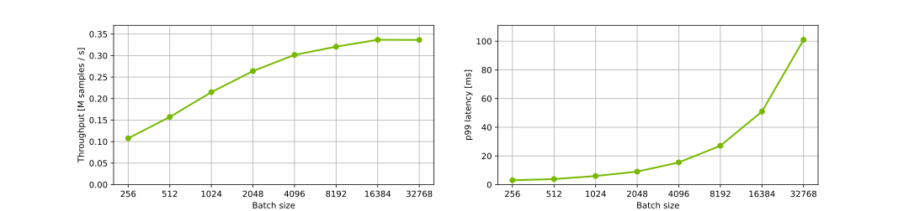
</details>


## Advanced
### Latency explanation
A typical Triton Inference Server pipeline can be broken down into the following steps:

1. The client serializes the inference request into a message and sends it to
the server (Client Send).
2. The message travels over the network from the client to the server (Network).
3. The message arrives at the server and is deserialized (Server Receive).
4. The request is placed on the queue (Server Queue).
5. The request is removed from the queue and computed (Server Compute).
6. The completed request is serialized in a message and sent back to
the client (Server Send).
7. The completed message then travels over the network from the server
to the client (Network).
8. The completed message is deserialized by the client and processed as
a completed inference request (Client Receive).

Generally, for local clients, steps 1-4 and 6-8 will only occupy
a small fraction of time compared to step 5. In distributed systems and online processing
where the client and the server side are connected through a network, the send and receive steps might have an impact
on overall processing performance. In order to analyze the possible bottlenecks, detailed
charts are presented in online scenario cases.


## Release Notes
We’re constantly refining and improving our performance on AI
and HPC workloads, even on the same hardware, with frequent updates
to our software stack. For our latest performance data, refer
to these pages for
[AI](https://developer.nvidia.com/deep-learning-performance-training-inference)
and [HPC](https://developer.nvidia.com/hpc-application-performance) benchmarks.

### Changelog

April 2023
- Initial release

### Known issues

- There are no known issues with this model.
