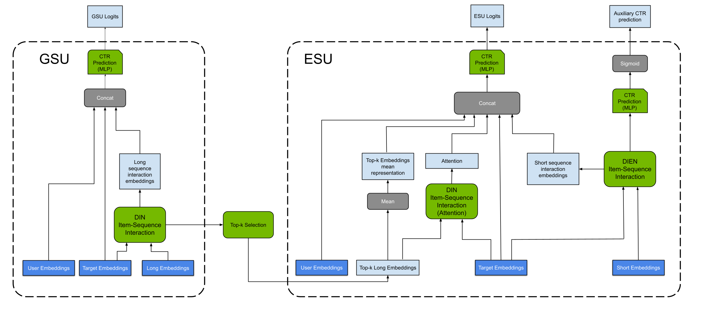
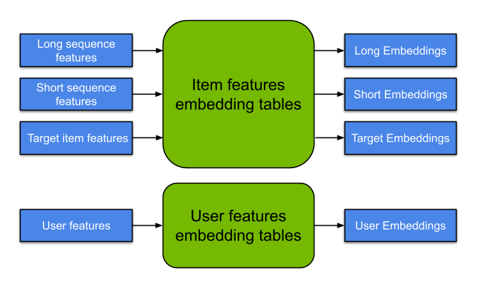
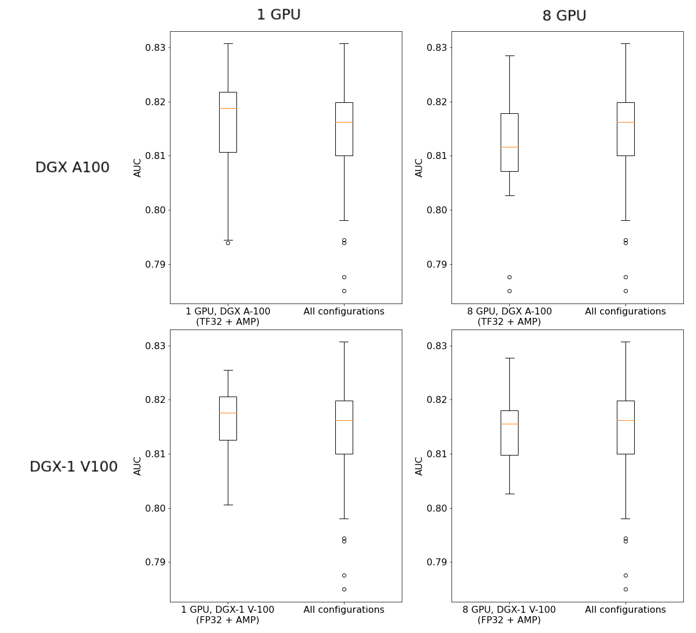
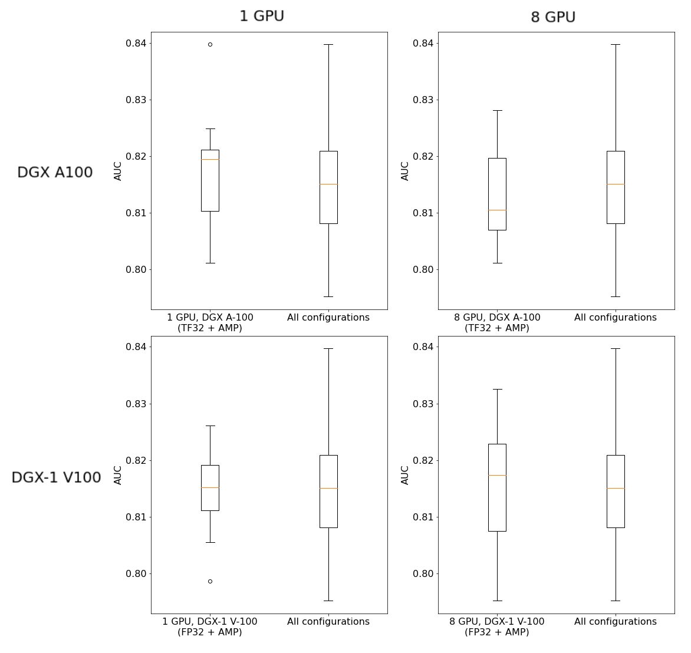
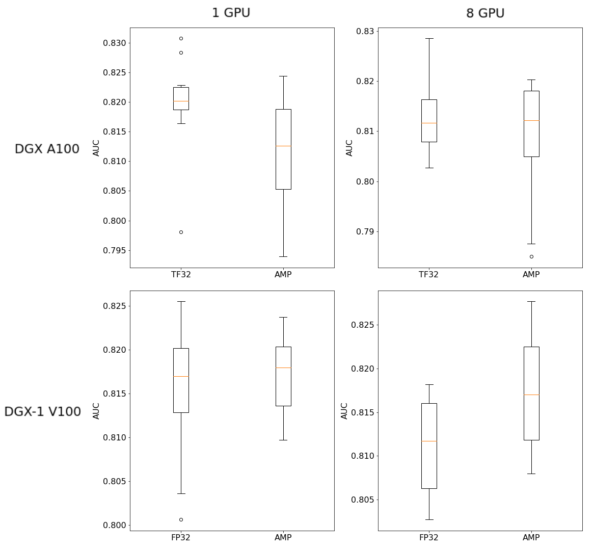
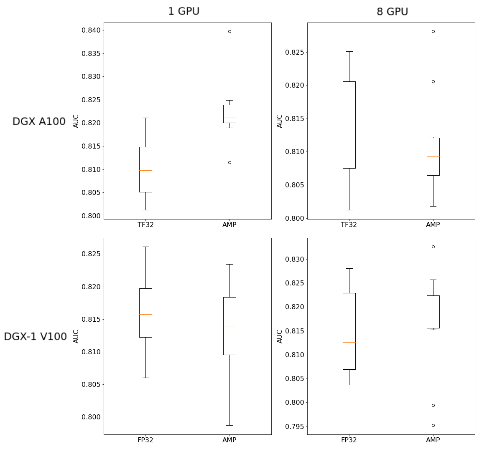
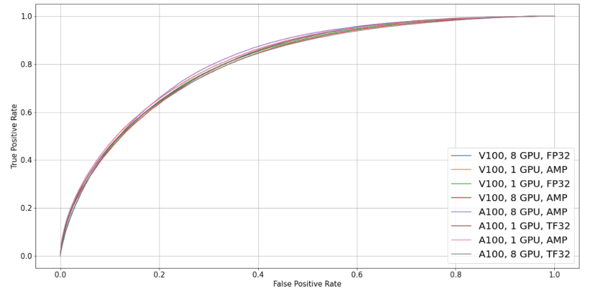

# SIM For TensorFlow 2

This repository provides a script and recipe to train the SIM model to achieve state-of-the-art accuracy. The content of this repository is tested and maintained by NVIDIA.

## Table Of Contents

- [Model overview](#model-overview)
    * [Model architecture](#model-architecture)
    * [Default configuration](#default-configuration)
    * [Feature support matrix](#feature-support-matrix)
	    * [Features](#features)
    * [Mixed precision training](#mixed-precision-training)
	    * [Enabling mixed precision](#enabling-mixed-precision)
          * [Enabling TF32](#enabling-tf32)
    * [BYO dataset functionality overview](#byo-dataset-functionality-overview)
        * [BYO dataset glossary](#byo-dataset-glossary)
        * [Dataset feature specification](#dataset-feature-specification)
        * [Data flow in NVIDIA Deep Learning Examples recommendation models](#data-flow-in-nvidia-deep-learning-examples-recommendation-models)
        * [Example of dataset feature specification](#example-of-dataset-feature-specification)
        * [BYO dataset functionality](#byo-dataset-functionality)
    * [Glossary](#glossary)
- [Setup](#setup)
    * [Requirements](#requirements)
- [Quick Start Guide](#quick-start-guide)
- [Advanced](#advanced)
    * [Scripts and sample code](#scripts-and-sample-code)
    * [Parameters](#parameters)
    * [Command-line options](#command-line-options)
    * [Getting the data](#getting-the-data)
        * [Dataset guidelines](#dataset-guidelines)
        * [Prebatching](#prebatching)
        * [BYO dataset](#byo-dataset)
            * [Channel definitions and requirements](#channel-definitions-and-requirements)
    * [Training process](#training-process)
    * [Inference process](#inference-process)
    * [Log format](#log-format)
        * [Training log data](#training-log-data)
        * [Inference log data](#inference-log-data)
- [Performance](#performance)
    * [Benchmarking](#benchmarking)
        * [Training performance benchmark](#training-performance-benchmark)
        * [Inference performance benchmark](#inference-performance-benchmark)
    * [Results](#results)
        * [Training accuracy results](#training-accuracy-results)                         
            * [Training accuracy: NVIDIA DGX A100 (8x A100 80GB)](#training-accuracy-nvidia-dgx-a100-8x-a100-80gb)  
            * [Training accuracy: NVIDIA DGX-1 (8x V100 32GB)](#training-accuracy-nvidia-dgx-1-8x-v100-32gb)
            * [Training stability test](#training-stability-test)
            * [Impact of mixed precision on training accuracy](#impact-of-mixed-precision-on-training-accuracy)
            * [Training accuracy plot](#training-accuracy-plot)
        * [Training performance results](#training-performance-results)
            * [Training performance: NVIDIA DGX A100 (8x A100 80GB)](#training-performance-nvidia-dgx-a100-8x-a100-80gb)
            * [Training performance: NVIDIA DGX-2 (16x V100 32GB)](#training-performance-nvidia-dgx-2-16x-v100-32gb)
        * [Inference performance results](#inference-performance-results)
            * [Inference performance: NVIDIA DGX A100 (8x A100 80GB)](#inference-performance-nvidia-dgx-a100-8x-a100-80gb)
            * [Inference performance: NVIDIA DGX-2 (16x V100 32GB)](#inference-performance-nvidia-dgx-2-16x-v100-32gb)
- [Release notes](#release-notes)
    * [Changelog](#changelog)
    * [Known issues](#known-issues)

## Model overview

Search-based Interest Model (SIM) is a system for predicting user behavior given sequences of previous interactions. The model is based on [Search-based User Interest Modeling with Lifelong Sequential Behavior Data for Click-Through Rate Prediction](https://arxiv.org/abs/2006.05639) paper which reports that it has been deployed at [Alibaba](https://www.alibaba.com) in the display advertising system. This repository provides a reimplementation of the code-base provided originally for [SIM](https://github.com/tttwwy/sim) and [DIEN](https://github.com/mouna99/dien) models (SIM model's inner component).

There are several differences between this and the original SIM model implementation. First, this model is implemented in TensorFlow 2 using Python 3.8 instead of TensorFlow 1 in Python 2.7. Second, this implementation utilizes the user dimension (identifiers), which enables to train a personalized recommender system. Finally, the training code uses data preprocessed to [TFRecord](https://www.tensorflow.org/tutorials/load_data/tfrecord) format, which improves data loading. We also include scripts necessary to preprocess [Amazon Reviews dataset](https://snap.stanford.edu/data/web-Amazon.html) used in experiments.

The table below provides a fine-grained summary of the differences between this repository and the original implementation.

| Mode           | Original implementation                                                                           | This repository                                                                                    |
|----------------|---------------------------------------------------------------------------------------------------|----------------------------------------------------------------------------------------------------|
| Python         | 2.7                                                                                               | 3.8                                                                                                |
| Dataset size   | 135K samples                                                                                      | 12M samples                                                                                        |
| Dataset format | CSV                                                                                               | TFRecord                                                                                           |
| Model          | - user id feature not included <br> -  batch normalization included but not used correctly <br> - two-dimensional softmax output <br> - hardcoded features cardinalities <br>| - includes user id feature <br> - doesn`t include batch normalization <br> - one-dimensional sigmoid output <br> - features cardinalities deducted from dataset| 

In the author’s SIM implementation, the internals of submodels differs slightly between code and original papers (DIN, DIEN, SIM). Our implementation core is based on the paper's modules. For exact implementation details, refer to the list below.

<details>
<summary><b>
List of implementation differences between original SIM code and DIN/DIEN/SIM papers
</b></summary>

- Batch normalization before MLP is not included in papers.
- Batch normalization in code used `trainable=False` during the training phase.
- ItemItemInteraction in DIN`s attention module in SIM implementation didn't correspond to activation unit inside DIN paper.
  - Element-wise subtraction and multiplications are fed to MLP, skipping outer product operation.
  - Sigmoids are used instead of PReLU/DICE in MLP.
- Soft search MLP is missing a middle layer in implementation.
- In the ESU part, multi-head attention is implemented as a DIN interaction block instead of a typical multi-head attention.
- ESU part adds additional embedding by summing all the embedding passed from the GSU part.
- DIEN auxiliary loss uses auxiliary network instead of the sigmoid of concatenated embeddings from the DIEN paper.


</details>

&nbsp;

The model enables you to train a high-quality, personalized, sequential neural network-based recommender system.

This model is trained with mixed precision using Tensor Cores on NVIDIA Volta and the NVIDIA Ampere GPU architectures. Therefore, researchers can get results 1.48x  faster than training without Tensor Cores, while experiencing the benefits of mixed precision training. This model is tested against each NGC monthly container release to ensure consistent accuracy and performance over time.

### Model architecture

SIM model consists of two components: General Search Unit (GSU) and the Exact Search Unit (ESU). The goal of the former is to filter down possibly long historical user behavior sequence to a shorter and relevant sequence. On the other hand, ESU utilizes the most recent user behaviors for a candidate item, for example, estimate click-through rate for a candidate ad. Both parts are trained jointly using data on past user behaviors.

A model architecture diagram is presented below.

<p align="center">
  
  <br>
Figure 1. The architecture of the model.
</p>

Embeddings in model architecture diagram are obtained by passing each feature from the dataset through the Embedding Layer. Item features from target item, short behavior history and long behavior history share embedding tables.

<p align="center">
  
  <br>
Figure 2. Embedding of input features.
</p>

### Default configuration

The following features are implemented in this model:
- general
    - dynamic loss scaling for Tensor Cores (mixed precision) training
    - data-parallel multi-GPU training
- preprocessing
    - dataset preprocessing using [NVtabular](https://github.com/NVIDIA-Merlin/NVTabular) library

The following performance optimizations were implemented in this model:
- dataloader based on [TFRecords](https://www.tensorflow.org/tutorials/load_data/tfrecord)
    
### Feature support matrix

This model supports the following features: 

| Feature                                                                    | SIM v1.0 TF2 |
|----------------------------------------------------------------------------|--------------|
| Horovod Multi-GPU (NCCL)                                                   | Yes          |
| Accelerated Linear Algebra (XLA)                                           | Yes          |
| Automatic mixed precision (AMP)                                            | Yes          |
| Preprocessing on GPU with NVTabular                                        | Yes          |
| BYO dataset                                     | Yes         |

#### Features

**Multi-GPU training with Horovod**
Our model uses Horovod to implement efficient multi-GPU training with NCCL. For details, refer to the example sources in this repository or refer to the [TensorFlow tutorial](https://github.com/horovod/horovod/#usage).

**Accelerated Linear Algebra (XLA)**
XLA is a domain-specific compiler for linear algebra that can accelerate TensorFlow models with potentially no source code changes. Enabling XLA results in improvements to speed and memory usage: most internal benchmarks run ~1.1-1.5x faster after XLA is enabled.

**Automatic Mixed Precision (AMP)**
AMP enables mixed precision training without any changes to the code-base by performing automatic graph rewrites and loss scaling controlled by an environmental variable.

**Preprocessing on GPU with NVTabular**
Preprocessing on GPU with NVTabular - Amazon Reviews dataset preprocessing can be conducted using [NVTabular](https://github.com/NVIDIA-Merlin/NVTabular). For more information on the framework, refer to [this blog post](https://developer.nvidia.com/blog/announcing-the-nvtabular-open-beta-with-multi-gpu-support-and-new-data-loaders).

### Mixed precision training

Mixed precision is the combined use of different numerical precisions in a computational method. [Mixed precision](https://arxiv.org/abs/1710.03740) training offers significant computational speedup by performing operations in half-precision format while storing minimal information in single-precision to retain as much information as possible in critical parts of the network. Since the introduction of [Tensor Cores](https://developer.nvidia.com/tensor-cores) in NVIDIA Volta, and following with Ampere architectures, significant training speedups are experienced by switching to mixed precision -- up to 3x overall speedup on the most arithmetically intense model architectures. Using [mixed precision training](https://docs.nvidia.com/deeplearning/performance/mixed-precision-training/index.html) previously required two steps:
1.  Porting the model to use the FP16 data type where appropriate.    
2.  Adding loss scaling to preserve small gradient values.

This can now be achieved using Automatic Mixed Precision (AMP) for TensorFlow to enable the full [mixed precision methodology](https://docs.nvidia.com/deeplearning/sdk/mixed-precision-training/index.html#tensorflow) in your existing TensorFlow model code.  AMP enables mixed precision training on NVIDIA Volta, and NVIDIA Ampere GPU architectures automatically. The TensorFlow framework code makes all necessary model changes internally.

In TF-AMP, the computational graph is optimized to use as few casts as necessary and maximize the use of FP16, and the loss scaling is automatically applied inside of supported optimizers. AMP can be configured to work with the existing `tf.contrib` loss scaling manager by disabling the AMP scaling with a single environment variable to perform only the automatic mixed-precision optimization. It accomplishes this by automatically rewriting all computation graphs with the necessary operations to enable mixed precision training and automatic loss scaling.

For information about:
-   How to train using mixed precision, refer to the [Mixed Precision Training](https://arxiv.org/abs/1710.03740) paper and [Training With Mixed Precision](https://docs.nvidia.com/deeplearning/performance/mixed-precision-training/index.html) documentation.
-   Techniques used for mixed precision training, refer to the [Mixed-Precision Training of Deep Neural Networks](https://devblogs.nvidia.com/mixed-precision-training-deep-neural-networks/) blog.
-   How to access and enable AMP for TensorFlow, refer to [Using TF-AMP](https://docs.nvidia.com/deeplearning/dgx/tensorflow-user-guide/index.html#tfamp) from the TensorFlow User Guide.

#### Enabling mixed precision

To enable SIM training to use mixed precision, use `--amp` flag for the training script. Refer to the [Quick Start Guide](#quick-start-guide) for more information.

#### Enabling TF32

TensorFloat-32 (TF32) is the new math mode in [NVIDIA A100](https://www.nvidia.com/en-us/data-center/a100/) GPUs for handling the matrix math, also called tensor operations. TF32 running on Tensor Cores in A100 GPUs can provide up to 10x speedups compared to single-precision floating-point math (FP32) on NVIDIA Volta GPUs. 

TF32 Tensor Cores can speed up networks using FP32, typically with no loss of accuracy. It is more robust than FP16 for models which require a high dynamic range for weights or activations.

For more information, refer to the [TensorFloat-32 in the A100 GPU Accelerates AI Training, HPC up to 20x](https://blogs.nvidia.com/blog/2020/05/14/tensorfloat-32-precision-format/) blog post.

TF32 is supported in the NVIDIA Ampere GPU architecture and is enabled by default.

### BYO dataset functionality overview

This section describes how you can train the DeepLearningExamples RecSys models on your own datasets without changing
the model or data loader and with similar performance to the one published in each repository.
This can be achieved thanks to Dataset Feature Specification, which describes how the dataset, data loader, and model
interact with each other during training, inference, and evaluation.
Dataset Feature Specification has a consistent format across all recommendation models in NVIDIA’s DeepLearningExamples
repository, regardless of dataset file type and the data loader,
giving you the flexibility to train RecSys models on your own datasets.

- [BYO dataset glossary](#byo-dataset-glossary)
- [Dataset Feature Specification](#dataset-feature-specification)
- [Data Flow in Recommendation Models in DeepLearning examples](#data-flow-in-nvidia-deep-learning-examples-recommendation-models)
- [Example of Dataset Feature Specification](#example-of-dataset-feature-specification)
- [BYO dataset functionality](#byo-dataset-functionality)

#### BYO dataset glossary

The Dataset Feature Specification consists of three mandatory and one optional section:

<b>feature_spec </b> provides a base of features that may be referenced in other sections, along with their metadata.
	Format: dictionary (feature name) => (metadata name => metadata value)<br>

<b>source_spec </b> provides information necessary to extract features from the files that store them. 
	Format: dictionary (mapping name) => (list of chunks)<br>

* <i>Mappings</i> are used to represent different versions of the dataset (think: train/validation/test, k-fold splits). A mapping is a list of chunks.<br>
* <i>Chunks</i> are subsets of features that are grouped together for saving. For example, some formats may constrain data saved in one file to a single data type. In that case, each data type would correspond to at least one chunk. Another example where this might be used is to reduce file size and enable more parallel loading. Chunk description is a dictionary of three keys:<br>
  * <i>type</i> provides information about the format in which the data is stored. Not all formats are supported by all models.<br>
  * <i>features</i> is a list of features that are saved in a given chunk. The order of this list may matter: for some formats, it is crucial for assigning read data to the proper feature.<br>
  * <i>files</i> is a list of paths to files where the data is saved. For Feature Specification in yaml format, these paths are assumed to be relative to the yaml file’s directory (basename). <u>Order of this list matters:</u> It is assumed that rows 1 to i appear in the first file, rows i+1 to j in the next one, etc. <br>

<b>channel_spec</b> determines how features are used. It is a mapping (channel name) => (list of feature names). 

Channels are model-specific magic constants. In general, data within a channel is processed using the same logic. Example channels: model output (labels), categorical ids, numerical inputs, user data, and item data.

<b>metadata</b> is a catch-all, wildcard section: If there is some information about the saved dataset that does not fit into the other sections, you can store it here.

#### Dataset feature specification

Data flow can be described abstractly:
Input data consists of a list of rows. Each row has the same number of columns; each column represents a feature.
The columns are retrieved from the input files, loaded, aggregated into channels and supplied to the model/training script. 

FeatureSpec contains metadata to configure this process and can be divided into three parts:

* Specification of how data is organized on disk (source_spec). It describes which feature (from feature_spec) is stored in which file and how files are organized on disk.

* Specification of features (feature_spec). Describes a dictionary of features, where key is the feature name and values are the features’ characteristics such as  dtype and other metadata (for example, cardinalities for categorical features)

* Specification of model’s inputs and outputs (channel_spec). Describes a dictionary of model’s inputs where keys specify model channel’s names and values specify lists of features to be loaded into that channel. Model’s channels are groups of data streams to which common model logic is applied, for example categorical/continuous data, and user/item ids. Required/available channels depend on the model


The FeatureSpec is a common form of description regardless of underlying dataset format, dataset data loader form, and model. 


#### Data flow in NVIDIA Deep Learning Examples recommendation models

The typical data flow is as follows:
* <b>S.0.</b> Original dataset is downloaded to a specific folder.
* <b>S.1.</b> Original dataset is preprocessed into Intermediary Format. For each model, the preprocessing is done differently, using different tools. The Intermediary Format also varies (for example, for DLRM PyTorch, the Intermediary Format is a custom binary one.)
* <b>S.2.</b> The Preprocessing Step outputs Intermediary Format with dataset split into training and validation/testing parts along with the Dataset Feature Specification yaml file. Metadata in the preprocessing step is automatically calculated.
* <b>S.3.</b> Intermediary Format data, together with the Dataset Feature Specification, are fed into training/evaluation scripts. The data loader reads Intermediary Format and feeds the data into the model according to the description in the Dataset Feature Specification.
* <b>S.4.</b> The model is trained and evaluated


<p align="center">
  
  <br>

Figure 3. Data flow in Recommender models in NVIDIA Deep Learning Examples repository. Channels of the model are drawn in green</a>.
</p>


#### Example of dataset feature specification

As an example, let’s consider a Dataset Feature Specification for a small CSV dataset for some abstract model.

```yaml
feature_spec:
  user_gender:
    dtype: torch.int8
    cardinality: 3 #M,F,Other
  user_age: #treated as numeric value
    dtype: torch.int8
  user_id:
    dtype: torch.int32
    cardinality: 2655
  item_id:
    dtype: torch.int32
    cardinality: 856
  label:
    dtype: torch.float32

source_spec:
  train:
    - type: csv
      features:
        - user_gender
        - user_age
      files:
        - train_data_0_0.csv
        - train_data_0_1.csv
    - type: csv
      features:
        - user_id
        - item_id
        - label
      files:
        - train_data_1.csv
  test:
    - type: csv
      features:
        - user_id
        - item_id
        - label
        - user_gender
        - user_age
        
      files:
        - test_data.csv

channel_spec:
  numeric_inputs: 
    - user_age
  categorical_user_inputs: 
    - user_gender
    - user_id
  categorical_item_inputs: 
    - item_id
  label_ch: 
    - label
```


The data contains five features: (user_gender, user_age, user_id, item_id, label). Their data types and necessary metadata are described in the feature specification section.

In the source mapping section, two mappings are provided: one describes the layout of the training data, and the other of the testing data. The layout for training data has been chosen arbitrarily to showcase the flexibility.
The train mapping consists of two chunks. The first one contains user_gender and user_age, saved as a CSV, and is further broken down into two files. For specifics of the layout, refer to the following example and consult the glossary. The second chunk contains the remaining columns and is saved in a single file. Notice that the order of columns is different in the second chunk - this is alright, as long as the order matches the order in that file (that is, columns in the .csv are also switched)


Let’s break down the train source mapping. The table contains example data color-paired to the files containing it.

<p align="center">

</p>


The channel spec describes how the data will be consumed. Four streams will be produced and available to the script/model.
The feature specification does not specify what happens further: names of these streams are only lookup constants defined by the model/script.
Based on this example, we can speculate that the model has three  input channels: numeric_inputs, categorical_user_inputs,
categorical_item_inputs, and one  output channel: label.
Feature names are internal to the FeatureSpec and can be freely modified.


#### BYO dataset functionality

In order to train any Recommendation model in NVIDIA Deep Learning Examples, one can follow one of three possible ways:
* One delivers preprocessed datasets in the Intermediary Format supported by data loader used by the training script
(different models use different data loaders) together with FeatureSpec yaml file describing at least specification of dataset, features, and model channels

* One uses a transcoding script (**not supported in SIM model yet**)

* One delivers datasets in non-preprocessed form and uses preprocessing scripts that are a part of the model repository.
In order to use already existing preprocessing scripts, the format of the dataset needs to match one of the original datasets.
This way, the FeatureSpec file will be generated automatically, but the user will have the same preprocessing as in the original model repository. 

### Glossary

**Auxiliary loss** is used to improve DIEN (so SIM as well) model training. It is constructed based on consecutive user actions from their short behavior history.

**DIEN model** was proposed in [Deep Interest Evolution Network for Click-Through Rate Prediction](https://arxiv.org/abs/1809.03672) paper as an extension of the DIN model. It can also be used as a backbone for processing short interaction sequences in the SIM model.

**DIN model** was proposed in [Deep Interest Network for Click-Through Rate Prediction](https://arxiv.org/abs/1706.06978) paper. It can be used as a backbone for processing short interaction sequences in the SIM model.

**Long user behavior history** is the record of past user interactions. They are processed by the General Search Unit part of the SIM model (refer to Figure 1). This typically is a lightweight model aimed at processing longer sequences.

**Short user behavior history** is the record of the most recent user interactions. They are processed by a more computationally intensive Exact Search Unit part of the SIM model (refer to Figure 1).

**User behaviors** are users' interactions with given items of interest. Example interactions include reviewed items for Amazon Reviews dataset or clicks in the e-commerce domain. All the systems contained in this repository focus on modeling user interactions.

## Setup

The following section lists the requirements that you need to meet in order to start training the SIM model.

### Requirements

This repository contains a Dockerfile that extends the TensorFflow2 NGC container and encapsulates some dependencies. Aside from these dependencies, ensure you have the following components:
- [NVIDIA Docker](https://github.com/NVIDIA/nvidia-docker)
- [TensorFlow2 22.01-py3](https://ngc.nvidia.com/catalog/containers/nvidia:tensorflow/tags) NGC container
- Supported GPUs:
  - [NVIDIA Volta architecture](https://www.nvidia.com/en-us/data-center/volta-gpu-architecture/)
  - [NVIDIA Ampere architecture](https://www.nvidia.com/en-us/data-center/nvidia-ampere-gpu-architecture/)

For more information about how to get started with NGC containers, refer to the following sections from the NVIDIA GPU Cloud Documentation and the Deep Learning Documentation:
-   [Getting Started Using NVIDIA GPU Cloud](https://docs.nvidia.com/ngc/ngc-getting-started-guide/index.html)
-   [Accessing And Pulling From The NGC Container Registry](https://docs.nvidia.com/deeplearning/frameworks/user-guide/index.html#accessing_registry)
  
For those unable to use the Tensorflow2 NGC container, to set up the required environment or create your own container, refer to the versioned [NVIDIA Container Support Matrix](https://docs.nvidia.com/deeplearning/frameworks/support-matrix/index.html).

## Quick Start Guide

To train your model using mixed or TF32 precision with Tensor Cores or using FP32, perform the following steps using the default parameters of the SIM model on the Amazon Reviews dataset. For the specifics concerning training and inference, refer to the [Advanced](#advanced) section.

1. Clone the repository.
   ```bash
   git clone https://github.com/NVIDIA/DeepLearningExamples
   cd DeepLearningExamples/TensorFlow2/Recommendation/SIM
   ```

2. Build the SIM Tensorflow2 container.
   ```bash
   docker build -t sim_tf2 .
   ```

3. Start an interactive session in the NGC container to run preprocessing, training, or inference (Amazon Books dataset can be mounted if it has already been downloaded, otherwise, refer to point 4). The SIM TensorFlow2 container can be launched with:
   ```bash
   docker run --runtime=nvidia -it --rm --ipc=host --security-opt seccomp=unconfined -v ${AMAZON_DATASET_PATH}:${RAW_DATASET_PATH} sim_tf2 bash
   ```

4. (Optional) Download Amazon Books dataset:

    ```bash
    scripts/download_amazon_books_2014.sh
    export RAW_DATASET_PATH=/data/amazon_books_2014
    ```


5. Start preprocessing.

    For details of the required file format and certain preprocessing parameters refer to [BYO dataset](#byo-dataset).

   ```bash
   python preprocessing/sim_preprocessing.py \
    --amazon_dataset_path ${RAW_DATASET_PATH} \
    --output_path ${PARQUET_PATH}

   python preprocessing/parquet_to_tfrecord.py \
    --amazon_dataset_path ${PARQUET_PATH} \
    --tfrecord_output_dir ${TF_RECORD_PATH}
   ```

6. Start training (`${GPU}` is an arbitrary number of GPUs to be used).
   ```bash
   mpiexec --allow-run-as-root --bind-to socket -np ${GPU} python main.py \
    --dataset_dir ${TF_RECORD_PATH} \
    --mode train \
    --model_type sim \
    --embedding_dim 16 \
    --drop_remainder \
    --optimizer adam \
    --lr 0.01 \
    --epochs 3 \
    --global_batch_size 131072 \
    --amp
   ```

7. Start inference.
   ```bash
   mpiexec --allow-run-as-root --bind-to socket -np ${GPU} python main.py \
    --dataset_dir ${TF_RECORD_PATH} \
    --mode inference \
    --model_type sim \
    --embedding_dim 16 \
    --global_batch_size 131072 \
    --amp
   ```

For the explanation of output logs, refer to [Log format](#log-format) section.

Now that you have your model trained and evaluated, you can choose to compare your training results with our [Training accuracy results](#training-accuracy-results). You can also choose to benchmark your performance to [Training performance benchmark](#training-performance-results), or [Inference performance benchmark](#inference-performance-results). Following the steps in these sections will ensure that you achieve the same accuracy and performance results as stated in the [Results](#results) section.

## Advanced

The following sections provide greater details of the dataset, running training and inference, and the training results.

### Scripts and sample code

The `main.py` script provides an entry point to all the provided functionalities. This includes running training and inference modes. The behavior of the script is controlled by command-line arguments listed below in the [Parameters](#parameters) section. The `preprocessing` folder contains scripts to prepare data. In particular, the `preprocessing/sim_preprocessing.py` script can be used to preprocess the Amazon Reviews dataset while `preprocessing/parquet_to_tfrecord.py` transforms parquet files to TFRecords for loading data efficiently.

Models are implemented in corresponding modules in the `sim/models` subdirectory, for example, `sim/models/sim_model.py` for the SIM model. The `sim/layers` module contains definitions of different building blocks for the models. Finally, the `sim/data` subdirectory provides modules for the dataloader. Other useful utilities are contained in the `sim/utils` module.

### Parameters

The `main.py` script parameters are detailed in the following table.

| Scope           | Parameter                 | Description                                                             | Default Value             |
|-----------------|---------------------------|-------------------------------------------------------------------------|---------------------------|
| model           | model_type                | Model type                                                              | sim                       |
| model           | embedding_dim             | Embedding dimension for different entities (users, items & categories)  | 16                        |
| model           | stage_one_mlp_dims        | MLP hidden dimensions for the stage one component                       | 200                       |
| model           | stage_two_mlp_dims        | MLP hidden dimensions for the stage two component                       | 200,80                    |
| model           | aux_mlp_dims              | MLP hidden dimensions for the auxiliary loss                            | 100,50                    |
| datasets        | dataset_dir | Path to the directory containing feature specification file and dataset splits                                       | --                        |
| datasets | feature_spec | Name of the feature spec file in the dataset directory | feature_spec.yaml |
| training        | optimizer                 | Optimizer to use                                                        | adam                      |
| training        | lr                        | Learning rate for the optimizer selected                                | 0.01                      |
| training        | weight_decay              | Parameters decay of the optimizer selected                              | 0                         |
| training        | epochs                    | Train for the following number of epochs                                | 3                         |
| training        | global_batch_size         | Batch size used for training, evaluation and inference                  | 131072                    |
| training        | dropout_rate              | Dropout rate for all the classification MLPs                            | -1 (disabled)             |
| training        | amp                       | Enable automatic mixed precision training (flag)                        | False                     |
| training        | xla                       | Enable XLA conversion (flag)                                            | False                     |
| training        | drop_remainder            | Drop remainder batch for training set (flag)                            | False                     |
| training        | disable_cache             | Disable dataset caching after the first time it is iterated over (flag)        | False                     |
| training        | repeat_count              | Repeat training dataset this number of times                            | 0                         |
| training | prefetch_train_size |  Number of batches to prefetch in training. | 10 |
| training | prefetch_test_size |  Number of batches to prefetch in evaluation. | 2 |
| training | long_seq_length | Determines the long history - short history split of history features | 90 |
| training | prebatch_train_size | Batch size of batching applied during preprocessing to train dataset. | 0 |
| training | prebatch_test_size | Batch size of batching applied during preprocessing to test dataset. | 0 |
| results         | results_dir               | Path to the model result files storage                                  | /tmp/sim                  |
| results         | log_filename              | Name of the file to store logger output                                 | log.json                  |
| results         | save_checkpoint_path      | Directory to save model checkpoints                                     | ""                        |
| results         | load_checkpoint_path      | Directory to restore model checkpoints from                             | ""                        |
| run mode        | mode                      | One of: train, inference. |  train |
| run mode        | benchmark                 | Perform benchmark measurements for, e.g., throughput calculation (flag) | False                     |
| run mode        | benchmark_warmup_steps    | Number of warmup steps to use for performance benchmarking              | 20                        |
| run mode        | benchmark_steps           | Number of steps to use for performance benchmarking                     | 200                       |
| run mode        | affinity                  | Type of CPU affinity                                                    | socket_unique_interleaved |
| run mode        | inter_op_parallelism      | Number of inter op threads                                              | 0                         |
| run mode        | intra_op_parallelism      | Number of intra op threads                                              | 0                         |
| run mode        | num_parallel_calls        | Parallelism level for tf.data API. If None, heuristic based on number of CPUs and number of GPUs will be used   |   None  |
| reproducibility | seed                      | Random seed                                                             | -1                        |


### Command-line options

To view the full list of available options and their descriptions, use the `--help` command-line option, for example:
```bash
python main.py --help
```

### Getting the data

The SIM model was trained on the Books department subset of [Amazon Reviews](https://snap.stanford.edu/data/web-Amazon.html) dataset. The dataset is split into two parts: training and test data. The test set for evaluation was constructed using the last user interaction from user behavior sequences. All the preceding interactions are used for training.

This repository contains the `scripts/download_amazon_books_2014.sh`, which can be used to download the dataset.

#### Dataset guidelines

The preprocessing steps applied to the raw data include:
- Sampling negatives randomly (out of all possible items)
- Choosing the last category as the item category (in case more than one is available)
- Determining embedding table sizes for categorical features needed to construct a model
- Filter users for training split based on their number of interactions (discard users with less than 20 interactions)

#### Prebatching

Preprocessing scripts allow to apply batching prior to the model`s dataloader. This reduces the size of produced TFrecord files and speeds up dataloading.
To do so, specify `--prebatch_train_size` and `--prebatch_test_size` while converting data using `scripts/parquet_to_tfrecord.py`. Later, while using the `main.py` script, pass the information about applied prebatch size via the same parameters.

Example

Start preprocessing from step 5. from [Quick Start Guide](#quick-start-guide):

```bash
python preprocessing/sim_preprocessing.py \
--amazon_dataset_path ${RAW_DATASET_PATH} \
--output_path ${PARQUET_PATH}

python preprocessing/parquet_to_tfrecord.py \
--amazon_dataset_path ${PARQUET_PATH} \
--tfrecord_output_dir ${TF_RECORD_PATH} \
--prebatch_train_size ${PREBATCH_TRAIN_SIZE} \
--prebatch_train_size ${PREBATCH_TEST_SIZE}
```

And then train the model (step 6.):

```bash
mpiexec --allow-run-as-root --bind-to socket -np ${GPU} python main.py \
--dataset_dir ${TF_RECORD_PATH} \
--mode train \
--model_type sim \
--embedding_dim 16 \
--drop_remainder \
--optimizer adam \
--lr 0.01 \
--epochs 3 \
--global_batch_size 131072 \
--amp \
--prebatch_train_size ${PREBATCH_TRAIN_SIZE} \
--prebatch_train_size ${PREBATCH_TEST_SIZE}
```

<details>
<summary><b>Prebatching details</b></summary>

- The last batch for each split will pe saved to the separate file `remainder.tfrecord` unless there are enough samples to form a full batch.
- Final batch size used in main script can be a multiple of prebatch size.
- Final batch size used in main script can be a divider of prebatch size. In this case, when using multi GPU training, the number of batches received by each worker can be greater than 1 thus resulting in error during allgather operation. Dataset size, batch size and prebatch size have to be chosen with that limitation in mind.
- For the orignal Amazon Books Dataset, parameters were set to PREBATCH_TRAIN_SIZE = PREBATCH_TEST_SIZE = 4096 for performance benchmarking purposes.
</details>

&nbsp;

#### BYO dataset 

This implementation supports using other datasets thanks to BYO dataset functionality. 
BYO dataset functionality allows users to plug in their dataset in a common fashion for all Recommender models 
that support this functionality. Using BYO dataset functionality, the user does not have to modify the source code of 
the model thanks to the Feature Specification file. For general information on how the BYO dataset works, refer to the 
[BYO dataset overview section](#byo-dataset-functionality-overview).

For usage of preprocessing scripts refer to [Quick Start Guide](#quick-start-guide)

There are currently two ways to plug in the user's dataset:

<details>
<summary><b>1. Provide preprocessed dataset in parquet format, then use parquet_to_tfrecord.py script to convert it to Intermediary Format and automatically generate FeatureSpec.</b></summary>


Parquet $DATASET needs to have the following directory structure (or change the name with script arguments):

```
DATASET:
  metadata.json
  test:
    part.0.parquet
    part.1.parquet
    .
    .
    .
  train:
    part.0.parquet
    part.1.parquet
    .
    .
    .
```

`metadata.json` should contain cardinalities of each categorical feature present in the dataset and be of the following structure: (for features `uid`, `item`, `cat`)

```yaml
{
  "cardinalities": [
    {"name": "uid", "value": 105925}, 
    {"name": "item", "value": 1209081}, 
    {"name": "cat", "value": 2330}
  ]
}
```

Make sure the dataset's columns are in the same order as entries in `metadata.json` (for user features and **item features in each channel**)

Columns of parquets files must be organized in a specific order:
- one column with `label` values
- `number_of_user_features` (to be specified in script argument) columns follow with each **user feature** in the separate column
- `number_of_item_features` columns. One column for each feature of **target (query) item**
- `number_of_item_features` columns. Column with index i contains **sequence of item_feature_{i}** of **positive_history**
- `number_of_item_features` columns. Column with index i contains **sequence of item_feature_{i} **of **negative_history**

</details>

<details>
<summary><b>2. Provide preprocessed dataset in tfrecord format with feature_spec.yaml describing the details. </b></summary>

Required channels and sample layout can be found in the configuration shown below. This is the file layout and feature specification for the original Amazon dataset.

Files layout:
```
TF_RECORD_PATH:
    feature_spec.yaml
    test.tfrecord
    train.tfrecord
```

feature_spec.yaml:
```yaml
channel_spec:
  label:
  - label
  negative_history:
  - item_id_neg
  - cat_id_neg
  positive_history:
  - item_id_pos
  - cat_id_pos
  target_item_features:
  - item_id_trgt
  - cat_id_trgt
  user_features:
  - user_id
feature_spec:
  item_id_neg:
    cardinality: 1209081
    dimensions:
    - 100
    dtype: int64
  item_id_pos:
    cardinality: 1209081
    dimensions:
    - 100
    dtype: int64
  item_id_trgt:
    cardinality: 1209081
    dtype: int64
  cat_id_neg:
    cardinality: 2330
    dimensions:
    - 100
    dtype: int64
  cat_id_pos:
    cardinality: 2330
    dimensions:
    - 100
    dtype: int64
  cat_id_trgt:
    cardinality: 2330
    dtype: int64
  label:
    dtype: bool
  user_id:
    cardinality: 105925
    dtype: int64
metadata: {}
source_spec:
  test:
  - features: &id001
    - label
    - user_id
    - item_id_trgt
    - cat_id_trgt
    - item_id_pos
    - cat_id_pos
    - item_id_neg
    - cat_id_neg
    files:
    - test.tfrecord
    type: tfrecord
  train:
  - features: *id001
    files:
    - train.tfrecord
    type: tfrecord
```

`dimensions` should contain the length of the sequencial features.

Note that corresponsive features in `negative_history`, `positive_history`, `target_item_features` need to be listed in the same order in channel spec in each channel since they share embedding tables in the model. (for example `item_id` needs to be first and `cat_id` second). 

 </details>

 &nbsp;

##### Channel definitions and requirements

This model defines five channels:

- label, accepting a single feature
- negative_history, accepting a categorical ragged tensor for an arbitrary number of features
- positive_history, accepting a categorical ragged tensor for an arbitrary number of features
- target_item_features, accepting an arbitrary number of categorical features
- user_features, accepting an arbitrary number of categorical features

Features in `negative_history`, `positive_history` and `target_item_features` channels must be equal in number and must be defined in the same order in channel spec.

The training script expects two mappings:

- train
- test

For performance reasons, the only supported dataset type is tfrecord.

### Training process

Training can be run using `main.py` script by specifying the `--mode train` parameter. The speed of training is measured by throughput, that is, the number of samples processed per second. Evaluation is based on the [Area under ROC Curve (ROC AUC)](https://en.wikipedia.org/wiki/Receiver_operating_characteristic) metric. Model checkpoints may be stored using Checkpoint manager via the `--save_checkpoint_path` and `--load_checkpoint_path` parameters. Training and inference logs are saved to a directory specified via the `--results_dir` parameter. Mixed precision training is supported via the `--amp` flag. Multi-GPU training is performed using mpiexec and Horovod libraries.

### Inference process

Inference  can be run using `main.py` script by specifying the `--mode inference` parameter. It is performed using a dummy model initialized randomly, and it is intended to measure inference throughput. The most important parameter for inference is the batch size.

Example usage of training and inference are demonstrated in [Quick Start Guide](#quick-start-guide).

### Log format

There are three type of log lines during model execution. Each of them have `step` value, however it is formatted differently based on the type of log:
- <b>step log</b> - step value is in format `[epoch, step]`:

DLLL {"timestamp": ..., "datetime": ..., "elapsedtime": ..., "type": ..., `"step": [2, 79]`, "data": ...}

- <b>end of epoch log</b> - step value is in format `[epoch]`:

DLLL {"timestamp": ..., "datetime": ..., "elapsedtime": ..., "type": ..., `"step": [2]`, "data": ...}

- <b>summary log</b> - logged once at the end of script execution. Step value is in fomat `[]`:

DLLL {"timestamp": ..., "datetime": ..., "elapsedtime": ..., "type": ..., `"step": []`, "data": ...}

In those logs, `data` field contains dictonary in form `{metric: value}`. Metrics logged differ based on log type (step, end of epoch, summary) and model mode (training, inference).

#### Training log data
- <b> step log </b>
  - classification_loss - loss at the final output of the model.
  - dien_aux_loss - loss at the output of auxiliary model.
  - total_loss - sum of the above.
  - samples/s - estimated throughput in samples per second.
- <b> end of epoch log </b>
  - throughput - average throughput during epoch in samples/s.
  - time - epoch time in seconds.
  - train_auc - AUC during evaluation on train set.
  - test_auc - AUC during evaluation on test set.
  - train_loss - loss during evaluation on train set.
  - test_loss - loss during evaluation on test set.
  - latency_[mean, p90, p95, p99] - latencies in miliseconds.
- <b> summary log </b>
  - time_to_train - total training time in seconds.
  - train_auc, test_auc, train_loss, test_loss - results from the last epoch (see above).

#### Inference log data
- <b> step log </b>
  - samples/s - estimated throughput in samples per second.
- <b> end of epoch log is not present</b>
- <b> summary log </b>
  - throughput - average throughput during epoch in samples/s.  
  - time - total execution time in seconds.
  - latency_[mean, p90, p95, p99] - latencies in miliseconds.


## Performance

The performance measurements in this document were conducted at the time of publication and may not reflect the performance achieved from NVIDIA's latest software release. For the most up-to-date performance measurements, go to [NVIDIA Data Center Deep Learning Product Performance](https://developer.nvidia.com/deep-learning-performance-training-inference).

### Benchmarking

The following section shows how to run benchmarks measuring the model performance in training and inference modes.

#### Training performance benchmark

To benchmark the training performance on a specific batch size, run:

```bash
mpiexec --allow-run-as-root --bind-to socket -np ${GPU} python main.py \
  --dataset_dir ${TF_RECORD_PATH} \
  --mode train \
  --model_type sim \
  --global_batch_size 131072 \
  --drop_remainder \
  --amp \
  --benchmark \
  --prebatch_train_size ${PREBATCH_TRAIN_SIZE} \
  --prebatch_test_size ${PREBATCH_TEST_SIZE}
```

Equivalent:
```bash
scripts/run_model.sh \
  --data_path ${TF_RECORD_PATH} \
  --gpus ${GPU} \
  --amp 1 \
  --benchmark 1 \
  --prebatch_train_size ${PREBATCH_TRAIN_SIZE} \
  --prebatch_test_size ${PREBATCH_TEST_SIZE}
```

#### Inference performance benchmark

To benchmark the inference performance on a specific batch size, run:

```bash
mpiexec --allow-run-as-root --bind-to socket -np ${GPU} python main.py \
  --dataset_dir ${TF_RECORD_PATH} \
  --mode inference \
  --model_type sim \
  --global_batch_size 131072 \
  --amp \
  --benchmark \
  --prebatch_train_size ${PREBATCH_TRAIN_SIZE} \
  --prebatch_test_size ${PREBATCH_TEST_SIZE}
```

Equivalent:
```bash
scripts/run_model.sh \
  --data_path ${TF_RECORD_PATH} \
  --gpus ${GPU} \
  --amp 1 \
  --benchmark 1 \
  --prebatch_train_size ${PREBATCH_TRAIN_SIZE} \
  --prebatch_test_size ${PREBATCH_TEST_SIZE}
```

### Results

The following sections provide details on how we achieved our performance and accuracy in training and inference.

#### Training accuracy results

Our results were obtained by running the `run_model.sh` bash script in the TensorFlow2 21.10-py3 NGC container. Experiments were run on 1 and 8 GPUs, with FP32/TF32 Precision and AMP and with XLA-OFF/XLA-ON. Dataset was prebatched with the size of 16384. Other parameters were set to defaults.

There were 10 runs for each configuration. In the `Training accuracy` sections, average values are reported. In the `Training stability` sections, values from all runs are included in plots.

##### Training accuracy: NVIDIA DGX A100 (8x A100 80GB)

|GPUs | XLA       |Time to train - TF32 (seconds)  | Time to train - mixed precision (seconds)  | AUC - TF32  | AUC - mixed precision | Time to train speedup (TF32 to mixed precision) |
|-----|----------|-------|--------|---------|-------------|---------------|
|1    |XLA-OFF   |133.62         | 109.29         |0.82   |0.811   | 1.22 |
|1    |XLA-ON    |132.31         | 113.91         |0.811   |0.822   | 1.16 |
|8    |XLA-OFF   |35.17          | 34.08          |0.813   |0.808   | 1.03 |
|8    |XLA-ON    |39.19          | 40.16          |0.814   |0.811   | 0.98 |


##### Training accuracy: NVIDIA DGX-1 (8x V100 32GB)

|GPUs | XLA       |Time to train - FP32 (seconds)  | Time to train - mixed precision (seconds)  | AUC - FP32  | AUC - mixed precision | Time to train speedup (FP32 to mixed precision) |
|-----|----------|-------|--------|---------|-------------|---------------|
|1    |XLA-OFF   | 210.70        |  154.54        |0.815   |0.817    | 1.36 |
|1    |XLA-ON    |   203.61      |   159.80        | 0.816  |0.813    | 1.27 |
|8    |XLA-OFF   |  48.643        |  44.02         | 0.811  | 0.817  | 1.11|
|8    |XLA-ON    |    55.26       |  54.33        | 0.814  | 0.817  | 1.02|

##### Training stability test

Training stability was tested over 10 runs for each configuration of double precision / AMP, XLA-ON / XLA-OFF on 1 GPU and 8 GPUs for both Volta and Ampere architectures. 
Each run used the same random seed and default values of training hyperparameters.
Training was performed on DGX A100 80GB and DGX-1 V100 32GB setups.
AUC metric achieved on test set after training is presented in the following plots.

(Plot represents XLA-OFF results, for XLA-ON results, check expandable part below)

<p align="center">
  
  <br>
Figure 4. Training stability plot, distribution of AUC across different configurations with XLA-OFF. 
</p>

<details>
<summary><b>
Training stability with XLA-ON
</b></summary>

<p align="center">
  
  <br>
Figure 5. Training stability plot, distribution of AUC across different configurations with XLA-ON.
</p>

</details>

<details>
<summary><b>
Complete list of training stability results
</b></summary>

|          |GPUs |Precision |XLA       |Mean AUC  |Std AUC   |Min AUC   |Max AUC   |
|----------|-----|----------|----------|----------|----------|----------|----------|
|DGX A100  |1    |TF32      |XLA-OFF   |0.8195    |0.0083    |0.7981    |0.8307    |
|DGX A100  |1    |TF32      |XLA-ON    |0.8106    |0.0066    |0.8012    |0.8211    |
|DGX A100  |1    |AMP       |XLA-OFF   |0.8110    |0.0103    |0.7939    |0.8244    |
|DGX A100  |1    |AMP       |XLA-ON    |0.8224    |0.0067    |0.8115    |0.8397    |
|DGX A100  |8    |TF32      |XLA-OFF   |0.8127    |0.0070    |0.8027    |0.8285    |
|DGX A100  |8    |TF32      |XLA-ON    |0.8143    |0.0079    |0.8012    |0.8251    |
|DGX A100  |8    |AMP       |XLA-OFF   |0.8084    |0.0121    |0.7850    |0.8203    |
|DGX A100  |8    |AMP       |XLA-ON    |0.8109    |0.0077    |0.8018    |0.8281    |
|DGX-1 V100|1    |FP32      |XLA-OFF   |0.8152    |0.0075    |0.8006    |0.8255    |
|DGX-1 V100|1    |FP32      |XLA-ON    |0.8158    |0.0055    |0.8060    |0.8261    |
|DGX-1 V100|1    |AMP       |XLA-OFF   |0.8172    |0.0045    |0.8097    |0.8237    |
|DGX-1 V100|1    |AMP       |XLA-ON    |0.8133    |0.0070    |0.7987    |0.8234    |
|DGX-1 V100|8    |FP32      |XLA-OFF   |0.8112    |0.0055    |0.8027    |0.8182    |
|DGX-1 V100|8    |FP32      |XLA-ON    |0.8144    |0.0087    |0.8037    |0.8281    |
|DGX-1 V100|8    |AMP       |XLA-OFF   |0.8173    |0.0061    |0.8080    |0.8277    |
|DGX-1 V100|8    |AMP       |XLA-ON    |0.8169    |0.0109    |0.7952    |0.8326    |

</details>
&nbsp;

For both NVIDIA Ampere and NVIDIA Volta, even though the same seed was used for each run, there is a still noticeable variance. The reason for that are built-in non-deterministic GPU kernels in [tf.math.unsorted_segment_sum](https://www.tensorflow.org/api_docs/python/tf/math/unsorted_segment_sum) operation. However, since it is six times faster than the deterministic implementation of this operation, this is the preferable solution.

##### Impact of mixed precision on training accuracy
Results in this section present the impact of enabling AMP on the AUC. Models were trained using default parameters, on 1/8 GPUs and on Volta/Ampere architecture.

AUC is measured on test set after model training.

(Plot represents XLA-OFF results, for XLA-ON results, check expandable part below)

<p align="center">
  
  <br>
Figure 6. Impact of AMP on test set AUC (XLA-OFF)
</p>

<details>
<summary><b>
Impact of AMP on AUC for XLA-ON
</b></summary>

<p align="center">
  
  <br>
Figure 7. Impact of AMP on test set AUC (XLA-ON)
</p>

</details>
&nbsp;

Distribution scores for full precision training and AMP training were compared in terms of mean, variance and Kolmogorov–Smirnov test to state statistical difference between full precision and AMP results. Refer to the expandable table below.

<details>
<summary><b>
Full tabular data for AMP influence on AUC
</b></summary>

|      |GPUs |XLA  |Mean AUC for Full precision (TF32 for A100, FP32 for V100)|Std AUC for Full precision (TF32 for A100, FP32 for V100)|Mean AUC for AMP    |Std AUC for AMP     |KS test value: statistics, p-value|
|------|-----|-----|------------------------------|------------------------------|--------------------|--------------------|--------------------|
|DGX A100|1    |XLA-OFF|0.8195                        |0.0083                        |0.8110              |0.0103              |0.6000, 0.0524      |
|DGX A100|1    |XLA-ON|0.8106                        |0.0066                        |0.8224              |0.0067              |0.7000, 0.0123      |
|DGX A100|8    |XLA-OFF|0.8127                        |0.0070                        |0.8084              |0.0121              |0.2000, 0.9945      |
|DGX A100|8    |XLA-ON|0.8143                        |0.0079                        |0.8109              |0.0077              |0.4000, 0.4175      |
|DGX-1 V100|1    |XLA-OFF|0.8152                        |0.0075                        |0.8172              |0.0045              |0.2000, 0.9945      |
|DGX-1 V100|1    |XLA-ON|0.8158                        |0.0055                        |0.8133              |0.0070              |0.2000, 0.9945      |
|DGX-1 V100|8    |XLA-OFF|0.8112                        |0.0055                        |0.8173              |0.0061              |0.4000, 0.4175      |
|DGX-1 V100|8    |XLA-ON|0.8144                        |0.0087                        |0.8169              |0.0109              |0.4000, 0.4175      |

</details>
&nbsp;

#### Training accuracy plot

Models trained with FP32, TF32, and Automatic Mixed Precision (AMP) achieve similar accuracy.

Plot represents ROC AUC on the test set for 1 and 8 GPUs, with precision FP32/TF32 (for Volta/Ampere) and AMP. All other training parameters are default.

<p align="center">
  
  <br>
Figure 8. ROC curve for different configurations of Ampere/Volta, 1/8 GPUs, double precision / AMP. (XLA-OFF)
</p>

#### Training performance results

Our results were obtained by running the `scripts/run_model.sh` script in the TensorFlow2 21.10-py3 NGC container. Dataset was prebatched with the size of 16384.

Numbers were averaged over 10 separate runs for each configuration.

For each run, performance numbers (in samples per second) were averaged over training steps from one epoch which gives reliable estimates of the throughput. We also exclude the first 20 steps of training as a warmup phase.

The cumulative batch size of all GPUs in performance tests was set to 131072.

To achieve these same results, follow the steps in the [Quick Start Guide](#quick-start-guide).

##### Training performance: NVIDIA DGX A100 (8x A100 80GB)

|   GPUs |   XLA |   Throughput - TF32 (samples/s) |   Throughput - mixed precision (samples/s) |   Throughput speedup (mixed precision / TF32) |   Strong scaling - TF32 |   Strong scaling - mixed precision |
|-------:|------:|--------------------------------:|-------------------------------------------:|----------------------------------------------:|------------------------:|-----------------------------------:|
|      1 |     OFF |                       377254.65 |                                  479921.54 |                                          1.27 |                    1.00 |                               1.00 |
|      1 |     ON |                       455724.01 |                                  565221.04 |                                          1.24 |                    1.00 |                               1.00 |
|      8 |     OFF |                      2161681.55 |                                 2603489.60 |                                          1.20 |                    5.73 |                               5.42 |
|      8 |     ON |                      2662368.18 |                                 2979441.80 |                                          1.12 |                    5.84 |                               5.27 |

<details>
<summary><b>
NVIDIA DGX A100 XLA-ON / XLA-OFF training speedup
</b></summary>

For each configuration of parameters present in the table, the `Speedup` column shows the speedup achieved by turning on XLA.

|GPUs |Precision      |Speedup |
|-----|---------------|--------|
|1    |TF32           |1.208   |
|1    |AMP            |1.178   |
|8    |TF32           |1.232   |
|8    |AMP            |1.119   |
</details>

&nbsp;

##### Training performance: NVIDIA DGX-2 (16x V100 32GB)

|   GPUs |   XLA |   Throughput - FP32 (samples/s) |   Throughput - mixed precision (samples/s) |   Throughput speedup (mixed precision / FP32) |   Strong scaling - FP32 |   Strong scaling - mixed precision |
|-------:|------:|--------------------------------:|-------------------------------------------:|----------------------------------------------:|------------------------:|-----------------------------------:|
|      1 |     OFF |                       209376.38 |                                  309752.48 |                                          1.48 |                    1.00 |                               1.00 |
|      1 |     ON |                       245414.62 |                                  348945.59 |                                          1.42 |                    1.00 |                               1.00 |
|      8 |     OFF |                      1310239.01 |                                 1689602.79 |                                          1.29 |                    6.26 |                               5.45 |
|      8 |     ON |                      1483120.32 |                                 1962226.32 |                                          1.32 |                    6.04 |                               5.62 |
|     16 |     OFF |                      2127221.65 |                                 2555926.79 |                                          1.20 |                   10.16 |                               8.25 |
|     16 |     ON |                      2450499.40 |                                 2788997.07 |                                          1.14 |                    9.99 |                               7.99 |

<details>
<summary><b>
NVIDIA DGX-2 XLA-ON / XLA-OFF training speedup
</b></summary>

For each configuration of parameters present in the table, the `Speedup` column shows the speedup achieved by turning on XLA.

|GPUs |AMP                 |Speedup        |
|-----|--------------------|---------------|
|1    |FP32                |1.172          |
|1    |AMP                 |1.127          |
|8    |FP32                |1.132          |
|8    |AMP                 |1.161          |
|16   |FP32                |1.152          |
|16   |AMP                 |1.091          |
</details>

&nbsp;

<details>
<summary><b>
NVIDIA DGX A100 / DGX-2 (Ampere / Volta) training speedup
</b></summary>


|   GPUs |   XLA | Precision   |   Speedup |
|-------:|------:|:------------|----------:|
|      1 |     OFF | TF32/FP32   |     1.802 |
|      1 |     OFF | AMP         |     1.549 |
|      1 |     ON | TF32/FP32   |     1.857 |
|      1 |     ON | AMP         |     1.620 |
|      8 |     OFF | TF32/FP32   |     1.650 |
|      8 |     OFF | AMP         |     1.541 |
|      8 |     ON | TF32/FP32   |     1.795 |
|      8 |     ON | AMP         |     1.518 |

</details>

&nbsp;

#### Inference performance results

Our results were obtained by running the `scripts/run_model.sh` script in the TensorFlow2 21.10-py3 NGC container. 

Numbers were averaged over 10 separate runs for each configuration.

For each run, performance numbers (in samples per second) were averaged over training steps from one epoch which gives reliable estimates of the throughput. We also exclude the first 20 steps of training as a warmup phase.

To achieve these same results, follow the steps in the [Quick Start Guide](#quick-start-guide).

##### Inference performance: NVIDIA DGX A100 (8x A100 80GB)

|   Batch Size |   XLA |   Throughput - TF32 (samples/s) |   Throughput - mixed precision (samples/s) |   Throughput speedup (mixed precision / TF32) |
|--------------------:|------:|--------------------------------:|-------------------------------------------:|----------------------------------------------:|
|                4096 |     ON |                       618547.45 |                                  669640.65 |                                          1.08 |
|                8192 |     ON |                       722801.14 |                                  849101.88 |                                          1.17 |
|               16384 |     ON |                       859418.77 |                                 1051361.67 |                                          1.22 |
|               32768 |     ON |                       976771.70 |                                 1269000.97 |                                          1.30 |
|               65536 |     ON |                      1082688.51 |                                 1444729.52 |                                          1.33 |
|              131072 |     ON |                      1094733.64 |                                 1483542.86 |                                          1.36 |

<details>
<summary><b> Complete table of DGX A100 inference performance results </b></summary>

|   Batch Size | XLA   | Precision   | Throughput  (samples/s)   |
|-------------:|:------|:------------|:--------------------------|
|         4096 | OFF   | TF32        | 708349.73 ± 14161.58      |
|         8192 | OFF   | TF32        | 873335.82 ± 8539.56       |
|        16384 | OFF   | TF32        | 937987.79 ± 12114.34      |
|        32768 | OFF   | TF32        | 943313.07 ± 8631.81       |
|        65536 | OFF   | TF32        | 960794.46 ± 7388.45       |
|       131072 | OFF   | TF32        | 966245.27 ± 8637.82       |
|         4096 | OFF   | AMP         | 645394.94 ± 14844.27      |
|         8192 | OFF   | AMP         | 919410.07 ± 11355.28      |
|        16384 | OFF   | AMP         | 1136346.66 ± 14529.91     |
|        32768 | OFF   | AMP         | 1216810.45 ± 21013.12     |
|        65536 | OFF   | AMP         | 1287305.05 ± 19373.18     |
|       131072 | OFF   | AMP         | 1298478.97 ± 10733.67     |
|         4096 | ON    | TF32        | 618547.45 ± 6569.97       |
|         8192 | ON    | TF32        | 722801.14 ± 9448.19       |
|        16384 | ON    | TF32        | 859418.77 ± 10012.61      |
|        32768 | ON    | TF32        | 976771.70 ± 13377.36      |
|        65536 | ON    | TF32        | 1082688.51 ± 8523.55      |
|       131072 | ON    | TF32        | 1094733.64 ± 11157.18     |
|         4096 | ON    | AMP         | 669640.65 ± 9319.68       |
|         8192 | ON    | AMP         | 849101.88 ± 14068.04      |
|        16384 | ON    | AMP         | 1051361.67 ± 15310.42     |
|        32768 | ON    | AMP         | 1269000.97 ± 23971.56     |
|        65536 | ON    | AMP         | 1444729.52 ± 18011.54     |
|       131072 | ON    | AMP         | 1483542.86 ± 6751.29      |

</details>

<details>
<summary><b>
DGX A100 XLA-ON / XLA-OFF inference Speedup
</b></summary>

For each configuration of parameters present in the table, the `Speedup` column shows the speedup achieved by turning on XLA.

|Batch Size   |Precision      |Speedup |
|--------------------|---------------|--------|
|4096                |TF32           |0.873   |
|8192                |TF32           |0.828   |
|16384               |TF32           |0.916   |
|32768               |TF32           |1.035   |
|65536               |TF32           |1.127   |
|131072              |TF32           |1.133   |
|4096                |AMP            |1.038   |
|8192                |AMP            |0.924   |
|16384               |AMP            |0.925   |
|32768               |AMP            |1.043   |
|65536               |AMP            |1.187   |
|131072              |AMP            |1.143   |

</details>

&nbsp;

##### Inference performance: NVIDIA DGX-2 (16x V100 32GB)

|   Batch Size |   XLA |   Throughput - FP32 (samples/s) |   Throughput - mixed precision (samples/s) |   Throughput speedup (mixed precision / FP32) |
|--------------------:|------:|--------------------------------:|-------------------------------------------:|----------------------------------------------:|
|                4096 |     ON |                       444532.22 |                                  541975.24 |                                          1.22 |
|                8192 |     ON |                       505047.64 |                                  642784.48 |                                          1.27 |
|               16384 |     ON |                       549325.54 |                                  727077.63 |                                          1.32 |
|               32768 |     ON |                       587452.73 |                                  788606.35 |                                          1.34 |
|               65536 |     ON |                       605187.67 |                                  832651.59 |                                          1.38 |
|              131072 |     ON |                       599557.03 |                                  840602.90 |                                          1.40 |

<details>
<summary><b>
Complete table of DGX-2 inference performance results
</b></summary>

|   Batch Size | XLA   | Precision   | Throughput  (samples/s)   |
|-------------:|:------|:------------|:--------------------------|
|         4096 | OFF   | FP32        | 459175.30 ± 23184.33      |
|         8192 | OFF   | FP32        | 499179.20 ± 15967.26      |
|        16384 | OFF   | FP32        | 525180.72 ± 2521.56       |
|        32768 | OFF   | FP32        | 532042.10 ± 4020.44       |
|        65536 | OFF   | FP32        | 534307.20 ± 7276.26       |
|       131072 | OFF   | FP32        | 532311.44 ± 6195.16       |
|         4096 | OFF   | AMP         | 581771.66 ± 6163.50       |
|         8192 | OFF   | AMP         | 665048.04 ± 4607.95       |
|        16384 | OFF   | AMP         | 716355.19 ± 7174.98       |
|        32768 | OFF   | AMP         | 741642.61 ± 4981.04       |
|        65536 | OFF   | AMP         | 755141.25 ± 6175.05       |
|       131072 | OFF   | AMP         | 744459.46 ± 8183.17       |
|         4096 | ON    | FP32        | 444532.22 ± 6239.01       |
|         8192 | ON    | FP32        | 505047.64 ± 6543.06       |
|        16384 | ON    | FP32        | 549325.54 ± 2841.21       |
|        32768 | ON    | FP32        | 587452.73 ± 2366.43       |
|        65536 | ON    | FP32        | 605187.67 ± 3740.07       |
|       131072 | ON    | FP32        | 599557.03 ± 11811.28      |
|         4096 | ON    | AMP         | 541975.24 ± 4441.93       |
|         8192 | ON    | AMP         | 642784.48 ± 4721.08       |
|        16384 | ON    | AMP         | 727077.63 ± 5332.80       |
|        32768 | ON    | AMP         | 788606.35 ± 11705.36      |
|        65536 | ON    | AMP         | 832651.59 ± 10401.17      |
|       131072 | ON    | AMP         | 840602.90 ± 16358.73      |
</details>

<details>
<summary><b>
DGX-2 XLA-ON / XLA-OFF inference speedup
</b></summary>

For each configuration of parameters present in the table, the `Speedup` column shows the speedup achieved by turning on XLA.

|Batch Size   |Precision      |Speedup |
|--------------------|---------------|--------|
|4096                |TF32           |0.968   |
|8192                |TF32           |1.012   |
|16384               |TF32           |1.046   |
|32768               |TF32           |1.104   |
|65536               |TF32           |1.133   |
|131072              |TF32           |1.126   |
|4096                |AMP            |0.932  |
|8192                |AMP            |0.967   |
|16384               |AMP            |1.384   |
|32768               |AMP            |1.063   |
|65536               |AMP            |1.103   |
|131072              |AMP            |1.129   |
</details>

&nbsp;

<details>
<summary><b>
NVIDIA A100 / DGX-2 (Ampere / Volta) inference speedup
</b></summary>

|   Batch Size | XLA   | Precision   |   Speedup |
|-------------:|:------|:------------|----------:|
|         4096 | OFF   | TF32/FP32   |      1.54 |
|         8192 | OFF   | TF32/FP32   |      1.75 |
|        16384 | OFF   | TF32/FP32   |      1.79 |
|        32768 | OFF   | TF32/FP32   |      1.77 |
|        65536 | OFF   | TF32/FP32   |      1.80 |
|       131072 | OFF   | TF32/FP32   |      1.81 |
|         4096 | OFF   | AMP         |      1.11 |
|         8192 | OFF   | AMP         |      1.38 |
|        16384 | OFF   | AMP         |      1.59 |
|        32768 | OFF   | AMP         |      1.64 |
|        65536 | OFF   | AMP         |      1.71 |
|       131072 | OFF   | AMP         |      1.74 |
|         4096 | ON    | TF32/FP32   |      1.39 |
|         8192 | ON    | TF32/FP32   |      1.43 |
|        16384 | ON    | TF32/FP32   |      1.56 |
|        32768 | ON    | TF32/FP32   |      1.66 |
|        65536 | ON    | TF32/FP32   |      1.79 |
|       131072 | ON    | TF32/FP32   |      1.83 |
|         4096 | ON    | AMP         |      1.24 |
|         8192 | ON    | AMP         |      1.32 |
|        16384 | ON    | AMP         |      1.45 |
|        32768 | ON    | AMP         |      1.61 |
|        65536 | ON    | AMP         |      1.74 |
|       131072 | ON    | AMP         |      1.76 |
</details>

&nbsp;

## Release notes

### Changelog

May 2022
- Initial release

November 2022
- Moved batching and padding operations to preprocessing
- Added support for prebatched samples during dataloading
- Reduced throughput variance (previously appearing mainly during inference)

### Known issues
- The SIM model results are non-deterministic, even using the same random seed. The reason for this non-determinism is the [tf.math.unsorted_segment_sum](https://www.tensorflow.org/api_docs/python/tf/math/unsorted_segment_sum) operation called within an optimization step. Its influence depends on categorical data distribution within a batch, and this issue is more severe for momentum-based optimizers. A potential solution is to use a deterministic version of this op which allows perfect reproduction, but is up to six times slower training.


