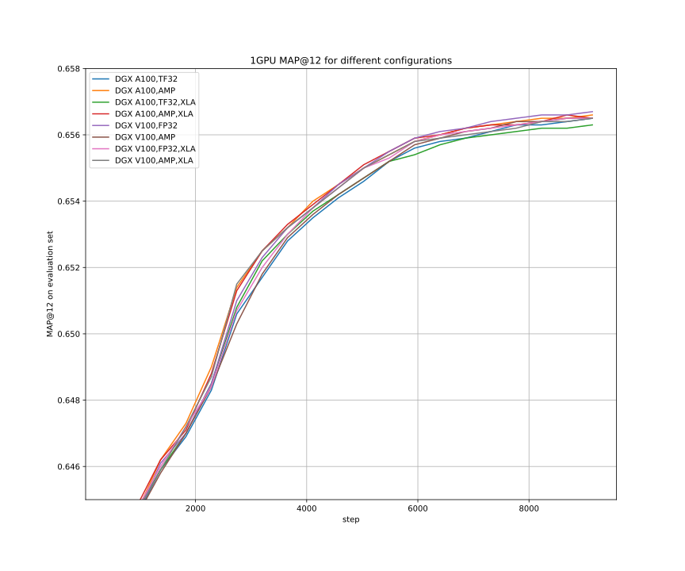
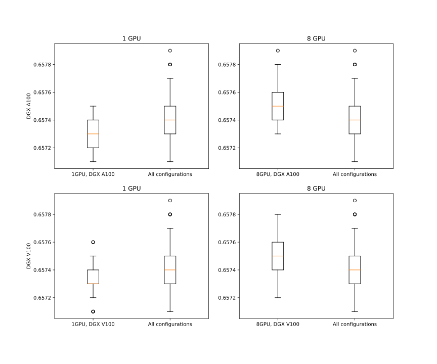
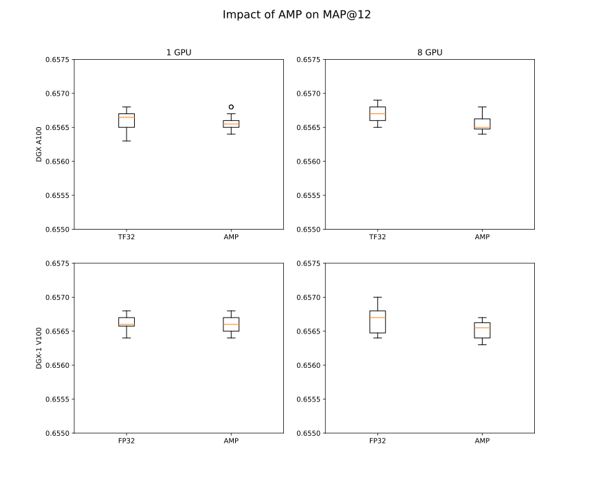

# Wide & Deep Recommender Model Training For TensorFlow 2

This repository provides a script and recipe to train the Wide & Deep Recommender model to achieve state-of-the-art accuracy.
The content of the repository is tested and maintained by NVIDIA.


- [Model overview](#model-overview)
  * [Model architecture](#model-architecture)
  * [Applications and dataset](#applications-and-dataset)
  * [Default configuration](#default-configuration)
  * [Model accuracy metric](#model-accuracy-metric)
  * [Feature support matrix](#feature-support-matrix)
    + [Features](#features)
  * [Mixed precision training](#mixed-precision-training)
    + [Enabling mixed precision](#enabling-mixed-precision)
    + [Enabling TF32](#enabling-tf32)
  * [Glossary](#glossary)
  * [BYO dataset functionality overview](#byo-dataset-functionality-overview)
    + [Glossary](#glossary)
    + [Dataset feature specification](#dataset-feature-specification)
    + [Data flow in NVIDIA Deep Learning Examples recommendation models](#data-flow-in-nvidia-deep-learning-examples-recommendation-models)
    + [Example of dataset feature specification](#example-of-dataset-feature-specification)
    + [BYO dataset functionality](#byo-dataset-functionality)  
- [Setup](#setup)
  * [Requirements](#requirements)
- [Quick Start Guide](#quick-start-guide)
- [Advanced](#advanced)
  * [Scripts and sample code](#scripts-and-sample-code)
  * [Parameters](#parameters)
  * [Command-line options](#command-line-options)
  * [Getting the data](#getting-the-data)
    + [Dataset guidelines](#dataset-guidelines)
    + [Dataset preprocessing](#dataset-preprocessing)
      - [NVTabular GPU preprocessing](#nvtabular-gpu-preprocessing)
    + [BYO dataset](#byo-dataset)
      - [Channel definitions and requirements](#channel-definitions-and-requirements)
      - [BYO dataset constraints for the model](#BYO-dataset-constraints-for-the-model)
  * [Training process](#training-process)
  * [Evaluation process](#evaluation-process)
- [Performance](#performance)
  * [Benchmarking](#benchmarking)
  * [Results](#results)
    + [Training accuracy results](#training-accuracy-results)
      - [Training accuracy: NVIDIA DGX A100 (8x A100 80GB)](#training-accuracy-nvidia-dgx-a100-8x-a100-80gb)
      - [Training accuracy: NVIDIA DGX-1 (8x V100 32GB)](#training-accuracy-nvidia-dgx-1-8x-v100-32gb)
      - [Training accuracy plots](#training-accuracy-plots)
      - [Training stability test](#training-stability-test)
      - [Impact of mixed precision on training accuracy](#impact-of-mixed-precision-on-training-accuracy)
    + [Training performance results](#training-performance-results)
      - [Training performance: NVIDIA DGX A100 (8x A100 80GB)](#training-performance-nvidia-dgx-a100-8x-a100-80gb)
      - [Training performance: NVIDIA DGX-1 (8x V100 32GB)](#training-performance-nvidia-dgx-1-8x-v100-32gb)
    + [Evaluation performance results](#evaluation-performance-results)
      - [Evaluation performance: NVIDIA DGX A100 (8x A100 80GB)](#evaluation-performance-nvidia-dgx-a100-8x-a100-80gb)
      - [Evaluation performance: NVIDIA DGX-1 (8x V100 32GB)](#evaluation-performance-nvidia-dgx-1-8x-v100-32gb)
- [Release notes](#release-notes)
  * [Changelog](#changelog)
  * [Known issues](#known-issues)


## Model overview

Recommendation systems drive engagement on many of the most popular online platforms. As the volume of data available to power these systems grows exponentially, Data Scientists are increasingly turning from more traditional machine learning methods to highly expressive deep learning models to improve the quality of their recommendations.

Google's [Wide & Deep Learning for Recommender Systems](https://arxiv.org/abs/1606.07792) has emerged as a popular model for Click Through Rate (CTR) prediction tasks thanks to its power of generalization (deep part) and memorization (wide part).
The difference between this Wide & Deep Recommender Model and the model from the paper is the size of the deep part of the model. Originally, in Google's paper, the fully connected part was three layers of 1,024, 512, and 256 neurons. Our model consists of five layers, each of 1,024 neurons.

This model is trained with mixed precision using Tensor Cores on NVIDIA Volta and NVIDIA Ampere GPU architectures. Therefore, researchers can get results 3.5 times faster than training without Tensor Cores while experiencing the benefits of mixed precision training. This model is tested against each NGC monthly container release to ensure consistent accuracy and performance over time.

### Model architecture

Wide & Deep refers to a class of networks that use the output of two parts working in parallel - wide model and deep model - to make a binary prediction of CTR. The wide model is a linear model of features together with their transforms. The deep model is a series of five  hidden MLP layers of 1,024 neurons. The model can handle both numerical continuous features as well as categorical features represented as dense embeddings. The architecture of the model is presented in Figure 1.

<p align="center">
  
  <br>
Figure 1. The architecture of the Wide & Deep model.</a>
</p>

### Applications and dataset

As a reference dataset, we used a subset of [the features engineered](https://github.com/gabrielspmoreira/kaggle_outbrain_click_prediction_google_cloud_ml_engine) by the 19th place finisher in the [Kaggle Outbrain Click Prediction Challenge](https://www.kaggle.com/c/outbrain-click-prediction/). This competition challenged competitors to predict the likelihood with which a particular ad on a website's display would be clicked on. Competitors were given information about the user, display, document, and ad in order to train their models. More information can be found [here](https://www.kaggle.com/c/outbrain-click-prediction/data).

### Default configuration

The Outbrain Dataset is preprocessed in order to get features input to the model. To give context to the acceleration numbers described below, some important properties of our features and model are as follows.

Features:
- Request Level:
    * Five scalar numeric features `dtype=float32`
    * Eight  one-hot categorical features `dtype=int32`
    * Three multi-hot categorical features `dtype=int32`
    * 11 trainable embeddings of (dimension, cardinality of categorical variable, hotness for multi-hot): \
      (128,300000), (19,4), (128,100000), (64,4000), (64,1000), (64,2500), (64,300), (64,2000), (64, 350, 3), (64, 10000, 3), (64, 100, 3)
    * 11 trainable embeddings for the wide part of size 1 (serving as an embedding from the categorical to scalar space for input to the wide portion of the model)

- Item Level:
    * Eight scalar numeric features `dtype=float32`
    * Five one-hot categorical features `dtype=int32`
    * Five trainable embeddings of  (dimension, cardinality of categorical variable): (128,250000), (64,2500), (64,4000), (64,1000), (128,5000)
    * Five trainable embeddings for the wide part of size 1 (working as trainable one-hot embeddings)

Features describe both the user (Request Level features) and Item (Item Level Features).

- Model:
    * Input dimension is 29 (16 categorical and 13 numerical features)
    * Total embedding dimension is 1235
    * Five hidden layers, each with a size of 1024
    * Total number of model parameters is ~92M
    * Output dimension is 1 (`y` is the probability of click given Request-level and Item-level features)
    * Loss function: Binary Crossentropy

For more information about feature preprocessing, go to [Dataset preprocessing](#dataset-preprocessing).

### Model accuracy metric

Model accuracy is defined with the [MAP@12](https://en.wikipedia.org/wiki/Evaluation_measures_(information_retrieval)#Mean_average_precision) metric. This metric follows the way of assessing model accuracy in the original [Kaggle Outbrain Click Prediction Challenge](https://www.kaggle.com/c/outbrain-click-prediction/). In this repository, the leaked clicked ads are not taken into account since in an industrial setup data scientists do not have access to leaked information when training the model. For more information about data leak in the Kaggle Outbrain Click Prediction challenge, visit this  [blogpost](https://medium.com/unstructured/how-feature-engineering-can-help-you-do-well-in-a-kaggle-competition-part-ii-3645d92282b8) by the 19th place finisher in that competition.

Training and evaluation script also reports Loss (BCE) values.

### Feature support matrix

This model supports the following features:

| Feature                          | Wide & Deep |
| -------------------------------- | ----------- |
| Horovod Multi-GPU (NCCL)         | Yes         |
| Accelerated Linear Algebra (XLA) | Yes         |
| Automatic mixed precision (AMP)  | Yes         |

#### Features

**Horovod** is a distributed training framework for TensorFlow, Keras, PyTorch, and MXNet. The goal of Horovod is to make distributed deep learning fast and easy to use. For more information about how to get started with Horovod, refer to : [Horovod: Official repository](https://github.com/horovod/horovod).

**Multi-GPU training with Horovod**
Our model uses Horovod to implement efficient multi-GPU training with NCCL. For details, refer to  example sources in this repository or refer to: [TensorFlow tutorial](https://github.com/horovod/horovod/#usage).

**XLA** is a domain-specific compiler for linear algebra that can accelerate TensorFlow models with potentially no source code changes. Enabling XLA results in improvements to speed and memory usage: most internal benchmarks run ~1.1-1.5x faster after XLA is enabled. For more information on XLA, visit [official XLA page](https://www.tensorflow.org/xla).

### Mixed precision training

Mixed precision is the combined use of different numerical precisions in a computational method. [Mixed precision](https://arxiv.org/abs/1710.03740) training offers significant computational speedup by performing operations in half-precision format while storing minimal information in single-precision to retain as much information as possible in critical parts of the network. Since the introduction of [Tensor Cores](https://developer.nvidia.com/tensor-cores) in Volta, and following with both the Turing and Ampere architectures, significant training speedups are experienced by switching to mixed precision -- up to 3x overall speedup on the most arithmetically intense model architectures. Using [mixed precision training](https://docs.nvidia.com/deeplearning/performance/mixed-precision-training/index.html) previously required two steps:
1.  Porting the model to use the FP16 data type where appropriate.    
2.  Adding loss scaling to preserve small gradient values.

The ability to train deep learning networks with lower precision was introduced in the Pascal architecture and first supported in [CUDA 8](https://devblogs.nvidia.com/parallelforall/tag/fp16/) in the NVIDIA Deep Learning SDK.

For more information:
* How to train using mixed precision, refer to the [Mixed Precision Training](https://arxiv.org/abs/1710.03740) paper and [Training With Mixed Precision](https://docs.nvidia.com/deeplearning/performance/mixed-precision-training/index.html) documentation.
* Techniques used for mixed precision training, refer to the [Mixed-Precision Training of Deep Neural Networks](https://devblogs.nvidia.com/mixed-precision-training-deep-neural-networks/) blog.
* How to access and enable AMP for TensorFlow, refer to [Using TF-AMP](https://docs.nvidia.com/deeplearning/dgx/tensorflow-user-guide/index.html#tfamp) from the TensorFlow User Guide.

For information on the influence of mixed precision training on model accuracy in train and inference, go to [Training accuracy results](#training-accuracy-results).

#### Enabling mixed precision

To enable Wide & Deep training to use mixed precision, add the additional flag `--amp` to the training script. Refer to the [Quick Start Guide](#quick-start-guide) for more information.

#### Enabling TF32

TensorFloat-32 (TF32) is the new math mode in NVIDIA A100 GPUs for handling tensor operations. TF32 running on Tensor Cores in A100 GPUs can provide up to 10x speedups compared to single-precision floating-point math (FP32) on Volta GPUs.

TF32 Tensor Cores can speed up networks using FP32, typically with no loss of accuracy. It is more robust than FP16 for models requiring high dynamic ranges for weights or activations.

For more information, refer to the [TensorFloat-32 in the A100 GPU Accelerates AI Training, HPC up to 20x](https://blogs.nvidia.com/blog/2020/05/14/tensorfloat-32-precision-format/) blog post.

TF32 is supported in the NVIDIA Ampere GPU architecture and is enabled by default.

### Glossary

**Request level features**
Features that describe the person and context to which we wish to make recommendations.

**Item level features**
Features that describe those objects which we are considering recommending.

### BYO dataset functionality overview

This section describes how you can train the DeepLearningExamples RecSys models on your own datasets without changing
the model or data loader and with similar performance to the one published in each repository.
This can be achieved thanks to Dataset Feature Specification, which describes how the dataset, data loader and model
interact with each other during training, inference and evaluation.
Dataset Feature Specification has a consistent format across all recommendation models in NVIDIA’s DeepLearningExamples
repository, regardless of dataset file type and the data loader,
giving you the flexibility to train RecSys models on your own datasets.

- [Glossary](#glossary)
- [Dataset Feature Specification](#dataset-feature-specification)
- [Data Flow in Recommendation Models in DeepLearning examples](#data-flow-in-nvidia-deep-learning-examples-recommendation-models)
- [Example of Dataset Feature Specification](#example-of-dataset-feature-specification)
- [BYO dataset functionality](#byo-dataset-functionality)

#### Glossary

The Dataset Feature Specification consists of three mandatory and one optional section:

<b>feature_spec </b> provides a base of features that may be referenced in other sections, along with their metadata.
	Format: dictionary (feature name) => (metadata name => metadata value)<br>

<b>source_spec </b> provides information necessary to extract features from the files that store them. 
	Format: dictionary (mapping name) => (list of chunks)<br>

* <i>Mappings</i> are used to represent different versions of the dataset (think: train/validation/test, k-fold splits). A mapping is a list of chunks.<br>
* <i>Chunks</i> are subsets of features that are grouped together for saving. For example, some formats may constrain data saved in one file to a single data type. In that case, each data type would correspond to at least one chunk. Another example where this might be used is to reduce file size and enable more parallel loading. Chunk description is a dictionary of three keys:<br>
  * <i>type</i> provides information about the format in which the data is stored. Not all formats are supported by all models.<br>
  * <i>features</i> is a list of features that are saved in a given chunk. The order of this list may matter: for some formats, it is crucial for assigning read data to the proper feature.<br>
  * <i>files</i> is a list of paths to files where the data is saved. For Feature Specification in yaml format, these paths are assumed to be relative to the yaml file’s directory (basename). <u>Order of this list matters:</u> It is assumed that rows 1 to i appear in the first file, rows i+1 to j in the next one, etc. <br>

<b>channel_spec</b> determines how features are used. It is a mapping (channel name) => (list of feature names). 

Channels are model-specific  magic constants. In general, data within a channel is processed using the same logic. Example channels: model output (labels), categorical ids, numerical inputs, user data, and item data.

<b>metadata</b> is a catch-all, wildcard section: If there is some information about the saved dataset that does not fit into the other sections, you can store it here.

#### Dataset feature specification

Data flow can be described abstractly:
Input data consists of a list of rows. Each row has the same number of columns; each column represents a feature.
The columns are retrieved from the input files, loaded, aggregated into channels, and supplied to the model/training script. 

FeatureSpec contains metadata to configure this process and can be divided into three parts:

* Specification of how data is organized on disk (source_spec). It describes which feature (from feature_spec) is stored in which file and how files are organized on disk.

* Specification of features (feature_spec). Describes a dictionary of features, where key is the feature name and values are the features’ characteristics, such as  dtype and other metadata (for example, cardinalities for categorical features)

* Specification of model’s inputs and outputs (channel_spec). Describes a dictionary of model’s inputs where keys specify model channel’s names and values specify lists of features to be loaded into that channel. Model’s channels are groups of data streams to which common model logic is applied, for example, categorical/continuous data, and user/item ids. Required/available channels depend on the model


The FeatureSpec is a common form of description regardless of underlying dataset format, dataset data loader form, and model. 


#### Data flow in NVIDIA Deep Learning Examples recommendation models

The typical data flow is as follows:
* <b>S.0.</b> Original dataset is downloaded to a specific folder.
* <b>S.1.</b> Original dataset is preprocessed into Intermediary Format. For each model, the preprocessing is done differently, using different tools. The Intermediary Format also varies (for example, for WideAndDeep TF2, the Intermediary Format is parquet)
* <b>S.2.</b> The Preprocessing Step outputs Intermediary Format with dataset split into training and validation/testing parts along with the Dataset Feature Specification yaml file. Metadata in the preprocessing step is automatically calculated.
* <b>S.3.</b> Intermediary Format data together with Dataset Feature Specification are fed into training/evaluation scripts. The data loader reads Intermediary Format and feeds the data into the model according to the description in the Dataset Feature Specification.
* <b>S.4.</b> The model is trained and evaluated


<p align="center">
  
  <br>

Fig.1. Data flow in Recommender models in NVIDIA Deep Learning Examples repository. Channels of the model are drawn in green</a>.
</p>


#### Example of dataset feature specification

For example, let’s consider a Dataset Feature Specification for a small CSV dataset for some abstract model.

```yaml
feature_spec:
  user_gender:
    dtype: torch.int8
    cardinality: 3 #M,F,Other
  user_age: #treated as numeric value
    dtype: torch.int8
  user_id:
    dtype: torch.int32
    cardinality: 2655
  item_id:
    dtype: torch.int32
    cardinality: 856
  label:
    dtype: torch.float32

source_spec:
  train:
    - type: csv
      features:
        - user_gender
        - user_age
      files:
        - train_data_0_0.csv
        - train_data_0_1.csv
    - type: csv
      features:
        - user_id
        - item_id
        - label
      files:
        - train_data_1.csv
  test:
    - type: csv
      features:
        - user_id
        - item_id
        - label
        - user_gender
        - user_age
        
      files:
        - test_data.csv

channel_spec:
  numeric_inputs: 
    - user_age
  categorical_user_inputs: 
    - user_gender
    - user_id
  categorical_item_inputs: 
    - item_id
  label_ch: 
    - label
```


The data contains five features: (user_gender, user_age, user_id, item_id, label). Their data types and necessary metadata are described in the feature specification section.

In the source mapping section, two mappings are provided: one describes the layout of the training data, and the other of the testing data. The layout for training data has been chosen arbitrarily to showcase the flexibility.
The train mapping consists of two chunks. The first one contains user_gender and user_age, saved as a CSV, and is further broken down into two files. For specifics of the layout, refer to the following example and consult the glossary. The second chunk contains the remaining columns and is saved in a single file. Notice that the order of columns is different in the second chunk - this is alright, as long as the order matches the order in that file (that is, columns in the .csv are also switched)


Let’s break down the train source mapping. The table contains example data color-paired to the files containing it.

<p align="center">

</p>


The channel spec describes how the data will be consumed. Four streams will be produced and available to the script/model.
The feature specification does not specify what happens further: names of these streams are only lookup constants defined by the model/script.
Based on this example, we can speculate that the model has three  input channels: numeric_inputs, categorical_user_inputs,
categorical_item_inputs, and one output channel: label.
Feature names are internal to the FeatureSpec and can be freely modified.


#### BYO dataset functionality

In order to train any Recommendation model in NVIDIA Deep Learning Examples, one can follow one of three possible ways:
* One delivers an already preprocessed dataset in the Intermediary Format supported by the data loader used by the training script
(different models use different data loaders) together with FeatureSpec yaml file describing at least specification of dataset, features, and model channels

* One uses a transcoding script

* One delivers a dataset in non-preprocessed form and uses preprocessing scripts that are a part of the model repository.
In order to use already existing preprocessing scripts, the format of the dataset needs to match one of the original datasets.
This way, the FeatureSpec file will be generated automatically, but the user will have the same preprocessing as in the original model repository.

## Setup
The following section lists the requirements you need to meet to start training the Wide & Deep model.

### Requirements

This repository contains Dockerfile that extends the TensorFlow2 NGC container and encapsulates some dependencies. Aside from these dependencies, ensure you have the following components:
- [NVIDIA Docker](https://github.com/NVIDIA/nvidia-docker)
- [22.03 Merlin Tensorflow Training](https://ngc.nvidia.com/catalog/containers/nvidia:merlin:merlin-tensorflow-training) NGC container

Supported GPUs:
- [NVIDIA Volta architecture](https://www.nvidia.com/en-us/data-center/volta-gpu-architecture/)
- [NVIDIA Turing architecture](https://www.nvidia.com/en-us/design-visualization/technologies/turing-architecture/)
- [NVIDIA Ampere architecture](https://www.nvidia.com/en-us/data-center/nvidia-ampere-gpu-architecture/)


For more information about how to get started with NGC containers, refer to the following sections from the NVIDIA GPU Cloud Documentation and the Deep Learning Documentation:
* [Getting Started Using NVIDIA GPU Cloud](https://docs.nvidia.com/ngc/ngc-getting-started-guide/index.html)
* [Accessing And Pulling From The NGC Container Registry](https://docs.nvidia.com/deeplearning/frameworks/user-guide/index.html#accessing_registry)
* [Running TensorFlow](https://docs.nvidia.com/deeplearning/frameworks/tensorflow-release-notes/running.html#running)

For those unable to use the TensorFlow2 NGC container, to set up the required environment or create their own container, refer to the versioned [NVIDIA Container Support Matrix](https://docs.nvidia.com/deeplearning/frameworks/support-matrix/index.html).

## Quick Start Guide

To train your model using the default parameters of the Wide & Deep model on the Outbrain dataset in TF32 or FP32 precision, perform the following steps. For the specifics concerning training and inference with custom settings, refer to  the [Advanced section](#advanced).

1. Clone the repository.
```
git clone https://github.com/NVIDIA/DeepLearningExamples
```

2. Go to the `WideAndDeep` TensorFlow2 directory within the `DeepLearningExamples` repository:
```
cd DeepLearningExamples/TensorFlow2/Recommendation/WideAndDeep
```

3. Download the Outbrain dataset.

The Outbrain dataset can be downloaded from [Kaggle](https://www.kaggle.com/c/outbrain-click-prediction/) (requires a Kaggle account). Unzip the downloaded archive into the  `orig` directory (for example, to `/raid/outbrain/orig`) and set the `HOST_OUTBRAIN_PATH` variable to the parent directory:
```
HOST_OUTBRAIN_PATH=/raid/outbrain
```

4. Build the Wide & Deep Container.
```
cd DeepLearningExamples/TensorFlow2/Recommendation/WideAndDeep
docker build . -t wd2
```

5. Preprocess the Outbrain dataset.

5.1. Start an interactive session in the Wide & Deep Container. Run preprocessing against the original Outbrain dataset to `parquets`. You can run preprocessing using NVTabular preprocessing (GPU).
```
docker run --runtime=nvidia --gpus=all --rm -it --ipc=host -v ${HOST_OUTBRAIN_PATH}:/outbrain wd2 bash
```

5.2. Start NVTabular GPU preprocessing.  For more information, go to the [Dataset preprocessing](#dataset-preprocessing) section.

```
bash scripts/preproc.sh
```

The result of preprocessing script is the NVTabular dataset stored in parquets. Files are generated in `${HOST_OUTBRAIN_PATH}/data`.

6. Train the model

6.1. Start an interactive session in the Wide & Deep Container
```
docker run --runtime=nvidia --gpus=all --rm -it --ipc=host -v ${HOST_OUTBRAIN_PATH}:/outbrain wd2 bash
```

6.2. Run training (`${GPU}` is an arbitrary number of gpu to be used)

```
horovodrun -np ${GPU} sh hvd_wrapper.sh python main.py
```

Training with Mixed Precision training with XLA:

```
horovodrun -np ${GPU} sh hvd_wrapper.sh python main.py --xla --amp
```


For complete usage, run:
```
python main.py -h
```


7. Run validation or evaluation.
If you want to run validation or evaluation, you can either:
* use the checkpoint obtained from the training commands above, or
* download the pretrained checkpoint from NGC.

In order to download the checkpoint from NGC, visit [ngc.nvidia.com](https://catalog.ngc.nvidia.com/orgs/nvidia/models/widedeep_tf2_amp_base_128k_nvtabular) website and browse the available models. Download the checkpoint files and unzip them to some path, for example, to `$HOST_OUTBRAIN_PATH/checkpoints/` (which is the default path for storing the checkpoints during training). The checkpoint requires around 700MB of disk space.

8. Start validation/evaluation.
In order to validate the checkpoint on the evaluation set, run the `main.py` script with the `--evaluate` and `--use_checkpoint` flags.

```
horovodrun -np ${GPU} sh hvd_wrapper.sh python main.py --evaluate --use_checkpoint
```

Now that you have your model trained and evaluated, you can choose to compare your training results with our [Training accuracy results](#training-accuracy-results). You can also choose to benchmark your performance to [Training and evaluation performance benchmark](#training-and-evaluation-performance-benchmark). Following the steps in these sections will ensure that you achieve the same accuracy and performance results as stated in the [Results](#results) section.

## Advanced

The following sections provide greater details of the dataset, running training, and the training results.

### Scripts and sample code

These are the important scripts in this repository:
* `main.py` - Python script for training the Wide & Deep recommender model.
* `scripts/preproc.sh` - Bash script for Outbrain dataset preparation for training, preprocessing, and saving into NVTabular format.
* `data/outbrain/dataloader.py` - Python file containing NVTabular data loaders for train and evaluation set.
* `data/outbrain/features.py` - Python file describing the request and item level features as well as embedding dimensions and hash buckets’ sizes.
* `trainer/model/widedeep.py` - Python file with model definition.
* `trainer/run.py` - Python file with training and evaluation setup.

### Parameters

These are model parameters in the `main.py` script:

| Scope| parameter| Comment| Default Value |
| -------------------- | ----------------------------------------------------- | ------------------------------------------------------------ | ------------- |
|location of datasets |--dataset_path |Dataset directory, the base for paths in feature spec |/outbrain/data |
|location of datasets |--fspec_file |Path to the feature spec file, relative to dataset_path |feature_spec.yaml |
|location of datasets |--embedding_sizes_file |Path to the file containing a dictionary of embedding sizes for categorical features |data/outbrain/embedding_sizes.json
|location of datasets|--use_checkpoint|Use checkpoint stored in model_dir path |False
|location of datasets|--model_dir MODEL_DIR|Destination where the model checkpoint will be saved |/outbrain/checkpoints
|location of datasets|--results_dir RESULTS_DIR|Directory to store training results | /results
|location of datasets|--log_filename LOG_FILENAME|Name of the file to store dlloger output |log.json|
|training parameters|--global_batch_size GLOBAL_BATCH_SIZE|Total size of training batch | 131072
|training parameters|--eval_batch_size EVAL_BATCH_SIZE|Total size of evaluation batch | 131072
|training parameters|--num_epochs NUM_EPOCHS|Number of training epochs | 20
|training parameters|--cpu|Run computations on the CPU | Currently not supported
|training parameters|--amp|Enable automatic mixed precision conversion | False
|training parameters|--xla|Enable XLA conversion | False
|training parameters|--linear_learning_rate LINEAR_LEARNING_RATE|Learning rate for linear model | 0.02
|training parameters|--deep_learning_rate DEEP_LEARNING_RATE|Learning rate for deep model | 0.00012
|training parameters|--deep_warmup_epochs DEEP_WARMUP_EPOCHS|Number of learning rate warmup epochs for deep model | 6
|model construction|--deep_hidden_units DEEP_HIDDEN_UNITS [DEEP_HIDDEN_UNITS ...]|Hidden units per layer for deep model, separated by spaces|[1024, 1024, 1024, 1024, 1024]
|model construction|--deep_dropout DEEP_DROPOUT|Dropout regularization for deep model|0.1
|model construction|--combiner {mean,sum}|Type of aggregation used for multi hot categorical features|sum
|run mode parameters|--evaluate|Only perform an evaluation on the validation dataset, don't train | False
|run mode parameters|--benchmark|Run training or evaluation benchmark to collect performance metrics | False
|run mode parameters|--benchmark_warmup_steps BENCHMARK_WARMUP_STEPS|Number of warmup steps before the start of the benchmark | 500
|run mode parameters|--benchmark_steps BENCHMARK_STEPS|Number of steps for performance benchmark | 1000
|run mode parameters|--affinity {all,single,single_unique,<br>unique_interleaved,unique_contiguous,disabled}|Type of CPU affinity | unique_interleaved


### Command-line options
To display the full list of available options and their descriptions, use the `-h` or `--help` command-line option:
```
python main.py -h
```

### Getting the data

The Outbrain dataset can be downloaded from [Kaggle](https://www.kaggle.com/c/outbrain-click-prediction/data) (requires a Kaggle account).

#### Dataset guidelines

The dataset contains a sample of users’ page views and clicks, as observed on multiple publisher sites. Viewed pages and clicked recommendations have additional semantic attributes of the documents. The dataset contains sets of content recommendations served to a specific user in a specific context. Each context (i.e., a set of recommended ads) is given a `display_id`. In each such recommendation set, the user has clicked on exactly one of the ads.

The original data is stored in several separate files:
* `page_views.csv` - log of users visiting documents (2B rows, ~100GB uncompressed)
* `clicks_train.csv` - data showing which ad was clicked in each recommendation set (87M rows)
* `clicks_test.csv` - used only for the submission in the original Kaggle contest
* `events.csv` - metadata about the context of each recommendation set (23M rows)
* `promoted_content.csv` - metadata about the ads
* `document_meta.csv`, `document_topics.csv`, `document_entities.csv`, `document_categories.csv` - metadata about the documents

During the preprocessing stage, the data is transformed into 87M rows of tabular data of 29 features. The dataset is split into training and evaluation parts that have approx 60M and approx 27M rows, respectively. Splitting into train and eval is done in this way so that a random 80% of daily events for the first 10 days of the dataset form a training set and the remaining part (20% of events daily for the first 10 days and all events in the last two days) form an evaluation set. Eventually, the dataset is saved in NVTabular parquet format.

#### Dataset preprocessing

Dataset preprocessing aims to create a total of 29 features: 16 categorical and 13 numerical. These features are obtained from the original Outbrain dataset in [NVTabular](https://nvidia-merlin.github.io/NVTabular/v0.7.1/Introduction.html) preprocessing.

##### NVTabular GPU preprocessing

The NVTabular dataset is preprocessed using the script provided in `data/outbrain/nvtabular`. The workflow consists of:
* separating out the validation set for cross-validation
* filling missing data with the mode, median, or imputed values most frequent value
* joining click data, ad metadata, and document category, topic, and entity tables to create an enriched table.joining the  tables for the ad clicks data
* computing  seven click-through rates (CTR) for ads grouped by seven features in different contexts
* computing attribute cosine similarity between the landing page and ad to be featured on the page features of the clicked ads and the viewed ads
* extracting multi-hot categorical values
* math transformations of the numeric features (logarithmic, normalization)
* categorifying data using hash-bucketing
* storing the result in a Parquet format

Most of the code describing operations in this workflow is in `data/outbrain/nvtabular/utils/workflow.py` and leverage NVTabular v0.7.1. As stated in its repository, [NVTabular](https://github.com/NVIDIA/NVTabular), a component of [NVIDIA Merlin Open Beta](https://developer.nvidia.com/nvidia-merlin), is a feature engineering and preprocessing library for tabular data that is designed to quickly and easily manipulate terabyte-scale datasets and train deep learning based recommender systems. It provides a high-level abstraction to simplify code and accelerates computation on the GPU using the [RAPIDS Dask-cuDF](https://github.com/rapidsai/cudf/tree/main/python/dask_cudf) library.
The NVTabular Outbrain workflow has been successfully tested on DGX-1 V100 and DGX A100 for single and multi GPU preprocessing.

For more information about NVTabular, refer to the [NVTabular documentation](https://github.com/NVIDIA/NVTabular).

#### BYO dataset
This implementation supports using other datasets thanks to BYO dataset functionality. 
The BYO dataset functionality allows users to plug in their dataset in a common fashion for all Recommender models 
that support this functionality. Using BYO dataset functionality, the user does not have to modify the source code of 
the model thanks to the Feature Specification file. For general information on how the BYO dataset works, refer to the 
[BYO dataset overview section](#byo-dataset-functionality-overview).

There are three ways to plug in the user's dataset:
<details>
<summary><b>1. Provide an unprocessed dataset in a format matching the one used by Outbrain, then use the preprocessing for Outbrain. Feature Specification file is then generated automatically.</b></summary>
The required format of the user's dataset is described [above](#dataset-guidelines)

The correct processed dataset files, together with the Feature Specification yaml file, will be generated automatically by preprocessing script.

A configuration file specifying default embedding sizes for the outbrain dataset is available at data/outbrain/embedding_sizes.json.

For an example of using this process, refer to the [Quick Start Guide](#quick-start-guide)

</details>

<details>
<summary><b>2. Provide a CSV containing preprocessed data and a simplified Feature Specification yaml file, then transcode the data with `transcode.py` script </b> </summary>
This option should be used if the user has their own CSV file with a preprocessed dataset they want to train on.

The required format of the user's dataset is:
* CSV files containing the data, already split into train and test sets. 
* Feature Specification yaml file describing the layout of the CSV data

For an example of a feature specification file, refer to the `tests/feature_specs` folder.

The CSV containing the data:
* should be already split into train and test
* should contain no header
* should contain one column per feature, in the order specified by the list of features for that chunk 
  in the source_spec section of the feature specification file
* one-hot categorical features should be non-negative integers in the range [0,cardinality-1] if cardinality is specified
* numerical features should be lists of non-negative integers in the range [0, cardinality-1] if cardinality is specified
The Feature Specification yaml file:
* needs to describe the layout of data in CSV files
* must contain information about cardinalities for categorical features.

The following example shows how to use this way of plugging the user's dataset:

Prepare your data and save the path:
```bash
DATASET_PARENT_DIRECTORY=/raid/wd2
```

Build the Wide & Deep image with:
```bash
docker build . -t wd2
```
Launch the container with:
```bash
docker run --runtime=nvidia --gpus=all --rm -it --ipc=host -v ${DATASET_PARENT_DIRECTORY}:/outbrain wd2 bash
```

If you are just testing the process, you can create synthetic csv data:

select or write a feature specification file:
```bash
cp tests/feature_specs/fspec_csv.yaml /outbrain/feature_spec.yaml
```

```bash
python gen_csv.py --feature_spec_in /outbrain/feature_spec.yaml --output /outbrain --size 393216
```

Convert the data:
```bash
mkdir /outbrain/data
python transcode.py --input /outbrain --output /outbrain/data --chunk_size 16384 # to get 8 partitions out of 131072 rows
```
You may need to tune the --chunk_size parameter. Higher values speed up the conversion but require more RAM.

This will convert the data from `/outbrain` and save the output in `/outbrain/data`.
A feature specification file describing the new data will be automatically generated.

If you are using a different dataset than Outbrain, you need to specify the embedding sizes to use for each categorical feature.
Please refer to data/outbrain/embedding_sizes.json for an example or generate random sizes with gen_embedding_sizes.py.
Specify the location using the --embedding_sizes_file flag.
````bash
export EMBEDDING_SIZES_FILE="data/outbrain/embedding_sizes.json"
````

If your dataset does not contain a MAP aggregation channel (refer to [details](#channel-definitions-and-requirements)),
use the --disable_map_calculation flag to enable compatibility.
To run the training on one GPU:
```bash
horovodrun -np 1 sh hvd_wrapper.sh python main.py --dataset_path /outbrain/data --disable_map_calculation --embedding_sizes_file ${EMBEDDING_SIZES_FILE}
```

- multi-GPU:
```bash
horovodrun -np 8 sh hvd_wrapper.sh python main.py --dataset_path /outbrain/data --disable_map_calculation --embedding_sizes_file ${EMBEDDING_SIZES_FILE}
```

</details>
<details>
<summary><b>3. Provide a fully preprocessed dataset, saved in parquet files, and a Feature Specification yaml file</b></summary>
This is the option to choose if you want full control over preprocessing and/or want to preprocess data directly to the target format.

Your final output must contain a Feature Specification yaml describing data and file layout. 
For an example feature specification file, refer to the file resulting from Outbrain preprocessing or the files in tests/feature_specs.

For details, refer to the [BYO dataset overview section](#byo-dataset-functionality-overview).
</details>


##### Channel definitions and requirements

This model defines three channels:

- multihot_categorical, accepting an arbitrary number of features
- onehot_categorical, accepting an arbitrary number of features
- numerical, accepting an arbitrary number of features
- label, accepting a single feature
- map, accepting zero or one feature


The training script expects two mappings:

- train
- test

For performance reasons:
* The only supported dataset type is parquet. CSV is supported through transcoding.
* Each chunk must contain at least as many parts as there are workers.
* Only integer types are supported for categorical features
* Only floating point types are supported for numerical features

The  MAP channel is optional. If present, it is expected to be provided only for the test mapping.
Rows with common values are aggregated into a list, and MAP@12 is calculated during evaluation.
Please note that the MAP implementation used in this repository may not be correct for datasets other than Outbrain preprocessed with the included script.

##### BYO dataset constraints for the model

There are the following constraints of BYO dataset functionality for this model:
1. The performance of the model depends on the dataset size. Generally, the model should scale better for datasets containing more data points.
   For a smaller dataset, you might experience smaller performance improvements than those reported for Outbrain
2. Using other datasets might require tuning some hyperparameters (for example, learning rate, beta1, and beta2) to reach the desired accuracy.

### Training process

The training can be started by running the `main.py` script. By default, the script is in train mode. Other training-related configs are also present in the `trainer/utils/arguments.py` and can be seen using the command `python main.py -h`. Training happens with a NVTabular data loader on a NVTabular training dataset files specified by feature spec.  Training is run for `--num_epochs` epochs with a global batch size of `--global_batch_size` in strong scaling mode (i.e., the effective batch size per GPU equals `global_batch_size/gpu_count`).

The model:
`tf.keras.experimental.WideDeepModel` consists of a wide part and deep part with a sigmoid activation in the output layer (refer to [Figure 1](#model-architecture)) for reference and `trainer/model/widedeep.py` for model definition).

During training (default configuration):
Two separate optimizers are used to optimize the wide and the deep part of the network:
* FTLR (Follow the Regularized Leader) optimizer is used to optimize the wide part of the network.
* RMSProp optimizer is used to optimize the deep part of the network.

Checkpoint of the model:
* Can be loaded at the beginning of training when `--use_checkpoint` is set.
* is saved into `--model_dir` after each training epoch. Only the last checkpoint is kept.
* Contains information about the number of training epochs.

The model is evaluated on an evaluation dataset after every training epoch training log is displayed in the console and stored in  `--log_filename`.

Every 100 batches with training metrics: bce loss

Every epoch after training, evaluation metrics are logged: bce loss and MAP@12 value.

### Evaluation process

The evaluation can be started by running the `main.py --evaluation` script. Evaluation is done on the NVTabular parquet dataset specified by feature spec. Other evaluation-related configs are also present in the `trainer/utils/arguments.py` and can be seen using the command `python main.py -h`.

During evaluation (`--evaluation` flag):
* Model is restored from a checkpoint in `--model_dir` if `--use_checkpoint` is set.
* Evaluation log is displayed in the console and stored in  `--log_filename`.
* Every 100 batches, evaluation metrics are logged: bce loss.

After the whole evaluation, the total evaluation metrics are logged: bce loss and MAP@12 value.

## Performance

### Benchmarking

The following section shows how to run benchmarks measuring the model performance in training mode.

#### Training and evaluation performance benchmark

A benchmark script is prepared to measure the performance of the model during training (default configuration) and evaluation (`--evaluation`). Benchmark runs training or evaluation for `--benchmark_steps` batches; however measurement of performance starts after `--benchmark_warmup_steps`. A benchmark can be run for single and 8 GPUs and with a combination of XLA (`--xla`), AMP (`--amp`), batch sizes (`--global_batch_size` , `--eval_batch_size`), and affinity (`--affinity`).

To run a benchmark, follow these steps:

Run Wide & Deep Container (`${HOST_OUTBRAIN_PATH}` is the path with Outbrain dataset):
```
docker run --runtime=nvidia --gpus=all --rm -it --ipc=host -v ${HOST_OUTBRAIN_PATH}:/outbrain wd2 bash
```
Run the benchmark script:
```
horovodrun -np ${GPU} sh hvd_wrapper.sh python main.py --benchmark
```

### Results

The following sections provide details on how we achieved our performance and accuracy in training.

#### Training accuracy results

##### Training accuracy: NVIDIA DGX A100 (8x A100 80GB)

Our results were obtained by running the `main.py` training script in the TensorFlow2 NGC container on NVIDIA DGX A100 with (8x A100 80GB) GPUs.

| GPUs | Batch size / GPU | XLA | Accuracy - TF32 (MAP@12) | Accuracy - mixed precision (MAP@12) | Time to train - TF32 (minutes) | Time to train - mixed precision (minutes) | Time to train speedup (TF32 to mixed precision) |
| --- | ---------------- | ---- | -------------- | -------------- | ------- | ------- | ------- |
| 1   | 131072           | Yes  | 0.65729        | 0.65732        | 17.33   | 13.37   | 1.30    |
| 1   | 131072           | No   | 0.65732        | 0.65730        | 21.90   | 17.55   | 1.25    |
| 8   | 16384            | Yes  | 0.65748        | 0.65754        | 6.78    | 6.53    | 1.04    |
| 8   | 16384            | No   | 0.65748        | 0.65750        | 8.38    | 8.28    | 1.01    |

To achieve the same results, follow the steps in the [Quick Start Guide](#quick-start-guide).

##### Training accuracy: NVIDIA DGX-1 (8x V100 32GB)

Our results were obtained by running the main.py training script in the TensorFlow2 NGC container on NVIDIA DGX-1 with (8x V100 32GB) GPUs.


| GPUs | Batch size / GPU | XLA | Accuracy - FP32 (MAP@12) | Accuracy - mixed precision (MAP@12) | Time to train - FP32 (minutes) | Time to train - mixed precision (minutes) | Time to train speedup (FP32 to mixed precision) |
| --- | ---------------- | ---- | -------------- | -------------- | ------- | ------- | ------- |
| 1   | 131072           | Yes  | 0.65726        | 0.65732        | 72.02   | 24.80   | 2.90    |
| 1   | 131072           | No   | 0.65732        | 0.65733        | 79.47   | 31.50   | 2.52    |
| 8   | 16384            | Yes  | 0.65744        | 0.65752        | 15.95   | 10.32   | 1.55    |
| 8   | 16384            | No   | 0.65746        | 0.65756        | 18.52   | 12.87   | 1.44    |


To achieve the same results, follow the steps in the [Quick Start Guide](#quick-start-guide).

##### Training accuracy plots

Models trained with FP32, TF32, and Automatic Mixed Precision (AMP), with and without XLA enabled achieve similar accuracy.

The plot represents MAP@12 in a function of steps (step is single batch) during training for default precision (FP32 for Volta architecture (DGX-1) and TF32 for Ampere GPU architecture (DGX-A100)) and AMP  for XLA and without it for NVTabular dataset. All other parameters of training are default.

<p align="center">
  
  <br>
  Figure 2. Learning curves for different configurations on single gpu.</a>
</p>

##### Training stability test

Training of the model is stable for multiple configurations achieving the standard deviation of 10e-4. The model achieves similar MAP@12 scores for A100 and V100, training precisions, XLA usage, and single/multi GPU. The Wide & Deep model was trained for 9140 training steps (20 epochs, 457 batches in each epoch, every batch containing 131072), starting from 20 different initial random seeds for each setup. The training was performed in the 22.03 Merlin Tensorflow Training NGC container on NVIDIA DGX A100 80GB, and DGX-1 32GB machines with and without mixed precision enabled, with and without XLA enabled for NVTabular generated dataset. The provided charts and numbers consider single and eight  GPU training. After training, the models were evaluated on the validation set. The following plots compare distributions of MAP@12 on the evaluation set. In columns, there is single vs. eight  GPU training in rows DGX A100 and DGX-1 V100.

<p align="center">
  
  <br>
  Figure 3. Training stability plot, distribution of MAP@12 across different configurations. 'All configurations' refer to the distribution of MAP@12 for cartesian product of architecture, training precision, XLA usage, single/multi GPU. </a>
</p>


Training stability was also compared in terms of point statistics for MAP@12 distribution for multiple configurations. Refer to the expandable table below.

<details>
<summary>Full tabular data for training stability tests</summary>

|  | GPUs | Precision | XLA | Mean | Std | Min | Max |
| ---------- | --- | ----- | ---- | -------------- | -------------- | ------------- | ------------- |
| DGX A100   | 1   | TF32  | Yes  | 0.65729        | 0.00013        | 0.6571        | 0.6576        |
| DGX A100   | 1   | TF32  | No   | 0.65732        | 0.00011        | 0.6571        | 0.6575        |
| DGX A100   | 1   | AMP   | Yes  | 0.65732        | 0.00010        | 0.6572        | 0.6575        |
| DGX A100   | 1   | AMP   | No   | 0.65730        | 0.00014        | 0.6570        | 0.6576        |
| DGX A100   | 8   | TF32  | Yes  | 0.65748        | 0.00014        | 0.6573        | 0.6577        |
| DGX A100   | 8   | TF32  | No   | 0.65748        | 0.00012        | 0.6572        | 0.6576        |
| DGX A100   | 8   | AMP   | Yes  | 0.65754        | 0.00012        | 0.6573        | 0.6578        |
| DGX A100   | 8   | AMP   | No   | 0.65750        | 0.00015        | 0.6572        | 0.6578        |
| DGX-1 V100 | 1   | FP32  | Yes  | 0.65726        | 0.00011        | 0.6570        | 0.6574        |
| DGX-1 V100 | 1   | FP32  | No   | 0.65732        | 0.00013        | 0.6571        | 0.6575        |
| DGX-1 V100 | 1   | AMP   | Yes  | 0.65732        | 0.00006        | 0.6572        | 0.6574        |
| DGX-1 V100 | 1   | AMP   | No   | 0.65733        | 0.00010        | 0.6572        | 0.6575        |
| DGX-1 V100 | 8   | FP32  | Yes  | 0.65744        | 0.00014        | 0.6573        | 0.6578        |
| DGX-1 V100 | 8   | FP32  | No   | 0.65746        | 0.00011        | 0.6572        | 0.6576        |
| DGX-1 V100 | 8   | AMP   | Yes  | 0.65752        | 0.00016        | 0.6573        | 0.6578        |
| DGX-1 V100 | 8   | AMP   | No   | 0.65756        | 0.00013        | 0.6573        | 0.6578        |
</details>


##### Impact of mixed precision on training accuracy

The accuracy of training, measured with [MAP@12](https://en.wikipedia.org/wiki/Evaluation_measures_(information_retrieval)#Mean_average_precision) on the evaluation set after the final epoch metric was not impacted by enabling mixed precision. The obtained results were statistically similar. The similarity was measured according to the following procedure:

The model was trained 20 times for default settings (FP32 or TF32 for NVIDIA Volta and NVIDIA Ampere architecture, respectively) and 20 times for AMP. After the last epoch, the accuracy score MAP@12 was calculated on the evaluation set.

Distributions for four configurations: architecture (A100, V100) and single/multi GPU for the NVTabular dataset are presented below.

<p align="center">
  
  <br>
  Figure 4. Influence of AMP on MAP@12 distribution for DGX A100 and DGX-1 V100 for single and multi GPU training. </a>
</p>

Distribution scores for full precision training and AMP training were compared in terms of mean, variance, and [Kolmogorov–Smirnov test](https://en.wikipedia.org/wiki/Kolmogorov%E2%80%93Smirnov_test) to state statistical difference between full precision and AMP results. Refer to the expandable table below.

<details>
<summary>Full tabular data for AMP influence on MAP@12</summary>

|  | GPUs | XLA | Mean MAP@12 for Full precision (TF32 for A100, FP32 for V100) | Std MAP@12 for Full precision (TF32 for A100, FP32 for V100) | Mean MAP@12 for AMP | Std MAP@12 for AMP | KS test value: statistics, p-value |
| ---------- | --- | ---- | -------------- | -------------- | -------------- | -------------- | ------------------------- |
| DGX A100   | 1   | Yes  | 0.65729        | 0.00013        | 0.65732        | 0.00010        | 0.15000 (0.98314)         |
| DGX A100   | 8   | Yes  | 0.65748        | 0.00014        | 0.65754        | 0.00012        | 0.20000 (0.83197)         |
| DGX A100   | 1   | No   | 0.65732        | 0.00011        | 0.65730        | 0.00014        | 0.10000 (0.99999)         |
| DGX A100   | 8   | No   | 0.65748        | 0.00012        | 0.65750        | 0.00015        | 0.15000 (0.98314)         |
| DGX-1 V100 | 1   | Yes  | 0.65726        | 0.00011        | 0.65732        | 0.00006        | 0.40000 (0.08106)         |
| DGX-1 V100 | 8   | Yes  | 0.65744        | 0.00014        | 0.65752        | 0.00016        | 0.20000 (0.83197)         |
| DGX-1 V100 | 1   | No   | 0.65732        | 0.00013        | 0.65733        | 0.00010        | 0.10000 (0.99999)         |
| DGX-1 V100 | 8   | No   | 0.65746        | 0.00011        | 0.65756        | 0.00013        | 0.30000 (0.33559)         |
</details>

#### Training performance results

##### Training performance: NVIDIA DGX A100 (8x A100 80GB)

Our results were obtained by running the benchmark script (`main.py --benchmark`) in the TensorFlow2 NGC container on NVIDIA DGX A100 with (8x A100 80GB) GPUs. 

| GPUs | Batch size / GPU | XLA | Throughput - TF32 (samples/s) | Throughput - mixed precision (samples/s) | Throughput speedup (TF32 - mixed precision) | Strong scaling - TF32 | Strong scaling - mixed precision |
| --- | ---------------- | ---- | -------------- | -------------- | ------- | ------- | ------- |
| 1   | 131072           | Yes  | 1640579.8      | 2312149.2      | 1.41    | 1.00    | 1.00    |
| 1   | 131072           | No   | 1188653.48     | 1569403.04     | 1.32    | 1.00    | 1.00    |
| 8   | 16384            | Yes  | 5369859.03     | 5742941.1      | 1.07    | 3.27    | 2.48    |
| 8   | 16384            | No   | 3767868.65     | 3759027.04     | 1.00    | 3.17    | 2.40    |


##### Training performance: NVIDIA DGX-1 (8x V100 32GB)

Our results were obtained by running the benchmark script (`main.py --benchmark`) in the TensorFlow2 NGC container on NVIDIA DGX-1 with (8x V100 32GB) GPUs.

| GPUs | Batch size / GPU | XLA | Throughput - FP32 (samples/s) | Throughput - mixed precision (samples/s) | Throughput speedup (FP32 - mixed precision) | Strong scaling - FP32 | Strong scaling - mixed precision |
| --- | ---------------- | ---- | -------------- | -------------- | ------- | ------- | ------- |
| 1   | 131072           | Yes  | 346096.2       | 1102253.52     | 3.18    | 1.00    | 1.00    |
| 1   | 131072           | No   | 292483.81      | 822245.68      | 2.81    | 1.00    | 1.00    |
| 8   | 16384            | Yes  | 1925045.33     | 3536706.63     | 1.84    | 5.56    | 3.21    |
| 8   | 16384            | No   | 1512064.59       | 2434945.55     | 1.61   | 5.17    | 2.96    |


#### Evaluation performance results

##### Evaluation performance: NVIDIA DGX A100 (8x A100 80GB)

Our results were obtained by running the benchmark script (`main.py --evaluate --benchmark`) in the TensorFlow2 NGC container on NVIDIA DGX A100 with 8x A100 80GB GPUs. 


| GPUs | Batch size / GPU | XLA | Throughput [samples/s] TF32 | Throughput [samples/s] AMP | Throughput speedup AMP to TF32 |
| --- | ---------------- | ---- | -------------- | -------------- | ------- |
| 1   | 4096             | No   | 594773         | 556904         | 0.94    |
| 1   | 8192             | No   | 932078         | 919439         | 0.99    |
| 1   | 16384            | No   | 1351977        | 1411866        | 1.04    |
| 1   | 32768            | No   | 1790851        | 1794104        | 1.00    |
| 1   | 65536            | No   | 2101918        | 2263452        | 1.08    |
| 1   | 131072           | No   | 2339848        | 2593955        | 1.11    |
| 8   | 4096             | No   | 4199683        | 3668578        | 0.87    |
| 8   | 8192             | No   | 6752332        | 6432023        | 0.95    |
| 8   | 16384            | No   | 10070663       | 9524331        | 0.95    |
| 8   | 32768            | No   | 13331928       | 13020697       | 0.98    |
| 8   | 65536            | No   | 16155221       | 17072460       | 1.06    |

For more results go to the expandable table below.

<details>
<summary>Full tabular data for evaluation performance results for DGX A100</summary>

| GPUs | Batch size / GPU | XLA | Throughput [samples/s] TF32 | Throughput [samples/s] AMP | Throughput speedup AMP to TF32 |
| --- | ---------------- | ---- | -------------- | -------------- | ------- |
| 1   | 4096             | Yes  | 623864         | 634058         | 1.02    |
| 1   | 4096             | No   | 594773         | 556904         | 0.94    |
| 1   | 8192             | Yes  | 998192         | 1087416        | 1.09    |
| 1   | 8192             | No   | 932078         | 919439         | 0.99    |
| 1   | 16384            | Yes  | 1491678        | 1617472        | 1.08    |
| 1   | 16384            | No   | 1351977        | 1411866        | 1.04    |
| 1   | 32768            | Yes  | 1905881        | 2122617        | 1.11    |
| 1   | 32768            | No   | 1790851        | 1794104        | 1.00    |
| 1   | 65536            | Yes  | 2174949        | 2499589        | 1.15    |
| 1   | 65536            | No   | 2101918        | 2263452        | 1.08    |
| 1   | 131072           | Yes  | 2493062        | 2852853        | 1.14    |
| 1   | 131072           | No   | 2339848        | 2593955        | 1.11    |
| 8   | 4096             | Yes  | 4669465        | 4428405        | 0.95    |
| 8   | 4096             | No   | 4199683        | 3668578        | 0.87    |
| 8   | 8192             | Yes  | 7384089        | 7889794        | 1.07    |
| 8   | 8192             | No   | 6752332        | 6432023        | 0.95    |
| 8   | 16384            | Yes  | 10275441       | 11451138       | 1.11    |
| 8   | 16384            | No   | 10070663       | 9524331        | 0.95    |
| 8   | 32768            | Yes  | 13824087       | 15391478       | 1.11    |
| 8   | 32768            | No   | 13331928       | 13020697       | 0.98    |
| 8   | 65536            | Yes  | 17042737       | 19360812       | 1.14    |
| 8   | 65536            | No   | 16155221       | 17072460       | 1.06    |
 </details>


##### Evaluation performance: NVIDIA DGX-1 (8x V100 32GB)

Our results were obtained by running the benchmark script (`main.py --evaluate --benchmark`) in the TensorFlow2 NGC container on NVIDIA DGX-1 with (8x V100 32GB) GPUs.

| GPUs | Batch size / GPU | XLA | Throughput [samples/s] FP32 | Throughput [samples/s] AMP | Throughput speedup AMP to FP32 |
| --- | ---------------- | ---- | -------------- | -------------- | ------- |
| 1   | 4096             | No   | 294901         | 337261         | 1.14    |
| 1   | 8192             | No   | 431930         | 572204         | 1.32    |
| 1   | 16384            | No   | 569286         | 917686         | 1.61    |
| 1   | 32768            | No   | 691413         | 1211847        | 1.75    |
| 1   | 65536            | No   | 358787         | 1496022        | 4.17    |
| 1   | 131072           | No   | 786631         | 1643277        | 2.09    |
| 8   | 4096             | No   | 2115851        | 2288038        | 1.08    |
| 8   | 8192             | No   | 3226710        | 4223243        | 1.31    |
| 8   | 16384            | No   | 4297536        | 6336813        | 1.47    |
| 8   | 32768            | No   | 5098699        | 8376428        | 1.64    |
| 8   | 65536            | No   | 5310861        | 10377358       | 1.95    |


For more results go to the expandable table below.

<details>
<summary>Full tabular data for evaluation performance for DGX-1 V100 results</summary>

| GPUs | Batch size / GPU | XLA | Throughput [samples/s] FP32 | Throughput [samples/s] AMP | Throughput speedup AMP to FP32 |
| --- | ---------------- | ---- | -------------- | -------------- | ------- |
| 1   | 4096             | Yes  | 328428         | 376256         | 1.15    |
| 1   | 4096             | No   | 294901         | 337261         | 1.14    |
| 1   | 8192             | Yes  | 456681         | 677375         | 1.48    |
| 1   | 8192             | No   | 431930         | 572204         | 1.32    |
| 1   | 16384            | Yes  | 611507         | 965721         | 1.58    |
| 1   | 16384            | No   | 569286         | 917686         | 1.61    |
| 1   | 32768            | Yes  | 736865         | 1345174        | 1.83    |
| 1   | 32768            | No   | 691413         | 1211847        | 1.75    |
| 1   | 65536            | Yes  | 781260         | 1639521        | 2.10    |
| 1   | 65536            | No   | 358787         | 1496022        | 4.17    |
| 1   | 131072           | Yes  | 428574         | 1809550        | 4.22    |
| 1   | 131072           | No   | 786631         | 1643277        | 2.09    |
| 8   | 4096             | Yes  | 2368194        | 2750484        | 1.16    |
| 8   | 4096             | No   | 2115851        | 2288038        | 1.08    |
| 8   | 8192             | Yes  | 3470386        | 4697888        | 1.35    |
| 8   | 8192             | No   | 3226710        | 4223243        | 1.31    |
| 8   | 16384            | Yes  | 4492971        | 7004571        | 1.56    |
| 8   | 16384            | No   | 4297536        | 6336813        | 1.47    |
| 8   | 32768            | Yes  | 5257105        | 8916683        | 1.70    |
| 8   | 32768            | No   | 5098699        | 8376428        | 1.64    |
| 8   | 65536            | Yes  | 5564338        | 11622879       | 2.09    |
| 8   | 65536            | No   | 5310861        | 10377358       | 1.95    |
 </details>

## Release notes

### Changelog

June 2022
- Added support for BYO Dataset

May 2022
- Added multi-hot categorical features
- Added triton inference
- Updated model architecture figure
- Updated NVTabular to v0.7.1
- Updated readme numbers

November 2021
- Refresh release with performance optimizations
- Updated NVTabular to v0.6.1
- Replaced native TF dataloader with NVTabular counterpart
- Removed spark CPU preprocessing
- Updated readme numbers
- Changed V100 cards from 16GB to 32GB

February 2021
- Initial release

### Known issues
* In this model the TF32 precision can in some cases be as fast as the FP16 precision on Ampere GPUs. This is because TF32 also uses Tensor Cores and doesn't need any additional logic such as maintaining FP32 master weights and casts. However, please note that W&D is, by modern recommender standards, a very small model. Larger models should still have significant benefits of using FP16 math.
