# Deploying the Wide & Deep model on Triton Inference Server

This folder contains instructions for deployment to run inference
on Triton Inference Server as well as a detailed performance analysis.
The purpose of this document is to help you with achieving
the best inference performance.

## Table of contents
  - [Solution overview](#solution-overview)
    - [Introduction](#introduction)
    - [Deployment process](#deployment-process)
  - [Setup](#setup)
  - [Quick Start Guide](#quick-start-guide)
  - [Performance](#performance)
    - [Offline scenario](#offline-scenario)
        - [Offline: NVIDIA A30, TensorFlow with FP32](#offline-nvidia-a30-tensorflow-with-fp32)
        - [Offline: NVIDIA A30, NVIDIA TensorRT with FP16](#offline-nvidia-a30-nvidia-tensorrt-with-fp16)
        - [Offline: NVIDIA DGX-1 (1x V100 32GB), TensorFlow with FP32](#offline-nvidia-dgx-1-1x-v100-32gb-tensorflow-with-fp32)
        - [Offline: NVIDIA DGX-1 (1x V100 32GB), NVIDIA TensorRT with FP16](#offline-nvidia-dgx-1-1x-v100-32gb-nvidia-tensorrt-with-fp16)
        - [Offline: NVIDIA DGX A100 (1x A100 80GB), TensorFlow with FP32](#offline-nvidia-dgx-a100-1x-a100-80gb-tensorflow-with-fp32)
        - [Offline: NVIDIA DGX A100 (1x A100 80GB), NVIDIA TensorRT with FP16](#offline-nvidia-dgx-a100-1x-a100-80gb-nvidia-tensorrt-with-fp16)
        - [Offline: NVIDIA T4, TensorFlow with FP32](#offline-nvidia-t4-tensorflow-with-fp32)
        - [Offline: NVIDIA T4, NVIDIA TensorRT with FP16](#offline-nvidia-t4-nvidia-tensorrt-with-fp16)
    - [Online scenario](#online-scenario)
        - [Online: NVIDIA A30, TensorFlow with FP32](#online-nvidia-a30-tensorflow-with-fp32)
        - [Online: NVIDIA A30, NVIDIA TensorRT with FP16](#online-nvidia-a30-nvidia-tensorrt-with-fp16)
        - [Online: NVIDIA DGX-1 (1x V100 32GB), TensorFlow with FP32](#online-nvidia-dgx-1-1x-v100-32gb-tensorflow-with-fp32)
        - [Online: NVIDIA DGX-1 (1x V100 32GB), NVIDIA TensorRT with FP16](#online-nvidia-dgx-1-1x-v100-32gb-nvidia-tensorrt-with-fp16)
        - [Online: NVIDIA DGX A100 (1x A100 80GB), TensorFlow with FP32](#online-nvidia-dgx-a100-1x-a100-80gb-tensorflow-with-fp32)
        - [Online: NVIDIA DGX A100 (1x A100 80GB), NVIDIA TensorRT with FP16](#online-nvidia-dgx-a100-1x-a100-80gb-nvidia-tensorrt-with-fp16)
        - [Online: NVIDIA T4, TensorFlow with FP32](#online-nvidia-t4-tensorflow-with-fp32)
        - [Online: NVIDIA T4, NVIDIA TensorRT with FP16](#online-nvidia-t4-nvidia-tensorrt-with-fp16)
  - [Advanced](#advanced)
    - [Step by step deployment process](#step-by-step-deployment-process)
    - [Latency explanation](#latency-explanation)
  - [Release notes](#release-notes)
    - [Changelog](#changelog)
    - [Known issues](#known-issues)


## Solution overview
### Introduction
The [NVIDIA Triton Inference Server](https://github.com/NVIDIA/triton-inference-server)
provides a datacenter and cloud inferencing solution optimized for NVIDIA GPUs.
The server provides an inference service via an HTTP or gRPC endpoint,
allowing remote clients to request inferencing for any number of GPU
or CPU models being managed by the server.

This README provides step-by-step deployment instructions for models generated
during training (as described in the [model README](../README.md)).
Additionally, this README provides the corresponding deployment scripts that
ensure optimal GPU utilization during inferencing on Triton Inference Server.

### Deployment process

The deployment process consists of two steps:

1. Conversion.

   The purpose of conversion is to find the best performing model
   format supported by Triton Inference Server.
   Triton Inference Server uses a number of runtime backends such as
   [TensorRT](https://developer.nvidia.com/tensorrt),
   [LibTorch](https://github.com/triton-inference-server/pytorch_backend) and 
   [ONNX Runtime](https://github.com/triton-inference-server/onnxruntime_backend)
   to support various model types. Refer to the
   [Triton documentation](https://github.com/triton-inference-server/backend#where-can-i-find-all-the-backends-that-are-available-for-triton)
   for a list of available backends.

2. Configuration.

   Model configuration on Triton Inference Server, which generates
   necessary [configuration files](https://github.com/triton-inference-server/server/blob/master/docs/model_configuration.md).

After deployment, Triton inference server is used for evaluation of converted model in two steps:

1. Correctness tests.

   Produce results which are tested against given correctness thresholds.

2. Performance tests.

   Produce latency and throughput results for offline (static batching)
   and online (dynamic batching) scenarios.


All steps are executed by provided runner script. Refer to [Quick Start Guide](#quick-start-guide)


## Setup
Ensure you have the following components:
* [NVIDIA Docker](https://github.com/NVIDIA/nvidia-docker)
* [NVIDIA TensorFlow NGC container 22.02](https://catalog.ngc.nvidia.com/orgs/nvidia/containers/tensorflow)
* [NVIDIA Triton Inference Server NGC container 22.02](https://ngc.nvidia.com/catalog/containers/nvidia:tritonserver)
* [NVIDIA CUDA](https://docs.nvidia.com/cuda/archive//index.html)
* [NVIDIA Ampere](https://www.nvidia.com/en-us/data-center/nvidia-ampere-gpu-architecture/), [Volta](https://www.nvidia.com/en-us/data-center/volta-gpu-architecture/) or [Turing](https://www.nvidia.com/en-us/geforce/turing/) based GPU


## Quick Start Guide
Running the following scripts will build and launch the container with all required dependencies for native TensorFlow2 as well as Triton Inference Server. This is necessary for running inference and can also be used for data download, processing, and training of the model.

1. Clone the repository.

```
git clone https://github.com/NVIDIA/DeepLearningExamples
cd DeepLearningExamples/TensorFlow2/Recommendation/WideAndDeep
```

2. Prepare the dataset.

Assuming that the outbrain dataset is already generated inside `${HOST_OUTBRAIN_PATH}/data`. (using `scripts/preproc.sh`, see [model README](../README.md#quick-start-guide))
```
mkdir -p ./datasets/outbrain
cp -R ${HOST_OUTBRAIN_PATH}/data/valid ./datasets/outbrain
```

3. Build and run a container that extends NGC TensorFlow2 with the Triton client libraries and necessary dependencies.

```
./triton/scripts/docker/build.sh
./triton/scripts/docker/interactive.sh
```

4. Execute runner script (please mind, the run scripts are prepared per NVIDIA GPU).

```
NVIDIA A30: ./triton/runner/start_NVIDIA-A30.sh

NVIDIA DGX-1 (1x V100 32GB): ./triton/runner/start_NVIDIA-DGX-1-\(1x-V100-32GB\).sh

NVIDIA DGX A100 (1x A100 80GB): ./triton/runner/start_NVIDIA-DGX-A100-\(1x-A100-80GB\).sh

NVIDIA T4: ./triton/runner/start_NVIDIA-T4.sh
```
## Performance
The performance measurements in this document were conducted at the time of publication and may not reflect
the performance achieved from NVIDIA’s latest software release. For the most up-to-date performance measurements, go to
[NVIDIA Data Center Deep Learning Product Performance](https://developer.nvidia.com/deep-learning-performance-training-inference).
### Offline scenario

The offline scenario assumes the client and server are located on the same host. The tests uses:
- tensors are passed through shared memory between client and server, the Perf Analyzer flag `shared-memory=system` is used
- single request is send from client to server with static size of batch


#### Offline: NVIDIA A30, TensorFlow with FP32

Our results were obtained using the following configuration:

| Parameter Name               | Parameter Value              |
|:-----------------------------|:-----------------------------|
| GPU                          |NVIDIA A30            |
| Backend                      |TensorFlow        |
| Backend accelerator          |Automatic FP16|
| Precision                    |FP32      |
| Model format                 |TensorFlow SavedModel   |
| Max batch size               |131072 |
| Number of model instances    |2|
| Export Format | TensorFlow SavedModel    |
| Device Kind | gpu                 |
| Torch Jit | none                 |


<table>
<tbody>
  <tr>
    <td>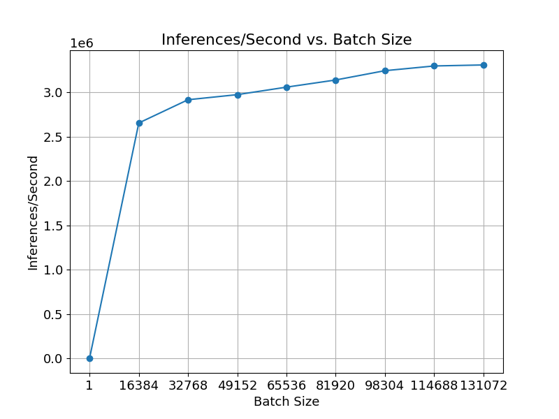</td>
    <td>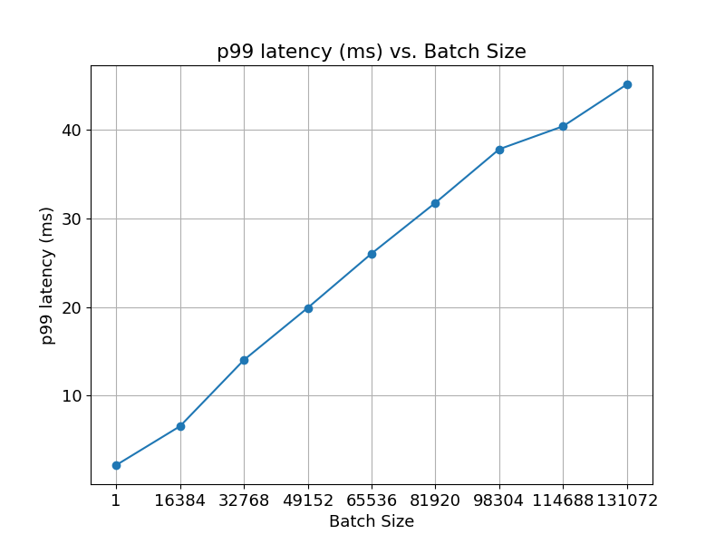</td>
  </tr>
</tbody>
</table>

<details>
<summary>Results Table</summary>

|   Batch |   Concurrency |   Inferences/Second |   Client Send (ms) |   Network+Server Send/Recv (ms) |   Server Queue (ms) |   Server Compute Input (ms) |   Server Compute Infer (ms) |   Server Compute Output (ms) |   Client Recv (ms) |   p50 latency (ms) |   p90 latency (ms) |   p95 latency (ms) |   p99 latency (ms) |   avg latency (ms) |
|--------:|--------------:|--------------------:|-------------------:|--------------------------------:|--------------------:|----------------------------:|----------------------------:|-----------------------------:|-------------------:|-------------------:|-------------------:|-------------------:|-------------------:|-------------------:|
|       1 |             1 |              517.00 |               0.02 |                            0.24 |                0.02 |                        0.05 |                        1.59 |                         0.00 |               0.00 |               1.94 |               2.06 |               2.10 |               2.17 |               1.93 |
|   16384 |             1 |          2654210.00 |               0.03 |                            0.29 |                0.04 |                        0.35 |                        5.44 |                         0.01 |               0.00 |               6.16 |               6.42 |               6.45 |               6.56 |               6.17 |
|   32768 |             1 |          2916350.00 |               0.04 |                            0.39 |                0.05 |                        0.95 |                        9.73 |                         0.01 |               0.00 |              11.00 |              11.63 |              12.11 |              14.03 |              11.18 |
|   49152 |             1 |          2973700.00 |               0.03 |                            0.40 |                0.07 |                        1.86 |                       14.02 |                         0.02 |               0.00 |              16.05 |              18.00 |              19.22 |              19.92 |              16.40 |
|   65536 |             1 |          3058350.00 |               0.05 |                            0.54 |                0.07 |                        2.43 |                       18.16 |                         0.03 |               0.00 |              21.15 |              22.10 |              22.49 |              26.05 |              21.28 |
|   81920 |             1 |          3139220.00 |               0.06 |                            0.54 |                0.07 |                        2.85 |                       22.37 |                         0.05 |               0.00 |              25.67 |              27.64 |              28.84 |              31.78 |              25.94 |
|   98304 |             1 |          3244030.00 |               0.05 |                            0.48 |                0.07 |                        3.29 |                       26.28 |                         0.06 |               0.00 |              29.93 |              32.33 |              33.39 |              37.83 |              30.22 |
|  114688 |             1 |          3297280.00 |               0.04 |                            0.38 |                0.07 |                        3.73 |                       30.39 |                         0.06 |               0.00 |              34.49 |              35.92 |              38.31 |              40.42 |              34.68 |
|  131072 |             1 |          3308740.00 |               0.04 |                            0.42 |                0.08 |                        4.27 |                       34.47 |                         0.08 |               0.00 |              39.15 |              41.44 |              42.82 |              45.15 |              39.35 |

</details>


#### Offline: NVIDIA A30, NVIDIA TensorRT with FP16

Our results were obtained using the following configuration:

| Parameter Name               | Parameter Value              |
|:-----------------------------|:-----------------------------|
| GPU                          |NVIDIA A30            |
| Backend                      |NVIDIA TensorRT        |
| Backend accelerator          |-|
| Precision                    |FP16      |
| Model format                 |NVIDIA TensorRT   |
| Max batch size               |131072 |
| Number of model instances    |2|
| Export Format | TensorFlow SavedModel    |
| NVIDIA TensorRT Capture CUDA Graph | Enabled    |
| Device Kind | gpu                 |
| Torch Jit | none                 |


<table>
<tbody>
  <tr>
    <td>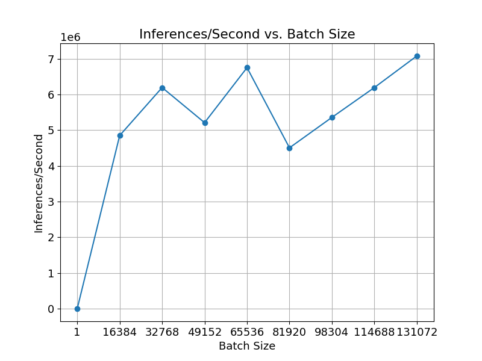</td>
    <td>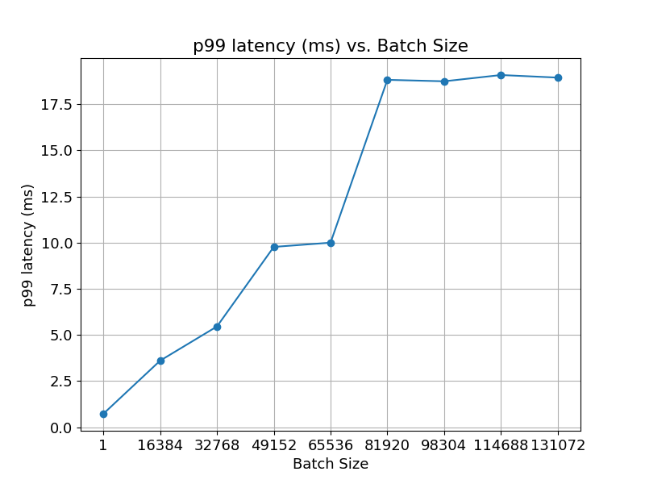</td>
  </tr>
</tbody>
</table>

<details>
<summary>Results Table</summary>

|   Batch |   Concurrency |   Inferences/Second |   Client Send (ms) |   Network+Server Send/Recv (ms) |   Server Queue (ms) |   Server Compute Input (ms) |   Server Compute Infer (ms) |   Server Compute Output (ms) |   Client Recv (ms) |   p50 latency (ms) |   p90 latency (ms) |   p95 latency (ms) |   p99 latency (ms) |   avg latency (ms) |
|--------:|--------------:|--------------------:|-------------------:|--------------------------------:|--------------------:|----------------------------:|----------------------------:|-----------------------------:|-------------------:|-------------------:|-------------------:|-------------------:|-------------------:|-------------------:|
|       1 |             1 |             1455.00 |               0.02 |                            0.19 |                0.02 |                        0.22 |                        0.23 |                         0.01 |               0.00 |               0.69 |               0.70 |               0.71 |               0.73 |               0.68 |
|   16384 |             1 |          4849660.00 |               0.05 |                            0.33 |                0.02 |                        0.51 |                        2.43 |                         0.03 |               0.00 |               3.41 |               3.53 |               3.58 |               3.61 |               3.37 |
|   32768 |             1 |          6193150.00 |               0.03 |                            0.27 |                0.02 |                        0.68 |                        4.25 |                         0.02 |               0.00 |               5.30 |               5.42 |               5.44 |               5.46 |               5.27 |
|   49152 |             1 |          5210110.00 |               0.03 |                            0.44 |                0.03 |                        0.82 |                        8.07 |                         0.02 |               0.00 |               9.47 |               9.69 |               9.73 |               9.77 |               9.43 |
|   65536 |             1 |          6750210.00 |               0.06 |                            0.52 |                0.06 |                        0.96 |                        8.05 |                         0.03 |               0.00 |               9.70 |               9.91 |               9.95 |              10.00 |               9.68 |
|   81920 |             1 |          4505600.00 |               0.06 |                            0.51 |                0.06 |                        1.03 |                       16.38 |                         0.04 |               0.00 |              18.07 |              18.39 |              18.51 |              18.82 |              18.07 |
|   98304 |             1 |          5357570.00 |               0.06 |                            0.52 |                0.06 |                        1.20 |                       16.35 |                         0.04 |               0.00 |              18.24 |              18.51 |              18.59 |              18.74 |              18.23 |
|  114688 |             1 |          6193150.00 |               0.06 |                            0.54 |                0.07 |                        1.47 |                       16.32 |                         0.05 |               0.00 |              18.52 |              18.81 |              18.86 |              19.08 |              18.51 |
|  131072 |             1 |          7077890.00 |               0.06 |                            0.54 |                0.07 |                        1.65 |                       15.98 |                         0.06 |               0.00 |              18.36 |              18.66 |              18.72 |              18.94 |              18.36 |

</details>


#### Offline: NVIDIA DGX-1 (1x V100 32GB), TensorFlow with FP32

Our results were obtained using the following configuration:

| Parameter Name               | Parameter Value              |
|:-----------------------------|:-----------------------------|
| GPU                          |NVIDIA DGX-1 (1x V100 32GB)            |
| Backend                      |TensorFlow        |
| Backend accelerator          |Automatic FP16|
| Precision                    |FP32      |
| Model format                 |TensorFlow SavedModel   |
| Max batch size               |131072 |
| Number of model instances    |2|
| Export Format | TensorFlow SavedModel    |
| Device Kind | gpu                 |
| Torch Jit | none                 |


<table>
<tbody>
  <tr>
    <td>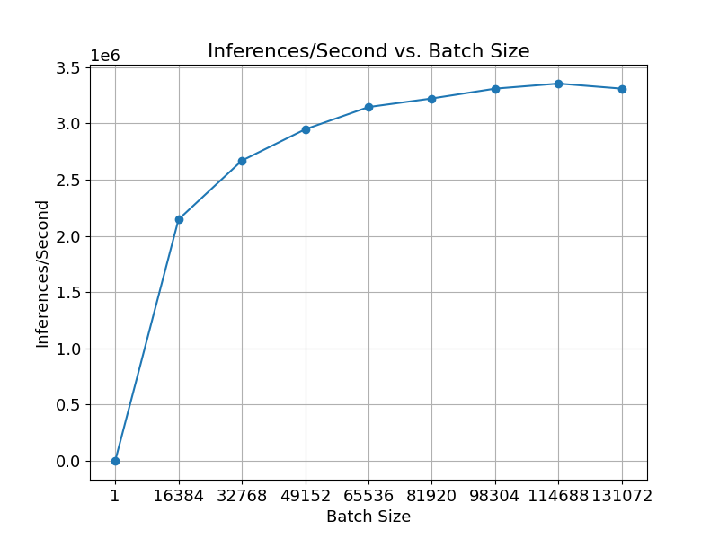</td>
    <td>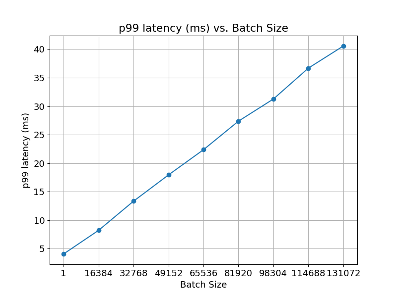</td>
  </tr>
</tbody>
</table>

<details>
<summary>Results Table</summary>

|   Batch |   Concurrency |   Inferences/Second |   Client Send (ms) |   Network+Server Send/Recv (ms) |   Server Queue (ms) |   Server Compute Input (ms) |   Server Compute Infer (ms) |   Server Compute Output (ms) |   Client Recv (ms) |   p50 latency (ms) |   p90 latency (ms) |   p95 latency (ms) |   p99 latency (ms) |   avg latency (ms) |
|--------:|--------------:|--------------------:|-------------------:|--------------------------------:|--------------------:|----------------------------:|----------------------------:|-----------------------------:|-------------------:|-------------------:|-------------------:|-------------------:|-------------------:|-------------------:|
|       1 |             1 |              294.70 |               0.05 |                            0.42 |                0.08 |                        0.06 |                        2.76 |                         0.00 |               0.00 |               3.34 |               3.66 |               3.76 |               4.07 |               3.38 |
|   16384 |             1 |          2146300.00 |               0.07 |                            0.45 |                0.11 |                        0.34 |                        6.63 |                         0.01 |               0.00 |               7.57 |               7.84 |               7.93 |               8.21 |               7.60 |
|   32768 |             1 |          2669260.00 |               0.06 |                            0.48 |                0.11 |                        0.73 |                       10.85 |                         0.02 |               0.00 |              12.19 |              12.76 |              12.99 |              13.33 |              12.25 |
|   49152 |             1 |          2947650.00 |               0.06 |                            0.46 |                0.11 |                        1.09 |                       14.87 |                         0.02 |               0.00 |              16.57 |              17.34 |              17.51 |              17.94 |              16.60 |
|   65536 |             1 |          3145730.00 |               0.05 |                            0.43 |                0.07 |                        1.45 |                       18.66 |                         0.03 |               0.00 |              20.60 |              21.49 |              21.70 |              22.36 |              20.70 |
|   81920 |             1 |          3222190.00 |               0.06 |                            0.49 |                0.11 |                        1.91 |                       22.64 |                         0.03 |               0.00 |              25.24 |              26.01 |              26.17 |              27.37 |              25.25 |
|   98304 |             1 |          3309570.00 |               0.06 |                            0.46 |                0.11 |                        2.18 |                       26.57 |                         0.05 |               0.00 |              29.38 |              30.30 |              30.45 |              31.26 |              29.43 |
|  114688 |             1 |          3354620.00 |               0.05 |                            0.44 |                0.11 |                        2.89 |                       30.49 |                         0.06 |               0.00 |              33.92 |              34.80 |              35.03 |              36.68 |              34.05 |
|  131072 |             1 |          3309570.00 |               0.07 |                            0.52 |                0.12 |                        3.68 |                       34.82 |                         0.07 |               0.00 |              39.21 |              40.06 |              40.17 |              40.56 |              39.28 |

</details>


#### Offline: NVIDIA DGX-1 (1x V100 32GB), NVIDIA TensorRT with FP16

Our results were obtained using the following configuration:

| Parameter Name               | Parameter Value              |
|:-----------------------------|:-----------------------------|
| GPU                          |NVIDIA DGX-1 (1x V100 32GB)            |
| Backend                      |NVIDIA TensorRT        |
| Backend accelerator          |-|
| Precision                    |FP16      |
| Model format                 |NVIDIA TensorRT   |
| Max batch size               |131072 |
| Number of model instances    |2|
| Export Format | TensorFlow SavedModel    |
| NVIDIA TensorRT Capture CUDA Graph | Enabled    |
| Device Kind | gpu                 |
| Torch Jit | none                 |


<table>
<tbody>
  <tr>
    <td>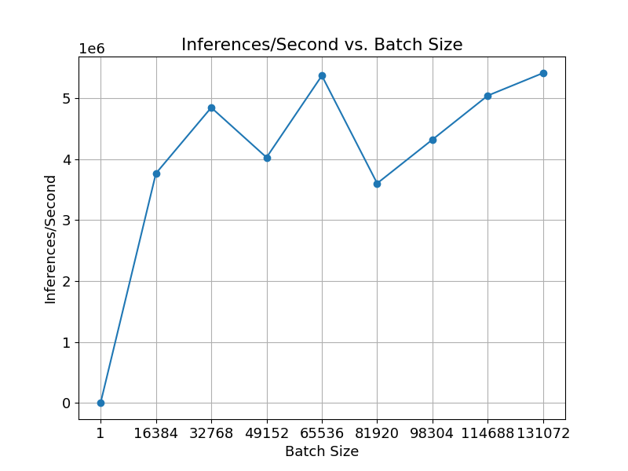</td>
    <td>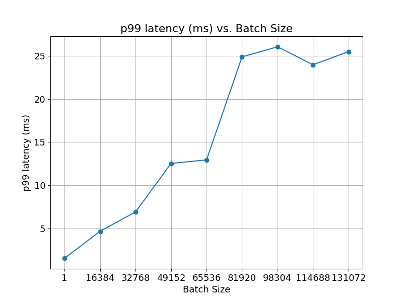</td>
  </tr>
</tbody>
</table>

<details>
<summary>Results Table</summary>

|   Batch |   Concurrency |   Inferences/Second |   Client Send (ms) |   Network+Server Send/Recv (ms) |   Server Queue (ms) |   Server Compute Input (ms) |   Server Compute Infer (ms) |   Server Compute Output (ms) |   Client Recv (ms) |   p50 latency (ms) |   p90 latency (ms) |   p95 latency (ms) |   p99 latency (ms) |   avg latency (ms) |
|--------:|--------------:|--------------------:|-------------------:|--------------------------------:|--------------------:|----------------------------:|----------------------------:|-----------------------------:|-------------------:|-------------------:|-------------------:|-------------------:|-------------------:|-------------------:|
|       1 |             1 |              749.25 |               0.07 |                            0.41 |                0.06 |                        0.35 |                        0.41 |                         0.03 |               0.00 |               1.32 |               1.41 |               1.44 |               1.53 |               1.33 |
|   16384 |             1 |          3768320.00 |               0.05 |                            0.47 |                0.11 |                        0.66 |                        2.99 |                         0.05 |               0.00 |               4.33 |               4.42 |               4.46 |               4.65 |               4.34 |
|   32768 |             1 |          4849660.00 |               0.05 |                            0.45 |                0.11 |                        0.85 |                        5.21 |                         0.06 |               0.00 |               6.72 |               6.82 |               6.84 |               6.90 |               6.72 |
|   49152 |             1 |          4030460.00 |               0.06 |                            0.49 |                0.13 |                        1.41 |                        9.97 |                         0.10 |               0.00 |              12.14 |              12.28 |              12.32 |              12.52 |              12.16 |
|   65536 |             1 |          5373950.00 |               0.06 |                            0.48 |                0.12 |                        1.55 |                        9.91 |                         0.06 |               0.00 |              12.17 |              12.32 |              12.36 |              12.93 |              12.19 |
|   81920 |             1 |          3604480.00 |               0.07 |                            0.53 |                0.13 |                        2.39 |                       19.50 |                         0.09 |               0.00 |              22.64 |              22.85 |              22.92 |              24.87 |              22.70 |
|   98304 |             1 |          4323940.00 |               0.08 |                            0.52 |                0.13 |                        2.30 |                       19.52 |                         0.08 |               0.00 |              22.46 |              23.03 |              23.41 |              26.04 |              22.63 |
|  114688 |             1 |          5046270.00 |               0.06 |                            0.44 |                0.11 |                        2.66 |                       19.35 |                         0.10 |               0.00 |              22.67 |              22.87 |              23.08 |              23.96 |              22.72 |
|  131072 |             1 |          5417640.00 |               0.07 |                            0.55 |                0.13 |                        4.23 |                       19.06 |                         0.12 |               0.00 |              24.35 |              24.47 |              24.63 |              25.48 |              24.17 |

</details>


#### Offline: NVIDIA DGX A100 (1x A100 80GB), TensorFlow with FP32

Our results were obtained using the following configuration:

| Parameter Name               | Parameter Value              |
|:-----------------------------|:-----------------------------|
| GPU                          |NVIDIA DGX A100 (1x A100 80GB)            |
| Backend                      |TensorFlow        |
| Backend accelerator          |Automatic FP16|
| Precision                    |FP32      |
| Model format                 |TensorFlow SavedModel   |
| Max batch size               |131072 |
| Number of model instances    |2|
| Export Format | TensorFlow SavedModel    |
| Device Kind | gpu                 |
| Torch Jit | none                 |


<table>
<tbody>
  <tr>
    <td>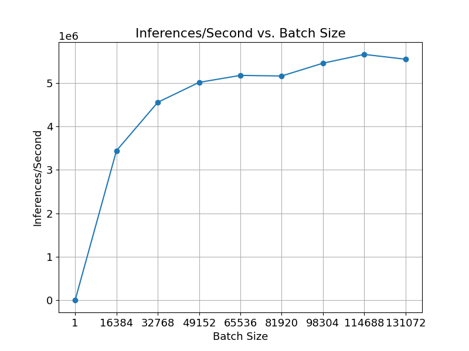</td>
    <td>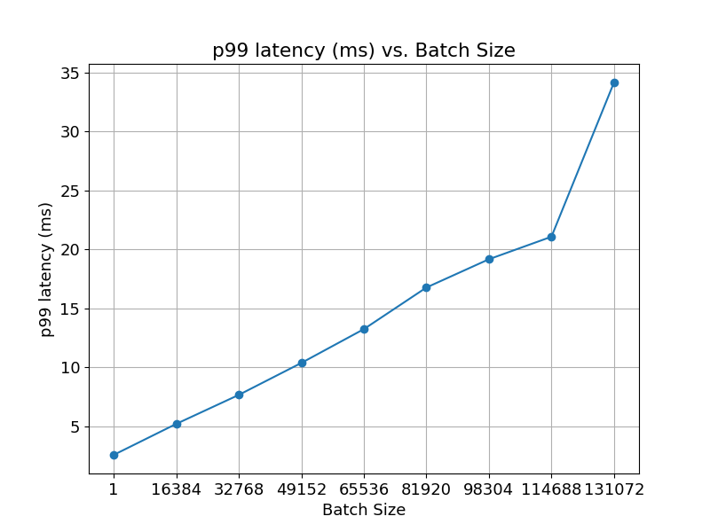</td>
  </tr>
</tbody>
</table>

<details>
<summary>Results Table</summary>

|   Batch |   Concurrency |   Inferences/Second |   Client Send (ms) |   Network+Server Send/Recv (ms) |   Server Queue (ms) |   Server Compute Input (ms) |   Server Compute Infer (ms) |   Server Compute Output (ms) |   Client Recv (ms) |   p50 latency (ms) |   p90 latency (ms) |   p95 latency (ms) |   p99 latency (ms) |   avg latency (ms) |
|--------:|--------------:|--------------------:|-------------------:|--------------------------------:|--------------------:|----------------------------:|----------------------------:|-----------------------------:|-------------------:|-------------------:|-------------------:|-------------------:|-------------------:|-------------------:|
|       1 |             1 |              445.00 |               0.02 |                            0.23 |                0.02 |                        0.06 |                        1.91 |                         0.00 |               0.00 |               2.24 |               2.39 |               2.42 |               2.56 |               2.24 |
|   16384 |             1 |          3440640.00 |               0.03 |                            0.27 |                0.02 |                        0.45 |                        3.98 |                         0.01 |               0.00 |               4.74 |               5.03 |               5.06 |               5.19 |               4.75 |
|   32768 |             1 |          4554750.00 |               0.03 |                            0.28 |                0.02 |                        0.81 |                        6.04 |                         0.01 |               0.00 |               7.18 |               7.50 |               7.55 |               7.65 |               7.18 |
|   49152 |             1 |          5013500.00 |               0.03 |                            0.26 |                0.02 |                        1.25 |                        8.20 |                         0.02 |               0.00 |               9.82 |              10.06 |              10.24 |              10.36 |               9.78 |
|   65536 |             1 |          5174760.00 |               0.03 |                            0.27 |                0.02 |                        1.82 |                       10.46 |                         0.03 |               0.00 |              12.66 |              12.98 |              13.14 |              13.23 |              12.63 |
|   81920 |             1 |          5160960.00 |               0.03 |                            0.33 |                0.03 |                        2.67 |                       12.72 |                         0.06 |               0.00 |              15.84 |              16.23 |              16.35 |              16.76 |              15.84 |
|   98304 |             1 |          5455870.00 |               0.03 |                            0.31 |                0.04 |                        2.63 |                       14.86 |                         0.05 |               0.00 |              17.88 |              18.43 |              18.67 |              19.16 |              17.91 |
|  114688 |             1 |          5657940.00 |               0.05 |                            0.36 |                0.04 |                        2.95 |                       16.76 |                         0.07 |               0.00 |              20.29 |              20.66 |              20.78 |              21.07 |              20.23 |
|  131072 |             1 |          5546870.00 |               0.07 |                            0.44 |                0.04 |                        3.34 |                       19.59 |                         0.09 |               0.00 |              22.89 |              24.23 |              29.68 |              34.16 |              23.56 |

</details>


#### Offline: NVIDIA DGX A100 (1x A100 80GB), NVIDIA TensorRT with FP16

Our results were obtained using the following configuration:

| Parameter Name               | Parameter Value              |
|:-----------------------------|:-----------------------------|
| GPU                          |NVIDIA DGX A100 (1x A100 80GB)            |
| Backend                      |NVIDIA TensorRT        |
| Backend accelerator          |-|
| Precision                    |FP16      |
| Model format                 |NVIDIA TensorRT   |
| Max batch size               |131072 |
| Number of model instances    |2|
| Export Format | TensorFlow SavedModel    |
| NVIDIA TensorRT Capture CUDA Graph | Enabled    |
| Device Kind | gpu                 |
| Torch Jit | none                 |


<table>
<tbody>
  <tr>
    <td>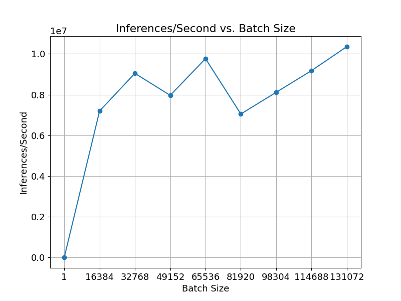</td>
    <td>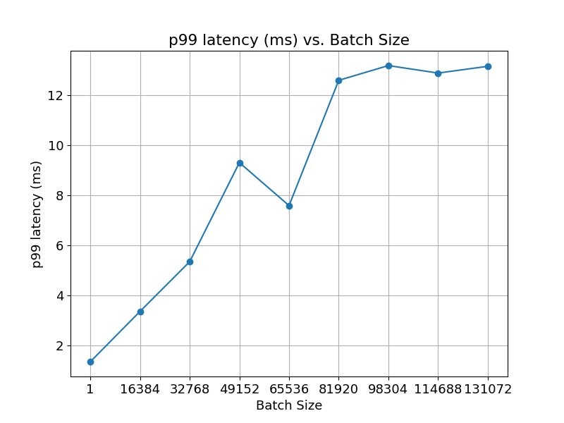</td>
  </tr>
</tbody>
</table>

<details>
<summary>Results Table</summary>

|   Batch |   Concurrency |   Inferences/Second |   Client Send (ms) |   Network+Server Send/Recv (ms) |   Server Queue (ms) |   Server Compute Input (ms) |   Server Compute Infer (ms) |   Server Compute Output (ms) |   Client Recv (ms) |   p50 latency (ms) |   p90 latency (ms) |   p95 latency (ms) |   p99 latency (ms) |   avg latency (ms) |
|--------:|--------------:|--------------------:|-------------------:|--------------------------------:|--------------------:|----------------------------:|----------------------------:|-----------------------------:|-------------------:|-------------------:|-------------------:|-------------------:|-------------------:|-------------------:|
|       1 |             1 |             1108.00 |               0.02 |                            0.26 |                0.02 |                        0.34 |                        0.25 |                         0.02 |               0.00 |               0.89 |               0.91 |               0.97 |               1.35 |               0.90 |
|   16384 |             1 |          7192580.00 |               0.02 |                            0.27 |                0.02 |                        0.52 |                        1.41 |                         0.03 |               0.00 |               2.24 |               2.31 |               2.37 |               3.36 |               2.27 |
|   32768 |             1 |          9043970.00 |               0.02 |                            0.34 |                0.03 |                        0.72 |                        2.46 |                         0.05 |               0.00 |               3.57 |               3.67 |               3.75 |               5.35 |               3.62 |
|   49152 |             1 |          7962620.00 |               0.02 |                            0.28 |                0.03 |                        1.17 |                        4.57 |                         0.05 |               0.00 |               5.97 |               6.14 |               6.28 |               9.31 |               6.13 |
|   65536 |             1 |          9764860.00 |               0.02 |                            0.28 |                0.03 |                        1.77 |                        4.51 |                         0.06 |               0.00 |               6.59 |               7.01 |               7.24 |               7.59 |               6.68 |
|   81920 |             1 |          7045120.00 |               0.02 |                            0.28 |                0.03 |                        2.49 |                        8.66 |                         0.07 |               0.00 |              11.45 |              12.10 |              12.34 |              12.60 |              11.56 |
|   98304 |             1 |          8110080.00 |               0.02 |                            0.28 |                0.03 |                        3.02 |                        8.65 |                         0.08 |               0.00 |              11.97 |              12.66 |              13.00 |              13.19 |              12.08 |
|  114688 |             1 |          9175040.00 |               0.02 |                            0.29 |                0.03 |                        3.40 |                        8.64 |                         0.09 |               0.00 |              12.43 |              12.69 |              12.77 |              12.89 |              12.48 |
|  131072 |             1 |         10354700.00 |               0.02 |                            0.27 |                0.03 |                        3.84 |                        8.37 |                         0.10 |               0.00 |              12.57 |              12.77 |              13.02 |              13.16 |              12.63 |

</details>


#### Offline: NVIDIA T4, TensorFlow with FP32

Our results were obtained using the following configuration:

| Parameter Name               | Parameter Value              |
|:-----------------------------|:-----------------------------|
| GPU                          |NVIDIA T4            |
| Backend                      |TensorFlow        |
| Backend accelerator          |Automatic FP16|
| Precision                    |FP32      |
| Model format                 |TensorFlow SavedModel   |
| Max batch size               |131072 |
| Number of model instances    |2|
| Export Format | TensorFlow SavedModel    |
| Device Kind | gpu                 |
| Torch Jit | none                 |


<table>
<tbody>
  <tr>
    <td></td>
    <td>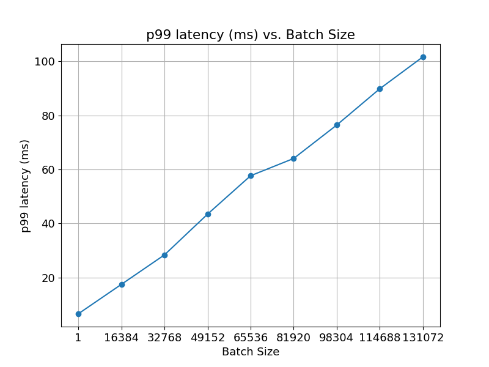</td>
  </tr>
</tbody>
</table>

<details>
<summary>Results Table</summary>

|   Batch |   Concurrency |   Inferences/Second |   Client Send (ms) |   Network+Server Send/Recv (ms) |   Server Queue (ms) |   Server Compute Input (ms) |   Server Compute Infer (ms) |   Server Compute Output (ms) |   Client Recv (ms) |   p50 latency (ms) |   p90 latency (ms) |   p95 latency (ms) |   p99 latency (ms) |   avg latency (ms) |
|--------:|--------------:|--------------------:|-------------------:|--------------------------------:|--------------------:|----------------------------:|----------------------------:|-----------------------------:|-------------------:|-------------------:|-------------------:|-------------------:|-------------------:|-------------------:|
|       1 |             1 |              181.00 |               0.09 |                            0.78 |                0.13 |                        0.19 |                        4.32 |                         0.02 |               0.00 |               5.52 |               6.18 |               6.30 |               6.59 |               5.52 |
|   16384 |             1 |          1023490.00 |               0.12 |                            0.96 |                0.17 |                        0.86 |                       13.82 |                         0.04 |               0.00 |              15.95 |              16.92 |              17.16 |              17.49 |              15.98 |
|   32768 |             1 |          1201090.00 |               0.12 |                            0.96 |                0.18 |                        1.50 |                       24.31 |                         0.06 |               0.00 |              27.14 |              28.06 |              28.18 |              28.40 |              27.12 |
|   49152 |             1 |          1265350.00 |               0.12 |                            0.96 |                0.18 |                        2.30 |                       35.08 |                         0.07 |               0.00 |              38.60 |              39.79 |              40.11 |              43.47 |              38.70 |
|   65536 |             1 |          1288870.00 |               0.12 |                            0.94 |                0.18 |                        3.13 |                       46.14 |                         0.11 |               0.00 |              50.54 |              51.51 |              51.68 |              57.69 |              50.63 |
|   81920 |             1 |          1310530.00 |               0.12 |                            0.94 |                0.18 |                        3.86 |                       56.84 |                         0.13 |               0.00 |              61.96 |              63.21 |              63.36 |              64.08 |              62.06 |
|   98304 |             1 |          1314650.00 |               0.12 |                            1.01 |                0.18 |                        4.38 |                       68.40 |                         0.14 |               0.00 |              74.34 |              75.17 |              75.40 |              76.45 |              74.24 |
|  114688 |             1 |          1312390.00 |               0.13 |                            1.00 |                0.16 |                        5.75 |                       79.94 |                         0.19 |               0.00 |              87.31 |              88.67 |              89.27 |              89.89 |              87.18 |
|  131072 |             1 |          1310590.00 |               0.13 |                            1.03 |                0.17 |                        6.29 |                       91.81 |                         0.20 |               0.00 |              99.64 |             101.02 |             101.41 |             101.68 |              99.63 |

</details>


#### Offline: NVIDIA T4, NVIDIA TensorRT with FP16

Our results were obtained using the following configuration:

| Parameter Name               | Parameter Value              |
|:-----------------------------|:-----------------------------|
| GPU                          |NVIDIA T4            |
| Backend                      |NVIDIA TensorRT        |
| Backend accelerator          |-|
| Precision                    |FP16      |
| Model format                 |NVIDIA TensorRT   |
| Max batch size               |131072 |
| Number of model instances    |2|
| Export Format | TensorFlow SavedModel    |
| NVIDIA TensorRT Capture CUDA Graph | Enabled    |
| Device Kind | gpu                 |
| Torch Jit | none                 |


<table>
<tbody>
  <tr>
    <td>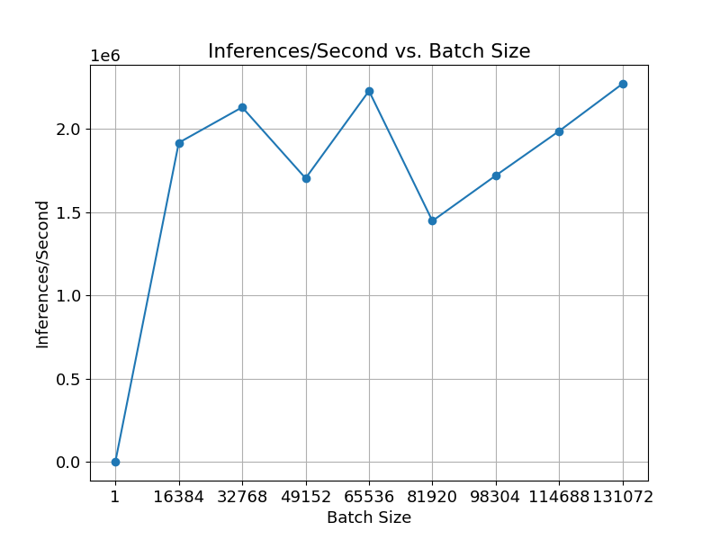</td>
    <td>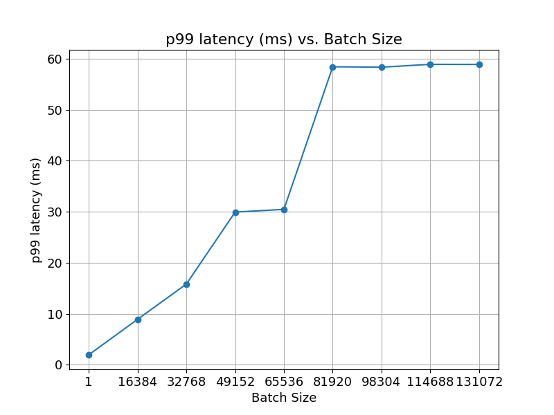</td>
  </tr>
</tbody>
</table>

<details>
<summary>Results Table</summary>

|   Batch |   Concurrency |   Inferences/Second |   Client Send (ms) |   Network+Server Send/Recv (ms) |   Server Queue (ms) |   Server Compute Input (ms) |   Server Compute Infer (ms) |   Server Compute Output (ms) |   Client Recv (ms) |   p50 latency (ms) |   p90 latency (ms) |   p95 latency (ms) |   p99 latency (ms) |   avg latency (ms) |
|--------:|--------------:|--------------------:|-------------------:|--------------------------------:|--------------------:|----------------------------:|----------------------------:|-----------------------------:|-------------------:|-------------------:|-------------------:|-------------------:|-------------------:|-------------------:|
|       1 |             1 |              564.00 |               0.05 |                            0.61 |                0.15 |                        0.56 |                        0.37 |                         0.02 |               0.00 |               1.77 |               1.88 |               1.91 |               1.95 |               1.77 |
|   16384 |             1 |          1916930.00 |               0.11 |                            0.89 |                0.18 |                        1.19 |                        6.08 |                         0.06 |               0.00 |               8.55 |               8.75 |               8.79 |               8.91 |               8.51 |
|   32768 |             1 |          2129920.00 |               0.12 |                            0.92 |                0.18 |                        1.84 |                       12.18 |                         0.07 |               0.00 |              15.32 |              15.56 |              15.66 |              15.82 |              15.32 |
|   49152 |             1 |          1703370.00 |               0.12 |                            0.94 |                0.18 |                        2.51 |                       24.94 |                         0.08 |               0.00 |              28.76 |              29.70 |              29.74 |              29.94 |              28.78 |
|   65536 |             1 |          2228220.00 |               0.12 |                            0.97 |                0.18 |                        3.22 |                       24.59 |                         0.11 |               0.00 |              29.08 |              30.25 |              30.35 |              30.47 |              29.20 |
|   81920 |             1 |          1447010.00 |               0.12 |                            0.99 |                0.18 |                        4.04 |                       51.04 |                         0.13 |               0.00 |              56.53 |              57.58 |              57.85 |              58.43 |              56.51 |
|   98304 |             1 |          1720030.00 |               0.13 |                            1.00 |                0.18 |                        4.96 |                       50.51 |                         0.15 |               0.00 |              56.84 |              57.84 |              57.93 |              58.35 |              56.92 |
|  114688 |             1 |          1987590.00 |               0.13 |                            1.04 |                0.19 |                        5.89 |                       50.14 |                         0.18 |               0.00 |              57.58 |              58.78 |              58.81 |              58.91 |              57.56 |
|  131072 |             1 |          2271540.00 |               0.12 |                            0.98 |                0.19 |                        6.93 |                       49.07 |                         0.16 |               0.00 |              57.34 |              58.56 |              58.79 |              58.89 |              57.45 |

</details>


### Online scenario

The online scenario assumes the client and server are located on different hosts. The tests uses:
- tensors are passed through HTTP from client to server
- concurrent requests are send from client to server, the final batch is created on server side


#### Online: NVIDIA A30, TensorFlow with FP32

Our results were obtained using the following configuration:

| Parameter Name               | Parameter Value              |
|:-----------------------------|:-----------------------------|
| GPU                          |NVIDIA A30            |
| Backend                      |TensorFlow        |
| Backend accelerator          |Automatic FP16|
| Precision                    |FP32      |
| Model format                 |TensorFlow SavedModel   |
| Max batch size               |131072 |
| Number of model instances    |2|
| Export Format | TensorFlow SavedModel    |
| Device Kind | gpu                 |
| Torch Jit | none                 |


<table>
<tbody>
  <tr>
    <td colspan="2" align="center">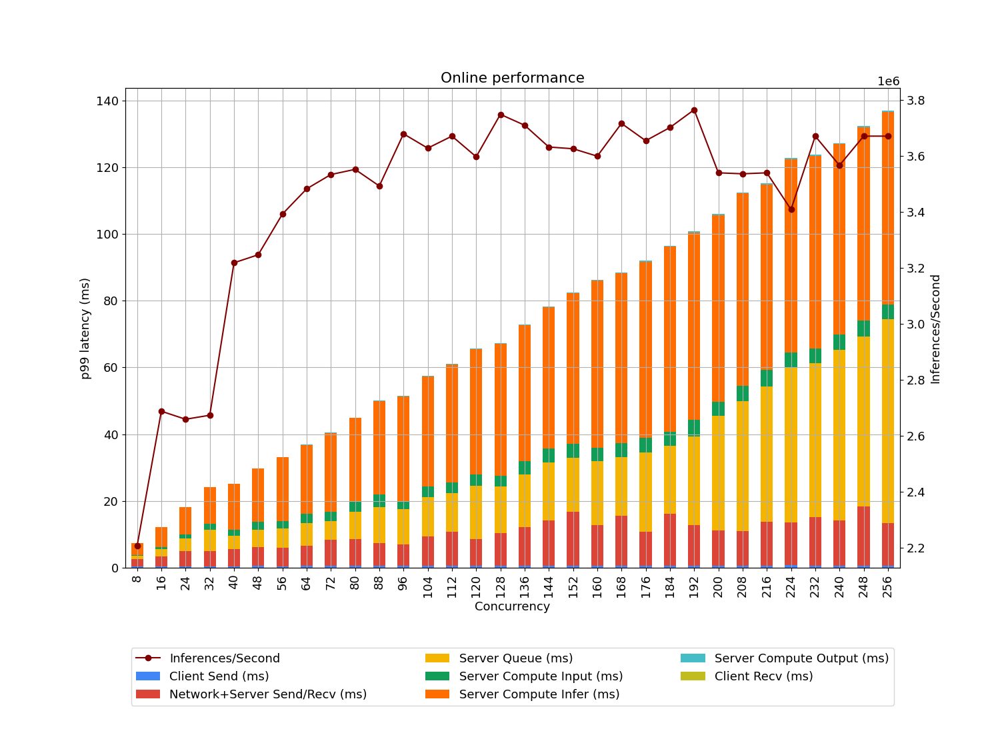</td>
  </tr>
</tbody>
</table>

<details>
<summary>Results Table</summary>

|   Batch |   Concurrency |   Inferences/Second |   Client Send (ms) |   Network+Server Send/Recv (ms) |   Server Queue (ms) |   Server Compute Input (ms) |   Server Compute Infer (ms) |   Server Compute Output (ms) |   Client Recv (ms) |   p50 latency (ms) |   p90 latency (ms) |   p95 latency (ms) |   p99 latency (ms) |   avg latency (ms) |
|--------:|--------------:|--------------------:|-------------------:|--------------------------------:|--------------------:|----------------------------:|----------------------------:|-----------------------------:|-------------------:|-------------------:|-------------------:|-------------------:|-------------------:|-------------------:|
|    2048 |             8 |          2205700.00 |               0.46 |                            2.09 |                0.99 |                        0.31 |                        3.53 |                         0.02 |               0.00 |               7.91 |               8.42 |               8.74 |               9.36 |               7.40 |
|    2048 |            16 |          2686980.00 |               0.46 |                            2.83 |                2.38 |                        0.51 |                        5.91 |                         0.03 |               0.00 |              12.64 |              13.41 |              13.90 |              15.69 |              12.12 |
|    2048 |            24 |          2658300.00 |               0.47 |                            4.46 |                3.75 |                        1.25 |                        8.24 |                         0.05 |               0.00 |              18.65 |              20.78 |              22.22 |              27.96 |              18.21 |
|    2048 |            32 |          2672640.00 |               0.47 |                            4.46 |                6.46 |                        1.74 |                       11.02 |                         0.08 |               0.00 |              24.53 |              27.26 |              28.82 |              30.28 |              24.23 |
|    2048 |            40 |          3217410.00 |               0.47 |                            5.12 |                3.96 |                        1.78 |                       13.76 |                         0.07 |               0.00 |              24.11 |              29.70 |              31.31 |              32.02 |              25.17 |
|    2048 |            48 |          3246080.00 |               0.50 |                            5.77 |                5.01 |                        2.45 |                       15.96 |                         0.10 |               0.00 |              28.87 |              36.61 |              39.55 |              44.82 |              29.78 |
|    2048 |            56 |          3391490.00 |               0.48 |                            5.52 |                5.74 |                        2.21 |                       19.18 |                         0.10 |               0.00 |              32.74 |              36.93 |              39.33 |              44.67 |              33.24 |
|    2048 |            64 |          3481600.00 |               0.50 |                            5.98 |                6.83 |                        2.90 |                       20.61 |                         0.12 |               0.00 |              36.78 |              39.41 |              41.34 |              44.04 |              36.94 |
|    2048 |            72 |          3532800.00 |               0.51 |                            7.84 |                5.61 |                        2.75 |                       23.65 |                         0.14 |               0.00 |              40.06 |              42.18 |              43.18 |              45.15 |              40.49 |
|    2048 |            80 |          3551230.00 |               0.51 |                            8.02 |                8.24 |                        3.04 |                       25.05 |                         0.14 |               0.00 |              44.82 |              46.05 |              46.43 |              47.17 |              45.01 |
|    2048 |            88 |          3491840.00 |               0.55 |                            6.85 |               10.81 |                        3.81 |                       27.98 |                         0.14 |               0.00 |              49.97 |              51.88 |              52.12 |              54.34 |              50.13 |
|    2048 |            96 |          3678210.00 |               0.49 |                            6.44 |               10.60 |                        2.42 |                       31.40 |                         0.13 |               0.00 |              51.33 |              52.85 |              53.52 |              55.37 |              51.48 |
|    2048 |           104 |          3627010.00 |               0.51 |                            8.84 |               11.81 |                        3.21 |                       32.91 |                         0.13 |               0.00 |              56.68 |              59.57 |              65.27 |              69.32 |              57.42 |
|    2048 |           112 |          3670020.00 |               0.50 |                           10.27 |               11.60 |                        3.22 |                       35.39 |                         0.17 |               0.00 |              60.96 |              62.94 |              63.78 |              66.09 |              61.14 |
|    2048 |           120 |          3596290.00 |               0.53 |                            8.14 |               15.83 |                        3.52 |                       37.44 |                         0.18 |               0.00 |              65.69 |              68.82 |              69.33 |              70.23 |              65.64 |
|    2048 |           128 |          3747840.00 |               0.53 |                            9.94 |               13.78 |                        3.35 |                       39.42 |                         0.18 |               0.00 |              67.36 |              68.44 |              68.70 |              69.57 |              67.19 |
|    2048 |           136 |          3708930.00 |               0.50 |                           11.62 |               15.82 |                        4.05 |                       40.59 |                         0.22 |               0.00 |              73.04 |              76.44 |              77.91 |              78.35 |              72.81 |
|    2048 |           144 |          3631100.00 |               0.53 |                           13.62 |               17.34 |                        4.16 |                       42.39 |                         0.27 |               0.00 |              78.38 |              81.03 |              81.55 |              82.67 |              78.31 |
|    2048 |           152 |          3624960.00 |               0.51 |                           16.29 |               16.20 |                        4.06 |                       45.15 |                         0.25 |               0.00 |              82.34 |              87.68 |              95.84 |             107.03 |              82.47 |
|    2048 |           160 |          3598340.00 |               0.52 |                           12.15 |               19.21 |                        4.13 |                       49.93 |                         0.26 |               0.00 |              88.03 |              91.12 |              92.91 |              94.12 |              86.20 |
|    2048 |           168 |          3715450.00 |               0.53 |                           15.01 |               17.67 |                        4.03 |                       50.90 |                         0.24 |               0.00 |              89.14 |              92.45 |              93.39 |              95.30 |              88.37 |
|    2048 |           176 |          3653630.00 |               0.56 |                           10.28 |               23.72 |                        4.36 |                       52.77 |                         0.29 |               0.00 |              93.17 |              94.98 |              95.73 |              96.99 |              91.98 |
|    2048 |           184 |          3700740.00 |               0.58 |                           15.49 |               20.40 |                        4.19 |                       55.47 |                         0.24 |               0.00 |              96.35 |             101.44 |             102.26 |             103.61 |              96.37 |
|    2048 |           192 |          3764220.00 |               0.56 |                           12.25 |               26.51 |                        5.04 |                       56.14 |                         0.24 |               0.00 |             100.51 |             103.64 |             104.54 |             107.29 |             100.76 |
|    2048 |           200 |          3538940.00 |               0.58 |                           10.53 |               34.43 |                        4.16 |                       55.98 |                         0.26 |               0.00 |             101.11 |             130.28 |             133.07 |             139.67 |             105.94 |
|    2048 |           208 |          3535410.00 |               0.63 |                           10.26 |               39.10 |                        4.42 |                       57.79 |                         0.26 |               0.00 |             104.99 |             137.09 |             138.30 |             139.86 |             112.48 |
|    2048 |           216 |          3538940.00 |               0.58 |                           13.14 |               40.62 |                        5.04 |                       55.45 |                         0.28 |               0.00 |             106.08 |             135.93 |             137.98 |             138.84 |             115.12 |
|    2048 |           224 |          3407870.00 |               0.70 |                           12.87 |               46.33 |                        4.61 |                       57.95 |                         0.26 |               0.00 |             130.57 |             142.24 |             143.32 |             147.15 |             122.72 |
|    2048 |           232 |          3670020.00 |               0.54 |                           14.55 |               46.11 |                        4.51 |                       57.72 |                         0.25 |               0.00 |             131.59 |             138.97 |             139.92 |             141.23 |             123.68 |
|    2048 |           240 |          3565570.00 |               0.56 |                           13.52 |               51.26 |                        4.62 |                       56.97 |                         0.25 |               0.00 |             134.50 |             138.74 |             140.46 |             143.67 |             127.18 |
|    2048 |           248 |          3670020.00 |               0.63 |                           17.72 |               50.87 |                        4.79 |                       58.02 |                         0.27 |               0.00 |             135.65 |             139.44 |             140.59 |             142.06 |             132.28 |
|    2048 |           256 |          3670020.00 |               0.60 |                           12.77 |               61.03 |                        4.50 |                       57.72 |                         0.27 |               0.00 |             135.72 |             142.43 |             143.26 |             145.82 |             136.88 |

</details>


#### Online: NVIDIA A30, NVIDIA TensorRT with FP16

Our results were obtained using the following configuration:

| Parameter Name               | Parameter Value              |
|:-----------------------------|:-----------------------------|
| GPU                          |NVIDIA A30            |
| Backend                      |NVIDIA TensorRT        |
| Backend accelerator          |-|
| Precision                    |FP16      |
| Model format                 |NVIDIA TensorRT   |
| Max batch size               |131072 |
| Number of model instances    |2|
| Export Format | TensorFlow SavedModel    |
| NVIDIA TensorRT Capture CUDA Graph | Enabled    |
| Device Kind | gpu                 |
| Torch Jit | none                 |


<table>
<tbody>
  <tr>
    <td colspan="2" align="center">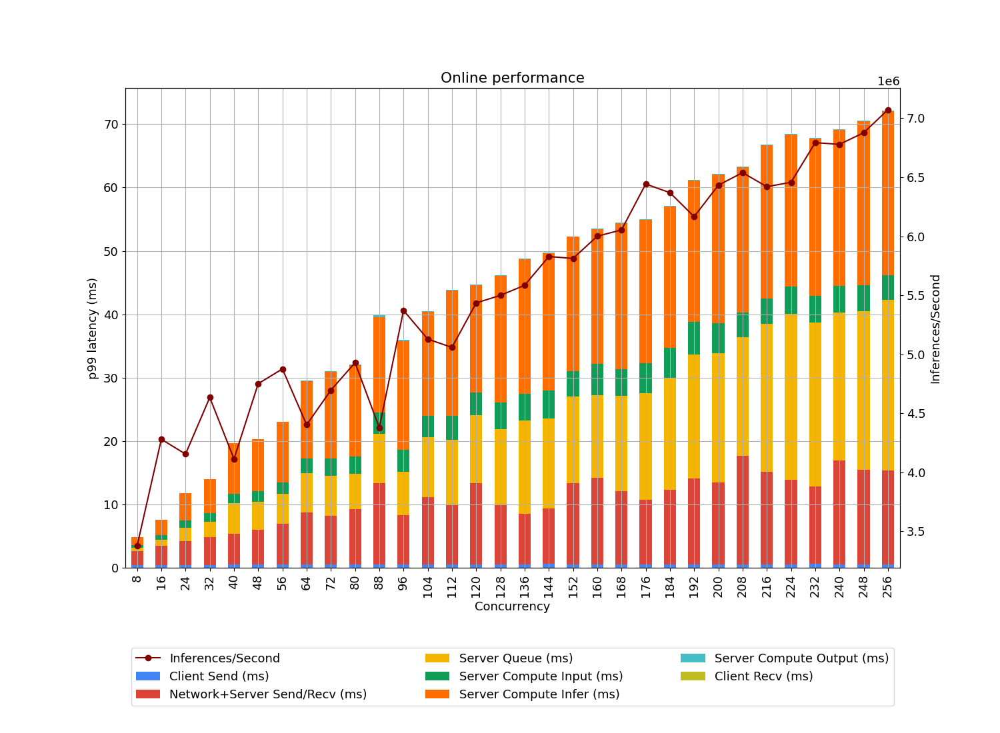</td>
  </tr>
</tbody>
</table>

<details>
<summary>Results Table</summary>

|   Batch |   Concurrency |   Inferences/Second |   Client Send (ms) |   Network+Server Send/Recv (ms) |   Server Queue (ms) |   Server Compute Input (ms) |   Server Compute Infer (ms) |   Server Compute Output (ms) |   Client Recv (ms) |   p50 latency (ms) |   p90 latency (ms) |   p95 latency (ms) |   p99 latency (ms) |   avg latency (ms) |
|--------:|--------------:|--------------------:|-------------------:|--------------------------------:|--------------------:|----------------------------:|----------------------------:|-----------------------------:|-------------------:|-------------------:|-------------------:|-------------------:|-------------------:|-------------------:|
|    2048 |             8 |          3377150.00 |               0.46 |                            2.17 |                0.48 |                        0.42 |                        1.30 |                         0.01 |               0.00 |               4.86 |               5.62 |               6.05 |               6.97 |               4.84 |
|    2048 |            16 |          4280320.00 |               0.46 |                            2.99 |                0.95 |                        0.70 |                        2.47 |                         0.02 |               0.00 |               7.60 |               8.85 |               9.48 |              10.04 |               7.59 |
|    2048 |            24 |          4155390.00 |               0.46 |                            3.78 |                2.06 |                        1.18 |                        4.26 |                         0.04 |               0.00 |              12.31 |              12.58 |              12.70 |              13.29 |              11.79 |
|    2048 |            32 |          4634620.00 |               0.46 |                            4.33 |                2.49 |                        1.30 |                        5.42 |                         0.03 |               0.00 |              15.96 |              16.51 |              16.60 |              16.79 |              14.02 |
|    2048 |            40 |          4114430.00 |               0.47 |                            4.86 |                4.83 |                        1.50 |                        7.99 |                         0.03 |               0.00 |              20.33 |              20.85 |              21.28 |              22.78 |              19.68 |
|    2048 |            48 |          4751360.00 |               0.47 |                            5.56 |                4.41 |                        1.65 |                        8.20 |                         0.03 |               0.00 |              20.72 |              21.29 |              21.86 |              27.29 |              20.33 |
|    2048 |            56 |          4876290.00 |               0.47 |                            6.45 |                4.78 |                        1.79 |                        9.54 |                         0.04 |               0.00 |              21.37 |              29.68 |              30.19 |              32.92 |              23.07 |
|    2048 |            64 |          4403200.00 |               0.50 |                            8.18 |                6.24 |                        2.32 |                       12.24 |                         0.06 |               0.00 |              30.45 |              34.45 |              36.88 |              43.85 |              29.54 |
|    2048 |            72 |          4696060.00 |               0.49 |                            7.73 |                6.31 |                        2.75 |                       13.64 |                         0.06 |               0.00 |              31.34 |              35.32 |              38.51 |              45.91 |              30.99 |
|    2048 |            80 |          4929540.00 |               0.53 |                            8.75 |                5.59 |                        2.72 |                       14.38 |                         0.08 |               0.00 |              33.10 |              42.91 |              44.74 |              51.17 |              32.06 |
|    2048 |            88 |          4378620.00 |               0.50 |                           12.86 |                7.76 |                        3.36 |                       15.10 |                         0.26 |               0.00 |              43.88 |              49.60 |              51.20 |              56.70 |              39.84 |
|    2048 |            96 |          5371900.00 |               0.51 |                            7.79 |                6.89 |                        3.41 |                       17.18 |                         0.15 |               0.00 |              36.46 |              48.51 |              53.61 |              59.81 |              35.93 |
|    2048 |           104 |          5129210.00 |               0.51 |                           10.65 |                9.44 |                        3.37 |                       16.40 |                         0.07 |               0.00 |              42.08 |              48.28 |              52.47 |              57.71 |              40.44 |
|    2048 |           112 |          5058560.00 |               0.50 |                            9.38 |               10.30 |                        3.84 |                       19.75 |                         0.09 |               0.00 |              44.99 |              57.46 |              58.44 |              59.22 |              43.86 |
|    2048 |           120 |          5435390.00 |               0.50 |                           12.86 |               10.68 |                        3.58 |                       16.98 |                         0.09 |               0.00 |              45.01 |              50.08 |              50.68 |              63.46 |              44.68 |
|    2048 |           128 |          5499520.00 |               0.57 |                            9.42 |               11.85 |                        4.21 |                       20.00 |                         0.11 |               0.00 |              45.22 |              58.71 |              61.23 |              71.79 |              46.15 |
|    2048 |           136 |          5584900.00 |               0.56 |                            7.95 |               14.70 |                        4.27 |                       21.17 |                         0.10 |               0.00 |              52.76 |              59.25 |              61.29 |              66.22 |              48.75 |
|    2048 |           144 |          5828610.00 |               0.58 |                            8.76 |               14.21 |                        4.44 |                       21.67 |                         0.10 |               0.00 |              53.10 |              60.64 |              62.39 |              65.12 |              49.75 |
|    2048 |           152 |          5812220.00 |               0.52 |                           12.79 |               13.75 |                        4.01 |                       21.15 |                         0.08 |               0.00 |              54.56 |              60.15 |              62.76 |              67.47 |              52.30 |
|    2048 |           160 |          6000640.00 |               0.53 |                           13.68 |               13.01 |                        4.91 |                       21.32 |                         0.10 |               0.00 |              55.18 |              62.53 |              63.20 |              70.26 |              53.55 |
|    2048 |           168 |          6053890.00 |               0.56 |                           11.52 |               15.04 |                        4.25 |                       22.97 |                         0.10 |               0.00 |              57.53 |              65.93 |              67.38 |              73.08 |              54.43 |
|    2048 |           176 |          6443010.00 |               0.54 |                           10.17 |               16.84 |                        4.78 |                       22.56 |                         0.10 |               0.00 |              56.70 |              66.88 |              68.40 |              74.31 |              54.98 |
|    2048 |           184 |          6369280.00 |               0.55 |                           11.80 |               17.61 |                        4.75 |                       22.30 |                         0.11 |               0.00 |              59.55 |              69.48 |              72.12 |              75.43 |              57.12 |
|    2048 |           192 |          6166530.00 |               0.55 |                           13.54 |               19.58 |                        5.12 |                       22.33 |                         0.11 |               0.00 |              62.62 |              73.35 |              75.14 |              78.02 |              61.23 |
|    2048 |           200 |          6432770.00 |               0.53 |                           12.88 |               20.48 |                        4.67 |                       23.44 |                         0.10 |               0.00 |              63.49 |              75.39 |              76.63 |              82.79 |              62.12 |
|    2048 |           208 |          6539260.00 |               0.50 |                           17.18 |               18.68 |                        3.94 |                       22.89 |                         0.09 |               0.00 |              64.74 |              73.25 |              73.92 |              75.78 |              63.28 |
|    2048 |           216 |          6420200.00 |               0.53 |                           14.62 |               23.30 |                        3.98 |                       24.26 |                         0.08 |               0.00 |              71.64 |              76.78 |              79.58 |              81.42 |              66.76 |
|    2048 |           224 |          6457340.00 |               0.51 |                           13.34 |               26.25 |                        4.30 |                       23.93 |                         0.08 |               0.00 |              73.35 |              76.42 |              78.63 |              81.02 |              68.41 |
|    2048 |           232 |          6793220.00 |               0.60 |                           12.23 |               25.87 |                        4.19 |                       24.82 |                         0.09 |               0.00 |              72.37 |              76.42 |              79.96 |              82.30 |              67.80 |
|    2048 |           240 |          6778880.00 |               0.51 |                           16.46 |               23.31 |                        4.16 |                       24.70 |                         0.09 |               0.00 |              72.48 |              76.24 |              77.42 |              81.06 |              69.23 |
|    2048 |           248 |          6877180.00 |               0.51 |                           14.99 |               25.03 |                        4.06 |                       25.86 |                         0.09 |               0.00 |              72.49 |              74.72 |              75.13 |              76.35 |              70.53 |
|    2048 |           256 |          7071740.00 |               0.51 |                           14.85 |               26.94 |                        3.84 |                       25.88 |                         0.09 |               0.00 |              72.08 |              74.62 |              75.67 |              78.03 |              72.11 |

</details>


#### Online: NVIDIA DGX-1 (1x V100 32GB), TensorFlow with FP32

Our results were obtained using the following configuration:

| Parameter Name               | Parameter Value              |
|:-----------------------------|:-----------------------------|
| GPU                          |NVIDIA DGX-1 (1x V100 32GB)            |
| Backend                      |TensorFlow        |
| Backend accelerator          |Automatic FP16|
| Precision                    |FP32      |
| Model format                 |TensorFlow SavedModel   |
| Max batch size               |131072 |
| Number of model instances    |2|
| Export Format | TensorFlow SavedModel    |
| Device Kind | gpu                 |
| Torch Jit | none                 |


<table>
<tbody>
  <tr>
    <td colspan="2" align="center">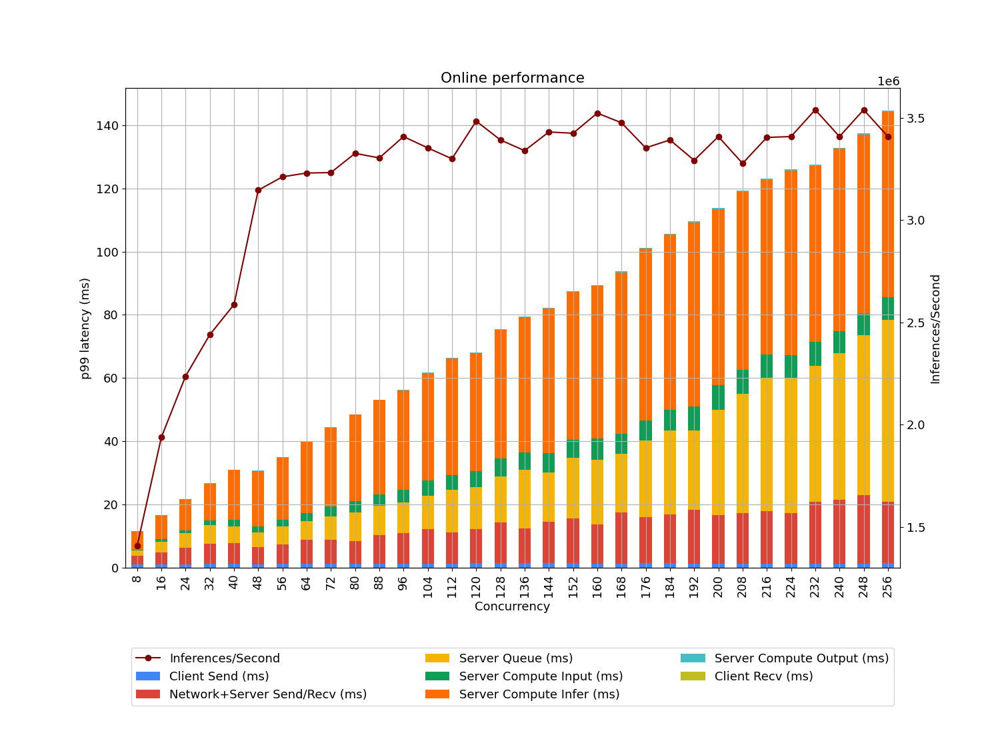</td>
  </tr>
</tbody>
</table>

<details>
<summary>Results Table</summary>

|   Batch |   Concurrency |   Inferences/Second |   Client Send (ms) |   Network+Server Send/Recv (ms) |   Server Queue (ms) |   Server Compute Input (ms) |   Server Compute Infer (ms) |   Server Compute Output (ms) |   Client Recv (ms) |   p50 latency (ms) |   p90 latency (ms) |   p95 latency (ms) |   p99 latency (ms) |   avg latency (ms) |
|--------:|--------------:|--------------------:|-------------------:|--------------------------------:|--------------------:|----------------------------:|----------------------------:|-----------------------------:|-------------------:|-------------------:|-------------------:|-------------------:|-------------------:|-------------------:|
|    2048 |             8 |          1406980.00 |               1.04 |                            2.73 |                1.62 |                        0.28 |                        5.88 |                         0.02 |               0.00 |              12.16 |              13.50 |              13.82 |              14.58 |              11.58 |
|    2048 |            16 |          1937410.00 |               1.12 |                            3.69 |                3.49 |                        0.81 |                        7.54 |                         0.04 |               0.00 |              17.57 |              18.46 |              18.68 |              19.28 |              16.69 |
|    2048 |            24 |          2236420.00 |               1.12 |                            5.16 |                4.61 |                        0.99 |                        9.81 |                         0.04 |               0.00 |              22.39 |              23.75 |              24.48 |              25.40 |              21.73 |
|    2048 |            32 |          2439170.00 |               1.19 |                            6.46 |                5.89 |                        1.47 |                       11.61 |                         0.08 |               0.00 |              27.56 |              28.64 |              29.38 |              30.56 |              26.71 |
|    2048 |            40 |          2586620.00 |               1.23 |                            6.53 |                5.38 |                        1.94 |                       15.81 |                         0.09 |               0.00 |              31.88 |              34.85 |              35.49 |              41.48 |              30.98 |
|    2048 |            48 |          3145730.00 |               1.14 |                            5.45 |                4.67 |                        1.84 |                       17.55 |                         0.08 |               0.00 |              30.73 |              32.24 |              32.60 |              33.67 |              30.74 |
|    2048 |            56 |          3211260.00 |               1.19 |                            6.09 |                5.79 |                        2.07 |                       19.84 |                         0.10 |               0.00 |              35.02 |              36.32 |              36.56 |              39.19 |              35.08 |
|    2048 |            64 |          3229700.00 |               1.24 |                            7.60 |                5.88 |                        2.54 |                       22.48 |                         0.12 |               0.00 |              39.91 |              40.87 |              41.03 |              41.50 |              39.85 |
|    2048 |            72 |          3231740.00 |               1.26 |                            7.51 |                7.54 |                        3.11 |                       24.84 |                         0.12 |               0.00 |              44.69 |              45.61 |              46.08 |              47.34 |              44.40 |
|    2048 |            80 |          3325950.00 |               1.32 |                            7.15 |                9.10 |                        3.48 |                       27.39 |                         0.14 |               0.00 |              48.57 |              49.50 |              49.63 |              49.94 |              48.58 |
|    2048 |            88 |          3303420.00 |               1.34 |                            8.98 |                9.23 |                        3.66 |                       29.86 |                         0.15 |               0.00 |              53.21 |              54.16 |              54.30 |              54.82 |              53.22 |
|    2048 |            96 |          3407870.00 |               1.35 |                            9.52 |                9.82 |                        3.98 |                       31.35 |                         0.16 |               0.00 |              56.17 |              57.28 |              57.66 |              58.45 |              56.19 |
|    2048 |           104 |          3352580.00 |               1.34 |                           10.83 |               10.69 |                        4.78 |                       33.99 |                         0.21 |               0.00 |              61.75 |              63.06 |              63.46 |              63.92 |              61.84 |
|    2048 |           112 |          3299330.00 |               1.34 |                            9.79 |               13.48 |                        4.76 |                       36.84 |                         0.21 |               0.00 |              66.32 |              67.74 |              68.13 |              68.99 |              66.43 |
|    2048 |           120 |          3483650.00 |               1.40 |                           10.80 |               13.38 |                        5.05 |                       37.15 |                         0.22 |               0.00 |              67.95 |              69.06 |              69.59 |              70.84 |              68.01 |
|    2048 |           128 |          3391490.00 |               1.44 |                           12.91 |               14.60 |                        5.72 |                       40.50 |                         0.23 |               0.00 |              74.83 |              80.32 |              85.15 |              87.77 |              75.40 |
|    2048 |           136 |          3339000.00 |               1.43 |                           11.07 |               18.41 |                        5.60 |                       42.67 |                         0.23 |               0.00 |              78.96 |              81.42 |              82.95 |              83.83 |              79.42 |
|    2048 |           144 |          3430400.00 |               1.36 |                           13.13 |               15.70 |                        6.08 |                       45.65 |                         0.25 |               0.00 |              81.96 |              83.69 |              84.16 |              85.02 |              82.17 |
|    2048 |           152 |          3424260.00 |               1.38 |                           14.29 |               19.05 |                        5.81 |                       46.75 |                         0.25 |               0.00 |              87.30 |              90.17 |              91.32 |              93.17 |              87.54 |
|    2048 |           160 |          3522560.00 |               1.34 |                           12.27 |               20.53 |                        6.77 |                       48.22 |                         0.33 |               0.00 |              89.83 |              91.81 |              93.60 |              94.84 |              89.47 |
|    2048 |           168 |          3475460.00 |               1.34 |                           16.24 |               18.55 |                        6.26 |                       51.10 |                         0.33 |               0.00 |              93.67 |              96.58 |              97.13 |              98.62 |              93.82 |
|    2048 |           176 |          3352580.00 |               1.42 |                           14.59 |               24.17 |                        6.50 |                       54.21 |                         0.29 |               0.00 |             101.40 |             102.82 |             104.31 |             106.19 |             101.17 |
|    2048 |           184 |          3391490.00 |               1.39 |                           15.43 |               26.57 |                        6.64 |                       55.30 |                         0.29 |               0.00 |             105.87 |             107.14 |             107.83 |             110.67 |             105.62 |
|    2048 |           192 |          3291940.00 |               1.34 |                           17.09 |               24.89 |                        7.73 |                       58.10 |                         0.38 |               0.00 |             109.48 |             111.30 |             112.27 |             114.72 |             109.53 |
|    2048 |           200 |          3407870.00 |               1.35 |                           15.22 |               33.43 |                        7.71 |                       55.65 |                         0.40 |               0.00 |             109.84 |             137.25 |             141.99 |             145.01 |             113.76 |
|    2048 |           208 |          3276800.00 |               1.33 |                           16.02 |               37.77 |                        7.48 |                       56.28 |                         0.41 |               0.00 |             111.49 |             144.69 |             145.60 |             146.99 |             119.30 |
|    2048 |           216 |          3403780.00 |               1.35 |                           16.62 |               41.90 |                        7.68 |                       55.20 |                         0.42 |               0.00 |             114.31 |             145.71 |             148.51 |             151.30 |             123.17 |
|    2048 |           224 |          3407870.00 |               1.34 |                           16.04 |               42.59 |                        7.21 |                       58.50 |                         0.34 |               0.00 |             133.67 |             144.04 |             144.44 |             145.45 |             126.03 |
|    2048 |           232 |          3538940.00 |               1.28 |                           19.49 |               43.11 |                        7.58 |                       55.67 |                         0.40 |               0.00 |             135.89 |             141.84 |             143.25 |             145.40 |             127.54 |
|    2048 |           240 |          3407870.00 |               1.32 |                           20.15 |               46.31 |                        7.00 |                       57.81 |                         0.32 |               0.00 |             140.71 |             142.56 |             143.03 |             145.84 |             132.92 |
|    2048 |           248 |          3538940.00 |               1.35 |                           21.56 |               50.58 |                        6.84 |                       56.74 |                         0.32 |               0.00 |             140.91 |             144.90 |             145.50 |             147.79 |             137.40 |
|    2048 |           256 |          3407870.00 |               1.36 |                           19.44 |               57.60 |                        7.14 |                       58.67 |                         0.35 |               0.00 |             144.46 |             146.25 |             147.18 |             148.69 |             144.56 |

</details>


#### Online: NVIDIA DGX-1 (1x V100 32GB), NVIDIA TensorRT with FP16

Our results were obtained using the following configuration:

| Parameter Name               | Parameter Value              |
|:-----------------------------|:-----------------------------|
| GPU                          |NVIDIA DGX-1 (1x V100 32GB)            |
| Backend                      |NVIDIA TensorRT        |
| Backend accelerator          |-|
| Precision                    |FP16      |
| Model format                 |NVIDIA TensorRT   |
| Max batch size               |131072 |
| Number of model instances    |2|
| Export Format | TensorFlow SavedModel    |
| NVIDIA TensorRT Capture CUDA Graph | Enabled    |
| Device Kind | gpu                 |
| Torch Jit | none                 |


<table>
<tbody>
  <tr>
    <td colspan="2" align="center">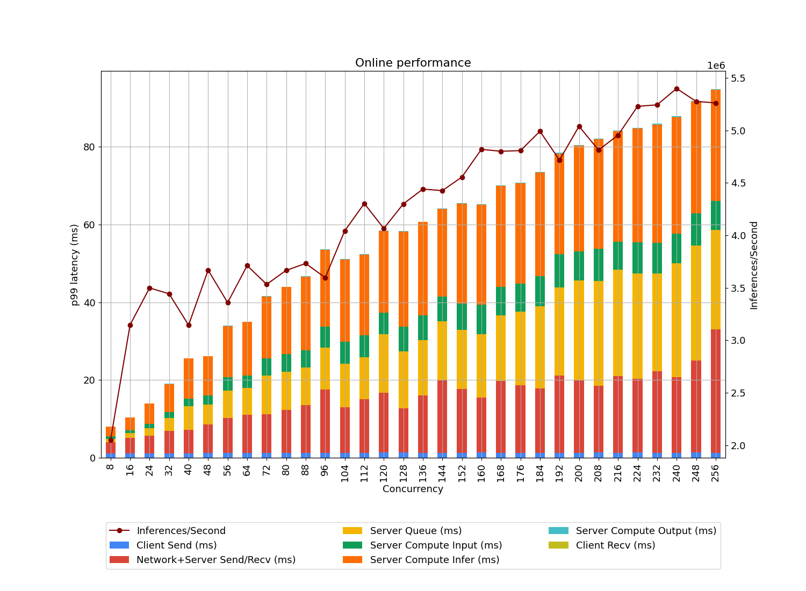</td>
  </tr>
</tbody>
</table>

<details>
<summary>Results Table</summary>

|   Batch |   Concurrency |   Inferences/Second |   Client Send (ms) |   Network+Server Send/Recv (ms) |   Server Queue (ms) |   Server Compute Input (ms) |   Server Compute Infer (ms) |   Server Compute Output (ms) |   Client Recv (ms) |   p50 latency (ms) |   p90 latency (ms) |   p95 latency (ms) |   p99 latency (ms) |   avg latency (ms) |
|--------:|--------------:|--------------------:|-------------------:|--------------------------------:|--------------------:|----------------------------:|----------------------------:|-----------------------------:|-------------------:|-------------------:|-------------------:|-------------------:|-------------------:|-------------------:|
|    2048 |             8 |          2048000.00 |               1.06 |                            2.99 |                0.85 |                        0.66 |                        2.39 |                         0.02 |               0.00 |               7.68 |              10.34 |              10.43 |              10.81 |               7.97 |
|    2048 |            16 |          3145730.00 |               1.09 |                            3.97 |                1.30 |                        0.74 |                        3.20 |                         0.02 |               0.00 |              10.40 |              11.76 |              12.62 |              13.54 |              10.33 |
|    2048 |            24 |          3498580.00 |               1.08 |                            4.65 |                1.85 |                        1.07 |                        5.31 |                         0.03 |               0.00 |              14.55 |              14.74 |              14.80 |              14.96 |              14.00 |
|    2048 |            32 |          3442690.00 |               1.10 |                            5.76 |                3.37 |                        1.58 |                        7.15 |                         0.05 |               0.00 |              20.14 |              22.84 |              25.34 |              30.42 |              19.01 |
|    2048 |            40 |          3143680.00 |               1.08 |                            6.13 |                6.01 |                        2.04 |                       10.28 |                         0.08 |               0.00 |              26.23 |              26.40 |              26.45 |              26.53 |              25.61 |
|    2048 |            48 |          3667970.00 |               1.18 |                            7.33 |                5.16 |                        2.39 |                       10.00 |                         0.06 |               0.00 |              26.91 |              34.01 |              37.07 |              44.18 |              26.13 |
|    2048 |            56 |          3358720.00 |               1.25 |                            9.03 |                7.05 |                        3.40 |                       13.12 |                         0.19 |               0.00 |              33.38 |              39.30 |              42.76 |              43.68 |              34.04 |
|    2048 |            64 |          3710980.00 |               1.22 |                            9.79 |                6.91 |                        3.24 |                       13.76 |                         0.08 |               0.00 |              35.20 |              46.53 |              51.79 |              58.32 |              35.00 |
|    2048 |            72 |          3532800.00 |               1.27 |                            9.94 |                9.88 |                        4.50 |                       15.88 |                         0.10 |               0.00 |              42.32 |              45.32 |              47.01 |              48.25 |              41.57 |
|    2048 |            80 |          3665920.00 |               1.22 |                           11.04 |                9.87 |                        4.50 |                       17.26 |                         0.11 |               0.00 |              43.84 |              54.40 |              57.38 |              69.41 |              44.01 |
|    2048 |            88 |          3731460.00 |               1.23 |                           12.38 |                9.62 |                        4.46 |                       18.84 |                         0.13 |               0.00 |              49.49 |              60.37 |              64.00 |              70.11 |              46.66 |
|    2048 |            96 |          3596290.00 |               1.30 |                           16.28 |               10.75 |                        5.33 |                       19.79 |                         0.12 |               0.00 |              56.59 |              60.01 |              64.17 |              65.67 |              53.58 |
|    2048 |           104 |          4042750.00 |               1.27 |                           11.76 |               11.13 |                        5.64 |                       21.24 |                         0.11 |               0.00 |              51.11 |              63.48 |              68.62 |              81.35 |              51.16 |
|    2048 |           112 |          4302850.00 |               1.26 |                           13.81 |               10.84 |                        5.57 |                       20.82 |                         0.14 |               0.00 |              52.92 |              65.63 |              70.87 |              73.82 |              52.42 |
|    2048 |           120 |          4065280.00 |               1.32 |                           15.44 |               14.97 |                        5.56 |                       21.00 |                         0.12 |               0.00 |              67.00 |              71.61 |              73.35 |              74.64 |              58.40 |
|    2048 |           128 |          4298750.00 |               1.33 |                           11.38 |               14.66 |                        6.38 |                       24.46 |                         0.14 |               0.00 |              57.55 |              74.42 |              75.14 |              75.96 |              58.34 |
|    2048 |           136 |          4440060.00 |               1.26 |                           14.78 |               14.21 |                        6.41 |                       23.96 |                         0.13 |               0.00 |              65.35 |              75.63 |              79.32 |              84.87 |              60.76 |
|    2048 |           144 |          4425730.00 |               1.24 |                           18.63 |               15.28 |                        6.32 |                       22.56 |                         0.16 |               0.00 |              67.99 |              76.48 |              78.16 |              82.24 |              64.18 |
|    2048 |           152 |          4554750.00 |               1.27 |                           16.37 |               15.28 |                        6.73 |                       25.72 |                         0.16 |               0.00 |              67.57 |              76.59 |              78.25 |              89.80 |              65.55 |
|    2048 |           160 |          4818940.00 |               1.31 |                           14.22 |               16.23 |                        7.65 |                       25.71 |                         0.16 |               0.00 |              67.81 |              78.92 |              83.34 |             108.24 |              65.27 |
|    2048 |           168 |          4800510.00 |               1.28 |                           18.55 |               16.74 |                        7.45 |                       25.97 |                         0.15 |               0.00 |              72.54 |              85.59 |              90.37 |              99.32 |              70.16 |
|    2048 |           176 |          4806660.00 |               1.27 |                           17.32 |               19.00 |                        7.16 |                       25.83 |                         0.14 |               0.00 |              73.55 |              85.24 |              86.53 |              89.98 |              70.73 |
|    2048 |           184 |          4990980.00 |               1.29 |                           16.53 |               21.14 |                        7.73 |                       26.74 |                         0.17 |               0.00 |              76.09 |              89.39 |              94.63 |             107.31 |              73.61 |
|    2048 |           192 |          4716540.00 |               1.30 |                           19.81 |               22.68 |                        8.54 |                       25.97 |                         0.19 |               0.00 |              79.06 |              96.15 |              97.55 |             102.86 |              78.48 |
|    2048 |           200 |          5038080.00 |               1.26 |                           18.76 |               25.63 |                        7.40 |                       27.24 |                         0.16 |               0.00 |              84.41 |              94.34 |              95.84 |             102.56 |              80.47 |
|    2048 |           208 |          4812800.00 |               1.32 |                           17.13 |               27.08 |                        8.30 |                       28.11 |                         0.16 |               0.00 |              87.32 |              96.77 |             107.36 |             120.31 |              82.10 |
|    2048 |           216 |          4954110.00 |               1.26 |                           19.71 |               27.37 |                        7.18 |                       28.52 |                         0.18 |               0.00 |              87.99 |             101.20 |             106.30 |             126.02 |              84.20 |
|    2048 |           224 |          5228540.00 |               1.31 |                           19.02 |               27.14 |                        7.92 |                       29.33 |                         0.15 |               0.00 |              90.37 |              99.31 |             105.15 |             114.43 |              84.87 |
|    2048 |           232 |          5242880.00 |               1.28 |                           20.97 |               25.23 |                        7.82 |                       30.44 |                         0.19 |               0.00 |              93.14 |              96.63 |              98.39 |             100.47 |              85.92 |
|    2048 |           240 |          5398530.00 |               1.29 |                           19.49 |               29.21 |                        7.61 |                       30.08 |                         0.17 |               0.00 |              92.47 |              95.17 |              95.65 |              98.29 |              87.85 |
|    2048 |           248 |          5275650.00 |               1.32 |                           23.67 |               29.61 |                        8.34 |                       28.65 |                         0.17 |               0.00 |              93.53 |              97.05 |              99.55 |             100.99 |              91.75 |
|    2048 |           256 |          5261310.00 |               1.25 |                           31.75 |               25.61 |                        7.47 |                       28.55 |                         0.16 |               0.00 |              95.47 |             113.51 |             118.44 |             122.77 |              94.79 |

</details>


#### Online: NVIDIA DGX A100 (1x A100 80GB), TensorFlow with FP32

Our results were obtained using the following configuration:

| Parameter Name               | Parameter Value              |
|:-----------------------------|:-----------------------------|
| GPU                          |NVIDIA DGX A100 (1x A100 80GB)            |
| Backend                      |TensorFlow        |
| Backend accelerator          |Automatic FP16|
| Precision                    |FP32      |
| Model format                 |TensorFlow SavedModel   |
| Max batch size               |131072 |
| Number of model instances    |2|
| Export Format | TensorFlow SavedModel    |
| Device Kind | gpu                 |
| Torch Jit | none                 |


<table>
<tbody>
  <tr>
    <td colspan="2" align="center">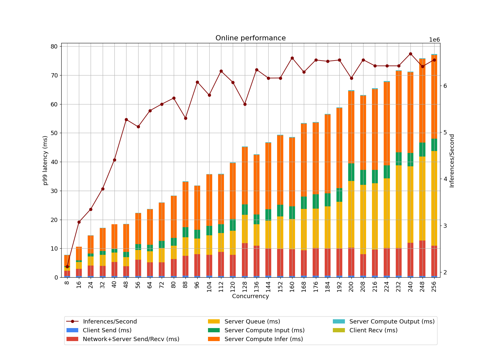</td>
  </tr>
</tbody>
</table>

<details>
<summary>Results Table</summary>

|   Batch |   Concurrency |   Inferences/Second |   Client Send (ms) |   Network+Server Send/Recv (ms) |   Server Queue (ms) |   Server Compute Input (ms) |   Server Compute Infer (ms) |   Server Compute Output (ms) |   Client Recv (ms) |   p50 latency (ms) |   p90 latency (ms) |   p95 latency (ms) |   p99 latency (ms) |   avg latency (ms) |
|--------:|--------------:|--------------------:|-------------------:|--------------------------------:|--------------------:|----------------------------:|----------------------------:|-----------------------------:|-------------------:|-------------------:|-------------------:|-------------------:|-------------------:|-------------------:|
|    2048 |             8 |          2117630.00 |               0.39 |                            1.86 |                1.24 |                        0.32 |                        3.89 |                         0.02 |               0.00 |               7.91 |               9.30 |               9.66 |              10.36 |               7.72 |
|    2048 |            16 |          3072000.00 |               0.45 |                            2.50 |                2.32 |                        0.58 |                        4.76 |                         0.02 |               0.00 |              10.98 |              12.15 |              12.70 |              13.56 |              10.64 |
|    2048 |            24 |          3350530.00 |               0.46 |                            3.55 |                3.22 |                        0.96 |                        6.28 |                         0.04 |               0.00 |              15.04 |              16.18 |              16.47 |              17.53 |              14.50 |
|    2048 |            32 |          3788800.00 |               0.47 |                            3.52 |                3.79 |                        1.35 |                        7.92 |                         0.07 |               0.00 |              17.34 |              19.63 |              19.96 |              21.71 |              17.11 |
|    2048 |            40 |          4411390.00 |               0.45 |                            4.82 |                3.28 |                        1.25 |                        8.54 |                         0.07 |               0.00 |              18.94 |              21.93 |              22.89 |              25.76 |              18.41 |
|    2048 |            48 |          5271550.00 |               0.44 |                            3.44 |                3.06 |                        1.88 |                        9.59 |                         0.07 |               0.00 |              18.58 |              19.17 |              19.40 |              19.91 |              18.48 |
|    2048 |            56 |          5116930.00 |               0.44 |                            5.64 |                3.41 |                        1.96 |                       10.72 |                         0.09 |               0.00 |              21.15 |              27.85 |              29.67 |              35.70 |              22.26 |
|    2048 |            64 |          5462700.00 |               0.45 |                            4.74 |                3.81 |                        2.23 |                       12.30 |                         0.10 |               0.00 |              23.67 |              24.60 |              24.85 |              25.19 |              23.63 |
|    2048 |            72 |          5603330.00 |               0.49 |                            4.72 |                4.88 |                        2.57 |                       13.15 |                         0.13 |               0.00 |              26.01 |              26.96 |              27.19 |              27.60 |              25.94 |
|    2048 |            80 |          5730300.00 |               0.49 |                            5.77 |                4.66 |                        2.69 |                       14.52 |                         0.13 |               0.00 |              28.26 |              28.98 |              29.24 |              29.64 |              28.26 |
|    2048 |            88 |          5304320.00 |               0.56 |                            6.82 |                6.48 |                        3.50 |                       15.72 |                         0.15 |               0.00 |              32.96 |              41.00 |              43.34 |              50.28 |              33.24 |
|    2048 |            96 |          6078460.00 |               0.47 |                            7.48 |                5.44 |                        3.06 |                       15.20 |                         0.14 |               0.00 |              30.81 |              40.15 |              41.58 |              45.13 |              31.80 |
|    2048 |           104 |          5795840.00 |               0.51 |                            7.24 |                6.82 |                        3.19 |                       17.82 |                         0.17 |               0.00 |              36.06 |              44.67 |              48.78 |              50.98 |              35.75 |
|    2048 |           112 |          6309890.00 |               0.48 |                            8.32 |                6.55 |                        3.03 |                       17.26 |                         0.16 |               0.00 |              35.22 |              40.60 |              45.25 |              54.10 |              35.79 |
|    2048 |           120 |          6070350.00 |               0.48 |                            7.32 |                8.34 |                        4.02 |                       19.39 |                         0.22 |               0.00 |              39.67 |              52.07 |              55.22 |              62.96 |              39.78 |
|    2048 |           128 |          5603330.00 |               0.48 |                           11.37 |                9.76 |                        3.65 |                       19.80 |                         0.21 |               0.00 |              45.55 |              56.76 |              57.75 |              60.84 |              45.28 |
|    2048 |           136 |          6342660.00 |               0.47 |                           10.50 |                7.40 |                        3.40 |                       20.62 |                         0.19 |               0.00 |              42.67 |              43.36 |              43.68 |              44.46 |              42.58 |
|    2048 |           144 |          6160380.00 |               0.51 |                            9.38 |                9.72 |                        3.96 |                       22.94 |                         0.22 |               0.00 |              47.19 |              50.34 |              53.58 |              62.89 |              46.73 |
|    2048 |           152 |          6162430.00 |               0.50 |                            9.35 |               11.24 |                        4.06 |                       24.05 |                         0.22 |               0.00 |              49.62 |              50.93 |              51.40 |              52.12 |              49.43 |
|    2048 |           160 |          6594560.00 |               0.48 |                            9.26 |               10.48 |                        4.33 |                       23.77 |                         0.23 |               0.00 |              48.82 |              49.97 |              50.25 |              51.14 |              48.55 |
|    2048 |           168 |          6289410.00 |               0.54 |                            8.81 |               14.30 |                        4.31 |                       25.26 |                         0.23 |               0.00 |              53.23 |              54.47 |              54.93 |              64.09 |              53.46 |
|    2048 |           176 |          6547460.00 |               0.51 |                            9.67 |               13.64 |                        4.92 |                       24.76 |                         0.27 |               0.00 |              54.30 |              56.66 |              58.01 |              60.22 |              53.78 |
|    2048 |           184 |          6520830.00 |               0.53 |                            9.43 |               14.56 |                        4.54 |                       27.26 |                         0.25 |               0.00 |              57.16 |              59.69 |              60.11 |              60.62 |              56.57 |
|    2048 |           192 |          6547460.00 |               0.51 |                            9.44 |               16.16 |                        4.73 |                       27.80 |                         0.25 |               0.00 |              58.92 |              59.96 |              60.35 |              62.24 |              58.90 |
|    2048 |           200 |          6160380.00 |               0.55 |                            9.65 |               23.18 |                        6.02 |                       25.12 |                         0.33 |               0.00 |              62.63 |              79.47 |              81.42 |              83.06 |              64.86 |
|    2048 |           208 |          6553600.00 |               0.51 |                            7.52 |               23.98 |                        5.24 |                       25.65 |                         0.28 |               0.00 |              59.00 |              77.14 |              77.89 |              79.00 |              63.17 |
|    2048 |           216 |          6422530.00 |               0.51 |                            9.04 |               23.01 |                        4.66 |                       27.98 |                         0.27 |               0.00 |              59.66 |              77.53 |              77.99 |              78.71 |              65.46 |
|    2048 |           224 |          6422530.00 |               0.52 |                            9.61 |               24.15 |                        4.55 |                       28.86 |                         0.24 |               0.00 |              70.81 |              78.24 |              78.68 |              80.45 |              67.94 |
|    2048 |           232 |          6422530.00 |               0.51 |                            9.64 |               28.58 |                        4.57 |                       28.17 |                         0.26 |               0.00 |              78.30 |              79.89 |              80.26 |              81.71 |              71.72 |
|    2048 |           240 |          6684670.00 |               0.50 |                           11.40 |               26.54 |                        4.61 |                       27.96 |                         0.25 |               0.00 |              74.96 |              77.42 |              79.14 |              80.80 |              71.26 |
|    2048 |           248 |          6408190.00 |               0.49 |                           12.28 |               29.09 |                        4.86 |                       28.87 |                         0.26 |               0.00 |              77.54 |              81.01 |              82.15 |              82.76 |              75.85 |
|    2048 |           256 |          6553600.00 |               0.50 |                           10.44 |               32.74 |                        4.35 |                       29.02 |                         0.25 |               0.00 |              77.27 |              78.51 |              78.74 |              80.09 |              77.31 |

</details>


#### Online: NVIDIA DGX A100 (1x A100 80GB), NVIDIA TensorRT with FP16

Our results were obtained using the following configuration:

| Parameter Name               | Parameter Value              |
|:-----------------------------|:-----------------------------|
| GPU                          |NVIDIA DGX A100 (1x A100 80GB)            |
| Backend                      |NVIDIA TensorRT        |
| Backend accelerator          |-|
| Precision                    |FP16      |
| Model format                 |NVIDIA TensorRT   |
| Max batch size               |131072 |
| Number of model instances    |2|
| Export Format | TensorFlow SavedModel    |
| NVIDIA TensorRT Capture CUDA Graph | Enabled    |
| Device Kind | gpu                 |
| Torch Jit | none                 |


<table>
<tbody>
  <tr>
    <td colspan="2" align="center"></td>
  </tr>
</tbody>
</table>

<details>
<summary>Results Table</summary>

|   Batch |   Concurrency |   Inferences/Second |   Client Send (ms) |   Network+Server Send/Recv (ms) |   Server Queue (ms) |   Server Compute Input (ms) |   Server Compute Infer (ms) |   Server Compute Output (ms) |   Client Recv (ms) |   p50 latency (ms) |   p90 latency (ms) |   p95 latency (ms) |   p99 latency (ms) |   avg latency (ms) |
|--------:|--------------:|--------------------:|-------------------:|--------------------------------:|--------------------:|----------------------------:|----------------------------:|-----------------------------:|-------------------:|-------------------:|-------------------:|-------------------:|-------------------:|-------------------:|
|    2048 |             8 |          3344380.00 |               0.39 |                            2.26 |                0.59 |                        0.58 |                        1.05 |                         0.02 |               0.00 |               4.83 |               6.14 |               6.32 |               6.84 |               4.89 |
|    2048 |            16 |          5148670.00 |               0.40 |                            3.14 |                0.78 |                        0.69 |                        1.31 |                         0.03 |               0.00 |               6.21 |               7.78 |               8.12 |               9.11 |               6.34 |
|    2048 |            24 |          6113280.00 |               0.42 |                            3.33 |                1.07 |                        0.98 |                        2.18 |                         0.03 |               0.00 |               8.18 |               9.32 |              10.14 |              11.37 |               8.00 |
|    2048 |            32 |          6434820.00 |               0.45 |                            4.10 |                1.43 |                        1.26 |                        2.84 |                         0.04 |               0.00 |              10.59 |              12.07 |              12.65 |              14.35 |              10.10 |
|    2048 |            40 |          6946820.00 |               0.46 |                            4.01 |                2.14 |                        1.49 |                        3.59 |                         0.04 |               0.00 |              12.16 |              14.78 |              15.71 |              17.81 |              11.72 |
|    2048 |            48 |          6770690.00 |               0.43 |                            5.27 |                2.43 |                        1.80 |                        4.39 |                         0.05 |               0.00 |              14.98 |              16.24 |              16.47 |              19.71 |              14.38 |
|    2048 |            56 |          7225340.00 |               0.44 |                            6.06 |                2.32 |                        2.28 |                        4.63 |                         0.06 |               0.00 |              16.07 |              18.89 |              20.43 |              22.38 |              15.79 |
|    2048 |            64 |          7217150.00 |               0.46 |                            6.95 |                2.74 |                        2.32 |                        5.57 |                         0.09 |               0.00 |              18.45 |              22.95 |              24.41 |              29.97 |              18.11 |
|    2048 |            72 |          7436290.00 |               0.46 |                            6.99 |                3.44 |                        2.32 |                        6.45 |                         0.08 |               0.00 |              21.05 |              25.17 |              27.20 |              32.09 |              19.74 |
|    2048 |            80 |          7757820.00 |               0.46 |                            7.62 |                3.36 |                        2.31 |                        6.90 |                         0.10 |               0.00 |              21.30 |              27.73 |              29.03 |              32.30 |              20.75 |
|    2048 |            88 |          8118270.00 |               0.46 |                            6.24 |                4.01 |                        3.14 |                        8.00 |                         0.10 |               0.00 |              21.97 |              30.04 |              32.84 |              35.90 |              21.94 |
|    2048 |            96 |          7417860.00 |               0.47 |                            9.43 |                3.91 |                        3.66 |                        8.74 |                         0.11 |               0.00 |              27.65 |              28.81 |              29.30 |              29.67 |              26.31 |
|    2048 |           104 |          7948290.00 |               0.46 |                           10.29 |                3.97 |                        3.18 |                        8.49 |                         0.09 |               0.00 |              29.04 |              32.34 |              33.58 |              35.17 |              26.48 |
|    2048 |           112 |          8038400.00 |               0.44 |                            9.26 |                5.20 |                        3.61 |                        9.38 |                         0.09 |               0.00 |              30.38 |              35.36 |              36.63 |              40.85 |              28.00 |
|    2048 |           120 |          8720380.00 |               0.46 |                            8.97 |                5.44 |                        3.47 |                        9.39 |                         0.10 |               0.00 |              29.91 |              34.33 |              36.08 |              38.36 |              27.84 |
|    2048 |           128 |          8339460.00 |               0.47 |                           11.57 |                5.64 |                        3.92 |                        9.35 |                         0.11 |               0.00 |              33.52 |              38.02 |              39.32 |              42.58 |              31.06 |
|    2048 |           136 |          9078780.00 |               0.47 |                           11.30 |                5.39 |                        3.76 |                        9.01 |                         0.11 |               0.00 |              32.31 |              34.56 |              34.98 |              36.55 |              30.03 |
|    2048 |           144 |          8794110.00 |               0.50 |                           10.94 |                7.06 |                        4.39 |                        9.72 |                         0.10 |               0.00 |              37.18 |              41.52 |              42.72 |              45.80 |              32.73 |
|    2048 |           152 |          9527300.00 |               0.52 |                            9.28 |                7.14 |                        4.84 |                       10.36 |                         0.12 |               0.00 |              32.24 |              43.32 |              46.39 |              49.35 |              32.26 |
|    2048 |           160 |          8984580.00 |               0.50 |                           13.36 |                7.18 |                        4.37 |                       10.19 |                         0.11 |               0.00 |              38.15 |              45.08 |              48.00 |              54.98 |              35.71 |
|    2048 |           168 |          9719810.00 |               0.46 |                           14.35 |                5.22 |                        4.25 |                       10.02 |                         0.12 |               0.00 |              39.62 |              40.55 |              40.89 |              42.70 |              34.42 |
|    2048 |           176 |         10377200.00 |               0.49 |                           10.02 |                7.91 |                        4.47 |                       10.81 |                         0.11 |               0.00 |              35.38 |              43.50 |              45.14 |              47.50 |              33.80 |
|    2048 |           184 |          9897980.00 |               0.51 |                           12.32 |                8.22 |                        5.05 |                       10.56 |                         0.10 |               0.00 |              37.49 |              46.92 |              48.81 |              51.65 |              36.76 |
|    2048 |           192 |         10129400.00 |               0.51 |                           12.08 |                9.12 |                        5.20 |                       10.59 |                         0.13 |               0.00 |              39.06 |              46.15 |              47.62 |              50.35 |              37.64 |
|    2048 |           200 |         10266600.00 |               0.48 |                           13.34 |                9.49 |                        4.87 |                       10.76 |                         0.12 |               0.00 |              40.57 |              48.12 |              50.15 |              54.61 |              39.06 |
|    2048 |           208 |         10154000.00 |               0.52 |                           15.22 |                9.31 |                        5.52 |                       10.54 |                         0.13 |               0.00 |              43.40 |              48.65 |              50.03 |              54.64 |              41.25 |
|    2048 |           216 |         10244100.00 |               0.49 |                           14.22 |               11.24 |                        5.25 |                       10.88 |                         0.12 |               0.00 |              44.13 |              49.72 |              52.48 |              56.64 |              42.20 |
|    2048 |           224 |         10235900.00 |               0.45 |                           18.12 |                9.39 |                        5.08 |                       10.62 |                         0.11 |               0.00 |              45.97 |              53.80 |              55.77 |              59.17 |              43.79 |
|    2048 |           232 |         10397700.00 |               0.47 |                           17.96 |               10.05 |                        5.68 |                       10.37 |                         0.12 |               0.00 |              46.76 |              57.00 |              59.62 |              63.52 |              44.64 |
|    2048 |           240 |         10287100.00 |               0.46 |                           21.07 |                9.12 |                        5.01 |                       10.69 |                         0.13 |               0.00 |              47.68 |              58.98 |              60.64 |              63.76 |              46.48 |
|    2048 |           248 |         11300900.00 |               0.50 |                           12.09 |               14.32 |                        5.37 |                       11.27 |                         0.12 |               0.00 |              44.80 |              46.68 |              47.27 |              49.97 |              43.66 |
|    2048 |           256 |         11272200.00 |               0.50 |                           11.16 |               16.80 |                        5.26 |                       11.49 |                         0.11 |               0.00 |              45.30 |              47.72 |              49.84 |              56.30 |              45.34 |

</details>


#### Online: NVIDIA T4, TensorFlow with FP32

Our results were obtained using the following configuration:

| Parameter Name               | Parameter Value              |
|:-----------------------------|:-----------------------------|
| GPU                          |NVIDIA T4            |
| Backend                      |TensorFlow        |
| Backend accelerator          |Automatic FP16|
| Precision                    |FP32      |
| Model format                 |TensorFlow SavedModel   |
| Max batch size               |131072 |
| Number of model instances    |2|
| Export Format | TensorFlow SavedModel    |
| Device Kind | gpu                 |
| Torch Jit | none                 |


<table>
<tbody>
  <tr>
    <td colspan="2" align="center">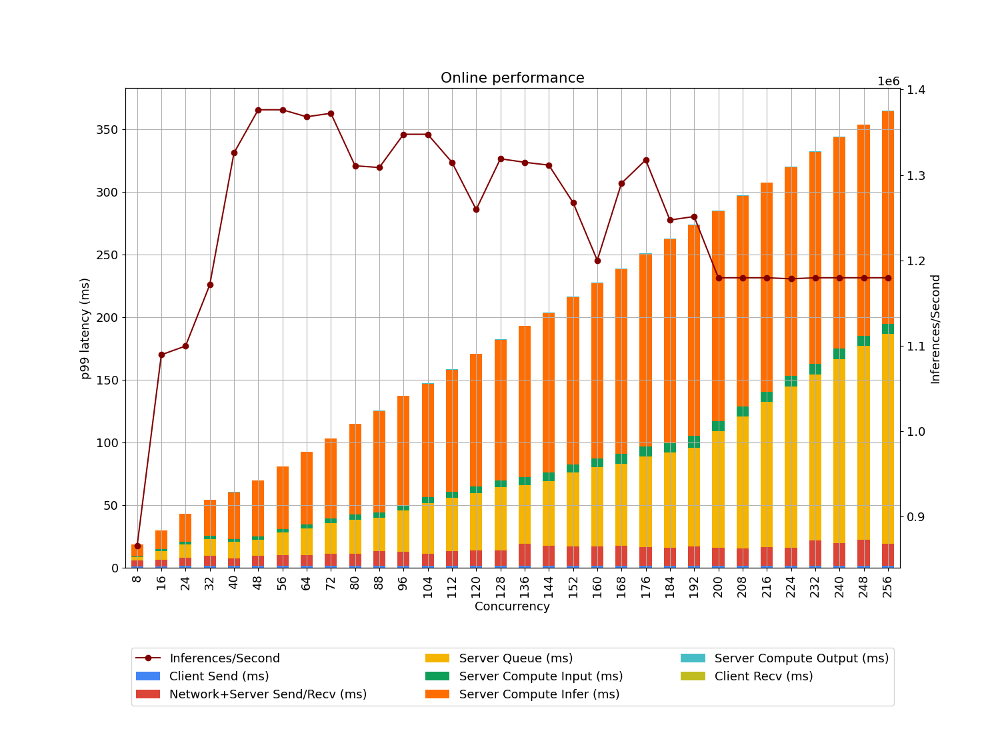</td>
  </tr>
</tbody>
</table>

<details>
<summary>Results Table</summary>

|   Batch |   Concurrency |   Inferences/Second |   Client Send (ms) |   Network+Server Send/Recv (ms) |   Server Queue (ms) |   Server Compute Input (ms) |   Server Compute Infer (ms) |   Server Compute Output (ms) |   Client Recv (ms) |   p50 latency (ms) |   p90 latency (ms) |   p95 latency (ms) |   p99 latency (ms) |   avg latency (ms) |
|--------:|--------------:|--------------------:|-------------------:|--------------------------------:|--------------------:|----------------------------:|----------------------------:|-----------------------------:|-------------------:|-------------------:|-------------------:|-------------------:|-------------------:|-------------------:|
|    2048 |             8 |           865871.00 |               1.10 |                            4.48 |                3.04 |                        0.57 |                        9.61 |                         0.04 |               0.00 |              19.84 |              22.06 |              22.56 |              23.29 |              18.84 |
|    2048 |            16 |          1089540.00 |               1.09 |                            5.22 |                7.21 |                        1.12 |                       15.25 |                         0.06 |               0.00 |              31.43 |              33.89 |              34.91 |              36.03 |              29.95 |
|    2048 |            24 |          1099780.00 |               1.31 |                            6.78 |               10.59 |                        1.88 |                       22.41 |                         0.10 |               0.00 |              44.68 |              47.61 |              48.06 |              48.61 |              43.06 |
|    2048 |            32 |          1171460.00 |               1.37 |                            8.07 |               13.38 |                        2.46 |                       28.96 |                         0.12 |               0.00 |              56.02 |              59.78 |              60.17 |              60.71 |              54.35 |
|    2048 |            40 |          1325780.00 |               1.40 |                            6.04 |               13.19 |                        2.44 |                       37.20 |                         0.12 |               0.00 |              60.64 |              63.12 |              63.94 |              71.32 |              60.39 |
|    2048 |            48 |          1376260.00 |               1.39 |                            8.23 |               12.70 |                        2.71 |                       44.43 |                         0.14 |               0.00 |              69.42 |              71.25 |              71.74 |              72.17 |              69.59 |
|    2048 |            56 |          1376260.00 |               1.44 |                            8.59 |               18.14 |                        2.68 |                       50.12 |                         0.14 |               0.00 |              81.22 |              82.90 |              83.64 |              85.12 |              81.11 |
|    2048 |            64 |          1368060.00 |               1.51 |                            8.70 |               21.25 |                        3.35 |                       57.52 |                         0.18 |               0.00 |              92.50 |              94.70 |              95.23 |              96.06 |              92.51 |
|    2048 |            72 |          1372160.00 |               1.51 |                            9.72 |               24.49 |                        3.77 |                       63.79 |                         0.19 |               0.00 |             103.07 |             107.19 |             107.84 |             108.11 |             103.48 |
|    2048 |            80 |          1310720.00 |               1.38 |                            9.70 |               27.25 |                        4.10 |                       72.40 |                         0.22 |               0.00 |             114.95 |             117.67 |             118.11 |             118.94 |             115.04 |
|    2048 |            88 |          1308670.00 |               1.58 |                           11.56 |               26.68 |                        4.21 |                       81.20 |                         0.25 |               0.00 |             125.08 |             129.18 |             129.83 |             130.91 |             125.48 |
|    2048 |            96 |          1347580.00 |               1.65 |                           11.22 |               32.70 |                        4.69 |                       87.01 |                         0.27 |               0.00 |             137.81 |             139.51 |             140.49 |             143.02 |             137.55 |
|    2048 |           104 |          1347580.00 |               1.69 |                            9.35 |               40.72 |                        4.42 |                       90.71 |                         0.25 |               0.00 |             147.06 |             149.22 |             149.70 |             150.16 |             147.15 |
|    2048 |           112 |          1314820.00 |               1.67 |                           11.60 |               42.33 |                        5.27 |                       97.35 |                         0.28 |               0.00 |             160.13 |             165.58 |             174.67 |             182.71 |             158.50 |
|    2048 |           120 |          1259520.00 |               1.68 |                           12.02 |               45.84 |                        5.43 |                      105.70 |                         0.30 |               0.00 |             170.64 |             174.06 |             175.21 |             176.62 |             170.98 |
|    2048 |           128 |          1318910.00 |               1.80 |                           11.93 |               50.38 |                        5.84 |                      112.15 |                         0.32 |               0.00 |             182.70 |             186.44 |             187.30 |             187.74 |             182.42 |
|    2048 |           136 |          1314820.00 |               1.70 |                           17.22 |               46.92 |                        6.63 |                      120.48 |                         0.44 |               0.00 |             192.88 |             196.29 |             196.85 |             201.14 |             193.39 |
|    2048 |           144 |          1311460.00 |               1.68 |                           16.08 |               51.66 |                        6.63 |                      127.27 |                         0.39 |               0.00 |             203.93 |             207.14 |             208.27 |             210.94 |             203.72 |
|    2048 |           152 |          1267710.00 |               1.66 |                           15.52 |               58.86 |                        6.65 |                      133.29 |                         0.38 |               0.00 |             216.69 |             221.59 |             228.32 |             228.91 |             216.36 |
|    2048 |           160 |          1200130.00 |               1.67 |                           15.44 |               63.33 |                        6.73 |                      140.23 |                         0.38 |               0.00 |             228.08 |             230.84 |             232.18 |             235.98 |             227.78 |
|    2048 |           168 |          1290240.00 |               1.72 |                           15.64 |               65.90 |                        7.50 |                      147.90 |                         0.40 |               0.00 |             239.57 |             242.45 |             246.57 |             251.30 |             239.07 |
|    2048 |           176 |          1317590.00 |               1.64 |                           14.87 |               72.50 |                        7.94 |                      153.87 |                         0.41 |               0.00 |             251.88 |             256.37 |             259.48 |             260.15 |             251.23 |
|    2048 |           184 |          1247230.00 |               1.72 |                           14.28 |               75.90 |                        8.05 |                      162.36 |                         0.44 |               0.00 |             263.65 |             265.82 |             266.30 |             268.95 |             262.75 |
|    2048 |           192 |          1251330.00 |               1.69 |                           15.09 |               79.04 |                        9.36 |                      168.48 |                         0.47 |               0.00 |             274.96 |             277.44 |             278.19 |             279.32 |             274.14 |
|    2048 |           200 |          1179650.00 |               1.66 |                           14.45 |               93.11 |                        7.82 |                      167.90 |                         0.44 |               0.00 |             274.52 |             358.83 |             362.49 |             364.92 |             285.37 |
|    2048 |           208 |          1179650.00 |               1.59 |                           14.07 |              104.92 |                        8.14 |                      168.38 |                         0.46 |               0.00 |             276.92 |             363.75 |             364.94 |             367.04 |             297.58 |
|    2048 |           216 |          1179650.00 |               1.66 |                           15.02 |              115.94 |                        7.78 |                      166.93 |                         0.50 |               0.00 |             277.43 |             364.02 |             365.33 |             366.67 |             307.84 |
|    2048 |           224 |          1178470.00 |               1.64 |                           14.27 |              128.81 |                        8.77 |                      166.54 |                         0.47 |               0.00 |             358.49 |             366.57 |             367.23 |             368.10 |             320.50 |
|    2048 |           232 |          1179650.00 |               1.51 |                           20.32 |              132.74 |                        8.31 |                      169.39 |                         0.44 |               0.00 |             362.49 |             369.42 |             370.47 |             372.11 |             332.71 |
|    2048 |           240 |          1179650.00 |               1.58 |                           18.17 |              146.59 |                        8.71 |                      168.74 |                         0.44 |               0.00 |             365.72 |             368.24 |             369.50 |             372.40 |             344.22 |
|    2048 |           248 |          1179650.00 |               1.58 |                           20.87 |              154.53 |                        8.20 |                      168.54 |                         0.44 |               0.00 |             363.30 |             371.63 |             373.75 |             376.55 |             354.16 |
|    2048 |           256 |          1179650.00 |               1.66 |                           17.51 |              167.41 |                        7.93 |                      169.97 |                         0.44 |               0.00 |             365.42 |             367.29 |             367.73 |             369.40 |             364.92 |

</details>


#### Online: NVIDIA T4, NVIDIA TensorRT with FP16

Our results were obtained using the following configuration:

| Parameter Name               | Parameter Value              |
|:-----------------------------|:-----------------------------|
| GPU                          |NVIDIA T4            |
| Backend                      |NVIDIA TensorRT        |
| Backend accelerator          |-|
| Precision                    |FP16      |
| Model format                 |NVIDIA TensorRT   |
| Max batch size               |131072 |
| Number of model instances    |2|
| Export Format | TensorFlow SavedModel    |
| NVIDIA TensorRT Capture CUDA Graph | Enabled    |
| Device Kind | gpu                 |
| Torch Jit | none                 |


<table>
<tbody>
  <tr>
    <td colspan="2" align="center">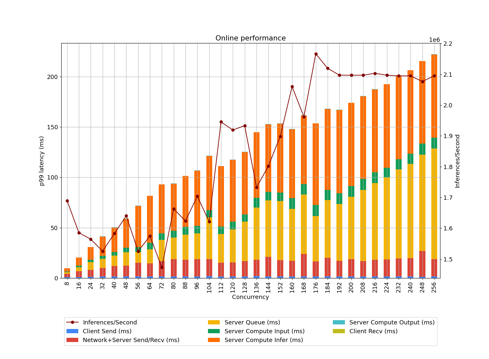</td>
  </tr>
</tbody>
</table>

<details>
<summary>Results Table</summary>

|   Batch |   Concurrency |   Inferences/Second |   Client Send (ms) |   Network+Server Send/Recv (ms) |   Server Queue (ms) |   Server Compute Input (ms) |   Server Compute Infer (ms) |   Server Compute Output (ms) |   Client Recv (ms) |   p50 latency (ms) |   p90 latency (ms) |   p95 latency (ms) |   p99 latency (ms) |   avg latency (ms) |
|--------:|--------------:|--------------------:|-------------------:|--------------------------------:|--------------------:|----------------------------:|----------------------------:|-----------------------------:|-------------------:|-------------------:|-------------------:|-------------------:|-------------------:|-------------------:|
|    2048 |             8 |          1689960.00 |               0.82 |                            3.48 |                1.44 |                        0.82 |                        3.02 |                         0.06 |               0.00 |              10.52 |              11.08 |              11.28 |              11.82 |               9.64 |
|    2048 |            16 |          1585610.00 |               1.10 |                            5.57 |                3.93 |                        1.59 |                        8.20 |                         0.06 |               0.00 |              19.40 |              25.78 |              26.49 |              29.85 |              20.45 |
|    2048 |            24 |          1564670.00 |               1.43 |                            6.54 |                7.94 |                        2.13 |                       12.68 |                         0.07 |               0.00 |              32.02 |              32.82 |              32.97 |              33.25 |              30.80 |
|    2048 |            32 |          1525760.00 |               1.55 |                            8.59 |                8.88 |                        2.97 |                       19.30 |                         0.08 |               0.00 |              45.15 |              50.58 |              57.80 |              61.77 |              41.38 |
|    2048 |            40 |          1583100.00 |               1.55 |                           10.34 |               10.41 |                        3.47 |                       24.54 |                         0.09 |               0.00 |              50.92 |              61.64 |              73.60 |              85.84 |              50.41 |
|    2048 |            48 |          1640450.00 |               1.60 |                           10.56 |               13.58 |                        4.51 |                       28.45 |                         0.12 |               0.00 |              61.22 |              74.89 |              86.59 |              91.35 |              58.82 |
|    2048 |            56 |          1525760.00 |               1.64 |                           13.66 |               10.72 |                        4.76 |                       40.94 |                         0.14 |               0.00 |              78.29 |              90.64 |              91.98 |              97.42 |              71.86 |
|    2048 |            64 |          1574910.00 |               1.59 |                           12.86 |               13.92 |                        6.62 |                       46.63 |                         0.17 |               0.00 |              84.43 |              91.45 |             112.34 |             125.38 |              81.79 |
|    2048 |            72 |          1473090.00 |               1.69 |                           15.22 |               20.89 |                        6.43 |                       48.72 |                         0.20 |               0.00 |              95.13 |             120.03 |             122.96 |             124.02 |              93.14 |
|    2048 |            80 |          1662980.00 |               1.57 |                           17.32 |               21.28 |                        6.73 |                       46.90 |                         0.21 |               0.00 |              95.96 |             132.60 |             135.03 |             148.41 |              94.02 |
|    2048 |            88 |          1624060.00 |               1.61 |                           16.58 |               24.76 |                        7.94 |                       50.47 |                         0.20 |               0.00 |             101.01 |             137.54 |             140.87 |             143.96 |             101.56 |
|    2048 |            96 |          1703940.00 |               1.61 |                           17.20 |               25.42 |                        7.61 |                       54.91 |                         0.20 |               0.00 |             110.98 |             135.92 |             151.28 |             165.95 |             106.95 |
|    2048 |           104 |          1622020.00 |               1.89 |                           17.01 |               41.48 |                        7.07 |                       53.83 |                         0.19 |               0.00 |             122.34 |             135.69 |             146.57 |             168.18 |             121.46 |
|    2048 |           112 |          1945600.00 |               1.74 |                           13.44 |               28.63 |                        7.23 |                       60.03 |                         0.18 |               0.00 |             111.46 |             142.73 |             151.17 |             171.38 |             111.26 |
|    2048 |           120 |          1919100.00 |               1.74 |                           13.70 |               32.97 |                        7.68 |                       61.34 |                         0.18 |               0.00 |             115.54 |             146.44 |             149.95 |             170.00 |             117.61 |
|    2048 |           128 |          1933310.00 |               1.68 |                           15.30 |               38.92 |                        7.28 |                       61.93 |                         0.21 |               0.00 |             127.46 |             148.73 |             167.49 |             180.54 |             125.32 |
|    2048 |           136 |          1732920.00 |               1.79 |                           16.22 |               52.00 |                        9.77 |                       65.01 |                         0.22 |               0.00 |             161.86 |             173.24 |             173.96 |             174.94 |             145.03 |
|    2048 |           144 |          1802240.00 |               1.74 |                           19.45 |               55.78 |                        8.68 |                       67.15 |                         0.20 |               0.00 |             162.88 |             172.74 |             173.50 |             177.37 |             153.00 |
|    2048 |           152 |          1898500.00 |               1.64 |                           16.21 |               58.72 |                        8.35 |                       68.42 |                         0.20 |               0.00 |             163.08 |             172.43 |             173.68 |             178.57 |             153.55 |
|    2048 |           160 |          2060290.00 |               1.74 |                           15.49 |               51.38 |                       10.67 |                       68.51 |                         0.32 |               0.00 |             163.39 |             174.03 |             175.48 |             176.47 |             148.11 |
|    2048 |           168 |          1961980.00 |               1.57 |                           22.56 |               58.75 |                       10.48 |                       68.02 |                         0.21 |               0.00 |             166.14 |             177.22 |             180.09 |             182.40 |             161.58 |
|    2048 |           176 |          2166780.00 |               1.64 |                           14.96 |               45.06 |                       10.78 |                       81.05 |                         0.21 |               0.00 |             136.12 |             200.28 |             201.15 |             204.05 |             153.70 |
|    2048 |           184 |          2119680.00 |               1.60 |                           18.60 |               57.29 |                        9.85 |                       80.64 |                         0.27 |               0.00 |             171.14 |             213.86 |             218.87 |             249.21 |             168.25 |
|    2048 |           192 |          2097150.00 |               1.59 |                           15.68 |               56.32 |                       10.56 |                       82.88 |                         0.22 |               0.00 |             194.18 |             201.81 |             202.93 |             206.86 |             167.26 |
|    2048 |           200 |          2097150.00 |               1.58 |                           17.20 |               61.80 |                       10.67 |                       82.66 |                         0.28 |               0.00 |             197.23 |             214.77 |             220.22 |             223.59 |             174.20 |
|    2048 |           208 |          2097150.00 |               1.55 |                           15.34 |               70.57 |                       11.21 |                       81.81 |                         0.24 |               0.00 |             198.06 |             220.45 |             222.52 |             224.45 |             180.73 |
|    2048 |           216 |          2103300.00 |               1.60 |                           16.60 |               76.06 |                       10.58 |                       82.43 |                         0.24 |               0.00 |             199.23 |             223.14 |             224.37 |             225.89 |             187.51 |
|    2048 |           224 |          2097150.00 |               1.52 |                           16.82 |               81.37 |                        9.81 |                       82.91 |                         0.22 |               0.00 |             210.20 |             220.22 |             220.76 |             221.99 |             192.66 |
|    2048 |           232 |          2095060.00 |               1.52 |                           17.79 |               88.51 |                       10.20 |                       82.63 |                         0.24 |               0.00 |             218.66 |             222.50 |             223.32 |             227.20 |             200.89 |
|    2048 |           240 |          2095060.00 |               1.47 |                           18.26 |               93.63 |                       10.26 |                       82.72 |                         0.25 |               0.00 |             219.27 |             222.50 |             223.44 |             226.30 |             206.61 |
|    2048 |           248 |          2076670.00 |               1.42 |                           25.49 |               95.51 |                       11.06 |                       81.93 |                         0.23 |               0.00 |             221.54 |             224.98 |             227.86 |             232.00 |             215.63 |
|    2048 |           256 |          2095060.00 |               1.46 |                           17.32 |              109.94 |                       10.63 |                       82.65 |                         0.24 |               0.00 |             222.16 |             225.26 |             226.11 |             229.25 |             222.25 |

</details>


## Advanced
|  Inference runtime | Mnemonic used in scripts |
|--------------------|--------------------------|
| [TensorFlow SavedModel](https://www.tensorflow.org/guide/saved_model) | `tf-savedmodel`  |
| [TensorFlow TensorRT](https://docs.nvidia.com/deeplearning/frameworks/tf-trt-user-guide/index.html) | `tf-trt` |
| [ONNX](https://onnx.ai) | `onnx` |
| [NVIDIA TensorRT](https://developer.nvidia.com/tensorrt) | `trt` |


### Step by step deployment process
Commands described below can be used for exporting, converting and profiling the model.

#### Clone Repository
IMPORTANT: This step is executed on the host computer.
<details>
<summary>Clone Repository Command</summary>

```shell
git clone https://github.com/NVIDIA/DeepLearningExamples
cd DeepLearningExamples/TensorFlow2/Recommendation/WideAndDeep
```
</details>

#### Start Triton Inference Server
Setup the environment in the host computer and start Triton Inference Server.
<details>
<summary>Setup Environment and Start Triton Inference Server Command</summary>

```shell
source ./triton/scripts/setup_environment.sh
./triton/scripts/docker/triton_inference_server.sh
```
</details>

#### Setup Container
Build and run a container that extends the NGC TensorFlow2 container with the Triton Inference Server client libraries and dependencies.
<details>
<summary>Setup Container Command</summary>

Build container:

```shell
./triton/scripts/docker/build.sh
```

Run container in interactive mode:

```shell
./triton/scripts/docker/interactive.sh
```

Setup environment in order to share artifacts in steps and with Triton Inference Server:

```shell
source ./triton/scripts/setup_environment.sh
```

</details>


#### Export Model
Export model from Python source to desired format (e.g. Savedmodel or TorchScript)
<details>
<summary>Export Model Command</summary>

```shell
python3 triton/export_model.py \
    --input-path triton/model.py \
    --input-type tf-keras \
    --output-path ${SHARED_DIR}/exported_model.savedmodel \
    --output-type tf-savedmodel \
    --ignore-unknown-parameters \
    \
    --checkpoint-dir ${CHECKPOINTS_DIR}/widedeep_tf2_amp_base_128k_nvtabular/checkpoint \
    --batch-size 131072 \
    --precision fp32 \
    \
    --dataloader triton/dataloader.py \
    --batch-size 131072 \
    --data-pattern "${DATASETS_DIR}/outbrain/valid/*.parquet"
```

</details>


#### Convert Model
Convert the model from training to inference format (e.g. TensorRT).
<details>
<summary>Convert Model Command</summary>

```shell
model-navigator convert \
    --model-name WidenDeep \
    --model-path ${SHARED_DIR}/exported_model.savedmodel \
    --output-path ${SHARED_DIR}/converted_model \
    --target-formats tf-savedmodel \
    --target-precisions fp32 \
    --launch-mode local \
    --override-workspace \
    --verbose \
    \
    --onnx-opsets 13 \
    --max-batch-size 131072 \
    --max-workspace-size 8589934592 \
    --atol wide_deep_model=0.015 \
    --rtol wide_deep_model=12.0
```

</details>


#### Deploy Model
Configure the model on Triton Inference Server.
Generate the configuration from your model repository.
<details>

<summary>Deploy Model Command</summary>

```shell
model-navigator triton-config-model \
    --model-repository ${MODEL_REPOSITORY_PATH} \
    --model-name WidenDeep \
    --model-version 1 \
    --model-path ${SHARED_DIR}/converted_model \
    --model-format tf-savedmodel \
    --model-control-mode explicit \
    --load-model \
    --load-model-timeout-s 120 \
    --verbose \
    \
    --batching dynamic \
    --backend-accelerator amp \
    --tensorrt-precision fp32 \
    --tensorrt-capture-cuda-graph \
    --max-batch-size 131072 \
    --preferred-batch-sizes 131072 \
    --engine-count-per-device gpu=2
```

</details>


#### Triton Performance Offline Test
We want to maximize throughput. It assumes you have your data available
for inference or that your data saturate to maximum batch size quickly.
Triton Inference Server supports offline scenarios with static batching.
Static batching allows inference requests to be served
as they are received. The largest improvements to throughput come
from increasing the batch size due to efficiency gains in the GPU with larger
batches.
<details>
<summary>Triton Performance Offline Test Command</summary>

```shell
python triton/run_performance_on_triton.py \
    --model-repository ${MODEL_REPOSITORY_PATH} \
    --model-name WidenDeep \
    --input-data random \
    --batch-sizes 1 16384 32768 49152 65536 81920 98304 114688 131072 \
    --concurrency 1 \
    --performance-tool perf_analyzer \
    --measurement-request-count 100 \
    --evaluation-mode offline \
    --warmup \
    --result-path ${SHARED_DIR}/triton_performance_offline.csv
```

 </details>


#### Triton Performance Online Test
We want to maximize throughput within latency budget constraints.
Dynamic batching is a feature of Triton Inference Server that allows
inference requests to be combined by the server, so that a batch is
created dynamically, resulting in a reduced average latency.
<details>
<summary>Triton Performance Online Test</summary>

```shell
python triton/run_performance_on_triton.py \
    --model-repository ${MODEL_REPOSITORY_PATH} \
    --model-name WidenDeep \
    --input-data random \
    --batch-sizes 2048 \
    --concurrency 8 16 24 32 40 48 56 64 72 80 88 96 104 112 120 128 136 144 152 160 168 176 184 192 200 208 216 224 232 240 248 256 \
    --performance-tool perf_analyzer \
    --measurement-request-count 500 \
    --evaluation-mode online \
    --warmup \
    --result-path ${SHARED_DIR}/triton_performance_online.csv
```


</details>

### Latency explanation
A typical Triton Inference Server pipeline can be broken down into the following steps:

1. The client serializes the inference request into a message and sends it to
the server (Client Send).
2. The message travels over the network from the client to the server (Network).
3. The message arrives at the server and is deserialized (Server Receive).
4. The request is placed on the queue (Server Queue).
5. The request is removed from the queue and computed (Server Compute).
6. The completed request is serialized in a message and sent back to
the client (Server Send).
7. The completed message then travels over the network from the server
to the client (Network).
8. The completed message is deserialized by the client and processed as
a completed inference request (Client Receive).

Generally, for local clients, steps 1-4 and 6-8 will only occupy
a small fraction of time, compared to step 5. In distributed systems and online processing
where client and server side are connect through network, the send and receive steps might have impact
on overall processing performance. In order to analyze the possible bottlenecks, the detailed
charts are presented in online scenario cases.


## Release Notes
We’re constantly refining and improving our performance on AI
and HPC workloads even on the same hardware with frequent updates
to our software stack. For our latest performance data, refer
to these pages for
[AI](https://developer.nvidia.com/deep-learning-performance-training-inference)
and [HPC](https://developer.nvidia.com/hpc-application-performance) benchmarks.

### Changelog

May 2022
- Initial release

### Known issues

- There are no known issues with this model.
