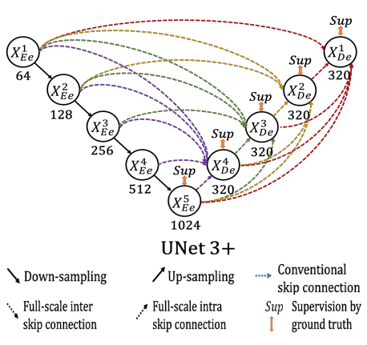

# UNet 3+: A Full-Scale Connected UNet for Medical Image Segmentation

[](https://paperswithcode.com/sota/medical-image-segmentation-on-lits2017?p=unet-3-a-full-scale-connected-unet-for)

This repository provides a script and recipe to train UNet3+ to achieve state of the art accuracy.

**The code and associated performance metrics were contributed by the community and are not maintained by NVIDIA.**

## Table of Contents

- [UNet 3+](https://arxiv.org/abs/2004.08790) for Image Segmentation in Tensorflow 2.0.
    - [Table of Contents](#table-of-contents)
    - [Feature Support Matrix](#feature-support-matrix)
    - [Installation](#installation)
    - [Code Structure](#code-structure)
    - [Config](#config)
    - [Data Preparation](#data-preparation)
    - [Models](#models)
    - [Performance](#performance)
    - [Inference Demo](#inference-demo)
    - [Known issues](#known-issues)
    - [Release notes](#release-notes)

## Feature Support Matrix

The following features are supported by our code base:

|                  Feature                   | UNet3+ Supports |
|:------------------------------------------:|:---------------:|
|                    DALI                    |     &check;     |
|       TensorFlow Multi-GPU Training        |     &check;     |
| TensorFlow Automatic Mixed Precision(AMP)  |     &check;     |
| TensorFlow Accelerated Linear Algebra(XLA) |     &check;     |

#### [NVIDIA DALI](https://docs.nvidia.com/deeplearning/dali/user-guide/docs/index.html)

The NVIDIA Data Loading Library (DALI) is a library for data loading and
pre-processing to accelerate deep learning applications. It provides a
collection of highly optimized building blocks for loading and processing
image, video and audio data. It can be used as a portable drop-in
replacement for built in data loaders and data iterators in popular deep
learning frameworks.

#### [TensorFlow Multi-GPU Training](https://www.tensorflow.org/guide/distributed_training)

Distribute training across multiple GPUs, multiple machines, or TPUs.

#### [TensorFlow Automatic Mixed Precision(AMP)](https://www.tensorflow.org/guide/mixed_precision)

Mixed precision is the use of both 16-bit and 32-bit floating-point types in a model during training to make it run
faster and use less memory. By keeping certain parts of the model in the 32-bit types for numeric stability, the model
will have a lower step time and train equally as well in terms of the evaluation metrics such as accuracy.

#### [TensorFlow Accelerated Linear Algebra(XLA)](https://www.tensorflow.org/xla)

In a TensorFlow program, all of the operations are executed individually by the TensorFlow executor. Each TensorFlow
operation has a precompiled GPU kernel implementation that the executor dispatches to.
XLA provides an alternative mode of running models: it compiles the TensorFlow graph into a sequence of computation
kernels generated specifically for the given model. Because these kernels are unique to the model, they can exploit
model-specific information for optimization.

For details on how to enable these features while training and evaluation see [Benchmarking](#benchmarking) section.

## Installation

* Clone code

```
git clone https://github.com/hamidriasat/NVIDIA-DeepLearningExamples.git
cd NVIDIA-DeepLearningExamples/TensorFlow2/Segmentation/UNet3P/
```

* Build the UNet3P TensorFlow NGC container
  From `Dockerfile` this will create a docker image with name `unet3p`. This image will contain all the components
  required to successfully run the UNet3+ code.

```
docker build -t unet3p .
```

The NGC container contains all the components optimized for usage on NVIDIA hardware.

* Start an interactive session in the NGC container

To run preprocessing/training/inference, following command will launch the container and mount the current directory
to `/workspace/unet3p` as a volume in the container

```
docker run --rm -it --shm-size=1g --ulimit memlock=-1 --pids-limit=8192 --gpus all -p 5012:8888 -v $PWD/:/workspace/unet3p --name unet3p unet3p:latest /bin/bash
```

Here we are mapping external port `5012` to `8888` inside docker. This will be used for visualization purpose.

## Code Structure

- **callbacks**: Custom callbacks to monitor training time, latency and throughput
- **checkpoint**: Model checkpoint and logs directory
- **configs**: Configuration file (see [Config](#config) for more details)
- **data**: Dataset files (see [Data Preparation](#data-preparation) for more details)
- **data_generators**: Data loaders for UNet3+ (see [Data Generators](#data-generators) for more details)
- **data_preparation**: For LiTS data preparation and data verification
- **figures**: Model architecture image
- **losses**: Implementations of UNet3+ hybrid loss function and dice coefficient
- **models**: Unet3+ model files (see [Models](#models) for more details)
- **utils**: Generic utility functions
- **benchmark_inference.py**: Benchmark script to output model throughput and latency while inference
- **evaluate.py**: Evaluation script to validate accuracy on trained model
- **predict.ipynb**: Prediction file used to visualize model output inside notebook(helpful for remote server
  visualization)
- **predict.py**: Prediction script used to visualize model output
- **train.py**: Training script

## Data Preparation

- This code can be used to reproduce UNet3+ paper results
  on [LiTS - Liver Tumor Segmentation Challenge](https://competitions.codalab.org/competitions/15595).
- You can also use it to train UNet3+ on custom dataset.

For dataset preparation read [here](data_preparation/README.md).

## Config

Configurations are passed through `yaml` file. For more details on config file read [here](configs/).

## Data Generators

We support two types of data loaders. `NVIDIA DALI` and `TensorFlow Sequence`
generators. For more details on supported generator types read [here](data_generators/).

## Models

UNet 3+ is latest from Unet family, proposed for semantic image segmentation. it takes advantage of full-scale skip
connections and deep supervisions.The full-scale skip connections incorporate low-level details with high-level
semantics from feature maps in different scales; while the deep supervision learns hierarchical representations from the
full-scale aggregated feature maps.



Figure 1. UNet3+ architecture diagram from [original paper](https://arxiv.org/abs/2004.08790).

This repo contains all three versions of UNet3+.

| #   |                          Description                          |                            Model Name                             | Training Supported |
|:----|:-------------------------------------------------------------:|:-----------------------------------------------------------------:|:------------------:|
| 1   |                       UNet3+ Base model                       |                 [unet3plus](models/unet3plus.py)                  |      &check;       |
| 2   |                 UNet3+ with Deep Supervision                  |     [unet3plus_deepsup](models/unet3plus_deep_supervision.py)     |      &check;       |
| 3   | UNet3+ with Deep Supervision and Classification Guided Module | [unet3plus_deepsup_cgm](models/unet3plus_deep_supervision_cgm.py) |      &cross;       |

Available backbones are `unet3plus`, `vgg16` and  `vgg19`. All backbones are untrained networks.

In our case all results are reported using `vgg19` backbone and  `unet3plus` variant.

[Here](losses/unet_loss.py) you can find UNet3+ hybrid loss.

## Performance

### Benchmarking

The following section shows how to run benchmarks to measure the model performance in training and inference modes.

#### Training performance benchmark

Run the `python train.py` script with the required model configurations to print training benchmark results for each
model
configuration. At the end of the training, a line reporting the training throughput and latency will be printed.

To calculate dice score on trained model call `python evaluate.py` with required parameters.

##### Example 1

To train base model `unet3plus` with `vgg19` backbone on `single GPU`
using `TensorFlow Sequence Generator` without `Automatic Mixed Precision(AMP)` and `Accelerated Linear Algebra(XLA)` run

```
python train.py MODEL.TYPE=unet3plus MODEL.BACKBONE.TYPE=vgg19 \
USE_MULTI_GPUS.VALUE=False \
DATA_GENERATOR_TYPE=TF_GENERATOR \
OPTIMIZATION.AMP=False OPTIMIZATION.XLA=False
```

##### Example 2

To train base model `unet3plus` with `vgg19` backbone on `multiple GPUs`
using `TensorFlow Sequence Generator` without `Automatic Mixed Precision(AMP)` and `Accelerated Linear Algebra(XLA)` run

```
python train.py MODEL.TYPE=unet3plus MODEL.BACKBONE.TYPE=vgg19 \
USE_MULTI_GPUS.VALUE=True USE_MULTI_GPUS.GPU_IDS=-1 \
DATA_GENERATOR_TYPE=TF_GENERATOR \
OPTIMIZATION.AMP=False OPTIMIZATION.XLA=False
```

##### Example 3

To train base model `unet3plus` with `vgg19` backbone on `multiple GPUs`
using `NVIDIA DALI Generator` with `Automatic Mixed Precision(AMP)` and `Accelerated Linear Algebra(XLA)` run

```
python train.py MODEL.TYPE=unet3plus MODEL.BACKBONE.TYPE=vgg19 \
USE_MULTI_GPUS.VALUE=True USE_MULTI_GPUS.GPU_IDS=-1 \
DATA_GENERATOR_TYPE=DALI_GENERATOR \
OPTIMIZATION.AMP=True OPTIMIZATION.XLA=True
```

To evaluate/calculate dice accuracy of model pass same parameters to `evaluate.py` file.

Please check [Config](configs/config.yaml) file for more details about default training parameters.

#### Inference performance benchmark

To benchmark inference time, run the `python benchmark_inference.py` script with the required model configurations to
print
inference benchmark results for each model configuration. At the end, a line reporting the inference throughput and
latency will be printed.

For inference run without `data generator` and `GPUs` details but with `batch size`, `warmup_steps`
and `bench_steps`
parameters.

```
python benchmark_inference.py MODEL.TYPE=unet3plus MODEL.BACKBONE.TYPE=vgg19 \
HYPER_PARAMETERS.BATCH_SIZE=16 \
OPTIMIZATION.AMP=False OPTIMIZATION.XLA=False \
+warmup_steps=50 +bench_steps=100
```

Each of these scripts will by default run a warm-up for 50 iterations and then start benchmarking for another 100
steps.
You can adjust these settings with `+warmup_steps` and `+bench_steps` parameters.

### Results

The following section provide details of results that are achieved in different settings of model training and
inference.

**These results were contributed by the community and are not maintained by NVIDIA.**

#### Training accuracy results

###### Training accuracy: NVIDIA DGX A100 (8xA100 80G)

| #GPU | Generator |   XLA   |   AMP   | Training Time<br/>HH:MM:SS &darr; | Latency Avg [ms] &darr; | Throughput Avg [img/s] &uarr; | Speed Up  | Dice Score |
|:----:|:---------:|:-------:|:-------:|:---------------------------------:|:-----------------------:|:-----------------------------:|:---------:|:----------:|
|  1   |    TF     | &cross; | &cross; |            51:38:24.24            |         616.14          |             25.97             |    ---    |  0.96032   |
|  8   |    TF     | &cross; | &cross; |             11:30:45              |         999.39          |            128.08             | 1x (base) |  0.95224   |
|  8   |   DALI    | &cross; | &cross; |              6:23:43              |         614.26          |            208.38             |   1.8x    |  0.94566   |
|  8   |   DALI    | &check; | &cross; |              7:33:15              |         692.71          |            184.78             |   1.5x    |  0.94806   |
|  8   |   DALI    | &cross; | &check; |              3:49:55              |         357.34          |             358.2             |    3x     |  0.94786   |
|  8   |   DALI    | &check; | &check; |              3:14:24              |         302.83          |            422.68             |   3.5x    |   0.9474   |

Latency is reported in milliseconds per batch whereas throughput is reported in images per second.
Speed Up comparison is efficiency achieved in terms of training time between different runs.

Note: Training time includes time to load cuDNN in first iteration and the first epoch which take little longer as
compared to later epochs because in first epoch tensorflow optimizes the training graph. In terms of latency and
throughput it does not matter much because we have trained networks for 100 epochs which normalizes this during
averaging.

#### Inference performance results

###### Inference performance: NVIDIA DGX A100 (1xA100 80G)

| Batch Size |   XLA   |   AMP   | Latency Avg [ms] &darr; | Throughput Avg [img/s] &uarr; |
|:----------:|:-------:|:-------:|:-----------------------:|:-----------------------------:|
|     1      | &cross; | &cross; |          59.54          |             16.79             |
|     1      | &check; | &cross; |          70.59          |             14.17             |
|     1      | &cross; | &check; |          56.17          |             17.80             |
|     1      | &check; | &check; |          55.54          |             18.16             |
|     16     | &cross; | &cross; |         225.59          |             70.93             |
|     16     | &check; | &cross; |         379.93          |             43.15             |
|     16     | &cross; | &check; |         184.98          |             87.02             |
|     16     | &check; | &check; |         153.65          |             103.6             |

Inference results are tested on single gpu. Here data generator type does not matter because only prediction time
is calculated and averaged between 5 runs.

## Inference Demo

Model output can be visualized from Jupyter Notebook. Use below command to start Jupyter Lab on port `8888`.

```
jupyter lab --no-browser --allow-root --ip=0.0.0.0 --port=8888
```

While starting container we mapped system port `5012` to `8888` inside docker.
> Note: Make sure you have server network ip and port access in case you are working with remote sever.

Now in browser go to link `http://<server ip here>:5012/` to access Jupyter Lab.
Open [predict.ipynb](predict.ipynb) notebook and rerun the whole notebook to visualize model output.

There are two options for visualization, you can

1. Visualize from directory

It's going to make prediction and show all images from given directory. Useful for detailed evaluation.

2. Visualize from list

It's going to make prediction on elements of given list. Use for testing on specific cases.

For custom data visualization set `SHOW_CENTER_CHANNEL_IMAGE=False`. This should set True for only UNet3+ LiTS data.

For further details on visualization options see [predict.ipynb](predict.ipynb) notebook.

## Known issues

There are no known issues in this release.

## Release notes

### Changelog

Feb 2023

- Initial release

We appreciate any feedback so reporting problems, and asking questions are welcomed here.

Licensed under [Apache-2.0 License](LICENSE)
