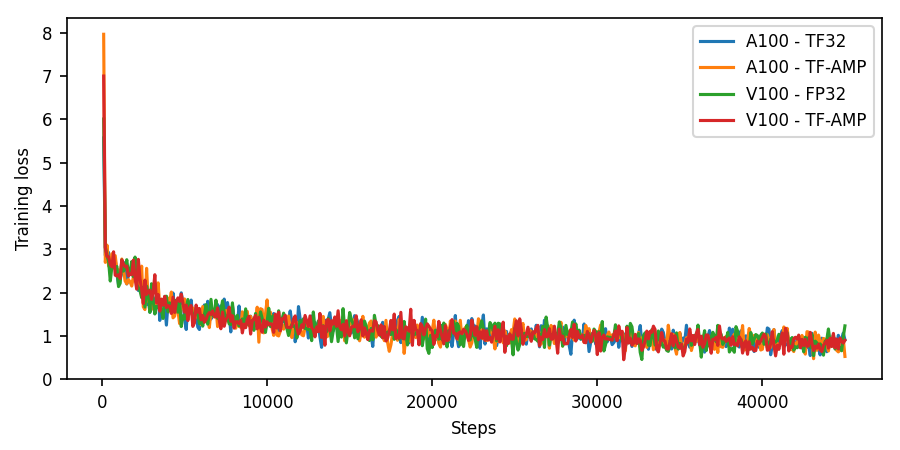
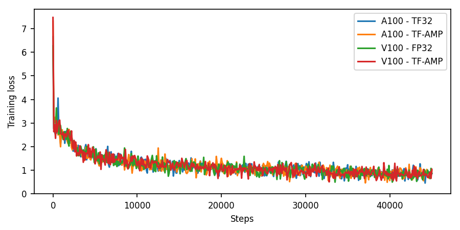

# Mask R-CNN For Tensorflow

This repository provides a script and recipe to train the Mask R-CNN model for Tensorflow to achieve state-of-the-art accuracy, and is tested and maintained by NVIDIA.

## Table of Contents
 
- [Model overview](#model-overview)
   * [Model architecture](#model-architecture)
   * [Default configuration](#default-configuration)
   * [Feature support matrix](#feature-support-matrix)
     * [Features](#features)
   * [Mixed precision training](#mixed-precision-training)
     * [Enabling mixed precision](#enabling-mixed-precision)
     * [Enabling TF32](#enabling-tf32)
- [Setup](#setup)
   * [Requirements](#requirements)
- [Quick Start Guide](#quick-start-guide)
- [Advanced](#advanced)
   * [Scripts and sample code](#scripts-and-sample-code)
   * [Parameters](#parameters)
   * [Command-line options](#command-line-options)
   * [Getting the data](#getting-the-data)
     * [Dataset guidelines](#dataset-guidelines)
     * [Multi-dataset](#multi-dataset)
   * [Training process](#training-process)
   * [Inference process](#inference-process)
- [Performance](#performance)   
   * [Benchmarking](#benchmarking)
     * [Training performance benchmark](#training-performance-benchmark)
     * [Inference performance benchmark](#inference-performance-benchmark)
    * [Results](#results)
        * [Training accuracy results TensorFlow 1.1x](#training-accuracy-results-tensorflow-11x)
            * [Training accuracy: NVIDIA DGX A100 (8x A100 40GB)](#training-accuracy-nvidia-dgx-a100-8x-a100-40gb)  
            * [Training accuracy: NVIDIA DGX-1 (8x V100 16GB)](#training-accuracy-nvidia-dgx-1-8x-v100-16GB)
        * [Training performance results Tensorflow 1.1x](#training-performance-results-tensorflow-11x)
            * [Training performance: NVIDIA DGX A100 (8x A100 40GB)](#training-performance-nvidia-dgx-a100-8x-a100-40gb) 
            * [Training performance: NVIDIA DGX-1 (8x V100 16GB)](#training-performance-nvidia-dgx-1-8x-v100-16gb)
        * [Training accuracy results TensorFlow 2.x](#training-accuracy-results-tensorflow-2x)
            * [Training accuracy: NVIDIA DGX A100 (8x A100 40GB)](#training-accuracy-nvidia-dgx-a100-8x-a100-40gb-1)  
            * [Training accuracy: NVIDIA DGX-1 (8x V100 16GB)](#training-accuracy-nvidia-dgx-1-8x-v100-16gb-1)
        * [Training performance results Tensorflow 2.x](#training-performance-results-tensorflow-2x)
            * [Training performance: NVIDIA DGX A100 (8x A100 40GB)](#training-performance-nvidia-dgx-a100-8x-a100-40gb-1) 
            * [Training performance: NVIDIA DGX-1 (8x V100 16GB)](#training-performance-nvidia-dgx-1-8x-v100-16gb-1)
        * [Inference performance results TensorFlow 1.1x](#inference-performance-results-tensorflow-11x)
            * [Inference performance: NVIDIA DGX A100 (1x A100 40GB)](#inference-performance-nvidia-dgx-a100-1x-a100-40gb)
            * [Inference performance: NVIDIA DGX-1 (1x V100 16GB)](#inference-performance-nvidia-dgx-1-1x-v100-16gb)
        * [Inference performance results TensorFlow 2.x](#inference-performance-results-tensorflow-2x)
            * [Inference performance: NVIDIA DGX A100 (1x A100 40GB)](#inference-performance-nvidia-dgx-a100-1x-a100-40gb-1)
            * [Inference performance: NVIDIA DGX-1 (1x V100 16GB)](#inference-performance-nvidia-dgx-1-1x-v100-16gb-1)
- [Release notes](#release-notes)
   * [Changelog](#changelog)
   * [Known issues](#known-issues)

## Model overview

Mask R-CNN is a convolution-based neural network for the task of object instance segmentation. The paper describing the model can be found [here](https://arxiv.org/abs/1703.06870). NVIDIA’s Mask R-CNN 20.06 is an optimized version of [Google's TPU implementation](https://github.com/tensorflow/tpu/tree/master/models/official/mask_rcnn), leveraging mixed precision arithmetic using Tensor Cores on NVIDIA Volta, Turing, and Ampere GPUs while maintaining target accuracy. 

This model is trained with mixed precision using Tensor Cores on Volta, Turing, and the NVIDIA Ampere GPU architectures. Therefore, researchers can get results  2.2x faster than training without Tensor Cores, while experiencing the benefits of mixed precision training. This model is tested against each NGC monthly container release to ensure consistent accuracy and performance over time.

This repository also contains scripts to interactively launch training, 
benchmarking and inference routines in a Docker container.

The major differences between the official implementation of the paper and our version of Mask R-CNN are as follows:

- Mixed precision support with [TensorFlow AMP](https://docs.nvidia.com/deeplearning/frameworks/tensorflow-user-guide/index.html#tfamp).
- Gradient accumulation to simulate larger batches.
- Custom fused CUDA kernels for faster computations.

There are other publicly NVIDIA available implementations of Mask R-CNN:

- [NVIDIA PyTorch implementation](https://github.com/NVIDIA/DeepLearningExamples/tree/master/PyTorch/Segmentation/MaskRCNN)
- [Matterport](https://github.com/matterport/Mask_RCNN)
- [Tensorpack](https://github.com/tensorpack/tensorpack/tree/master/examples/FasterRCNN)

### Model architecture

Mask R-CNN builds on top of Faster R-CNN adding an additional mask head for the task of image segmentation.

The architecture consists of the following:

- ResNet-50 backbone with Feature Pyramid Network (FPN)
- Region proposal network (RPN) head
- RoI Align
- Bounding and classification box head
- Mask head

### Default configuration

The Mask R-CNN configuration and the hyper-parameters for training and testing purposes are in separate files.
The default configuration of this model can be found at `mask-rcnn/hyperparameters/mask_rcnn_params.py`. 

The default configuration is as follows:

  - Feature extractor:
    - Images resized with aspect ratio maintained and smaller side length between [832,1344]
    - Ground Truth mask size 112
    - Backbone network weights are frozen after second epoch

  - RPN:
    - Anchor stride set to 16
    - Anchor sizes set to (32, 64, 128, 256, 512)
    - Foreground IOU Threshold set to 0.7, Background IOU Threshold set to 0.3
    - RPN target fraction of positive proposals set to 0.5
    - Train Pre-NMS Top proposals set to 2000 per FPN layer
    - Train Post-NMS Top proposals set to 1000
    - Test Pre-NMS Top proposals set to 1000 per FPN layer
    - Test Post-NMS Top proposals set to 1000
    - RPN NMS Threshold set to 0.7

  - RoI heads:
    - Foreground threshold set to 0.5
    - Batch size per image set to 512
    - Positive fraction of batch set to 0.25

The default hyper-parameters can be found at `mask-rcnn/hyperparameters/cmdline_utils.py`. 
These hyperparameters can be overridden through the command-line options, in the launch scripts.

### Feature support matrix

The following features are supported by this model:

| **Feature** | **Mask R-CNN** |
-------------|---------------------|
| Automatic mixed precision (AMP) | Yes |
| Horovod Multi-GPU (NCCL)        | Yes |
| Accelerated Linear Algebra (XLA)| Yes |     

#### Features

**Automatic Mixed Precision (AMP)**
 
This implementation of Mask-RCNN uses AMP to implement mixed precision training. It allows us to use FP16 training with FP32 master weights by modifying just a few lines of code.
 
**Horovod**
 
Horovod is a distributed training framework for TensorFlow, Keras, PyTorch, and MXNet. The goal of Horovod is to make distributed deep learning fast and easy to use. For more information about how to get started with Horovod, see the [Horovod: Official repository](https://github.com/horovod/horovod).
 
Multi-GPU training with Horovod
 
Our model uses Horovod to implement efficient multi-GPU training with NCCL. For details, see example sources in this repository or see the [TensorFlow tutorial](https://github.com/horovod/horovod/#usage).
 
**XLA support (experimental)**
 
XLA is a domain-specific compiler for linear algebra that can accelerate TensorFlow models with potentially no source code changes. The results are improvements in speed and memory usage: most internal benchmarks run ~1.1-1.5x faster after XLA is enabled.

### Mixed precision training

Mixed precision is the combined use of different numerical precisions in a computational method. [Mixed precision](https://arxiv.org/abs/1710.03740) training offers significant computational speedup by performing operations in half-precision format while storing minimal information in single-precision to retain as much information as possible in critical parts of the network. Since the introduction of [Tensor Cores](https://developer.nvidia.com/tensor-cores) in the Volta and Turing architecture, significant training speedups are experienced by switching to mixed precision -- up to 3x overall speedup on the most arithmetically intense model architectures. Using [mixed precision training](https://docs.nvidia.com/deeplearning/performance/mixed-precision-training/index.html) previously required two steps:
1.  Porting the model to use the FP16 data type where appropriate.    
2.  Adding loss scaling to preserve small gradient values.

This can now be achieved using Automatic Mixed Precision (AMP) for TensorFlow to enable the full [mixed precision methodology](https://docs.nvidia.com/deeplearning/sdk/mixed-precision-training/index.html#tensorflow) in your existing TensorFlow model code.  AMP enables mixed precision training on Volta and Turing GPUs automatically. The TensorFlow framework code makes all necessary model changes internally.

In TF-AMP, the computational graph is optimized to use as few casts as necessary and maximize the use of FP16, and the loss scaling is automatically applied inside of supported optimizers. AMP can be configured to work with the existing tf.contrib loss scaling manager by disabling the AMP scaling with a single environment variable to perform only the automatic mixed-precision optimization. It accomplishes this by automatically rewriting all computation graphs with the necessary operations to enable mixed precision training and automatic loss scaling.

-   How to train using mixed precision, see the [Mixed Precision Training](https://arxiv.org/abs/1710.03740) paper and [Training With Mixed Precision](https://docs.nvidia.com/deeplearning/performance/mixed-precision-training/index.html) documentation.
-   Techniques used for mixed precision training, see the [Mixed-Precision Training of Deep Neural Networks](https://devblogs.nvidia.com/mixed-precision-training-deep-neural-networks/) blog.
-   How to access and enable AMP for TensorFlow, see [Using TF-AMP](https://docs.nvidia.com/deeplearning/dgx/tensorflow-user-guide/index.html#tfamp) from the TensorFlow User Guide.

#### Enabling mixed precision

Mixed precision is enabled in TensorFlow by using the Automatic Mixed Precision (TF-AMP) extension which casts variables to half-precision upon retrieval, while storing variables in single-precision format. Furthermore, to preserve small gradient magnitudes in backpropagation, a [loss scaling](https://docs.nvidia.com/deeplearning/sdk/mixed-precision-training/index.html#lossscaling) step must be included when applying gradients. In TensorFlow, loss scaling can be applied statically by using simple multiplication of loss by a constant value or automatically, by TF-AMP. Automatic mixed precision makes all the adjustments internally in TensorFlow, providing two benefits over manual operations. First, programmers need not modify network model code, reducing development and maintenance effort. Second, using AMP maintains forward and backward compatibility with all the APIs for defining and running TensorFlow models.

#### Enabling TF32

TensorFloat-32 (TF32) is the new math mode in [NVIDIA A100](https://www.nvidia.com/en-us/data-center/a100/) GPUs for handling the matrix math also called tensor operations. TF32 running on Tensor Cores in A100 GPUs can provide up to 10x speedups compared to single-precision floating-point math (FP32) on Volta GPUs. 

TF32 Tensor Cores can speed up networks using FP32, typically with no loss of accuracy. It is more robust than FP16 for models which require high dynamic range for weights or activations.

For more information, refer to the [TensorFloat-32 in the A100 GPU Accelerates AI Training, HPC up to 20x](https://blogs.nvidia.com/blog/2020/05/14/tensorfloat-32-precision-format/) blog post.

TF32 is supported in the NVIDIA Ampere GPU architecture and is enabled by default.

## Setup

The following section lists the requirements that you need to meet in order to start training the Mask R-CNN model.

### Requirements

This repository contains Dockerfile which extends the TensorFlow NGC container and encapsulates some dependencies. 
Aside from these dependencies, ensure you have the following components:

- [NVIDIA Docker](https://github.com/NVIDIA/nvidia-docker)
- TensorFlow 20.06-tf1-py3 [NGC container](https://ngc.nvidia.com/registry/nvidia-tensorflow)
- GPU-based architecture:
    - [NVIDIA Volta](https://www.nvidia.com/en-us/data-center/volta-gpu-architecture/)
    - [NVIDIA Turing](https://www.nvidia.com/en-us/geforce/turing/)
    - [NVIDIA Ampere architecture](https://www.nvidia.com/en-us/data-center/nvidia-ampere-gpu-architecture/)


For more information about how to get started with NGC containers, see the following sections from the 
NVIDIA GPU Cloud Documentation and the Deep Learning Documentation:

-   [Getting Started Using NVIDIA GPU Cloud](https://docs.nvidia.com/ngc/ngc-getting-started-guide/index.html)
-   [Accessing And Pulling From The NGC Container Registry](https://docs.nvidia.com/deeplearning/frameworks/user-guide/index.html#accessing_registry)
-   Running [TensorFlow](https://docs.nvidia.com/deeplearning/frameworks/tensorflow-release-notes/running.html#running)

For those unable to use the TensorFlow NGC container, to set up the required environment or create your own 
container, see the versioned 
[NVIDIA Container Support Matrix](https://docs.nvidia.com/deeplearning/frameworks/support-matrix/index.html).

## Quick Start Guide

To train your model using mixed precision with Tensor Cores or using 32-bit, perform the following steps using 
the default parameters of the Mask R-CNN model on the COCO 2014 dataset.

1. Clone the repository.

    ```bash
    git clone https://github.com/NVIDIA/DeepLearningExamples.git
    cd DeepLearningExamples/TensorFlow/Segmentation/MaskRCNN
    ```

2.  Build the Mask R-CNN TensorFlow NGC container.

    **For TensorFlow 1.1x:** `bash ./scripts/docker/build_tf1.sh`

    **For TensorFlow 2.x:** `bash ./scripts/docker/build_tf2.sh`

3.  Start an interactive session in the NGC container to run training/inference.

    Run the following command to launch the Docker container, the only argument is the *absolute path* to the 
    `data directory` which holds or will hold the `tfrecords` data. If data has not already been downloaded in the `data directory` then download it in step 4, else step 4 can be skipped.
    
    **For TensorFlow 1.1x:** `bash ./scripts/docker/launch_tf1.sh [data directory]`    
    
    **For TensorFlow 2.x:** `bash ./scripts/docker/launch_tf2.sh [data directory]`

4.  Download and preprocess the dataset.

    This repository provides scripts to download and extract the [COCO 2017 dataset](http://cocodataset.org/#download).  
    If you already have the data then you do not need to run the following script, proceed to downloading the pre-trained weights. 
    Data will be downloaded to the `data directory` provided in step 3.
    
    ```bash
    cd dataset
    bash download_and_preprocess_coco.sh /data
    ```

    By default, the data is organized into the following structure:

    ```bash
    <data/dir>
    annotations/
      instances_train2017.json
      instances_val2017.json
    train2017/
      COCO_train2017_*.jpg
    val2017/
      COCO_val2017_*.jpg
    ```

    This repository also provides scripts to download the pre-trained weights of ResNet-50 backbone. 
    The script will make a new directory with the name `weights` in the current directory and 
    download the pre-trained weights in it.

    ```bash
    ./download_and_process_pretrained_weights.sh
    ```

    Ensure that the `weights` folder created has a `resnet` folder in it. Inside the `resnet` folder there 
    should be 3 folders for checkpoints and weights: `extracted_from_maskrcnn`, `resnet-nhwc-2018-02-07` and 
    `resnet-nhwc-2018-10-14`. Before moving to the next step, ensure the above folders are not empty.


5. Start training.
    
    To run training for a default configuration (on 1/4/8 GPUs, AMP/32-bit), run one of the scripts in the 
    `./scripts` directory called `./scripts/train{_AMP}_{1,4,8}GPU.sh`. For example: 
    
    `bash ./scripts/train_AMP_8GPU.sh`

    The above script trains a model and performs an evaluation on the COCO 2017 dataset. By default, this training script:

    -  Uses 8 GPUs.
    -  Saves a checkpoint every 3696 iterations and at the end of training. All checkpoints, evaluation results and training logs are saved to the `/results` directory (in the container which can be mounted to a local directory).
    -  Mixed precision training with Tensor Cores.

6. Start validation/evaluation.

    - For evaluation with AMP precision: `bash ./scripts/evaluation_AMP.sh`
    - For evaluation with 32-bit precision: `bash ./scripts/evaluation.sh`

## Advanced

The following sections provide greater details of the dataset, running training and inference, and the training results.

### Scripts and sample code

Descriptions of the key scripts and folders are provided below.

-  `mask_rcnn` - Contains codes to build individual components of the model such as 
backbone, FPN, RPN, mask and bbox heads etc.
-  `download_and_process_pretrained_weights.sh` - Can be used to download backbone pre-trained weights.
-  `scripts/` - A folder that contains shell scripts to train the model and perform inferences.
    -   `train{_AMP}_{1,4,8}GPU.sh` - Training script on 1, 4, 8 GPUs with AMP or 32-bit precision.
    -   `evaluation_{AMP}.sh` - Evaluations script on either AMP precision or 32-bit precision.
    -   `benchmark_training.py` - Script for running train performance benchmarks.
    -   `benchmark_inference.py` - Script for running inference performance benchmarks.
-  `dataset/` - A folder that contains shell scripts and Python files to download the dataset.
-  `mask_rcnn_main.py` - Is the main function that is the starting point for the training and evaluation process.
-  `docker/` - A folder that contains scripts to build a Docker image and start an interactive session.

### Parameters

#### `mask_rcnn_main.py` script parameters

You can modify the training behavior through the various flags in both the `train_net.py` script and through overriding specific parameters in the config files. Flags in the `mask_rcnn_main.py` script are as follows:

-   `--mode` - Specifies the action to take like `train`, `train_and_eval` or `eval`.
-   `--checkpoint` - The checkpoint of the backbone.
-   `--eval_samples` - Number of samples to evaluate.
-   `--init_learning_rate` - Initial learning rate.
-   `--learning_rate_steps` - Specifies at which steps to reduce the learning rate.
-   `--num_steps_per_eval` - Specifies after how many steps of training evaluation should be performed.
-   `--total_steps` - Specifies the total number of steps for which training should be run.
-   `--train_batch_size` - Training batch size per GPU.
-   `--eval_batch_size` - Evaluation batch size per GPU.
-   `--amp` - Specifies to use AMP precision or 32-bit.
-   `--xla` - Specifies to use XLA (Accelerated Linear Algebra) of TensorFlow or not.

### Command-line options

To see the full list of available options and their descriptions, use the `-h` or `--help` command-line option, for example:
`python mask_rcnn_main.py --helpfull`

### Getting the data

The Mask R-CNN model was trained on the COCO 2017 dataset.  This dataset comes with a training and validation set.

This repository contains the `./dataset/download_and_preprocess_coco.sh` script which automatically downloads and preprocesses the training and validation sets. The helper scripts are also present in the `dataset/` folder.

#### Dataset guidelines

The data should be organized into the following structure:

```bash
<data/dir>
annotations/
  instances_train2017.json
  instances_val2017.json
train2017/
  COCO_train2017_*.jpg
val2017/
  COCO_val2017_*.jpg
```

### Training process

Training is performed using the `mask_rcnn_main.py` script along with parameters defined in the config files. 
The default config files can be found in the 
`mask_rcnn_tf/mask_rcnn/mask_rcnn_params.py, mask_rcnn_tf/mask_rcnn/cmd_utils.py` files. To specify which GPUs to train on, `CUDA_VISIBLE_DEVICES` variable can be changed in the training scripts
provided in the `scripts` folder. 

This script outputs results to the `/results` directory by default. The training log will contain information about:

-   Loss, time per iteration, learning rate and memory metrics
-   Performance values such as throughput per step
-   Test accuracy and test performance values after evaluation

### Inference process

To run inference run `mask_rcnn_main.py` with commandline parameter 
`mode=eval`. To run inference with a checkpoint, set the commandline 
parameter `--model_dir` to `[absolute path of checkpoint folder]`.

The inference log will contain information about:

-   Inference time per step
-   Inference throughput per step
-   Evaluation accuracy and performance values


## Performance

### Benchmarking

The following section shows how to run benchmarks measuring the model performance in training and inference modes.

#### Training performance benchmark

To run training benchmarking on a selected number of GPUs with either AMP or 32-bit precision, run the following script:

```bash
python scripts/benchmark_training.py --gpus {1,4,8} --batch_size {2,4} [--amp]
```

#### Inference performance benchmark

To run inference benchmarking on a single GPU with either AMP or 32-bit precision, run the following script:

```bash
python scripts/benchmark_inference.py --batch_size {2,4,8} [--amp]
```

### Results

The following sections provide details on how we achieved our performance and accuracy in training and inference.

#### Training accuracy results Tensorflow 1.1x

##### Training accuracy: NVIDIA DGX A100 (8x A100 40GB)
 
Our results were obtained by building and launching the docker containers for TensorFlow 1.1x `./scripts/docker/build_tf1.sh`, `bash ./scripts/docker/launch_tf1.sh [data directory]` respectively and running the `scripts/train{_AMP}_{1,4,8}GPU.sh`  training script on NVIDIA DGX A100 (8x A100 40GB) GPUs.

| GPUs | Batch size / GPU | Precision | Final AP BBox | Final AP Segm | Time to train  | Time to train speedup |
|------|------------------|-----------|---------------|---------------|----------------|-----------------------|
| 8    | 4                | TF32      | 0.3777        | 0.3435        | 5 h            | -                     |
| 8    | 4                | AMP       | 0.3782        | 0.3432        | 4 h            | 1.25                  |

##### Training accuracy: NVIDIA DGX-1 (8x V100 16GB)

Our results were obtained by building and launching the docker containers for TensorFlow 1.1x `./scripts/docker/build_tf1.sh`, `bash ./scripts/docker/launch_tf1.sh [data directory]` respectively and running the `scripts/train{_AMP}_{1,4,8}GPU.sh`  training script on NVIDIA DGX-1 with 8x V100 16GB GPUs.

| GPUs | Batch size / GPU | Precision | Final AP BBox | Final AP Segm | Time to train  | Time to train speedup |
|------|------------------|-----------|---------------|---------------|----------------|-----------------------|
| 8    | 4                | FP32      | 0.3767        | 0.3420        | 14 h           | -                     |
| 8    | 4                | AMP       | 0.3770        | 0.3423        | 9 h            | 1.50                  |

**Learning curves**

The following image shows the training loss as a function of iteration for training using DGX A100 (TF32 and TF-AMP) and DGX-1 V100 (FP32 and TF-AMP).



#### Training performance results Tensorflow 1.1x

##### Training performance: NVIDIA DGX A100 (8x A100 40GB)

Our results were obtained by running `python scripts/benchmark_training.py --gpus {1,4,8} --batch_size {2,4} [--amp]` benchmark script in the TensorFlow 1.1x 20.06-py3 
NGC container on NVIDIA DGX A100 (8x A100 40GB) GPUs. Performance numbers (in images per second) were averaged over 200 steps omitting the first 100 warm-up steps.

| GPUs | Batch size / GPU | Throughput - TF32 [img/s] | Throughput - mixed precision [img/s] | Throughput speedup (TF32 - mixed precision) | Weak scaling - TF32 | Weak scaling - mixed precision |
|---|---|-------|--------|------|------|------|
| 1 | 2 | 11.38 | 18.51  | 1.63 | -    | -    |
| 1 | 4 | 12.49 | 21.20  | 1.70 | -    | -    |
| 4 | 2 | 43.95 | 65.74  | 1.50 | 3.86 | 3.55 |
| 4 | 4 | 48.26 | 72.96  | 1.51 | 3.86 | 3.44 |
| 8 | 2 | 81.69 | 114.59 | 1.40 | 7.18 | 6.19 |
| 8 | 4 | 89.02 | 132.31 | 1.49 | 7.13 | 6.24 |

##### Training performance: NVIDIA DGX-1 (8x V100 16GB)

Our results were obtained by running `python scripts/benchmark_training.py --gpus {1,4,8} --batch_size {2,4} [--amp]` benchmark script in the TensorFlow 1.1x 20.06-py3 
NGC container on NVIDIA DGX-1 V100 (8x V100 16GB) GPUs. Performance numbers (in images per second) were averaged over 200 steps omitting the first 100 warm-up steps.

| GPUs | Batch size / GPU | Throughput - FP32 [img/s] | Throughput - mixed precision [img/s] | Throughput speedup (FP32 - mixed precision) | Weak scaling - TF32 | Weak scaling - mixed precision |
|---|---|-------|-------|------|------|------|
| 1 | 2 | 6.37  | 12.19 | 1.91 | -    | -    |
| 1 | 4 | 6.79  | 12.79 | 1.88 | -    | -    |
| 4 | 2 | 23.32 | 30.82 | 1.32 | 3.66 | 2.53 |
| 4 | 4 | 22.96 | 36.45 | 1.59 | 3.38 | 2.85 |
| 8 | 2 | 40.18 | 58.41 | 1.45 | 6.31 | 4.79 |
| 8 | 4 | 42.65 | 62.80 | 1.47 | 6.28 | 4.91 |

To achieve these same results, follow the steps in the [Quick Start Guide](#quick-start-guide).

#### Training accuracy results Tensorflow 2.x

##### Training accuracy: NVIDIA DGX A100 (8x A100 40GB)
 
Our results were obtained by running the `scripts/train{_AMP}_{1,4,8}GPU.sh`  training script in the 
TensorFlow 20.06-py3 NGC container on NVIDIA DGX A100 (8x A100 40GB) GPUs.

| GPUs | Batch size / GPU | Precision | Final AP BBox | Final AP Segm | Time to train  | Time to train speedup |
|------|------------------|-----------|---------------|---------------|----------------|-----------------------|
| 8    | 4                | TF32      | 0.3783        | 0.3400        | 5 h            | -                     |
| 8    | 4                | AMP       | 0.3796        | 0.3415        | 4 h            | 1.25                  |


##### Training accuracy: NVIDIA DGX-1 (8x V100 16GB)

Our results were obtained by running the `scripts/train{_AMP}_{1,4,8}GPU.sh`  training script in the 
TensorFlow 20.06-py3 NGC container on NVIDIA DGX-1 V100 (8x V100 16GB) GPUs.

| GPUs | Batch size / GPU | Precision | Final AP BBox | Final AP Segm | Time to train  | Time to train speedup |
|------|------------------|-----------|---------------|---------------|----------------|-----------------------|
| 8    | 4                | FP32      | 0.3784        | 0.3400        | 14 h           | -                     |
| 8    | 4                | AMP       | 0.3786        | 0.3410        | 9 h            | 1.50                  |

**Learning curves**

The following image shows the training loss as a function of iteration for training using DGX A100 (TF32 and TF-AMP) and DGX-1 V100 (FP32 and TF-AMP).



#### Training performance results Tensorflow 2.x

##### Training performance: NVIDIA DGX A100 (8x A100 40GB)

Our results were obtained by running `python scripts/benchmark_training.py --gpus {1,4,8} --batch_size {2,4} [--amp]` benchmark script in the TensorFlow 2.x 20.06-py3 
NGC container on NVIDIA DGX A100 (8x A100 40GB) GPUs. Performance numbers (in images per second) were averaged over 200 steps omitting the first 100 warm-up steps.

| GPUs | Batch size / GPU | Throughput - TF32 [img/s] | Throughput - mixed precision [img/s] | Throughput speedup (TF32 - mixed precision) | Weak scaling - TF32 | Weak scaling - mixed precision |
|---|---|-------------|-------------|------|------|------|
| 1 | 2 | 11.83822087 | 18.5130037  | 1.56 | -    | -    |
| 1 | 4 | 12.67925418 | 19.93965192 | 1.57 | -    | -    |
| 4 | 2 | 44.50704695 | 58.11168627 | 1.31 | 3.76 | 3.14 |
| 4 | 4 | 47.38663139 | 64.66523539 | 1.36 | 3.74 | 3.24 |
| 8 | 2 | 80.21134592 | 110.9716499 | 1.38 | 6.78 | 5.99 |
| 8 | 4 | 89.93247608 | 150.0217503 | 1.67 | 7.09 | 7.52 |

##### Training performance: NVIDIA DGX-1 (8x V100 16GB)

Our results were obtained by running `python scripts/benchmark_training.py --gpus {1,4,8} --batch_size {2,4} [--amp]` benchmark script in the TensorFlow 2.x 20.06-py3 
NGC container on NVIDIA DGX-1 V100 (8x V100 16GB) GPUs. Performance numbers (in images per second) were averaged over 200 steps omitting the first 100 warm-up steps.

| GPUs | Batch size / GPU | Throughput - FP32 [img/s] | Throughput - mixed precision [img/s] | Throughput speedup (FP32 - mixed precision) | Weak scaling - TF32 | Weak scaling - mixed precision |
|---|---|-------|-------|------|------|------|
| 1 | 2 | 5.70  | 11.63 | 2.04 | -    | -    |
| 1 | 4 | 6.20  | 12.63 | 2.04 | -    | -    |
| 4 | 2 | 21.22 | 25.18 | 1.19 | 3.72 | 2.16 |
| 4 | 4 | 21.79 | 30.63 | 1.41 | 3.51 | 2.42 |
| 8 | 2 | 38.64 | 52.13 | 1.35 | 6.78 | 4.48 |
| 8 | 4 | 40.76 | 59.62 | 1.46 | 6.57 | 4.72 |

To achieve these same results, follow the steps in the [Quick Start Guide](#quick-start-guide).

#### Inference performance results TensorFlow 1.1x

##### Inference performance: NVIDIA DGX A100 (1x A100 40GB)

Our results were obtained by running `python scripts/benchmark_inference.py --batch_size {2,4,8} [--amp]` benchmark script in the TensorFlow 1.1x 20.06-py3 
NGC container on NVIDIA DGX A100 (1x A100 40GB) GPU.

FP16

| Batch size | Throughput Avg [img/s] |
|:----------:|:----------------------:|
|     2      |         28.37          |
|     4      |         31.35          |
|     8      |         33.79          |

TF32

| Batch size | Throughput Avg [img/s] |
|:----------:|:----------------------:|
|     2      |         21.81          |
|     4      |         23.77          |
|     8      |         24.59          |

To achieve these same results, follow the steps in the [Quick Start Guide](#quick-start-guide).

##### Inference performance: NVIDIA DGX-1 (1x V100 16GB)

Our results were obtained by running `python scripts/benchmark_inference.py --batch_size {2,4,8} [--amp]` benchmark script in the TensorFlow 1.1x 20.06-py3 
NGC container on NVIDIA DGX-1 V100 (1x V100 16GB) GPU.

FP16

| Batch size | Throughput Avg [img/s] |
|:----------:|:----------------------:|
|     2      |         23.52          |
|     4      |         24.64          |
|     8      |         26.83          |

FP32

| Batch size | Throughput Avg [img/s] |
|:----------:|:----------------------:|
|     2      |         14.85          |
|     4      |         15.45          |
|     8      |         16.00          |

To achieve these same results, follow the steps in the [Quick Start Guide](#quick-start-guide).

#### Inference performance results TensorFlow 2.x

##### Inference performance: NVIDIA DGX A100 (1x A100 40GB)

Our results were obtained by running `python scripts/benchmark_inference.py --batch_size {2,4,8} [--amp]` benchmark script in the TensorFlow 2.x 20.06-py3 
NGC container on NVIDIA DGX A100 (1x A100 40GB) GPU. 

FP16

| Batch size | Throughput Avg [img/s] |
|:----------:|:----------------------:|
|     2      |         26.28          |
|     4      |         36.23          |
|     8      |         40.84          |


TF32

| Batch size | Throughput Avg [img/s] |
|:----------:|:----------------------:|
|     2      |         20.20          |
|     4      |         24.94          |
|     8      |         31.38          |

To achieve these same results, follow the steps in the [Quick Start Guide](#quick-start-guide).


##### Inference performance: NVIDIA DGX-1 (1x V100 16GB)

Our results were obtained by running `python scripts/benchmark_inference.py --batch_size {2,4,8} [--amp]` benchmark script in the TensorFlow 2.x 20.06-py3 
NGC container on NVIDIA DGX-1 V100 (1x V100 16GB) GPU. 

FP16

| Batch size | Throughput Avg [img/s] |
|:----------:|:----------------------:|
|     2      |         23.63          |
|     4      |         27.64          |
|     8      |         33.60          |

FP32

| Batch size | Throughput Avg [img/s] |
|:----------:|:----------------------:|
|     2      |         15.45          |
|     4      |         16.71          |
|     8      |         18.78          |

To achieve these same results, follow the steps in the [Quick Start Guide](#quick-start-guide).

## Release notes

### Changelog

June 2020

- Updated accuracy tables with A100 results

- Updated training and inference performance tables with A100 results

March 2020

- Initial release

### Known issues

There are no known issues with this model.


