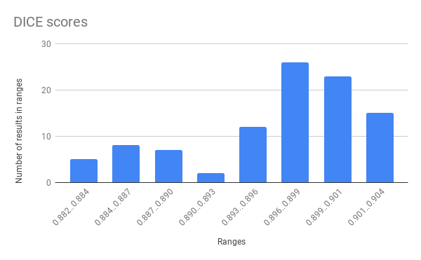
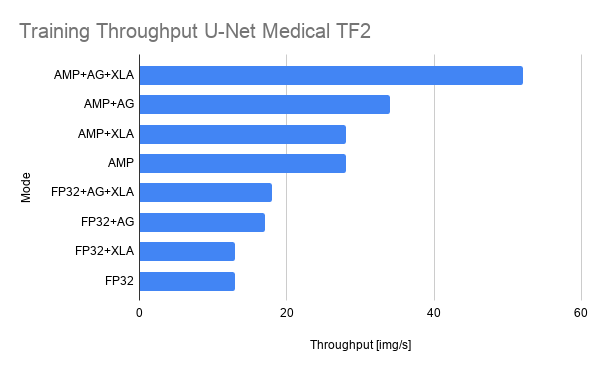
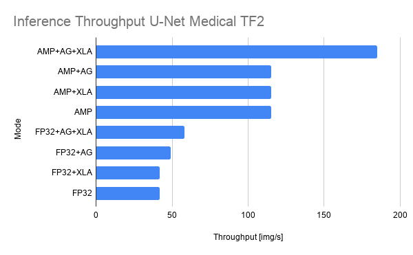

# U-Net Medical Image Segmentation for TensorFlow 2.x
 
This repository provides a script and recipe to train U-Net Medical to achieve state of the art accuracy, and is tested and maintained by NVIDIA.
 
 
## Table of Contents
 
- [Model overview](#model-overview)
   * [Model architecture](#model-architecture)
   * [Default configuration](#default-configuration)
   * [Feature support matrix](#feature-support-matrix)
     * [Features](#features)
   * [Mixed precision training](#mixed-precision-training)
     * [Enabling mixed precision](#enabling-mixed-precision)
- [Setup](#setup)
   * [Requirements](#requirements)
- [Quick Start Guide](#quick-start-guide)
- [Advanced](#advanced)
   * [Scripts and sample code](#scripts-and-sample-code)
   * [Parameters](#parameters)
   * [Command-line options](#command-line-options)
   * [Getting the data](#getting-the-data)
     * [Dataset guidelines](#dataset-guidelines)
     * [Multi-dataset](#multi-dataset)
   * [Training process](#training-process)
   * [Inference process](#inference-process)
- [Performance](#performance)   
   * [Benchmarking](#benchmarking)
     * [Training performance benchmark](#training-performance-benchmark)
     * [Inference performance benchmark](#inference-performance-benchmark)
   * [Results](#results)
     * [Training accuracy results](#training-accuracy-results)
       * [Training accuracy: NVIDIA DGX-1 (8x V100 16G)](#training-accuracy-nvidia-dgx-1-8x-v100-16g)
     * [Training stability results](#training-stability-results)
       * [Training stability: NVIDIA DGX-1 (8x V100 16G)](#training-stability-nvidia-dgx-1-8x-v100-16g)
     * [Training performance results](#training-performance-results)
       * [Training performance: NVIDIA DGX-1 (8x V100 16G)](#training-performance-nvidia-dgx-1-8x-v100-16g)
     * [Inference performance results](#inference-performance-results)
        * [Inference performance: NVIDIA DGX-1 (1x V100 16G)](#inference-performance-nvidia-dgx-1-1x-v100-16g)
- [Release notes](#release-notes)
   * [Changelog](#changelog)
   * [Known issues](#known-issues)
 
 
 
## Model overview
 
The U-Net model is a convolutional neural network for 2D image segmentation. This repository contains a U-Net implementation as described in the original paper [U-Net: Convolutional Networks for Biomedical Image Segmentation](https://arxiv.org/abs/1505.04597), without any alteration.
 
This model is trained with mixed precision using Tensor Cores on NVIDIA Volta and Turing GPUs. Therefore, researchers can get results  2.2x faster than training without Tensor Cores, while experiencing the benefits of mixed precision training. This model is tested against each NGC monthly container release to ensure consistent accuracy and performance over time.
 
### Model architecture
 
U-Net was first introduced by Olaf Ronneberger, Philip Fischer, and Thomas Brox in the paper: [U-Net: Convolutional Networks for Biomedical Image Segmentation](https://arxiv.org/abs/1505.04597). U-Net allows for seamless segmentation of 2D images, with high accuracy and performance, and can be adapted to solve many different segmentation problems.
 
The following figure shows the construction of the U-Net model and its different components. U-Net is composed of a contractive and an expanding path, that aims at building a bottleneck in its centermost part through a combination of convolution and pooling operations. After this bottleneck, the image is reconstructed through a combination of convolutions and upsampling. Skip connections are added with the goal of helping the backward flow of gradients in order to improve the training.
 
 
Figure 1. The architecture of a U-Net model. Taken from the <a href="https://arxiv.org/abs/1505.04597">U-Net: Convolutional Networks for Biomedical Image Segmentation paper</a>.
 
### Default configuration
 
U-Net consists of a contractive (left-side) and expanding (right-side) path. It repeatedly applies unpadded convolutions followed by max pooling for downsampling. Every step in the expanding path consists of an upsampling of the feature maps and concatenation with the correspondingly cropped feature map from the contractive path.
 
 
### Feature support matrix
 
The following features are supported by this model:
 
| **Feature** | **U-Net Medical** |
|-------------|---------------------|
| Automatic mixed precision (AMP) | Yes |
| Horovod Multi-GPU (NCCL)        | Yes |
| Accelerated Linear Algebra (XLA)| Yes |
 
#### Features
 
**Automatic Mixed Precision (AMP)**
 
This implementation of U-Net uses AMP to implement mixed precision training. It allows us to use FP16 training with FP32 master weights by modifying just a few lines of code.
 
**Horovod**
 
Horovod is a distributed training framework for TensorFlow, Keras, PyTorch, and MXNet. The goal of Horovod is to make distributed deep learning fast and easy to use. For more information about how to get started with Horovod, see the [Horovod: Official repository](https://github.com/horovod/horovod).
 
Multi-GPU training with Horovod
 
Our model uses Horovod to implement efficient multi-GPU training with NCCL. For details, see example sources in this repository or see the [TensorFlow tutorial](https://github.com/horovod/horovod/#usage).
 
**XLA support (experimental)**
 
XLA is a domain-specific compiler for linear algebra that can accelerate TensorFlow models with potentially no source code changes. The results are improvements in speed and memory usage: most internal benchmarks run ~1.1-1.5x faster after XLA is enabled.
 
 
### Mixed precision training
 
Mixed precision is the combined use of different numerical precision in a computational method. [Mixed precision](https://arxiv.org/abs/1710.03740) training offers significant computational speedup by performing operations in half-precision format while storing minimal information in single-precision to retain as much information as possible in critical parts of the network. Since the introduction of [Tensor Cores](https://developer.nvidia.com/tensor-cores) in the Volta and Turing architecture, significant training speedups are experienced by switching to mixed precision -- up to 3x overall speedup on the most arithmetically intense model architectures. Using mixed precision training requires two steps:
1. Porting the model to use the FP16 data type where appropriate.   
2. Adding loss scaling to preserve small gradient values.
 
The ability to train deep learning networks with lower precision was introduced in the Pascal architecture and first supported in [CUDA 8](https://devblogs.nvidia.com/parallelforall/tag/fp16/) in the NVIDIA Deep Learning SDK.
 
For information about:
-  How to train using mixed precision, see the [Mixed Precision Training](https://arxiv.org/abs/1710.03740) paper and [Training With Mixed Precision](https://docs.nvidia.com/deeplearning/sdk/mixed-precision-training/index.html) documentation.
-  Techniques used for mixed precision training, see the [Mixed-Precision Training of Deep Neural Networks](https://devblogs.nvidia.com/mixed-precision-training-deep-neural-networks/) blog.
-  How to access and enable AMP for TensorFlow, see [Using TF-AMP](https://docs.nvidia.com/deeplearning/dgx/tensorflow-user-guide/index.html#tfamp) from the TensorFlow User Guide.
 
#### Enabling mixed precision
 
This implementation exploits the TensorFlow Automatic Mixed Precision feature. To enable AMP, you simply need to supply the `--use_amp` flag to the `main.py` script. For reference, enabling the AMP required us to apply the following changes to the code:
 
1. Set Keras mixed precision policy:
   ```python
   if params['use_amp']:
       tf.keras.mixed_precision.experimental.set_policy('mixed_float16')
   ```
 
2. Use loss scaling wrapper on the optimizer:
   ```python
   optimizer = tf.keras.optimizers.SGD(learning_rate=learning_rate, momentum=momentum)
   if using_amp:
       optimizer = tf.keras.mixed_precision.experimental.LossScaleOptimizer(optimizer, "dynamic")
   ```
 
3. Use scaled loss to calculate gradients:
   ```python
   scaled_loss = optimizer.get_scaled_loss(loss)
   tape = hvd.DistributedGradientTape(tape)
   scaled_gradients = tape.gradient(scaled_loss, model.trainable_variables)
   gradients = optimizer.get_unscaled_gradients(scaled_gradients)
   optimizer.apply_gradients(zip(gradients, model.trainable_variables))
   ```
 
 
## Setup
 
The following section lists the requirements that you need to meet in order to start training the U-Net Medical model.
 
### Requirements
 
This repository contains Dockerfile which extends the TensorFlow NGC container and encapsulates some dependencies. Aside from these dependencies, ensure you have the following components:
- [NVIDIA Docker](https://github.com/NVIDIA/nvidia-docker)
- TensorFlow 20.02-tf2-py3 [NGC container](https://ngc.nvidia.com/registry/nvidia-tensorflow) with Tensorflow 2.1 or later
- [NVIDIA Volta GPU](https://www.nvidia.com/en-us/data-center/volta-gpu-architecture/) or [Turing](https://www.nvidia.com/en-us/geforce/turing/) based GPU
 
For more information about how to get started with NGC containers, see the following sections from the NVIDIA GPU Cloud Documentation and the Deep Learning Documentation:
- [Getting Started Using NVIDIA GPU Cloud](https://docs.nvidia.com/ngc/ngc-getting-started-guide/index.html)
- [Accessing And Pulling From The NGC container registry](https://docs.nvidia.com/deeplearning/dgx/user-guide/index.html#accessing_registry)
- [Running TensorFlow](https://docs.nvidia.com/deeplearning/dgx/tensorflow-release-notes/running.html#running)
 
For those unable to use the TensorFlow NGC container, to set up the required environment or create your own container, see the versioned [NVIDIA Container Support Matrix](https://docs.nvidia.com/deeplearning/frameworks/support-matrix/index.html).
## Quick Start Guide
 
To train your model using mixed precision with Tensor Cores or using FP32, perform the following steps using the default parameters of the U-Net model on the [EM segmentation challenge dataset](http://brainiac2.mit.edu/isbi_challenge/home). These steps enable you to build the U-Net TensorFlow NGC container, train and evaluate your model, and generate predictions on the test data. Furthermore, you can then choose to:
* compare your evaluation accuracy with our [Training accuracy results](#training-accuracy-results),
* compare your training performance with our [Training performance benchmark](#training-performance-benchmark),
* compare your inference performance with our [Inference performance benchmark](#inference-performance-benchmark).
 
For the specifics concerning training and inference, see the [Advanced](#advanced) section.
 
1. Clone the repository.
 
   Executing this command will create your local repository with all the code to run U-Net.
  
   ```bash
   git clone https://github.com/NVIDIA/DeepLearningExamples
   cd DeepLearningExamples/TensorFlow/Segmentation/UNet_Medical_TF2
   ```
 
2. Build the U-Net TensorFlow NGC container.
 
   This command will use the `Dockerfile` to create a Docker image named `unet_tf2`, downloading all the required components automatically.
  
   ```
   docker build -t unet_tf2 .
   ```
  
   The NGC container contains all the components optimized for usage on NVIDIA hardware.
 
3. Start an interactive session in the NGC container to run preprocessing/training/inference.
 
   The following command will launch the container and mount the `./data` directory as a volume to the `/data` directory inside the container, and `./results` directory to the `/results` directory in the container.
  
   ```bash
   mkdir data
   mkdir results
   docker run --runtime=nvidia -it --shm-size=1g --ulimit memlock=-1 --ulimit stack=67108864 --rm --ipc=host -v ${PWD}/data:/data -v ${PWD}/results:/results unet_tf2:latest /bin/bash
   ```
  
   Any datasets and experiment results (logs, checkpoints, etc.) saved to `/data` or `/results` will be accessible
   in the `./data` or `./results` directory on the host, respectively.
 
4. Download and preprocess the data.
  
   The U-Net script `main.py` operates on data from the [ISBI Challenge](http://brainiac2.mit.edu/isbi_challenge/home), the dataset originally employed in the [U-Net paper](https://arxiv.org/abs/1505.04597).
  
   The script `download_dataset.py` is provided for data download. It is possible to select the destination folder when downloading the files by using the `--data_dir` flag.  For example:
   ```bash
   python download_dataset.py --data_dir /data
   ```
  
   Training and test data are composed of 3 multi-page `TIF` files, each containing 30 2D-images (around 30 Mb total). Once downloaded, the data with the `download_dataset.py` script can be used to run the training and benchmark scripts described below, by pointing `main.py` to its location using the `--data_dir` flag.
  
   **Note:** Masks are only provided for training data.
 
5. Start training.
  
   After the Docker container is launched, the training with the [default hyperparameters](#default-parameters) (for example 1/8 GPUs FP32/TF-AMP) can be started with:
  
   ```bash
   bash examples/unet_{FP32, TF-AMP}_{1,8}GPU.sh <path/to/dataset> <path/to/checkpoint>
   ```
  
   For example, to run with full precision (FP32) on 1 GPU from the project’s folder, simply use:
  
   ```bash
   bash examples/unet_FP32_1GPU.sh /data /results
   ```
  
   This script will launch a training on a single fold and store the model’s checkpoint in the <path/to/checkpoint> directory. 
  
   The script can be run directly by modifying flags if necessary, especially the number of GPUs, which is defined after the `-np` flag. Since the test volume does not have labels, 20% of the training data is used for validation in 5-fold cross-validation manner. The number of fold can be changed using `--crossvalidation_idx` with an integer in range 0-4. For example, to run with 4 GPUs using fold 1 use:
  
   ```bash
   horovodrun -np 4 python main.py --data_dir /data --model_dir /results --batch_size 1 --exec_mode train --crossvalidation_idx 1 --use_xla --use_amp
   ```
  
   Training will result in a checkpoint file being written to `./results` on the host machine.
 
6. Start validation/evaluation.
  
   The trained model can be evaluated by passing the `--exec_mode evaluate` flag. Since evaluation is carried out on a validation dataset, the `--crossvalidation_idx` parameter should be filled. For example:
  
   ```bash
   python main.py --data_dir /data --model_dir /results --batch_size 1 --exec_mode evaluate --crossvalidation_idx 0 --use_xla --use_amp
   ```
  
   Evaluation can also be triggered jointly after training by passing the `--exec_mode train_and_evaluate` flag.
 
7. Start inference/predictions.
 
   The trained model can be used for inference by passing the `--exec_mode predict` flag:
  
   ```bash
   python main.py --data_dir /data --model_dir /results --batch_size 1 --exec_mode predict --use_xla --use_amp
   ```
  
   Now that you have your model trained and evaluated, you can choose to compare your training results with our [Training accuracy results](#training-accuracy-results). You can also choose to benchmark the performance of your training [Training performance benchmark](#training-performance-benchmark), or [Inference performance benchmark](#inference-performance-benchmark). Following the steps in these sections will ensure that you achieve the same accuracy and performance results as stated in the [Results](#results) section.
 
## Advanced
 
The following sections provide greater details of the dataset, running training and inference, and the training results.
 
### Scripts and sample code
 
In the root directory, the most important files are:
* `main.py`: Serves as the entry point to the application.
* `run.py`: Implements the logic for training, evaluation, and inference.
* `Dockerfile`: Specifies the container with the basic set of dependencies to run U-Net.
* `requirements.txt`: Set of extra requirements for running U-Net.
* `download_data.py`: Automatically downloads the dataset for training.
 
The `utils/` folder encapsulates the necessary tools to train and perform inference using U-Net. Its main components are:
* `cmd_util.py`: Implements the command-line arguments parsing.
* `data_loader.py`: Implements the data loading and augmentation.
* `losses.py`: Implements the losses used during training and evaluation.
* `parse_results.py`: Implements the intermediate results parsing.
 
The `model/` folder contains information about the building blocks of U-Net and the way they are assembled. Its contents are:
* `layers.py`: Defines the different blocks that are used to assemble U-Net.
* `unet.py`: Defines the model architecture using the blocks from the `layers.py` script.
 
Other folders included in the root directory are:
* `dllogger/`: Contains the utilities for logging.
* `examples/`: Provides examples for training and benchmarking U-Net.
* `images/`: Contains a model diagram.
 
### Parameters
 
The complete list of the available parameters for the `main.py` script contains:
* `--exec_mode`: Select the execution mode to run the model (default: `train`). Modes available:
  * `evaluate` - loads checkpoint (if available) and performs evaluation on validation subset (requires `--crossvalidation_idx` other than `None`).
  * `train_and_evaluate` - trains model from scratch and performs validation at the end (requires `--crossvalidation_idx` other than `None`).
  * `predict` - loads checkpoint (if available) and runs inference on the test set. Stores the results in `--model_dir` directory.
  * `train_and_predict` - trains model from scratch and performs inference.
* `--model_dir`: Set the output directory for information related to the model (default: `/results`).
* `--log_dir`: Set the output directory for logs (default: None).
* `--data_dir`: Set the input directory containing the dataset (default: `None`).
* `--batch_size`: Size of each minibatch per GPU (default: `1`).
* `--crossvalidation_idx`: Selected fold for cross-validation (default: `None`).
* `--max_steps`: Maximum number of steps (batches) for training (default: `1000`).
* `--seed`: Set random seed for reproducibility (default: `0`).
* `--weight_decay`: Weight decay coefficient (default: `0.0005`).
* `--log_every`: Log performance every n steps (default: `100`).
* `--learning_rate`: Model’s learning rate (default: `0.0001`).
* `--augment`: Enable data augmentation (default: `False`).
* `--benchmark`: Enable performance benchmarking (default: `False`). If the flag is set, the script runs in a benchmark mode - each iteration is timed and the performance result (in images per second) is printed at the end. Works for both `train` and `predict` execution modes.
* `--warmup_steps`: Used during benchmarking - the number of steps to skip (default: `200`). First iterations are usually much slower since the graph is being constructed. Skipping the initial iterations is required for a fair performance assessment.
* `--use_xla`: Enable accelerated linear algebra optimization (default: `False`).
* `--use_amp`: Enable automatic mixed precision (default: `False`).
 
### Command-line options
 
To see the full list of available options and their descriptions, use the `-h` or `--help` command-line option, for example:
```bash
python main.py --help
```
 
The following example output is printed when running the model:
```python main.py --help
usage: main.py [-h]
              [--exec_mode {train,train_and_predict,predict,evaluate,train_and_evaluate}]
              [--model_dir MODEL_DIR] --data_dir DATA_DIR [--log_dir LOG_DIR]
              [--batch_size BATCH_SIZE] [--learning_rate LEARNING_RATE]
              [--crossvalidation_idx CROSSVALIDATION_IDX]
              [--max_steps MAX_STEPS] [--weight_decay WEIGHT_DECAY]
              [--log_every LOG_EVERY] [--warmup_steps WARMUP_STEPS]
              [--seed SEED] [--augment] [--no-augment] [--benchmark]
              [--no-benchmark] [--use_amp] [--use_xla]
 
UNet-medical
 
optional arguments:
 -h, --help            show this help message and exit
 --exec_mode {train,train_and_predict,predict,evaluate,train_and_evaluate}
                       Execution mode of running the model
 --model_dir MODEL_DIR
                       Output directory for information related to the model
 --data_dir DATA_DIR   Input directory containing the dataset for training
                       the model
 --log_dir LOG_DIR     Output directory for training logs
 --batch_size BATCH_SIZE
                       Size of each minibatch per GPU
 --learning_rate LEARNING_RATE
                       Learning rate coefficient for AdamOptimizer
 --crossvalidation_idx CROSSVALIDATION_IDX
                       Chosen fold for cross-validation. Use None to disable
                       cross-validation
 --max_steps MAX_STEPS
                       Maximum number of steps (batches) used for training
 --weight_decay WEIGHT_DECAY
                       Weight decay coefficient
 --log_every LOG_EVERY
                       Log performance every n steps
 --warmup_steps WARMUP_STEPS
                       Number of warmup steps
 --seed SEED           Random seed
 --augment             Perform data augmentation during training
 --no-augment
 --benchmark           Collect performance metrics during training
 --no-benchmark
 --use_amp             Train using TF-AMP
 --use_xla             Train using XLA
```
 
 
### Getting the data
 
The U-Net model was trained in the [EM segmentation challenge dataset](http://brainiac2.mit.edu/isbi_challenge/home). Test images provided by the organization were used to produce the resulting masks for submission. Upon registration, the challenge's data is made available through the following links:
 
* [train-volume.tif](http://brainiac2.mit.edu/isbi_challenge/sites/default/files/train-volume.tif)
* [train-labels.tif](http://brainiac2.mit.edu/isbi_challenge/sites/default/files/train-labels.tif)
* [train-volume.tif](http://brainiac2.mit.edu/isbi_challenge/sites/default/files/test-volume.tif)
 
Training and test data are comprised of three 512x512x30 `TIF` volumes (`test-volume.tif`, `train-volume.tif` and `train-labels.tif`). Files `test-volume.tif` and `train-volume.tif` contain grayscale 2D slices to be segmented. Additionally, training masks are provided in `train-labels.tif` as a 512x512x30 `TIF` volume, where each pixel has one of two classes:
* 0 indicating the presence of cellular membrane,
* 1 corresponding to background.
 
The objective is to produce a set of masks that segment the data as accurately as possible. The results are expected to be submitted as a 32-bit `TIF` 3D image, with values between `0` (100% membrane certainty) and `1` (100% non-membrane certainty).
 
#### Dataset guidelines
 
The training and test datasets are given as stacks of 30 2D-images provided as a multi-page `TIF` that can be read using the Pillow library and NumPy (both Python packages are installed by the `Dockerfile`).
 
Initially, data is loaded from a multi-page `TIF` file and converted to 512x512x30 NumPy arrays with the use of Pillow. The process of loading, normalizing and augmenting the data contained in the dataset can be found in the `data_loader.py` script.
 
These NumPy arrays are fed to the model through `tf.data.Dataset.from_tensor_slices()`, in order to achieve high performance.
 
The voxel intensities then normalized to an interval `[-1, 1]`, whereas labels are one-hot encoded for their later use in dice or pixel-wise cross-entropy loss, becoming 512x512x30x2 tensors.
 
If augmentation is enabled, the following set of augmentation techniques are applied:
* Random horizontal flipping
* Random vertical flipping
* Crop to a random dimension and resize to input dimension
* Random brightness shifting
 
In the end, images are reshaped to 388x388 and padded to 572x572 to fit the input of the network. Masks are only reshaped to 388x388 to fit the output of the network. Moreover, pixel intensities are clipped to the `[-1, 1]` interval.
 
#### Multi-dataset
 
This implementation is tuned for the EM segmentation challenge dataset. Using other datasets is possible, but might require changes to the code (data loader) and tuning some hyperparameters (e.g. learning rate, number of iterations).
 
In the current implementation, the data loader works with NumPy arrays by loading them at the initialization, and passing them for training in slices by `tf.data.Dataset.from_tensor_slices()`. If you’re able to fit your dataset into the memory, then convert the data into three NumPy arrays - training images, training labels, and testing images (optional). If your dataset is large, you will have to adapt the optimizer for the lazy-loading of data. For a walk-through, check the [TensorFlow tf.data API guide](https://www.tensorflow.org/guide/data_performance)
 
The performance of the model depends on the dataset size.
Generally, the model should scale better for datasets containing more data. For a smaller dataset, you might experience lower performance.
 
### Training process
 
The model trains for a total 40,000 batches (40,000 / number of GPUs), with the default U-Net setup:
* Adam optimizer with learning rate of 0.0001.
 
This default parametrization is applied when running scripts from the `./examples` directory and when running `main.py` without explicitly overriding these parameters. By default, the training is in full precision. To enable AMP, pass the `--use_amp` flag. AMP can be enabled for every mode of execution.
 
The default configuration minimizes a function _L = 1 - DICE + cross entropy_ during training.
 
The training can be run directly without using the predefined scripts. The name of the training script is `main.py`. Because of the multi-GPU support, training should always be run with the Horovod distributed launcher like this:
```bash
horovodrun -np <number/of/gpus> python main.py --data_dir /data [other parameters]
```
 
*Note:* When calling the `main.py` script manually, data augmentation is disabled. In order to enable data augmentation, use the `--augment` flag in your invocation.
 
The main result of the training are checkpoints stored by default in `./results/` on the host machine, and in the `/results` in the container. This location can be controlled
by the `--model_dir` command-line argument, if a different location was mounted while starting the container. In the case when the training is run in `train_and_predict` mode, the inference will take place after the training is finished, and inference results will be stored to the `/results` directory.
 
If the `--exec_mode train_and_evaluate` parameter was used, and if `--crossvalidation_idx` parameter is set to an integer value of {0, 1, 2, 3, 4}, the evaluation of the validation set takes place after the training is completed. The results of the evaluation will be printed to the console.

### Inference process
 
Inference can be launched with the same script used for training by passing the `--exec_mode predict` flag:
```bash
python main.py --exec_mode predict --data_dir /data --model_dir <path/to/checkpoint> [other parameters]
```
 
The script will then:
* Load the checkpoint from the directory specified by the `<path/to/checkpoint>` directory (`/results`),
* Run inference on the test dataset,
* Save the resulting binary masks in a `TIF` format.
 
## Performance
 
### Benchmarking
 
The following section shows how to run benchmarks measuring the model performance in training and inference modes.
 
#### Training performance benchmark
 
To benchmark training, run one of the `TRAIN_BENCHMARK` scripts in `./examples/`:
```bash
bash examples/unet_TRAIN_BENCHMARK_{FP32, TF-AMP}_{1, 8}GPU.sh <path/to/dataset> <path/to/checkpoints> <batch/size>
```
For example, to benchmark training using mixed-precision on 8 GPUs use:
```bash
bash examples/unet_TRAIN_BENCHMARK_TF-AMP_8GPU.sh <path/to/dataset> <path/to/checkpoint> <batch/size>
```
 
Each of these scripts will by default run 200 warm-up iterations and benchmark the performance during training in the next 800 iterations.
 
To have more control, you can run the script by directly providing all relevant run parameters. For example:
```bash
horovodrun -np <num of gpus> python main.py --exec_mode train --benchmark --augment --data_dir <path/to/dataset> --model_dir <optional, path/to/checkpoint> --batch_size <batch/size> --warmup_steps <warm-up/steps> --max_steps <max/steps>
```
 
At the end of the script, a line reporting the best train throughput will be printed.
 
#### Inference performance benchmark
 
To benchmark inference, run one of the scripts in `./examples/`:
```bash
bash examples/unet_INFER_BENCHMARK_{FP32, TF-AMP}.sh <path/to/dataset> <path/to/checkpoint> <batch/size>
```
 
For example, to benchmark inference using mixed-precision:
```bash
bash examples/unet_INFER_BENCHMARK_TF-AMP.sh <path/to/dataset> <path/to/checkpoint> <batch/size>
```
 
Each of these scripts will by default run 200 warm-up iterations and benchmark the performance during inference in the next 400 iterations.
 
To have more control, you can run the script by directly providing all relevant run parameters. For example:
```bash
python main.py --exec_mode predict --benchmark --data_dir <path/to/dataset> --model_dir <optional, path/to/checkpoint> --batch_size <batch/size> --warmup_steps <warm-up/steps> --max_steps <max/steps>
```
 
At the end of the script, a line reporting the best inference throughput will be printed.
 
 
### Results
 
The following sections provide details on how we achieved our performance and accuracy in training and inference.
 
#### Training accuracy results
 
##### Training accuracy: NVIDIA DGX-1 (8x V100 16G)
 
The following table lists the average DICE score across 5-fold cross-validation. Our results were obtained by running the `examples/unet_TRAIN_{FP32, TF-AMP}_{1, 8}GPU.sh` training script in the tensorflow:20.02-tf2-py3 NGC container on NVIDIA DGX-1 with (8x V100 16G) GPUs.
 
| GPUs | Batch size / GPU | Accuracy - FP32 | Accuracy - mixed precision | Time to train - FP32 [hours] | Time to train - mixed precision [hours] | Time to train speedup (FP32 to mixed precision) |
|------|------------------|-----------------|----------------------------|------------------------------|----------------------------|--------------------------------|
| 1 | 8 | 0.8825 | 0.8826 | 6.51 | 2.25 | 2.89 |
| 8 | 8 | 0.8968 | 0.8962 | 0.89 | 0.32 | 2.76 |
 
To reproduce this result, start the Docker container interactively and run one of the TRAIN scripts:
```bash
bash examples/unet_TRAIN_{FP32, TF-AMP}_{1, 8}GPU.sh <path/to/dataset> <path/to/checkpoint> <batch/size>
```
 for example
```bash
bash examples/unet_TRAIN_TF-AMP_8GPU.sh /data /results 8
```

This command will launch a script which will run 5-fold cross-validation training for 40,000 iterations and print the validation DICE score and cross-entropy loss. The time reported is for one fold, which means that the training for 5 folds will take 5 times longer. The default batch size is 8, however if you have less than 16 Gb memory card and you encounter GPU memory issue you should decrease the batch size. The logs of the runs can be found in `/results` directory once the script is finished.
 
#### Training stability results

##### Training stability: NVIDIA DGX-1 (8x V100 16G)

The histogram below shows the best DICE scores achieved for 100 experiments using mixed precision. Mean DICE score for mixed precision was equal to 0.8962 and for single precision it was equal to
0.8968.



#### Training performance results
 
##### Training performance: NVIDIA DGX-1 (8x V100 16G)
 
Our results were obtained by running the `examples/unet_TRAIN_BENCHMARK_{TF-AMP, FP32}_{1, 8}GPU.sh` training script in the tensorflow:20.02-tf2-py3 NGC container on NVIDIA DGX-1 with (8x V100 16G) GPUs. Performance numbers (in items/images per second) were averaged over 1000 iterations, excluding the first 200 warm-up steps.
 
| GPUs | Batch size / GPU | Throughput - FP32 [img/s] | Throughput - mixed precision [img/s] | Throughput speedup (FP32 - mixed precision) | Weak scaling - FP32 | Weak scaling - mixed precision |       
|------|------------------|-------------------|--------------------------------|---------------------------------------------|---------------------------|--------------------------------|
| 1 | 8 |  17.98 |  51.89 | 2.89 |  N/A |  N/A |
| 8 | 8 | 143.08 | 386.15 | 2.70 | 7.44 | 7.97 |
 
 
To achieve these same results, follow the steps in the [Training performance benchmark](#training-performance-benchmark) section.
 
Throughput is reported in images per second. Latency is reported in milliseconds per image.
 
TensorFlow 2 runs by default using the eager mode, which makes tensor evaluation trivial at the cost of lower performance. To mitigate this issue multiple layers of performance optimization were implemented. Two of them, AMP and XLA, were already described. There is an additional one called Autograph, which allows to construct a graph from a subset of Python syntax improving the performance simply by adding a `@tf.function` decorator to the train function. To read more about Autograph see [Better performance with tf.function and AutoGraph](https://www.tensorflow.org/guide/function).

The training performance using 1 GPU with batch size 8 and various combination of AMP/FP32, XLA, and Autograph (AG) are shown the plot below.


 
#### Inference performance results
 
##### Inference performance: NVIDIA DGX-1 (1x V100 16G)
 
Our results were obtained by running the `examples/unet_INFER_BENCHMARK_{TF-AMP, FP32}.sh` inferencing benchmarking script in the tensorflow:20.02-tf2-py3 NGC container on NVIDIA DGX-1 with (1x V100 16G) GPU.
 
FP16
 
| Batch size | Resolution | Throughput Avg [img/s] | Latency Avg [ms] | Latency 90% [ms] | Latency 95% [ms] | Latency 99% [ms] |
|------|-----------|--------|---------|--------|--------|--------|
|   1  | 572x572x1 | 152.48 |  6.558  | 6.568  | 6.569  | 6.572  |
|   2  | 572x572x1 | 164.64 |  12.148 | 12.162 | 12.164 | 12.168 |
|   4  | 572x572x1 | 179.54 |  22.279 | 22.299 | 22.302 | 22.309 |
|   8  | 572x572x1 | 187.65 |  42.633 | 42.658 | 42.663 | 42.672 |
|  16  | 572x572x1 | 189.38 |  84.486 | 84.541 | 84.551 | 84.569 |
 
FP32
 
| Batch size | Resolution | Throughput Avg [img/s] | Latency Avg [ms] | Latency 90% [ms] | Latency 95% [ms] | Latency 99% [ms] |
|------|-----------|--------|---------|---------|---------|---------|
|   1  | 572x572x1 |  54.41 | 18.381  | 18.395  | 18.398  | 18.403  |
|   2  | 572x572x1 |  56.83 | 35.193  | 35.210  | 35.213  | 35.219  |
|   4  | 572x572x1 |  57.62 | 69.421  | 69.459  | 69.465  | 69.478  |
|   8  | 572x572x1 |  58.66 | 136.391 | 136.506 | 136.525 | 136.564 |
|  16  | 572x572x1 |  75.74 | 211.240 | 211.302 | 211.313 | 211.336 |
 
To achieve these same results, follow the steps in the [Inference performance benchmark](#inference-performance-benchmark) section.
 
Throughput is reported in images per second. Latency is reported in milliseconds per batch.

The inference performance using 1 GPU with batch size 8 and various combination of AMP/FP32, XLA, and Autograph (AG) are shown the plot below. 


 
## Release notes
 
### Changelog
 
February 2020
* Initial release
 
### Known issues
 
* For TensorFlow 2.0 the training performance using AMP and XLA is around 30% lower than reported here. The issue was solved in TensorFlow 2.1.
* Due to random initialization, around 5% of training runs result in lower DICE score, usually around 0.81.
