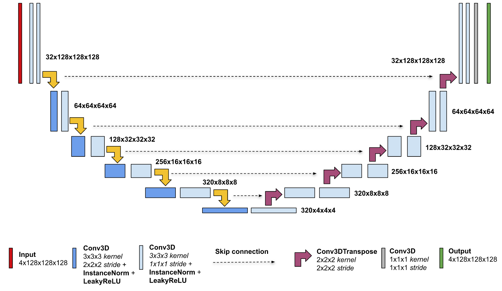

# nnU-Net For TensorFlow 2

This repository provides a script and recipe to train the nnU-Net model to achieve state-of-the-art accuracy. The content of this repository is tested and maintained by NVIDIA.

## Table Of Contents

- [Model overview](#model-overview)
    * [Model architecture](#model-architecture)
    * [Default configuration](#default-configuration)
    * [Feature support matrix](#feature-support-matrix)
        * [Features](#features)
    * [Mixed precision training](#mixed-precision-training)
        * [Enabling mixed precision](#enabling-mixed-precision)
        * [TF32](#tf32)
    * [Glossary](#glossary)
- [Setup](#setup)
    * [Requirements](#requirements)
- [Quick Start Guide](#quick-start-guide)
- [Advanced](#advanced)
    * [Scripts and sample code](#scripts-and-sample-code)
    * [Command-line options](#command-line-options)
    * [Getting the data](#getting-the-data)
        * [Dataset guidelines](#dataset-guidelines)
        * [Multi-dataset](#multi-dataset)
    * [Training process](#training-process)
    * [Inference process](#inference-process)
- [Performance](#performance)
    * [Benchmarking](#benchmarking)
        * [Training performance benchmark](#training-performance-benchmark)
        * [Inference performance benchmark](#inference-performance-benchmark)
    * [Results](#results)
        * [Training accuracy results](#training-accuracy-results)             
            * [Training accuracy: NVIDIA DGX A100 (8x A100 80G)](#training-accuracy-nvidia-dgx-a100-8x-a100-80g)
            * [Training accuracy: NVIDIA DGX-1 (8x V100 32G)](#training-accuracy-nvidia-dgx-1-8x-v100-32G)
        * [Training performance results](#training-performance-results)
            * [Training performance: NVIDIA DGX A100 (8x A100 80G)](#training-performance-nvidia-dgx-a100-8x-a100-80g) 
            * [Training performance: NVIDIA DGX-1 (8x V100 32G)](#training-performance-nvidia-dgx-1-8x-v100-32G)
        * [Inference performance results](#inference-performance-results)
            * [Inference performance: NVIDIA DGX A100 (1x A100 80G)](#inference-performance-nvidia-dgx-a100-1x-a100-80g)
            * [Inference performance: NVIDIA DGX-1 (1x V100 32G)](#inference-performance-nvidia-dgx-1-1x-v100-32G)
- [Known issues](#known-issues)
- [Release notes](#release-notes)
    * [Changelog](#changelog)
    * [Known issues](#known-issues)

## Model overview

The nnU-Net ("no-new-Net") refers to a robust and self-adapting framework for U-Net based medical image segmentation. This repository contains a nnU-Net implementation as described in the paper: [nnU-Net: Self-adapting Framework for U-Net-Based Medical Image Segmentation](https://arxiv.org/abs/1809.10486). 

The differences between this nnU-net and [the original model](https://github.com/MIC-DKFZ/nnUNet) are:
- Dynamic selection of patch size is not supported, and it has to be set in `data_preprocessing/configs.py` file.
- Cascaded U-Net is not supported.
- The following data augmentations are not used: rotation, simulation of low resolution, gamma augmentation.

This model is trained with mixed precision using Tensor Cores on Volta, Turing, and the NVIDIA Ampere GPU architectures. Therefore, researchers can get results 2x faster than training without Tensor Cores, while experiencing the benefits of mixed precision training. This model is tested against each NGC monthly container release to ensure consistent accuracy and performance over time.

### Model architecture

The nnU-Net allows training two types of networks: 2D U-Net and 3D U-Net to perform semantic segmentation of 2D or 3D images, with high accuracy and performance.

The following figure shows the architecture of the 3D U-Net model and its different components. U-Net is composed of a contractive and an expanding path, that aims at building a bottleneck in its centermost part through a combination of convolution, instance norm and leaky relu operations. After this bottleneck, the image is reconstructed through a combination of convolutions and upsampling. Skip connections are added with the goal of helping the backward flow of gradients in order to improve the training.


    
*Figure 1: The 3D U-Net architecture*

### Default configuration

All convolution blocks in U-Net in both encoder and decoder are using two convolution layers followed by instance normalization and a leaky ReLU nonlinearity. For downsampling we are using stride convolution whereas transposed convolution for upsampling.

All models were trained with the Adam optimizer. For loss function we use the average of [cross-entropy](https://en.wikipedia.org/wiki/Cross_entropy) and [dice coefficient](https://en.wikipedia.org/wiki/S%C3%B8rensen%E2%80%93Dice_coefficient).

Used data augmentation: crop with oversampling the foreground class, mirroring, zoom, Gaussian noise, Gaussian blur, brightness.

### Feature support matrix

The following features are supported by this model: 

| Feature               | nnUNet               
|-----------------------|--------------------------   
|[DALI](https://docs.nvidia.com/deeplearning/dali/release-notes/index.html) | Yes
|Automatic mixed precision (AMP) | Yes  
|Horovod Multi-GPU (NCCL) | Yes        
|[XLA](https://www.tensorflow.org/xla) | Yes

         
#### Features

**DALI**

NVIDIA Data Loading Library (DALI) is a collection of highly optimized building blocks, and an execution engine, to accelerate the pre-processing of the input data for deep learning applications. DALI provides both the performance and the flexibility for accelerating different data pipelines as a single library. This single library can then be easily integrated into different deep learning training and inference applications. For details, refer to example sources in this repository or refer to the [DALI documentation](https://docs.nvidia.com/deeplearning/dali/index.html).

**Automatic Mixed Precision (AMP)**

Computation graphs can be modified by TensorFlow during runtime to support mixed precision training, which allows to use FP16 training with FP32 master weights. A detailed explanation of mixed precision can be found in the next section.
    
**Multi-GPU training with Horovod**
Horovod is a distributed training framework for TensorFlow, Keras, PyTorch, and MXNet. The goal of Horovod is to make distributed deep learning fast and easy to use. For more information about how to get started with Horovod, refer to the [Horovod: Official repository](https://github.com/horovod/horovod).
Our model uses Horovod to implement efficient multi-GPU training with NCCL. For details, refer to example scripts in this repository or refer to the [TensorFlow tutorial](https://github.com/horovod/horovod/#usage).

**XLA**

XLA (Accelerated Linear Algebra) is a compiler which can accelerate TensorFlow networks by model-specific optimizations i.e. fusing multiple GPU operations together.
Operations fused into a single GPU kernel do not have to use additional memory to store intermediate values by keeping them entirely in GPU registers, therefore reducing memory operations and improving performance. For details refer to the [TensorFlow documentation](https://www.tensorflow.org/xla).


### Mixed precision training

Mixed precision is the combined use of different numerical precisions in a computational method. [Mixed precision](https://arxiv.org/abs/1710.03740) training offers significant computational speedup by performing operations in half-precision format, while storing minimal information in single-precision to retain as much information as possible in critical parts of the network. Since the introduction of [Tensor Cores](https://developer.nvidia.com/tensor-cores) in Volta, and following with both the Turing and Ampere architectures, significant training speedups are experienced by switching to mixed precision -- up to 3x overall speedup on the most arithmetically intense model architectures. Using mixed precision training requires two steps:

1. Porting the model to use the FP16 data type where appropriate.
2. Adding loss scaling to preserve small gradient values.

This can now be achieved using Automatic Mixed Precision (AMP) for TensorFlow to enable the full [mixed precision methodology](https://docs.nvidia.com/deeplearning/sdk/mixed-precision-training/index.html#tensorflow) in your existing TensorFlow model code. AMP enables mixed precision training on NVIDIA Volta, NVIDIA Turing, and NVIDIA Ampere GPU architectures automatically. The TensorFlow framework code makes all necessary model changes internally.

In TF-AMP, the computational graph is optimized to use as few casts as necessary and maximize the use of FP16, and the loss scaling is automatically applied inside of supported optimizers. AMP can be configured to work with the existing tf.contrib loss scaling manager by disabling the AMP scaling with a single environment variable to perform only the automatic mixed-precision optimization. It accomplishes this by automatically rewriting all computation graphs with the necessary operations to enable mixed precision training and automatic loss scaling.

For information about:
* How to train using mixed precision, see the [Mixed Precision Training](https://arxiv.org/abs/1710.03740) paper and [Training With Mixed Precision](https://docs.nvidia.com/deeplearning/performance/mixed-precision-training/index.html) documentation.
* Techniques used for mixed precision training, see the [Mixed-Precision Training of Deep Neural Networks](https://devblogs.nvidia.com/mixed-precision-training-deep-neural-networks/) blog.

#### Enabling mixed precision

Mixed precision is enabled in TensorFlow by using the Automatic Mixed Precision (TF-AMP) extension which casts variables to half-precision upon retrieval, while storing variables in single-precision format. Furthermore, to preserve small gradient magnitudes in backpropagation, a [loss scaling](https://docs.nvidia.com/deeplearning/sdk/mixed-precision-training/index.html#lossscaling) step must be included when applying gradients. In TensorFlow, loss scaling can be applied statically by using simple multiplication of loss by a constant value or automatically, by TF-AMP. Automatic mixed precision makes all the adjustments internally in TensorFlow, providing two benefits over manual operations. First, programmers need not modify network model code, reducing development and maintenance effort. Second, using AMP maintains forward and backward compatibility with all the APIs for defining and running TensorFlow models.

Example nnU-Net scripts for training, inference and benchmarking from the `scripts/` directory enable mixed precision if `--amp` command line flag is used.

Internally, mixed precision is enabled by setting `keras.mixed_precision` policy to `mixed_float16`. Additionally, our custom training loop uses a `LossScaleOptimizer` wrapper for the optimizer. For more information see the [Mixed precision guide](#mixed-precision-training).

#### TF32

TensorFloat-32 (TF32) is the new math mode in [NVIDIA A100](https://www.nvidia.com/en-us/data-center/a100/) GPUs for handling the matrix math, also called tensor operations. TF32 running on Tensor Cores in A100 GPUs can provide up to 10x speedups compared to single-precision floating-point math (FP32) on NVIDIA Volta GPUs. 

TF32 Tensor Cores can speed up networks using FP32, typically with no loss of accuracy. It is more robust than FP16 for models which require high dynamic range for weights or activations.

For more information, refer to the [TensorFloat-32 in the A100 GPU Accelerates AI Training, HPC up to 20x](https://blogs.nvidia.com/blog/2020/05/14/tensorfloat-32-precision-format/) blog post.

TF32 is supported in the NVIDIA Ampere GPU architecture and is enabled by default.

### Glossary

**Deep supervision**

Deep supervision is a technique which adds auxiliary loss outputs to the U-Net decoder layers. For nnU-Net, we add auxiliary losses to three latest decoder levels. Final loss is a weighted average of the obtained loss values. Deep supervision can be enabled by adding the `--deep-supervision` flag.

**Test time augmentation**

Test time augmentation is an inference technique which averages predictions from augmented images with its prediction. As a result, predictions are more accurate, but with the cost of a slower inference process. For nnU-Net, we use all possible flip combinations for image augmenting. Test time augmentation can be enabled by adding the `--tta` flag to the training or inference script invocation.

**Sliding window inference**

During inference this method replaces an input image with arbitrary resolution with a batch of overlapping windows, which cover the whole input. After passing this batch through the network a prediction with the original resolution is reassembled. Predicted values inside overlapped regions are obtained from a weighted average.
Overlap ratio and weights for the average (i.e. blending mode) can be adjusted with the `--overlap` and `--blend-mode` options respectively.

## Setup

The following section lists the requirements that you need to meet in order to start training the nnU-Net model.

### Requirements

This repository contains Dockerfile which extends the TensorFlow 2 NGC container and encapsulates some dependencies. Aside from these dependencies, ensure you have the following components:
-   [NVIDIA Docker](https://github.com/NVIDIA/nvidia-docker)
-   TensorFlow2 22.04-py3+ NGC container
-   Supported GPUs:
    - [NVIDIA Volta architecture](https://www.nvidia.com/en-us/data-center/volta-gpu-architecture/)
    - [NVIDIA Turing architecture](https://www.nvidia.com/en-us/geforce/turing/)
    - [NVIDIA Ampere architecture](https://www.nvidia.com/en-us/data-center/nvidia-ampere-gpu-architecture/)

For more information about how to get started with NGC containers, see the following sections from the NVIDIA GPU Cloud Documentation and the Deep Learning Documentation:
-   [Getting Started Using NVIDIA GPU Cloud](https://docs.nvidia.com/ngc/ngc-getting-started-guide/index.html)
-   [Accessing And Pulling From The NGC Container Registry](https://docs.nvidia.com/deeplearning/frameworks/user-guide/index.html#accessing_registry)
-   Running [TensorFlow](https://docs.nvidia.com/deeplearning/frameworks/tensorflow-release-notes/running.html#running)
  
For those unable to use the PyTorch NGC container, to set up the required environment or create your own container, see the versioned [NVIDIA Container Support Matrix](https://docs.nvidia.com/deeplearning/frameworks/support-matrix/index.html).

## Quick Start Guide

To train your model using mixed or TF32 precision with Tensor Cores or using FP32, perform the following steps using the default parameters of the nnUNet model on the [Medical Segmentation Decathlon](http://medicaldecathlon.com/) dataset. For the specifics concerning training and inference, see the [Advanced](#advanced) section.

1. Clone the repository.

Executing this command will create your local repository with all the code to run nnU-Net.
```
git clone https://github.com/NVIDIA/DeepLearningExamples
cd DeepLearningExamples/TensorFlow2/Segmentation/nnUNet
```
    
2. Build the nnU-Net TensorFlow2 NGC container.
    
This command will use the Dockerfile to create a Docker image named `nnunet`, downloading all the required components automatically.

```
docker build -t nnunet .
```
    
The NGC container contains all the components optimized for usage on NVIDIA hardware.
    
3. Start an interactive session in the NGC container to run preprocessing/training/inference.
    
The following command will launch the container and mount the `./data` directory as a volume to the `/data` directory inside the container, and `./results` directory to the `/results` directory in the container.
    
```
mkdir data results
docker run -it --runtime=nvidia --shm-size=8g --ulimit memlock=-1 --ulimit stack=67108864 --rm -v ${PWD}/data:/data -v ${PWD}/results:/results nnunet:latest /bin/bash
```

4. Prepare BraTS (MSD 01 task) dataset.

To download and preprocess the data run:
```
python download.py --task 01
python preprocess.py --task 01 --dim 3
python preprocess.py --task 01 --dim 2
```

Then `ls /data` should print:
```
01_3d_tf2 01_2d_tf2 Task01_BrainTumour
```

For the specifics concerning data preprocessing, see the [Getting the data](#getting-the-data) section.
    
5. Start training.
   
Training can be started with:
```
python scripts/train.py --gpus <gpus> --fold <fold> --dim <dim> [--amp]
```

To see descriptions of the train script arguments run `python scripts/train.py --help`. You can customize the training process. For details, see the [Training process](#training-process) section.

6. Start benchmarking.

The training and inference performance can be evaluated by using benchmarking scripts, such as:
 
```
python scripts/benchmark.py --mode {train,predict} --gpus <ngpus> --dim {2,3} --batch-size <bsize> [--amp]
```

To see descriptions of the benchmark script arguments run `python scripts/benchmark.py --help`.


7. Start inference/predictions.
   
Inference can be started with:
```
python scripts/inference.py --data <path/to/data> --dim <dim> --fold <fold> --ckpt-dir <path/to/checkpoint> [--amp] [--tta] [--save-preds]
```

Note: You have to prepare either validation or test dataset to run this script by running `python preprocess.py --task 01 --dim {2,3} --exec_mode {val,test}`. After preprocessing inside a given task directory (e.g. `/data/01_3d/` for task 01 and dim 3) it will create a `val` or `test` directory with preprocessed data ready for inference. Possible workflow:

```
python preprocess.py --task 01 --dim 3 --exec_mode val
python scripts/inference.py --data /data/01_3d/val --dim 3 --fold 0 --ckpt-dir <path/to/checkpoint> --amp --tta --save-preds
```

Then if you have labels for predicted images you can evaluate it with `evaluate.py` script. For example:

```
python evaluate.py --preds /results/preds_task_01_dim_3_fold_0_amp_tta --lbls /data/Task01_BrainTumour/labelsTr
```

To see descriptions of the inference script arguments run `python scripts/inference.py --help`. You can customize the inference process. For details, see the [Inference process](#inference-process) section.

Now that you have your model trained and evaluated, you can choose to compare your training results with our [Training accuracy results](#training-accuracy-results). You can also choose to benchmark yours performance to [Training performance benchmark](#training-performance-results), or [Inference performance benchmark](#inference-performance-results). Following the steps in these sections will ensure that you achieve the same accuracy and performance results as stated in the [Results](#results) section.
    
## Advanced

The following sections provide greater details of the dataset, running training and inference, and the training results.

### Scripts and sample code

In the root directory, the most important files are:

* `main.py`: Entry point to the application. Runs training, evaluation, inference or benchmarking.
* `preprocess.py`: Entry point to data preprocessing.
* `download.py`: Downloads given dataset from [Medical Segmentation Decathlon](http://medicaldecathlon.com/).
* `Dockerfile`: Container with the basic set of dependencies to run nnU-Net.
* `requirements.txt:` Set of extra requirements for running nnU-Net.
* `evaluate.py`: Compare predictions with ground truth and get the final score.
    
The `data_preprocessing` folder contains information about the data preprocessing used by nnU-Net. Its contents are:
    
* `configs.py`: Defines dataset configuration like patch size or spacing.
* `preprocessor.py`: Implements data preprocessing pipeline.

The `data_loading` folder contains information about the data loading pipeline used by nnU-Net. Its contents are:
    
* `data_module.py`: Defines a data module managing datasets and splits (similar to PyTorch Lightning `DataModule`)
* `dali_loader.py`: Implements DALI data loading pipelines.
* `utils.py`: Defines auxiliary functions used for data loading.

The `models` folder contains information about the building blocks of nnU-Net and the way they are assembled. Its contents are:
    
* `layers.py`: Implements convolution blocks used by U-Net template.
* `nn_unet.py`: Implements training/validation/test logic and dynamic creation of U-Net architecture used by nnU-Net.
* `sliding_window.py`: Implements sliding window inference used by evaluation and prediction loops.
* `unet.py`: Implements the U-Net template.

The `runtime` folder contains information about training, inference and evaluation logic. Its contents are:
    
* `args.py`: Defines command line arguments.
* `checkpoint.py`: Implements checkpoint saving.
* `logging.py`: Defines logging utilities along with wandb.io integration.
* `losses.py`: Implements loss functions.
* `metrics.py`: Implements dice metric and metric management.
* `run.py`: Implements training loop and inference and evaluation logic.
* `utils.py`: Defines auxiliary functions used during runtime.

Other folders included in the root directory are:

* `images/`: Contains a model diagram.
* `scripts/`: Provides scripts for training, benchmarking and inference of nnU-Net.

### Command-line options

To see the full list of available options and their descriptions, use the `-h` or `--help` command-line option, for example:

`python main.py --help`

The following example output is printed when running the model:

```
usage: main.py [-h] [--exec-mode {train,evaluate,predict,export}] [--data DATA] [--task TASK] [--dim {2,3}] [--seed SEED] [--benchmark]
               [--tta [BOOLEAN]] [--save-preds [BOOLEAN]] [--sw-benchmark [BOOLEAN]] [--results RESULTS] [--logname LOGNAME] [--quiet]
               [--use-dllogger [BOOLEAN]] [--amp [BOOLEAN]] [--xla [BOOLEAN]] [--read-roi [BOOLEAN]] [--batch-size BATCH_SIZE]
               [--learning-rate LEARNING_RATE] [--momentum MOMENTUM] [--scheduler {none,poly,cosine,cosine_annealing}]
               [--end-learning-rate END_LEARNING_RATE] [--cosine-annealing-first-cycle-steps COSINE_ANNEALING_FIRST_CYCLE_STEPS]
               [--cosine-annealing-peak-decay COSINE_ANNEALING_PEAK_DECAY] [--optimizer {sgd,adam,radam}] [--deep-supervision [BOOLEAN]]
               [--lookahead [BOOLEAN]] [--weight-decay WEIGHT_DECAY] [--loss-batch-reduction [BOOLEAN]]
               [--loss-include-background [BOOLEAN]] [--negative-slope NEGATIVE_SLOPE] [--norm {instance,batch,group,none}]
               [--ckpt-strategy {last_and_best,last_only,none}] [--ckpt-dir CKPT_DIR] [--saved-model-dir SAVED_MODEL_DIR]
               [--resume-training] [--nvol NVOL] [--data2d-dim {2,3}] [--oversampling OVERSAMPLING] [--num-workers NUM_WORKERS]
               [--dali-use-cpu [BOOLEAN]] [--sw-batch-size SW_BATCH_SIZE] [--overlap OVERLAP] [--blend {gaussian,constant}]
               [--nfolds NFOLDS] [--fold FOLD] [--epochs EPOCHS] [--skip-eval SKIP_EVAL] [--steps-per-epoch STEPS_PER_EPOCH]
               [--bench-steps BENCH_STEPS] [--warmup-steps WARMUP_STEPS]

optional arguments:
  -h, --help            show this help message and exit
  --exec-mode {train,evaluate,predict,export}, --exec_mode {train,evaluate,predict,export}
                        Execution mode to run the model (default: train)
  --data DATA           Path to data directory (default: /data)
  --task TASK           Task number, MSD uses numbers 01-10 (default: 01)
  --dim {2,3}           UNet dimension (default: 3)
  --seed SEED           Random seed (default: None)
  --benchmark           Run model benchmarking (default: False)
  --tta [BOOLEAN]       Enable test time augmentation (default: False)
  --save-preds [BOOLEAN], --save_preds [BOOLEAN]
                        Save predictions (default: False)
  --sw-benchmark [BOOLEAN], --sw_benchmark [BOOLEAN]
  --results RESULTS     Path to results directory (default: /results)
  --logname LOGNAME     DLLogger output filename (default: dllogger.json)
  --quiet               Minimalize stdout/stderr output (default: False)
  --use-dllogger [BOOLEAN], --use_dllogger [BOOLEAN]
                        Use DLLogger logging (default: True)
  --amp [BOOLEAN]       Enable automatic mixed precision (default: False)
  --xla [BOOLEAN]       Enable XLA compiling (default: False)
  --read-roi [BOOLEAN], --read_roi [BOOLEAN]
                        Use DALI direct ROI loading feature (default: False)
  --batch-size BATCH_SIZE, --batch_size BATCH_SIZE
                        Batch size (default: 2)
  --learning-rate LEARNING_RATE, --learning_rate LEARNING_RATE
                        Learning rate (default: 0.0003)
  --momentum MOMENTUM   Momentum factor (SGD only) (default: 0.99)
  --scheduler {none,poly,cosine,cosine_annealing}
                        Learning rate scheduler (default: none)
  --end-learning-rate END_LEARNING_RATE
                        End learning rate for poly scheduler (default: 0.0001)
  --cosine-annealing-first-cycle-steps COSINE_ANNEALING_FIRST_CYCLE_STEPS
                        Length of a cosine decay cycle in steps, only with 'cosine_annealing' scheduler (default: 512)
  --cosine-annealing-peak-decay COSINE_ANNEALING_PEAK_DECAY
                        Multiplier reducing initial learning rate (default: 0.95)
  --optimizer {sgd,adam,radam}
                        Optimizer (default: adam)
  --deep-supervision [BOOLEAN], --deep_supervision [BOOLEAN]
                        Use deep supervision. (default: False)
  --lookahead [BOOLEAN]
                        Use Lookahead with the optimizer (default: False)
  --weight-decay WEIGHT_DECAY, --weight_decay WEIGHT_DECAY
                        Weight decay (L2 penalty) (default: 0.0001)
  --loss-batch-reduction [BOOLEAN]
                        Reduce batch dimension first during loss calculation (default: True)
  --loss-include-background [BOOLEAN]
                        Include background class to loss calculation (default: False)
  --negative-slope NEGATIVE_SLOPE
                        Negative slope for LeakyReLU (default: 0.01)
  --norm {instance,batch,group,none}
                        Type of normalization layers (default: instance)
  --ckpt-strategy {last_and_best,last_only,none}
                        Strategy how to save checkpoints (default: last_and_best)
  --ckpt-dir CKPT_DIR   Path to checkpoint directory (default: /results/ckpt)
  --saved-model-dir SAVED_MODEL_DIR
                        Path to saved model directory (for evaluation and prediction) (default: None)
  --resume-training, --resume_training
                        Resume training from the last checkpoint (default: False)
  --nvol NVOL           Number of volumes which come into single batch size for 2D model (default: 4)
  --data2d-dim {2,3}    Input data dimension for 2d model (default: 3)
  --oversampling OVERSAMPLING
                        Probability of crop to have some region with positive label (default: 0.33)
  --num-workers NUM_WORKERS
                        Number of subprocesses to use for data loading (default: 8)
  --dali-use-cpu [BOOLEAN]
                        Use CPU for data augmentation instead of GPU (default: False)
  --sw-batch-size SW_BATCH_SIZE
                        Sliding window inference batch size (default: 2)
  --overlap OVERLAP     Amount of overlap between scans during sliding window inference (default: 0.5)
  --blend {gaussian,constant}, --blend-mode {gaussian,constant}
                        How to blend output of overlapping windows (default: gaussian)
  --nfolds NFOLDS       Number of cross-validation folds (default: 5)
  --fold FOLD           Fold number (default: 0)
  --epochs EPOCHS       Number of epochs (default: 1000)
  --skip-eval SKIP_EVAL
                        Skip evaluation for the first N epochs. (default: 0)
  --steps-per-epoch STEPS_PER_EPOCH
                        Steps per epoch. By default ceil(training_dataset_size / batch_size / gpus) (default: None)
  --bench-steps BENCH_STEPS
                        Number of benchmarked steps in total (default: 100)
  --warmup-steps WARMUP_STEPS
                        Number of warmup steps before collecting benchmarking statistics (default: 25)
```

### Getting the data

The nnU-Net model was trained on the [Medical Segmentation Decathlon](http://medicaldecathlon.com/) datasets. All datasets are in Neuroimaging Informatics Technology Initiative (NIfTI) format.

#### Dataset guidelines

To train nnU-Net you will need to preprocess your dataset as a first step with `preprocess.py` script. Run `python scripts/preprocess.py --help` to see descriptions of the preprocess script arguments.

For example to preprocess data for 3D U-Net run: `python preprocess.py --task 01 --dim 3`.

In `data_preprocessing/configs.py` for each [Medical Segmentation Decathlon](http://medicaldecathlon.com/) task there are defined: patch size, precomputed spacings and statistics for CT datasets.

The preprocessing pipeline consists of the following steps:

1. Cropping to the region of non-zero values.
2. Resampling to the median voxel spacing of their respective dataset (exception for anisotropic datasets where the lowest resolution axis is selected to be the 10th percentile of the spacings).
3. Padding volumes so that dimensions are at least as patch size.
4. Normalizing:
    * For CT modalities the voxel values are clipped to 0.5 and 99.5 percentiles of the foreground voxels and then data is normalized with mean and standard deviation collected from foreground voxels.
    * For MRI modalities z-score normalization is applied.

#### Multi-dataset

It is possible to run nnUNet on a custom dataset. If your dataset correspond to [Medical Segmentation Decathlon](http://medicaldecathlon.com/) (i.e. data should be `NIfTi` format and there should be `dataset.json` file where you need to provide fields: modality, labels and at least one of training, test) you need to perform the following:

1. Mount your dataset to `/data` directory.
 
2. In `data_preprocessing/config.py`:
    - Add to the `task_dir` dictionary your dataset directory name. For example, for the Brain Tumour dataset, it corresponds to `"01": "Task01_BrainTumour"`.
    - Add the patch size that you want to use for training to the `patch_size` dictionary. For example, for the Brain Tumour dataset it corresponds to `"01_3d": [128, 128, 128]` for 3D U-Net and `"01_2d": [192, 160]` for 2D U-Net. There are three types of suffixes `_3d, _2d` corresponding to 3D UNet and 2D U-Net.

3. Preprocess your data with `preprocess.py` scripts. For example, to preprocess Brain Tumour dataset for 2D U-Net you should run `python preprocess.py --task 01 --dim 2`.

### Training process

The model trains for at most `--epochs` epochs. After each epoch evaluation, the validation set is done and validation metrics are monitored for checkpoint updating
(see `--ckpt-strategy` flag). Default training settings are:
* The Adam optimizer with learning rate of 0.0003 and weight decay 0.0001.
* Training batch size is set to 2.

This default parametrization is applied when running scripts from the `scripts/` directory and when running `main.py` without explicitly overriding these parameters. By default, using scripts from `scripts/` directory will not use AMP. To enable AMP, pass the `--amp` flag. AMP can be enabled for every mode of execution. However, a custom invocation of `main.py` script will turn on AMP by default. To turn it off use `main.py --amp false`.

The default configuration minimizes a function `L = (1 - dice_coefficient) + cross_entropy` during training and reports achieved convergence as [dice coefficient](https://en.wikipedia.org/wiki/S%C3%B8rensen%E2%80%93Dice_coefficient) per class. The training, with a combination of dice and cross entropy has been proven to achieve better convergence than a training using only dice.

The training can be run directly without using the predefined scripts. The name of the training script is `main.py`. For example:

```
python main.py --exec-mode train --task 01 --fold 0
```
  
Training artifacts will be saved to `/results` in the container. Some important artifacts are:
* `/results/dllogger.json`: Collected dice scores and loss values evaluated after each epoch during training on validation set.
* `/results/ckpt/`: Saved checkpoints. By default, two checkpoints are saved - one after each epoch and one with the highest validation dice (saved in the `/results/ckpt/best/` subdirectory). You can modify this behaviour by modifying `--ckpt-strategy` parameter.

To load the pretrained model, provide `--ckpt-dir <path/to/checkpoint/directory>` and use `--resume-training` if you intend to continue training.

To use multi-gpu training with `main.py` script prepend the command with `horovodrun -np <ngpus>`, for example with 8 GPUs use:

```
horovodrun -np 8 python main.py --exec-mode train --task 01 --fold 0
```

### Inference process

Inference can be launched by passing the `--exec-mode predict` flag. For example:

```
python main.py --exec-mode predict --xla --task 01 --fold 0 --gpus 1 --amp --tta --save-preds --ckpt-dir <path/to/checkpoint/dir>
```

The script will then:

* Load the checkpoint from the directory specified by the `<path/to/checkpoint/dir>` directory
* Run inference on the preprocessed validation dataset corresponding to fold 0
* If `--save-preds` is provided then resulting masks in the NumPy format will be saved in the `/results` directory
                       
## Performance

### Benchmarking

The following section shows how to run benchmarks to measure the model performance in training and inference modes.

#### Training performance benchmark

To benchmark training, run `scripts/benchmark.py` script with `--mode train`:

```
python scripts/benchmark.py --xla --mode train --gpus <ngpus> --dim {2,3} --batch-size <bsize> [--amp]
```

For example, to benchmark 3D U-Net training using mixed-precision on 8 GPUs with batch size of 2, run:

```
python scripts/benchmark.py --xla --mode train --gpus 8 --dim 3 --batch-size 2 --amp
```

Each of these scripts will by default run warm-up for 100 iterations and then start benchmarking for another 100 steps.
You can adjust these settings with `--warmup-steps` and `--bench-steps` parameters.

At the end of the script, a line reporting the train throughput and latency will be printed.

#### Inference performance benchmark

To benchmark inference, run `scripts/benchmark.py` script with `--mode predict`:

```
python scripts/benchmark.py --xla --mode predict --gpus <ngpus> --dim {2,3} --batch-size <bsize> [--amp]
```

For example, to benchmark inference using mixed-precision for 3D U-Net on 1 GPU, with batch size of 4, run:

```
python scripts/benchmark.py --xla --mode predict --gpus 1 --dim 3 --batch-size 4 --amp 
```

Each of these scripts will by default run warm-up for 100 iterations and then start benchmarking for another 100 steps.
You can adjust these settings with `--warmup-steps` and `--bench-steps` parameters.

At the end of the script, a line reporting the inference throughput and latency will be printed.

*Note that this benchmark reports performance numbers for iterations over samples with a fixed patch size.
Real inference process uses [sliding window](#glossary) for input images with arbitrary resolution and performance may vary for images with different resolutions.*

### Results

The following sections provide details on how to achieve the same performance and accuracy in training and inference.

#### Training accuracy results

##### Training accuracy: NVIDIA DGX A100 (8xA100 80G)

Our results were obtained by running the `python scripts/train.py --xla --gpus {1,8} --fold {0,1,2,3,4} --dim {2,3} --learning_rate lr [--amp]` training scripts and averaging results in the TensorFlow 22.04 NGC container on NVIDIA DGX with (8x A100 80G) GPUs.

| Dimension | GPUs | Batch size / GPU  | Accuracy - mixed precision | Accuracy - FP32 | Time to train - mixed precision | Time to train - TF32 |  Time to train speedup (TF32 to mixed precision)        
|:-:|:-:|:--:|:-----:|:-----:|:--------:|:---------:|:----:|
| 2 | 1 | 64 | 0.7312 | 0.7302 | 29 min | 40 min | 1.38 |
| 2 | 8 | 64 | 0.7322 | 0.7310 | 8 min | 10 min | 1.22 |
| 3 | 1 | 2  | 0.7435 | 0.7441 | 85 min | 153 min | 1.79 |
| 3 | 8 | 2  | 0.7440 | 0.7438 | 19 min | 33 min | 1.69 |

Reported accuracy is the average Dice metric over 5 cross-validation folds.

##### Training accuracy: NVIDIA DGX-1 (8xV100 32G)

Our results were obtained by running the `python scripts/train.py --xla --gpus {1,8} --fold {0,1,2,3,4} --dim {2,3} [--amp]` training scripts and averaging results in the TensorFlow 22.04 NGC container on NVIDIA DGX-1 with (8x V100 32G) GPUs.

| Dimension | GPUs | Batch size / GPU | Accuracy - mixed precision |  Accuracy - FP32 |  Time to train - mixed precision | Time to train - FP32 | Time to train speedup (FP32 to mixed precision)        
|:-:|:-:|:--:|:-----:|:-----:|:---------:|:---------:|:----:|
| 2 | 1 | 64 | 0.7315 | 0.7311 | 52 min | 102 min | 1.96 |
| 2 | 8 | 64 | 0.7312 | 0.7316 | 12 min | 17 min | 1.41 |
| 3 | 1 | 2  | 0.7435 | 0.7441 | 181 min | 580 min | 3.20 |
| 3 | 8 | 2  | 0.7434 | 0.7440 | 35 min | 131 min | 3.74 |

Reported accuracy is the average Dice metric over 5 cross-validation folds.

#### Training performance results

##### Training performance: NVIDIA DGX A100 (8xA100 80G)

Our results were obtained by running the `python scripts/benchmark.py --xla --mode train --gpus {1,8} --dim {2,3} --batch-size <bsize> [--amp]` training script in the NGC container on NVIDIA DGX A100 (8x A100 80G) GPUs. Performance numbers (in volumes per second) were averaged over an entire training epoch.

| Dimension | GPUs | Batch size / GPU  | Throughput - mixed precision [img/s] | Throughput - TF32 [img/s] | Throughput speedup (TF32 - mixed precision) | Weak scaling - mixed precision | Weak scaling - TF32 |
|:-:|:-:|:--:|:------:|:------:|:-----:|:-----:|:-----:|
| 2 | 1 | 32 | 1209.24 | 742.87 | 1.62 | N/A | N/A |
| 2 | 1 | 64 | 1663.73 | 840.18 | 1.98 | N/A | N/A |
| 2 | 1 | 128 | 1835.35 | 897.52 | 2.04 | N/A | N/A |
| 2 | 8 | 32 | 6873.68 | 4868.65 | 1.41 | 5.68 | 6.55 |
| 2 | 8 | 64 | 11182.54 | 5824.52 | 1.91 | 6.72 | 6.93 |
| 2 | 8 | 128 | 12918.97 | 6648.57 | 1.94 | 7.03 | 7.40 |
| 3 | 1 | 1 | 21.63 | 11.80 | 1.83 | N/A | N/A |
| 3 | 1 | 2 | 23.63 | 12.40 | 1.90 | N/A | N/A |
| 3 | 1 | 4 | 25.02 | 12.63 | 1.98 | N/A | N/A |
| 3 | 8 | 1 | 130.39| 88.19 | 1.47 | 6.02 | 7.47 |
| 3 | 8 | 2 | 170.12| 92.35 | 1.84 | 7.19 | 7.44 |
| 3 | 8 | 4 | 186.54| 95.98 | 1.94 | 7.45 | 7.59 |

To achieve these same results, follow the steps in the [Quick Start Guide](#quick-start-guide).

##### Training performance: NVIDIA DGX-1 (8xV100 32G)

Our results were obtained by running the `python scripts/benchmark.py --xla --mode train --gpus {1,8} --dim {2,3} --batch-size <bsize> [--amp]` training script in the TensorFlow 22.04 NGC container on NVIDIA DGX-1 with (8x V100 32G) GPUs. Performance numbers (in volumes per second) were averaged over an entire training epoch.

| Dimension | GPUs | Batch size / GPU | Throughput - mixed precision [img/s] | Throughput - FP32 [img/s] | Throughput speedup (FP32 - mixed precision) | Weak scaling - mixed precision | Weak scaling - FP32 |
|:-:|:-:|:---:|:---------:|:-----------:|:--------:|:---------:|:-------------:|
| 2 | 1 | 32 | 694.92 | 306.74 | 2.65 | N/A | N/A |
| 2 | 1 | 64 | 817.92 | 328.62 | 2.48 | N/A | N/A |
| 2 | 1 | 128 | 894.17 | 342.20 | 2.61 | N/A | N/A |
| 2 | 8 | 32 | 4147.77 | 2225.46 | 1.86 | 5.96 | 7.25 |
| 2 | 8 | 64 | 5444.31 | 2514.72 | 2.16 | 6.65 | 7.65 |
| 2 | 8 | 128 | 6420.67 | 2692.59 | 2.38 | 7.18 | 7.86 |
| 3 | 1 | 1 | 9.92 | 2.04 | 4.86 | N/A | N/A |
| 3 | 1 | 2 | 10.78 | 2.10 | 5.13 | N/A | N/A |
| 3 | 1 | 4 | 11.26 | 2.29 | 4.91 | N/A | N/A |
| 3 | 8 | 1 | 69.28 | 15.72 | 4.40 | 6.98 | 7.70 |
| 3 | 8 | 2 | 78.37 | 16.17 | 4.84 | 7.26 | 7.70 |
| 3 | 8 | 4 | 85.34 | 17.48 | 4.88 | 7.57 | 7.63 |

To achieve these same results, follow the steps in the [Quick Start Guide](#quick-start-guide).

#### Inference performance results

##### Inference performance: NVIDIA DGX A100 (1xA100 80G)

Our results were obtained by running the `python scripts/benchmark.py --xla --mode predict --dim {2,3} --batch-size <bsize> [--amp]` inferencing benchmarking script in the TensorFlow 22.04 NGC container on NVIDIA DGX A100 (1x A100 80G) GPU.

FP16

| Dimension | Batch size |  Resolution  | Throughput Avg [img/s] | Latency Avg [ms] | Latency 90% [ms] | Latency 95% [ms] | Latency 99% [ms] |
|:----------:|:---------:|:-------------:|:----------------------:|:----------------:|:----------------:|:----------------:|:----------------:|
| 2 | 32 | 192x160 | 1839.95 | 17.49 | 19.05 | 19.62 | 21.42
| 2 | 64 | 192x160 | 2936.84 | 22.14 | 25.14 | 26.28 | 35.78
| 2 | 128 | 192x160 | 3746.55 | 34.54 | 38.18 | 38.44 | 39.23
| 3 | 1 | 128x128x128 | 56.93 | 17.56 | 17.79 | 17.88 | 17.95
| 3 | 2 | 128x128x128 | 50.99 | 39.28 | 39.77 | 41.20 | 46.16
| 3 | 4 | 128x128x128 | 54.44 | 73.51 | 73.78 | 74.00 | 78.65

TF32

| Dimension | Batch size |  Resolution  | Throughput Avg [img/s] | Latency Avg [ms] | Latency 90% [ms] | Latency 95% [ms] | Latency 99% [ms] |
|:----------:|:---------:|:-------------:|:----------------------:|:----------------:|:----------------:|:----------------:|:----------------:|
| 2 | 32 | 192x160 | 1731.85 | 18.65 | 21.27 | 21.87 | 22.42
| 2 | 64 | 192x160 | 2260.40 | 28.31 | 28.73 | 28.85 | 29.01
| 2 | 128 | 192x160 | 1875.44 | 68.29 | 68.60 | 69.21 | 76.29
| 3 | 1 | 128x128x128 | 25.82 | 38.72 | 39.13 | 39.22 | 39.40
| 3 | 2 | 128x128x128 | 28.42 | 70.37 | 70.95 | 71.08 | 71.30
| 3 | 4 | 128x128x128 | 28.22 | 141.80 | 142.61 | 143.45 | 147.79

Throughput is reported in images per second. Latency is reported in milliseconds per batch.
To achieve these same results, follow the steps in the [Quick Start Guide](#quick-start-guide).

##### Inference performance: NVIDIA DGX-1 (1xV100 32G)

Our results were obtained by running the `python scripts/benchmark.py --mode predict --dim {2,3} --batch-size <bsize> [--amp]` inferencing benchmarking script in the TensorFlow 22.04 NGC container on NVIDIA DGX-1 with (1x V100 32G) GPU.

FP16
 
| Dimension | Batch size |Resolution| Throughput Avg [img/s] | Latency Avg [ms] | Latency 90% [ms] | Latency 95% [ms] | Latency 99% [ms] |
|:----------:|:---------:|:-------------:|:----------------------:|:----------------:|:----------------:|:----------------:|:----------------:|
| 2 | 32 | 192x160 | 1011.67 | 51.33 | 33.38 | 46.81 | 876.90 |
| 2 | 64 | 192x160 | 1922.81 | 33.36 | 35.28 | 36.07 | 38.10 |
| 2 | 128 | 192x160 | 2208.47 | 57.96 | 58.39 | 58.49 | 58.63 |
| 3 | 1 | 128x128x128 | 27.20 | 36.77 | 37.44 | 37.57 | 37.92 |
| 3 | 2 | 128x128x128 | 23.72 | 84.31 | 85.35 | 85.93 | 88.71 |
| 3 | 4 | 128x128x128 | 24.47 | 163.47 | 166.34 | 167.72 | 171.77 |

FP32

| Dimension | Batch size |Resolution| Throughput Avg [img/s] | Latency Avg [ms] | Latency 90% [ms] | Latency 95% [ms] | Latency 99% [ms] |
|:----------:|:---------:|:-------------:|:----------------------:|:----------------:|:----------------:|:----------------:|:----------------:|
| 2 | 32 | 192x160 | 851.19 | 37.60 | 38.33 | 38.50 | 38.89 |
| 2 | 64 | 192x160 | 945.85 | 67.66 | 67.98 | 68.12 | 68.59 |
| 2 | 128 | 192x160 | 784.73 | 163.12 | 164.78 | 165.75 | 169.12 |
| 3 | 1 | 128x128x128 | 8.04 | 124.34 | 126.36 | 127.25 | 129.30 |
| 3 | 2 | 128x128x128 | 8.25 | 242.38 | 245.23 | 246.25 | 249.75 |
| 3 | 4 | 128x128x128 | 8.38 | 476.83 | 479.18 | 481.76 | 489.71 |

Throughput is reported in images per second. Latency is reported in milliseconds per batch.
To achieve these same results, follow the steps in the [Quick Start Guide](#quick-start-guide).

### Known issues

There are no known issues in this release.

## Release notes

### Changelog

May 2022
- Initial release
