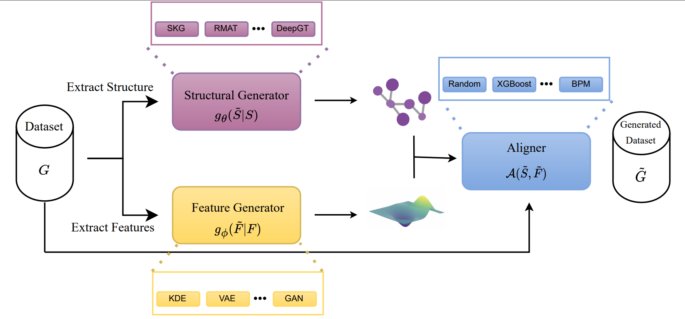
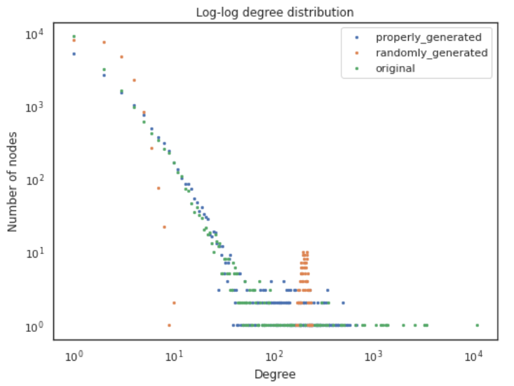
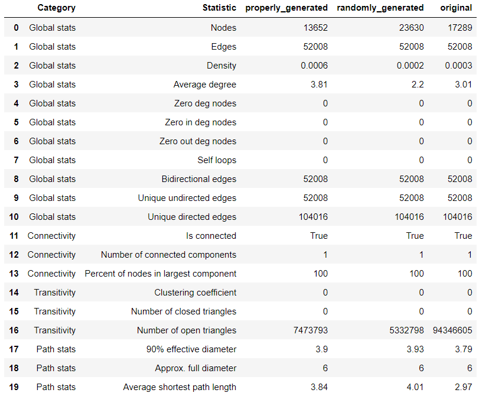
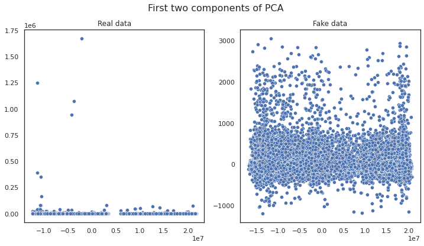
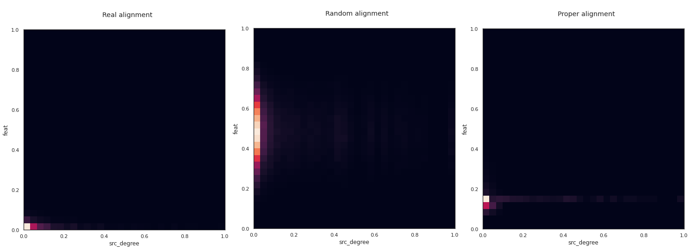

# Synthetic Graph Generation

This repository implements a tool for generating graphs with an arbitrary size, including node and edge tabular features.

## Table Of Contents
- [Solution overview](#solution-overview)
  * [Synthetic Graph Generation architecture](#synthetic-graph-generation-architecture)
  * [Default configuration](#default-configuration)
  * [Feature support matrix](#feature-support-matrix)
      * [Features](#features)
  * [Models](#models)
- [Setup](#setup)
  * [Requirements](#requirements)
- [Quick Start Guide](#quick-start-guide)
- [Advanced](#advanced)
  * [Repository structure](#repository-structure)
  * [Important scripts and files](#important-scripts-and-files)
  * [Parameters](#parameters)
  * [Command-line options](#command-line-options)
  * [Define the synthesizer pipeline](#define-the-synthesizer-pipeline)
  * [Getting the data](#getting-the-data)
    + [List of datasets](#list-of-datasets)
- [Performance](#performance)
  * [Results](#results)
- [Release notes](#release-notes)
  * [Changelog](#changelog)
  * [Known issues](#known-issues)
- [Reference](#reference)
  * [Cite](#cite)

## Solution overview

Synthetic data generation has become pervasive with imploding amounts of data and demand to deploy machine learning models leveraging such data. There has been an increasing interest in leveraging graph-based neural network model on graph datasets, though many public datasets are of a much smaller scale than that used in real-world applications. Synthetic Graph Generation is a common problem in multiple domains for various applications, including the generation of big graphs with similar properties to original or anonymizing data that cannot be shared. The Synthetic Graph Generation tool enables users to generate arbitrary graphs based on provided real data.

### Synthetic Graph Generation architecture

The tool has the following architecture.



The module is composed of three parts: a structural generator, which fits the graph structure, feature generator, which fits the feature distribution contained in the graph; and finally, an aligner, which aligns the generated features with the generated graph structure

#### Graph structural generator

The graph structural generator fits graph structure and generate a corresponding graph containing the nodes and edges.

#### Feature generator

The feature generator fits the feature distribution contained in the graph and generates the corresponding features.
There is the option to allow users to generate features associated with nodes, edges, or both.

#### Aligner

The aligner aligns the generated features taken from the feature generator with the graph structure generated by a graph structural generator.

### Default configuration

By default, the synthetic graph generation tool generates a random graph with random features specified by the user.

### Feature support matrix

This tool supports the following features:

| Feature                      | Synthetic Graph Generation |
|------------------------------|----------------------------|
| Non-partite graph generation | Yes                        |
| Bipartite graph generation   | Yes                        |
| N-partite graph generation   | No                         |
| Undirected graph generation  | Yes                        |
| Directed graph generation    | Yes                        |
| Self-loops generation        | Yes                        |
| Edge features generation     | Yes                        |
| Node features generation     | Yes                        |

#### Features

* Non-partite graph generation is a task to generate a graph that doesn't contain any explicit partites (disjoint and independent sets of nodes).

* Bipartite graph generation is a task to generate a graph that consists of two partites.

* N-partite graph generation is a task to generate a graph that consists of an arbitrary number of partites.

* Undirected graph generation is a task to generate a graph made up of a set of vertices connected by not ordered edges.

* Directed graph generation is a task to generate a graph made up of a set of vertices connected by directed edges.

* Self-loops generation is a task to generate edges that connect a vertex to itself.

* Edge features generation is a task to generate features associated with an edge.

* Node features generation is a task to generate features associated with a node.


### Models

Structural graph generation
```
- RMAT
- Random (Erdos-Renyi)
```

Tabular features
```
- CTGAN (Conditional GAN)
- CTAB
- KDE
- Gaussian
- Random (Uniform)
```

Aligner
```
- XGBoost
- Random
```

## Setup

The following section lists the requirements you need to run the Synthetic Graph Generation tool.

### Requirements

This repository contains a Dockerfile that extends the PyTorch NGC container and encapsulates some dependencies. Aside from these dependencies, ensure you have the following components:
- [NVIDIA Ampere Architecture](https://www.nvidia.com/en-us/data-center/nvidia-ampere-gpu-architecture/), [NVIDIA Volta](https://www.nvidia.com/en-us/data-center/volta-gpu-architecture/) or [NVIDIA Turing](https://www.nvidia.com/en-us/geforce/turing/) based GPU
- [NVIDIA Docker](https://github.com/NVIDIA/nvidia-docker)
- Custom Docker containers built for this tool. Refer to the steps in the [Quick Start Guide](#quick-start-guide).

For more information about how to get started with NGC containers, refer to the following sections from the NVIDIA GPU Cloud Documentation and the Deep Learning Documentation:
-   [Getting Started Using NVIDIA GPU Cloud](https://docs.nvidia.com/ngc/ngc-getting-started-guide/index.html)
-   [Accessing And Pulling From The NGC Container Registry](https://docs.nvidia.com/deeplearning/frameworks/user-guide/index.html#accessing_registry)

For those unable to set up the required environment or create your own container, refer to the versioned [NVIDIA Container Support Matrix](https://docs.nvidia.com/deeplearning/frameworks/support-matrix/index.html).


## Quick Start Guide

### Getting Started

To use the tool, perform the following steps.
For the specifics concerning generation and training, refer to the [Advanced section](#advanced).


1. Clone the repository.
```
git clone https://github.com/NVIDIA/DeepLearningExamples
```

2. Go to the `SyntheticGraphGeneration` tool directory within the `DeepLearningExamples` repository:
```
cd DeepLearningExamples/Tools/DGLPyTorch/SyntheticGraphGeneration
```

3. Build the SyntheticGraphGeneration container.
```
bash docker_scripts/build_docker.sh
```

4. Download the datasets. (It is advisable to run this command inside docker interactive container to ensure environment setup, see 6.1)

```
bash scripts/get_datasets.sh
```

**Note**: This script requires a manual download of 4 datasets (tabformer, ieee, paysim, credit) and putting them into `./data` directory with the correct naming. The instruction for the manual download will be printed during the preprocessing. If the raw data is not present or the dataset is already preprocessed, the preprocessing will be skipped.
5. Run the SyntheticGraphGeneration Jupyter notebook.

5.1. Run the Docker notebook container.
```
bash docker_scripts/run_docker_notebook.sh
```

5.2 Open Jupyter notebook.
```
http://localhost:9916/tree/demos
```

6. Run the SyntheticGraphGeneration CLI.

6.1. Run the Docker interactive container.
```
bash docker_scripts/run_docker_interactive.sh
```

6.2. Run Command Line Interface (CLI) command.

The tool contains two run commands: `synthesize` and `pretrain`

For example, to synthesize a graph similar to the [IEEE](https://www.kaggle.com/c/ieee-fraud-detection) dataset, run the following command:

```
syngen synthesize \
--synthesizer static_bipartite_graph \
--preprocessing ieee \
--aligner xg_boost \
--graph-generator rmat_bipartite \
--gg-seed 42 \
--edge-generator ctgan \
--eg-batch-size 2000 \
--eg-epochs 10 \
--num-nodes-src-set 17091 \
--num-nodes-dst-set 198 \
--num-edges-src-dst 52008 \
--num-edges-dst-src 52008 \
--data-path '/workspace/data/ieee-fraud/data.csv' \
--save-path '/workspace/ieee/' \
--features-to-correlate-edge "{\"TransactionAmt\": \"continuous\"}"
```

In this example run, a graph of similar size as the IEEE dataset is generated using the fitted synthesizer.

**Note**: In the above command, the `static_bipartite_graph` synthesizer is used, along with `ctgan` as the edge-generator and `xg_boost` aligner for assigning features to nodes. Accordingly, `--data-path` points to the location where the IEEE dataset is extracted, and `--save-path` points to the location where the generated data is saved.

Following the above command, the `pretrain` command can be used to pre-train or fine-tune the given generated sample. 

```
syngen pretrain \
--model gat_ec \
--hidden-dim 64 \
--out-dim 32 \
--n-layers 1 \
--n-heads 2 \
--weight-decay 0.0 \
--learning-rate 0.0005 \
--batch-size 256 \
--pretrain-epochs 5 \
--finetune-epochs 5 \
--data-path '/workspace/data/ieee-fraud/data.csv' \
--pretraining-path '/workspace/ieee/' \
--preprocessing ieee \
--task ec \
--target-col isFraud \
--num-classes 2
```

**Note**: The current set of tasks and models are solely provided as use case examples on how to use the generated synthetic data to pretrain/fine-tune on a downstream task, and generally would need extension/modifications to accomodate very large graphs or arbitrary models.

For the complete CLI usage of the `synthesize` command run:

```
syngen synthesize --help
```

Similarly for the `pretrain` command run:

```
syngen pretrain --help
```

## Advanced

### Repository structure

```
.
├── demos            # Directory with all the Jupyter examples
├── docker_scripts   # Directory with Docker scripts
├── scripts          # Directory with datasets scripts
├── syngen              # Directory with Synthetic Graph Generation source code
│  ├── analyzer             # Directory with tools for getting graph visualisation and statistics
│  │   ├── graph                    # Directory with graph structure analyzer
│  │   └── tabular                  # Directory with tabular features analyzer
│  ├── benchmark            # Directory with pretraining tools
│  │   ├── data_loader              # Directory with pre-defined node and edge classification datasets
│  │   ├── models                   # Directory with GNN model definitions
│  │   └── tasks                    # Directory with set of tasks that are supported for training
│  ├── generator            # Directory with all the generators
│  │   ├── graph                    # Directory with graph generators and graph
│  │   ├── tabular                  # Directory with tabular generators
│  │   |   ├── data_transformer         # Directory with tabular data transformations used by generators
│  │   |   └── transforms               # Directory with tabular column transforms
│  ├── graph_aligner      # Directory with all the aligners
│  ├── preprocessing        # Directory with the preprocessings for the supported datasets
│  │   └── datasets                 # Directory with example dataset preprocessing scripts used to generate data
│  ├── synthesizer          # Directory with all the synthesizers
│  └── utils                # Directory with the utilities
│      └── types                    # Directory with common data types used in the tool
```


### Important scripts and files
* `scripts/get_datasets.sh` - Bash script downloading and preprocessing supported datastes
* `docker_scripts/build_docker.sh` - Bash script that builds the Docker image
* `docker_scripts/run_docker_notebook.sh` - Bash script that runs Jupyter notebook in the Docker container
* `docker_scripts/run_docker_interactive.sh` - Bash script that runs the Docker container in interactive mode
* `syngen/__main__.py` - Python script that defines Synthetic Graph Generation CLI
* `syngen/synthesizer/static_graph_synthesizer.py` - Python file with non-partite graph synthesizer
* `syngen/synthesizer/static_bipartite_graph_synthesizer.py` - Python file with bipartite graph synthesizer

### Parameters

For the synthesizer, refer to the parameters in the following table.

| Scope      | parameter                                                | Comment                                                                                                                                                                                                                            | Default Value     |
|------------|----------------------------------------------------------|------------------------------------------------------------------------------------------------------------------------------------------------------------------------------------------------------------------------------------|-------------------|
| synthesize | -s &#124; --synthesizer SYNTHESIZER                      | Synthesizer to use. Available synthesizers: ['static_bipartite_graph', 'static_graph', 'random']                                                                                                                                   | Required          |
| synthesize | -dp &#124; --data-path DATA_PATH                         | Path to dataset                                                                                                                                                                                                                    | None              |
| synthesize | -pp &#124; --preprocessing PREPROCESSING                 | Preprocessing object to use, add custom preprocessing to datasets available datasets: ['cora', 'paysim', 'credit', 'tabformer', 'ieee', 'ratings']                                                                                 | None              |
| synthesize | -sp &#124; --save-path SAVE_PATH                         | Save path to dump generated files                                                                                                                                                                                                  | Current directory |
| synthesize | -a &#124; --aligner ALIGNER                              | Aligner to use. Available aligners: ['random', 'xg_boost']                                                                                                                                                                         | None              |
| synthesize | -gg &#124; --graph-generator GRAPH_GENERATOR             | Graph generator to use to generate graph structure ['rmat', 'rmat_bipartite', 'random_graph', 'random_bipartite']                                                                                                                  | None              |
| synthesize | -eg &#124; --edge-generator EDGE_GENERATOR               | Edge generator to use to generate edge features ['kde', 'kde_sk', 'uniform', 'gaussian', 'ctgan']                                                                                                                                  | None              |
| synthesize | -ng &#124; --node-generator NODE_GENERATOR               | Node generator to use to generate node features ['kde', 'kde_sk', 'uniform', 'gaussian', 'ctgan']                                                                                                                                  | None              |
| synthesize | --num-workers NUM_WORKER                                 | Number of workers                                                                                                                                                                                                                  | 1                 |
| synthesize | --num-nodes-src-set NUM_NODES_SRC_SE                     | Number of nodes to generate in the source set. Applies to `StaticBipartiteGraphSynthesizer`.                                                                                                                                       | None              |
| synthesize | --num-nodes-dst-set NUM_NODES_DST_SE                     | Number of nodes to generate in the destination set. Applies to `StaticBipartiteGraphSynthesizer`.                                                                                                                                  | None              |
| synthesize | --num-edges-src-dst NUM_EDGES_SRC_DS                     | Number of edges to generate from the source set to the destination set. Applies to `StaticBipartiteGraphSynthesizer`.                                                                                                              | None              |
| synthesize | --num-edges-dst-src NUM_EDGES_DST_SR                     | Number of edges to generate from the destination set to the source set. Applies to `StaticBipartiteGraphSynthesizer`.                                                                                                              | None              |
| synthesize | --num-nodes NUM_NODE                                     | Number of nodes to generate for non-partite synthesizer. Applies to `StaticGraphSynthesizer`.                                                                                                                                      | None              |
| synthesize | --num-edges NUM_EDGE                                     | Number of edges to generate for non-partite synthesizer. Applies to `StaticGraphSynthesizer`.                                                                                                                                      | None              |
| synthesize | --edge-dim EDGE_DIM                                      | Edge feature dimension to generate. Applies to `RandomSynthesizer`                                                                                                                                                                 | None              |
| synthesize | --g-bipartite G_BIPARTITE                                | Generates random bipartite graph. Applies to `RandomSynthesizer`                                                                                                                                                                   | None              |
| synthesize | --node-dim NODE_DIM                                      | Node feature dimension to generate. Applies to `RandomSynthesizer`                                                                                                                                                                  | None              |
| synthesize | --features-to-correlate-node FEATURES_TO_CORRELATE_NODES | Node feature columns to use to train `XGBoostAligner`. Must be provided in a dict format {<feature-column-name>: <column-type>}, where <column-type> is an enum of type `ColumnType` (refer to syngen/utils/types/column_type.py). | None              |
| synthesize | --features-to-correlate-edge FEATURES_TO_CORRELATE_EDGES | Edge feature columns to use to train `XGBoostAligner`. Must be provided in a dict format {<feature-column-name>: <column-type>}, where <column-type> is an enum of type `ColumnType` (refer to syngen/utils/types/column_type.py). | None              |

For the pretraining refer to the [Command-line options](#command-line-options), as the parameters depend on the model choice.

### Command-line options

To display the full list of available options and their descriptions, use the `-h` or `--help` command-line option:
```
syngen --help
```

The tool currently support the `synthesize` and `pretrain` commands. To display the full list of available options for the respective command run:

```
syngen <command> --help
```

### Define the synthesizer pipeline

In this example, we show how to define the synthesizer pipeline for [IEEE](https://www.kaggle.com/c/ieee-fraud-detection) dataset. A full example can be found in [ieee_notebook](./demos/advanced_examples/e2e_ieee_demo.ipynb).

#### Prepare synthesizer

- Feature generator is used to generate tabular features. For the final graph, we use only edge features as there are no node features in the IEEE dataset. In this example, we use the CTGAN generator.  
```
edge_feature_generator = CTGANGenerator(epochs=10, batch_size=2000, verbose=False)
```

- Structure generator is used to generate graph structure. In this example, we use RMAT implementation

```
static_graph_generator = RMATBipartiteGenerator()
```

- Preprocessing is required for all datasets to work. For custom datasets, users need to create their own preprocessing following the base API. In the repository, we provide implementations for all the supported datasets.

```
preprocessing = IEEEPreprocessing(cached=False)
```

- Aligner is necessary to properly align generated structure with tabular features, as those two processes are independent of each other. In this example, we use an XGBoost aligner and specify which features to correlate to which structure.
```
graph_aligner = XGBoostAligner(features_to_correlate_edge={'TransactionAmt': ColumnType.CONTINUOUS})
```

- Synthesizer is a class that combines all the generators and allows the user to run end-to-end fitting and generation. We use `StaticBipartiteGraphSynthesizer` because ieee is a bipartite dataset. To select whether to run the computation on GPU or not, use the `gpu` flag. By setting `is_directed=True`, we say that the graph is undirected.

```
synthesizer = StaticBipartiteGraphSynthesizer(
                                    graph_generator=static_graph_generator,
                                    graph_info=preprocessing.graph_info,
                                    edge_feature_generator=edge_feature_generator,
                                    graph_aligner=graph_aligner,
                                    is_directed=False,
                                    gpu=True)
```

#### Generate graph

- To generate a graph, first we need to extract graph data (structure and features) from the preprocessing. This can be done by calling provided `.transform` method on the dataset path. 
```
data = preprocessing.transform(dataset_path)
```

- To run fitting for all the generators, we use the `fit` method provided by the synthesizer. We pass only edge_data as ieee is a bipartite dataset with edge features only.
```
synthesizer.fit(edge_data=data[MetaData.EDGE_DATA])
```

- To run generation, we call the `generate` method provided by the synthesizer. We can provide the number of nodes in both partites and the number of edges for each direction. In our case, this is the same number because we specified that we have an undirected graph during synthesizer instantiation.
```
data_proper = synthesizer.generate(num_nodes_src_set,
                                   num_nodes_dst_set,
                                   num_edges_src_dst,
                                   num_edges_dst_src)
```

### Getting the data

To download the datasets used as an example , use `get_datasets.sh` script

```
bash scripts/get_datasets.sh
```

**Note**: Certain datasets require a Kaggle API key, hence may require manual download. Refer to the links below.
**Note**: Each user is responsible for checking the content of datasets and the applicable licenses and determining if they are suitable for the intended use

#### List of datasets


Supported datasets:

* [Twitch](https://snap.stanford.edu/data/twitch_gamers.html)
* [LastFM](https://snap.stanford.edu/data/feather-lastfm-social.html)
* [Orkut](https://snap.stanford.edu/data/com-Orkut.html)
* [Tabformer](https://github.com/IBM/TabFormer)
* [IEEE](https://www.kaggle.com/c/ieee-fraud-detection)
* [Paysim](https://www.kaggle.com/datasets/ealaxi/paysim1)
* [Credit](https://www.kaggle.com/datasets/kartik2112/fraud-detection)
* [CORA](https://relational.fit.cvut.cz/dataset/CORA)
* [Rating](http://www.trustlet.org/downloaded_epinions.html)


## Performance

Our results were obtained by running the demo notebooks [directory](./demos) in the PyTorch NGC container on NVIDIA DGX1 V100 with 8x V100 32GB GPUs.
All the notebooks are presented in the table below.

|     | scope             | notebook                              | description                                                                                         |
|-----|-------------------|---------------------------------------|-----------------------------------------------------------------------------------------------------|
| 1.  | basic_examples    | er_demo.ipynb                         | generating different types of random graphs using Erdős–Rényi model                                 |
| 2.  | basic_examples    | ieee_demo.ipynb                       | generating a bipartite graph structure based on provided edge list                                  |
| 3.  | basic_examples    | cora_demo.ipynb                       | generating a non-bipartite graph structure based on provided edge list                              |                                                                |
| 4.  | advanced_examples | e2e_cora_demo.ipynb                   | a complete process of reconstructing and analyzing a non-bipartite graph dataset with node features |
| 5.  | advanced_examples | e2e_ieee_demo.ipynb                   | a complete process of reconstructing and analyzing a bipartite graph dataset with edge features     |
| 6.  | advanced_examples | frechet_lastfm_demo.ipynb             | SynGen non-bipartite graph structure generators scaling analysis                                    |
| 7.  | advanced_examples | frechet_tabformer_demo.ipynb          | SynGen bipartite graph structure generators scaling analysis                                        |
| 8.  | advanced_examples | edge_classification_pretraining.ipynb | using synthetic data from SynGen for GNN pretraining                                                |
| 9.  | performance       | struct_generator.ipynb                | comparison of SynGen graph structure generators                                                     |
| 10. | performance       | tabular_generator.ipynb               | comparison of SynGen tabular data generators                                                        |

Scope refers to the directories in which the notebooks are stored and the functionalities particular notebooks cover . There are
* Basic - [basic_examples](./demos/basic_examples) - notebooks with the examples of basics functionalities
* Advanced - [advanced_examples](./demos/advanced_examples) - notebooks with the examples of advanced functionalities
* Performance - [performance](./demos/performance) - notebooks with the performance experiments

To achieve the same results, follow the steps in the [Quick Start Guide](#quick-start-guide).

#### Results

##### 1. Quality of the content of generated dataset vs. original dataset:


The quality of the content comparison was conducted on the IEEE dataset (refer to  [List of datasets](#list-of-datasets) for more details) with corresponding notebook [e2e_ieee_demo.ipynb](./demos/advanced_examples/e2e_ieee_demo.ipynb)
We compared three modalities, that is, quality of generated graph structure, quality of generated tabular data and quality of aligning tabular data to the graph structure.

* Graph structure quality
  * Comparison of degree distribution for an original graph, properly generated and random (Erdős–Rényi) 
  * Comparison of basic graph statistics for an original graph, properly generated and random (Erdős–Rényi) 

* Tabular data quality
  * Comparison of two first components of a PCA of real and generated data 
  * Comparison of basic statistics between real and generated data
    
    | Generator  | kl divergence | correlation correlation |
    |------------|---------------|-------------------------|
    | GAN        | 0.912         |  0.018                  |
    | Gaussian   | 0.065         | -0.030                  |
    | Random     | 0.617         |  0.026                  |

* Structure to tabular alignment quality
  * Degree centrality for feature distribution 

##### 2. Performance (speed) of the synthetic dataset generation:
  * Performance of graph structure generation (edges/s)
    
  * Performance of categorical tabular data generation (samples/s)
    
    | Dataset | KDE     | KDE_SK  | Uniform | Gaussian | CTGAN |
    |---------|---------|---------|---------|----------|-------|
    | ieee    | 1420600 | 2640973 | 1768136 | 1509729  | 33202 |
    
                  
##### 3. Synthetic dataset use-case specific quality factors:
  * Performance (batches/s) comparison between original vs. synthetic datasets

    | Dataset | Model | Synthetic | Original |
    |---------|-------|-----------|----------|
    | ieee    | gat   | 0.07173   | 0.07249  |

## Release notes

### Changelog

January 2023
- Initial release

### Known issues

There are no known issues with this model.

## Reference

### Cite

Cite the following paper if you find this code useful or use it in your own work:

```
@article{darabi2022framework,
  title={A Framework for Large Scale Synthetic Graph Dataset Generation},
  author={Darabi, Sajad and Bigaj, Piotr and Majchrowski, Dawid and Morkisz, Pawel and Fit-Florea, Alex},
  journal={arXiv preprint arXiv:2210.01944},
  year={2022}
}
```
